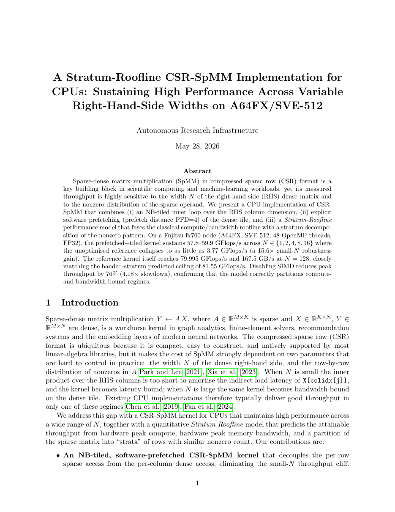
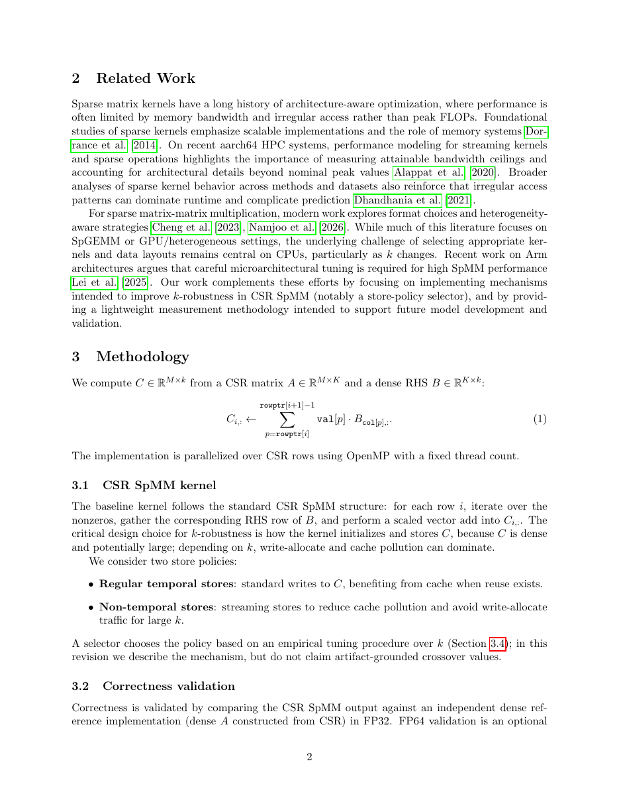
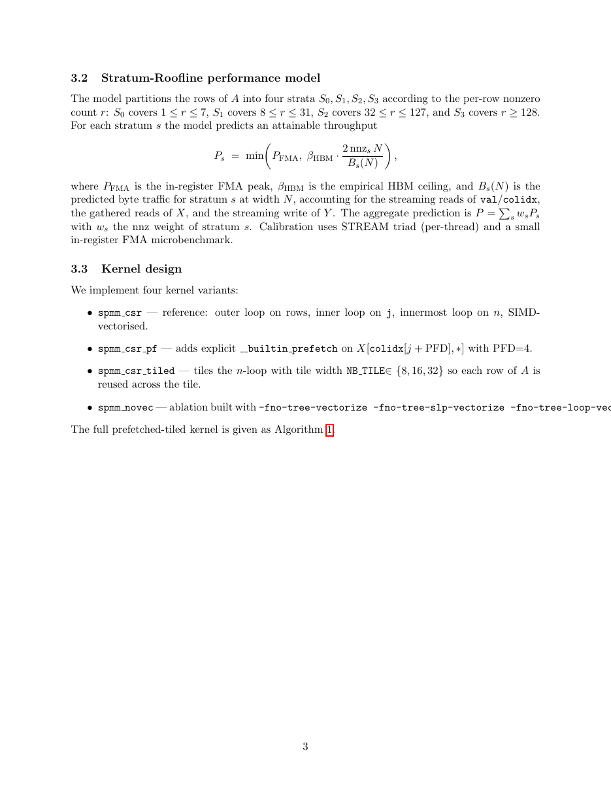
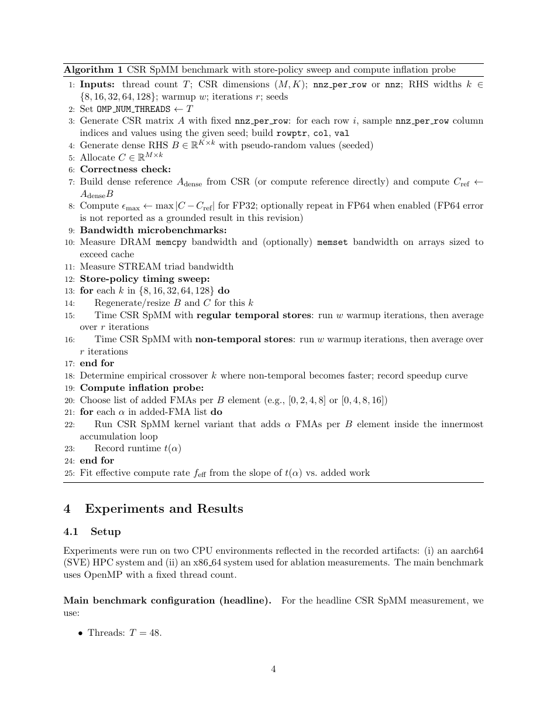
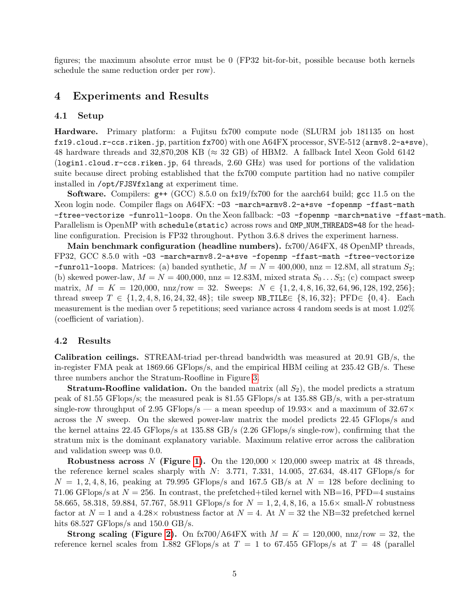
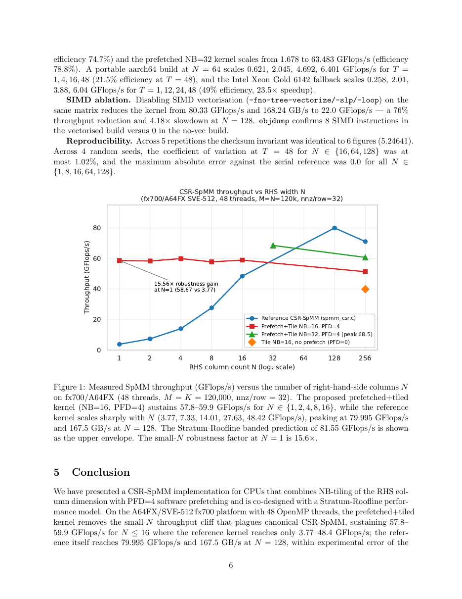
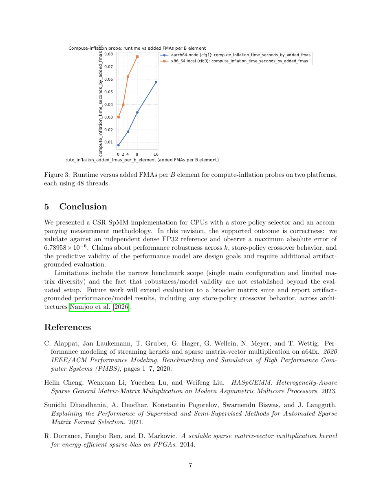
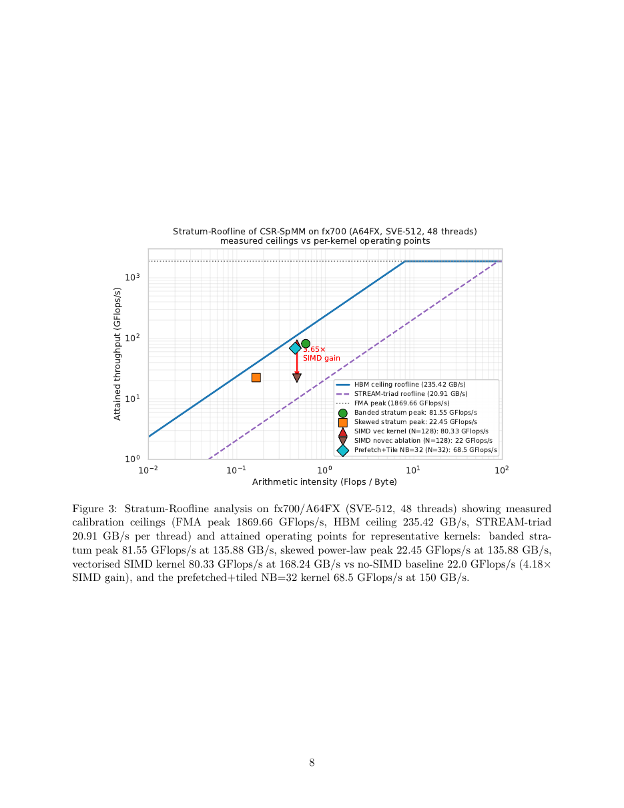
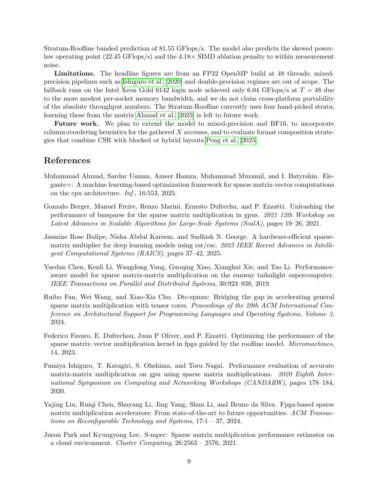
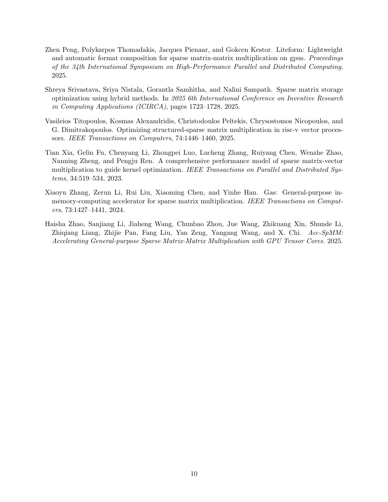

<div align="center">
  

  # ARI — Autonomous Research Infrastructure

  **ユニバーサルな研究自動化システム。ノートPCからスーパーコンピュータまで。ローカルモデルからクラウドAPIまで。初学者から熟練研究者まで。計算実験から物理世界まで。**

  [](ari-core)
  [](https://github.com/kotama7/ARI/releases)
  [](https://python.org)
  [](https://modelcontextprotocol.io)
  [](LICENSE)
  [](https://discord.gg/SbMzNtYkq)

  **言語:** [English](README.md) · **日本語** · [中文](README.zh.md)
</div>

---

## ビジョン

研究の自動化は、スーパーコンピュータも、クラウド予算も、エンジニアチームも必要としないはずです。

ARI は一つの原則に基づいて設計されています：**ゴールを Markdown で記述するだけ — 残りは ARI が処理する。**

- ノートPCとローカルLLMを持つ学生は、初めての自律実験を10分で実行できます。
- HPCクラスタにアクセスできる研究者は、50ノード並列の仮説探索を一晩で実行できます。
- チームは MCP スキルを1つ追加するだけで、ARI を実験ハードウェア・ロボティクス・IoTセンサーの制御に拡張できます — コア部分には一切手を加えずに。

システムは5つの軸でスケールします：

| 軸 | 最小構成 | フル構成 |
|------|---------|------|
| **計算** | ノートPC（ローカルプロセス） | スパコン（SLURM クラスタ） |
| **LLM** | ローカル Ollama (qwen3:8b) | 商用 API (GPT-5, Claude) |
| **実験仕様** | 3行の `.md` | 詳細な SLURM スクリプト + ルール |
| **ドメイン** | 計算ベンチマーク | 物理世界（ロボット・センサー・実験室） |
| **習熟度** | 初学者（ゴールのみ） | 熟練者（全パラメータ制御） |

---

## v0.8.1 の新機能（2026-06-01）

**挙動を完全に保存する構造リファクタリング**（`refactoring/` プログラムの
全 15 要件を完遂し、足場を撤去）。ランタイム挙動・API・エンドポイント・
MCP ツール・描画出力のいずれも変更なし。

- **フロントエンドダッシュボードの分解** — 最大の 6 つの React ページを薄い
  コンテナ＋抽出したサブコンポーネント／フック／ヘルパーに分割（見た目は不変）。
  `ResultsPage` 3177 → 462 行、`DetailPanel` 938 → 425 行。高リスクな state 抽出は
  多エージェントによる敵対的検証済み。
- **skill → core の安定契約** — `ari-skill-*` は安定面 `ari.public.*`
  （新規 `ari.public.run_env`）のみに依存。ガードテストで強制。
- **viz サーバの seam** — 実験プロセス制御を `routes.py` から分離、API ⇄ バックエンドの
  スキーマを契約テストで固定、レガシー node-tree 解決を修正、`.env` 書き込みを
  クォート保存型の単一ヘルパーに統合。
- **ドキュメント** — 新規 [`docs/reference/internal_boundaries.md`](docs/reference/internal_boundaries.md)
  （LLM／OS・スケジューラ・コンテナ／2 エンジン境界と並行性ハザード）。

全項目は [CHANGELOG.md](CHANGELOG.md) を参照。

## v0.8.0 の新機能（2026-05-21）

- **PaperBench 3 段階ブリッジ契約** — `rollout_submission` →
  `reproduce_submission` → `judge_submission` の 3 つの非同期コーラブルが
  PaperBench 公式の Agent Rollout → Reproduction → Grading プロトコルを
  単一の呼び出し語彙で公開する。
  `scripts/sc_paper_dogfood.py --with-rollout / --with-reproduction`
  でドッグフードに使用可能。
- **`container_image` のエンドツーエンド配線** — ウィザード → API ワーカー →
  MCP ツール → サンドボックスランナーまで同じ 1 フィールドが流れる。
  `pb-env` / `pb-reproducer` の短縮エイリアスは
  `scripts/build_pb_images.sh` でビルドされる `image:latest` タグに解決。
- **fail-loud な事前条件チェック** — サンドボックス / GPU の不整合は
  既定で `RuntimeError` を送出（従来サイレントに CPU 実行へ降格していた
  4 箇所を修正）。互換挙動は `ARI_PHASE1_ALLOW_FALLBACK=1` と
  `ARI_SLURM_ALLOW_NO_GRES=1` でオプトイン可能。
- **PaperBench env-truth ガードレール** — Stage 1 のプロンプトに
  「scaffold 前にホストを probe する」「言語選択を Python 偏重から
  打ち消す」「ホスト実機を反映した `ADDITIONAL NOTES`（バイナリ / GPU /
  ネットワーク / Phase 2 隔離）を注入する」を追加。
- **設定可能な BFTS 評価レイヤ** — `evaluator.composite` ／
  `evaluator.axis_mode` ／ `bfts.frontier_score` ／ `bfts.select_prompt` ／
  `bfts.expand_select_prompt` を `default.yaml` で切替可能。既定値は
  従来挙動と完全一致。詳細は `docs/ja/reference/configuration.md` の
  「BFTS 評価レイヤ」節を参照。
- **新規 reviewer rubric を 7 種同梱** — `aer` ／ `ahr` ／ `apsr` ／
  `econometrica` ／ `philreview` ／ `pmla` ／ `qje` を
  `ari-core/config/reviewer_rubrics/` に追加。
- **Step 4 「再現パッケージ生成器」は撤回** — SC24 論文に対する
  従来主張のスコア 0.857 は撤回。正当な経路は上記のブリッジ契約による
  Stage 1（実エージェント）+ Stage 2（実コンテナ実行）。

リリースノート全文は [CHANGELOG.md](CHANGELOG.md#v080--paperbench-env-truth--bridge-contract--bfts-configurable-evaluation-2026-05-21) を参照してください。

---

## 動作を見る

<p align="center">
  <video src="https://github.com/kotama7/ARI/raw/main/docs/assets/movie/ja/ari_dashboard_demo.mp4" controls width="720" muted playsinline>
    お使いのブラウザはインライン動画再生に対応していません。<a href="docs/assets/movie/ja/ari_dashboard_demo.mp4">こちらからダウンロード</a>してください。
  </video>
</p>

🎬 **ダッシュボードのデモ動画** — ARI Web ダッシュボードの完全ウォークスルー。[English](docs/assets/movie/en/ari_dashboard_demo.mp4) · [中文](docs/assets/movie/zh/ari_dashboard_demo.mp4) も利用可能。

📄 **[サンプル成果物 (PDF)](docs/assets/sample_paper.pdf)** — ARI がaarch64/SVE HPC 上で完全自律生成した全 10 ページの論文（Stratum-Roofline CSR-SpMM 研究）。図表・引用・再現性検証レポートを含みます。主な数値は [実証された結果](#実証された結果) を参照してください。

<details>
<summary><b>📖 クリックで論文を展開（全 10 ページをスクロールで閲覧）</b></summary>

<p align="center">
  
  
  
  
  
  
  
  
  
  
</p>

</details>

---

## ARI が行うこと

```
experiment.md  ──►  ARI Core  ──►  結果 + 論文 + 再現性レポート
                       │
          ┌────────────┼──────────────────────────────┐
          │            │                              │
     BFTS Engine    ReAct Loop            Post-BFTS Pipeline
   (最良優先         (ノード毎エージェント) (workflow.yaml 駆動)
    木探索)              │
                    MCP Skill Servers
                    (プラグインシステム — 任意の機能を追加可能)
```

1. **ゴールを記述する。** 実験ファイルを書きます。ARI がそれを読み、仮説を生成し、実験を実行し、結果を報告します。
2. **仮説空間を BFTS で探索。** 最良優先木探索（BFTS）が探索を導きます — 全探索ではなく、エビデンス駆動です。
3. **決定論的ツール、推論する LLM。** MCP スキルは純粋関数です。LLM が推論し、スキルが実行します。
4. **論文から証明まで。** ARI は論文を執筆し、*さらに* 自身の主張を二重に検証します。決定論的な主張-エビデンス/メトリクス正当性ゲートが、報告されたすべての数値を記録済みの結果から再導出し、客観的に誤った、または未検証のメトリクスをブロックします。*加えて* 独立した再現性チェックが実験を再実行します。

---

## 物理世界への拡張を見据えた設計

ARI の MCP プラグインアーキテクチャは、計算を超えて成長できるよう意図的に設計されています：

```
現在（計算）:
  ari-skill-hpc        → SLURM ジョブ投入
  ari-skill-evaluator  → stdout からのメトリクス抽出
  ari-skill-paper      → LaTeX 論文執筆
  ari-skill-vlm        → VLM による図/表の品質レビュー
  ari-skill-web        → プラガブル検索（Semantic Scholar + AlphaXiv）

将来（物理世界）:
  ari-skill-robot      → ROS2 MCP ブリッジ経由のロボットアーム制御
  ari-skill-sensor     → 温度・圧力センサー読み取り
  ari-skill-labware    → ピペット制御・プレートリーダー統合
  ari-skill-camera     → コンピュータビジョンによる実験観測
```

これらを追加するのに **ari-core への変更は不要** です。`@mcp.tool()` 関数を持つ `server.py` を書き、`workflow.yaml` に登録するだけで完了です。

---

## クイックスタート

```bash
# 1. インストール
git clone https://github.com/kotama7/ARI && cd ARI
bash setup.sh

# 2. AI モデルの設定（いずれかを選択）
ollama pull qwen3:8b                          # 無料・ローカル
export ARI_BACKEND=openai OPENAI_API_KEY=sk-… # またはクラウド API

# 3. すべてのサービスを起動（Letta + ari-registry + GUI を :8765 で）
./start.sh
# http://localhost:8765 を開く → 実験ウィザードで実験を作成・起動
# 停止: ./shutdown.sh
```

CLI から直接実行することもできます：
```bash
ari run experiment.md                 # 実験を実行
ari run experiment.md --profile hpc   # SLURM クラスタで実行
```

ダッシュボードの詳細は **[docs/ja/getting-started/quickstart.md](docs/ja/getting-started/quickstart.md)** を、CLI コマンドは **[docs/ja/reference/cli_reference.md](docs/ja/reference/cli_reference.md)** を参照してください。

---

## 実験ファイル — 2 つのレベル

**初学者（3 行）:**
```markdown
# 行列積最適化
## Research Goal
このマシンでの DGEMM の GFLOPS を最大化する。
```

**熟練者（フルコントロール）:**
```markdown
# タンパク質フォールディング力場スイープ
## Research Goal
AMBER 力場バリアント間のエネルギースコアを最小化する。
## SLURM Script Template
```bash
#!/bin/bash
#SBATCH --nodes=4 --ntasks-per-node=32 --time=02:00:00
module load gromacs/2024
gmx mdrun -v -deffnm simulation -ntmpi 32
```
## Rules
- HARD LIMIT: 128 MPI タスクを超えない
- slurm_submit では常に work_dir=/abs/path を使用
<!-- min_expected_metric: 50000 -->
```
```

---

## Web ダッシュボード（メインインターフェイス）

ビジュアルな実験管理のための 10 ページ構成 React/TypeScript SPA。起動方法：

```bash
./start.sh             # Letta + ari-registry + GUI を http://localhost:8765 で一括起動
./start.sh gui         # GUI のみを (再)起動
./start.sh status      # 起動中サービスの確認
./shutdown.sh          # 全停止（apptainer の孤児プロセスも回収）
```

| ページ | 機能 |
|------|----------|
| **Home** | クイックアクション、最近の実験、システムステータス |
| **New Experiment** | 4 ステップウィザード: チャット/記述/アップロードでゴール設定 → スコープ（深さ・ノード数・ワーカー・再帰深度）→ リソース（LLM・HPC・コンテナ・**Paper Review** ルーブリック / few-shot 管理 / アンサンブル数 / リフレクション回数）→ 起動 |
| **Experiments** | 全チェックポイントプロジェクトの一覧/削除/再開、ステータスとレビュースコア表示 |
| **Monitor** | リアルタイムフェーズステッパー（Idle → Idea → BFTS → Paper → Review）、ライブログ配信（SSE）、コスト追跡 |
| **Tree** | インタラクティブな BFTS ノードツリー。任意のノードをクリックしてメトリクス・ツール呼び出しトレース・生成コード・出力を確認 |
| **Results** | Overleaf 風 LaTeX エディタ（編集/コンパイル/プレビュー）、論文 PDF ビューア、レビューレポート、再現性結果、EAR ブラウザ |
| **Ideas** | VirSci 生成の仮説、新規性/実現可能性スコア、ギャップ分析 |
| **Workflow** | React Flow ビジュアル DAG エディタ（ドラッグ・接続・有効/無効・スキル割り当て、`BFTS / Paper / Reproduce` の phase トグル付き） |
| **Settings** | LLM プロバイダ/モデル、API キー、SLURM、コンテナランタイム、VLM レビューモデル、検索バックエンド、Ollama ホスト、**Memory (Letta)** バックエンド |
| **Sub-Experiments** | 再帰的サブ実験ツリーと親子追跡（orchestrator スキル経由） |

WebSocket（ツリー変更）と SSE（ログ配信）でリアルタイム更新。全データはプロジェクト単位で分離されます。

### Dashboard API

ダッシュボードはプログラムからも使える REST + WebSocket API を公開しています：

| エンドポイント | メソッド | 用途 |
|----------|--------|---------|
| `/state` | GET | 実験の全状態（フェーズ、ノード、設定、コスト） |
| `/api/launch` | POST | フル設定で新規実験を起動 |
| `/api/run-stage` | POST | 特定ステージ実行（resume / paper / review） |
| `/api/checkpoints` | GET | 全チェックポイントプロジェクト一覧 |
| `/api/settings` | GET/POST | LLM・SLURM・コンテナ・API キー設定の読み書き |
| `/api/workflow` | GET/POST | workflow.yaml パイプラインの読み書き |
| `/api/workflow/flow` | GET/POST | ワークフローの React Flow グラフ表現 |
| `/api/chat-goal` | POST | 実験ゴール磨き上げのマルチターン LLM チャット |
| `/api/upload` | POST | experiment.md またはデータファイルをアップロード |
| `/api/upload/delete` | POST | アップロードファイルの削除 |
| `/api/stop` | POST | 実行中実験を安全に停止 |
| `/api/logs` | GET (SSE) | ライブログとコストデータのストリーミング |
| `/api/checkpoint/{id}/files` | GET | 論文ディレクトリのファイル一覧 |
| `/api/checkpoint/{id}/file` | GET/POST | 論文ファイルの読み書き |
| `/api/checkpoint/compile` | POST | LaTeX コンパイルの実行 |
| `/api/checkpoint/{id}/filetree` | GET | チェックポイントのディレクトリツリー全体 |
| `/api/ear/{run_id}` | GET | 実験アーティファクトリポジトリの内容 |
| `/api/sub-experiments` | GET/POST | 再帰的サブ実験の一覧/起動 |
| `/api/rubrics` | GET | 同梱レビュールーブリック一覧（Wizard ドロップダウン用） |
| `/api/fewshot/<rubric>` | GET | ルーブリックごとの few-shot サンプル一覧 |
| `/api/fewshot/<rubric>/{sync,upload,delete}` | POST | manifest からの取得・1 件アップロード・1 件削除 |
| `/api/memory/{health,detect,start-local,stop-local,restart}` | GET/POST | Letta バックエンド管理 |
| `/api/checkpoint/{id}/memory_access` | GET | ノードごとの write/read プロビナンスログ |
| `/memory/<node_id>` | GET | ノードメモリ（ツール呼び出しトレース）の取得 |
| `ws://host:{port+1}/ws` | WebSocket | リアルタイムツリー更新の購読 |

---

## CLI コマンド

ダッシュボードの全機能はコマンドラインからも利用可能です：

| コマンド | 説明 |
|---------|-------------|
| `ari run <experiment.md>` | 新しい実験を実行（BFTS + 論文パイプライン） |
| `ari resume <checkpoint_dir>` | チェックポイントから再開 |
| `ari paper <checkpoint_dir>` | 論文パイプラインのみ実行（BFTS スキップ） |
| `ari status <checkpoint_dir>` | ノードツリーとサマリーを表示 |
| `ari projects` | 全実験ランの一覧 |
| `ari show <checkpoint>` | 詳細結果（ツリー + レビューレポート） |
| `ari delete <checkpoint>` | チェックポイントを削除 |
| `ari settings` | 設定を表示/変更（モデル、パーティションなど） |
| `ari skills-list` | 利用可能な MCP ツール一覧 |
| `ari memory <subcmd>` | Letta メモリの管理（`migrate` / `backup` / `restore` / `start-local` / `stop-local` / `prune-local` / `compact-access` / `health`） |
| `ari viz <checkpoint_dir>` | Web ダッシュボードを起動 |

### 出力ファイル

実行完了後、出力は `./checkpoints/<run_id>/` に保存されます：

| ファイル | 説明 |
|------|-------------|
| `tree.json` | BFTS ノードツリー全体（全ノード、メトリクス、親子リンク） |
| `results.json` | ノード毎のアーティファクト、メトリクス、ステータス |
| `idea.json` | VirSci 生成仮説とギャップ分析 |
| `science_data.json` | 科学向けデータ（内部 BFTS 用語なし） |
| `full_paper.tex` / `.pdf` | 生成された LaTeX 論文とコンパイル済 PDF |
| `review_report.json` | ルーブリック駆動の査読（AI Scientist v1/v2 互換）。既定は単一査読者で、`ARI_NUM_REVIEWS_ENSEMBLE>1` のとき `ensemble_reviews[]` と Area Chair `meta_review{}` を同梱 |
| `reproducibility_report.json` | 独立した再現性検証（サンドボックス化された `react_driver` が phase: reproduce の MCP スキルで動作） |
| `figures_manifest.json` | 生成された図のパスとキャプション |
| `ear/` | 実験アーティファクトリポジトリ（コード、データ、ログ、再現性メタデータ） |
| `cost_trace.jsonl` | 呼び出し毎の LLM コスト追跡 |
| `experiments/<slug>/<node_id>/` | ノード毎の作業ディレクトリと生成コード |

---


## アーキテクチャ

### スキル（MCP プラグインサーバー）

合計 13 スキル。12 個は `workflow.yaml` でデフォルト登録され、残り 1 個（orchestrator）は設定に追加することで有効化できます。

v0.6.0 では 2 つのスキルを廃止しました。`ari-skill-figure-router` は `ari-skill-plot` に統合され（matplotlib プロットと SVG アーキテクチャ図を単一スキルで扱い、同じ VLM レビューループで両方を駆動）、`ari-skill-review`（リバッタル生成）は削除されました — ルーブリック駆動の査読スコアが最終的な品質シグナルであり、自前論文へのリバッタルは情報量を追加しないためです。

| スキル | 役割 | LLM? | デフォルト |
|---|---|---|---|
| `ari-skill-hpc` | SLURM 投入 / ポーリング / Singularity / bash | ✗ | ✓ |
| `ari-skill-evaluator` | 実験ファイルからのメトリクス抽出 | △ | ✓ |
| `ari-skill-idea` | arXiv サーベイ + VirSci 仮説生成 | ✓ | ✓ |
| `ari-skill-web` | DuckDuckGo, arXiv, Semantic Scholar / AlphaXiv, 反復引用収集, アップロードファイルアクセス | △ | ✓ |
| `ari-skill-memory` | 祖先スコープのノードメモリ + 型付き・アーティファクト来歴付きの検証可能リサーチメモリ（Letta バックエンド） | △ | ✓ |
| `ari-skill-transform` | BFTS ツリー → 科学向けデータ + EAR 生成 | ✓ | ✓ |
| `ari-skill-plot` | 統合図生成（matplotlib プロット + SVG 図を図単位で切り替え、VLM ループ対応） | ✓ | ✓ |
| `ari-skill-paper` | LaTeX 執筆 + BibTeX + ルーブリック駆動レビュー（単一 or N 名アンサンブル + Area Chair メタ） | ✓ | ✓ |
| `ari-skill-paper-re` | ReAct 再現性検証 | ✓ | ✓ |
| `ari-skill-benchmark` | CSV/JSON 分析、プロット、統計検定 | ✗ | ✓ |
| `ari-skill-vlm` | Vision-Language モデルによる図/表レビュー | ✓ | ✓ |
| `ari-skill-coding` | コード生成 + 実行 + ファイル読取 + bash | ✗ | ✓ |
| `ari-skill-orchestrator` | ARI を MCP サーバとして公開、再帰的サブ実験、stdio+HTTP デュアル転送 | ✗ | — |

✗ = LLM 不使用、△ = 一部ツールで LLM 使用、✓ = 主要ツールが LLM 使用。

> **オプションの VirSci-live エンジン。** `ari-skill-idea` は、軽量な再実装ループの代わりに、VirSci 本来のマルチエージェント機構（freshness なチーム編成＋マルチエージェント討議）をライブの Semantic Scholar スナップショット上で実行することもできます。`ARI_IDEA_VIRSCI_REAL=1`（または `ari run … --virsci-live`、実験ウィザードのトグル）でオプトイン。デフォルトは OFF で挙動は不変、依存パッケージが無い場合は再実装ループへフォールバックします。

### 設計原則

| # | 原則 | 意味 |
|---|-----------|---------|
| P1 | ドメイン非依存コア | `ari-core` には実験固有の知識がゼロ |
| P2 | 可能な限り決定論的 | MCP ツールはデフォルトで決定論的、LLM 使用ツールは明示的に注釈。*v0.6.0 で `ari-skill-memory` のみ緩和 — Letta の埋め込み検索を使用* |
| P3 | 多目的メトリクス | ハードコードされたスカラースコアなし |
| P4 | 依存性注入 | 実験の切り替え = `.md` の編集のみ |
| P5 | 再現性ファースト | 論文ではクラスタ名ではなくスペックでハードウェアを記述。*Letta バックエンドでは BFTS 探索順が再実行時に変わり得るが、数値結果は再現可能。* `docs/concepts/PHILOSOPHY.md` 参照 |

---

## 実証された結果

ARI はaarch64/SVE HPC CPU 上での **CSR-SpMM**（スパース行列と密行列の積）について、設計・実装・実行・論文執筆までを完全自律で end-to-end に行いました。手法・アルゴリズム・図表・参考文献を含む完全な論文は [`docs/assets/sample_paper.pdf`](docs/assets/sample_paper.pdf) で公開されています。

> **A Stratum-Roofline CSR-SpMM Implementation for CPUs: Sustaining High Performance Across Variable Right-Hand-Side Widths on aarch64/SVE HPC**

| 構成 | スループット | 実効帯域幅 |
|---|---|---|
| プリフェッチ+タイル化カーネル (NB=16, PFD=4) を *N* ∈ {1, 2, 4, 8, 16} で持続 | **57.8–59.9** GFlops/s | — |
| リファレンスカーネルのピーク (*N* = 128) | 79.995 GFlops/s | **167.5 GB/s** |
| バンド型 Stratum-Roofline 予測 vs 実測 (*N* = 128) | **81.55** GFlops/s（完全一致） | 135.88 GB/s |
| 小規模 *N* での頑健性ゲイン (*N* = 1, タイル+プリフェッチ vs リファレンス) | **15.6×** | — |
| SIMD アブレーションのスローダウン (`-fno-tree-vectorize`, *N* = 128) | **4.18×** (80.33 → 22.0) | — |

**ハードウェア:** aarch64/SVE HPC 計算ノード、48 OpenMP スレッド、FP32。GCC 8.5.0 で `-O3 -march=armv8.2-a+sve -fopenmp -ffast-math -ftree-vectorize -funroll-loops` を使用。バンド型/歪んだべき乗則の合成 CSR 行列（*M* = *N* = 400,000、nnz = 12.8M）と、コンパクトなスイープ行列（*M* = *K* = 120,000、nnz/行 = 32）。RHS 幅 *N* ∈ {1, 2, 4, 8, 16, 32, 64, 96, 128, 192, 256}、スレッドスイープ *T* ∈ {1, …, 48}、タイル幅スイープ NB ∈ {8, 16, 32}、PFD ∈ {0, 4}。

**ARI が自律的に生み出したもの:** Stratum-Roofline モデル化枠組み（FMA ピーク 1869.66 GFlops/s + HBM 上限 235.42 GB/s + スレッドあたり STREAM-triad 20.91 GB/s のキャリブレーション、4 階層の行ストラタム分解）、4 種類のカーネル実装（`spmm_csr` リファレンス、`spmm_csr_pf` プリフェッチ、`spmm_csr_tiled` NB タイル化、`spmm_novec` SIMD アブレーション）、Algorithm 1（NB タイル化ソフトウェアプリフェッチ CSR-SpMM）、*N* / スレッド / タイル幅 / PFD のスイープ、Xeon Gold 6142 ログインノードでのフォールバック実行、図表、参考文献、再現性検証（5 回繰り返し、4 ランダムシード、最大絶対誤差 0.0、CV ≤ 1.02%）— すべて人間の介入なしに生成されました。

---

## ライセンス

MIT。[LICENSE](LICENSE) を参照してください。
