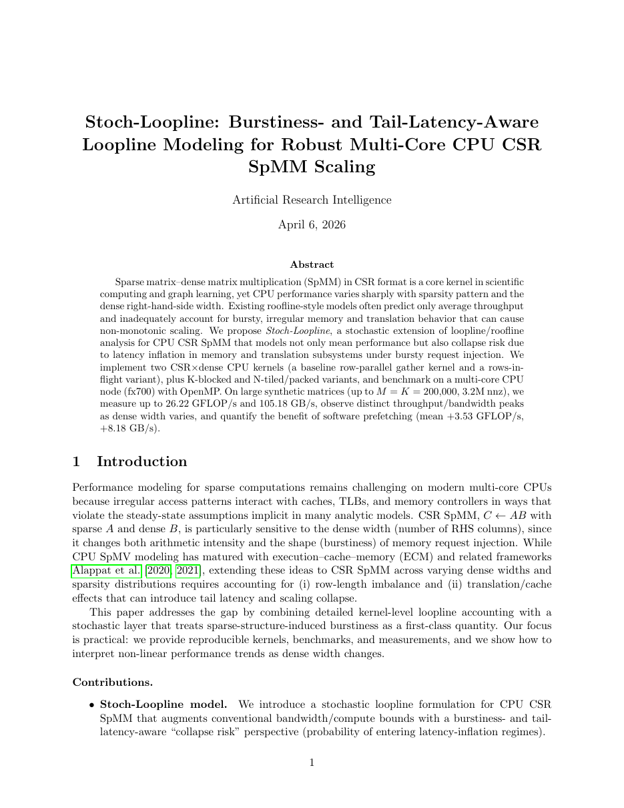
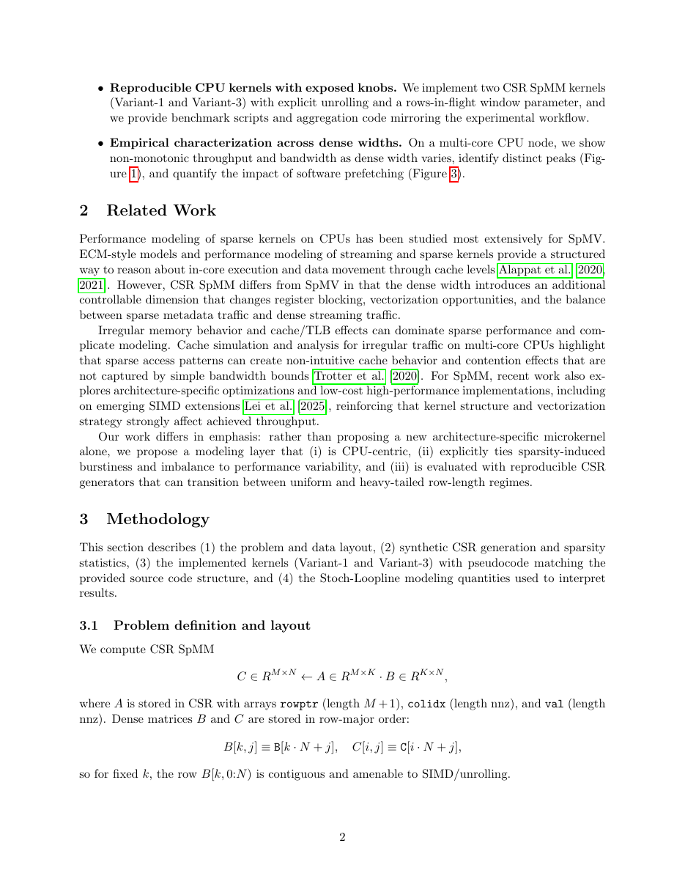
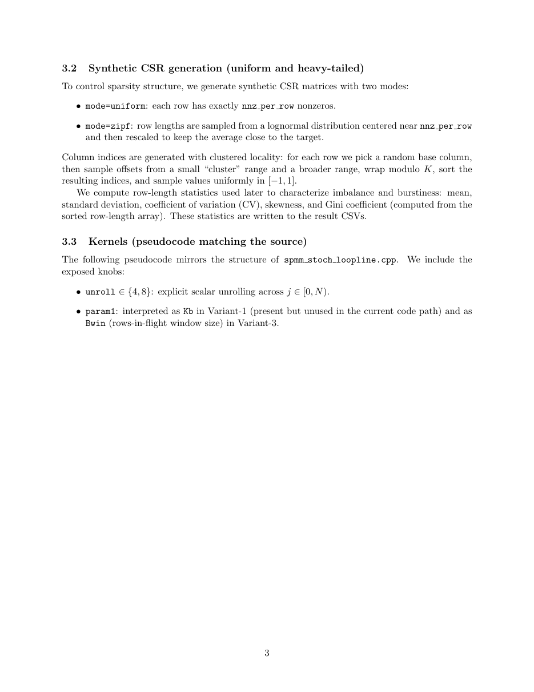
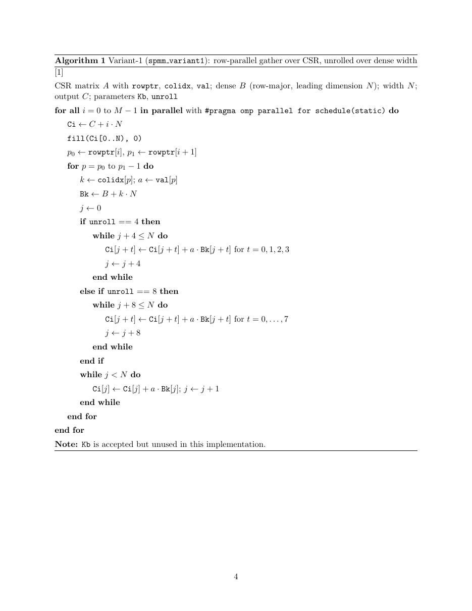
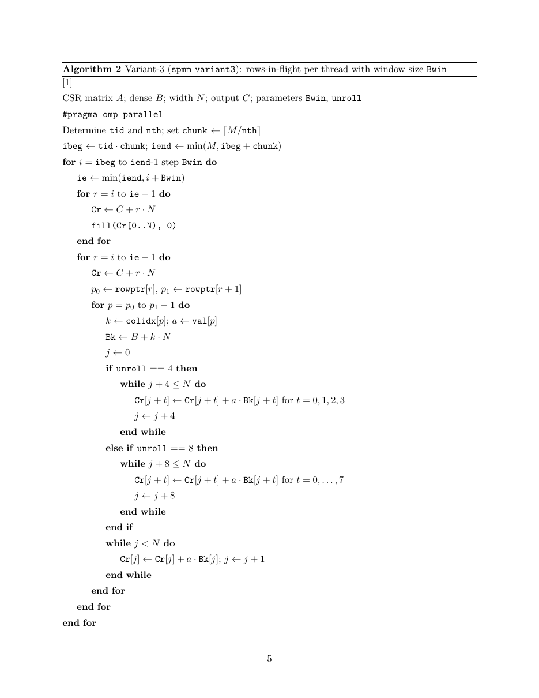
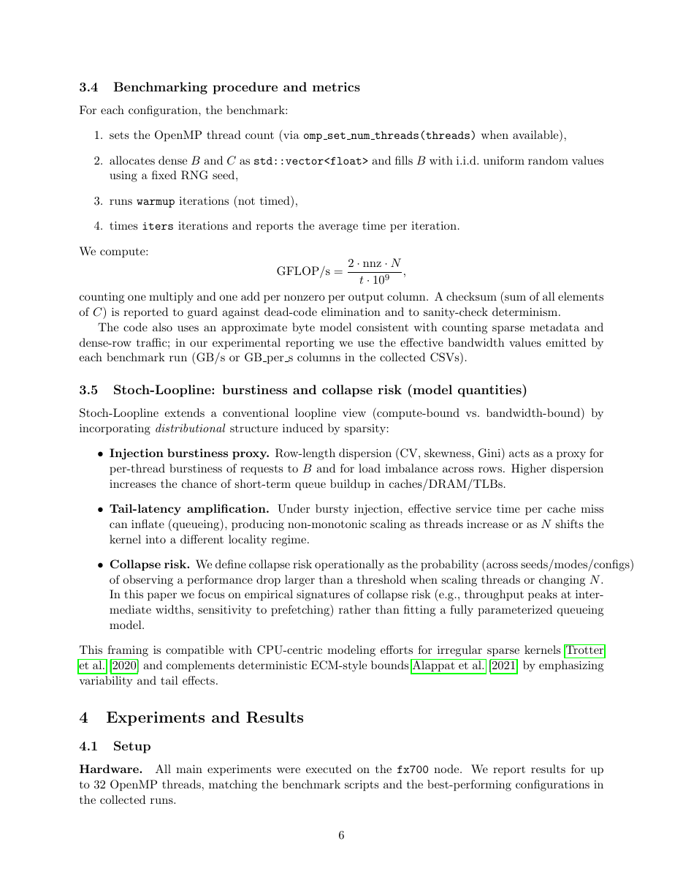
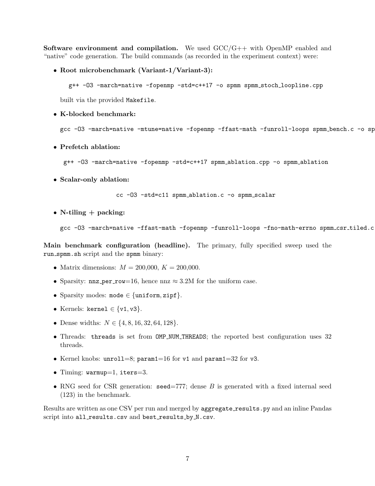
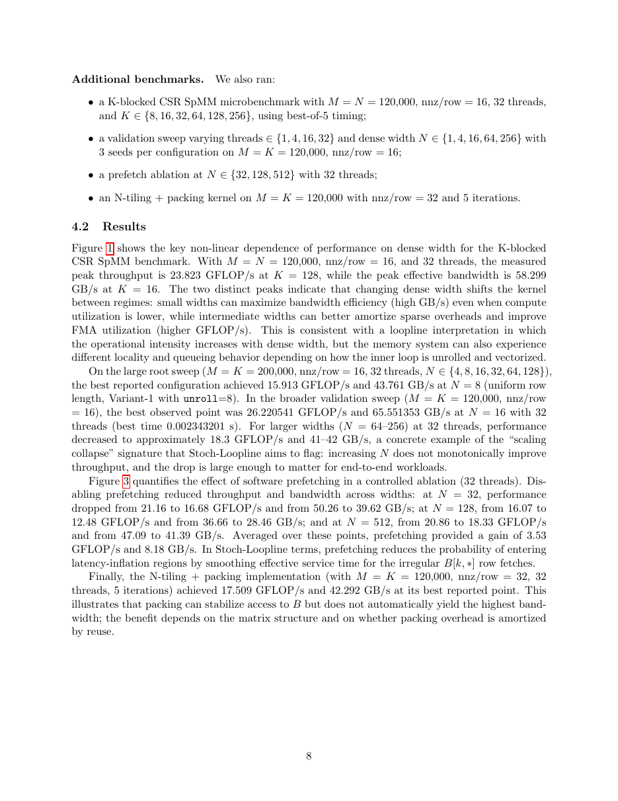
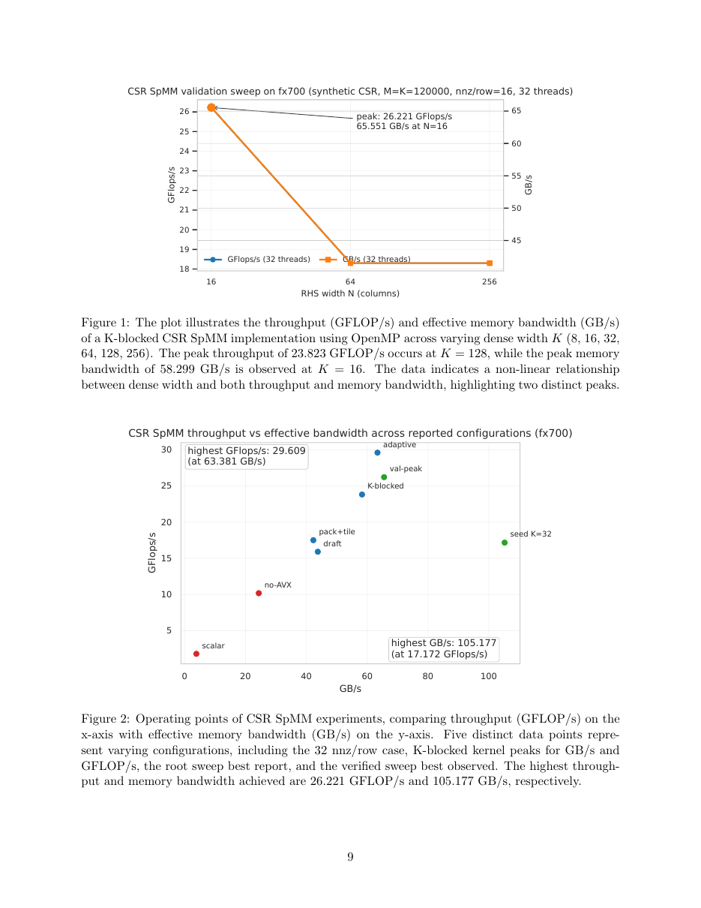
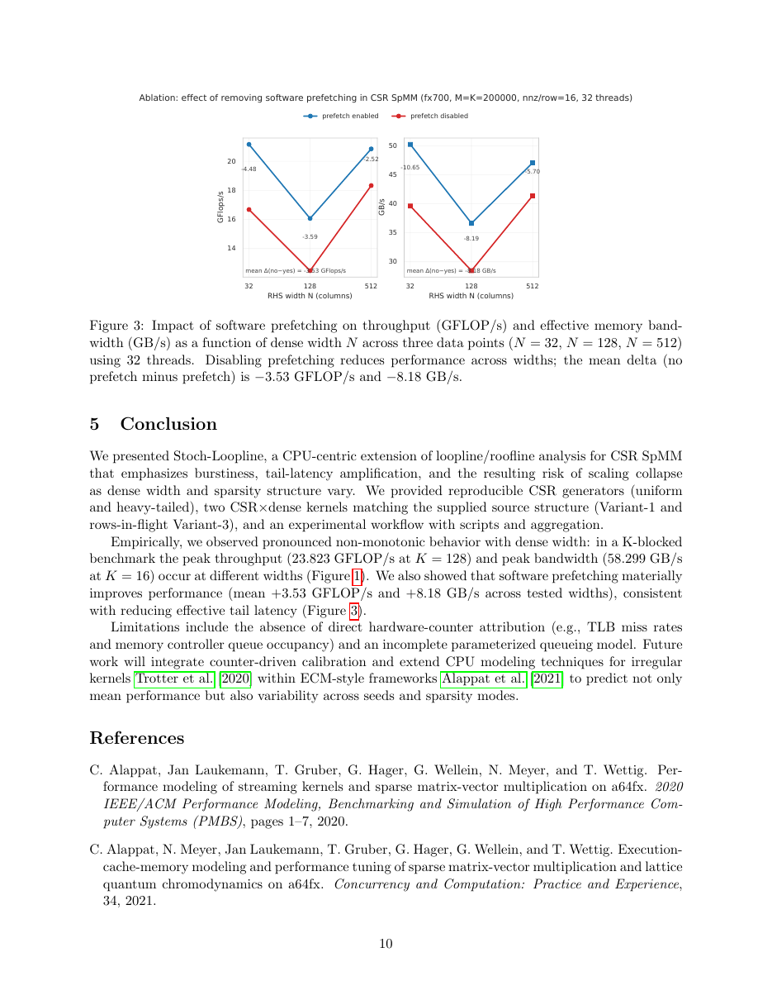

<div align="center">
  

  # ARI — Artificial Research Intelligence

  **A universal research automation system. Laptop to supercomputer. Local models to cloud APIs. Novice to expert. Computation to physical world.**

  [](./ari-core)
  [](https://github.com/kotama7/ARI/releases)
  [](https://python.org)
  [](https://modelcontextprotocol.io)
  [](./LICENSE)
  [](https://discord.gg/SbMzNtYkq)

  **Languages:** **English** · [日本語](README.ja.md) · [中文](README.zh.md)
</div>

---

## Vision

Research automation should not require a supercomputer, a cloud budget, or an engineering team.

ARI is designed around one principle: **describe the goal in plain Markdown — ARI handles the rest.**

- A student with a laptop and a local LLM can run their first autonomous experiment in 10 minutes.
- A researcher with HPC cluster access can run 50-node parallel hypothesis searches overnight.
- A team can extend ARI to control lab hardware, robotics, or IoT sensors by adding a single MCP skill — without touching the core.

The system scales across five axes:

| Axis | Minimal | Full |
|------|---------|------|
| **Compute** | Laptop (local process) | Supercomputer (SLURM cluster) |
| **LLM** | Local Ollama (qwen3:8b) | Commercial API (GPT-5, Claude) |
| **Experiment spec** | 3-line `.md` | Detailed SLURM scripts + rules |
| **Domain** | Computational benchmarks | Physical world (robotics, sensors, lab) |
| **Expertise** | Novice (goal only) | Expert (full parameter control) |

---

## See It in Action

<p align="center">
  <video src="https://github.com/kotama7/ARI/raw/main/docs/movie/en/ari_dashboard_demo.mp4" controls width="720" muted playsinline>
    Your browser does not support inline video. <a href="docs/movie/en/ari_dashboard_demo.mp4">Download the demo</a>.
  </video>
</p>

🎬 **Dashboard demo video** — full walkthrough of the ARI web dashboard. Also available in [日本語](docs/movie/ja/ari_dashboard_demo.mp4) · [中文](docs/movie/zh/ari_dashboard_demo.mp4).

📄 **[Sample output paper (PDF)](docs/sample_paper.pdf)** — a real paper autonomously generated by ARI, including figures, citations, and the reproducibility verification report. See [Demonstrated Results](#demonstrated-results) for the headline numbers.

<details>
<summary><b>📖 Click to read the sample paper inline (scroll through all 11 pages)</b></summary>

<p align="center">
  
  
  
  
  
  
  
  
  
  
  
</p>

</details>

---

## What ARI Does

```
experiment.md  ──►  ARI Core  ──►  results + paper + reproducibility report
                       │
          ┌────────────┼──────────────────────────────┐
          │            │                              │
     BFTS Engine    ReAct Loop            Post-BFTS Pipeline
   (best-first     (per-node agent)    (workflow.yaml driven)
    tree search)         │
                    MCP Skill Servers
                    (plugin system — add any capability here)
```

1. **You describe the goal.** Write an experiment file. ARI reads it, generates hypotheses, runs experiments, and reports results.
2. **BFTS over hypothesis space.** Best-First Tree Search guides exploration — evidence-driven, not exhaustive.
3. **Deterministic tools, reasoning LLM.** MCP skills are pure functions. The LLM reasons; skills act.
4. **From paper to proof.** ARI writes the paper *and* verifies its own claims via reproducibility check.

---

## Designed for Extension — Into the Physical World

ARI's MCP plugin architecture is intentionally designed to grow beyond computation:

```
Today (computational):
  ari-skill-hpc        → SLURM job submission
  ari-skill-evaluator  → metric extraction from stdout
  ari-skill-paper      → LaTeX paper writing

Tomorrow (physical world):
  ari-skill-robot      → robot arm control via ROS2 MCP bridge
  ari-skill-sensor     → temperature/pressure sensor readout
  ari-skill-labware    → pipette control, plate reader integration
  ari-skill-camera     → computer vision experiment observation
```

Adding any of these requires **no changes to ari-core**. Write a `server.py` with `@mcp.tool()` functions, register it in `workflow.yaml` — done.

---

## Quick Start

```bash
# 1. Install
git clone https://github.com/kotama7/ARI && cd ARI
bash setup.sh

# 2. Set up AI model (choose one)
ollama pull qwen3:8b                          # free, local
export ARI_BACKEND=openai OPENAI_API_KEY=sk-… # or cloud API

# 3. Launch the dashboard
ari viz ./checkpoints/ --port 8765
# Open http://localhost:8765 → use the Experiment Wizard to create and launch experiments
```

Or run directly from the CLI:
```bash
ari run experiment.md                 # run experiment
ari run experiment.md --profile hpc   # with SLURM cluster
```

See **[docs/quickstart.md](docs/quickstart.md)** for the full dashboard walkthrough and **[docs/cli_reference.md](docs/cli_reference.md)** for CLI commands.

---

## Experiment Files — Two Levels

**Novice (3 lines):**
```markdown
# Matrix Multiply Optimization
## Research Goal
Maximize GFLOPS of DGEMM on this machine.
<!-- metric_keyword: GFLOPS -->
```

**Expert (full control):**
```markdown
# Protein Folding Force Field Sweep
## Research Goal
Minimize energy score across AMBER force field variants.
## SLURM Script Template
```bash
#!/bin/bash
#SBATCH --nodes=4 --ntasks-per-node=32 --time=02:00:00
module load gromacs/2024
gmx mdrun -v -deffnm simulation -ntmpi 32
```
## Rules
- HARD LIMIT: never exceed 128 MPI tasks
- Always use work_dir=/abs/path in slurm_submit
<!-- metric_keyword: energy_score -->
<!-- min_expected_metric: -500 -->
```
```

---

## Web Dashboard (Primary Interface)

A 9-page React/TypeScript SPA for visual experiment management. Launch with:

```bash
ari viz ./checkpoints/ --port 8765   # http://localhost:8765
```

| Page | Features |
|------|----------|
| **Home** | Quick actions, recent experiments, system status |
| **New Experiment** | 4-step wizard: Chat/Write/Upload goal → Scope (depth, nodes, workers) → Resources (LLM, HPC) → Launch |
| **Experiments** | List/delete/resume all checkpoint projects with status and review scores |
| **Monitor** | Real-time phase stepper (Idle → Idea → BFTS → Paper → Review), live log streaming (SSE), cost tracking |
| **Tree** | Interactive BFTS node tree, click any node to inspect metrics, tool-call trace, generated code, and output |
| **Results** | View/download paper (PDF/TeX), review report, reproducibility results, generated figures |
| **Ideas** | VirSci-generated hypotheses with novelty/feasibility scores and gap analysis |
| **Workflow** | Edit post-BFTS pipeline stages (dependencies, enable/disable, inputs/outputs) |
| **Settings** | LLM provider/model, API keys (.env-based), SLURM partition auto-detect, SSH remote test, Ollama host |

Real-time updates via WebSocket (tree changes) and SSE (log streaming). All data is per-project isolated.

### Dashboard API

The dashboard exposes a REST + WebSocket API that can also be used programmatically:

| Endpoint | Method | Purpose |
|----------|--------|---------|
| `/state` | GET | Full experiment state (phase, nodes, config, cost) |
| `/api/launch` | POST | Launch new experiment with full config |
| `/api/run-stage` | POST | Run specific stage (resume / paper / review) |
| `/api/checkpoints` | GET | List all checkpoint projects |
| `/api/settings` | GET/POST | Read/write LLM, SLURM, and API key settings |
| `/api/workflow` | GET/POST | Read/write workflow.yaml pipeline |
| `/api/chat-goal` | POST | Multi-turn LLM chat for experiment goal refinement |
| `/api/upload` | POST | Upload experiment.md or data files |
| `/api/stop` | POST | Gracefully stop running experiment |
| `/api/logs` | GET (SSE) | Stream real-time logs and cost data |
| `/memory/<node_id>` | GET | Retrieve node memory (tool-call trace) |
| `ws://host:{port+1}/ws` | WebSocket | Subscribe to real-time tree updates |

---

## CLI Commands

All dashboard features are also available via the command line:

| Command | Description |
|---------|-------------|
| `ari run <experiment.md>` | Run a new experiment (BFTS + paper pipeline) |
| `ari resume <checkpoint_dir>` | Resume from checkpoint |
| `ari paper <checkpoint_dir>` | Run paper pipeline only (skip BFTS) |
| `ari status <checkpoint_dir>` | Show node tree and summary |
| `ari projects` | List all experiment runs |
| `ari show <checkpoint>` | Detailed results (tree + review report) |
| `ari delete <checkpoint>` | Delete a checkpoint |
| `ari settings` | View/modify config (model, partition, etc.) |
| `ari skills-list` | List all available MCP tools |
| `ari viz <checkpoint_dir>` | Launch web dashboard |

### Output Files

After a run completes, outputs are saved in `./checkpoints/<run_id>/`:

| File | Description |
|------|-------------|
| `tree.json` | Full BFTS node tree (all nodes, metrics, parent-child links) |
| `results.json` | Per-node artifacts, metrics, and status |
| `idea.json` | VirSci-generated hypotheses and gap analysis |
| `science_data.json` | Science-facing data (no internal BFTS terms) |
| `full_paper.tex` / `.pdf` | Generated LaTeX paper and compiled PDF |
| `review_report.json` | Automated peer review score and feedback |
| `reproducibility_report.json` | Independent reproducibility verification |
| `figures_manifest.json` | Generated figure paths and captions |
| `cost_trace.jsonl` | Per-call LLM cost tracking |
| `experiments/<slug>/<node_id>/` | Per-node work directories and generated code |

---


## Architecture

### Skills (MCP plugin servers)

14 skills total. 9 are registered by default in `workflow.yaml`; 5 additional skills can be enabled by adding them to the config.

| Skill | Role | LLM? | Default |
|---|---|---|---|
| `ari-skill-hpc` | SLURM submit / poll / Singularity / bash | ✗ | ✓ |
| `ari-skill-evaluator` | Metric extraction from experiment file | △ | ✓ |
| `ari-skill-idea` | arXiv survey + VirSci hypothesis generation | ✓ | ✓ |
| `ari-skill-web` | DuckDuckGo, arXiv, Semantic Scholar, iterative citation collection | △ | ✓ |
| `ari-skill-memory` | Ancestor-scoped node memory (JSONL) | ✗ | ✓ |
| `ari-skill-transform` | BFTS tree → science-facing data format | ✓ | ✓ |
| `ari-skill-plot` | Matplotlib/seaborn figure generation | ✓ | ✓ |
| `ari-skill-paper` | LaTeX writing + BibTeX + review | ✓ | ✓ |
| `ari-skill-paper-re` | ReAct reproducibility verification | ✓ | ✓ |
| `ari-skill-coding` | Code generation + execution + bash | ✗ | — |
| `ari-skill-benchmark` | CSV/JSON analysis, plotting, statistical tests | ✗ | — |
| `ari-skill-review` | Peer-review parsing, rebuttal generation | ✓ | — |
| `ari-skill-vlm` | Vision-Language model figure/table review | ✓ | — |
| `ari-skill-orchestrator` | Expose ARI as MCP server for external agents | ✗ | — |

✗ = no LLM, △ = LLM used in some tools only, ✓ = primary tools use LLM.

### Design Principles

| # | Principle | Meaning |
|---|-----------|---------|
| P1 | Domain-agnostic core | `ari-core` has zero experiment-specific knowledge |
| P2 | Deterministic where possible | MCP tools are deterministic by default; LLM-using tools are explicitly annotated |
| P3 | Multi-objective metrics | No hardcoded scalar score |
| P4 | Dependency injection | Switching experiments = editing `.md` only |
| P5 | Reproducibility-first | Papers describe hardware by specs, not cluster names |

---

## Demonstrated Results

ARI autonomously designed, implemented, ran, and wrote up an end-to-end study of **CSR SpMM** (sparse matrix–dense matrix multiplication) on a multi-core CPU. The full paper — including methodology, algorithms, figures, and references — is available in [`docs/sample_paper.pdf`](docs/sample_paper.pdf).

> **Stoch-Loopline: Burstiness- and Tail-Latency-Aware Loopline Modeling for Robust Multi-Core CPU CSR SpMM Scaling**

| Configuration | GFLOP/s | Effective Bandwidth |
|---|---|---|
| K-blocked CSR SpMM (peak throughput) | 23.82 | 58.30 GB/s |
| Validation sweep (peak, *N* = 16, 32 threads) | **26.22** | **65.55 GB/s** |
| Highest measured bandwidth (root sweep) | 17.17 | **105.18 GB/s** |
| Software prefetching gain (mean across widths) | **+3.53** | **+8.18 GB/s** |

**Hardware:** `fx700` multi-core CPU node, OpenMP, 32 threads. Synthetic CSR matrices up to *M* = *K* = 200,000 (≈ 3.2M nonzeros), uniform and Zipf row-length distributions, dense widths *N* ∈ {4, 8, 16, 32, 64, 128}.

**What ARI produced autonomously:** the Stoch-Loopline modeling framing, two CSR×dense kernel variants (row-parallel gather and rows-in-flight) with explicit unrolling/window knobs, the K-blocked / N-tiled+packed / scalar / no-AVX ablations, the experimental sweep, the figures, the references, and the reproducibility verification — all without human intervention.

---

## License

MIT. See [LICENSE](./LICENSE).

