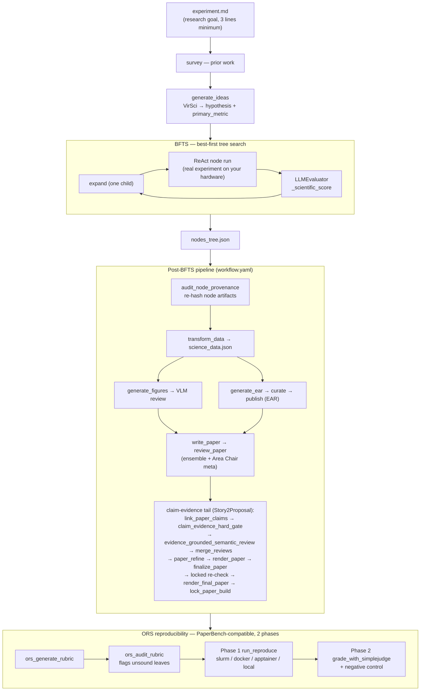

---
sources:
  - path: ari-core/ari/orchestrator
    role: implementation
  - path: ari-core/ari/agent/loop.py
    role: implementation
  - path: ari-core/ari/pipeline
    role: implementation
  - path: ari-core/ari/evaluator/llm_evaluator.py
    role: implementation
  - path: ari-core/ari/memory/letta_client.py
    role: implementation
  - path: ari-core/ari/paths.py
    role: implementation
  - path: ari-core/ari/core.py
    role: implementation
  - path: ari-core/ari/rqgm
    role: implementation
  - path: ari-core/config/workflow.yaml
    role: config
last_verified: 2026-07-30
---

# ARI Architecture

## What ARI Does

ARI is an end-to-end autonomous research system. Given a plain-text research goal, it:

1. **Surveys** prior work (academic databases)
2. **Generates** a research hypothesis via multi-agent deliberation (VirSci)
3. **Searches** for the best experimental configuration using Branch-and-Frontier Tree Search (BFTS)
4. **Executes** real experiments on your hardware (laptop, SLURM, PBS, LSF)
5. **Evaluates** each experiment as a peer reviewer (LLM assigns scientific quality score)
6. **Analyzes** the full experiment tree: extracts hardware context, methodology, ablation findings
7. **Generates** publication-quality figures (LLM writes matplotlib code from data)
8. **Writes** a complete LaTeX paper with citations
9. **Reviews** the paper with an LLM acting as a referee
10. **Verifies** reproducibility: re-runs the experiment from the paper text alone

No domain knowledge is hardcoded. The same pipeline works for HPC benchmarking, ML hyperparameter tuning, chemistry optimization, or any measurable phenomenon.

### Companion concept pages

This page covers the research system itself — the pipeline that turns a goal
into a paper. Two sibling pages cover the layers that *observe* and *describe*
that system, and are worth reading alongside it:

| Page | Answers |
|---|---|
| [Dashboard Architecture](gui_architecture.md) | How the web dashboard is structured: one shell hosting legacy screens and v2 workspaces, the route registry, run-scoped server-state caching, realtime as invalidation, and the seam from HTTP down to checkpoint artifacts. |
| [Research and Governance State](research_and_governance_state.md) | The state vocabularies a run carries at once — run lifecycle, research phase, governance stage, node score state — why they are separate, and why stale / invalidated / removed / physically deleted are four different things. |

---

## Pipeline at a glance

The end-to-end flow — idea generation, the BFTS exploration loop, the
`workflow.yaml`-driven post-BFTS pipeline (write_paper now followed by a
default Story2Proposal claim-evidence tail), and the PaperBench-compatible
ORS reproducibility check — as one hub diagram. Each group links to the
section or document that explains it in depth.



| Group | What it does | Read more |
|-------|--------------|-----------|
| survey / generate_ideas | Literature search + VirSci hypothesis & primary metric | [Full Data Flow](#full-data-flow) |
| BFTS | Best-first tree search over experiment configurations | [BFTS algorithm](bfts.md) |
| ReAct node run | Per-node agent loop that runs the real experiment | [Per-Node Prompt Composition](#per-node-prompt-composition) |
| LLMEvaluator | Peer-review scoring that drives ranking | [Configuration → BFTS Evaluation Layers](../reference/configuration.md#bfts-evaluation-layers-configurable) |
| Memory | Ancestor-scoped knowledge passed between nodes | [Memory architecture](memory.md) |
| Post-BFTS pipeline | Data → figures → paper → review → EAR | [Publication lifecycle](publication-lifecycle.md) |
| ORS reproducibility | Re-runs the paper from scratch and grades it | [PaperBench quickstart](../guides/paperbench/paperbench_quickstart.md) |

### Execution modes: `simple_bfts` (default) and `ari_rqgm` (opt-in)

Everything on this page describes `simple_bfts`, the default execution
mode. The opt-in `ari_rqgm` mode (Constitutional ARI-RQGM) wraps the same
BFTS loop in epoch-based governance and co-evolution: the search strategy is
wrapped by a pure-delegation `GovernedSearchStrategy`
(`ari/rqgm/runtime.py`), the MCP client is wrapped in the constitutional
capability gate (`_install_capability_gate` in `ari/core.py` — every governed
tool call is audited, and critical violations escalate to a mid-epoch
emergency quarantine), completed nodes get an adversarial
attack/defend/judge round, and at each epoch boundary a deterministic
constitutional kernel validates every governance state change (component
adoption/retirement, prompt evolution, frontier repair). It is enabled only
when `ari.mode: ari_rqgm` and `rqgm.enabled: true` agree; with the default
config no `ari.rqgm` module is imported and checkpoints are byte-identical
to pre-RQGM ARI. See [Constitutional ARI-RQGM
Architecture](rqgm_architecture.md) for the layers, epoch algorithm, and
invariants, and [Execution Modes](../guides/execution_modes.md) for
activation and the mode-switch policy.

### The `manuscript` axis (opt-in, off by default)

`workflow.yaml` carries a third top-level switch, `manuscript.mode`
(`off` | `audit` | `enforce`, default `"off"`; alongside
`profile: generic_empirical_v1`, `brief_character_budget: 24000` and a
`repair:` block whose `policy` defaults to `disabled`). It is independent of
both `ari.mode` and `paper.mode`. `off` is exact legacy identity — no
manuscript imports, artifacts, gates or repair; `audit` records a shadow
completeness assessment; `enforce` blocks authoring until the authoring
requirements are resolved (and is required before `repair.policy: auto`).
Every pipeline stage in `workflow.yaml` now declares
`segment: evidence | authoring | verification`, which is what lets
`generate_paper_section(..., include_segments=…)` run the paper pipeline one
segment at a time: excluded segments are represented as disabled stages in a
*derived* workflow, so cross-segment `depends_on` edges stay satisfied by
durable outputs. The selection itself needs no mode; what
`ARI_MANUSCRIPT_RUNTIME_MODE` (anything other than `off`) adds is the
segment-execution record — the run is bound to the workflow digest and its
logical inputs, and a matching completed record is reused instead of re-run.
With the default `include_segments=None` every enabled stage runs, exactly as
before.

---

## System Overview

```
┌────────────────────────────────────────────────────────────────┐
│                         User Interface                         │
│                   experiment.md  /  CLI  /  API                │
└────────────────────────────┬───────────────────────────────────┘
                             │
┌────────────────────────────▼───────────────────────────────────┐
│                          ari-core                              │
│                                                                │
│  ┌─────────────────┐   ┌─────────────────┐                    │
│  │  BFTS           │   │  ReAct Loop     │                    │
│  │  (tree search)  │──▶│  (per node)     │                    │
│  └─────────────────┘   └────────┬────────┘                    │
│                                 │                              │
│  ┌──────────────────────────────▼──────────────────────────┐  │
│  │            MCP Client (async tool dispatcher)           │  │
│  └──────────────────────────────┬──────────────────────────┘  │
└─────────────────────────────────┼──────────────────────────────┘
                                  │ MCP protocol (stdio/HTTP)
     ┌────────────────────────────┼──────────────────────────────┐
     │                            │                              │
┌────▼──────────┐  ┌─────────────▼──────┐  ┌───────────────────▼──┐
│ari-skill-hpc  │  │ari-skill-idea      │  │ari-skill-evaluator   │
│ job_submit    │  │ survey             │  │ make_metric_spec     │
│ job_status    │  │ generate_ideas     │  │ claim_evidence_      │
│ slurm_submit  │  │ (VirSci MCP)       │  │   hard_gate          │
└───────────────┘  └────────────────────┘  └──────────────────────┘

Post-BFTS Pipeline (workflow.yaml):
┌─────────────────┐  ┌──────────────────┐  ┌──────────────────┐
│ari-skill-       │  │ari-skill-plot    │  │ari-skill-paper   │
│transform        │  │ generate_figures │  │ write_paper      │
│ nodes_to_       │  │ _llm (matplotlib │  │ review_compiled  │
│ science_data    │  │  plots + SVG     │  │  (rubric-driven, │
│ (LLM analysis)  │  │  diagrams)       │  │   ensemble+meta) │
└─────────────────┘  └──────────────────┘  └──────────────────┘
                                            ┌──────────────────┐
                                            │ari-skill-replicate│
                                            │ generate_rubric  │
                                            │ audit_rubric     │
                                            │  (PaperBench fmt)│
                                            └──────────────────┘
                                            ┌──────────────────┐
                                            │ari-skill-paper-re│
                                            │ fetch_code_bundle│
                                            │ build_reproduce_sh│
                                            │ run_reproduce    │
                                            │  (slurm/docker/  │
                                            │   apptainer/local)│
                                            │ grade_with_      │
                                            │  simplejudge     │
                                            │  (PaperBench via │
                                            │   LiteLLM judge) │
                                            └──────────────────┘
```

---

## Full Data Flow

```
experiment.md
  (research goal only — 3 lines minimum)
    │
    ▼
[ari-skill-idea: survey]
  arXiv / Semantic Scholar keyword search
  Returns: related paper abstracts
    │
    ▼
[ari-skill-idea: generate_ideas]  ← VirSci multi-agent deliberation
  Multiple AI personas debate the research question
  Output: hypothesis, primary_metric, evaluation_criteria
    │
    ▼
BFTS root node created
    │
    ▼ (repeated for each node, up to ARI_MAX_NODES, ARI_PARALLEL concurrent)
┌──────────────────────────────────────────────────────────────────┐
│  ReAct Loop (ari/agent/loop.py)                                  │
│                                                                  │
│  1. LLM selects tool from MCP registry                           │
│  2. Tool executes (run_bash / slurm_submit / job_status / ...)   │
│  3. If SLURM job: auto-poll until COMPLETED (no step budget)     │
│  4. LLM reads stdout → generates experiment code → submits       │
│  5. LLM extracts metrics from output → returns JSON              │
│                                                                  │
│  Memory: result summaries saved to ancestor-chain memory         │
│  Child nodes: search ancestor memory for prior results           │
└──────────────────────────────────────────────────────────────────┘
    │
    ▼
[LLMEvaluator] (ari/evaluator/llm_evaluator.py)
  Input:  node artifacts (stdout, logs, scripts)
  Output: {
    has_real_data: bool,
    metrics: {key: value, ...},       ← extracted numeric values
    scientific_score: float 0.0-1.0,  ← LLM peer-review quality
    comparison_found: bool             ← compared against existing methods?
  }
  _scientific_score stored in metrics → drives BFTS ranking
  AUTHORITATIVE measurements: the node's results.json (under ARI_WORK_DIR)
    is the ground truth. Its `measurements` are merged in directly and take
    PRECEDENCE over the LLM's extraction from the truncated artifact text
    (str(artifacts)[:2000]); any numeric value present there also sets
    has_real_data=True. This recovers real numbers the truncated re-read
    would have missed.
  metric_contract producer obligation: when make_metric_spec emitted a
    metric_contract scaffold (concept-classified metric), the agent receives a
    domain-neutral obligation at make_metric_spec time — verify correctness,
    MEASURE (never hardcode) any ceiling, emit provenance, fill the contract —
    which the FINAL claim-evidence hard gate later enforces.
    │
    ▼
BFTS expand() (ari/orchestrator/bfts.py)
  - Ranks nodes by _scientific_score
  - Passes score to child-proposal LLM
  - LLM proposes 1 child direction per expansion call (improve / ablation / validation / draft / debug / other)
  - No domain hints — LLM decides what "improvement" means
  - v0.7.0: when the parent has a node_report.json, the prompt is enriched
    with structured files added/modified/deleted, self_assessment.concerns,
    and next_steps_hints, and sibling dedup is filtered through
    filter_nodes(for_synthesis) so already-explored siblings show up with
    their files_changed.added — this lets the planner avoid proposing a
    direction that would write the same files.

Per-node self-report (v0.7.0)
  ari-core/ari/orchestrator/node_report/ builds node_report.json at
  mark_success / mark_failed (ari-core/ari/cli/bfts_loop.py post-future
  hook). The report records:
    - files_changed (added / modified / deleted / inherited_unchanged)
      derived from a sha256 diff of parent vs child work_dir
    - original_direction (saved by bfts.expand at child creation, never
      overwritten by the evaluator)
    - measurement_valid and evaluation_cases — objective evaluator output;
      each evaluator-defined case contains `valid` plus a dictionary of
      harness-defined scalar measurements
    - self_assessment.{headline, concerns} and next_steps_hints — the
      agent-authored LLM reflection, stored separately from objective validity
    - build_command / run_command — best-effort grep of run_job.sh /
      Makefile in the work_dir
    - artifacts[].role — deterministic role classification
      (data_output / log / binary / figure / unknown)
  PathManager.META_FILES contains node_report.json so the parent → child
  physical work_dir copy never inherits a stale parent report.

Common selection helpers (v0.7.0)
  ari-core/ari/orchestrator/node_selection.py provides:
    - filter_nodes(nodes, reports, criteria, *, always_include_node_ids):
      one source of truth for "should this node be passed downstream?"
      with three criteria: for_synthesis (transform LLM input),
      for_code (ear/code/ chain selection), for_narrative (EVOLUTION.md
      step inclusion). best node always passes via always_include.
      Emits a warning when >50% of successful nodes are dropped.
    - select_source_files_for_publication: pure-metadata file-level
      selection (no I/O). Deepest contributor wins per rel_path. Shared
      by transform_data and generate_ear so they ALWAYS see the same
      bytes (FR-SS-5 contract test pins this).
    - load_selected_sources(size_budget=None|int): file I/O wrapper
      that respects an optional size cap; transform passes 16KB,
      generate_ear passes None.
    │
    ▼ (after ARI_MAX_NODES reached)
nodes_tree.json  (all nodes: metrics, artifacts, memory, parent-child links)
    │
    ▼
[workflow.yaml Post-BFTS Pipeline]

  Stage 0: audit_node_provenance  (ari-skill-memory: audit_memory)  [before stage 1]
    Re-hashes every node artifact whose sha256 the node_report recorded and
    compares it against disk — the boundary where node outputs stop being
    experiment results and start being paper evidence. Reports each artifact
    verified / mismatch (rewritten after its hash was recorded) / missing
    (deleted) / unhashed (declared with no recorded baseline). ARI's own
    metadata (results.json et al., excluded by PathManager.is_meta_file) and
    artifacts entries with no recorded hash are reported unhashed, not
    verified. A signal, not a gate — transform_data depends_on it.
    Output: node_provenance_audit.json

  Stage 1: transform_data  (ari-skill-transform)  [after stage 0]
    BFS traversal of full tree (root → leaves)
    LLM reads all node artifacts (stdout, logs, generated code)
    LLM extracts: hardware specs, methodology, key findings, comparisons
    Inputs include primary_metric / higher_is_better (sourced from
      evaluation_criteria.json via tpl_vars) so summary_stats can be
      direction-aware without re-deriving it downstream.
    Output: science_data.json
      configurations[*]:
        rank, label, eval_summary
        parameters / measurements / predictions / scores  ← typed split
                                                             (D-from-results.json or
                                                              C-from-_params_dict)
        metrics                                            ← back-compat flat union
        _typed_source: "results.json" | "llm_evaluator" | (absent)
      per_key_summary  (input-param keys & "_…" reserved keys excluded)
      summary_stats    { count, primary_metric, direction,
                         primary_metric_best, primary_metric_n,
                         typed_split_coverage }
      experiment_context  (LLM-extracted methodology / hardware / findings)
      implementation_overview (optional)
      report_driven    (true when node_report.json drove LLM input)

  Stage 2: search_related_work  (ari-skill-web: search_papers)  [parallel with stage 1]
    LLM-generated keywords → ONE pinned provider (workflow.yaml pins
    provider: semantic-scholar, max_results: 15, mode: record). "record"
    snapshots the response so a later "replay" needs no network; "record" and
    "live" never switch provider. The stage carries
    skip_if_exists: related_refs.json — a recorded retrieval is an immutable
    experiment input, so a resume reuses it instead of re-querying.
    Output: related_refs.json

  Stage 3: generate_figures  (ari-skill-plot: generate_figures_llm)  [after stage 1]
    Input: science_data.json + {{experiment_summary}} + {{vlm_feedback}}
    The LLM is a PLANNER only: it may emit metric_id, chart_type and
    x_mode and nothing else. Numeric values, units, captions, paths and the
    image bytes are produced deterministically by the fixed renderer from the
    verified science record (execution_mode "declarative-fixed-renderer"), which
    writes source_data.json / figure_spec.json / .png / .pdf per figure under
    figures/revisions/{NN}/{figure_id}/. A revision > 0 requires VLM feedback
    that binds the previous manifest digest; revision 0 refuses feedback.
    Output: figures_manifest.json  {figures, latex_snippets, figure_kinds}
      (figure_kinds is the spec's chart_type)

  Stage 3b: vlm_review_figures  (ari-skill-vlm: review_figures_all)  [after stage 3]
    VLM reviews EVERY figure in figures_manifest.json; the aggregate score is
    the min across figures, so one weak figure trips the loop. issues and
    suggestions are prefixed with [fig_id] so the regenerator knows which
    figure to fix.
    If score < 0.7: loop back to generate_figures with VLM feedback (max 2 iterations)
    Output: vlm_review.json

  Stage 4: generate_ear  (ari-skill-transform)  [after stage 1]
    Node_report-driven deterministic build of ear/.
      - code/ = verbatim union of contributing chain nodes' files_changed.added/modified
      - data/ = checkpoint/uploads/ verbatim mirror (input only; experiment outputs are NOT bundled)
      - figures/ = top-level *.{pdf,png,svg,jpg,jpeg} from the checkpoint
      - README.md / reproduce.sh — deterministic from node_reports
      - LICENSE — generated from publish.yaml::license SPDX template (MIT / Apache-2.0 / BSD-3-Clause / GPL-3.0 / CC-BY-4.0)
    EVOLUTION.md and _provenance.json are written at checkpoint root (outside
    ear/) as ARI audit logs and are never bundled into the published artifact.
    Selection of (node_id, rel_path) pairs is shared with transform_data via
    select_source_files_for_publication() so the LLM sees exactly the source
    bytes that ear/code/ will publish. Internal ARI metadata (tree.json,
    science_data.json, raw_metrics.json, etc.) is never copied into ear/.
    Output: ear_manifest.json, ear/ directory, checkpoint/EVOLUTION.md,
            checkpoint/_provenance.json

  Stage 5: write_paper  (ari-skill-paper)  [after stages 2, 3, 4]
    paper_context = experiment_context + best_nodes_metrics
    Iterative section writing: draft → LLM review → revise (max 2 rounds)
    BibTeX citations from Semantic Scholar results
    write_paper also reads verified_context.json (built by
      ari/pipeline/verified_context.py — artifact-grounded claims scoped to
      the best node's root→best lineage) to ground its quantitative claims.
    Output: full_paper.tex, refs.bib

  Story2Proposal claim-evidence tail  [now default, after write_paper]
    write_paper is followed by a deterministic claim/evidence chain
    (S2P). The default topology is:
      link_paper_claims_draft       (reconcile %CLAIM anchors → paper_claim_links.json)
        → claim_evidence_hard_gate_draft   (draft hard gate, non-blocking)
        → review_paper              (text-only review — Stage 6 below)
        → evidence_grounded_semantic_review
        → merge_reviews             (Stage 10 below; threads gate + semantic review)
        → paper_refine              (apply suggested_revisions, preserve %CLAIM anchors)
        → render_paper              (recompile refined .tex → PDF; non-blocking)
        → link_paper_claims_final
        → evidence_grounded_semantic_review_post_refine
        → claim_evidence_hard_gate_final   (FINAL gate; blocks finalize in strict mode)
        → finalize_paper            (Stage 8 below)
        → link_paper_claims_locked  (re-reconcile after Code Availability injection)
        → claim_evidence_hard_gate_locked        (phase: final, over the exact TeX
                                                  that will be compiled and locked)
        → evidence_grounded_semantic_review_locked   (phase: locked, advisory)
        → render_final_paper        (compile the exact post-injection TeX)
        → lock_paper_build          (fail-closed PaperBuildV1 lock over inputs,
                                     calls, reviews, gate, compile logs, TeX,
                                     BibTeX and PDF)
    Governed by the top-level claim_gate_policy block in workflow.yaml.
      Only the FINAL phase can block — draft-phase reports never do. mode: off
      never blocks; mode: warn (the default) still blocks on the
      objective-integrity always_block_on tier (invariant_violation,
      correctness_failed, recompute_mismatch, …); mode: strict additionally
      blocks the configured block_on findings and uncovered result numbers in
      strict sections. Resolution precedence ends at
      env ARI_CLAIM_GATE_MODE (off | warn | strict) and ARI_COMPARISON_SCOPE.
    The heavy gate logic lives in the new ari/pipeline/claim_gate/ package
      (contract / gate / policy / numeric / latex / invariants / resolve);
      the evaluator-skill exposes thin MCP tools (claim_evidence_hard_gate,
      evidence_grounded_semantic_review) that call into it. Deep gate
      semantics live in publication-lifecycle.md.

  Stage 6: review_paper  (ari-skill-paper)  [after stage 5]
    Rubric-driven review. Runs N independent reviewer agents (N from
    ARI_NUM_REVIEWS_ENSEMBLE / rubric default, N=1 = single reviewer).
    When N>1, also runs the Area Chair meta-review to aggregate scores.
    Output: review_report.json { score, verdict, citation_ok, feedback,
            ensemble_reviews[] (N>1), meta_review{} (N>1) }

  Stage 7: ear_curate  (ari-skill-transform: curate_ear)  [after stage 4, v0.7.0]
    Reads {checkpoint}/ear/publish.yaml allowlist + built-in deny list
    (.env*, secrets/**, *.pem, *.key, id_rsa, id_ed25519). Builds
    {checkpoint}/ear_published/ + manifest.lock with bundle_sha256
    (canonical {path,sha256,size} JSON, deterministic across machines).
    Skips silently when publish.yaml is absent.

  Stage 8: finalize_paper  (ari-skill-paper: inject_code_availability)  [after stage 5+7, v0.7.0]
    Auto-loads ref / sha / doi from ear_published/manifest.lock +
    publish_record.json. Injects \codeavailability{} / \codedigest{} /
    \coderef{} macros + human-readable Code Availability section into
    full_paper.tex. The digest is the trust anchor — readers can
    `ari clone <ref> --expect-sha256 <baked-digest>` without trusting
    the registry at runtime.

  Stage 9: ear_publish  (ari-skill-transform: publish_ear)  [after stage 7, optional]
    Builds a reproducible tarball from ear_published/ and ships it to
    backend = ari-registry | local-tarball | gh | zenodo. Always starts
    at visibility=staged (FR-P5). Enabled by default in `workflow.yaml`
    with backend `local-tarball` and `dry_run: false`; `finalize_paper`
    depends on it.
    Output: publish_record.json

  Stage 10: review_paper / merge_reviews  (ari-skill-paper)  [after stages 5+3b]
    review_paper evaluates paper text only (no VLM findings, no figure
    manifest) to match AI Scientist v2's perform_review contract.
    merge_reviews structurally merges review_report.json with the
    VLM figure review (vlm_review.json). Purely deterministic — no LLM.
    Output: review_report.json (with vlm_figure_review attached)

  Stage 11: ors_generate_rubric  (ari-skill-replicate)  [after lock_paper_build, v0.7.0]
    Auto-generates a PaperBench-format rubric (TaskNode tree) from the
    final paper. task_category and finegrained_task_category are pinned
    to PaperBench's closed vocabulary; a deterministic normalizer maps
    LLM variants to allow-list entries before freeze. JSON output is
    sanitized for stray LaTeX backslash escapes. The rubric envelope is
    frozen with a sha256 over the canonical JSON + paper digest.
    Output: ors_rubric.json + ors_rubric.meta.json

  Stage 12: ors_audit_rubric  (ari-skill-replicate: audit_rubric)  [after stage 11]
    Audits the rubric everything downstream is graded against. Flags each
    leaf vague_qualifier / no_paper_evidence / duplicate (deterministic)
    and unverifiable (one LLM call per leaf), rewrites ors_rubric.json in
    place with the flags + audit metadata, and reports regen_recommended
    when >20% of leaves are flagged. A signal, not a gate: grading runs
    either way. ARI_MODEL_RUBRIC_AUDIT points it at a model other than
    the rubric's author.
    Output: ors_rubric.audit.json (+ flags written into ors_rubric.json)

  Stage 13: ear_publish  (ari-skill-transform)  [v0.7.0, enabled by default]
    Packages ear_published/ into a tarball + publish_record.json.
    Default backend is local-tarball (zero deps); ari-registry / zenodo
    / gh available for external publishing.
    Output: bundle.tar.gz + publish_record.json

  Stage 14: ors_seed_sandbox  (ari-skill-paper-re: fetch_code_bundle)  [v0.7.0]
    Deterministic seed from the curated EAR bundle into repro_sandbox/.
    Auto-loads ref + sha256 from publish_record.json (no LLM). When EAR
    is OFF, publish_record.json is absent and this stage no-ops, leaving
    the LLM fallback (next stage) to populate the sandbox.
    Output: ors_seed.json

  Stage 15: ors_build_reproduce  (ari-skill-paper-re: build_reproduce_sh)  [v0.7.0]
    LLM-driven replicator: reads the paper + the rubric's expected_artifacts
    and writes a self-contained reproduce.sh + source files into the
    sandbox. Skips when reproduce.sh is already present (composes after
    ors_seed_sandbox), so it only fires on EAR-off runs (paper-only repro).
    Routed through LiteLLM; provider-neutral.
    Output: ors_replicator.json + repro_sandbox/{reproduce.sh, source...}

  Stage 16: ors_run_reproduce  (ari-skill-paper-re: run_reproduce)  [after stage 15, v0.7.0]
    Phase 1. Executes reproduce.sh in a sandbox:
      slurm (when sbatch + ARI_SLURM_PARTITION are present — same partition
      BFTS used) → docker (when daemon usable & not on HPC) → apptainer →
      singularity → local. Override via ARI_PHASE1_SANDBOX.
    SLURM dispatch uses sbatch --wait + a wrapper that exec's reproduce.sh
    by absolute path so $(dirname "$0") survives spool relocation.
    Captures reproduce.log; checks expected_artifacts from the rubric.
    Output: ors_phase1.json { executed, exit_code, log_path,
                              artifacts, missing, sandbox_kind,
                              [partition, cpus, walltime] }

  Stage 17: ors_grade  (ari-skill-paper-re: grade_with_simplejudge)  [after stage 16, v0.7.0]
    Phase 2. Runs PaperBench SimpleJudge over the rubric leaves
    against (repo_dir + reproduce.log + paper). The main per-leaf
    grading completer routes through LiteLLM (any provider works);
    the score-parsing structured completer remains on gpt-4o-2024-08-06.
    N runs (default 1 — PaperBench §4.1 single-pass judging; raise it
    with ARI_JUDGE_N_RUNS), weighted leaf aggregation. A negative-control
    pass (empty repo + trivial reproduce.sh) verifies the rubric does
    not reward absence-of-work — both controls must score < 5%.
    Output: ors_grade.json { ors_score, raw_score, leaf_grades,
                             judge_model, n_runs, rubric_sha256,
                             negative_control: {empty, boilerplate, passed} }
```

---

## File Structure

### Checkpoint Directory Layout

Each ARI run produces a checkpoint directory under `{workspace}/checkpoints/{run_id}/`.
`run_id` has the form `YYYYMMDDHHMMSS_<slug>`. `PathManager` in `ari/paths.py` is the
single source of truth for directory construction.

```
checkpoints/{run_id}/
├── experiment.md               # Input: research goal (copied on launch)
├── launch_config.json          # Wizard/CLI launch parameters
├── meta.json                   # Sub-experiment metadata (parent/depth)
├── workflow.yaml               # Snapshot of pipeline config at launch
├── .ari_pid                    # PID file for liveness detection
├── tree.json                   # Full BFTS tree (written during BFTS)
├── nodes_tree.json             # Lightweight tree export (pipeline input)
├── results.json                # Per-node artifacts + metrics summary
├── idea.json                   # Generated hypothesis (VirSci output) — also seeded with parent's ideas[N] when launched via inherit_idea_index (v0.7.0)
├── lineage_decisions.jsonl     # lineage decisions LLM judge log (one record per fired decision; v0.7.0)
├── evaluation_criteria.json    # Primary metric + direction
├── cost_trace.jsonl            # Per-LLM-call cost/token log (streamed)
├── cost_summary.json           # Aggregated cost summary
├── ari.log                     # Structured JSON log
├── ari_run_*.log               # GUI-launched stdout/stderr log
├── .pipeline_started           # Marker: post-BFTS pipeline has begun
├── science_data.json           # Transform-skill output
├── related_refs.json           # Literature search results
├── figures_manifest.json       # Generated figure batch metadata
├── figures/revisions/{NN}/{figure_id}/  # Per-figure render: source_data.json,
│                               #   figure_spec.json, {figure_id}.png/.pdf,
│                               #   figure_manifest.json
├── vlm_review.json             # VLM figure review output
├── full_paper.tex              # Generated LaTeX paper
├── refs.bib                    # BibTeX references
├── full_paper.pdf              # Compiled PDF
├── full_paper.bbl              # Bibliography output
├── review_report.json          # LLM peer-review output (incl. ensemble_reviews[] and meta_review{} when N>1)
├── reproducibility_report.json # Reproducibility verification
├── uploads/                    # User-uploaded files (copied to node work_dirs)
├── paper/                      # LaTeX editing workspace (Overleaf-like)
│   ├── full_paper.tex
│   ├── full_paper.pdf
│   ├── refs.bib
│   └── figures/
├── ear/                        # Experiment Artifact Repository
│   ├── README.md
│   ├── RESULTS.md
│   └── <artifacts>
└── repro/                      # Reproducibility run workspace
    ├── run/
    ├── reproducibility_report.json
    └── repro_output.log
```

### Node Work Directories

Per-node working directories are created as siblings of `checkpoints/`:

```
{workspace}/experiments/{run_id}/{node_id}/
```

The middle segment is the **`run_id`**, not a topic slug — `PathManager.node_work_dir`
takes `run_id` and `ari/cli/bfts_loop.py` passes it, so two runs that share an
experiment name never write into the same bucket.

At node execution time, `_run_loop` copies user files into each node's work_dir:
- **Provided files**: paths listed under `## Provided Files` (or `## 提供ファイル` / `## 提供文件`) in `experiment.md`
- **Checkpoint root**: non-meta files directly in the checkpoint dir
- **Uploads subdir**: non-meta files in `checkpoint/uploads/`

`PathManager.META_FILES` defines files that must never be copied to node work dirs.
It covers run-level metadata (`experiment.md`, `tree.json`, `nodes_tree.json`,
`launch_config.json`, `meta.json`, `results.json`, `idea.json`, `cost_trace.jsonl`,
`cost_summary.json`, `provenance.json`, `workflow.yaml`, `ari.log`,
`evaluation_criteria.json`, `.ari_pid`, `.pipeline_started`), the per-node records
each node must write for itself (`node_report.json`, `full_log.json`,
`_run_env.json`, `_exec_env.json`), and the RQGM / paper-archive artifacts. The
per-node entries carry real weight: `full_log.json`, `_run_env.json` and
`_exec_env.json` are absent from `bfts_loop`'s `_OUTPUT_BLACKLIST`, so this set is
the only thing keeping a parent's execution log, machine and loaded modules out of
its children. Any file with a `.log` extension is also treated as meta.

### tree.json vs nodes_tree.json

Both files contain the BFTS node tree, but are written at different lifecycle stages:

| File              | Writer                                                | Phase            | Schema                                                |
|-------------------|-------------------------------------------------------|------------------|-------------------------------------------------------|
| `tree.json`       | `_save_checkpoint()` in `cli/bfts_loop.py`            | During BFTS      | `{run_id, experiment_file, created_at, nodes}`        |
| `nodes_tree.json` | `_save_checkpoint()` + `WorkflowDriver.run()` (`ari/pipeline/driver.py`, reached through `run_pipeline()` in `ari/pipeline/orchestrator.py`, entered from `generate_paper_section()`) | BFTS + post-BFTS | `{experiment_goal, nodes}` (lightweight)              |

**Reader convention**: All readers MUST prefer `tree.json` and fall back to
`nodes_tree.json`. This ensures up-to-date data during BFTS while remaining
compatible with pipeline stages that expect `nodes_tree.json`.

### Project-scoped state (per checkpoint)

ARI no longer maintains a global config directory.  Every settings file and
agent memory store lives under the active checkpoint, so each experiment
gets its own isolated state.  v0.5.0 removed the global `$HOME/.ari/`
directory; the few remaining filesystem fallbacks emit a
`DeprecationWarning` and disappear in v1.0 (see `docs/_archive/refactor_audit.md`
and `docs/guides/migration.md`):

```
checkpoints/{run_id}/
├── settings.json             # GUI settings (LLM model, provider, HPC defaults)
├── memory_backup.jsonl.gz    # Letta snapshot (portable; auto on stage boundary + exit)
├── memory_access.jsonl       # Append-only memory write/read telemetry
└── ...                       # tree.json / launch_config.json / uploads / ari.log
```

API keys are **never** stored in `settings.json`. They are read from `.env`
files (search order: checkpoint → ARI root → ari-core → home) or from
environment variables injected at launch.

### Workspace root resolution

`{workspace}` in the paths above is not a fixed directory.
`RuntimePathResolver.resolve_workspace_root()` (`ari/paths.py`) is the one
function that decides it. Precedence, first match wins:

1. **`ARI_CHECKPOINT_DIR`** — the root is *recovered* from the pinned checkpoint
   directory: walk up to the outermost `checkpoints/` ancestor and take its
   parent; with no `checkpoints/` ancestor, take the checkpoint directory's own
   parent.
2. An explicit `workspace_root` argument.
3. **`ARI_ROOT`** → `{ARI_ROOT}/workspace`.
4. `{repo root}/workspace` — used only when `{repo root}/ari-core` is a
   directory, i.e. when running from inside a checkout.
5. The process working directory.

Step 1 outranking step 2 is easy to trip over: while `ARI_CHECKPOINT_DIR` is
set, passing an explicit `workspace_root` does **not** move the root. Callers on
this policy today are `ari/config/__init__.py` (`auto_config`, which builds the
default `{workspace}/checkpoints/{run_id}` template from it),
`ari/harness_registry.py` (`{workspace}/harnesses`), and the v1 GUI document
store and launch paths under `ari/viz/v1/`.

The policy is opt-in, not ambient: `PathManager()` constructed with no argument
still defaults to the process working directory and never consults the chain
above. Only the call sites named here resolve the root this way.

### The bucketed `runs/` layout — designed, never adopted

`RuntimePathResolver` also understands a second, bucketed per-run layout:

```
{workspace}/runs/{run_id}/
├── workspace/     # per-node scratch (legacy equivalent: the node work dirs above)
├── checkpoints/   # run metadata JSON (legacy equivalent: the checkpoint root)
├── artifacts/     # figures, LaTeX, refs.bib
├── traces/        # cost / prompt / memory-access logs
└── reports/       # node_report.json, review + repro reports, ors_*.json
```

**Nothing writes this layout, and no caller outside `ari/paths.py` ever asks for
it.** Read it as a target shape that was designed and then never adopted — not
as the current on-disk layout, and not as a migration in progress. Every path
ARI actually produces is the flat one documented above. What does exist in
`ari/paths.py` is read-side tolerance, so a bucketed run *would* resolve if one
ever appeared:

- `checkpoint_file(run_id, name)` classifies `name` with `bucket_for`
  (`traces` for a fixed set of cost / prompt / telemetry and RQGM log
  filenames plus `memory_access.*.jsonl`;
  `reports` for `node_report.json` / `review_report.json` /
  `reproducibility_report.json` and `ors_*.json`; `artifacts` for a `fig_`
  prefix or a `.tex` / `.pdf` / `.bbl` / `.bib` / `.png` / `.svg` extension;
  `checkpoints` for everything else), probes that bucket first and the other
  three after, and returns the flat `checkpoints/{run_id}/{name}` when none of
  them exists on disk. The classification only *orders* the scan — every bucket
  is checked either way, so a misclassification cannot yield a wrong path.
- `artifacts_dir` / `traces_dir` / `reports_dir` return their bucket only if that
  directory already exists, else the flat checkpoint root; `workspace_dir`
  returns `runs/{run_id}/workspace/{node_id}` only if `runs/{run_id}/workspace/`
  exists, else the legacy per-node path from *Node Work Directories* above.

Because nothing ever creates a bucket, all of these return the flat path by
construction. `runs_root`, `run_dir`, `bucket_for` and the dual-layout accessors
(`checkpoint_file`, `artifacts_dir`, `traces_dir`, `reports_dir`,
`workspace_dir`) have no callers outside `ari/paths.py` itself —
`ari-core/tests/test_paths.py` (plus a single `bucket_for` assertion in
`tests/test_rqgm_proposals.py`) is the only thing exercising them. Do not treat this as the pattern to copy for new
layout work; treat it as dead read-side scaffolding that is cheap to keep and
would be misleading to describe as ARI's layout.

---

## Module Reference

### ari-core

| Module | Description |
|--------|-------------|
| `ari/orchestrator/bfts.py` | Branch-and-Frontier Tree Search — node expansion, selection, depth/sterile/total pruning, expansion-count tracking; fallback ranking strategy is **configurable** via `BFTSConfig.frontier_score` (`scientific_plus_diversity` / `scientific_only` / `depth_penalized` / `ucb_like`) — see [Configuration → BFTS Evaluation Layers](../reference/configuration.md#bfts-evaluation-layers-configurable) |
| `ari/orchestrator/node.py` | Node dataclass — id, parent_id, depth, label, metrics, artifacts, memory |
| `ari/orchestrator/node_report/` | Per-node self-report builder + legacy reconstruction (split into a package in v0.7.1) |
| `ari/orchestrator/lineage_decision.py` | Lineage-decision LLM hook (BFTS rewind / branch / continue) |
| `ari/orchestrator/root_idea_selector.py` | VirSci pool → `ideas[0]` re-selector |
| `ari/rqgm/` | Constitutional ARI-RQGM runtime (opt-in `ari_rqgm` mode): `RQGMRuntime` facade, constitutional kernel, governance orchestrator (the impeachment pipeline under `governance/`), registry transition engine, frontier repair, proposal/adversarial/prompt-evolution layers, the paper-archive co-evolution runtime (`PaperArchiveStrategy` — a second best-first search over draft space), and the Knowledge–Capability–Assurance layer (`admission.py` publishes the atomic run-admission baseline; `kernel_knowledge_integrity` / `kernel_capability_integrity` / `kernel_harness_integrity` are its pure kernel checks). Never imported under `simple_bfts` — see [Constitutional ARI-RQGM Architecture](rqgm_architecture.md) |
| `ari/agent/loop.py` | ReAct agent loop — LLM + tool calls per node; auto-polls SLURM jobs; injects ancestor memory |
| `ari/agent/message_utils.py` / `tool_manager.py` / `guidance.py` | Helpers extracted from `agent/loop.py` (Phase 3D, v0.7.1) |
| `ari/agent/workflow.py` | WorkflowHints — auto-extracted from experiment text (tool sequence, metric keyword, partition) |
| `ari/agent/react_driver.py` | Pipeline-driven ReAct entry-point used by paper-pipeline stages |
| `ari/pipeline/` | Post-BFTS pipeline driver, split into `experiment_md`, `yaml_loader`, `stage_control`, `context_builder`, `stage_runner`, `orchestrator` (Phase 3C, v0.7.1) |
| `ari/evaluator/llm_evaluator.py` | Metric extraction + peer-review scoring (`scientific_score`, `comparison_found`); selected via `ari.protocols.Evaluator` injection. Composite formula (`harmonic_mean` / `arithmetic_mean` / `weighted_min` / `geometric_mean`) and axis set (`legacy` / `dynamic` / `custom`) are **configurable** via `EvaluatorConfig` — see [Configuration → BFTS Evaluation Layers](../reference/configuration.md#bfts-evaluation-layers-configurable) |
| `ari/memory/letta_client.py` | `LettaMemoryClient` — ReAct-trace persistence backed by the `ari_react_*` Letta collection |
| `ari/memory/file_client.py` | Deprecated v0.5.x file-backed client; kept only for `ari memory migrate --react` |
| `ari/memory_cli.py` | `ari memory …` subcommand (migrate / backup / restore / start-local / …) |
| `ari/mcp/client.py` | Async MCP client — thread-safe, fresh event loops for parallel execution |
| `ari/llm/client.py` | LLM routing via litellm (Ollama, OpenAI, Anthropic, any OpenAI-compatible) |
| `ari/config/` | Config dataclasses (BFTSConfig, LLMConfig, PipelineConfig) + workflow.yaml finder (Phase 2) |
| `ari/configs/` | YAML lookup tables (`model_prices.yaml`, `defaults.yaml`) loaded via `FilesystemConfigLoader` |
| `ari/prompts/` | Externalised LLM prompts loaded via `FilesystemPromptLoader`. Committed template directories: `agent/`, `orchestrator/`, `pipeline/`, `evaluator/`, `viz/`, `llm/` (the MCP tool-name resolution fragment injected into CLI-shim system prompts), plus the two RQGM-era directories — `governance/` (the `auditor` / `defender` / `governance_judge` actors of the impeachment pipeline) and `rqgm/` (the ProposalRouter generators, the adversarial attack → defend → adjudicate loop, and the PromptMutator / clean-room meta-prompts). Every directory uses the same versioned scheme: `load_versioned("<dir>/<name>")` returns the template text plus `sha256(text)[:12]`, and that short hash is what a record stores as its `prompt_hash` — see [RQGM Schemas → Id and hash discipline](../reference/rqgm_schemas.md#id-and-hash-discipline). Runtime-*evolved* prompt bodies are never committed here; they are checkpoint-scoped. Pinned by `tests/test_prompt_extraction.py` (hand-listed sha256) and `tests/test_prompt_snapshots.py` (auto-discovers every `*.md` under the tree) |
| `ari/protocols/` | Cross-layer Protocols — `Evaluator`, `PromptLoader`, `ConfigLoader` |
| `ari/paths.py` | `PathManager` — single source of truth for `ARI_CHECKPOINT_DIR` reads + writes (Phase 1) |
| `ari/checkpoint.py` | Shared `tree.json` / `nodes_tree.json` I/O (Phase 2) |
| `ari/_deprecation.py` | `warn_deprecated_path / _env / _field` helpers backing the DR1–DR4 warnings |
| `ari/migrations/v05_to_v07/` | Isolated v0.5 → v0.7 migration shims (scheduled for removal in v1.0) |
| `ari/public/` | Stable re-export layer skills are allowed to import (`container`, `cost_tracker`, `paths`, `llm`, `config_schema`, plus the typed contract modules skills actually build on — `execution`, `result`, `science_data`, `figures`, `visual_review`, `claim_gate`, `research_contract`, `manuscript`, …); CI-enforced by `tests/test_public_api_boundary.py` |
| `ari/core.py` | Top-level runtime builder — composition root for Protocol-injected dependencies |
| `ari/cli/` | Typer CLI split package: `__init__`, `run`, `projects`, `commands`, `bfts_loop`, `lineage`, `migrate` (Phase 3A, v0.7.1) + `paper_dispatch` (the paper-phase execution-mode dispatch shared by `ari run` / `ari resume` / `ari paper`) |
| `ari/viz/routes.py` / `websocket.py` / `ui_helpers.py` / `checkpoint_*` / `state_sync.py` | HTTP + SSE GUI backend, split out of the legacy `viz/server.py` and `viz/api_state.py` (Phase 3B, v0.7.1) |

### Skills (MCP servers)

**Default skills** (registered in `workflow.yaml`):

| Skill | Tools | Role | LLM? |
|-------|-------|------|------|
| `ari-skill-hpc` | `job_submit`, `container_submit`, `job_status`, `job_result`, `job_logs`, `job_cancel`, `probe_platform_capabilities`, `counter_support`, `measure_counters`, `slurm_submit` | Typed SLURM job lifecycle over digest-pinned requests; containers are reached through `container_submit`, not through per-command Singularity tools; `slurm_submit` remains as the batch-script bridge | ✗ |
| `ari-skill-memory` | `add_memory`, `search_memory`, `search_research_memory`, `get_node_memory`, `get_experiment_context`, `get_verified_context`, `consolidate_node_memory`, `add_experiment_result`, `add_failure_case`, `add_procedure_memory`, `add_reflection`, `add_reproducibility_event`, `audit_memory` | Ancestor-scoped node memory backed by Letta (Postgres / SQLite / Cloud); `audit_memory` drives the `audit_node_provenance` stage | △ |
| `ari-skill-idea` | `survey`, `generate_ideas` | Literature search (Semantic Scholar) + VirSci multi-agent hypothesis generation | ✓ |
| `ari-skill-evaluator` | `make_metric_spec`, `propose_metric_contract`, `claim_evidence_hard_gate`, `evidence_grounded_semantic_review` | Metric spec extraction from the experiment file + the thin MCP surface over `ari/pipeline/claim_gate/` | △ |
| `ari-skill-transform` | `nodes_to_science_data`, `generate_ear`, `curate_ear`, `promote_ear`, `publish_ear` | BFTS tree → science-facing data + EAR + curate/promote/publish lifecycle (v0.7.0) | ✓ |
| `ari-skill-web` | `web_search`, `fetch_url`, `search_papers`, `rerank_retrieval_records`, `walk_citations`, `list_uploaded_files`, `read_uploaded_file` | Web search + ONE pinned academic provider per call (`semantic-scholar` / `arxiv` / `alphaxiv`; `both` is refused) with `record` / `live` / `replay` snapshot modes, citation walking, uploaded file access | △ |
| `ari-skill-plot` | `render_figure`, `generate_figures`, `generate_figures_llm` | Declarative figure specs rendered by a fixed renderer: `generate_figures` uses deterministic default specs, `generate_figures_llm` lets the LLM pick only `metric_id` / `chart_type` / `x_mode` | ✓ |
| `ari-skill-paper` | `list_venues`, `get_template`, `compile_paper`, `check_format`, `write_paper_iterative`, `review_compiled_paper`, `list_rubrics`, `link_paper_claims`, `paper_refine`, `inject_code_availability`, `merge_reviews`, `finalize_paper_build` | LaTeX paper writing, compilation, rubric-driven peer review (AI Scientist v1/v2-compatible). v0.7.0: `inject_code_availability` injects `\codeavailability{}`/`\codedigest{}`/`\coderef{}` macros after `ear_curate`; `merge_reviews` post-hoc merges text-review + VLM-review JSON; `finalize_paper_build` writes the fail-closed `PaperBuildV1` lock. | ✓ |
| `ari-skill-paper-re` | `fetch_code_bundle`, `build_reproduce_sh`, `run_reproduce`, `grade_with_simplejudge` | PaperBench-format reproducibility (v0.7.0): pre-populate sandbox via `ari.clone`, LLM replicator, Phase 1 sandbox runner (`reproduce.sh`), Phase 2 PaperBench SimpleJudge grader. PaperBench is vendored under `vendor/paperbench`. | ✓ |
| `ari-skill-replicate` | `generate_rubric`, `audit_rubric`, `suggest_target_leaf_count` | PaperBench-format auto-rubric generator + auditor (v0.7.0). Drives the ORS reproducibility flow. | ✓ |
| `ari-skill-benchmark` | `analyze_results`, `statistical_test`, `compare_runs` | CSV/JSON/NPY analysis, scipy stats, cross-run comparison (used in BFTS analyze stage) | ✗ |
| `ari-skill-vlm` | `review_figure`, `review_figures_all`, `review_table` | VLM-based figure/table review (`review_figures_all` drives the VLM review loop over the whole figure batch) | ✓ |
| `ari-skill-coding` | `write_code`, `edit_code`, `run_code`, `run_bash`, `read_file`, `emit_results`, `describe_environment` | Code generation + editing + execution, paginated file read, typed result emission, environment description | ✗ |

**Additional skills** (available, not in default workflow):

| Skill | Tools | Role | LLM? |
|-------|-------|------|------|
| `ari-skill-orchestrator` | `run_experiment`, `get_status`, `list_runs`, `list_children`, `get_paper` | Expose ARI as MCP server, recursive sub-experiments, dual stdio+HTTP transport | ✗ |

✗ = no LLM, △ = LLM in some tools only, ✓ = primary tools use LLM. **14 skills total** (13 default, 1 additional) — `ari-skill-replicate` added in v0.7.0.

---

## Plan / Venue contract (v0.7.0+)

ARI distinguishes two kinds of run-shaping document:

- **plan.md (≒ checkpoint `experiment.md`, post-promote)** — the
  *evaluation specifics* for the run. What metrics to measure, what
  baselines to compare against, what ablations to run. Run-specific.
  Source of truth: `idea.json[0].experiment_plan`.
- **venue.md (≒ `ari-core/config/reviewer_rubrics/<id>.yaml`)** — the
  *judgement criteria*. Which dimensions are scored and how
  (`score_dimensions`, `system_hint`, `decision`). Venue-normative.

The two-file contract drives Phase 1, Phase 3, and lineage decisions:

```
generate_ideas (idea-skill)
        │
        ▼  writes
{ckpt}/idea.json   ← machine-readable plan source
        │
        ├─ Phase 1: pipeline.py auto-appends a renderable block to
        │   {ckpt}/experiment.md (Selected idea + Plan §titles +
        │   Alternatives considered)
        │
        ├─ Phase 3: LLMEvaluator builds dynamic axes
        │   = generic 5 + rubric.score_dimensions + plan §-tag keywords
        │   The judge LLM scores every BFTS node against this set.
        │
        └─ lineage decision (default stagnation_rule):
            On CONFIRMED stagnation (composite scores stay flat) the BFTS
            hook FIRST calls deterministic_stagnation_pivot() — it
            switches (switch_to_idea) to the strongest UNUSED runner-up
            idea (tie-break: lower index) and sets
            disable_generate_ideas=True. The LLM judge
            decide_lineage_action (continue / switch_to_idea / fanout /
            terminate) is only the FALLBACK, reached when the pivot
            returns None: budget exhausted, at the recursion limit, or no
            unused alternative remains. Switch and fanout reuse the
            Phase 2.5 synthetic-seed launch path; the child's idea.json
            is pre-seeded with the chosen alternative pinned (`_pinned:
            True`), and the child's generate_ideas appends its new ideas
            after the pinned one without overwriting.
```

`ARI_RUBRIC` (default `neurips`) selects the venue file the BFTS scoring
axes are built from (Phase 3, `_load_rubric_dict_for_axes` in
`ari/core.py`). The paper review no longer shares that selection: the
`review_paper` stage passes `rubric_id: {{paper_rubric}}`, resolved from
the top-level `paper_rubric` key in `workflow.yaml` (default
`generic_conference`), and `resolve_rubric` refuses an empty id instead
of falling back to the environment. Set `ARI_RUBRIC` and `paper_rubric`
to the same id when you want one venue to drive scoring and review
together.

### Inheritance for sub-experiments

Each child run inherits from its parent along these channels:

| Channel | Direction | Mechanism |
|---|---|---|
| `venue.md` (rubric) | inherit | `ARI_RUBRIC` env propagates |
| `memory` | inherit | ancestor-scoped read (existing `ari-skill-memory`) |
| `idea.json` (catalog) | inherit (read-only) | `ari/lineage.py` walks `meta.json:parent_run_id`; VirSci injects ancestor titles into agent prompts |
| `plan.md` (directive) | NOT inherited by default | child writes its own |

Crucially the directive path in `pipeline.py` reads only the current
checkpoint's `idea.json` — the lineage walk is the *catalog* path,
invoked explicitly by VirSci and the sub-experiment launcher. This
keeps children free to pivot.

### work_dir inheritance — output-artifact blacklist (v0.7.0 / Phase 7)

When BFTS expands a child node, the child's `work_dir` is seeded by
copying the parent's `work_dir`. Without further filtering this lets
the child re-use the parent's `results.csv` / `slurm-*.out` / `run.log`
byte-for-byte; in the run-`20260504120448` post-mortem all 9 children
reported the same numbers from a single SLURM job because the result
files were already on disk and the agent treated the experiment as
done.

The `_OUTPUT_BLACKLIST` in `ari-core/ari/cli/bfts_loop.py` enumerates the
patterns explicitly skipped during the parent → child copy:

| Inherited | Blacklisted |
|---|---|
| Source / scripts / configs (`*.cpp`, `*.py`, `*.sh`, `*.yaml`, `Makefile`, ...) | `results.csv`, `results_*.csv`, `*_results.csv`, `metrics.csv`, `result.csv` |
| Compiled binaries (`a.out`, extension-less ELF outputs) | `*.metrics.json`, `metrics.json` |
| Data files under `data/`, `inputs/` | `run.log`, `run_*.log`, `*.run.log` |
| Anything under nested source dirs (e.g. `src/lib.cpp`) | `slurm-*.out`, `slurm-*.err`, `stdout.txt`, `stderr.txt`, `out.txt`, `err.txt` |
|  | `node_report.json` (each node rebuilds its own) |
|  | `results.json`, `*_results.json`, `selftest_output.txt`, `*_output.txt` — the parent's NUMBERS, which must not ride the code channel |
|  | `heterogeneous_env.json` (tooling output + probed machine info; the child re-probes) |

After execution, `compute_files_changed(parent, child)` returns
`{added, modified, deleted, inherited_unchanged}` based on a sha256
diff. When `added=0 ∧ modified=0 ∧ deleted=0` the loop marks the
child **sterile** (`metrics["_sterile"]=True`, `_scientific_score=0.0`,
`has_real_data=False`); BFTS then prefers any non-sterile sibling and
the parent-terminate cascade prunes the chain when every child is
sterile. The child agent's first user message also receives a
mandatory-new-artifacts directive ("produce NEW result/log/metric
artifacts in this work_dir; do not rely on inherited files") so a
well-behaved agent has both prose and metric incentives to actually
run the experiment.

---

## Pipeline-driven ReAct (react_driver)

BFTS owns its own ReAct loop (`ari.agent.AgentLoop`, tightly coupled to
the `Node` tree). A second, lighter ReAct driver lives in
`ari.agent.react_driver.run_react` for pipeline stages that need a ReAct
agent without the BFTS context. It is invoked from
`ari.pipeline._run_react_stage` whenever a stage declares a `react:`
block.

**v0.7.0**: the `reproducibility_check` stage no longer uses
`react_driver`. The PaperBench-format flow
(`ors_generate_rubric` → `ors_audit_rubric` → `ors_run_reproduce` → `ors_grade`) replaces it
with a deterministic Phase 1 sandbox runner + Phase 2 SimpleJudge
grader (`ari-skill-paper-re`). `react_driver` remains in the codebase
for any future stage that opts in via `react:` block, but it is not
wired into the default `workflow.yaml`.

```
pipeline.py ──▶ pre_tool (MCP)  → claimed config
             ─▶ react_driver.run_react
                   ├─ phase filter: MCPClient.list_tools(phase="reproduce")
                   ├─ sandbox enforcement on every tool call's args
                   └─ terminates when the agent calls `final_tool`
             ─▶ post_tool (MCP) → verdict + interpretation
```

Key properties:

- **Phase whitelist**: `skills[].phase` in `workflow.yaml` may be a
  single string or a list. Only skills whose phase list contains the
  stage's `react.agent_phase` value reach the agent. The default
  `workflow.yaml` opts `web-skill`, `vlm-skill`, `hpc-skill`, and
  `coding-skill` into `reproduce`; `memory-skill`, `transform-skill`,
  and `evaluator-skill` are deliberately excluded so the agent cannot
  observe BFTS state (`nodes_tree.json`, ancestor memories, science
  data).
- **Sandbox**: `react.sandbox` is a directory (default
  `{{checkpoint_dir}}/repro_sandbox/`). Tool-call arguments are
  scanned for absolute paths and `..` traversal; anything outside the
  sandbox (plus an allow-list for the paper `.tex`) is rejected with
  a `sandbox violation` tool reply instead of being dispatched.
  `ARI_WORK_DIR` is also set to the sandbox before MCP servers are
  spawned so `coding-skill.run_bash` naturally cwds there.
- **Termination**: the agent ends the loop by calling
  `react.final_tool` (default `report_metric`). That call is captured
  by the driver (never forwarded to MCP) and its arguments become the
  `actual_value` / `actual_unit` / `actual_notes` passed to the stage's
  `post_tool`.

This separation keeps a reproduction stage's "only reads the paper text"
constraint auditable in YAML instead of buried in skill Python.

---

## Per-Node Prompt Composition

Every BFTS node is executed by a single entry point, `AgentLoop.run(node,
experiment)` in `ari/agent/loop.py:370`. The same loop handles root and
child nodes; the prompt it builds differs by `node.depth` and by the
state inherited from ancestors. This section is the source of truth for
*what an agent sees the moment it starts a node* — so changes here
require careful review.

### Inputs to `AgentLoop.run`

Two arguments arrive per call:

1. **`node: Node`** — created by `BFTS.expand` (`ari/orchestrator/bfts.py:431-441`). The fields that influence the prompt:
   - `id`, `depth`, `label` (`draft|improve|debug|ablation|validation|other`), `raw_label`
   - `ancestor_ids` — the strict CoW chain from root to parent (parent included), used as the `search_memory` filter
   - `eval_summary` — for a freshly-expanded child this holds the LLM-proposed direction (one sentence). After execution the same field is overwritten with the evaluator's summary.
   - `memory_snapshot` — a copy of the parent's snapshot; not currently used by the prompt builder, but persisted in `tree.json`.
2. **`experiment: dict`** — assembled per node by the scheduler:
   - `goal` — the entire `experiment.md` text (run-wide, identical for every node)
   - `work_dir` — node-private directory created by `PathManager`
   - `slurm_partition`, `slurm_max_cpus` — populated by `env_detect` when SLURM is enabled

### System prompt — `ari/agent/loop.py:41-58`

```
You are a research agent. You MUST use tools to execute experiments. ...

AVAILABLE TOOLS:
{tool_desc}                ← MCP tools enumerated for the active phase

RULES:
- Your FIRST action must be a tool call ...
- If `make_metric_spec` is available and this is a new experiment ...
- NEVER fabricate numeric values ...
- When all experiments are done, return JSON {...}
- Do NOT call gap_analysis or generate_hypothesis
- Ensure your experiment is reproducible: ...
{memory_rules}{extra}
```

The `{extra}` block (built at L448-453) appends:

| Sub-block | Source | Notes |
|-----------|--------|-------|
| `NODE ROLE: {label_hint}` | `node.label.system_hint()` | One-sentence behavioural cue keyed off the BFTS label |
| `EXPERIMENT ENVIRONMENT` | L433-442 | `work_dir` + provided files + SLURM partition/CPUs + container image (`ARI_CONTAINER_IMAGE`) |
| `RESOURCE BUDGET` | L443-447 | `max_react_steps`, `timeout_per_node // 60` minutes |
| `extra_system_prompt` | `WorkflowHints.extra_system_prompt` | Optional escape hatch set by `from_experiment_text` / pipeline configs |

The `{memory_rules}` block (L454-456) is appended only when the agent
actually has the `add_memory` tool available, and it inlines the active
node id so the LLM cannot accidentally write under a different scope:

```
- When available, save decisive intermediate findings with
  add_memory(node_id="<this node's id>", text=..., metadata=...)
- Use search_memory(query=..., ancestor_ids=[...], limit=5) ...
```

### Tool catalog (`tool_desc`)

`tools = self._available_tools_openai(suppress=..., phase="bfts")` at
L389 enumerates every tool MCP exposes for `phase="bfts"`, then drops
anything in `_suppress_tools`. The mutable suppression set lives on the
`AgentLoop` instance and is updated as the run progresses:

- After the first successful `generate_ideas` call, the loop sets
  `self._suppress_tools = {"generate_ideas"}` (L873-874) so subsequent
  nodes do not regenerate ideas.
- `survey` is **not** suppressed for child nodes; it is only discouraged
  in prose (see "User message #1 — child" below). A child that ignores
  the prose can still call `survey()`.

`_PINNED_TOOLS = {"survey", "generate_ideas", "make_metric_spec"}`
(L613) marks tool results that the message-window trimmer must keep,
even when the chat history is compressed; their content survives every
ReAct round.

### User message #1 — root node (`node.depth == 0`)

`loop.py:501-511`:

```
Experiment goal:
{goal_text(truncated to 1500 chars)}

Node: {node.id} depth={node.depth}

START NOW: call {first_tool}() immediately. Do NOT output any text or
plan — your first response must be a {first_tool}() tool call.

WORKFLOW ORDER: (1) generate_ideas() sets the research direction and
primary_metric; (2) make_metric_spec() derives the success metrics from
that primary_metric (NOT from a guessed list); (3) survey() gathers related
literature. The survey results are used to generate citations — without
survey, the paper will have no references.
```

`first_tool` is `WorkflowHints.tool_sequence[0]`, which now defaults to
`generate_ideas`; `enrich_hints_from_mcp` orders the setup tools
`generate_ideas` → `make_metric_spec` → `survey` → executor when the
corresponding skills are present (the idea's `primary_metric` is the success
criterion, so `make_metric_spec` must follow it rather than guess a list).

### User message #1 — child node (`node.depth > 0`)

`loop.py:477-500`:

```
Experiment goal:
{goal_text(truncated to 1500 chars)}

Node: {node.id} depth={node.depth} task={node.label}

Task: {label-specific one-line description from _label_desc}
The parent node already completed the survey and established a research
direction. Prior results are provided below. Implement and run your
specific experiment, then return JSON with measurements.

Workflow:
{WorkflowHints.post_survey_hint}        ← e.g. slurm_submit / run_bash steps
```

`_label_desc` (L479-485) is the only place where label semantics enter
the per-node prompt:

| Label | One-line task |
|-------|---------------|
| `improve` | Improve performance or accuracy beyond what the parent achieved. |
| `ablation` | Ablation study: remove or vary one component from the parent approach. |
| `validation` | Validate the parent result under different conditions or parameters. |
| `debug` | The parent experiment had issues. Diagnose and fix them. |
| `draft` | Try a new implementation approach for the same goal. |
| *(other / unknown)* | Extend or vary the parent experiment. |

Note that `node.eval_summary` (the specific direction the BFTS expander
LLM proposed for this child) is **not** written into this prompt
verbatim. The child only sees the generic label task; the proposed
direction reaches the agent indirectly via the prior-knowledge memory
search below.

### User message #2 — working-context injection (every node)

The old inline child-only `search_memory` dump (a single
`[Prior knowledge from ancestor nodes …]` message truncated to an aggregate
800 chars) has been **replaced** by the module-level
`build_working_context_messages()` (`loop.py:108-224`), called from
`AgentLoop.run` for **every** node. It is read-only — it never writes memory —
and assembles up to three bounded tiers:

- **Tier 1a — experiment core (every node).** Calls
  `get_experiment_context` and injects an
  `[Experiment context (stable across all nodes):]` block carrying
  `primary_metric`, `higher_is_better`, `metric_rationale`, `hardware_spec`
  **plus** a `selected_idea` summary. This applies to the root and to every
  descendant, so a node that never re-runs `generate_ideas` still inherits the
  design intent (planned mechanism + target workloads), not just the metric.
- **Tier 1b — ancestor core (children only).** For each ancestor it calls
  `get_node_memory(node_id=aid)` and keeps only the entries with
  `metadata.type == "result_summary"`, emitting an
  `[Established conclusions from ancestor nodes (N):]` block. This is a
  deterministic, full per-ancestor handoff: each conclusion is capped
  **per-entry** (not an aggregate cut), and bounded by tree depth so it is
  injected whole. Order follows `ancestor_ids` (root → parent).
- **Tier 2 — detail supplement (children only).** A small per-entry-capped
  semantic recall via `search_memory(query=…, ancestor_ids=…, limit=5)`,
  deduped against Tier 1b, surfaced as
  `[Related prior findings from ancestors (N):]`. `eval_summary` is used only
  as the search query (capped to ~200 chars).

Failures (memory backend down, malformed result) are swallowed at
`logger.debug` level so the node still runs.

The legacy `search_global_memory` injection block (`loop.py:517-540`) is dead
code in v0.6.0; the global-memory tool was removed (`CHANGELOG.md`
v0.6.0 §3) and the conditional never fires.

### Truncation summary

| Item | Limit | Code |
|------|-------|------|
| `goal_text` | 1500 chars | `loop.py:434-438` |
| Survey-result memory entry | first 5 papers, 200-char abstract each | `loop.py:794-799` |
| Tier 1a — experiment-core field | `_CORE_FIELD_CAP = 400` chars per field | `loop.py:94` |
| Tier 1a — `selected_idea` summary | `_IDEA_FIELD_CAP = 1500` chars | `loop.py:95` |
| Tier 1b — per-ancestor `result_summary` | `_ANCESTOR_SUMMARY_CAP = 600` chars per entry (not an aggregate cut) | `loop.py:98` |
| Tier 2 — supplement query | 200 chars | `loop.py:201` |
| Tier 2 — supplement entries | top 5 by Letta `passages.search` embedding rank | `loop.py:202-206` (see Memory Architecture) |
| Tier 2 — per-supplement entry | `_SUPPLEMENT_CAP = 400` chars per entry | `loop.py:99` |

### Information that is intentionally **not** injected

The following are reachable but never auto-added to the prompt; the
agent must call the relevant tool itself if it wants them:

- **`node.eval_summary` direction text verbatim for children**. Persisted on
  the Node object and visible to BFTS expansion / evaluation, but never pasted
  verbatim into the child agent's user prompt. (It *is* read as the Tier-2
  supplement `search_memory` query — see "User message #2" — but only as a
  query, not surfaced as text.)
- **`memory_snapshot`**. Carried into the child Node from the parent
  but not consumed by the prompt builder; reserved for future use.
- **Sibling node metrics**. Visible to `BFTS.expand` when proposing the
  child (so the *expander LLM* sees them), but not to the *executing
  agent* of that child.

Note that the `get_experiment_context()` payload (`primary_metric`,
`higher_is_better`, `metric_rationale`, `hardware_spec`) is **no longer** in
this list — it is now auto-injected for every node as Tier 1a of the
working-context injection above.

### Signed call context — keeping the memory skill in sync

There is no bridge tool and no ambient "current node" variable. Before the
node's tool calls run, `loop.py:1601` builds one immutable context and
shares it across every call that node makes:

```python
ToolCallContextV1.for_node(
    run_id=run_id,
    node_id=node.id,
    parent_node_id=node.parent_id,
    ancestor_node_ids=node.ancestor_ids or [],
    phase=phase,
)
```

`MCPClient` mints a 256-bit authority key per skill connection
(`new_context_authority_key()`, `mcp/client.py:76-77`) and exports it to the
skill subprocess as `ARI_CONTEXT_AUTHORITY_KEY`. For any tool whose
`context_requirement` is not `none`, the dispatch injects the HMAC-signed
context into the call arguments (`connection.authorize_args`,
`mcp/client.py:540-545`), and `ari-skill-memory` verifies the signature with
`verify_tool_context(...)` before touching the backend
(`ari-skill-memory/src/server.py:55-63`).

The active node is therefore carried *inside each signed call*, not in the
subprocess environment, which is what makes concurrent sibling nodes sharing
one pooled subprocess safe.

### Soft vs hard enforcement

Some "rules" the agent appears to follow are enforced strictly in code,
others only in the prompt prose. Knowing which is which matters when
debugging unexpected agent behaviour:

| Rule | Enforcement |
|------|-------------|
| Cannot write memory for another node | **Hard** — the skill rejects any write whose `node_id` ≠ the node in the signed call context ("node write target is not the authorized self node") |
| Cannot read sibling memories | **Hard** — `search_memory` filters by `ancestor_ids` |
| `generate_ideas` runs at most once | **Hard** — `_suppress_tools` after first call |
| Children should not call `survey` | **Soft** — prose only ("parent already completed the survey"); the tool stays in `tool_desc` |
| Children must implement, not plan | **Soft** — prose; relies on system-prompt `RULES` block |
| Resource budget | **Soft hint** in prompt + **hard** timeout/step cap in the loop |

---

## Design Invariants

ARI's production code contains **zero domain knowledge**. All domain decisions are delegated to LLMs at runtime.

| Decision | Who decides |
|----------|-------------|
| What metrics matter | LLM evaluator |
| What to compare against | LLM evaluator (`comparison_found`) |
| What experiments to run | ReAct agent (LLM) |
| What hardware was used | Transform skill LLM (reads lscpu/etc from artifacts) |
| What figures to draw | Plot skill LLM |
| What to extract from tree | Transform skill LLM |
| How to rank nodes | LLM-assigned `_scientific_score` |
| What citation keywords to use | LLM-generated from node summaries |
| Whether to collect env/setup info | ReAct agent LLM (guided by reproducibility principle in system prompt) |

---

## Extending ARI

To add a new capability, create a new MCP skill:

```bash
mkdir ari-skill-myskill/src
# Implement server.py with FastMCP tools
# Register in workflow.yaml skills section
```

```yaml
# workflow.yaml
skills:
  - name: myskill
    path: "{{ari_root}}/ari-skill-myskill"

pipeline:
  - stage: my_stage
    skill: myskill
    tool: my_tool
    inputs:
      data: "{{ckpt}}/science_data.json"
```

No changes to `ari-core` required.

---

## Layered architecture (v0.7+ refactor)

The post-refactor `ari-core/ari/` package is organised in five layers
to minimise coupling.  See `CONTRIBUTING.md` for the design discipline
that keeps the layering intact.

| Layer | Subpackage | Owns |
|---|---|---|
| 0 — primitives | `paths`, `checkpoint`, `_deprecation`, `cost_tracker`, `pidfile`, `lineage`, `env_detect`, `schemas`, `configs`, `prompts`, `protocols` | Path resolution, deprecation warnings, cost tracking, prompt/config loaders, structural protocols. No internal ARI deps. |
| 1 — domain models | `llm`, `mcp`, `memory`, `clone`, `publish`, `evaluator`, `orchestrator/node`, `orchestrator/scheduler`, `orchestrator/node_selection` | Data models + thin wrappers over upstream libs (litellm, MCP, Letta). |
| 2 — orchestrator | `orchestrator/{bfts, lineage_decision, node_report, root_idea_selector}` | BFTS exploration, lineage-decision LLM hook, per-node reports. |
| 3 — agent | `agent/{loop, react_driver, workflow, message_utils, tool_manager, guidance, run_env}` | ReAct execution + experiment-specific WorkflowHints injection. |
| 4 — pipeline | `pipeline/{__init__, experiment_md, yaml_loader, stage_control, context_builder, stage_runner, orchestrator}` | YAML-driven stage runner, paper-pipeline glue. |
| 5 — entry points | `cli/{__init__, run, projects, commands, bfts_loop, lineage, migrate, paper_dispatch}`, `cli_ear`, `viz/*`, `registry/*`, `public/*` | Typer CLI, viz HTTP server, registry FastAPI, public re-export layer for skills. |

Migration code (`migrations/v05_to_v07/*`) lives outside the layers
and will be deleted in v1.0.  Skills must only import from `ari.public.*`
— the boundary CI in `ari-core/tests/test_public_api_boundary.py`
enforces this on every PR.

Shared cross-layer Protocols live in `ari/protocols/` (canonical
implementations: `Evaluator`, `PromptLoader`, `ConfigLoader`).
