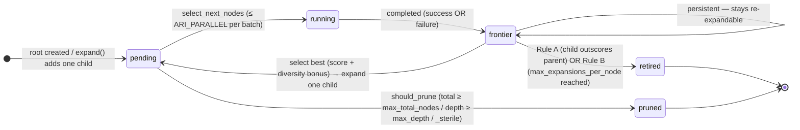

---
sources:
  - path: ari-core/ari/orchestrator/bfts.py
    role: implementation
  - path: ari-core/ari/agent/metric_contract.py
    role: implementation
  - path: ari-core/config/workflow.yaml
    role: config
last_verified: 2026-06-12
---

# BFTS Algorithm

ARI implements true Best-First Tree Search with a two-pool design:

- **`pending`**: nodes ready to run (already expanded from a parent)
- **`frontier`**: completed nodes not yet expanded

The two pools and the transitions between them (the dotted self-loop is the
*persistent frontier* — a completed node stays available for re-expansion):



A failed node is **not** retried: it still enters the frontier and is expanded
into a `debug` child (the `frontier → pending` edge), so recovery happens as a
new node rather than a re-execution.

```python
def bfts(experiment, config):
    root = Node(experiment, depth=0)
    pending = [root]      # nodes ready to execute
    frontier = []         # completed nodes awaiting expansion
    all_nodes = [root]

    while len(all_nodes) < config.max_total_nodes:

        # --- BFTS STEP 1: expand the best frontier node ---
        # LLM reads metrics of all completed nodes and selects
        # the most promising one to expand (one child per call)
        while frontier and len(pending) < max_parallel:
            best = llm_select_best_to_expand(frontier)  # by _scientific_score + diversity_bonus
            # Frontier nodes stay available for re-expansion
            child = llm_propose_one_direction(best, existing_children=best.children)
            pending.append(child)
            all_nodes.append(child)

        # --- BFTS STEP 2: run a batch of pending nodes ---
        batch = llm_select_next_nodes(pending, max_parallel)
        record_run(batch)  # track label diversity
        results = parallel_run(batch)

        for node in results:
            memory.write(node.eval_summary)   # save to ancestor-chain memory
            frontier.append(node)             # will expand when selected

    return max(all_nodes, key=lambda n: n.metrics.get("_scientific_score", 0))
```

Key properties:
- **Single-child expansion**: `expand()` generates exactly one child per call with rich context (sibling scores, ancestor chain, tree diversity metrics, existing children) to avoid duplicates. The prompt also surfaces the current depth/`max_depth` and the remaining node budget so the planner can pace itself (v0.7.2, I-4).
- **Persistent frontier**: completed nodes stay in frontier after expansion, available for re-expansion with `_touched_this_round` / `_failed_this_round` tracking. A frontier node is **retired** when either (Rule A) its child outscores it on `_scientific_score`, or (Rule B) it has been expanded `max_expansions_per_node` times (v0.7.2, B-6).
- **`should_prune` predicate**: hard cutoffs only — `current_total >= max_total_nodes` (B-1), `depth >= max_depth` (B-2, previously dead config), or `metrics._sterile is True` (B-4). LLM judgement happens elsewhere.
- **Diversity bonus**: `+0.05` for underrepresented labels (last 20 runs tracked) when `my_count * 2 ≤ max_count` (I-2); applied in *both* selector fallbacks (I-3 / L-3) and in `select_next_node` LLM prompts.
- **Coverage-aware expansion selection**: when the run carries a claims-bearing metric contract, the goal text passed to `select_best_to_expand` additionally carries a run-level claim-coverage block plus a **LINEAGE** hint (see *Lineage Chaining* below), so "evidences a still-uncovered claim" can inform *which* node to expand — the scheduler-only signal; node reasoning context is untouched.
- **Score calibration**: evaluator injects recent score history into prompts to prevent score collapse (all scores clustering around the same value)
- **No retry**: failed nodes produce `debug` children via `expand()`, not re-executions. ARI does not maintain a `retry_count` field for selection purposes (B-3).
- **Strict budget**: `len(all_nodes) < max_total_nodes` prevents overshoot. The live count is the single source of truth — there is no separate `BFTS.total_nodes` counter (B-1).
- **`record_run` after completion**: the run-loop calls `bfts.record_run(result)` after `future.result()` returns (success or failure), so the diversity bonus reflects nodes that actually executed (I-7).
- **`generate_ideas` called once**: suppressed after root node to prevent looping

### Lineage Chaining

Some declared claims cannot be evidenced by a fresh probe: their evidence is
**computed** from measurements that already exist (parameter fitting, held-out
validation, model-based selection). Under purely score-driven expansion these
claims were structurally unreachable — a child expanded from a data-less parent
had no inputs to compute from and, observed on a real run, regressed to
re-running the same single probe. The enabling mechanism is **parent → child
`work_dir` inheritance**: each child starts from a copy of its parent's working
directory (code, configs, and `results*.json` measurement files inherit; output
artifacts such as logs and result CSVs are blacklisted), so expanding the right
parent puts the input files directly in front of the child. Two steering
signals exploit this (`ari/agent/metric_contract.py`):

- **LINEAGE hint (selector side)**: the run-level claim-coverage block appended
  to the expansion-selection goal names the node holding the most
  contract-evidence measurement names so far (≥ 2 required) and recommends
  expanding *that* node for uncovered computed-evidence claims — the child then
  reads the inherited files instead of re-measuring
  (`build_expand_coverage_hint`).
- **INHERITED DATA note (node side)**: a node whose inherited `work_dir`
  already contains lineage measurements gets a note in its pinned contract
  obligation listing the files and the contract evidence names present, with
  the instruction to compute from them and emit under the EXACT contract names
  — not to re-run the underlying experiments (`build_inherited_data_note`).

Both signals carry **names and file names only**: measurement values and
sibling conclusions never flow, so the branch fault containment the tree relies
on is preserved. Per-node attribution comes from
`collect_node_measurement_names`, which (once `tree.json` exists) counts only
nodes the evaluator marked `has_real_data` — the steering view stays aligned
with the claim gate's evidence view.

### Node Labels

| Label | Meaning |
|-------|---------|
| `draft` | New implementation from scratch |
| `improve` | Tune parent's parameters or algorithm |
| `debug` | Fix parent's failure |
| `ablation` | Remove one component to measure its impact |
| `validation` | Re-run parent with different conditions |
| *(custom)* | Unknown labels fall back to `other`; `raw_label` preserves the original string |

---

## See also

[Architecture](architecture.md) · [Memory architecture](memory.md) · [Configuration → BFTS Evaluation Layers](../reference/configuration.md#bfts-evaluation-layers-configurable) · [Glossary](../reference/glossary.md)
