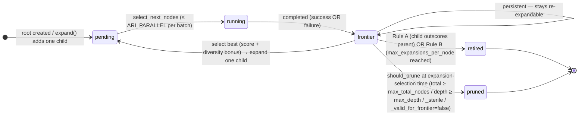

---
sources:
  - path: ari-core/ari/orchestrator/bfts.py
    role: implementation
  - path: ari-core/ari/agent/metric_contract.py
    role: implementation
  - path: ari-core/ari/rqgm/runtime.py
    role: implementation
  - path: ari-core/ari/cli/bfts_loop.py
    role: implementation
  - path: ari-core/ari/cli/run.py
    role: implementation
  - path: ari-core/ari/rqgm/store.py
    role: implementation
  - path: ari-core/config/workflow.yaml
    role: config
last_verified: 2026-08-16
---

# BFTS Algorithm

ARI implements true Best-First Tree Search with a two-pool design:

- **`pending`**: nodes ready to run (already expanded from a parent)
- **`frontier`**: completed nodes not yet expanded

The two pools and the transitions between them (the dotted self-loop is the
*persistent frontier* — a completed node stays available for re-expansion):


```mermaid
stateDiagram-v2
    direction LR
    [*] --> pending: root created / expand() adds one child
    pending --> running: select_next_nodes (≤ ARI_PARALLEL per batch)
    running --> frontier: completed (success OR failure)
    frontier --> frontier: persistent — stays re-expandable
    frontier --> pending: select best (score + diversity bonus) → expand one child
    frontier --> retired: Rule A (child outscores parent) OR Rule B (max_expansions_per_node reached)
    frontier --> pruned: should_prune at expansion-selection time (total ≥ max_total_nodes / depth ≥ max_depth / _sterile / _valid_for_frontier=false)
    retired --> [*]
    pruned --> [*]
```

A failed node is **not** retried: it still enters the frontier and is expanded
into a `debug` child (the `frontier → pending` edge), so recovery happens as a
new node rather than a re-execution.

```python
def bfts(experiment, config):
    root = Node(experiment, depth=0)
    pending = [root]      # nodes ready to execute
    frontier = []         # completed nodes awaiting expansion
    all_nodes = [root]

    while len(all_nodes) < config.max_total_nodes:

        # --- BFTS STEP 1: expand the best frontier node ---
        # LLM reads metrics of all completed nodes and selects
        # the most promising one to expand (one child per call)
        while frontier and len(pending) < max_parallel:
            best = llm_select_best_to_expand(frontier)  # by _scientific_score + diversity_bonus
            # Frontier nodes stay available for re-expansion
            child = llm_propose_one_direction(best, existing_children=best.children)
            pending.append(child)
            all_nodes.append(child)

        # --- BFTS STEP 2: run a batch of pending nodes ---
        batch = llm_select_next_nodes(pending, max_parallel)
        results = parallel_run(batch)

        for node in results:
            record_run(node)                  # AFTER completion: label diversity
            memory.write(node.eval_summary)   # save to ancestor-chain memory
            frontier.append(node)             # will expand when selected

    return max(all_nodes, key=lambda n: n.metrics.get("_scientific_score", 0))
```

Key properties:
- **Single-child expansion**: `expand()` generates exactly one child per call with rich context (sibling scores, ancestor chain, tree diversity metrics, existing children) to avoid duplicates. The prompt also surfaces the current depth/`max_depth` and the remaining node budget so the planner can pace itself (v0.7.2, I-4).
- **Persistent frontier**: completed nodes stay in frontier after expansion, available for re-expansion with `_touched_this_round` / `_failed_this_round` tracking. A frontier node is **retired** when either (Rule A) its child outscores it on `_scientific_score`, or (Rule B) it has been expanded `max_expansions_per_node` times (v0.7.2, B-6).
- **`should_prune` predicate**: hard cutoffs only — `current_total >= max_total_nodes` (B-1), `depth >= max_depth` (B-2, previously dead config), `metrics._sterile is True` (B-4), or `metrics._valid_for_frontier is False` (RQGM selective erasure; the key is written only by RQGM machinery, so the clause is inert under `simple_bfts` — but it is read unconditionally, so a node erased under `ari_rqgm` stays excluded after a switch back). LLM judgement happens elsewhere.
- **Diversity bonus**: `+0.05` for underrepresented labels (last 20 runs tracked) when `my_count * 2 ≤ max_count` (I-2); applied in *both* selector fallbacks (I-3 / L-3) and in `select_next_node` LLM prompts.
- **Coverage-aware expansion selection**: when the run carries a claims-bearing metric contract, the goal text passed to `select_best_to_expand` additionally carries a run-level claim-coverage block plus a **LINEAGE** hint (see *Lineage Chaining* below), so "evidences a still-uncovered claim" can inform *which* node to expand — the scheduler-only signal; node reasoning context is untouched.
- **Score calibration**: evaluator injects recent score history into prompts to prevent score collapse (all scores clustering around the same value)
- **No retry**: failed nodes produce `debug` children via `expand()`, not re-executions. ARI does not maintain a `retry_count` field for selection purposes (B-3).
- **Strict budget**: `len(all_nodes) < max_total_nodes` prevents overshoot. The live count is the single source of truth — there is no separate `BFTS.total_nodes` counter (B-1).
- **`record_run` after completion**: the run-loop calls `bfts.record_run(result)` after `future.result()` returns (success or failure), so the diversity bonus reflects nodes that actually executed (I-7).
- **`generate_ideas` called once**: suppressed after root node to prevent looping

### Lineage Chaining

Some declared claims cannot be evidenced by a fresh probe: their evidence is
**computed** from measurements that already exist (parameter fitting, held-out
validation, model-based selection). Under purely score-driven expansion these
claims were structurally unreachable — a child expanded from a data-less parent
had no inputs to compute from and, observed on a real run, regressed to
re-running the same single probe. The enabling mechanism is **parent → child
`work_dir` inheritance**: each child starts from a copy of its parent's working
directory (code, configs, and lineage `results*.json` measurement files inherit;
`_OUTPUT_BLACKLIST` holds back the output artifacts — logs, result CSVs, and
`results.json` / `*_results.json` themselves, so a child cannot re-read its
parent's headline numbers as its own), so expanding the right
parent puts the input files directly in front of the child. Two steering
signals exploit this (`ari/agent/metric_contract.py`):

- **LINEAGE hint (selector side)**: the run-level claim-coverage block appended
  to the expansion-selection goal names the node holding the most
  contract-evidence measurement names so far (≥ 2 required) and recommends
  expanding *that* node for uncovered computed-evidence claims — the child then
  reads the inherited files instead of re-measuring
  (`build_expand_coverage_hint`).
- **INHERITED DATA note (node side)**: a node whose inherited `work_dir`
  already contains lineage measurements gets a note in its pinned contract
  obligation listing the files and the contract evidence names present, with
  the instruction to compute from them and emit under the EXACT contract names
  — not to re-run the underlying experiments (`build_inherited_data_note`).

Both signals carry **names and file names only**: measurement values and
sibling conclusions never flow, so the branch fault containment the tree relies
on is preserved. Per-node attribution comes from
`collect_node_measurement_names`, which (once `tree.json` exists) counts only
nodes the evaluator marked `has_real_data` — the steering view stays aligned
with the claim gate's evidence view.

### Node Labels

| Label | Meaning |
|-------|---------|
| `draft` | New implementation from scratch |
| `improve` | Tune parent's parameters or algorithm |
| `debug` | Fix parent's failure |
| `ablation` | Remove one component to measure its impact |
| `validation` | Re-run parent with different conditions |
| *(custom)* | Unknown labels fall back to `other`; `raw_label` preserves the original string |

---

## Governed BFTS under `ari_rqgm` (opt-in)

In the opt-in `ari_rqgm` execution mode the algorithm above is unchanged —
governance *wraps* it at five seams (the first four fail-open; under the
default `simple_bfts` none of this code is imported):

- **`GovernedSearchStrategy` seam** (`ari/rqgm/runtime.py`): `build_runtime`
  wraps the BFTS strategy in a pure-delegation wrapper implementing the same
  seven `SearchStrategy` methods. The run loop detects it with one
  duck-typed read (`getattr(bfts, "rqgm", None)`); selection, pruning, and
  diversity logic are forwarded verbatim.
- **Summary-only expand context**: when a selected `ProposalRecord` exists,
  the `idea_context` passed into `expand()` is re-rendered from its capped
  `ProposalSummaryView` (budget: `proposal_router.summary_budget_chars`)
  instead of the raw `idea.json` text; each proposed child direction is
  recorded back as a proposal observation. Full records never reach BFTS.
- **Epoch boundaries**: the loop calls `ensure_epoch` at start and at each
  outer-loop head; after every `rqgm.epoch.nodes_per_epoch` new nodes the
  boundary transaction runs on the main thread (audit → transition →
  repair) with no node in flight. After evaluation, each completed node also
  gets a best-effort adversarial round before its node report is written.
- **Frontier repair hook**: the boundary tick receives the live
  `frontier`/`pending`/`all_nodes` state so retirements can logically erase
  stale records and rebuild the frontier; a double kernel-validation failure
  sets `expansion_halted` and the loop drains pending work without further
  expansion.
- **Assurance-gated frontier admission** — a further opt-in *on top of*
  `ari_rqgm`, active only when one of `knowledge.mode` / `capability_binding.mode`
  / `assurance.mode` leaves its legacy-inert default (`off` / `legacy` / `off`).
  Every completed node then goes through `RQGMRuntime.assure_node` first, and
  frontier admission, Rule A and Rule B are all deferred until the assurance
  gate, sterile detection, the adversarial round and the typed node report have
  finished. A node the gate classifies `uncertified_frontier` is held out of the
  frontier, and Rule A additionally requires the child to be
  `scientific_frontier` rather than merely non-`_sterile`. Unlike the seams
  above, this one is fail-closed: an RQGM runtime with no `assure_node` bridge
  raises rather than falling through to the legacy ordering.

The layers, epoch algorithm, and invariants are documented in
[Constitutional ARI-RQGM Architecture](rqgm_architecture.md).

---

## Resume rebuilds the tree, not the search state

`ari resume` reads `tree.json` and rebuilds one `Node` per entry, but it
reconstructs **only a subset** of each node's state, and it rebuilds none of
the search algorithm's own state. Both halves matter when reasoning about a
resumed run.

**Node state.** The resume path in `ari-core/ari/cli/run.py` restores `id`,
`parent_id`, `depth`, `retry_count`, `artifacts`, `eval_summary`, `error_log`,
`children`, `created_at`, `completed_at`, `ancestor_ids`, the producer and
RQGM provenance/assurance fields, and then `status`, `label`, `metrics`,
`has_real_data` and `evaluation_cases`. Several keys that `Node.to_dict()`
writes are *not* read back — `trace_log`, `evaluation_status`, `raw_label`,
`name`, `original_direction` and `node_report_path` — and fields that never
reach `tree.json` at all (`memory_snapshot`, `full_messages`, `full_tools`,
the agent self-report fields, `measurement_audit`, `evaluator_reason`) start
at their dataclass defaults. Nodes whose status was PENDING or FAILED are
reset to PENDING and re-queued; everything else is treated as done.

**Search state.** A resumed run constructs a fresh `BFTS` through
`build_runtime` and re-enters `_run_loop` from the top, so three counters
restart empty:

| Counter | Home | What restarts |
|---|---|---|
| `BFTS._expansion_count` | `ari/orchestrator/bfts.py` | Retire Rule B's per-node expansion tally, so a node that had already reached `max_expansions_per_node` becomes expandable again |
| `BFTS._recent_label_history` | `ari/orchestrator/bfts.py` | The diversity-bonus window (last 20 labels), so the `+0.05` underrepresented-label bonus is computed from an empty history |
| `_lineage_actions_taken` | `ari/cli/bfts_loop.py` | The lineage hook's per-run budget against `rate_limit_per_run`, which refills |

None of the three is persisted, and none can be: `tree.json` is a
contract-frozen, additive-only format (see
[Architecture](architecture.md), *The exploration-phase must-not-break
register (BX-1 … BX-19)*, item BX-7), so new search state cannot ride along
inside it.

**Why epoch state has its own files.** This is exactly why the governed mode
does not try to keep epoch state in the tree or in memory. It persists to its
own checkpoint-root files, written by `ari/rqgm/store.py`:
`rqgm_transitions.jsonl` is the append-only, hash-chained source of truth
replayed on resume, `rqgm_audit.jsonl` is the immutable audit log, and
`epoch_state.json` / `rqgm_registry.json` are derived snapshots that are
validated against replay on load and rebuilt on mismatch. Mode provenance
lives in a fifth file, `rqgm_state.json`. Resume reads `tree.json` first and
reconciles the mode afterwards, but the order does not matter to the outcome:
the persisted mode wins over both config and environment, so a run's mode
never flips mid-run and a `simple_bfts` checkpoint never upgrades on resume.

---

## See also

[Architecture](architecture.md) · [Constitutional ARI-RQGM Architecture](rqgm_architecture.md) · [Memory architecture](memory.md) · [Configuration → BFTS Evaluation Layers](../reference/configuration.md#bfts-evaluation-layers-configurable) · [Glossary](../reference/glossary.md)
