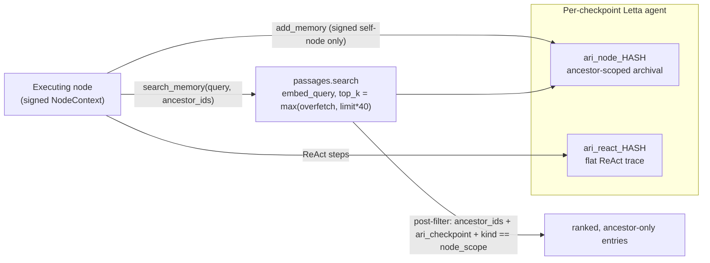

---
sources:
  - path: ari-core/ari/memory/letta_client.py
    role: implementation
  - path: ari-skill-memory
    role: implementation
last_verified: 2026-08-02
---

# Memory Architecture

Each node reads only from its ancestor chain:

```
root ──▶ memory["root"]
  ├─ node_A ──▶ memory["node_A"]
  │    ├─ node_A1  (reads: root + node_A)
  │    └─ node_A2  (reads: root + node_A, NOT node_A1)
  └─ node_B  (reads: root only, NOT node_A branch)
```

`search_memory` is invoked with `query = node.eval_summary` (a one-
sentence direction text). On Letta 0.16.7 the skill calls
`passages.search` (`GET /archival-memory/search`, `embed_query=True`)
with `top_k = max(letta_overfetch, limit*40)`, then post-filters the
ranked window by `ancestor_ids`, `ari_checkpoint`, and
`kind == "node_scope"` locally. The embedding-rank order returned by
the server is preserved — children see entries most relevant to
their query first. The deliberately-skipped sibling endpoint
`passages.list(search=q)` is **not** semantic — it routes to a SQL
substring filter (`LOWER(text) LIKE LOWER(%q%)`) which silently
returns 0 against long natural-language queries on structured
passages like `RESULT SUMMARY metrics=[...]`. See
`ari-skill-memory/src/ari_skill_memory/backends/letta_backend.py`
for the live verification.

### v0.6.0: backed by Letta

Both layers live in the same per-checkpoint Letta agent:

- `ari_node_<ckpt_hash>` — node-scope archival collection with the
  ancestor-scope metadata filter above.
- `ari_react_<ckpt_hash>` — flat per-checkpoint ReAct trace
  (`LettaMemoryClient`, not ancestor-filtered).

The read and write paths through these two collections (`HASH` = checkpoint
hash; signed context validation and the post-filter enforce scope):



The agent also seeds a core-memory block (`persona` + `human` +
`ari_context`) with experiment goal, primary metric, and hardware spec
once the first node's `generate_ideas` completes (the point at which
`primary_metric` is known). Skills can read it via
`get_experiment_context()` without paying for a search; the call
returns `{}` until that seed runs.

**Copy-on-Write**: every memory call carries an explicit `RunContextV1` and
`NodeContextV1`. The node context binds `run_id`, self node, parent, and the
ordered root-to-parent ancestor list to a `lineage_digest`. ari-core injects a
per-connection signed capability after tool arguments leave the model; the
memory skill verifies it before I/O. Writes may target only self, and reads may
name only the signed lineage (plus self where the tool permits it). No mutable
process-global node variable is involved, so parallel siblings cannot race or
authorize one another. Letta self-edit remains disabled so accepted entries are
byte-stable.

**Portability**: each checkpoint carries a digest-verified
`memory_backup.v1.json.gz` snapshot. `ari resume` validates it before restoring
an empty target Letta, so `cp -r checkpoints/foo /elsewhere/` remains safe.
Records are content-addressed and the backup is independent of the Letta
checkpoint namespace.

Typed research entries use the public `MemoryRecordV1` contract and every
semantic search returns `MemoryRetrievalV1` provenance (backend/server/model
versions, ranking determinism, query digest, bounds, and filter evidence).
Memory text is an index; only verified artifact references may ground paper or
figure claims. See [Research memory contract](../reference/memory_contract.md).

---

## See also

[Architecture](architecture.md) · [BFTS algorithm](bfts.md) · [Glossary](../reference/glossary.md)
