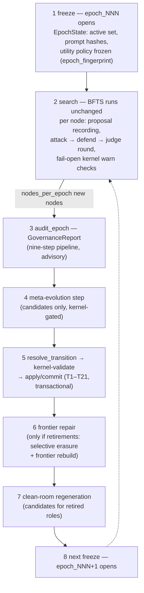

---
sources:
  - path: ari-core/ari/rqgm
    role: implementation
  - path: ari-core/ari/core.py
    role: implementation
  - path: ari-core/ari/cli/bfts_loop.py
    role: implementation
  - path: ari-core/ari/config/__init__.py
    role: implementation
  - path: ari-core/ari/configs/defaults.yaml
    role: config
  - path: ari-core/ari/paths.py
    role: implementation
  - path: ari-core/ari/rqgm/events.py
    role: implementation
  - path: ari-core/ari/rqgm/transition_rules.py
    role: implementation
  - path: ari-core/ari/rqgm/utility_evolution.py
    role: implementation
  - path: ari-core/ari/rqgm/paper_mode.py
    role: implementation
  - path: ari-core/ari/rqgm/paper_runtime.py
    role: implementation
  - path: ari-core/ari/rqgm/paper_archive.py
    role: implementation
  - path: ari-core/ari/rqgm/paper_anchor.py
    role: implementation
  - path: ari-core/ari/rqgm/paper_self_preference.py
    role: implementation
  - path: ari-core/ari/schemas
    role: schema
  - path: ari-core/ari/knowledge
    role: implementation
  - path: ari-core/ari/capability_binding
    role: implementation
  - path: ari-core/ari/assurance
    role: implementation
  - path: ari-core/ari/prompts/rqgm
    role: prompt
  - path: ari-core/ari/prompts/governance
    role: prompt
last_verified: 2026-08-03
---

# Constitutional ARI-RQGM Architecture

Constitutional ARI-RQGM is ARI's opt-in `ari_rqgm` execution mode: an
epoch-based governance and co-evolution layer wrapped around the unchanged
BFTS loop. `simple_bfts` remains the default; with no `ari:`/`rqgm:` config
blocks, no `ari.rqgm` module is even imported and checkpoints stay
byte-identical to pre-RQGM ARI. Activation, the mode interlock, and the
mode-switch policy live in [Execution Modes](../guides/execution_modes.md);
this page is the architecture: why the mode exists, what its layers are, how
an epoch runs, and which invariants hold.

> **For the runtime walkthrough see
> [RQGM Runtime Walkthrough](rqgm_runtime_walkthrough.md)** — one real
> `ari_rqgm` run traced step by step (boot → founding registration →
> per-node hooks → boundary → what lands on disk), with event-log excerpts
> and an observability cheat-sheet.

---

## Complete audit network

[](../assets/images/rqgm/rqgm_audit_flow_en.svg)

The left side enumerates the whole sanctionable set: research, selection,
utility and optional paper roles; the eight adversaries, Defender, and Artifact
Judge; the three governance-judiciary roles; and the five meta roles. The
right side shows how those components form a network rather than six isolated
checks. Each governed output enters the append-only audit ledger. Per-node
attacks must pass defense and artifact adjudication before becoming evidence.
At the epoch boundary, deterministic reliability aggregation and the Evidence
Clerk feed Auditor-only motions, one defense per motion, and a board-bounded
Governance Judge. Every record produced by that judiciary returns to the
ledger and is re-checked by the fixed kernel.

The bottom band separates advice from enforcement. The Governance Report goes
to the sole Registry Transition Engine; the fixed kernel validates the
resolved T1–T21 transition before an atomic commit, and retirement triggers
impact repair. The fixed claim verifier independently checks the paper before
finalization. The open paths remain explicit: the sole Auditor cannot file a
same-role motion against itself, and a targeted Governance Judge recuses
without an independent substitute. Both require external adjudication. Select
the figure to open it at full size.

---

## Motivation

ARI's institutional components — the LLM roles that propose research
directions, review nodes, and judge quality — are themselves prompt-defined
artifacts. Letting them evolve unlocks improvement, but unconstrained
self-modification is exactly what the Gödel-machine literature warns about:
a component that can rewrite its own evaluator will eventually reward
itself. The Red Queen Gödel Machine line of work
([arXiv:2606.26294](https://arxiv.org/abs/2606.26294)) adds the Red-Queen
dynamic — components improve *because* adversaries co-evolve against them —
but co-evolution alone does not bound the failure modes (score inflation,
metric gaming, evidence fabrication, collusion between roles).

Constitutional ARI-RQGM takes the co-evolutionary loop and places it under a
**fixed constitutional layer that never evolves**. Prompts and components
compete, attack, defend, and get adopted or retired — but every state change
is validated by a deterministic, non-LLM kernel against rule tables frozen
in code. The enforcement stance is "block the institution, not the
research": governance can veto its *own* state changes (adoptions,
retirements, registry writes), never a node's execution.

---

## The four pillars

Constitutional ARI-RQGM rests on four defining commitments. Every
mechanism on this page serves one of them, and each is honest about how far
the current implementation carries it:

1. **A tree search whose score is itself rewritten at every boundary.**
   BFTS is a best-first *tree*, and the utility policy that ranks its
   frontier is not a run-constant — it is a governed object frozen per epoch
   and rewritten at boundaries through the same lifecycle that evolves
   prompts (see [Governed utility evolution](#governed-utility-evolution)).
   The *consequence* half is live: a rewrite retires the old policy and
   `frontier_repair` re-scores every comparable node from its stored raw axes
   under the new criterion, invalidating only nodes that cannot be safely
   re-scored. The *cause* half is a governed `policy_mutator` that proposes
   the successor.
2. **Adversaries attack artifacts *and* evaluations; collusion is
   forbidden.** The seven exploration adversaries attack a node's
   *artifacts*; the eighth, `paper_self_preference`, attacks a *reviewer's
   decisions* (an AI draft the reviewer over-accepted). A score policy is
   never proposed from the frontier's own scores — a policy tuned to flatter
   the nodes it already produced is exactly the self-referential loop the
   determinism/no-collusion principle forbids (`PolicyMutator` sees only the
   boundary's already-abstract evidence, `utility_evolution.py`).
3. **The adversary is itself in the audit network — no absolute ruler.**
   The components that attack, propose the score, or operate the judiciary
   are registered and sanctionable. Evolvable roles such as
   `policy_mutator_v1` can gain successors; the Auditor, Evidence Clerk, and
   Governance Judge have no prompt-mutation successor path, but they can
   still be warned, retired, or banned. A Governance Judge targeted by its
   own motion is recused. Nothing sits outside the transition table.
4. **Everything is constitution-bound; impeachment follows the
   constitution.** Every state change is validated by the non-evolving
   kernel against frozen rule tables pinned by `constitution_hash`; the only
   way a healthy behavioral component loses its seat is an
   `ImpeachmentMotion` filed by the Auditor, adjudicated at a boundary. The
   two supersession edges (T20/T21) are the *sole* exceptions to the
   sanction-only replacement model, and each is kernel-guarded to one role
   family.

---

## The three layers

The role and tier vocabularies are closed sets in `ari/rqgm/events.py`
(`EVOLVABLE_ROLES`, `GOVERNANCE_ACTOR_ROLES`, `FIXED_ROLES`, `TIERS`);
component ids are `{role}_v{N}`, prompt ids `{role}_prompt_v{N}`.

| Layer | Tier | Roles | Evolves? |
|---|---|---|---|
| **0 — constitutional (fixed)** | `fixed` | `constitutional_kernel`, `knowledge_binder`, `capability_binder`, `harness_resolver`, `fixed_verifier`, `audit_log` | **Never.** Prompt-free and deterministic, and registered for provenance only — registered *at all* only when a Knowledge/Capability/Assurance layer is enabled: the six rows are `KCA_FIXED_COMPONENT_TABLE` (`prompt_spec.py`), committed by their own `transition_kca_fixed_admission` transaction, never by the founding one. Rule tables live in code (`kernel_rules.py`, `transition_rules.py`, `clean_room_rules.py`, `meta_rules.py`), pinned by a `constitution_hash` that any rule edit must explicitly re-pin in `tests/test_rqgm_kernel.py`. |
| **1 — institutional** | `institutional` | `generator`, `reviewer`, `adversary`, `defender`, `judge`, `router`; the governed evaluation criterion `utility_policy`; and (paper-mode only) `paper_writer`, `paper_reviewer` | Yes — through the prompt-evolution lifecycle, at epoch boundaries only. `utility_policy` is not prompt-defined — its incumbent is a policy *document* — but it is evolvable in exactly the same sense: one incumbent, replaced only through the transition engine at a boundary. |
| **1 — governance judiciary** | `institutional` | `auditor`, `evidence_clerk`, `governance_judge` | No successor-generation path, but not immutable: all three are founding, registry-addressable, sanctionable actors. The judge recuses when it is the motion target. |
| **2 — meta** | `meta` | `prompt_mutator`, `clean_room_generator`, `replay_selector`, `failure_summary_compressor`, `policy_mutator` | Yes — the agents that evolve Layer 1 are themselves governed, with strictly narrower authority (see invariants). `policy_mutator` proposes successor utility policies. |

The role and tier vocabularies were closed sets from day one; Task 14 and the
paper phase un-froze `policy_mutator` and `utility_policy` (both were named by
live code but registrable by neither half of `ROLES`) and added
`paper_writer` / `paper_reviewer` as paper-mode-gated founding rows, so an
exploration `ari_rqgm` boot registers byte-identically to before
(`EVOLVABLE_ROLES`, `ari/rqgm/events.py`).

The bundled `constitution.yaml` copied into each `ari_rqgm` checkpoint is a
human-readable statement only — editing it changes nothing; the code tables
are authoritative.

---

## Knowledge, Capability, and Assurance separation

RQGM governs three non-component registries without merging their identities:

```text
Research Contract
  -> Epoch Knowledge Skill Lock
  -> Capability Binding Lock
  -> Verification Contract
  -> Baseline/active Harness Lock
  -> bound Provider execution
  -> artifact-bound Harness Attestation
  -> scientific frontier gate
  -> Evidence Clerk and adversarial/governance review
  -> certification-bound publication
```

A Knowledge Skill is immutable procedural text and cannot start a process or
grant authority. A Capability Provider is the executable subject discovered
through MCP, local process, or another admitted transport; only tools in the
Provider lock and Capability Binding Lock are visible. A Harness is an
independent verifier selected by `harness_resolver_v1`, never by the Generator
or Evaluator. Individual Skills, Providers, and Harnesses are catalog entries,
not `ComponentRegistry` actors.

All three layers are opt-in and inert at the shipped defaults
(`knowledge.mode: off`, `capability_binding.mode: legacy`,
`assurance.mode: off` in `ari-core/ari/configs/defaults.yaml`). With all three
at those values `RQGMRuntime` reports `kca_feature_enabled: false`: an
`ari_rqgm` run registers no `fixed`-tier components, admits no baseline
bundle, and keeps the legacy MCP discovery/visibility. Any other value on any
one of the three enables the feature, and the run loop's admission call is
then deliberately fail-closed rather than best-effort.

The trusted coordinator freezes every baseline catalog snapshot, contract,
and lock before the first execution epoch. Resume reconstructs that persisted
view instead of consulting current catalogs. Fixed checks `CK-KNW-*`,
`CK-CAP-*`, and `CK-HAR-*` validate authority, binding, digests, monotonicity,
and attestation scope; the kernel does not recompute scientific truth. See the
[normative K/C/A reference](../reference/knowledge_capability_assurance.md).

---

## The four facades

`ari.core.build_runtime` constructs a single `RQGMRuntime`
(`ari/rqgm/runtime.py`) only when `ari.mode: ari_rqgm` and
`rqgm.enabled: true` agree, then wraps the BFTS strategy in a
pure-delegation `GovernedSearchStrategy`. The run loop discovers RQGM by one
duck-typed read — `getattr(bfts, "rqgm", None)` — so `simple_bfts` pays a
single failed attribute lookup. Inside the runtime, four facades own the
governance machinery (all constructed lazily, all fail-open):

| Facade | Module | Owns |
|---|---|---|
| `ConstitutionalKernel` | `ari/rqgm/kernel.py` | Layer 0. Sixteen closed `validate_*` entry points: the original twelve (record schema, hashes, capability, epoch invariance, transitions, role separation, selective erasure, audit-log integrity, clean-room bundle, contamination, authority non-expansion, context scope), the Task-14 `validate_utility_policy`, plus Knowledge integrity, Capability Binding integrity, and Harness integrity. It checks procedure, authority, identity, and monotonicity—not scientific correctness. Deterministic and non-evolving: zero LLM calls, zero network, zero wall-clock decisions. `rqgm.kernel.enforcement: audit_only` downgrades every context to warn-and-log. |
| `GovernanceOrchestrator` | `ari/rqgm/governance/` | The epoch-boundary audit: `audit_epoch(...) -> GovernanceReport`, a nine-step pipeline (observe → assess reliability → assemble evidence → prosecute → defend → adjudicate → replay-pool update → self-audit → report). Every LLM decision (Auditor / Defender / GovernanceJudge, prompts under `ari/prompts/governance/`) has a total deterministic fallback, so `llm=None` still produces a complete audit. The report is *advisory input* to the transition engine — the orchestrator never mutates registries. Construction makes that authority relationship non-optional: a missing `kernel` raises `ValueError` in `__init__`, because the kernel — not the orchestrator's own record builders — is the role-separation authority, and it is the kernel that re-validates the records the audit produced (evidence bundles, motions, defenses, outcomes) at step 8, via `validate_record_schema` and `validate_role_separation`. The other two seams are optional by design: `llm=None` is the guaranteed-degradation, CI-friendly deterministic floor, and `audit_writer=None` collects records in memory on `self.written` instead of writing them, which is how the tests observe the audit. Appending a record never raises — a writer failure is logged and the audit continues. |
| `RegistryTransitionEngine` | `ari/rqgm/transition_engine.py` | The **sole** registry status writer. Pure `resolve_transition(...)` against the fixed T1–T21 table, then a five-step boundary protocol: freeze → resolve → kernel-validate → prepare → apply/commit over the epoch transaction. A T16 `emergency_quarantine` force-closes the current epoch and opens a newly fingerprinted epoch in that same transaction. |
| `FrontierRepairEngine` | `ari/rqgm/frontier_repair.py` | After a committed transition with retirements: the pure `trace_dependents` staleness closure and `rebuild_frontier`, emitting `SelectiveErasureEvent` / `FrontierRebuildEvent` records. Failure ladder: kernel-validation failure → conservative re-repair (flagged nodes dropped) → drain-only degradation (`expansion_halted`: the run finishes pending work but expands no further). Never a crash. |

Supporting components hang off the same runtime: the `ProposalRouter` +
generators (`ari/rqgm/proposals/`, with the optional MCP-only
`VirSciAdapter`), the per-node `AdversarialRound` and `AdversarialReplayPool`
(`ari/rqgm/adversarial/`), the prompt-evolution pipeline and
`GovernedPromptLoader` (`ari/rqgm/prompt_evolution.py`, `prompt_loader.py`),
the `CleanRoomCoordinator` (`clean_room.py`), the
`MetaEvolutionCoordinator` (`meta_evolution.py`), and the
`GovernanceBudgetManager` (`budget.py`).

---

## The epoch cycle

Governance is epoch-based. An epoch freezes the institution; the boundary is
the only window where the institution may change. The v1 boundary trigger is
node count (`rqgm.epoch.boundary: node_count`,
`rqgm.epoch.nodes_per_epoch: 10`), checked by the run loop's
`ensure_epoch` tick at loop start and at each outer-loop head — main
thread, no node in flight. The same tick runs once more at end-of-run,
so the boundary still fires when the Nth node is created in the final
loop iteration (a trailing epoch that has not met the trigger stays
open).



1. **Freeze.** `freeze_epoch` (`ari/rqgm/state.py`) pins the active
   component set, prompt hashes, and utility policy into an immutable
   `EpochState`. Its `policy_fingerprint` binds the serving set and resolved
   governance settings; its `execution_fingerprint` binds the declared model,
   decoding, tools, environment, and data snapshot. Missing external revision
   pins are recorded as `unresolved`. `epoch_fingerprint` composes both. The frozen policy
   is the **adopted** one — `capture_utility_policy(cfg, registries=)` reads
   the active `utility_policy` entry, falling back to the resolved `cfg`
   only at epoch 0 or when no policy has been adopted (byte-identical to the
   pre-Task-14 function). Epoch ids are
   `epoch_000`, `epoch_001`, … On a fresh checkpoint, the **founding
   registration** runs at boot, before `epoch_000` ever opens: one
   transaction registers the frozen founding tables
   (`ari/rqgm/prompt_spec.py` — 32 prompt-or-policy records and 20 components for an
   exploration boot; 31 prompt rows and all 20 component rows are frozen
   code constants, and `utility_policy_prompt_v1` is derived from the
   resolved config) on
   `rqgm_transitions.jsonl`, so the first freeze carries a non-empty
   active set. Paper-archive boot adds three gated prompts and components
   (`paper_writer`, `paper_reviewer`, `paper_self_preference`) for totals of
   35 and 23. Write-once: resume replays the transaction, never re-registers.
2. **Search.** BFTS explores exactly as in `simple_bfts`. Per node, three
   best-effort hooks run: expansion directions are captured as
   `ProposalRecord`s, evaluated nodes get an adversarial round (one of the
   seven exploration adversaries attacks the node's *artifacts*; the
   paper-only eighth type attacks reviewer decisions; the defender responds;
   the `ArtifactJudge` adjudicates; only judge-validated attacks apply a
   bounded score penalty), and per-node kernel checks warn-and-flag.
3. **Audit.** At the boundary the closing epoch is audited *first*, so the
   `GovernanceReport` is available to the transition engine.
4. **Meta step.** The meta tier (prompt mutator, clean-room generator, …)
   runs sandboxed and may emit outputs — every one enters the lifecycle at
   `status: candidate`, never as an activation.
5. **Transition.** `resolve_transition` is a pure function of (epoch state,
   governance report, candidate evaluations, registries, status history,
   config) — byte-identical on re-run. The kernel validates the resolved
   transition; a blocked transition aborts fail-closed with the incumbent
   active set still serving (governance-suspended carry-over — the run
   never aborts). Commits are transactional: a double-commit of the same
   `transition_id` is a guarded no-op, and interrupted transactions are
   discarded on resume and re-run deterministically.
6. **Frontier repair.** If the committed transition retired components or
   prompts, every record materially dependent on a retired `prompt_hash`
   is logically erased — excluded from frontier scoring, expansion, and
   best-node selection — and the frontier is rebuilt (see invariant 6).
7. **Clean room.** Pending clean-room requests execute inside the boundary
   window; admissible outputs enter the lifecycle as candidates for the
   *next* cycle. A retired role's slot is meanwhile served by the baseline
   fallback, so no governed role is ever vacant.
8. **Next freeze.** The new epoch opens with the (possibly changed) active
   set frozen again.

Components move through ten statuses (`candidate`, `validated`, `shadow`,
`probationary_active`, `active`, `warning`, `probation`, `quarantine`,
`retired`, `banned`) along the fixed T1–T21 table in
`ari/rqgm/transition_rules.py`. Only `rqgm.transition.*` numeric thresholds
are configurable; the table topology is a constitutional amendment surface
(code + test change), never config. The last two rows are the
**supersession edges**, each kernel-guarded to one role family and each
firing only *inside* a same-role T6 adoption (there is never a displacement
without an adopted successor to justify it):

* **T20** (`active → retired`, `superseded_by_adopted_successor`) is the
  `utility_policy` edge (Task 14): a validated, shadow-passed successor
  policy that scores at least as well displaces the *healthy* incumbent and
  retires it with the **old** `utility_policy_hash`. This is the only
  `active → retired` edge; for every behavioral role the kernel rejects it
  (retirement must still stage through quarantine).
* **T21** (`active → shadow`, `reinstatable_standby`) is the paper-role edge
  (`paper_writer` / `paper_reviewer`): when a shadow-passed successor prompt
  adopts, the demoted incumbent moves to a reinstatable `shadow` standby so
  exactly one active entry survives per paper role. Unlike T20 it is not a
  retirement — a later boundary can re-climb the standby.

The boundary audit is not the only governed decision in the loop, and it does
not subsume the other one. The **lineage-decision hook**
(`lineage_decision:` in `config/workflow.yaml`, read once at loop start)
governs *research direction* per node whenever its `mode` is not `off`:
after a node is saved it may keep exploring, switch to a runner-up idea, fan
out a child run, or terminate the lineage — capped by its own
`rate_limit_per_run` (which counts the non-`continue` actions of a run) and
appended to `lineage_decisions.jsonl`. `audit_epoch` governs *component trustworthiness*
per epoch: it runs once per boundary inside the `ensure_epoch` tick above
(the closing epoch is audited before the transaction), is capped by
`rqgm.governance.max_llm_calls_per_audit`, and appends to `rqgm_audit.jsonl`.
In v1 these are two mechanisms sharing one loop — separate config, separate
caps, separate record streams — and neither gates the other: a boundary audit
never waits on a lineage decision, and a lineage decision never reads a
`GovernanceReport`. (The one thread between them is re-ideation: a stagnation
or a pivot decision also pokes the `ProposalRouter`, which appends to that
same `lineage_decisions.jsonl` with `trigger: "proposal_router"` — the
governance audit is not on that path.) Unifying the two is deferred beyond
v1: nothing in the design precludes it, but their rate-limiting interplay has
not been designed, so read them as independent mechanisms that happen to
share a loop.

---

## Governed utility evolution

The defining claim is that the search is tree-structured **and that at each
epoch boundary the entire score — the utility function itself — is
rewritten.** The *consequence* half was always live: `frontier_repair` can
destroy every score a retired utility policy produced. Task 14 supplies the
*cause* half — something that proposes a successor policy — and repeals the
one invariant (I-11) that used to forbid the score from changing.

**The utility policy is a governed object.** The policy body
(`composite`, `axis_weights`, `frontier_score`, `depth_penalty_lambda`,
`ucb_c`) is frozen per epoch and rewritten at boundaries.
`capture_utility_policy(cfg, registries=)` (`ari/rqgm/state.py`) reads the
**adopted** policy from the registry, degrading to the resolved `cfg` at
epoch 0, under `simple_bfts`, or on any read/verify failure (always the
incumbent regime, never a raise). Before Task 14 this function read only the
static cfg, so `utility_policy_hash` was a run-constant and the retirement
`frontier_repair` waits for could never fire.

**The proposer.** `PolicyMutator` (`ari/rqgm/utility_evolution.py`) is a
`PromptMutator` analog: it emits `UtilityPolicyCandidate` records **only** and
exposes no registry/store write surface. Its four default mutation kinds
(`axis_reweighting`, `composite_swap`, `frontier_score_swap`,
`exploration_tuning`) are pure arithmetic over the boundary's already-abstract
evidence — no LLM, no clock, no randomness — so the default rewrite is fully
reproducible; only the opt-in `freeform_policy_proposal` consults an LLM (and
returns `None` when none is configured). The candidate is kernel-validated
against the `CK-UTL-001…008` legality rules (allowed `composite` /
`frontier_score` sets, per-axis weight bounds, the weight-sum constraint,
range checks, and a body-hash-matches-id check). It is a founding **meta**
component (`policy_mutator_v1`) whose own template evolves like any other and
which a governance recommendation can sanction — no absolute ruler.

**The rewrite invalidates the past.** A `_utility_policy_hash` sentinel
(`UtilityPolicyStamp`) is stamped onto every node's `metrics`, so a rewrite
can invalidate **every** node scored under the old policy — not just the
attacked-and-penalised subset that carries a `UtilityRecord`. When T20
retires the incumbent with the old hash, `frontier_repair` marks those nodes
`utility_invalidated` and rebuilds the frontier under the new policy's frozen
weights (or drops them as frontier-invalid — erase, don't re-scale).

**I-11 repealed.** The utility policy is now frozen per *epoch* and rewritten
at boundaries, not held constant for the whole run. Within an epoch it is
still immutable (invariant 1 is intact); the repeal is only about the
cross-epoch axis.

**Honest limit — the "at least as well" gate can be vacuous.** At the default
config (`axis_mode: dynamic`, empty static `axis_weights`) there is no fixed
per-axis basis to compare two policies on, so the T3 "scores at least as
well" quality gate has no ordering to evaluate: supersession reduces to
legality plus non-degeneracy, and the criterion rolls *within* the legal
simplex rather than provably improving. This is the honest Red-Queen posture
— with no ground truth there is nothing to be strictly-better *against* — not
a bug. A genuine strictly-better gate needs an anchored per-axis basis, which
is exactly what the paper phase's accept/reject anchor (Task 04, below)
supplies for the `paper_reviewer` criterion.

---

## The paper-archive layer

The paper phase is the four-pillar method applied to *paper writing*. It is
gated by its **own** execution axis, `paper.mode: linear | rqgm_archive`,
with a redundant `rqgm.paper.enabled` interlock (`ari/rqgm/paper_mode.py`,
`PaperMode`, `resolve_paper_mode`). This axis is **orthogonal** to
`ari.mode` — all four combinations are valid — and `linear` (the default) is
byte-identical to today's paper pipeline: no `ari.rqgm` module is imported on
the paper path unless `rqgm_archive` is effective.

**A real tree over draft space.** `PaperArchiveRuntime.run_archive`
(`ari/rqgm/paper_runtime.py`) runs a genuine shallow best-first tree over
*draft* space via `PaperArchiveStrategy` (`ari/rqgm/paper_archive.py`): one
`paper_root`, up to `archive.width` (K, default 4) seed drafts at depth 1,
each expandable into up to `archive.refine_rounds` refine children down to
`archive.depth` (default 3). It reuses BFTS's prune/count logic and a real
`select_best_to_expand` frontier selection with a real `diversity_bonus`;
`paper_refine` passes are **child nodes** (tree depth), not in-place edits.
`PaperDraftExecutor` wraps `ari-skill-paper` as the dumb "hands" — a seed via
`write_paper_iterative`, refine children via `paper_refine` — and the skill
imports no `ari.rqgm` and is **never governed cross-process**.

**Governed roles and the eighth adversary.** `paper_writer` and
`paper_reviewer` are evolvable institutional roles registered only under the
effective `rqgm_archive` mode (so exploration boots stay byte-identical); the
governed ari-core prompts *drive* the skill. A new eighth adversary type,
`paper_self_preference`, attacks the reviewer's **over-acceptance** — an AI
draft the incumbent reviewer scored high that the anchor would reject
(pillar 2: it attacks the *evaluation*, not an artifact) — and, when the claim
gate finds that same draft unfaithful, the **writer** that produced it as
well. On a paper-role adoption, T21 moves the demoted incumbent to shadow
standby.

**The two anchors.** The *reviewer* is anchored to an APReS-equivalent
accept/reject corpus (`ari/rqgm/paper_anchor.py`,
`paper_anchor_corpus.jsonl`): it earns trust by *agreeing* with a held-out,
human-labelled ground truth. Every case declares a `label_source`, and a
`max_bootstrap_label_fraction` cap is machine-enforced over the corpus and
the held-out subset — a breach **refuses the corpus** (degrades to `None`,
never raises). The anchor defaults to `enabled: false` — the degraded
on-ramp; full co-evolution needs `anchor.enabled: true` **and** a curated
corpus.

The *writer* is anchored too — to a ground truth the RQGM paper's writer
never had. ARI writes about experiments that were actually **run**, so the
Layer-0 claim-evidence hard gate scores a draft's faithfulness
**deterministically**: `writer_faithfulness_score` folds the gate's
`execution_grounded_claim_rate`, `numeric_claim_reproducible_rate` and
`numeric_coverage_rate` into a score ∈ [0,1] (no LLM, no wall clock), and
`WRITER_ANCHOR_DESCRIPTOR` — the metric id `claim_evidence_faithfulness_v1`,
its Layer-0 source, its three components, its threshold — is frozen into
`paper_utility_policy`, so the paper epoch fingerprint records *what* the
writer is anchored to. This makes ARI's paper writer the shape of the RQGM
paper's **coding** domain (a deterministic verifier *plus* a co-evolving
reviewer), not its anchor-less paper-writing domain. The gate itself stays
Layer 0: RQGM only **reads** its findings (`run_hard_gate(write=False)`,
never persisted, never wrapped, never evolved).

**When the eighth adversary fires.** Its pre-signal,
`_pre_paper_self_preference` (`ari/rqgm/adversarial/engine.py`), is
deterministic and LLM-free, and `AdversaryEngine.attack` skips any type whose
pre-signal returns no evidence — so a silent signal costs zero adversary LLM
calls. It returns nothing unless the node is a paper candidate **and** carries
a reviewer accept score at or above the accept threshold
(`rqgm.paper.self_preference.accept_threshold`, default `0.6`; the paper
runtime stamps the resolved thresholds onto the node as reserved metrics, and
the pre-signal reads them from there). Past that acceptance gate it collects
**three independent over-acceptance signals** and fires if *any* of them
produced evidence:

1. the Layer-0 claim gate already flagged the draft — findings of kind
   `numeric_mismatch`, `missing_evidence`, `uncovered_numeric` or
   `invariant_violation`, each cited at the finding's own path;
2. the authorship-corpus **population** margin reaches
   `rqgm.paper.self_preference.margin` (default `0.1`), cited to
   `rqgm/paper_self_preference_stat.json`;
3. a **per-draft** anchor over-acceptance — the incumbent accepted this
   specific anchor case whose human ground truth is `reject` — cited to
   `paper_anchor_corpus.jsonl` with the case id as the ref pointer.

Signal 3 is what carries the mechanism on an ordinary corpus: it needs no
AI-vs-human authorship split, so an all-human corpus (where the population
margin is `0.0` and signal 2 is correctly silent) still prosecutes
over-acceptance on the evidence that exists — the case itself. Each signal
cites the artifact for *its own* subject, deliberately: a per-draft finding
that cited the population statistic is what once handed the Defender and the
Judge an artifact reading `{"margin": 0.0}` as the evidence for the attack's
own trigger. Every bundle field is read through `getattr` with a fail-safe
default, so a duck-typed exploration bundle reads as off-phase and returns no
evidence rather than raising.

**The impeachment chain (Task 15).** The adversary's pre-signal (which
over-accepted drafts to attack) drives a *genuine*
adversary → Defender → ArtifactJudge round. The resulting
`ValidatedAttackRecord` now carries an optional `target_component_id`,
resolved at construction from the implicated role to the epoch-frozen
`paper_reviewer_v1` / `paper_writer_v1` (`ari/rqgm/adversarial/round.py`).
This closes the
`validated_attack → validated_attack_involvement → classify_target →`
impeachment chain. The research `generator` is now a registered founding
component. Every governed node is stamped once with its producer component,
prompt hash, and epoch before persistence or attack; the seven exploration
attack types bind only when that provenance matches the epoch-frozen
generator. Legacy, missing, or mismatched provenance remains targetless.
`paper_self_preference` similarly resolves to its registered paper roles.

**Two culpable components, one round.** An over-accepted draft that the claim
gate *also* finds unfaithful has **two** culpable components: the reviewer
that accepted it and the writer that produced it. So
`_AFFECTED_ROLES_BY_TYPE["paper_self_preference"]` names both roles and the
round emits **one validated attack per resolvable role**
(`round.py:_resolve_bindings`), each naming the single role it targets. The
writer binding is gated per node on that draft's Layer-0 faithfulness: an
over-accepted but **faithful** draft binds the reviewer only. `paper_writer`
resolves to `""` off the paper phase, so exploration records stay
byte-identical.

**Case-typed replay expectations.** A validated attack carries an
`expected_behavior` map — the replay pool's statement of what a correct
component would have done. It is generic for the seven exploration types
(`reviewer` / `generator` / `judge`; the module-level `_EXPECTED_BEHAVIOR` in
`ari/rqgm/adversarial/round.py`) and overridden per case type by
`_EXPECTED_BEHAVIOR_BY_TYPE`, which today holds exactly one row:
`paper_self_preference` supplies `paper_reviewer` ("reject AI-authored drafts
whose accepted quality exceeds the human-anchor-supported bar") and
`paper_writer` ("produce drafts whose claims are anchor-supported"). The
lookup falls back to the generic map for any other case type, so exploration
records stay byte-identical. Those keys are load-bearing downstream: the
deterministic `build_failure_summary` derives the failure summary's
`affected_roles` from the sorted `expected_behavior` keys and reads no attack
or defense text at all, which is what makes the abstract clean-room view
contamination-safe by construction (invariant 7).

**Only the paper roles spend the candidate budget.** At a paper-phase
boundary the prompt-candidate loop
(`RQGMRuntime._active_evolvable_incumbents`, `ari/rqgm/runtime.py`) starts
from every registry entry in an active status, drops the `PromptMutator`'s
own role (same-role generation is a constitutional violation), and then —
under the paper phase only — keeps only the entries whose role name starts
with `paper_`. The paper checkpoint still registers the **full** founding
set, so the governance and kernel machinery is complete; the filter decides
which roles spend the per-epoch candidate budget, not which roles are
registered, and it never spends that budget on exploration roles this phase
does not run. An exploration boot never reaches the branch. A configured
P0–P4 evaluation posture (`rqgm.eval.enabled` plus
`rqgm.eval.paper_ablation.condition_id`,
`ari/rqgm/evaluation/paper_ablation.py`) applies a second filter through
`role_evolution_enabled`, which can switch `paper_writer` or `paper_reviewer`
off individually and passes every other role through; outside an evaluation
run there is no posture and no second filter. The on/off switch for the whole
candidate channel is `rqgm.paper.prompt_evolution.enabled` — a **separate**
key from the exploration `rqgm.prompt_evolution.enabled`, read only under the
paper phase — and at `false` both candidate channels stand down before this
filter is ever reached (the prompt-evolution channel appends a
`prompt_evolution_skipped` audit line and mints nothing): the paper roles stay
registered, so scoring works, but they never co-evolve.

**The best draft flows to the untouched gate.** The archive's best draft is
copied **once** to `{ckpt}/full_paper.tex` by the pure, LLM-free
`materialize_winner`, and the **existing** compile + claim-evidence hard gate
(Layer 0, untouched, never kernel-wrapped) runs on it under the same contract
as a linear run — `write_paper`'s `skip_if_exists` picks it up. Cost is
bounded: `node_budget = min(width·(1+refine_rounds), max_expansions)` becomes
the BFTS `max_total_nodes` at **any** depth (a deeper tree redistributes the
same M nodes, never multiplies them), and the whole phase inherits the
Task-12 governance budget verbatim.

**Honest limits (paper phase).**

* **Both prompts co-evolve — but the writer only on a regression.** The
  `paper_writer` *prompt* co-evolves through the ordinary governed path
  (sanction → role opening → the existing T6; **no** new transition edge), and
  an execution proof observes the active writer `prompt_hash` change across
  the adoption. What it does **not** do is adopt merely because a challenger
  looks better: a writer successor climbs to `shadow` and **waits there**
  until the incumbent is sanctioned for *regressing* on claim-gate
  faithfulness. That is the conservative behavioural-role model, and it is
  causal, not incidental — with faithful drafts the same driver produces zero
  writer attacks, zero writer motions and a constant writer hash, while the
  reviewer is still attacked and impeached. Separately, the writer's *draft*
  winners remain **epoch-local** (ranked by the in-epoch-frozen reviewer, so
  drafts scored by different reviewer versions are never compared).
* **A writer sanction rides the reviewer's round.** The writer-targeted attack
  is emitted by the `paper_self_preference` round, which fires only on an
  **over-accepted** anchor case. A writer whose drafts are unfaithful while
  the reviewer over-accepts nothing is therefore not sanctioned today; a
  dedicated writer-adversary type is a separate decision.
* **Default rounds do not complete an adoption.** At the default
  `rqgm.paper.epoch.rounds: 2` the boundary and the impeachment motion *fire*,
  but the `validated → shadow → probationary_active` climb (~5 boundaries)
  does not complete an adoption; a full adoption needs more rounds (the
  execution proofs drive 8).
* **Anchor off ⇒ best-of-N, for *both* roles.** With the anchor at its default
  `false`, the `rqgm_archive` mode is reviewed best-of-N drafts with no
  co-evolution until the user supplies a corpus;
  `rqgm.paper.prompt_evolution.enabled: false` is the same posture at roughly
  today's cost. This gates the **writer** too: the writer's faithfulness case
  is landed on the anchor pool, so with no pool there is no writer board score
  and no writer sanction — even though the writer's own anchor (the claim
  gate) needs no curated data of its own.
* **The in-phase penalty is synthetic.** The self-preference round currently
  demotes a *synthetic* accountability node, not a real over-accepted archive
  draft (that in-phase demotion is deferred). The channel that actually fires
  is the reviewer's accountability / co-evolution one, through the genuine
  validated-attack record.

---

## Key invariants

1. **Epoch-frozen active set.** The active components (`active`,
   `probationary_active`), prompt hashes, and utility policy cannot change
   mid-epoch. `validate_epoch_invariance` re-derives this from the event
   log. (The utility policy may change *at boundaries* — the repeal of the
   former I-11 "constant score" invariant, [above](#governed-utility-evolution)
   — but never within an epoch.)
2. **Every transition forms a boundary.** Every status change commits inside
   an epoch transaction. T16 (`probationary_active` / `active` / `warning` /
   `probation` → `quarantine`) is the emergency trigger: it terminates the
   current epoch immediately, commits the single quarantine, and freezes a
   fresh active set and fingerprint before execution continues.
3. **Single registry writer.** Only the `RegistryTransitionEngine` writes
   component/prompt statuses (global invariant 10) — enforced structurally
   at the storage layer (`ari/rqgm/store.py`, event-replay-only registry
   mutation) and validated by the kernel. There is no `candidate → active`
   edge (no instant activation), no resurrection out of `retired`, and
   `banned` is absorbing.
4. **Raw attacks never touch scores.** An adversary's `RawAttackRecord` has
   no scoring effect; only a judge-validated attack feeds the bounded
   utility penalty (epoch-frozen policy: `rqgm.adversarial.penalty.cap`,
   per-severity weights), and the pre-penalty score is preserved in
   additive metric keys. Judge failure falls back to `invalid` — no
   penalty. Adversaries attack *artifacts*, never components: the raw-attack
   schema has no component target. Only the judge-authored
   `ValidatedAttackRecord` may add an optional `target_component_id` after
   adjudication, binding accountability without changing what was attacked.
5. **Same-role accusations are forbidden.** Same-role outputs are
   observations only. Enforced constructively in the governance record
   builders and authoritatively by the kernel's
   `validate_role_separation`; inadmissible evidence is excluded during
   evidence assembly.
   Governance author fields are not accepted from model output: the trusted
   in-process orchestrator constructs typed records and stamps the fixed role
   and active component id after parsing only the decision content. This is
   application-level separation, not cryptographic identity. The current
   implementation does not isolate roles with separate OS users, processes,
   keys, or file permissions; the Python process, checkpoint directory, and
   tool gateway are therefore part of the trusted computing base.
   The same admission applies to capability enforcement. The pre-flight gate
   (`CapabilityGatedMCPClient`) covers MCP tool dispatch and nothing else: it
   maps a call to an `(actor, action, resource)` triple by matching substrings
   of the tool *name* (`ari/rqgm/tool_policy.py`) and returns `None` — dispatch
   untouched — for any tool it does not recognise, so an unmapped tool is never
   checked against the matrix. `validate_capability` is additionally called at
   two in-process seams (meta-output admission in `ari/rqgm/meta_evolution.py`,
   retired-prompt-text reads in `ari/rqgm/clean_room.py`), but none of these is
   a filesystem boundary: the checkpoint directory is an ordinary path resolved
   from `checkpoint.dir` / `ARI_CHECKPOINT_DIR`, carries no access control of
   its own, and a component that reads it directly produces no gateway record
   for the kernel to check. The meta rollout's `sandbox` / `allow_paths` check
   only inspects tool *arguments* for absolute paths outside the scratch dir,
   and `ari/agent/react_driver.py` calls it a defense-in-depth check; it is not
   OS-level isolation. `CK-ACC-*` therefore constrains what a cooperating
   component reaches for through the gateway; it is not a containment boundary.
6. **Selective erasure is logical-only.** Nothing is physically deleted.
   Staleness lives in audit-log events, the derived
   `rqgm_erasure_state.json` rollup, and additive `Node.metrics` sentinels
   (`_stale`, `_valid_for_frontier`, `_stale_reason`,
   `_erasure_event_id`) persisted through `tree.json`. Erasure is
   slot-scoped (a retired reviewer stales that reviewer's records and
   their downstream utility consequences, never unrelated work), and
   utilities whose scored evidence went stale are recomputed from surviving
   inputs under the *original* epoch's frozen weights. The policy-retirement
   case is deliberately different: every node stamped with the retired
   policy is re-scored from stored policy-independent `_axis_scores` under
   the newly frozen criterion; missing or unusable raw axes fail closed to
   invalidation. No stale composite is converted or allowed to survive.
   Because erasure is logical, every consumer that *promotes* a node must
   read the sentinel itself. Expansion does (`BFTS.should_prune`,
   `PaperArchiveStrategy.should_prune`), and selection does:
   `verified_context.select_best_node` — the paper candidate escalated at
   paper pre-flight, the archive seed node, the archive best-belief and
   cross-round winners, and the `verified_context.json` lineage that
   grounds the paper's claims — plus the paper-context builder
   (`build_best_nodes_context`) and the skill-side winner resolvers
   (ari-skill-transform's science-data/EAR selection, ari-skill-paper's
   implementation-details block). If every candidate is erased, selection
   returns no winner rather than falling back to contaminated evidence
   (matching the RQGM paper's physical-deletion semantics, where erased
   records cannot be selected because they no longer exist), and a
   previously written `verified_context.json` naming a since-erased
   winner is removed rather than left to ground the paper. This settles
   the question plan 10 §3 deferred — whether `get_verified_context`
   consumers filter on the stale set: they do, at `select_best_node`,
   unconditionally (the key is only ever written by RQGM machinery — the
   `ari_rqgm` exploration engine or the `rqgm_archive` paper runtime — so
   the clause is inert on the default paths). Because erasure never
   propagates to descendants, a valid winner can carry an erased ancestor:
   the lineage handed to the memory layer drops known-erased ancestors,
   and the per-node working-context injection drops erased ancestor ids
   before any memory read (via the `rqgm_erasure_state.json` rollup). The
   memory layer itself reads that same rollup and splits the two cases.
   A read of an erased node's entries returns them **labelled** (`erased` /
   `erasure_event_id` / `erasure_note`, at the top level and inside
   `metadata` so a re-projection cannot strip it) rather than emptied —
   erasure withdraws the standing of a judgment, not the measurements an
   experiment recorded. The paths that *push* memory into a decision
   hard-exclude instead: grounded paper claims (`claims` /
   `usable_for_claims`, filtered inside `build_verified_context` so the
   in-process callers are covered too), the "established conclusions"
   injection, and best-node selection. `limitations` deliberately keeps
   erased entries, labelled — the honest record of a direction that was
   later invalidated is what a limitations section is for. This is the
   settled form of plan 10 §3's deferred question.

   The guarantee is about *provenance*, not about text that has been
   re-authored: a surviving node that reads a labelled entry and restates
   its content in its own summary produces an unmarked record on a clean
   lineage. Nothing propagates the marker through re-authorship, and the
   erasure machinery does not claim to.
7. **Clean-room contamination rules.** A replacement prompt for a retired
   role is generated from a closed, kernel-screened input bundle
   (committed catalogs + abstract failure summaries) assembled by the
   fixed tier — never from registry prompt text. Retired prompt text is
   unreadable everywhere: registry views stub it out, and the
   `RetiredPromptAccessGuard` denies access at the capability gate. The
   kernel's word-shingle contamination screen
   (`rqgm.clean_room.contamination_screen`) blocks contaminated candidates
   at admission; generation is one-shot (no tool-bearing loop that could
   read retired text).
8. **Meta-tier authority limits.** Meta agents run in a read-only sandbox
   (`MetaSandboxMCPProxy` allowlist + a synthesized submit tool), their
   capability flags are deny-by-default with hard-denied flags const-false
   (`ari/rqgm/meta_rules.py`), the kernel checks authority non-expansion by
   comparing each adoption candidate's declared capabilities with the
   serving incumbent for the same role (falling back to the fixed capability
   matrix when no incumbent exists), and every meta output enters the
   lifecycle at `status: candidate` — the meta tier can propose, never
   appoint.
9. **The fixed layer never evolves.** Kernel, Knowledge Binder, Capability
   Binder, Harness Resolver, Fixed Verifier, audit log,
   transition/severity/capability tables, the selective-erasure rule, and
   the claim-evidence hard gate are not evolution targets;
   `constitution_hash` pins the tables.
10. **Conditional availability policy.** The hard-block set vetoes RQGM state
    changes. Continuing research is safe only for side-effect-free sandboxed
    work. The current kernel does not enforce an independent fail-closed gate
    for external APIs, instruments, or production data, so deployments with
    irreversible effects must add that boundary outside this runtime.
11. **Determinism (P2).** Kernel verdicts, transition resolution, frontier
    repair, budget levels, shadow sampling (hash-based), and the
    evaluation metrics are pure functions — no randomness, no wall-clock
    decisions, byte-identical on replay.
12. **Each actor gets a capped role view, never the archive.**
    `ari/rqgm/context_views.py` holds one deterministic projection per actor
    row — LLM-free, I/O-free, one builder per role. BFTS's row is the
    load-bearing one and is enforced three ways:
    `build_bfts_summary_context` accepts a `ProposalSummaryView` dataclass
    and raises `TypeError` on a full `ProposalRecord`, so a full-record leak
    is a construction-time failure;
    `ConstitutionalKernel.validate_context_scope` compares the rendered key
    set against the role whitelist at check time (the live expand path also
    appends a `kernel_report` audit line on a violation, via
    `RQGMRuntime._flag_bfts_view_scope`); and a leak-regression test asserts that no
    `ARCHIVE_ONLY_FIELDS` name (`transcript`, `discussion_log`,
    `raw_proposals`, `raw_output`, `agent_messages`, `attack_texts`,
    `defense_texts`, `evidence_bundles`) ever appears in a rendered expand
    context. The whitelists are *aliased* from
    `kernel_rules.CONTEXT_VIEW_WHITELISTS`, so the kernel check and the leak
    test read one source and cannot drift, and that table rides inside
    `constitution_hash` — editing a whitelist is a constitutional amendment,
    not a config change. The remaining rows are exclusions by construction
    rather than by whitelist: the Judge view scrubs every frontier/utility
    signal (`frontier_scores`, `frontier_rank`, `scientific_score`,
    `_scientific_score`, `utility`, `utility_score`) so it cannot be biased
    by score; the governance/audit view scrubs prompt bodies (`prompt_text`,
    `prompt_body`, `template`, `template_text`, `body` — the retired-text
    rule of invariant 7); and same-role isolation is structural, since the
    reviewer and paper-reviewer builders have no parameter for another
    reviewer's output. Every string inside a dict view is truncated at 4000
    characters.

    **Honest limits.** The check-time half is **warn-only** by design:
    `_enforce_scope` logs each violation and swallows any exception, and
    `CK-CTX-001` is severity `warn` in the kernel's table (see
    [Constitutional violation codes](../reference/rqgm_schemas.md#constitutional-violation-codes)).
    The kernel *records* a whitelist breach; it does not stop the node.
    Only three roles have a whitelist today — `generator` (which BFTS rides),
    `paper_writer`, and `paper_reviewer` — and `validate_context_scope`
    leaves a role without one unchecked. Coverage is narrower still: of the
    seven builders, only `build_bfts_summary_context` is on a production
    path, and the paper-reviewer whitelist reaches production through a
    different function (`paper_judge._paper_reviewer_string_view`, which
    carries the archive's raw strings under the same whitelisted keys and
    asserts the key set) on the opt-in agent-as-judge path. The reviewer,
    adversary, judge, governance, and paper-writer builders are exercised by
    tests only — read the matrix as the declared contract plus two wired
    rows, not as seven enforced ones. Likewise `CHARTER_BLOCK_CAP = 1200` is
    a declared constant that only its own test reads. `_enforce_scope`'s own
    docstring records the frozen legacy here: the whitelists were declared
    and had no production caller at all until the check was moved inside the
    builders.

---

## Records on the checkpoint

All RQGM state is checkpoint-scoped and additive: **absence of
`rqgm_state.json` means a pure `simple_bfts` run.** The storage pattern is
append-only JSONL as truth plus derived JSON snapshots for fast reads;
resume replays the event logs (and re-verifies audit-log integrity — a
failure degrades to governance-suspended carry-over, never a refusal to
resume). All of these files are in `PathManager.META_FILES`
(`ari/paths.py`), so none is ever copied into node work dirs.

| File(s) | Written by | Holds |
|---|---|---|
| `rqgm_state.json`, `constitution.yaml` | run start (`ari/rqgm/state.py`) | Mode provenance (`mode_source` ∈ `config\|env\|resume`, switch journal); the copy-once human-readable constitution. |
| `rqgm_transitions.jsonl` → `epoch_state.json`, `rqgm_registry.json` | `RqgmStateStore` / transition engine | Event-log truth for epochs + registries; frozen-epoch and registry snapshots. |
| `rqgm_audit.jsonl` | `ImmutableAuditLog` (all facades) | The hash-chained, append-only audit log: kernel reports, governance records, budget/level lines, erasure + rebuild events. |
| `proposals/` (`proposal_records.jsonl`, `proposal_index.json`) + the `idea.json` projection | `ProposalStore` / `ProposalRouter` | Full proposal records ("store everything"); BFTS only ever sees the capped `ProposalSummaryView`. |
| `rqgm_adversarial_cases.jsonl` → `rqgm/adversarial_replay_pool.json` | adversarial loop | Raw/defense/judgment/validated-attack/utility records; the replay-pool snapshot (updated at boundaries only). |
| `prompt_evolution.jsonl` → `prompt_specs.json`; bodies under `rqgm_prompts/` | prompt-evolution pipeline / `GovernedPromptLoader` | Candidate/validation/shadow records; the PromptSpec rollup; write-once evolved prompt bodies (hash-verified, no in-place mutation). |
| `rqgm_cleanroom.jsonl` | `CleanRoomCoordinator` | Request/screen/fallback event log. |
| `rqgm_erasure_state.json` | `FrontierRepairEngine` | Derived stale/invalid rollup (pure fold over the audit-log erasure/rebuild events; absence == nothing stale). |
| `rqgm_meta_outputs.jsonl` | `MetaEvolutionCoordinator` | Meta-agent outputs (content-derived ids; retry-dedup at read time). |
| `rqgm_governance_cache.jsonl` | `GovernanceCache` | Deterministic replay/result cache keyed by artifact/prompt/role/epoch/context hashes. |
| `rqgm_eval_metrics.json`, `rqgm_injection_provenance.json` | evaluation harness only | Per-run metric report; durable marker for injected (synthetic) runs. |
| `paper_archive_state.json`, `paper_draft_archive.jsonl` | `PaperArchiveRuntime` / paper archive (paper mode only) | Paper-phase mode provenance (write-once); the scored draft population (one record per draft, `is_best_belief` / `compiled` flags). |
| `paper_anchor_corpus.jsonl`, `rqgm/paper_self_preference_stat.json` | anchor loader / self-preference statistic (paper mode only) | The accept/reject ground-truth corpus (each case's `label_source`); the deterministic AI-vs-human self-preference margin the adversary's pre-signal cites. |

The four `paper_*` files exist only under the effective `rqgm_archive` paper
mode — their absence, like `rqgm_state.json`'s, marks a linear paper run.

Exact on-disk formats: [File Formats Reference](../reference/file_formats.md);
JSON Schemas (in `ari-core/ari/schemas/`, e.g. `epoch_state`,
`rqgm_registry`, `rqgm_transition_event`, `governance_report`,
`proposal_record`, `selective_erasure_event`, `frontier_rebuild_event`,
`erasure_state`): [RQGM Schema Reference](../reference/rqgm_schemas.md).

---

## Configuration surface

`ari.mode` + the `rqgm.enabled` interlock activate the mode (both must
agree — see [Execution Modes](../guides/execution_modes.md)). The tunable
surface is deliberately limited to switches, budgets, and numeric
thresholds: `rqgm.epoch`, `rqgm.kernel`,
`rqgm.governance`, `rqgm.replay`, `rqgm.utility_evolution`,
`rqgm.transition`, `rqgm.adversarial`,
`rqgm.shadow`, `rqgm.prompt_evolution`, `rqgm.clean_room`,
`rqgm.frontier_repair`, `rqgm.meta_evolution`, `rqgm.budgets`, `rqgm.eval`,
plus the `proposal_router.*` block (defaults in
`ari-core/ari/configs/defaults.yaml`, typed models in
`ari-core/ari/config/__init__.py`). Rule tables are never config. VirSci is
optional and orthogonal: `proposal_router.generators.virsci.enabled`
defaults to `false` in both modes — see
[VirSci Integration](../guides/virsci_integration.md).

The paper phase is a **second, orthogonal** axis: `paper.mode`
(`linear | rqgm_archive`) + the `rqgm.paper.enabled` interlock, with its own
`rqgm.paper.*` block (`archive` — `width` / `depth` / `refine_rounds` /
`max_expansions`; `epoch.rounds`; `anchor`; `self_preference`;
`prompt_evolution`; `reviewer.agent_as_judge` — `enabled` (default `false`,
env override `ARI_PAPER_AGENT_AS_JUDGE`) / `max_tokens`, the opt-in
`LLMClient`-backed draft scorer that reads the rubric axes no deterministic
reader can and falls back to the deterministic venue rubric on any failure).
All four `ari.mode` × `paper.mode` combinations are valid; both default to
their linear/`simple_bfts` value, so a run opts into each axis independently
— see [The paper-archive layer](#the-paper-archive-layer).

Cost control is built in: the `GovernanceBudgetManager` gates every
governance decision point (`allow | degrade | skip`) against per-epoch
per-role call caps and the `rqgm.budgets` spend caps, and assigns each node
a governance level (L0 fixed … L3 adjudicated). Exhaustion degrades
governance, never node execution; the Layer-0 fixed checks are exempt by
construction.

---

## See also

[RQGM Runtime Walkthrough](rqgm_runtime_walkthrough.md) ·
[Execution Modes](../guides/execution_modes.md) ·
[BFTS algorithm → RQGM wrapping](bfts.md#governed-bfts-under-ari_rqgm-opt-in) ·
[RQGM Evaluation and Ablation](../guides/rqgm_evaluation.md) ·
[RQGM Schema Reference](../reference/rqgm_schemas.md) ·
[VirSci Integration](../guides/virsci_integration.md) ·
[RQGM Migration](../guides/rqgm_migration.md) ·
[File Formats Reference](../reference/file_formats.md) ·
[ARI Architecture](architecture.md)
