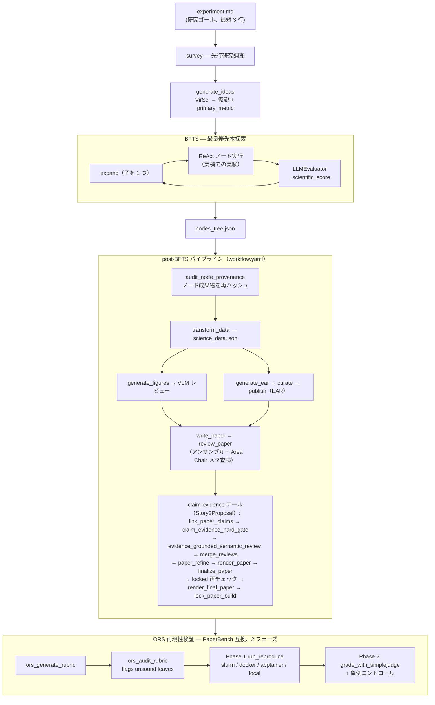

---
sources:
  - path: ari-core/ari/orchestrator
    role: implementation
  - path: ari-core/ari/agent/loop.py
    role: implementation
  - path: ari-core/ari/pipeline
    role: implementation
  - path: ari-core/ari/evaluator/llm_evaluator.py
    role: implementation
  - path: ari-core/ari/memory/letta_client.py
    role: implementation
  - path: ari-core/ari/paths.py
    role: implementation
  - path: ari-core/ari/core.py
    role: implementation
  - path: ari-core/ari/rqgm
    role: implementation
  - path: ari-core/config/workflow.yaml
    role: config
last_verified: 2026-07-10
---

# ARI アーキテクチャ

## ARI の機能

ARI はエンドツーエンドの自律研究システムです。平文の研究目標を与えると、以下を行います:

1. **調査** - 先行研究の調査（学術データベース）
2. **生成** - マルチエージェント討論による研究仮説の生成（VirSci）
3. **探索** - Branch-and-Frontier Tree Search (BFTS) による最適な実験構成の探索
4. **実行** - 実際のハードウェア上での実験実行（ラップトップ、SLURM、PBS、LSF）
5. **評価** - 各実験の査読評価（LLM が科学的品質スコアを付与）
6. **分析** - 完全な実験ツリーの分析: ハードウェア情報、手法、アブレーション結果の抽出
7. **図表生成** - 出版品質の図表生成（LLM がデータから matplotlib コードを記述）
8. **論文執筆** - 引用付き完全な LaTeX 論文の執筆
9. **査読** - LLM が査読者として論文を審査
10. **再現性検証** - 論文テキストのみから実験を再実行し再現性を検証

ドメイン知識はハードコードされていません。同じパイプラインが HPC ベンチマーク、ML ハイパーパラメータチューニング、化学最適化、その他あらゆる測定可能な現象に対して動作します。

### 併読すべきコンセプトページ

このページが扱うのは研究システムそのもの — ゴールを論文へ変えるパイプライン — です。
そのシステムを*観測*し*記述*する層については、次の 2 つの兄弟ページを併せて読む
価値があります:

| ページ | 答えること |
|---|---|
| [ダッシュボードアーキテクチャ](gui_architecture.md) | Web ダッシュボードの構造: レガシー画面と v2 ワークスペースを載せる 1 つのシェル、ルートレジストリ、ラン単位のサーバー状態キャッシュ、無効化としてのリアルタイム、そして HTTP からチェックポイント成果物までのシーム。 |
| [研究状態とガバナンス状態](research_and_governance_state.md) | 1 つのランが同時に抱える状態語彙 — ランライフサイクル、研究フェーズ、ガバナンス段階、ノードスコア状態 — がなぜ別物であり、なぜ stale / invalidated / removed / 物理削除が 4 つの別物なのか。 |

---

## パイプライン全体像

エンドツーエンドの流れ — アイデア生成、BFTS 探索ループ、`workflow.yaml`
駆動の post-BFTS パイプライン（write_paper の後にデフォルトで
Story2Proposal の claim-evidence テールが続く）、PaperBench 互換の
ORS 再現性検証 — を 1 枚のハブ図にまとめます。各グループは、それを
詳述するセクションまたはドキュメントへリンクしています。



| グループ | 役割 | 詳細 |
|---------|------|------|
| survey / generate_ideas | 文献調査 + VirSci による仮説・主指標の確定 | [完全なデータフロー](#完全なデータフロー) |
| BFTS | 実験構成の最良優先木探索 | [BFTS アルゴリズム](bfts.md) |
| ReAct ノード実行 | 実機で実験を回すノード単位エージェントループ | [ノードごとのプロンプト構築](#ノードごとのプロンプト構築) |
| LLMEvaluator | ランキングを駆動する査読スコアリング | [設定 → BFTS の評価層](../reference/configuration.md#bfts-の評価層-設定で切替可能) |
| メモリ | ノード間で受け渡される祖先スコープの知識 | [メモリアーキテクチャ](memory.md) |
| post-BFTS パイプライン | データ → 作図 → 執筆 → 査読 → EAR | [出版ライフサイクル](publication-lifecycle.md) |
| ORS 再現性検証 | 論文からゼロ再現し採点する | [PaperBench クイックスタート](../guides/paperbench/paperbench_quickstart.md) |

### 実行モード: `simple_bfts`（デフォルト）と `ari_rqgm`（オプトイン）

このページのすべての記述は、デフォルトの実行モードである `simple_bfts` を
説明しています。オプトインの `ari_rqgm` モード（Constitutional ARI-RQGM）は、
同じ BFTS ループをエポックベースのガバナンスと共進化で包みます: 探索戦略は
純粋委譲の `GovernedSearchStrategy`（`ari/rqgm/runtime.py`）でラップされ、
MCP クライアントは憲法的ケイパビリティゲート（`ari/core.py` の
`_install_capability_gate` — 統治対象ツール呼び出しはすべて監査され、重大
違反はエポック途中の緊急隔離へエスカレートします）でラップされ、
完了したノードには敵対的な attack/defend/judge ラウンドが付き、各エポック
境界では決定論的な憲法カーネルがすべてのガバナンス状態変更（コンポーネント
の採用/退役、プロンプト進化、フロンティア修復）を検証します。有効になるのは
`ari.mode: ari_rqgm` と `rqgm.enabled: true` が一致するときのみです;
デフォルト設定では `ari.rqgm` モジュールは一切インポートされず、
チェックポイントは RQGM 以前の ARI とバイト単位で同一です。レイヤ、
エポックアルゴリズム、不変条件は
[Constitutional ARI-RQGM アーキテクチャ](rqgm_architecture.md)を、有効化と
モード切替ポリシーは[実行モード](../guides/execution_modes.md)を参照して
ください。

### `manuscript` 軸（オプトイン、既定は off）

`workflow.yaml` は 3 本目のトップレベルスイッチ `manuscript.mode`
（`off` | `audit` | `enforce`、既定は `"off"`。併せて
`profile: generic_empirical_v1`、`brief_character_budget: 24000`、既定が
`disabled` の `repair.policy`）を持ちます。これは `ari.mode` とも
`paper.mode` とも独立です。`off` はレガシーと完全同一 — manuscript の
インポート・成果物・ゲート・修復のいずれも発生しません; `audit` は影の
完全性評価を記録し、`enforce` は authoring 要件が解決されるまで執筆を
ブロックします（`repair.policy: auto` にはこれが必須）。`workflow.yaml` の
各パイプラインステージは `segment: evidence | authoring | verification` を
宣言するようになり、これにより
`generate_paper_section(..., include_segments=…)` が論文パイプラインを
セグメント単位で実行できます: 除外されたセグメントは*派生*ワークフロー上で
無効ステージとして表現されるので、セグメントをまたぐ `depends_on` は永続化
済みの出力で満たされたままです。この選択自体に mode は不要で、
`ARI_MANUSCRIPT_RUNTIME_MODE` が `off` 以外のときに加わるのは
segment-execution レコードです — 実行が workflow digest と論理的な入力に
束縛され、一致する completed レコードがあれば再実行せず再利用されます。既定の `include_segments=None` では従来どおり
有効なステージがすべて走ります。

---

## システム概要

```
┌────────────────────────────────────────────────────────────────┐
│                         User Interface                         │
│                   experiment.md  /  CLI  /  API                │
└────────────────────────────────┬───────────────────────────────┘
                                 │
┌────────────────────────────────▼───────────────────────────────┐
│                          ari-core                              │
│                                                                │
│  ┌─────────────────┐   ┌─────────────────┐                    │
│  │  BFTS           │   │  ReAct Loop     │                    │
│  │  (tree search)  │──▶│  (per node)     │                    │
│  └─────────────────┘   └────────┬────────┘                    │
│                                 │                              │
│  ┌──────────────────────────────▼──────────────────────────┐  │
│  │            MCP Client (async tool dispatcher)           │  │
│  └──────────────────────────────┬──────────────────────────┘  │
└─────────────────────────────────┼──────────────────────────────┘
                                  │ MCP protocol (stdio/HTTP)
     ┌────────────────────────────┼──────────────────────────────┐
     │                            │                              │
┌────▼──────────┐  ┌─────────────▼──────┐  ┌───────────────────▼──┐
│ari-skill-hpc  │  │ari-skill-idea      │  │ari-skill-evaluator   │
│ job_submit    │  │ survey             │  │ make_metric_spec     │
│ job_status    │  │ generate_ideas     │  │ claim_evidence_      │
│ slurm_submit  │  │ (VirSci MCP)       │  │   hard_gate          │
└───────────────┘  └────────────────────┘  └──────────────────────┘

Post-BFTS Pipeline (workflow.yaml):
┌─────────────────┐  ┌──────────────────┐  ┌──────────────────┐
│ari-skill-       │  │ari-skill-plot    │  │ari-skill-paper   │
│transform        │  │ generate_figures │  │ write_paper      │
│ nodes_to_       │  │ _llm (LLM writes │  │ review_compiled  │
│ science_data    │  │  matplotlib)     │  │ reproduce_from   │
│ (LLM analysis)  │  │                  │  │  _paper          │
└─────────────────┘  └──────────────────┘  └──────────────────┘
```

---

## 完全なデータフロー

```
experiment.md
  (研究目標のみ — 最低3行)
    │
    ▼
[ari-skill-idea: survey]
  arXiv / Semantic Scholar キーワード検索
  戻り値: 関連論文の要旨
    │
    ▼
[ari-skill-idea: generate_ideas]  ← VirSci マルチエージェント討論
  複数のAIペルソナが研究課題について議論
  出力: hypothesis, primary_metric, evaluation_criteria
    │
    ▼
BFTS ルートノード作成
    │
    ▼ (各ノードについて繰り返し、最大 ARI_MAX_NODES、ARI_PARALLEL 同時実行)
┌──────────────────────────────────────────────────────────────────┐
│  ReAct Loop (ari/agent/loop.py)                                  │
│                                                                  │
│  1. LLM が MCP レジストリからツールを選択                           │
│  2. ツールを実行 (run_bash / slurm_submit / job_status / ...)     │
│  3. SLURM ジョブの場合: COMPLETED まで自動ポーリング（ステップ予算なし）│
│  4. LLM が stdout を読み → 実験コードを生成 → 投入                  │
│  5. LLM が出力からメトリクスを抽出 → JSON を返却                    │
│                                                                  │
│  メモリ: 結果サマリーを祖先チェーンメモリに保存                      │
│  子ノード: 祖先メモリから過去の結果を検索                            │
└──────────────────────────────────────────────────────────────────┘
    │
    ▼
[LLMEvaluator] (ari/evaluator/llm_evaluator.py)
  入力:  ノードの成果物（stdout、ログ、スクリプト）
  出力: {
    has_real_data: bool,
    metrics: {key: value, ...},       ← 抽出された数値
    scientific_score: float 0.0-1.0,  ← LLM 査読品質スコア
    comparison_found: bool             ← 既存手法との比較あり？
  }
  _scientific_score は metrics に格納 → BFTS ランキングを駆動
  AUTHORITATIVE な measurements: ノードの results.json（ARI_WORK_DIR 配下）が
    ground truth。その `measurements` は直接マージされ、切り詰めた artifact
    テキスト（str(artifacts)[:2000]）からの LLM 抽出に対して PRECEDENCE を持つ。
    そこに数値があれば has_real_data=True も立つ。切り詰めた再読では取りこぼす
    実数値をこれで回収する。
  metric_contract producer obligation: make_metric_spec が metric_contract
    scaffold を出力した（concept-classified な指標の）場合、エージェントは
    make_metric_spec 時点で domain-neutral な obligation を受け取る — 正しさを
    検証し、ceiling は（ハードコードせず）MEASURE し、provenance を emit し、
    contract を埋める — これを FINAL claim-evidence hard gate が後で強制する。
    │
    ▼
BFTS expand() (ari/orchestrator/bfts.py)
  - _scientific_score でノードをランク付け
  - スコアを子提案 LLM に渡す
  - LLM が展開呼び出しごとに 1 つの子方向を提案（改善 / アブレーション / 検証 / ドラフト / デバッグ / その他）
  - ドメインヒントなし — LLM が「改善」の意味を決定
  - v0.7.0: 親に node_report.json があるとき、プロンプトに構造化された
    files added/modified/deleted、self_assessment.concerns、next_steps_hints を
    追加。sibling dedup は filter_nodes(for_synthesis) で絞り込み、各 sibling の
    files_changed.added を併記して同じファイルを書く direction を
    物理的に避けられるようにする。

ノード自己レポート (v0.7.0)
  ari-core/ari/orchestrator/node_report/ が mark_success / mark_failed 時に
  node_report.json を生成（ari-core/ari/cli/bfts_loop.py の post-future フック）。
  記録内容:
    - files_changed (added / modified / deleted / inherited_unchanged)
      — 親と子の work_dir の sha256 diff から導出
    - original_direction (bfts.expand が child 作成時に保存、evaluator は上書き不可)
    - measurement_valid と evaluation_cases — 評価器の客観出力。各ケースは
      `valid` とハーネス定義のスカラー測定値辞書を持つ
    - self_assessment.{headline, concerns} と next_steps_hints —
      エージェントが生成した LLM Reflection。客観的な有効判定とは別に保存
    - build_command / run_command — work_dir 内の run_job.sh / Makefile を grep
    - artifacts[].role — 拡張子から決定論的に分類 (data_output / log / binary /
      figure / unknown)
  PathManager.META_FILES に node_report.json を追加してあるので、親→子の物理
  work_dir コピーで親レポートを子が継承することはない。

共通選別ヘルパー (v0.7.0)
  ari-core/ari/orchestrator/node_selection.py:
    - filter_nodes: 「このノードを下流に渡すか」の単一の判定実装。3 criteria
      (for_synthesis / for_code / for_narrative)。always_include_node_ids で
      best ノードは常に通す。50% 超 skip で warning。
    - select_source_files_for_publication: file I/O ゼロのファイル単位選別。
      deepest contributor wins。transform_data と generate_ear で同じ selection を
      共有 (FR-SS-5 contract test で固定)。
    - load_selected_sources(size_budget): file I/O 担当。transform は 16KB cap、
      generate_ear は cap なし。
    │
    ▼ (ARI_MAX_NODES 到達後)
nodes_tree.json  (全ノード: メトリクス、成果物、メモリ、親子リンク)
    │
    ▼
[workflow.yaml Post-BFTS パイプライン]

  ステージ 0: audit_node_provenance  (ari-skill-memory: audit_memory)  [ステージ 1 の前]
    node_report が sha256 を記録した全ノード成果物を再ハッシュしてディスクと
    照合する — ノード出力が「実験結果」であることをやめて「論文の証拠」に
    なる境界。成果物ごとに verified / mismatch（ハッシュ記録後に書き換え）/
    missing（削除）/ unhashed（記録されたベースラインなし）を報告。ゲートでは
    なくシグナルであり、transform_data がこれに depends_on します。
    出力: node_provenance_audit.json

  ステージ 1: transform_data  (ari-skill-transform)  [ステージ 0 の後]
    全ツリーの BFS 走査（ルート → リーフ）
    LLM が全ノードの成果物を読み取り（stdout、ログ、生成コード）
    LLM が抽出: ハードウェアスペック、手法、主要な知見、比較
    出力: science_data.json  { configurations, experiment_context, per_key_summary }

  ステージ 2: search_related_work  (ari-skill-web: search_papers)  [ステージ 1 と並列]
    LLM 生成キーワード → ピン留めされた 1 プロバイダ（workflow.yaml が
    provider: semantic-scholar / max_results: 15 / mode: record をピン留め）。
    record は応答をスナップショットするので後の replay はネットワーク不要;
    record と live はプロバイダを切り替えない。ステージは
    skip_if_exists: related_refs.json を持つ — 記録済み検索は不変の実験入力
    なので、resume は再クエリせず再利用する。
    出力: related_refs.json

  ステージ 3: generate_figures  (ari-skill-plot: generate_figures_llm)  [ステージ 1 の後]
    入力: science_data.json + {{experiment_summary}} + {{vlm_feedback}}
    LLM はプランナに徹する: 出せるのは metric_id / chart_type /
    x_mode だけ。数値・単位・キャプション・パス・画像バイトは、検証済みの
    science レコードから固定レンダラが決定論的に生成し
    （execution_mode "declarative-fixed-renderer"）、図ごとに
    figures/revisions/{NN}/{figure_id}/ 配下へ source_data.json /
    figure_spec.json / .png / .pdf を書き出す。revision > 0 には直前の
    manifest ダイジェストに紐づく VLM フィードバックが必須で、revision 0 は
    フィードバックを拒否する。
    出力: figures_manifest.json  {figures, latex_snippets, figure_kinds}
      （figure_kinds は spec の chart_type）

  ステージ 3b: vlm_review_figures  (ari-skill-vlm: review_figures_all)  [ステージ 3 の後]
    VLM が figures_manifest.json の**全図**をレビュー。集約スコアは図ごとの
    最小値なので、1 枚でも弱ければループが回る。issues / suggestions には
    [fig_id] が前置され、どの図を直すべきかが再生成側に伝わる。
    スコア < 0.7: VLM フィードバックと共に generate_figures へループバック（最大 2 反復）
    出力: vlm_review.json

  ステージ 4: generate_ear  (ari-skill-transform)  [ステージ 1 の後]
    node_report 駆動の決定論的 ear/ 構築。
      - code/ = best chain の contributing ノードの files_changed.added/modified の union (verbatim)
      - data/ = checkpoint/uploads/ の verbatim ミラー (入力のみ、実験出力は含めない)
      - figures/ = checkpoint 直下の *.{pdf,png,svg,jpg,jpeg} を top-level に
      - README.md / reproduce.sh — node_reports から決定論レンダリング
      - LICENSE — publish.yaml::license の SPDX テンプレから生成 (MIT / Apache-2.0 / BSD-3-Clause / GPL-3.0 / CC-BY-4.0)
    EVOLUTION.md と _provenance.json は ARI 監査ログとして checkpoint 直下
    （ear/ の外）に書き出され、公開アーティファクトには含まれない。
    transform_data と generate_ear は同じ select_source_files_for_publication を
    共有するため、LLM が見るソースバイトと ear/code/ にパブリッシュされるバイトは
    完全一致する。ARI 内部メタデータ (tree.json, science_data.json, raw_metrics.json
    等) は ear/ にコピーされない。
    出力: ear_manifest.json, ear/ ディレクトリ, checkpoint/EVOLUTION.md,
          checkpoint/_provenance.json

  ステージ 5: write_paper  (ari-skill-paper)  [ステージ 2, 3, 4 の後]
    paper_context = experiment_context + best_nodes_metrics
    反復的セクション執筆: 下書き → LLM 査読 → 修正（最大 2 ラウンド）
    Semantic Scholar の結果から BibTeX 引用
    write_paper は verified_context.json（ari/pipeline/verified_context.py が
      best ノードの root→best lineage にスコープして構築する artifact-grounded
      な claim）も読み、定量的 claim を裏付ける。
    出力: full_paper.tex, refs.bib

  Story2Proposal claim-evidence テール  [現在デフォルト、write_paper の後]
    write_paper の後に決定論的な claim/evidence チェーン（S2P）が続く。
    デフォルトのトポロジは:
      link_paper_claims_draft       (%CLAIM アンカーを照合 → paper_claim_links.json)
        → claim_evidence_hard_gate_draft   (draft hard gate、非ブロッキング)
        → review_paper              (テキストのみ査読 — 下記ステージ 6)
        → evidence_grounded_semantic_review
        → merge_reviews             (下記ステージ 10; gate + semantic review を合流)
        → paper_refine              (suggested_revisions 適用、%CLAIM アンカー保持)
        → render_paper              (refined .tex を再コンパイル → PDF; 非ブロッキング)
        → link_paper_claims_final
        → evidence_grounded_semantic_review_post_refine
        → claim_evidence_hard_gate_final   (FINAL gate; strict モードで finalize をブロック)
        → finalize_paper            (下記ステージ 8)
        → link_paper_claims_locked  (Code Availability 注入後に claim を再照合)
        → claim_evidence_hard_gate_locked        (phase: final。実際にコンパイル
                                                  され lock される TeX そのものを検査)
        → evidence_grounded_semantic_review_locked   (phase: locked、助言的)
        → render_final_paper        (注入後の TeX をそのままコンパイル)
        → lock_paper_build          (入力・呼び出し・査読・gate・コンパイルログ・
                                     TeX・BibTeX・PDF を fail-closed で固める
                                     PaperBuildV1 ロック)
    workflow.yaml のトップレベル claim_gate_policy ブロックで制御される。
      ブロックできるのは FINAL フェーズだけで、draft フェーズのレポートは
      決してブロックしない。mode: off は一切ブロックせず、mode: warn（既定）
      でも客観的完全性の always_block_on 層（invariant_violation /
      correctness_failed / recompute_mismatch など）はブロックする。
      mode: strict はさらに設定された block_on の所見と strict セクションの
      未カバー数値をブロックする。解決の優先順位は最終的に
      env ARI_CLAIM_GATE_MODE (off | warn | strict) と ARI_COMPARISON_SCOPE。
    重い gate ロジックは新しい ari/pipeline/claim_gate/ パッケージ
      (contract / gate / policy / numeric / latex / invariants / resolve) に
      あり、evaluator-skill がそこを呼ぶ薄い MCP ツール
      (claim_evidence_hard_gate, evidence_grounded_semantic_review) を公開する。
      gate の詳細セマンティクスは publication-lifecycle.md を参照。

  ステージ 6: review_paper  (ari-skill-paper)  [ステージ 5 の後]
    ルーブリック駆動の査読。N 名の独立した査読者エージェントを実行
    (N は ARI_NUM_REVIEWS_ENSEMBLE / rubric 既定値で制御、N=1 は単一査読)。
    N>1 のときは Area Chair メタ査読も走り、スコアを集約。
    出力: review_report.json { score, verdict, citation_ok, feedback,
          ensemble_reviews[] (N>1), meta_review{} (N>1) }

  ステージ 7: ear_curate  (ari-skill-transform: curate_ear)  [ステージ 4 の後、v0.7.0]
    {checkpoint}/ear/publish.yaml の allowlist と built-in deny list
    (.env*, secrets/**, *.pem, *.key, id_rsa, id_ed25519) を適用し、
    {checkpoint}/ear_published/ + manifest.lock を構築。bundle_sha256
    は正規化された {path,sha256,size} JSON の sha256 で、マシン間で
    決定的に再現可能。publish.yaml が無ければ静かにスキップ。

  ステージ 8: finalize_paper  (ari-skill-paper: inject_code_availability)  [ステージ 5+7 の後、v0.7.0]
    ear_published/manifest.lock + publish_record.json から ref / sha /
    doi を自動ロードし、機械可読な \codeavailability{} / \codedigest{}
    / \coderef{} マクロと人間可読な Code Availability セクションを
    full_paper.tex に注入。digest が信頼の起点となり、読者は registry
    を信頼することなく `ari clone <ref> --expect-sha256 <baked-digest>`
    で検証可能。

  ステージ 9: ear_publish  (ari-skill-transform: publish_ear)  [ステージ 7 の後、任意]
    ear_published/ から再現可能な tarball を構築し、backend
    (ari-registry / local-tarball / gh / zenodo) に転送。最初は常に
    visibility=staged (FR-P5)。workflow.yaml では既定で有効
    (`enabled: true`、backend `local-tarball`、`dry_run: false`) で、
    finalize_paper がこれに依存する。
    出力: publish_record.json

  ステージ 10: review_paper / merge_reviews  (ari-skill-paper)  [ステージ 5+3b の後]
    review_paper は論文テキストのみを評価 (VLM 成果や figure manifest は
    渡さず、AI Scientist v2 の perform_review 契約に揃える)。
    merge_reviews は review_report.json と vlm_review.json を構造的に
    合成 (LLM 不使用)。
    出力: review_report.json (vlm_figure_review が後付けで添付される)

  ステージ 11: ors_generate_rubric  (ari-skill-replicate)  [lock_paper_build の後, v0.7.0]
    最終論文から PaperBench 形式 (TaskNode ツリー) のオートルーブリックを
    生成。task_category と finegrained_task_category は PaperBench の閉じた
    語彙に固定 (LLM が外したら decided 正規化で補正)。JSON 出力時は迷い
    LaTeX backslash escape をサニタイズ。
    出力: ors_rubric.json + ors_rubric.meta.json

  ステージ 12: ors_audit_rubric  (ari-skill-replicate: audit_rubric)  [ステージ 11 の後]
    以降のすべての採点が依拠するルーブリック自体を監査する。各葉に
    vague_qualifier / no_paper_evidence / duplicate (決定論的) と
    unverifiable (葉ごとに LLM 1 回) のフラグを付け、ors_rubric.json を
    その場で書き換え、20% 超にフラグが付くと regen_recommended を返す。
    ゲートではなくシグナルで、採点はどちらでも進む。
    ARI_MODEL_RUBRIC_AUDIT で生成側と別モデルを指定できる。
    出力: ors_rubric.audit.json (+ ors_rubric.json 内にフラグ)

  ステージ 13: ear_publish  (ari-skill-transform)  [v0.7.0, デフォルト有効]
    ear_published/ をバンドルにパッケージし publish_record.json を生成。
    既定 backend は local-tarball (依存ゼロ)。外部公開なら ari-registry /
    zenodo / gh も利用可能。
    出力: bundle.tar.gz + publish_record.json

  ステージ 14: ors_seed_sandbox  (ari-skill-paper-re: fetch_code_bundle)  [v0.7.0]
    キュレート済み EAR バンドルから repro_sandbox/ への決定論的種まき。
    publish_record.json から ref + sha256 を自動読込 (LLM 不使用)。EAR が
    OFF の時は publish_record.json が無いので no-op し、次の LLM フォール
    バックに任せる。
    出力: ors_seed.json

  ステージ 15: ors_build_reproduce  (ari-skill-paper-re: build_reproduce_sh)  [v0.7.0]
    replicator: PaperBench 系の ReAct エージェント (BasicAgent、
    `iterative_agent: true` なら IterativeAgent。ari-skill-paper-re/vendor/
    paperbench に vendoring) をサンドボックスを workspace として駆動する。
    エージェントは論文とルーブリックの expected_artifacts を読み、bash/python
    ツールを繰り返し呼びながら reproduce.sh と補助ソースを書き出し、submit か
    wall-clock 予算 (time_limit_sec、既定 12 時間) の尽きるまで続ける。
    v0.6 の単発 LLM replicator を置き換えたもの。
    reproduce.sh が既存なら skip (ors_seed_sandbox の後ろに置けば EAR ON
    では発火しない)。LiteLLM 経由で provider neutral。
    出力: ors_replicator.json + repro_sandbox/{reproduce.sh, source...}

  ステージ 16: ors_run_reproduce  (ari-skill-paper-re: run_reproduce)  [v0.7.0]
    Phase 1。reproduce.sh をサンドボックスで実行:
      slurm (sbatch + ARI_SLURM_PARTITION = BFTS と同じ partition)
      → docker (デーモン利用可かつ HPC 外) → apptainer → singularity →
      local。ARI_PHASE1_SANDBOX で上書き可。
    SLURM 経路は型付きスケジューラライフサイクルへの handoff。実行要求は
    JobRequestV1 + ResourceRequestV1 になり、ari-skill-hpc と同じ
    SlurmScheduler へ submit されて終端状態まで poll される
    (_execute_reproduction_slurm)。
    出力: ors_phase1.json { executed, exit_code, log_path,
                              artifacts, missing, sandbox_kind,
                              [partition, cpus, walltime] }

  ステージ 17: ors_grade  (ari-skill-paper-re: grade_with_simplejudge)  [v0.7.0]
    Phase 2。メイン採点 completer を LiteLLM 経由化 (任意 provider 対応)、
    structured score-parser 2 本も同じ judge_model から作られ、
    response_format だけが異なる。N 回
    (デフォルト 1 — PaperBench §4.1 の single-pass 採点。増やすときは
    ARI_JUDGE_N_RUNS)、重み付き葉スコア集約 + 負例コントロール。
    出力: ors_grade.json { ors_score, raw_score, leaf_grades,
                           judge_model, n_runs, rubric_sha256,
                           negative_control_check: {empty, boilerplate,
                                                    passed, status, error} }
```

---

## ファイル構造

### チェックポイントディレクトリのレイアウト

各 ARI 実行は `{workspace}/checkpoints/{run_id}/` 以下にチェックポイントディレクトリを生成する。
`run_id` は `YYYYMMDDHHMMSS_<slug>` の形式。ディレクトリ構築は `ari/paths.py` の `PathManager`
が単一の真実の源泉 (single source of truth)。

```
checkpoints/{run_id}/
├── experiment.md               # 入力: 研究目標 (起動時にコピー)
├── launch_config.json          # Wizard/CLI 起動パラメータ
├── meta.json                   # サブ実験メタデータ (親/再帰深度)
├── workflow.yaml               # 起動時点のパイプライン設定スナップショット
├── .ari_pid                    # 生存検知用 PID ファイル
├── tree.json                   # 完全な BFTS ツリー (BFTS 中に書き込み)
├── nodes_tree.json             # 軽量ツリーエクスポート (パイプライン入力)
├── results.json                # ノード毎の artifact・metrics サマリ
├── idea.json                   # 生成された仮説 (VirSci 出力)。inherit_idea_index 起動時は親 ideas[N] が pinned で seed される (v0.7.0)
├── lineage_decisions.jsonl     # lineage decisions LLM judge ログ (発火した decision を 1 record/line; v0.7.0)
├── evaluation_criteria.json    # 主要指標と方向
├── cost_trace.jsonl            # LLM 呼び出し毎のコスト/トークンログ
├── cost_summary.json           # 集約コストサマリ
├── ari.log                     # 構造化 JSON ログ
├── ari_run_*.log               # GUI 起動時の stdout/stderr ログ
├── .pipeline_started           # マーカー: post-BFTS パイプライン開始済み
├── science_data.json           # Transform-skill 出力
├── related_refs.json           # 文献検索結果
├── figures_manifest.json       # 生成図メタデータ
├── figures/revisions/{NN}/{figure_id}/  # 図ごとのレンダリング結果:
│                               #   source_data.json / figure_spec.json /
│                               #   {figure_id}.png / .pdf / figure_manifest.json
├── vlm_review.json             # VLM 図レビュー出力
├── full_paper.tex              # 生成された LaTeX 論文
├── refs.bib                    # BibTeX 参照
├── full_paper.pdf              # コンパイル済み PDF
├── full_paper.bbl              # 文献リスト出力
├── review_report.json          # LLM 査読出力 (N>1 のとき ensemble_reviews[] と meta_review{} を同梱)
├── reproducibility_report.json # 再現性検証
├── uploads/                    # ユーザアップロードファイル (ノード work_dir へコピー)
├── paper/                      # LaTeX 編集用ワークスペース
│   ├── full_paper.tex
│   ├── full_paper.pdf
│   ├── refs.bib
│   └── figures/
├── ear/                        # 実験 Artifact Repository
│   ├── README.md
│   ├── RESULTS.md
│   └── <artifacts>
└── repro/                      # 再現性実行ワークスペース
    ├── run/
    ├── reproducibility_report.json
    └── repro_output.log
```

### ノード作業ディレクトリ

ノード毎の作業ディレクトリは `checkpoints/` と兄弟ディレクトリとして作成される:

```
{workspace}/experiments/{run_id}/{node_id}/
```

中間のセグメントはトピック slug ではなく **`run_id`** である。`PathManager.node_work_dir`
は `run_id` を受け取り、`ari/cli/bfts_loop.py` がそれを渡すため、実験名が同じ 2 つの
ラン同士が同じバケットに書き込むことはない。

ノード実行時、`_run_loop` は以下のユーザファイルを各ノードの work_dir にコピーする:
- **Provided files**: `experiment.md` の `## Provided Files` (`## 提供ファイル` / `## 提供文件`) にリストされたパス
- **チェックポイント直下**: チェックポイント直下の非 meta ファイル
- **uploads サブディレクトリ**: `checkpoint/uploads/` 内の非 meta ファイル

`PathManager.META_FILES` がノード work_dir に絶対にコピーしてはいけないファイルを定義
する。ラン単位のメタデータ (`experiment.md`, `tree.json`, `nodes_tree.json`,
`launch_config.json`, `meta.json`, `results.json`, `idea.json`, `cost_trace.jsonl`,
`cost_summary.json`, `provenance.json`, `workflow.yaml`, `ari.log`,
`evaluation_criteria.json`, `.ari_pid`, `.pipeline_started`)、各ノードが自分で
書くべきノード単位の記録 (`node_report.json`, `full_log.json`, `_run_env.json`,
`_exec_env.json`)、そして RQGM / 論文アーカイブの成果物を含む。ノード単位の項目は
実効的な重みを持つ: `full_log.json` / `_run_env.json` / `_exec_env.json` は
`bfts_loop` の `_OUTPUT_BLACKLIST` に無いため、親の実行ログ・マシン・ロード済み
モジュールが子へ入るのを止めているのはこの集合だけである。
拡張子が `.log` のファイルも meta 扱い。

### tree.json と nodes_tree.json

いずれも BFTS ノードツリーを含むが、ライフサイクルの異なるタイミングで書き込まれる:

| ファイル          | 書き込み元                                            | フェーズ          | スキーマ                                              |
|-------------------|-------------------------------------------------------|-------------------|-------------------------------------------------------|
| `tree.json`       | `cli/bfts_loop.py` の `_save_checkpoint()`            | BFTS 中          | `{run_id, experiment_file, created_at, nodes}`        |
| `nodes_tree.json` | `_save_checkpoint()` + `WorkflowDriver.run()`（`ari/pipeline/driver.py`。`ari/pipeline/orchestrator.py` の `run_pipeline()` 経由で、`generate_paper_section()` から呼ばれる） | BFTS + post-BFTS | `{experiment_goal, nodes}` (軽量)                    |

**読み取り側の規約**: 全ての読み取りは `tree.json` を優先し、`nodes_tree.json` にフォールバック
しなければならない。これにより BFTS 中の最新データを保ちつつ、`nodes_tree.json` を前提とする
パイプラインステージとの互換性も維持する。

### プロジェクト単位の状態 (チェックポイントごと)

ARI はグローバルな設定ディレクトリを持たない。設定ファイルとエージェントメモリは
すべてアクティブなチェックポイント配下に保存されるため、実験ごとに状態が分離される。
v0.5.0 でグローバルな `$HOME/.ari/` ディレクトリは廃止された。残るファイルシステム
フォールバックは `DeprecationWarning` を出し、v1.0 で完全削除される
（詳細は `docs/guides/migration.md`）:

```
checkpoints/{run_id}/
├── settings.json        # GUI 設定 (LLM モデル、プロバイダ、HPC デフォルト)
├── memory_backup.v1.json.gz # Letta スナップショット (ステージ境界＋終了時に自動)
├── memory_access.jsonl       # write/read テレメトリ
└── ...                  # tree.json / launch_config.json / uploads / ari.log
```

API キーは **絶対に** `settings.json` には保存されない。`.env` ファイル
(探索順: checkpoint → ARI root → ari-core → home) または起動時に注入された環境変数から読み取る。

### ワークスペースルートの解決

上記のパスに現れる `{workspace}` は固定ディレクトリではない。これを決めるのは
`RuntimePathResolver.resolve_workspace_root()` (`ari/paths.py`) ただ 1 つの関数である。
優先順位は先に一致したものが勝つ:

1. **`ARI_CHECKPOINT_DIR`** — pin されたチェックポイントディレクトリからルートを
   *復元* する: 最も外側の `checkpoints/` 祖先まで遡ってその親を採る。`checkpoints/`
   祖先が無い場合はチェックポイントディレクトリ自身の親を採る。
2. 明示的に渡された `workspace_root` 引数。
3. **`ARI_ROOT`** → `{ARI_ROOT}/workspace`。
4. `{repo root}/workspace` — `{repo root}/ari-core` がディレクトリである場合、
   つまりチェックアウト内部から実行している場合にのみ採用される。
5. プロセスの作業ディレクトリ。

ステップ 1 がステップ 2 より強いのは踏みやすい落とし穴である: `ARI_CHECKPOINT_DIR` が
設定されている間は、`workspace_root` を明示的に渡してもルートは **移動しない**。
現時点でこのポリシーに乗っている呼び出し元は `ari/config/__init__.py` (`auto_config`。
既定の `{workspace}/checkpoints/{run_id}` テンプレートをここから組み立てる)、
`ari/harness_registry.py` (`{workspace}/harnesses`)、および `ari/viz/v1/` 配下の
v1 GUI ドキュメントストアと launch のパスである。

このポリシーは opt-in であり、暗黙には効かない: 引数なしで構築した `PathManager()` は
依然としてプロセスの作業ディレクトリを既定とし、上記のチェーンを一切参照しない。
ここに挙げた呼び出し元だけがこの方式でルートを解決する。

### バケット化された `runs/` レイアウト — 設計のみで未採用

`RuntimePathResolver` は、ラン単位でバケット化された第 2 のレイアウトも理解する:

```
{workspace}/runs/{run_id}/
├── workspace/     # ノード毎のスクラッチ (レガシー相当: 上記のノード作業ディレクトリ)
├── checkpoints/   # ラン単位メタデータ JSON (レガシー相当: チェックポイントルート)
├── artifacts/     # 図、LaTeX、refs.bib
├── traces/        # コスト / プロンプト / メモリアクセスのログ
└── reports/       # node_report.json、レビュー・再現性レポート、ors_*.json
```

**このレイアウトを書くものは存在せず、`ari/paths.py` の外にこれを要求する呼び出し元も
存在しない。** これは設計されたのち採用されなかった目標形として読むこと — 現在の
ディスク上のレイアウトでもなければ、進行中の移行でもない。ARI が実際に生成するパスは
すべて上記のフラットなレイアウトである。`ari/paths.py` に実在するのは読み取り側の許容
だけで、バケット化されたランが万一現れれば解決できる、という状態にとどまる:

- `checkpoint_file(run_id, name)` は `bucket_for` で `name` を分類し
  (コスト / プロンプト / テレメトリと RQGM ログの固定ファイル名集合および
  `memory_access.*.jsonl` は `traces`、
  `node_report.json` / `review_report.json` / `reproducibility_report.json` と
  `ors_*.json` は `reports`、`fig_` 接頭辞または `.tex` / `.pdf` / `.bbl` / `.bib` /
  `.png` / `.svg` 拡張子は `artifacts`、それ以外はすべて `checkpoints`)、そのバケットを
  先に、残り 3 つを後に調べ、どれも存在しなければフラットな
  `checkpoints/{run_id}/{name}` を返す。分類は走査の *順序* を決めるだけで、いずれに
  せよ全バケットを調べるため、分類を誤っても誤ったパスにはならない。
- `artifacts_dir` / `traces_dir` / `reports_dir` は該当ディレクトリが既に存在する場合の
  みバケットを返し、そうでなければフラットなチェックポイントルートを返す。
  `workspace_dir` は `runs/{run_id}/workspace/` が存在する場合のみ
  `runs/{run_id}/workspace/{node_id}` を返し、そうでなければ上記 *ノード作業ディレクトリ*
  のレガシーパスを返す。

バケットを作るものが存在しない以上、これらはすべて構造上フラットなパスを返す。
`runs_root` / `run_dir` / `bucket_for` と dual-layout アクセサ (`checkpoint_file`、
`artifacts_dir`、`traces_dir`、`reports_dir`、`workspace_dir`) には
`ari/paths.py` 自身の外に呼び出し元が無く、これらを行使しているのは
`ari-core/tests/test_paths.py` (と `tests/test_rqgm_proposals.py` の `bucket_for`
アサーション 1 件) だけである。新しいレイアウト作業のお手本として扱ってはならない。
維持コストは安いが ARI のレイアウトとして説明すると誤解を招く、読み取り側の死んだ
足場だと理解すること。

---

## モジュールリファレンス

### ari-core

| モジュール | 説明 |
|--------|-------------|
| `ari/orchestrator/bfts.py` | Branch-and-Frontier Tree Search — ノードの展開、選択、枝刈り; フォールバックランキング戦略は `BFTSConfig.frontier_score` (`scientific_plus_diversity` / `scientific_only` / `depth_penalized` / `ucb_like`) で**設定可能** — [Configuration → BFTS の評価層](../reference/configuration.md#bfts-の評価層-設定で切替可能) を参照 |
| `ari/orchestrator/node.py` | Node データクラス — id, parent_id, depth, label, metrics, artifacts, memory |
| `ari/rqgm/` | Constitutional ARI-RQGM ランタイム（オプトイン `ari_rqgm` モード）: `RQGMRuntime` ファサード、憲法カーネル、ガバナンスオーケストレータ（`governance/` の弾劾パイプライン）、レジストリ遷移エンジン、フロンティア修復、提案/敵対/プロンプト進化の各レイヤ、論文アーカイブ共進化ランタイム（`PaperArchiveStrategy` — ドラフト空間上の第二の最良優先探索）、および Knowledge–Capability–Assurance 層（`admission.py` が原子的なラン受理ベースラインを公開し、`kernel_knowledge_integrity` / `kernel_capability_integrity` / `kernel_harness_integrity` がその純粋なカーネル検査）。`simple_bfts` の下では決してインポートされない — [Constitutional ARI-RQGM アーキテクチャ](rqgm_architecture.md)を参照 |
| `ari/agent/loop.py` | ReAct エージェントループ — ノードごとの LLM + ツール呼び出し; SLURM ジョブの自動ポーリング; 祖先メモリの注入 |
| `ari/agent/workflow.py` | WorkflowHints — 実験テキストから自動抽出（ツールシーケンス、メトリクスキーワード、パーティション） |
| `ari/pipeline.py` | Post-BFTS パイプラインドライバー — テンプレート解決、ステージ実行、出力の接続 |
| `ari/evaluator/llm_evaluator.py` | メトリクス抽出 + 査読スコアリング（`scientific_score`、`comparison_found`）。合成式 (`harmonic_mean` / `arithmetic_mean` / `weighted_min` / `geometric_mean`) と軸セット (`legacy` / `dynamic` / `custom`) は `EvaluatorConfig` で**設定可能** — [Configuration → BFTS の評価層](../reference/configuration.md#bfts-の評価層-設定で切替可能) を参照 |
| `ari/memory/file_client.py` | ファイルベースのメモリクライアント（祖先チェーンスコープ） |
| `ari/mcp/client.py` | 非同期 MCP クライアント — スレッドセーフ、並列実行用の新しいイベントループ |
| `ari/llm/client.py` | litellm 経由の LLM ルーティング（Ollama、OpenAI、Anthropic、任意の OpenAI 互換） |
| `ari/config.py` | 設定データクラス（BFTSConfig、LLMConfig、PipelineConfig） |
| `ari/prompts/` | `FilesystemPromptLoader` 経由で読み込む外部化 LLM プロンプト。コミット済みテンプレートのディレクトリは `agent/`、`orchestrator/`、`pipeline/`、`evaluator/`、`viz/`、`llm/`（CLI シムのシステムプロンプトに注入される MCP ツール名解決フラグメント）に加え、RQGM 期の 2 ディレクトリ — `governance/`（弾劾パイプラインの `auditor` / `defender` / `governance_judge` アクタ）と `rqgm/`（ProposalRouter のジェネレータ群、敵対 → 防御 → 裁定のループ、PromptMutator と clean-room のメタプロンプト）。どのディレクトリも同じバージョン付きスキームを使う: `load_versioned("<dir>/<name>")` はテンプレート本文と `sha256(text)[:12]` を返し、この短いハッシュがレコードの `prompt_hash` として保存される — [RQGM スキーマ → Id とハッシュの規律](../reference/rqgm_schemas.md#id-とハッシュの規律) を参照。ランタイムで *進化した* プロンプト本文はここにコミットされず、チェックポイント単位で保持される。ピン留めは `tests/test_prompt_extraction.py`（手書きの sha256 一覧）と `tests/test_prompt_snapshots.py`（配下の `*.md` を自動探索）|
| `ari/core.py` | トップレベルのランタイムビルダー — 全コンポーネントの接続 |
| `ari/cli/` | Typer CLI 分割パッケージ: `__init__`, `run`, `projects`, `commands`, `bfts_loop`, `lineage`, `migrate` + `paper_dispatch`（`ari run` / `ari resume` / `ari paper` が共有する論文フェーズ実行モードディスパッチ） |

### Skills (MCP サーバー)

**デフォルト skills**（`workflow.yaml` に登録済み）:

| Skill | ツール | 役割 | LLM? |
|-------|-------|------|------|
| `ari-skill-hpc` | `job_submit`, `container_submit`, `job_status`, `job_result`, `job_logs`, `job_cancel`, `probe_platform_capabilities`, `counter_support`, `measure_counters`, `slurm_submit` | digest 固定された request による型付き SLURM ジョブライフサイクル。コンテナはコマンドごとの Singularity tool ではなく `container_submit` から到達し、`slurm_submit` はバッチスクリプトのブリッジとして残る | ✗ |
| `ari-skill-memory` | `add_memory`, `search_memory`, `search_research_memory`, `get_node_memory`, `get_experiment_context`, `get_verified_context`, `consolidate_node_memory`, `add_experiment_result`, `add_failure_case`, `add_procedure_memory`, `add_reflection`, `add_reproducibility_event`, `audit_memory` | 祖先スコープのノードメモリ（Letta バックエンド）。`audit_memory` は `audit_node_provenance` ステージを駆動 | △ |
| `ari-skill-idea` | `survey`, `generate_ideas` | 文献検索（Semantic Scholar）+ VirSci マルチエージェント仮説生成 | ✓ |
| `ari-skill-evaluator` | `make_metric_spec`, `propose_metric_contract`, `claim_evidence_hard_gate`, `evidence_grounded_semantic_review` | 実験ファイルからのメトリクス仕様抽出 + `ari/pipeline/claim_gate/` を包む薄い MCP 面 | △ |
| `ari-skill-transform` | `nodes_to_science_data`, `generate_ear`, `curate_ear`, `promote_ear`, `publish_ear` | BFTS ツリー → 科学データ + EAR + curate/promote/publish ライフサイクル (v0.7.0) | ✓ |
| `ari-skill-web` | `web_search`, `fetch_url`, `search_papers`, `rerank_retrieval_records`, `walk_citations`, `list_uploaded_files`, `read_uploaded_file` | Web 検索 + 1 回の呼び出しにつき 1 つのピン留めされた学術プロバイダ（`semantic-scholar` / `arxiv` / `alphaxiv`; `both` は拒否）を `record` / `live` / `replay` のスナップショットモードで利用、引用の追跡、アップロードファイルへのアクセス | △ |
| `ari-skill-plot` | `render_figure`, `generate_figures`, `generate_figures_llm` | 宣言的な figure spec を固定レンダラが描画する。`generate_figures` は決定論的な既定 spec、`generate_figures_llm` は LLM に `metric_id` / `chart_type` / `x_mode` だけを選ばせる | ✓ |
| `ari-skill-paper` | `list_venues`, `get_template`, `compile_paper`, `check_format`, `write_paper_iterative`, `review_compiled_paper`, `list_rubrics`, `link_paper_claims`, `paper_refine`, `inject_code_availability`, `merge_reviews`, `finalize_paper_build` | LaTeX 論文執筆、コンパイル、ルーブリック駆動査読 (AI Scientist v1/v2 互換)。v0.7.0: `inject_code_availability` で `\codeavailability{}` / `\codedigest{}` / `\coderef{}` マクロ注入、`merge_reviews` で text-review + VLM-review JSON を後付け合成、`finalize_paper_build` が fail-closed な `PaperBuildV1` ロックを書く。 | ✓ |
| `ari-skill-paper-re` | `fetch_code_bundle`, `build_reproduce_sh`, `run_reproduce`, `grade_with_simplejudge` | PaperBench 形式の再現性 (v0.7.0)。`ari.clone` でサンドボックス事前展開、Phase 1 サンドボックス runner、Phase 2 PaperBench SimpleJudge 採点。PaperBench は `vendor/paperbench` に同梱。 | ✓ |
| `ari-skill-replicate` | `generate_rubric`, `audit_rubric`, `suggest_target_leaf_count` | PaperBench 形式のオートルーブリック生成器・監査器 (v0.7.0)。ORS 再現性フローを駆動。 | ✓ |
| `ari-skill-benchmark` | `analyze_results`, `statistical_test`, `compare_runs` | CSV/JSON/NPY 分析、scipy 統計、ラン間比較（BFTS analyze ステージで使用） | ✗ |
| `ari-skill-vlm` | `review_figure`, `review_figures_all`, `review_table` | VLM ベースの図表・テーブルレビュー（`review_figures_all` が figure バッチ全体の VLM レビューループを駆動） | ✓ |
| `ari-skill-coding` | `write_code`, `edit_code`, `run_code`, `run_bash`, `read_file`, `emit_results`, `describe_environment` | コード生成・編集 + 実行、ページネーション付きファイル読取、型付き結果出力、環境の記述 | ✗ |

**追加 skills**（利用可能、デフォルトワークフローには含まれない）:

| Skill | ツール | 役割 | LLM? |
|-------|-------|------|------|
| `ari-skill-orchestrator` | `run_experiment`, `get_status`, `get_result`, `stop_experiment`, `list_runs`, `list_children`, `list_artifacts`, `read_artifact`, `get_paper`, `get_ear`, `list_skills`, `get_workflow` | ARI を MCP サーバーとして公開、再帰的サブ実験、デュアル stdio+HTTP トランスポート | ✗ |
| `ari-skill-tool-registry` | `discover`, `describe`, `invoke`, `get_status`, `get_result` | 大規模な外部 MCP コレクションに対する provider 中立な discovery / admission / 不変な invoke / replay | ✗ |
| `ari-skill-knowledge` | `search_knowledge_skills`, `describe_knowledge_skill`, `list_active_knowledge_skills`, `request_knowledge_skill` | content-addressed な手続き的知識への read-only クエリ + 非権威的リクエスト面 | ✗ |
| `ari-skill-harness` | `search_harnesses`, `describe_harness`, `request_auxiliary_verification`, `read_attestation`, `list_verification_requirements` | Harness カタログ / 要件 / Attestation の read-only クエリと非権威的な補助リクエスト | ✗ |

✗ = LLM なし、△ = 一部ツールのみ LLM、✓ = 主要ツールが LLM を使用。**skill パッケージは全 17**（デフォルト `workflow.yaml` に登録済み 13、追加 4）— v0.7.0 で `ari-skill-replicate` を追加。

---

## Plan / Venue 契約 (v0.7.0+)

ARI の run を駆動する 2 種類のドキュメントを区別します:

- **plan.md (≒ checkpoint `experiment.md`、auto-promote 後)** —
  この run の **評価指標** (何を測るか、どんなベースラインと比較するか、
  どんな ablation を回すか)。run 固有。**source of truth は
  `idea.json[0].experiment_plan`**。
- **venue.md (≒ `ari-core/config/reviewer_rubrics/<id>.yaml`)** —
  **判断基準** (どの次元で採点するか、`score_dimensions` /
  `system_hint` / `decision`)。venue ごとに固定。

この 2 ファイル契約が Phase 1 / Phase 3 / lineage decisions を駆動します:

```
generate_ideas (idea-skill)
        │
        ▼ 書き出し
{ckpt}/idea.json    ← 機械可読 plan source
        │
        ├─ Phase 1: pipeline.py が {ckpt}/experiment.md に
        │   レンダリング可能ブロック (Selected idea + Plan §タイトル
        │   + Alternatives) を auto-append
        │
        ├─ Phase 3: LLMEvaluator が動的軸を構築
        │   = generic 5 + rubric.score_dimensions + plan §タグ keyword
        │   judge LLM が各 BFTS ノードを全軸で採点
        │
        └─ lineage decision (default stagnation_rule):
            CONFIRMED stagnation（composite スコアが平坦）を検知すると
            BFTS hook はまず deterministic_stagnation_pivot() を呼ぶ —
            最強の UNUSED runner-up idea へ switch_to_idea し
            （タイブレークは index が小さい方）、
            disable_generate_ideas=True を立てる。LLM judge
            decide_lineage_action（continue / switch_to_idea / fanout /
            terminate）は pivot が None を返したときの FALLBACK のみ:
            予算枯渇、recursion limit 到達、または未使用の代替が無い場合。
            switch / fanout は Phase 2.5 の synthetic-seed launch path
            を経由 — 子 idea.json に選定 idea が `_pinned: True` で
            事前 seed され、子の generate_ideas が pinned の後ろに
            新 idea を append (上書きしない)。
```

`ARI_RUBRIC` (既定 `neurips`) は BFTS のスコアリング軸 (Phase 3、
`ari/core.py` の `_load_rubric_dict_for_axes`) を導く venue ファイルを
選びます。論文 review はこの選択を共有しなくなりました: `review_paper`
ステージは `rubric_id: {{paper_rubric}}` を渡し、その値は
`workflow.yaml` のトップレベル `paper_rubric` キー (既定
`generic_conference`) から解決されます。`resolve_rubric` は空の id を
env にフォールバックせず拒否します。同じ venue でスコアリングと review
の両方を駆動したい場合は、`ARI_RUBRIC` と `paper_rubric` に同じ id を
設定してください。

### サブ実験での継承

| チャネル | 継承 | 仕組み |
|---|---|---|
| `venue.md` (rubric) | する | `ARI_RUBRIC` env を伝搬 |
| `memory` | する | ancestor-scoped read (既存の `ari-skill-memory`) |
| `idea.json` (catalog) | する (read-only) | `ari/lineage.py` が `meta.json:parent_run_id` を walk; VirSci は ancestor タイトルを agent prompt に注入 |
| `plan.md` (directive) | しない (default) | 子は自分で書く |

`pipeline.py` の directive 経路は **自 ckpt の idea.json のみ** を読みます
— lineage walk は **catalog 経路** で、VirSci と sub-experiment launcher
が明示的に呼ぶときだけ動きます。これにより子は自由に pivot できます。

**既知のギャップ — 存在するように見えて存在しない第 5 のチャネル。**
lineage hook が `switch_to_idea` を選ぶとき、同時に
`disable_generate_ideas=True` を設定します。その意図は「子は選ばれた
alternative をそのまま実行し、再サンプリングしない」ことであり、
`ari/cli/lineage.py` は launch の直前に `ARI_DISABLED_TOOLS_FOR_CHILD`
を設定することでその意図を運びます。しかしこの変数を読み返すコードは
どこにもありません。`disabled_tools` は YAML から埋まる config フィールド
（加えて `bfts_pipeline` stage が無効化されたツールを自動マージする経路）
であって環境変数からは決して埋まらないため、子は `os.environ` の残りと
一緒にこの変数を継承したうえで無視します。

pin が排他的だと期待していた場合、実際に起きることは次のとおりです。
どの lineage action で launch された子も `generate_ideas` を実行します
— この stage は `skip_if_exists` を宣言していないので、seed 済みの
`idea.json` があっても止まりません。`_pinned` マーカーが買うのは
**順序であって抑制ではありません**: 継承されたエントリは `ideas[0]` に
留まり、子が新しく生成した idea が（pinned とタイトルが一致するものを
除いて）その後ろに追記されます（`ari_rqgm` の proposal router も同じ
やり方でマーカーを保存します）。この追記分が `ideas[1:]` であり、これは
`build_lineage_state` が **子自身の** stagnation pivot に渡す
alternatives プールそのものです。つまり `switch_to_idea` は子の出発点を
決めると同時に、その子が後で乗り換えられるプールを補充しています。

このギャップは誰かが引いたスコープ境界ではなく、引き取り手のいない決定
です。open item として提起され、sub-run spawning を統治するはずの層へ
転送されましたが、その層は取り上げず、以後どのコンポーネントもこれを
自分の担当だと主張していません。上の表は完全なものとして読んでください:
lineage launch 経路では、親は子の spawn 自体を拒否できます
（`terminate` が親自身の `meta.json` に `parent_terminated` を書き、
`_api_launch_sub_experiment` が launch を拒否します）し、seed エントリを
1 件 pin できます。その二つの間には何もありません。子の `meta.json` が
記録するのは run id・親子関係・depth・作成時刻・checkpoint dir・
`inherit_idea_index` だけで governance フィールドは無く、
`parent_terminated` の 2 フィールドは子ではなく **親** のファイルに
書かれます。親が子に対して他に何を制約できるべきかについて、立場は一切
表明されていません。

### work_dir 継承 — 出力アーティファクト ブラックリスト (v0.7.0 / Phase 7)

BFTS が子ノードを expand する際、子の `work_dir` は親をコピーして seed されます。フィルタなしだと子は親の `results.csv` / `slurm-*.out` / `run.log` をバイト単位で再利用できてしまい、run-`20260504120448` の post-mortem では 9 子全員が単一の SLURM job 結果を再報告していました — 結果ファイルが既に存在するため ReAct agent が「実験は完了済み」と判定したためです。

`ari-core/ari/cli/bfts_loop.py` の `_OUTPUT_BLACKLIST` は親 → 子コピー時に **明示的に skip** するパターンを列挙しています:

| 継承する | ブラックリスト |
|---|---|
| ソース / スクリプト / config (`*.cpp`, `*.py`, `*.sh`, `*.yaml`, `Makefile`, ...) | `results.csv`, `results_*.csv`, `*_results.csv`, `metrics.csv`, `result.csv` |
| コンパイル済みバイナリ (`a.out`, 拡張子無し ELF) | `*.metrics.json`, `metrics.json` |
| `data/`, `inputs/` 配下のデータ | `run.log`, `run_*.log`, `*.run.log` |
| ネスト ソースディレクトリ (例: `src/lib.cpp`) | `slurm-*.out`, `slurm-*.err`, `stdout.txt`, `stderr.txt`, `out.txt`, `err.txt`, `node_report.json` |
|  | `results.json`, `*_results.json`, `selftest_output.txt`, `*_output.txt` — 親の**数値**。コードチャネルに乗せてはならない |
|  | `heterogeneous_env.json`（tooling 出力かつ probe したマシン情報。子は自分で probe し直す） |

実行後、`compute_files_changed(parent, child)` が sha256 diff から `{added, modified, deleted, inherited_unchanged}` を返します。`added=0 ∧ modified=0 ∧ deleted=0` の場合 loop はその子を **sterile** と判定し (`metrics["_sterile"]=True`、`_scientific_score=0.0`、`has_real_data=False`)、BFTS は非 sterile 兄弟を優先し、全ての子が sterile なら parent-terminate cascade が継承チェーンを刈り取ります。子 agent の最初の user message にも mandatory-new-artifacts 指示 (「この work_dir で **新しい** result/log/metric を生成すること; 継承ファイルに依存しない」) が入り、prompt 側からも実験実行を促します。

---

## パイプライン駆動 ReAct (react_driver)

BFTS 自身の ReAct ループ(`ari.agent.AgentLoop`、`Node` ツリーと密結合)とは別に、BFTS コンテキストを必要としない ReAct エージェント向けの軽量ドライバ `ari.agent.react_driver.run_react` が存在します。ステージが `react:` ブロックを宣言したときに `ari.pipeline._run_react_stage` から呼び出されます。

**v0.7.0**: `reproducibility_check` ステージは `react_driver` を使わなくなりました。PaperBench 形式のフロー (`ors_generate_rubric` → `ors_audit_rubric` → `ors_run_reproduce` → `ors_grade`) が決定的な Phase 1 サンドボックス runner + Phase 2 SimpleJudge 採点 (`ari-skill-paper-re`) でこれを置き換えています。`react_driver` 自体は将来の `react:` 宣言ステージ向けにコードベースに残っていますが、デフォルトの `workflow.yaml` には接続されていません。

```
pipeline.py ──▶ pre_tool (MCP)  → 主張値 config
             ─▶ react_driver.run_react
                   ├─ phase フィルタ: MCPClient.list_tools(phase="reproduce")
                   ├─ 全ツール呼び出しの引数を sandbox 検証
                   └─ エージェントが `final_tool` を呼んだら終了
             ─▶ post_tool (MCP) → 判定 + 解釈
```

主な性質:

- **Phase ホワイトリスト**: `workflow.yaml` の `skills[].phase` は単一文字列または配列。ステージの `react.agent_phase` 値が phase リストに含まれるスキルだけがエージェントに見える。デフォルト `workflow.yaml` では `web-skill` / `vlm-skill` / `hpc-skill` / `coding-skill` が `reproduce` にオプトイン。`memory-skill` / `transform-skill` / `evaluator-skill` は意図的に除外され、エージェントは BFTS の状態(`nodes_tree.json`、祖先メモリ、science data)を観測できない。
- **サンドボックス**: `react.sandbox` はディレクトリ(既定 `{{checkpoint_dir}}/repro_sandbox/`)。ツール呼び出しの引数は絶対パスと `..` トラバーサルを走査され、sandbox 外 (論文 `.tex` の allow-list を除く) は MCP 到達前に `sandbox violation` として拒否される。MCP サーバー起動前に `ARI_WORK_DIR` を sandbox にセットするため、`coding-skill.run_bash` も自然に sandbox で cwd される。
- **終了条件**: エージェントは `react.final_tool`(既定 `report_metric`)を呼んでループを終える。その呼び出しは MCP には転送されずドライバが捕捉し、引数が post_tool に渡る `actual_value` / `actual_unit` / `actual_notes` となる。

この分離により、再現ステージの「論文テキストのみを読む」制約が、スキル Python 内ではなく YAML から監査可能になります。

---

## ノードごとのプロンプト構築

すべての BFTS ノードは `ari/agent/loop.py:2067` の `AgentLoop.run(node, experiment)` という単一エントリポイントから実行されます。同じループが root ノードと子ノードの両方を処理し、構築されるプロンプトは `node.depth` と祖先から継承された状態によってのみ分岐します。本セクションは *エージェントがノード開始時に実際に何を見るか* の正典です。ここを変更する場合は慎重なレビューが必要です。

### `AgentLoop.run` への入力

呼び出しごとに 2 つの引数が渡ります:

1. **`node: Node`** — `BFTS.expand` (`ari/orchestrator/bfts.py:734-745`) で生成。プロンプトに影響するフィールド:
   - `id`、`depth`、`label`（`draft|improve|debug|ablation|validation|other`）、`raw_label`
   - `ancestor_ids` — root から親まで（親含む）の厳格な CoW チェーン。`search_memory` のフィルタに使われる。
   - `eval_summary` — 拡張直後の子ノードでは LLM が提案した方向性（1 文）を保持。実行後は評価器のサマリで上書きされる。
   - `memory_snapshot` — 親のスナップショットのコピー。現状プロンプトビルダーは未使用だが `tree.json` には永続化される。
2. **`experiment: dict`** — スケジューラがノードごとに組み立てる:
   - `goal` — `experiment.md` 全文（実験全体共通、全ノードで同一）
   - `work_dir` — `PathManager` が作成するノード専用ディレクトリ
   - `slurm_partition`、`slurm_max_cpus` — SLURM 有効時に `env_detect` から取得

### システムプロンプト — `ari/prompts/agent/system.md`

本体は外部化されたテンプレート（キー `agent/system`、`_system_prompt_versioned()` で読み込み `loop.py:2230` で `str.format`）です。`loop.py` 側が組み立てるのは `{tool_desc}` / `{memory_rules}` / `{extra}` の置換だけです:

```
You are a research agent. You MUST use tools to execute experiments. ...

AVAILABLE TOOLS:
{tool_desc}                ← アクティブなフェーズの MCP ツール一覧

RULES:
- Your FIRST action must be a tool call ...
- If `make_metric_spec` is available and this is a new experiment ...
- NEVER fabricate numeric values ...
- When all experiments are done, return JSON {...}
- Do NOT call gap_analysis or generate_hypothesis
- Ensure your experiment is reproducible: ...
{memory_rules}{extra}
```

`{extra}` ブロック（L2218-2223 で構築）は以下を追加します:

| サブブロック | 出所 | 備考 |
|-------------|------|------|
| `NODE ROLE: {label_hint}` | `node.label.system_hint()` | BFTS ラベルから引かれる 1 文の振る舞いキュー。`ARI_BFTS_NO_LABEL`（`labels_disabled()`）を立てると全ノードが同じ中立ロールになる |
| `EXPERIMENT ENVIRONMENT` | L2202-2211 | work directory（ノードの container root である `/workspace`）+ 既存ファイル + SLURM partition/CPUs（scheduler ツールが実際に利用可能なときのみ）+ コンテナイメージ（`ARI_CONTAINER_IMAGE`） |
| `RESOURCE BUDGET` | L2213-2217 | `max_react_steps`、`timeout_per_node // 60` 分 |
| `extra_system_prompt` | `WorkflowHints.extra_system_prompt` | `from_experiment_text` / pipeline 設定が任意で設定するエスケープハッチ |

`{memory_rules}` ブロック（L2224-2226）は `add_memory` ツールが実際に利用可能なときのみ追加され、アクティブなノード ID をインライン展開して LLM が誤って別スコープに書けないようにします:

```
- When available, save decisive intermediate findings with
  add_memory(node_id="<このノードの id>", text=..., metadata=...)
- Use search_memory(query=..., ancestor_ids=[...], limit=5) ...
```

### ツールカタログ（`tool_desc`）

L2116 の `tools = self._available_tools_openai(suppress=..., phase="bfts")` が `phase="bfts"` で MCP が公開する全ツールを列挙し、`_suppress_tools` に入っているものを除外します。suppression セットは `AgentLoop._suppress_tools` プロパティ（L1489-1495）経由で参照され、その実体は worker スレッドごとの状態（`_NodeLocalState(threading.local)`、L1183-1194）で、ループ進行に応じて更新されます:

- idea が admitted となった `generate_ideas` 呼び出しの後、`self._suppress_tools = {"generate_ideas"}`（L3005-3007）が設定され、後続ノードはアイデアを再生成しません。
- `survey` は子ノードに対して **suppress されません**。下記「User message #1 — 子ノード」の通り、文章でのみ非推奨化されています。子が指示を無視すれば `survey()` を呼べてしまいます。

`_PINNED_TOOLS = {"survey", "generate_ideas", "make_metric_spec"}`（L2634）はメッセージウィンドウのトリマーが必ず保持するツール結果を表します。チャット履歴が圧縮されても、これらの結果は全 ReAct ラウンドで生き残ります。

### User message #1 — root ノード（`node.depth == 0`）

`loop.py:2434-2440`:

```
Experiment goal:
{goal_text(ARI_GOAL_MAX_CHARS 文字で切り詰め、既定 8000)}

Node: {node.id} depth={node.depth}

START NOW: call {first_tool}() immediately. Do NOT output any text or
plan — your first response must be a {first_tool}() tool call.

WORKFLOW ORDER: (1) generate_ideas() sets the research direction and
primary_metric; (2) make_metric_spec() derives success metrics from the
established primary_metric; (3) survey() gathers related literature for
grounded citations.
```

`WORKFLOW ORDER` 行は、suppression を通過した setup ツール（`generate_ideas` → `make_metric_spec` → `survey`）に対して `_setup_descriptions` から組み立てられるので、suppress されたツールの名前は決して出ません。どれも利用できないときは「use only the available tools shown above.」に縮退します。

`first_tool` は `WorkflowHints.tool_sequence[0]`。現在のデフォルトは `generate_ideas` です。`enrich_hints_from_mcp` は、対応スキルが存在するとき setup ツールを `generate_ideas` → `make_metric_spec` → `survey` → executor の順に並べます（idea の `primary_metric` が成功基準なので、`make_metric_spec` はそれを推測したリストから決めるのではなく、idea の後に続けて派生させる必要があります）。

### User message #1 — 子ノード（`node.depth > 0`）

`loop.py:2345-2382`:

```
Experiment goal:
{goal_text(ARI_GOAL_MAX_CHARS 文字で切り詰め、既定 8000)}

Node: {node.id} depth={node.depth} task={node.label}

Task: {label-specific one-line description from _label_desc}
The parent node already completed the survey and established a research
direction. Prior results are provided below for context — but they belong
to the parent, NOT to you.

MANDATORY: You must produce NEW artifacts to count as having run an
experiment.
  • Inherited files: source code, scripts, configs, compiled binaries.
  • NOT inherited: the parent's results.json/results.csv, ...（_OUTPUT_BLACKLIST を列挙）
  ...（label に応じたコード変更、再ビルド・再実行・新しい結果ファイル。
      差分ゼロのノードは STERILE 判定）
Implement and run your specific experiment, then return JSON with
measurements.

Workflow:
{WorkflowHints.post_survey_hint}        ← 例: slurm_submit / run_bash 手順
```

「Prior results are provided below」の一文は条件付きです。handoff arm がサマリも親ログも注入しない子には、代わりに「親の *コード* は継承するが結果は渡されない」と伝えるので、届かないブロックを約束することはありません。

`_label_desc`（L2311-2322）はノード単位プロンプトでラベル意味論が顔を出す唯一の場所です:

| Label | 1 行タスク |
|-------|-----------|
| `improve` | Improve performance or accuracy beyond what the parent achieved. |
| `ablation` | Ablation study: remove or vary one component from the parent approach. |
| `validation` | Validate the parent result under different conditions or parameters. |
| `debug` | The parent experiment had issues. Diagnose and fix them. |
| `draft` | Try a new implementation approach for the same goal. |
| *(other / unknown)* | Extend or vary the parent experiment. |

`node.eval_summary`（BFTS の expander LLM が提案した子固有の方向性）は **このプロンプトには直接書かれません**。子が見るのはラベルの汎用タスク文だけで、提案された方向性は下記の事前知識メモリ検索を介して間接的にエージェントへ届きます。

### User message #2 — ワーキングコンテキスト注入（全ノード）

旧来の子ノード限定 `search_memory` ダンプ（`[Prior knowledge from ancestor nodes …]` を集約 800 文字に切り詰めた単一メッセージ）は、モジュールレベルの `build_working_context_messages()`（`loop.py:561-789`）に **置き換え** られました。これは `AgentLoop.run` から **全ノード** に対して呼ばれます。read-only で、メモリには一切書き込みません。最大 3 つの上限付きティアを組み立てます:

- **Tier 1a — 実験コア（全ノード）。** `get_experiment_context` を呼び、`primary_metric`、`higher_is_better`、`metric_rationale`、`hardware_spec` に **加えて** `selected_idea` サマリを含む `[Experiment context (stable across all nodes):]` ブロックを注入します。root にも全ての子孫にも適用されるため、`generate_ideas` を再実行しないノードでも、指標だけでなく設計意図（計画された機構＋対象ワークロード）を継承できます。
- **Tier 1b — 祖先コア（子ノードのみ）。** 各祖先について `get_node_memory(node_id=aid)` を呼び、`metadata.type == "result_summary"` のエントリだけを残して `[Established conclusions from ancestor nodes (N):]` ブロックを出力します。これは決定論的で完全な祖先ごとのハンドオフです。各結論は **エントリ単位** で cap され（集約カットではない）、木の深さで境界づけられるため丸ごと注入されます。順序は `ancestor_ids`（root → 親）に従います。
- **Tier 2 — 詳細サプリメント（子ノードのみ）。** `search_memory(query=…, ancestor_ids=…, limit=5)` による小さな意味検索リコールで、Tier 1b に対して dedup され、`[Related prior findings from ancestors (N):]` として提示されます。`eval_summary` は検索クエリとしてのみ使われます（約 200 文字に cap）。

失敗（メモリバックエンド停止、結果が壊れている等）は `logger.debug` レベルで握り潰され、ノードは実行を継続します。

レガシーな `search_global_memory` 注入ブロック（`loop.py:2517-2539`）は v0.6.0 ではデッドコードです。グローバルメモリツールは削除されており（`CHANGELOG.md` v0.6.0 §3）、条件分岐は発火しません。

### 切り詰めの早見表

| 項目 | 上限 | コード |
|-----|-----|-------|
| `goal_text` | `ARI_GOAL_MAX_CHARS` 文字、既定 **8000**。`0` で上限を完全に無効化 | `loop.py:2274-2283` |
| Survey 結果メモリエントリ | 先頭 5 論文、各 abstract 200 文字 | `loop.py:2943-2946` |
| Tier 1a — 実験コアの各フィールド | `_CORE_FIELD_CAP = 400` 文字／フィールド | `loop.py:342` |
| Tier 1a — `selected_idea` サマリ | `_IDEA_FIELD_CAP = 1500` 文字 | `loop.py:343` |
| Tier 1b — 祖先ごとの `result_summary` | `_ANCESTOR_SUMMARY_CAP = 600` 文字／エントリ（集約カットではない） | `loop.py:346` |
| Tier 2 — サプリメントクエリ | 200 文字 | `loop.py:759` |
| Tier 2 — サプリメントエントリ | Letta `passages.search` 埋め込みランクで上位 5 件 | `loop.py:760-764` (Memory Architecture 節を参照) |
| Tier 2 — サプリメントの各エントリ | `_SUPPLEMENT_CAP = 400` 文字／エントリ | `loop.py:347` |

### 意図的に **注入されていない** 情報

以下は到達可能ですがプロンプトには自動追加されません。エージェントが必要なら自分でツール呼び出しする必要があります:

- **子ノードの `node.eval_summary` 方向性テキストの逐語注入**。Node オブジェクトに永続化され、BFTS 拡張・評価からは見えますが、子エージェントの user prompt に逐語で貼り付けられることはありません。（上の「User message #2」の通り、Tier 2 サプリメントの `search_memory` クエリとしては読まれますが、クエリとして使われるだけでテキストとして表面化はしません。）
- **`memory_snapshot`**。親から子 Node へ持ち越されますが、プロンプトビルダーは消費しません。将来用途のため予約。
- **兄弟ノードの metrics**。子提案時の `BFTS.expand`（つまり *expander LLM*）には見えますが、その子の *実行エージェント* には見えません。

なお `get_experiment_context()` のペイロード（`primary_metric`、`higher_is_better`、`metric_rationale`、`hardware_spec`）は **もはやこのリストには含まれません** — 上記ワーキングコンテキスト注入の Tier 1a として全ノードに自動注入されるようになりました。

### 署名付き call context — メモリスキルとの同期維持

ブリッジツールも「現在ノード」を持つ環境変数も存在しません。そのノードのツール呼び出しが始まる前に `loop.py:1601` が不変のコンテキストを 1 つ組み立て、そのノードの全呼び出しで共有します:

```python
ToolCallContextV1.for_node(
    run_id=run_id,
    node_id=node.id,
    parent_node_id=node.parent_id,
    ancestor_node_ids=node.ancestor_ids or [],
    phase=phase,
)
```

`MCPClient` はスキル接続ごとに 256-bit の authority key を発行し（`new_context_authority_key()`、`mcp/client.py:76-77`）、スキルのサブプロセスへ `ARI_CONTEXT_AUTHORITY_KEY` としてエクスポートします。`context_requirement` が `none` でないツールでは、ディスパッチが HMAC 署名済みコンテキストを呼び出し引数へ注入し（`connection.authorize_args`、`mcp/client.py:540-545`）、`ari-skill-memory` はバックエンドに触れる前に `verify_tool_context(...)` で署名を検証します（`ari-skill-memory/src/server.py:46-51`）。

つまりアクティブノードはサブプロセスの環境ではなく **署名された各呼び出しの中** で運ばれます。プールされた 1 つのサブプロセスを兄弟ノードが並行して共有しても安全なのはこのためです。

### Soft 強制 vs Hard 強制

エージェントが従っているように見える「ルール」のいくつかはコードで厳密に強制されますが、他はプロンプト文だけで制御されています。エージェントの予期しない挙動をデバッグする際にどちらか知っておくと役立ちます:

| ルール | 強制方法 |
|-------|---------|
| 他ノードのメモリに書けない | **Hard** — 署名付き call context のノードと `node_id` が一致しない書き込みをスキルが reject（"node write target is not the authorized self node"） |
| 兄弟メモリを読めない | **Hard** — `search_memory` が `ancestor_ids` でフィルタ |
| `generate_ideas` は最大 1 回 | **Hard** — 初回後 `_suppress_tools` で除外 |
| 子は `survey` を呼ぶべきでない | **Soft** — 文章のみ（"parent already completed the survey"）。ツールは `tool_desc` に残る |
| 子は計画ではなく実装すべき | **Soft** — 文章のみ。システムプロンプトの `RULES` ブロックに依存 |
| リソースバジェット | **Soft hint** をプロンプトで + ループ内に **hard** な timeout / step cap |

---

## 設計上の不変条件

ARI のプロダクションコードには**ドメイン知識がゼロ**です。すべてのドメイン判断は実行時に LLM に委譲されます。

| 判断 | 誰が決定するか |
|----------|-------------|
| どのメトリクスが重要か | LLM エバリュエーター |
| 何と比較するか | LLM エバリュエーター（`comparison_found`） |
| どの実験を実行するか | ReAct エージェント（LLM） |
| 使用されたハードウェア | Transform skill LLM（成果物から lscpu 等を読み取り） |
| どの図表を描くか | Plot skill LLM |
| ツリーから何を抽出するか | Transform skill LLM |
| ノードのランク付け方法 | LLM が付与する `_scientific_score` |
| 引用キーワードの選定 | ノードサマリーから LLM が生成 |
| 環境/セットアップ情報を収集するかどうか | ReAct エージェント LLM（システムプロンプトの再現性原則に従う） |

---

## ARI の拡張

新しい機能を追加するには、新しい MCP skill を作成します:

```bash
mkdir ari-skill-myskill/src
# server.py を FastMCP ツールで実装
# workflow.yaml の skills セクションに登録
```

```yaml
# workflow.yaml
skills:
  - name: myskill
    path: "{{ari_root}}/ari-skill-myskill"

pipeline:
  - stage: my_stage
    skill: myskill
    tool: my_tool
    inputs:
      data: "{{ckpt}}/science_data.json"
```

`ari-core` の変更は不要です。

## 階層アーキテクチャ（v0.7+ リファクタリング）

リファクタリング後の `ari-core/ari/` パッケージは、結合を最小化するために
6 つの層 (0–5) に整理されています。階層を保つための設計規律は `CONTRIBUTING.md`
を参照してください。

| 層 | サブパッケージ | 担当 |
|---|---|---|
| 0 — プリミティブ | `paths`、`checkpoint`、`_deprecation`、`cost_tracker`、`pidfile`、`lineage`、`env_detect`、`schemas`、`configs`、`prompts`、`protocols` | パス解決、非推奨警告、コスト追跡、プロンプト／設定ローダ、構造的プロトコル。ARI 内部への依存なし。 |
| 1 — ドメインモデル | `llm`、`mcp`、`memory`、`clone`、`publish`、`evaluator`、`orchestrator/node`、`orchestrator/scheduler`、`orchestrator/node_selection` | データモデル + 上流ライブラリ（litellm、MCP、Letta）への薄いラッパ。 |
| 2 — オーケストレータ | `orchestrator/{bfts, lineage_decision, node_report, root_idea_selector}` | BFTS 探索、lineage-decision の LLM フック、ノードごとのレポート。 |
| 3 — エージェント | `agent/{loop, react_driver, workflow, message_utils, tool_manager, guidance, run_env, metric_contract, shims}` | ReAct 実行 + 実験固有の WorkflowHints 注入。 |
| 4 — パイプライン | `pipeline/{__init__, experiment_md, yaml_loader, stage_control, context_builder, stage_runner, orchestrator}` | YAML 駆動のステージランナー、論文パイプラインの接着層。 |
| 5 — エントリポイント | `cli/{__init__, __main__, run, projects, commands, bfts_loop, lineage, migrate, paper_dispatch, doctor, harness, kca, manuscript, manuscript_repair_runtime}`、`cli_ear`、`viz/*`、`registry/*`、`public/*` | Typer CLI、viz HTTP サーバ、registry FastAPI、skill 向けの public 再エクスポート層。 |

マイグレーションコード（`migrations/v05_to_v07/*`）は層の外側にあり、v1.0 で
削除されます。skill は `ari.public.*` からのみ import できます —
`ari-core/tests/test_public_api_boundary.py` の境界 CI が毎 PR で強制します。

層をまたぐ共有 Protocol は `ari/protocols/` にあります（正準実装:
`Evaluator`、`PromptLoader`、`ConfigLoader`）。
