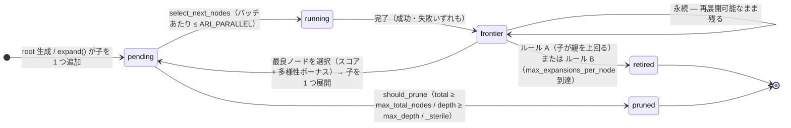

---
sources:
  - path: ari-core/ari/orchestrator/bfts.py
    role: implementation
  - path: ari-core/config/workflow.yaml
    role: config
last_verified: 2026-05-26
---

# BFTS アルゴリズム

ARI は 2 プール設計による真の最良優先木探索を実装しています:

- **`pending`**: 実行待ちのノード（親から既に展開済み）
- **`frontier`**: 完了済みだが未展開のノード

2 つのプールと、それらの間の遷移（自己ループが *永続フロンティア* —
完了ノードは再展開のために残り続ける）:



失敗ノードは**再実行されない**: フロンティアに入り `debug` 子ノードへ展開される
（`frontier → pending` の辺）。回復は再実行ではなく新規ノードとして行われる。

```python
def bfts(experiment, config):
    root = Node(experiment, depth=0)
    pending = [root]      # 実行待ちノード
    frontier = []         # 展開待ちの完了済みノード
    all_nodes = [root]

    while len(all_nodes) < config.max_total_nodes:

        # --- BFTS ステップ 1: 最良のフロンティアノードを展開 ---
        # LLM が全完了ノードのメトリクスを読み、最も有望なノードを
        # 展開対象として選択（1 回の呼び出しで子を 1 つ）
        while frontier and len(pending) < max_parallel:
            best = llm_select_best_to_expand(frontier)  # _scientific_score + diversity_bonus に基づく
            # フロンティアノードは再展開のため残る
            child = llm_propose_one_direction(best, existing_children=best.children)
            pending.append(child)
            all_nodes.append(child)

        # --- BFTS ステップ 2: pending ノードのバッチを実行 ---
        batch = llm_select_next_nodes(pending, max_parallel)
        record_run(batch)  # ラベルの多様性を追跡
        results = parallel_run(batch)

        for node in results:
            memory.write(node.eval_summary)   # 祖先チェーンメモリに保存
            frontier.append(node)             # 選択されたら展開

    return max(all_nodes, key=lambda n: n.metrics.get("_scientific_score", 0))
```

主要な特性:
- **単一子展開**: `expand()` は 1 回の呼び出しで子をちょうど 1 つ生成する。重複を避けるため豊富な文脈（兄弟スコア、祖先チェーン、木の多様性指標、既存の子）を与える。プロンプトには現在の depth/`max_depth` と残りノード予算も提示され、プランナが自らペース配分できる（v0.7.2, I-4）。
- **永続フロンティア**: 完了ノードは展開後もフロンティアに残り、`_touched_this_round` / `_failed_this_round` を追跡しつつ再展開可能。フロンティアノードは、(ルール A) 子が `_scientific_score` で親を上回るか、(ルール B) `max_expansions_per_node` 回展開済みになると **退役 (retire)** する（v0.7.2, B-6）。
- **`should_prune` 述語**: 硬い打ち切りのみ — `current_total >= max_total_nodes`（B-1）、`depth >= max_depth`（B-2、以前は死んでいた設定）、`metrics._sterile is True`（B-4）。LLM 判断はここには混ぜない。
- **多様性ボーナス**: 過少表現のラベルに `+0.05`（直近 20 実行を追跡）— `my_count * 2 ≤ max_count` のとき（I-2）。両方のセレクタフォールバック（I-3 / L-3）と `select_next_node` の LLM プロンプトの双方で適用。
- **スコア較正**: 評価器はスコア崩壊（全スコアが同一値付近に集まる）を防ぐため、直近のスコア履歴をプロンプトに注入する。
- **リトライなし**: 失敗ノードは `expand()` を通じて `debug` 子ノードを生成し、再実行はしない。選択用の `retry_count` フィールドは保持しない（B-3）。
- **厳密な予算**: `len(all_nodes) < max_total_nodes` で超過を防止。ライブカウントが唯一の真実源であり、別個の `BFTS.total_nodes` カウンタは存在しない（B-1）。
- **完了後の `record_run`**: 実行ループは `future.result()` が返った後（成功・失敗を問わず）に `bfts.record_run(result)` を呼ぶため、多様性ボーナスは実際に実行されたノードを反映する（I-7）。
- **`generate_ideas` は一度だけ呼出**: ルートノード以降はループ防止のため抑制。

### ノードラベル

| ラベル | 意味 |
|-------|---------|
| `draft` | ゼロからの新規実装 |
| `improve` | 親のパラメータまたはアルゴリズムの調整 |
| `debug` | 親の失敗の修正 |
| `ablation` | 一つのコンポーネントを除去してその影響を測定 |
| `validation` | 異なる条件で親を再実行 |
| *(カスタム)* | 未知のラベルは `other` に丸められ、`raw_label` が原文を保持する |

---

## 関連

[アーキテクチャ](architecture.md) · [メモリアーキテクチャ](memory.md) · [設定 → BFTS の評価層](../reference/configuration.md#bfts-evaluation-layers-configurable) · [用語集](../reference/glossary.md)
