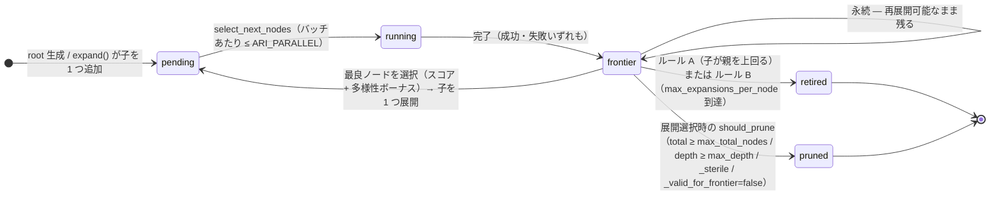

---
sources:
  - path: ari-core/ari/orchestrator/bfts.py
    role: implementation
  - path: ari-core/ari/agent/metric_contract.py
    role: implementation
  - path: ari-core/ari/rqgm/runtime.py
    role: implementation
  - path: ari-core/ari/cli/bfts_loop.py
    role: implementation
  - path: ari-core/ari/cli/run.py
    role: implementation
  - path: ari-core/ari/rqgm/store.py
    role: implementation
  - path: ari-core/config/workflow.yaml
    role: config
last_verified: 2026-08-16
---

# BFTS アルゴリズム

ARI は 2 プール設計による真の最良優先木探索を実装しています:

- **`pending`**: 実行待ちのノード（親から既に展開済み）
- **`frontier`**: 完了済みだが未展開のノード

2 つのプールと、それらの間の遷移（自己ループが *永続フロンティア* —
完了ノードは再展開のために残り続ける）:


```mermaid
stateDiagram-v2
    direction LR
    [*] --> pending: root 生成 / expand() が子を 1 つ追加
    pending --> running: select_next_nodes（バッチあたり ≤ ARI_PARALLEL）
    running --> frontier: 完了（成功・失敗いずれも）
    frontier --> frontier: 永続 — 再展開可能なまま残る
    frontier --> pending: 最良ノードを選択（スコア + 多様性ボーナス）→ 子を 1 つ展開
    frontier --> retired: ルール A（子が親を上回る）または ルール B（max_expansions_per_node 到達）
    frontier --> pruned: 展開選択時の should_prune（total ≥ max_total_nodes / depth ≥ max_depth / _sterile / _valid_for_frontier=false）
    retired --> [*]
    pruned --> [*]
```

失敗ノードは**再実行されない**: フロンティアに入り `debug` 子ノードへ展開される
（`frontier → pending` の辺）。回復は再実行ではなく新規ノードとして行われる。

```python
def bfts(experiment, config):
    root = Node(experiment, depth=0)
    pending = [root]      # 実行待ちノード
    frontier = []         # 展開待ちの完了済みノード
    all_nodes = [root]

    while len(all_nodes) < config.max_total_nodes:

        # --- BFTS ステップ 1: 最良のフロンティアノードを展開 ---
        # LLM が全完了ノードのメトリクスを読み、最も有望なノードを
        # 展開対象として選択（1 回の呼び出しで子を 1 つ）
        while frontier and len(pending) < max_parallel:
            best = llm_select_best_to_expand(frontier)  # _scientific_score + diversity_bonus に基づく
            # フロンティアノードは再展開のため残る
            child = llm_propose_one_direction(best, existing_children=best.children)
            pending.append(child)
            all_nodes.append(child)

        # --- BFTS ステップ 2: pending ノードのバッチを実行 ---
        batch = llm_select_next_nodes(pending, max_parallel)
        results = parallel_run(batch)

        for node in results:
            record_run(node)                  # 完了後にラベルの多様性を追跡
            memory.write(node.eval_summary)   # 祖先チェーンメモリに保存
            frontier.append(node)             # 選択されたら展開

    return max(all_nodes, key=lambda n: n.metrics.get("_scientific_score", 0))
```

主要な特性:
- **単一子展開**: `expand()` は 1 回の呼び出しで子をちょうど 1 つ生成する。重複を避けるため豊富な文脈（兄弟スコア、祖先チェーン、木の多様性指標、既存の子）を与える。プロンプトには現在の depth/`max_depth` と残りノード予算も提示され、プランナが自らペース配分できる（v0.7.2, I-4）。
- **永続フロンティア**: 完了ノードは展開後もフロンティアに残り、`_touched_this_round` / `_failed_this_round` を追跡しつつ再展開可能。フロンティアノードは、(ルール A) 子が `_scientific_score` で親を上回るか、(ルール B) `max_expansions_per_node` 回展開済みになると **退役 (retire)** する（v0.7.2, B-6）。
- **`should_prune` 述語**: 硬い打ち切りのみ — `current_total >= max_total_nodes`（B-1）、`depth >= max_depth`（B-2、以前は死んでいた設定）、`metrics._sterile is True`（B-4）、`metrics._valid_for_frontier is False`（RQGM の選択的消去。このキーを書くのは RQGM 側の機構だけなので `simple_bfts` では死に節だが、無条件に読むため `ari_rqgm` で消去されたノードはモードを戻しても除外され続ける）。LLM 判断はここには混ぜない。
- **多様性ボーナス**: 過少表現のラベルに `+0.05`（直近 20 実行を追跡）— `my_count * 2 ≤ max_count` のとき（I-2）。両方のセレクタフォールバック（I-3 / L-3）と `select_next_node` の LLM プロンプトの双方で適用。
- **カバレッジを考慮した展開選択**: ランが claims 付き metric contract を持つ場合、`select_best_to_expand` に渡されるゴールテキストにラン全体のクレームカバレッジブロックと **LINEAGE** ヒントが付加され（下記「リネージ連鎖」参照）、「まだ証拠のないクレームを立証できるか」が*どの*ノードを展開するかの判断に反映される — スケジューラ限定のシグナルであり、ノードの推論コンテキストには触れない。
- **スコア較正**: 評価器はスコア崩壊（全スコアが同一値付近に集まる）を防ぐため、直近のスコア履歴をプロンプトに注入する。
- **リトライなし**: 失敗ノードは `expand()` を通じて `debug` 子ノードを生成し、再実行はしない。選択用の `retry_count` フィールドは保持しない（B-3）。
- **厳密な予算**: `len(all_nodes) < max_total_nodes` で超過を防止。ライブカウントが唯一の真実源であり、別個の `BFTS.total_nodes` カウンタは存在しない（B-1）。
- **完了後の `record_run`**: 実行ループは `future.result()` が返った後（成功・失敗を問わず）に `bfts.record_run(result)` を呼ぶため、多様性ボーナスは実際に実行されたノードを反映する（I-7）。
- **`generate_ideas` は一度だけ呼出**: ルートノード以降はループ防止のため抑制。

### リネージ連鎖（Lineage Chaining）

宣言されたクレームの中には、新規のプローブでは立証できないものがある: 証拠が既存の測定値から**計算**されるもの（パラメータフィッティング、ホールドアウト検証、モデルベース選択）である。スコア駆動の展開だけでは、こうしたクレームは構造的に到達不能だった — データを持たない親から展開された子には計算の入力がなく、実ランでは同じ単発プローブの再実行への退行が観測された。これを可能にする機構が**親 → 子の `work_dir` 継承**である: 子ノードは親の作業ディレクトリのコピーから開始する（コード・設定・系譜的な `results*.json` 測定ファイルは継承され、出力アーティファクト —— ログ、結果 CSV、そして `results.json` / `*_results.json` 自体 —— は `_OUTPUT_BLACKLIST` により除外されるので、子が親の主要な数値を自分のものとして読み直すことはできない）ため、適切な親を展開すれば入力ファイルが子の手元に揃う。これを利用する誘導シグナルが 2 つある（`ari/agent/metric_contract.py`）:

- **LINEAGE ヒント（セレクタ側）**: 展開選択のゴールに付加されるラン全体のクレームカバレッジブロックが、これまでに最も多くの contract 証拠測定名を保持するノード（2 個以上が条件）を名指しし、計算型証拠の未カバークレームについては*そのノード*の展開を推奨する — 子は再測定の代わりに継承ファイルを読む（`build_expand_coverage_hint`）。
- **INHERITED DATA ノート（ノード側）**: 継承した `work_dir` に既にリネージ測定が含まれるノードは、ピン留めされた contract obligation に、存在するファイル名と contract 証拠名を列挙したノートを受け取る。指示は「それらを入力として計算し、EXACT な contract 名で emit せよ — 元の実験を再実行するな」（`build_inherited_data_note`）。

両シグナルが運ぶのは**名前とファイル名のみ**: 測定値や兄弟ノードの結論は決して流れず、木が依拠する分岐の障害封じ込めは保たれる。ノード別の帰属は `collect_node_measurement_names` が行い、（`tree.json` が存在するようになった後は）評価器が `has_real_data` と判定したノードだけを数える — 誘導側の見え方は claim gate の証拠の見え方と整合する。

### ノードラベル

| ラベル | 意味 |
|-------|---------|
| `draft` | ゼロからの新規実装 |
| `improve` | 親のパラメータまたはアルゴリズムの調整 |
| `debug` | 親の失敗の修正 |
| `ablation` | 一つのコンポーネントを除去してその影響を測定 |
| `validation` | 異なる条件で親を再実行 |
| *(カスタム)* | 未知のラベルは `other` に丸められ、`raw_label` が原文を保持する |

---

## `ari_rqgm`（オプトイン）下の統治された BFTS

オプトインの `ari_rqgm` 実行モードでも上記のアルゴリズムは変わりません —
ガバナンスは 5 つの継ぎ目でそれを*包みます*（最初の 4 つは fail-open; デフォルトの
`simple_bfts` ではこのコードは一切インポートされません）:

- **`GovernedSearchStrategy` の継ぎ目**（`ari/rqgm/runtime.py`）:
  `build_runtime` が BFTS 戦略を、同じ 7 つの `SearchStrategy` メソッドを
  実装する純粋委譲ラッパーで包みます。ランループはダックタイプの読み取り
  1 回（`getattr(bfts, "rqgm", None)`）でそれを検出します; 選択、枝刈り、
  多様性のロジックはそのまま転送されます。
- **サマリのみの expand コンテキスト**: 選択された `ProposalRecord` が存在
  する場合、`expand()` に渡される `idea_context` は生の `idea.json`
  テキストではなく、その上限付き `ProposalSummaryView`（予算:
  `proposal_router.summary_budget_chars`）から再レンダリングされます;
  提案された各子方向は提案の観察として記録し戻されます。完全なレコードが
  BFTS に到達することは決してありません。
- **エポック境界**: ループは開始時と各外側ループの先頭で `ensure_epoch` を
  呼びます; `rqgm.epoch.nodes_per_epoch` 個の新規ノードごとに、境界
  トランザクション（audit → transition → repair）が実行中ノードの無い
  メインスレッド上で走ります。評価後、完了した各ノードはノードレポートが
  書かれる前にベストエフォートの敵対ラウンドも受けます。
- **フロンティア修復フック**: 境界の tick はライブの
  `frontier`/`pending`/`all_nodes` 状態を受け取るため、退役は stale な
  レコードを論理的に消去してフロンティアを再構築できます; カーネル検証の
  二重失敗は `expansion_halted` を設定し、ループはそれ以上展開せずに保留中
  の作業を消化します。
- **保証ゲート付きのフロンティア受け入れ** —— `ari_rqgm` の*上に*さらに
  オプトインするもので、`knowledge.mode` / `capability_binding.mode` /
  `assurance.mode` のいずれかが legacy-inert な既定値（`off` / `legacy` /
  `off`）から外れたときにだけ有効になります。このとき完了した各ノードは
  まず `RQGMRuntime.assure_node` を通り、フロンティアへの追加、Rule A、
  Rule B はいずれも、保証ゲート・sterile 判定・敵対ラウンド・型付き
  ノードレポートがすべて終わるまで遅延されます。ゲートが
  `uncertified_frontier` と分類したノードはフロンティアに入らず、Rule A は
  子が単に非 `_sterile` であることではなく `scientific_frontier` であることを
  要求します。上記の継ぎ目と異なりこれは fail-closed です: `assure_node`
  ブリッジを持たない RQGM ランタイムは、レガシーの順序へ落ちるのではなく
  例外を送出します。

レイヤ、エポックアルゴリズム、不変条件は
[Constitutional ARI-RQGM アーキテクチャ](rqgm_architecture.md)に文書化
されています。

---

## resume が復元するのは木であって探索状態ではない

`ari resume` は `tree.json` を読んでエントリごとに `Node` を再構築しますが、
各ノードの状態は**部分集合しか**復元せず、探索アルゴリズム自身の状態は
まったく復元しません。resume 後の挙動を考えるときは両方が効いてきます。

**ノードの状態**。`ari-core/ari/cli/run.py` の resume 経路が復元するのは
`id`・`parent_id`・`depth`・`retry_count`・`artifacts`・`eval_summary`・
`error_log`・`children`・`created_at`・`completed_at`・`ancestor_ids`、
producer と RQGM の由来／保証フィールド、そして `status`・`label`・
`metrics`・`has_real_data`・`evaluation_cases` です。`Node.to_dict()` が
書き出しているのに読み戻されないキーがいくつかあります —
`trace_log`・`evaluation_status`・`raw_label`・`name`・`original_direction`・
`node_report_path` — また `tree.json` に一切載らないフィールド
(`memory_snapshot`・`full_messages`・`full_tools`・エージェント自己申告系・
`measurement_audit`・`evaluator_reason`) は dataclass の既定値から始まります。
status が PENDING または FAILED だったノードは PENDING に戻されて再投入され、
それ以外は完了扱いです。

**探索の状態**。resume したランは `build_runtime` 経由で新しい `BFTS` を構築し、
`_run_loop` に先頭から入り直すため、3 つのカウンタが空から再開します:

| カウンタ | 定義場所 | 何が再開するか |
|---|---|---|
| `BFTS._expansion_count` | `ari/orchestrator/bfts.py` | Retire Rule B のノードごとの展開回数。すでに `max_expansions_per_node` に達していたノードが再び展開可能になる |
| `BFTS._recent_label_history` | `ari/orchestrator/bfts.py` | 多様性ボーナスの窓（直近 20 ラベル）。過少ラベルへの `+0.05` が空の履歴から計算される |
| `_lineage_actions_taken` | `ari/cli/bfts_loop.py` | lineage フックの `rate_limit_per_run` に対するラン単位の予算が満タンに戻る |

3 つとも永続化されていませんし、できません。`tree.json` は契約凍結された
追加のみのフォーマットであり（[アーキテクチャ](architecture.md) の
*探索フェーズの must-not-break レジスタ（BX-1 … BX-19）* の BX-7 を参照）、
新しい探索状態をその中に相乗りさせることはできないからです。

**エポック状態が独自ファイルを持つ理由**。まさにこれが理由で、統治モードは
エポック状態を木やメモリに置こうとしません。`ari/rqgm/store.py` が書く独自の
チェックポイント直下ファイルへ永続化します: `rqgm_transitions.jsonl` が
resume 時にリプレイされる追記専用・ハッシュ連鎖の真実の源、
`rqgm_audit.jsonl` が不変の監査ログ、`epoch_state.json` /
`rqgm_registry.json` が読み込み時にリプレイと突き合わせ検証され不一致なら
再構築される派生スナップショットです。モードの由来は 5 つ目のファイル
`rqgm_state.json` にあります。resume は `tree.json` を先に読み、モードの整合は
その後に行いますが、順序は結果に影響しません。
永続化されたモードが config と環境変数の双方に勝つので、ランのモードが
途中で切り替わることはなく、`simple_bfts` のチェックポイントが resume で
昇格することもありません。

---

## 関連

[アーキテクチャ](architecture.md) · [Constitutional ARI-RQGM アーキテクチャ](rqgm_architecture.md) · [メモリアーキテクチャ](memory.md) · [設定 → BFTS の評価層](../reference/configuration.md#bfts-の評価層-設定で切替可能) · [用語集](../reference/glossary.md)
