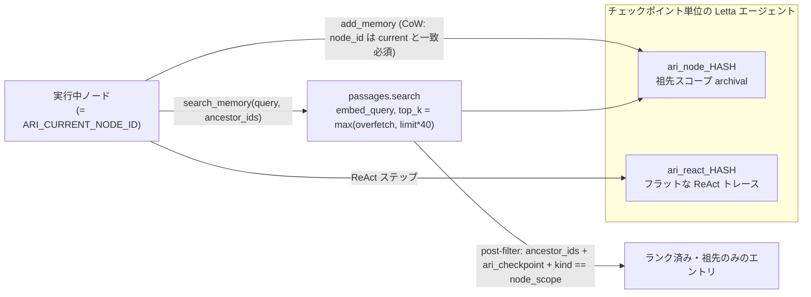

---
sources:
  - path: ari-core/ari/memory/letta_client.py
    role: implementation
  - path: ari-skill-memory
    role: implementation
last_verified: 2026-05-26
---

# メモリアーキテクチャ

各ノードは自身の祖先チェーンからのみ読み取ります:

```
root ──▶ memory["root"]
  ├─ node_A ──▶ memory["node_A"]
  │    ├─ node_A1  (読み取り: root + node_A)
  │    └─ node_A2  (読み取り: root + node_A、node_A1 は含まない)
  └─ node_B  (読み取り: root のみ、node_A ブランチは含まない)
```

`search_memory` は `query = node.eval_summary` で呼ばれます。Letta 0.16.7 のサーバ上で本スキルは `passages.search` (`GET /archival-memory/search`、`embed_query=True`) を `top_k = max(letta_overfetch, limit*40)` で叩き、ランクされた結果を `ancestor_ids` / `ari_checkpoint` / `kind == "node_scope"` でローカル post-filter します。サーバが返す **embedding ランク順がそのまま保持** されるので、子は自身のクエリに対して意味的に最も関連するエントリを先頭から受け取ります。意図的に避けた `passages.list(search=q)` ルートは SQL substring filter (`LOWER(text) LIKE LOWER(%q%)`) であり、`RESULT SUMMARY metrics=[...]` のような構造化エントリに対する長い自然文クエリは無音で 0 件を返します — 詳細は `ari-skill-memory/src/ari_skill_memory/backends/letta_backend.py` の live verification を参照。

### v0.6.0: Letta バックエンド

両レイヤはチェックポイントごとに 1 つの Letta エージェントに同居します:

- `ari_node_<ckpt_hash>` — 上記の祖先スコープメタデータフィルタを持つノードスコープの archival コレクション。
- `ari_react_<ckpt_hash>` — チェックポイント単位のフラットな ReAct トレース（`LettaMemoryClient`、祖先フィルタなし）。

これら 2 つのコレクションを通る読み書き経路（`HASH` = チェックポイントハッシュ。
祖先スコープを担保するのは書き込みガードと post-filter です）:



エージェントはコアメモリブロック（`persona` + `human` + `ari_context`）に、最初のノードの `generate_ideas` が完了したタイミング（`primary_metric` が確定する時点）で実験目的・主要メトリック・ハードウェア仕様を seed します。スキルは `get_experiment_context()` で検索コストを払わずに読めますが、seed が走るまでは `{}` を返します。

**Copy-on-Write**: 書き込み側ツールは `node_id` ≠ `$ARI_CURRENT_NODE_ID` を reject するので、祖先エントリは兄弟ノード間でバイト安定です。同じ理由で Letta の self-edit パスはデフォルト無効化されています。

**ポータビリティ**: 各チェックポイントは `memory_backup.jsonl.gz` スナップショットを携行し、`ari resume` 時に対象 Letta が空であれば自動 restore されます。これにより `cp -r checkpoints/foo /elsewhere/` + `ari resume` が動き続けます。

---
