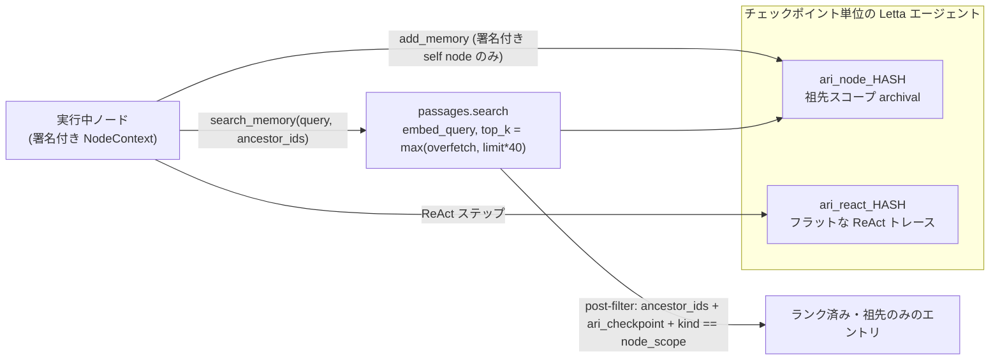

---
sources:
  - path: ari-core/ari/memory/letta_client.py
    role: implementation
  - path: ari-skill-memory
    role: implementation
  - path: ari-core/ari/memory_cli.py
    role: implementation
  - path: ari-core/ari/memory_contract.py
    role: implementation
  - path: ari-core/ari/call_context.py
    role: implementation
  - path: ari-core/ari/agent/loop.py
    role: implementation
  - path: ari-core/ari/cli/run.py
    role: implementation
last_verified: 2026-08-16
---

# メモリアーキテクチャ

各ノードは自身の祖先チェーンからのみ読み取ります:

```
root ──▶ memory["root"]
  ├─ node_A ──▶ memory["node_A"]
  │    ├─ node_A1  (読み取り: root + node_A)
  │    └─ node_A2  (読み取り: root + node_A、node_A1 は含まない)
  └─ node_B  (読み取り: root のみ、node_A ブランチは含まない)
```

`search_memory` は `query = (eval_summary or experiment_goal or "experiment result")[:200]` で呼ばれます — ノードが持っていればその一文の方向性テキストを、切り詰めて使います。バックエンドはまずサーバ側のメタデータ事前フィルタを*要求*しますが、Letta アダプタは無条件に拒否します（`if filter is not None: raise NotImplementedError`。ARI のメタデータは passage テキストに付く JSON フッタとして往復するのであって、クエリ可能なフィールドではないためです）。したがって Letta 0.16.x では常に over-fetch 経路が走ります。本スキルは `passages.search` (`GET /archival-memory/search`、`embed_query=True`) を `top_k = max(letta_overfetch, limit*40)` で叩き、ランクされた結果を `ancestor_ids` / `ari_checkpoint` / `kind == "node_scope"` でローカル post-filter します。サーバが返す **embedding ランク順がそのまま保持** されるので、子は自身のクエリに対して意味的に最も関連するエントリを先頭から受け取ります。意図的に避けた `passages.list(search=q)` ルートは SQL substring filter (`LOWER(text) LIKE LOWER(%q%)`) であり、`RESULT SUMMARY metrics=[...]` のような構造化エントリに対する長い自然文クエリは無音で 0 件を返します — 詳細は `ari-skill-memory/src/ari_skill_memory/backends/letta_backend.py` の live verification を参照。

### v0.6.0: Letta バックエンド

両レイヤはチェックポイントごとに 1 つの Letta エージェントに同居します:

- `ari_node_<ckpt_hash>` — 上記の祖先スコープメタデータフィルタを持つノードスコープの archival コレクション。
- `ari_react_<ckpt_hash>` — チェックポイント単位のフラットな ReAct トレース（`LettaMemoryClient`、祖先フィルタなし）。

これら 2 つのコレクションを通る読み書き経路（`HASH` = チェックポイントハッシュ。
署名付きコンテキスト検証と post-filter がスコープを担保します）:


```mermaid
flowchart LR
    node["実行中ノード<br/>(署名付き NodeContext)"]
    subgraph letta["チェックポイント単位の Letta エージェント"]
        nodecol["ari_node_HASH<br/>祖先スコープ archival"]
        reactcol["ari_react_HASH<br/>フラットな ReAct トレース"]
    end
    node -->|"add_memory (署名付き self node のみ)"| nodecol
    node -->|"ReAct ステップ"| reactcol
    node -->|"search_memory(query, ancestor_ids)"| search["passages.search<br/>embed_query, top_k = max(overfetch, limit*40)"]
    search --> nodecol
    search -->|"post-filter: ancestor_ids + ari_checkpoint + kind == node_scope"| result["ランク済み・祖先のみのエントリ"]
```

エージェントはコアメモリブロック（`persona` + `human` + `ari_context`）に、最初のノードの `generate_ideas` が完了したタイミング（`primary_metric` が確定する時点）で実験目的・主要メトリック・ハードウェア仕様を seed します。スキルは `get_experiment_context()` で検索コストを払わずに読めますが、seed が走るまでは `{}` を返します。また、この呼び出しは読み取った内容を 60 秒間キャッシュします。

**Copy-on-Write**: すべてのメモリ呼び出しは、明示的な
`RunContextV1` と `NodeContextV1` を持ちます。ノードコンテキストは
`run_id`、self node、親、root から親まで順序付けられた祖先リストを
`lineage_digest` に束縛します。ari-core はモデルがツール引数を生成した後、
接続ごとの署名付き capability を注入し、メモリ Skill は I/O の前に検証します。
書き込み先は self のみ、読み取り対象は署名済み lineage（ツールによっては self
も含む）のみに制限されます。可変なプロセスグローバルのノード変数がないため、
並行する兄弟同士が競合したり互いを認可したりすることはありません。受理済み
エントリをバイト安定に保つため、Letta の self-edit は引き続き無効です。

**ポータビリティ**: 各チェックポイントは digest 検証付き
`memory_backup.v1.json.gz` を携行します。`ari resume` は restore の前にこれを検証し
（サイズ上限、gzip/JSON のパース、`MemoryBackupV1` スキーマ）、restore を行うのは
対象の Letta にノードエントリも ReAct エントリも 1 件も無い場合**のみ**です —
このステップを飛ばすには `ARI_MEMORY_AUTO_RESTORE=false` を設定します。
そのため `cp -r checkpoints/foo /elsewhere/` を安全に行えます。
record は content-addressed で Letta の checkpoint namespace に依存しません。

型付き entry は公開 `MemoryRecordV1` 契約を使い、semantic search は
backend/server/model version、ranking の決定性、query digest、上限、filter evidence
を含む `MemoryRetrievalV1` を返します。memory text は索引であり、検証済み artifact
だけが論文・図の主張を根拠付けます。詳細は
[研究メモリ契約](../reference/memory_contract.md) を参照してください。

---

## 関連

[アーキテクチャ](architecture.md) · [BFTS アルゴリズム](bfts.md) · [用語集](../reference/glossary.md)
