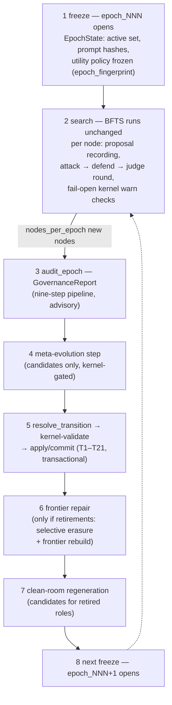

---
sources:
  - path: ari-core/ari/rqgm
    role: implementation
  - path: ari-core/ari/core.py
    role: implementation
  - path: ari-core/ari/cli/bfts_loop.py
    role: implementation
  - path: ari-core/ari/config/__init__.py
    role: implementation
  - path: ari-core/ari/configs/defaults.yaml
    role: config
  - path: ari-core/ari/paths.py
    role: implementation
  - path: ari-core/ari/rqgm/events.py
    role: implementation
  - path: ari-core/ari/rqgm/transition_rules.py
    role: implementation
  - path: ari-core/ari/rqgm/utility_evolution.py
    role: implementation
  - path: ari-core/ari/rqgm/paper_mode.py
    role: implementation
  - path: ari-core/ari/rqgm/paper_runtime.py
    role: implementation
  - path: ari-core/ari/rqgm/paper_archive.py
    role: implementation
  - path: ari-core/ari/rqgm/paper_anchor.py
    role: implementation
  - path: ari-core/ari/rqgm/paper_self_preference.py
    role: implementation
  - path: ari-core/ari/schemas
    role: schema
  - path: ari-core/ari/prompts/rqgm
    role: prompt
  - path: ari-core/ari/prompts/governance
    role: prompt
last_verified: 2026-07-16
---

# Constitutional ARI-RQGM アーキテクチャ

Constitutional ARI-RQGM は ARI のオプトイン `ari_rqgm` 実行モードです:
変更されていない BFTS ループを包む、エポックベースのガバナンスと共進化の
レイヤです。`simple_bfts` がデフォルトのままであり、`ari:`/`rqgm:` 設定
ブロックが無ければ `ari.rqgm` モジュールはインポートすらされず、
チェックポイントは RQGM 以前の ARI とバイト単位で同一に保たれます。
有効化、モードインターロック、モード切替ポリシーは
[実行モード](../guides/execution_modes.md)にあります; このページは
アーキテクチャそのもの — なぜこのモードが存在するのか、そのレイヤは何か、
エポックはどう進むのか、どの不変条件が成り立つのか — を扱います。

> **ランタイムウォークスルーは
> [RQGM ランタイムウォークスルー](rqgm_runtime_walkthrough.md)を参照** —
> 実際の `ari_rqgm` ラン 1 回をステップごとにトレースします
> （起動 → 設立登録 → ノード単位フック → 境界 → ディスクに何が着地
> するか）。イベントログの抜粋と観察用チートシート付きです。

---

## 動機

ARI の制度的コンポーネント — 研究の方向を提案し、ノードをレビューし、品質を
判定する LLM ロール — は、それ自体がプロンプトで定義された成果物です。
それらを進化させれば改善が解放されますが、制約のない自己改変はまさに
Gödel マシン系の文献が警告するものです: 自身の評価器を書き換えられる
コンポーネントは、いずれ自分自身に報酬を与えます。Red Queen Gödel Machine
の研究系譜（[arXiv:2606.26294](https://arxiv.org/abs/2606.26294)）は
Red-Queen ダイナミクス — 敵対者が共進化してくる*からこそ*コンポーネントが
改善する — を加えますが、共進化だけでは失敗モード（スコアインフレ、
メトリクスゲーミング、証拠の捏造、ロール間の共謀）を抑え込めません。

Constitutional ARI-RQGM は共進化ループを、**決して進化しない固定の憲法層**の
下に置きます。プロンプトとコンポーネントは競争し、攻撃し、防御し、採用または
退役させられます — しかしすべての状態変更は、コードに凍結された規則テーブルに
対して、決定論的かつ非 LLM のカーネルによって検証されます。執行スタンスは
「制度をブロックし、研究はブロックしない」です: ガバナンスは自分*自身*の
状態変更（採用、退役、レジストリ書き込み）を拒否できますが、ノードの実行を
拒否することは決してありません。

---

## 4 つの柱

Constitutional ARI-RQGM は 4 つの定義的なコミットメントの上に立ちます。
このページのすべての機構はそのいずれかに奉仕しており、それぞれについて
現行実装がどこまで到達しているかを正直に述べます:

1. **スコアそのものが境界ごとに書き換わる木探索。** BFTS は best-first の
   *木*であり、そのフロンティアをランク付けする utility policy はラン定数
   ではありません — プロンプトを進化させるのと同じライフサイクルを通じて、
   エポックごとに凍結され境界で書き換えられる統治対象オブジェクトです
   （[統治された utility 進化](#統治された-utility-進化)を参照）。*帰結*の
   半分は以前から生きていました: 書き換えは旧ポリシーを退役させ、
   `frontier_repair` がそのポリシーでスコアされたすべてのノードを無効化
   します。*原因*の半分 — 後継を提案する `policy_mutator` — が Task 14 です。
2. **敵対者は成果物*と*評価の両方を攻撃し、共謀は禁止。** 7 種の探索
   adversary はノードの*成果物*を攻撃します; 8 番目の
   `paper_self_preference` は*reviewer の判定*（reviewer が過剰に受理した
   AI ドラフト）を攻撃します。スコアポリシーがフロンティア自身のスコアから
   提案されることは決してありません — 自分が既に生成したノードにおもねる
   ように調律されたポリシーは、まさに決定論 / 無共謀の原則が禁じる自己
   参照ループです（`PolicyMutator` が見るのは境界の既に抽象化された証拠
   だけ、`utility_evolution.py`）。
3. **敵対者自身が監査ネットワークの中にいる — 絶対的な支配者は不在。**
   攻撃するコンポーネント、スコアを提案するコンポーネント、監査する
   コンポーネントは、いずれも登録された・制裁可能な・進化可能な行です:
   `policy_mutator_v1` は設立メタコンポーネントであり、その自身のテンプレート
   は他と同様に進化し、それに対するガバナンス勧告は通常の制裁に解決され
   ます。遷移テーブルの外に居るものは何もありません。
4. **すべては憲法に拘束され、弾劾は憲法に従う。** すべての状態変更は
   `constitution_hash` でピン留めされた凍結規則テーブルに対して非進化的な
   カーネルが検証します; 健全な behavioral コンポーネントがその席を失う
   唯一の道は、Auditor が提出し境界で裁定される `ImpeachmentMotion` です。
   2 つの supersession エッジ（T20/T21）はサンクション限定の置換モデルの
   *唯一*の例外であり、各々が 1 つのロールファミリにカーネルでガードされて
   います。

---

## 3 つのレイヤ

ロールとティアの語彙は `ari/rqgm/events.py` の閉じた集合です
（`EVOLVABLE_ROLES`、`FIXED_ROLES`、`TIERS`）; コンポーネント id は
`{role}_v{N}`、プロンプト id は `{role}_prompt_v{N}` です。

| レイヤ | ティア | ロール | 進化する? |
|---|---|---|---|
| **0 — 憲法（固定）** | `fixed` | `constitutional_kernel`、`fixed_verifier`（決定論的な `results.json` マージ / メトリクス再計算パス）、`audit_log` | **決してしない。** 来歴のためだけに登録される; 規則テーブルはコードに存在し（`kernel_rules.py`、`transition_rules.py`、`clean_room_rules.py`、`meta_rules.py`）、`constitution_hash` でピン留めされる。規則を編集するには `tests/test_rqgm_kernel.py` で明示的に再ピン留めが必要 |
| **1 — 制度** | `institutional` | `generator`、`reviewer`、`adversary`、`defender`、`judge`、`router`; 統治された評価基準 `utility_policy`; そして（paper モードのみ）`paper_writer`、`paper_reviewer` | する — プロンプト進化ライフサイクルを通じて、エポック境界でのみ。`utility_policy` はプロンプト定義ではなく（現職はポリシー*文書*）が、まったく同じ意味で進化可能: 1 つの現職が、境界で遷移エンジンを通じてのみ置き換えられる |
| **2 — メタ** | `meta` | `prompt_mutator`、`clean_room_generator`、`replay_selector`、`failure_summary_compressor`、`policy_mutator` | する — Layer 1 を進化させるエージェント自身も統治され、権限は厳密に狭い（不変条件を参照）。`policy_mutator` は後継 utility policy を提案する |

ロールとティアの語彙は当初から閉じた集合でした; Task 14 と paper フェーズが
`policy_mutator` と `utility_policy` を un-freeze し（両者ともライブコードに
名指しされながら `ROLES` のどちらの半分でも登録できなかった）、
`paper_writer` / `paper_reviewer` を paper モードゲート付きの設立行として
追加したため、探索 `ari_rqgm` 起動は以前とバイト単位で同一に登録されます
（`EVOLVABLE_ROLES`、`ari/rqgm/events.py`）。

各 `ari_rqgm` チェックポイントへコピーされる同梱の `constitution.yaml` は
人間可読の声明にすぎません — 編集しても何も変わらず、コードのテーブルが
権威です。

---

## 4 つのファサード

`ari.core.build_runtime` は `ari.mode: ari_rqgm` と `rqgm.enabled: true` が
一致するときにのみ単一の `RQGMRuntime`（`ari/rqgm/runtime.py`）を構築し、
BFTS 戦略を純粋委譲の `GovernedSearchStrategy` で包みます。ランループは
ダックタイプの読み取り 1 回 — `getattr(bfts, "rqgm", None)` — で RQGM を
発見するため、`simple_bfts` が支払うのは失敗する属性参照 1 回だけです。
ランタイムの内部では、4 つのファサードがガバナンス機構を所有します
（すべて遅延構築、すべて fail-open）:

| ファサード | モジュール | 所有するもの |
|---|---|---|
| `ConstitutionalKernel` | `ari/rqgm/kernel.py` | Layer 0。12 個の閉じた `validate_*` エントリポイント（レコードスキーマ、ハッシュ、capability、エポック不変性、遷移、ロール分離、選択的消去、監査ログ完全性、クリーンルームバンドル、汚染、権限非拡大、コンテキストスコープ）と執行アダプタ（`should_block`、fail-open な `per_node_warn_check`、事前チェックの `CapabilityGatedMCPClient`）。決定論的かつ非進化的: LLM 呼び出しゼロ、ネットワークゼロ、壁時計判定ゼロ。`rqgm.kernel.enforcement: audit_only` はすべてのコンテキストを warn-and-log へ格下げ |
| `GovernanceOrchestrator` | `ari/rqgm/governance/` | エポック境界の監査: `audit_epoch(...) -> GovernanceReport`。9 ステップのパイプライン（observe → assess reliability → assemble evidence → prosecute → defend → adjudicate → replay-pool update → self-audit → report）。すべての LLM 判定（Auditor / Defender / GovernanceJudge、プロンプトは `ari/prompts/governance/` 以下）には完全な決定論的フォールバックがあり、`llm=None` でも完全な監査が得られる。レポートは遷移エンジンへの*助言的入力*であり、オーケストレータがレジストリを変更することは決してない |
| `RegistryTransitionEngine` | `ari/rqgm/transition_engine.py` | レジストリステータスの**唯一の**書き込み手。固定の T1–T21 テーブルに対する純粋な `resolve_transition(...)` と、その後の 5 ステップ境界プロトコル: freeze → resolve → kernel-validate → prepare → apply/commit をエポックトランザクション上で実行。`emergency_quarantine` が唯一のエポック途中パス |
| `FrontierRepairEngine` | `ari/rqgm/frontier_repair.py` | 退役を伴う遷移のコミット後: 純粋な `trace_dependents` による staleness 閉包と `rebuild_frontier`。`SelectiveErasureEvent` / `FrontierRebuildEvent` レコードを発行。失敗のはしご: カーネル検証失敗 → 保守的再修復（フラグ付きノードを除外）→ drain-only 縮退（`expansion_halted`: ランは残作業を完了するがそれ以上展開しない）。クラッシュは決して起こさない |

同じランタイムには支援コンポーネントもぶら下がります: `ProposalRouter` +
ジェネレータ群（`ari/rqgm/proposals/`。オプションの MCP-only
`VirSciAdapter` を含む）、ノード単位の `AdversarialRound` と
`AdversarialReplayPool`（`ari/rqgm/adversarial/`）、プロンプト進化
パイプラインと `GovernedPromptLoader`（`ari/rqgm/prompt_evolution.py`、
`prompt_loader.py`）、`CleanRoomCoordinator`（`clean_room.py`）、
`MetaEvolutionCoordinator`（`meta_evolution.py`）、
`GovernanceBudgetManager`（`budget.py`）。

---

## エポックサイクル

ガバナンスはエポックベースです。エポックは制度を凍結し、境界だけが制度が
変わりうる唯一の窓です。v1 の境界トリガはノード数
（`rqgm.epoch.boundary: node_count`、`rqgm.epoch.nodes_per_epoch: 10`）で、
ランループの `ensure_epoch` tick がループ開始時と各外側ループの先頭で
チェックします — メインスレッド上で、実行中のノードが無い状態です。
同じ tick はラン終了時にもう一度実行されるため、N 番目のノードが最終
ループイテレーションで作られた場合でも境界は発火します（トリガ未達の
末尾エポックは open のままです）。

1. **Freeze。** `freeze_epoch`（`ari/rqgm/state.py`）がアクティブ
   コンポーネント集合、プロンプトハッシュ、utility policy を不変の
   `EpochState` に決定論的な `epoch_fingerprint` とともにピン留めします。
   凍結されるポリシーは**採用済み**のものです —
   `capture_utility_policy(cfg, registries=)` がアクティブな
   `utility_policy` エントリを読み、エポック 0 またはポリシー未採用時に
   のみ解決済みの `cfg` にフォールバックします（Task 14 以前の関数と
   バイト単位で同一）。エポック id は `epoch_000`、`epoch_001`、… です。
   新規チェックポイント
   では、`epoch_000` が開くよりも前の起動時に**設立登録**が実行されます:
   1 つのトランザクションが凍結された設立テーブル
   （`ari/rqgm/prompt_spec.py` — 29 プロンプト、16 コンポーネント。うち
   `utility_policy_prompt_v1` は cfg 由来で、残り 28 プロンプト行と 16 コンポーネント行は
   凍結されたコード定数。plan 14 §5.3）を
   `rqgm_transitions.jsonl` 上に登録するため、最初の freeze は空でない
   アクティブ集合を伴います。write-once です: resume はそれをリプレイし、
   決して再登録しません。
2. **Search。** BFTS は `simple_bfts` とまったく同じように探索します。
   ノードごとにベストエフォートのフックが 3 つ走ります: 展開方向は
   `ProposalRecord` として記録され、評価済みノードには敵対ラウンドが付き
   （7 種の adversary タイプのひとつがノードの*成果物*を攻撃し、defender が
   応答し、`ArtifactJudge` が裁定し、ジャッジに検証された攻撃だけが有界の
   スコアペナルティを適用します）、ノード単位のカーネルチェックが
   warn-and-flag します。
3. **Audit。** 境界では閉じようとしているエポックが*先に*監査されるため、
   `GovernanceReport` が遷移エンジンに利用可能になります。
4. **Meta ステップ。** メタティア（prompt mutator、clean-room generator、…）
   はサンドボックスで走り、出力を発行できます — そのすべてが
   `status: candidate` でライフサイクルに入り、決して即時有効化されません。
5. **Transition。** `resolve_transition` は（エポック状態、ガバナンス
   レポート、候補評価、レジストリ、ステータス履歴、設定）の純粋関数です —
   再実行してもバイト単位で同一。カーネルが解決済み遷移を検証します;
   ブロックされた遷移は fail-closed で中止され、現職のアクティブ集合が
   引き続き役目を果たします（governance-suspended carry-over — ランは
   決して中断しません）。コミットはトランザクショナルです: 同じ
   `transition_id` の二重コミットはガードされた no-op であり、中断された
   トランザクションは resume 時に破棄され決定論的に再実行されます。
6. **Frontier repair。** コミットされた遷移がコンポーネントやプロンプトを
   退役させた場合、退役した `prompt_hash` に実質的に依存するすべての
   レコードがフロンティアスコアリングから論理的に消去され、フロンティアが
   再構築されます（不変条件 7 を参照）。
7. **Clean room。** 保留中のクリーンルーム要求は境界の窓の中で実行されます;
   許容可能な出力は*次の*サイクルの候補としてライフサイクルに入ります。
   退役したロールのスロットはその間ベースラインフォールバックが担うため、
   統治対象ロールが空席になることはありません。
8. **次の freeze。**（変わったかもしれない）アクティブ集合を再び凍結して
   新しいエポックが開きます。

コンポーネントは 10 個のステータス（`candidate`、`validated`、`shadow`、
`probationary_active`、`active`、`warning`、`probation`、`quarantine`、
`retired`、`banned`）を、`ari/rqgm/transition_rules.py` の固定 T1–T21
テーブルに沿って移動します。設定可能なのは `rqgm.transition.*` の数値
しきい値だけです; テーブルのトポロジは憲法改正面（コード + テスト変更）で
あり、決して設定ではありません。末尾の 2 行は **supersession エッジ**で、
各々が 1 つのロールファミリにカーネルでガードされ、いずれも同一ロールの
T6 採用の*内側*でのみ発火します（採用された後継なしに置換が起こることは
決してありません）:

* **T20**（`active → retired`、`superseded_by_adopted_successor`）は
  `utility_policy` エッジ（Task 14）: 検証済み・shadow 合格の後継
  ポリシーが少なくとも同等にスコアすれば*健全な*現職を置き換え、**旧**
  `utility_policy_hash` とともに退役させます。これが唯一の
  `active → retired` エッジです; behavioral ロールに対してはカーネルが
  これを拒否します（退役は依然として quarantine を経由）。
* **T21**（`active → shadow`、`reinstatable_standby`）は paper ロール
  エッジ（`paper_writer` / `paper_reviewer`）: shadow 合格の後継プロンプト
  が採用されると、格下げされた現職が復帰可能な `shadow` スタンバイへ移り、
  paper ロールごとにアクティブエントリがちょうど 1 つ残ります。T20 と
  異なり退役ではありません — 後の境界がスタンバイを再び登らせることが
  できます。

---

## 統治された utility 進化

定義的な主張は、探索が木構造であること**と、各エポック境界で
スコア全体 — utility 関数そのもの — が書き換えられること**です。*帰結*の
半分は以前から生きていました: `frontier_repair` は退役した utility policy が
生成したすべてのスコアを破壊できます。Task 14 は*原因*の半分 — 後継
ポリシーを提案する何か — を供給し、スコアの変更を禁じていた唯一の不変
条件（I-11）を撤廃します。

**utility policy は統治対象オブジェクトです。** ポリシー本体
（`composite`、`axis_weights`、`frontier_score`、`depth_penalty_lambda`、
`ucb_c`）はエポックごとに凍結され境界で書き換えられます。
`capture_utility_policy(cfg, registries=)`（`ari/rqgm/state.py`）は
レジストリから**採用済み**ポリシーを読み、エポック 0、`simple_bfts`、
または任意の読み取り / 検証失敗時に解決済みの `cfg` へ縮退します
（常に現職レジーム、決して raise しません）。Task 14 以前はこの関数が
静的な cfg しか読まなかったため、`utility_policy_hash` はラン定数であり、
`frontier_repair` が待つ退役は決して発火できませんでした。

**提案者。** `PolicyMutator`（`ari/rqgm/utility_evolution.py`）は
`PromptMutator` のアナログです: `UtilityPolicyCandidate` レコードを**のみ**
発行し、レジストリ / ストア書き込み面を一切公開しません。4 つのデフォルト
変異種別（`axis_reweighting`、`composite_swap`、`frontier_score_swap`、
`exploration_tuning`）は境界の既に抽象化された証拠に対する純粋な算術 —
LLM なし、クロックなし、乱数なし — なので、デフォルトの書き換えは完全に
再現可能です; opt-in の `freeform_policy_proposal` だけが LLM を参照します
（未設定時は `None` を返します）。候補は `CK-UTL-001…008` の合法性規則
（許容 `composite` / `frontier_score` 集合、軸ごとの重み範囲、重み和
制約、範囲チェック、body-hash が id と一致するかのチェック）に対して
カーネル検証されます。これは設立**メタ**コンポーネント
（`policy_mutator_v1`）であり、その自身のテンプレートは他と同様に進化し、
ガバナンス勧告がそれを制裁できます — 絶対的な支配者は不在です。

**書き換えは過去を無効化します。** `_utility_policy_hash` センチネル
（`UtilityPolicyStamp`）がすべてのノードの `metrics` にスタンプされるため、
書き換えは**すべての**旧ポリシーでスコアされたノードを無効化できます —
`UtilityRecord` を持つ「攻撃されペナルティを受けた」部分集合だけでは
ありません。T20 が旧ハッシュとともに現職を退役させると、
`frontier_repair` はそれらのノードを `utility_invalidated` としてマークし、
新ポリシーの凍結された重みの下でフロンティアを再構築します
（あるいは frontier-invalid として落とします — erase, don't re-scale）。

**I-11 撤廃。** utility policy は今や*エポック*ごとに凍結され境界で
書き換えられ、ラン全体で一定に保たれることはありません。エポック内では
依然として不変です（不変条件 1 は無傷）; 撤廃はエポック横断軸についてのみ
です。

**正直な限界 — 「少なくとも同等」ゲートは空虚になりうる。** デフォルト
設定（`axis_mode: dynamic`、空の静的 `axis_weights`）では 2 つのポリシーを
比較する固定の軸ごとの基底が存在しないため、T3 の「少なくとも同等に
スコアする」品質ゲートには評価すべき順序がありません: supersession は
合法性と非退化性に還元され、基準は証明可能に改善するのではなく合法な
シンプレックスの*中*を転がります。これは正直な Red-Queen の姿勢であり
（グラウンドトゥルースが無ければ、厳密に良い相手が無い）、バグでは
ありません。真に厳密に良いゲートにはアンカーされた軸ごとの基底が必要で、
それはまさに paper フェーズの accept/reject アンカー（Task 04、下記）が
`paper_reviewer` 基準に供給するものです。

---

## paper-archive レイヤ

paper フェーズは 4 つの柱の方法を*論文執筆*に適用したものです。これは
**独自の**実行軸 `paper.mode: linear | rqgm_archive` によってゲートされ、
冗長な `rqgm.paper.enabled` インターロックを伴います（`ari/rqgm/paper_mode.py`、
`PaperMode`、`resolve_paper_mode`）。この軸は `ari.mode` と**直交**しており
— 4 つの組み合わせすべてが有効です — `linear`（デフォルト）は今日の
論文パイプラインとバイト単位で同一です: `rqgm_archive` が実効でない限り、
論文パスで `ari.rqgm` モジュールはインポートされません。

**ドラフト空間の本物の木。** `PaperArchiveRuntime.run_archive`
（`ari/rqgm/paper_runtime.py`）は `PaperArchiveStrategy`
（`ari/rqgm/paper_archive.py`）を介して*ドラフト*空間上の本物の浅い
best-first 木を走らせます: 1 つの `paper_root`、深さ 1 に最大
`archive.width`（K、デフォルト 4）のシードドラフト、各ドラフトは
`archive.depth`（デフォルト 3）まで最大 `archive.refine_rounds` の refine
子へ展開できます。BFTS の prune/count ロジックと、本物の
`select_best_to_expand` フロンティア選択・本物の `diversity_bonus` を
再利用します; `paper_refine` パスは**子ノード**（木の深さ）であり、
in-place 編集ではありません。`PaperDraftExecutor` は `ari-skill-paper` を
無思考の「手」として包みます — シードは `write_paper_iterative`、refine 子は
`paper_refine` — そしてスキルは `ari.rqgm` を一切インポートせず、
**プロセス横断で統治されることは決してありません**。

**統治ロールと 8 番目の敵対者。** `paper_writer` と `paper_reviewer` は
実効 `rqgm_archive` モードの下でのみ登録される進化可能な制度ロールです
（探索起動はバイト単位で同一のまま）; 統治された ari-core プロンプトが
スキルを*駆動*します。新しい 8 番目の adversary タイプ
`paper_self_preference` は reviewer の**過剰受理** — 現職 reviewer が高く
スコアしたがアンカーなら reject する AI ドラフト — を攻撃します（柱 2:
成果物ではなく*評価*を攻撃）。そして claim gate が同じドラフトを不忠実と
判定したときは、それを産出した **writer** も攻撃します。paper ロールの
採用時、T21 が格下げされた現職を shadow スタンバイへ移します。

**2 つのアンカー。** *reviewer* は APReS 等価の accept/reject コーパス
（`ari/rqgm/paper_anchor.py`、`paper_anchor_corpus.jsonl`）にアンカー
されます: reviewer は保留された人間ラベル付きのグラウンドトゥルースと
*一致する*ことで信頼を得ます。各ケースは `label_source` を宣言し、
`max_bootstrap_label_fraction` キャップがコーパスと保留サブセットに対して
機械的に強制されます — 違反はコーパスを**拒否**します（`None` に縮退、
決して raise しません）。アンカーはデフォルト `enabled: false` — 縮退した
on-ramp です; 完全な共進化には `anchor.enabled: true` **と**キュレート
されたコーパスが必要です。

*writer* もまたアンカーされます — RQGM 論文の writer が決して持たなかった
グラウンドトゥルースに対して。ARI は実際に**実行された**実験について書くので、
Layer-0 の claim-evidence hard gate がドラフトの忠実性を**決定論的に**
スコアします: `writer_faithfulness_score` がゲートの
`execution_grounded_claim_rate`、`numeric_claim_reproducible_rate`、
`numeric_coverage_rate` を [0,1] のスコアへ畳み込み（LLM なし、実時計なし）、
`WRITER_ANCHOR_DESCRIPTOR` — メトリック id `claim_evidence_faithfulness_v1`、
その Layer-0 ソース、3 つの構成要素、しきい値 — が `paper_utility_policy` へ
凍結されるので、paper エポックのフィンガープリントが writer が*何に*
アンカーされているかを記録します。これにより ARI の paper writer は RQGM 論文の
**コーディング**ドメインの形（決定論的な検証器 *+* 共進化する reviewer）に
なり、論文のアンカー無き paper-writing ドメインではなくなります。ゲート自体は
Layer 0 のままです: RQGM はその所見を**読む**だけです
（`run_hard_gate(write=False)`、永続化せず、包まず、進化させません）。

**弾劾チェーン（Task 15）。** 敵対者の事前シグナル（どの過剰受理ドラフトを
攻撃するか）が*本物の* adversary → Defender → ArtifactJudge ラウンドを
駆動します。結果の `ValidatedAttackRecord` は今やオプションの
`target_component_id` を持ち、構築時に該当ロールからエポック凍結の
`paper_reviewer_v1` / `paper_writer_v1` へ解決されます
（`ari/rqgm/adversarial/round.py`）。これは、すべての adversary について
上流で死んでいた
`validated_attack → validated_attack_involvement → classify_target →`
弾劾チェーンを閉じます。*正直な限界:* これが本番で発火するのは
`paper_self_preference` だけで、そのターゲットは登録された設立
コンポーネントです。7 種の探索 adversary は `generator` ロールが著した
成果物を攻撃しますが、`generator` には**登録されたコンポーネントが無い**
ため、そのチェーンは**設計上**不活性のままです（generator コンポーネントの
登録は別の判断です）。

**2 つの有責コンポーネント、1 つのラウンド。** claim gate が*さらに*不忠実と
判定した過剰受理ドラフトには、**2 つ**の有責コンポーネントがあります: それを
受理した reviewer と、それを産出した writer です。したがって
`_AFFECTED_ROLES_BY_TYPE["paper_self_preference"]` は両ロールを名指しし、
ラウンドは**解決可能なロールごとに 1 件の validated attack** を発行します
（`round.py:_resolve_bindings`）。各レコードはターゲットとする単一のロールを
名指しします。writer のバインドはそのドラフトの Layer-0 忠実性でノード単位に
ゲートされます: 過剰受理でも**忠実な**ドラフトは reviewer のみをバインドします。
`paper_writer` は paper フェーズ外では `""` へ解決されるので、探索のレコードは
バイト単位で同一のままです。

**最良ドラフトは無変更のゲートへ流れます。** アーカイブの最良ドラフトは
純粋・LLM フリーの `materialize_winner` によって `{ckpt}/full_paper.tex` へ
**一度だけ**コピーされ、**既存**のコンパイル + claim-evidence hard gate
（Layer 0、無変更、決してカーネルで包まれない）が linear ランと同じ契約で
それに走ります — `write_paper` の `skip_if_exists` が拾います。コストは
有界です: `node_budget = min(width·(1+refine_rounds), max_expansions)` が
**どの深さでも** BFTS の `max_total_nodes` になり（深い木は同じ M ノードを
再分配するだけで、決して増やしません）、フェーズ全体が Task 12 の
ガバナンス予算をそのまま継承します。

**正直な限界（paper フェーズ）。**

* **両方のプロンプトが共進化する — ただし writer は退行したときだけ。**
  `paper_writer` *プロンプト*は通常の統治パス（sanction → ロール開放 →
  既存の T6; 新しい遷移エッジは**不要**）を通じて共進化し、実行証明が採用を
  跨いでアクティブ writer の `prompt_hash` が変わることを観測しています。
  一方で、挑戦者が優れて見えるという理由**だけ**では採用されません: writer の
  後継は `shadow` まで climb して、現職が claim-gate 忠実性の*退行*で
  制裁されるまで**そこで待ちます**。これが保守的な行動ロールモデルであり、
  偶然ではなく因果的です — 忠実なドラフトでは同じドライバが writer 攻撃 0 件・
  writer 動議 0 件・writer ハッシュ不変を生む一方、reviewer は依然として
  攻撃され弾劾されます。なお writer の*ドラフト*勝者は引き続き
  **エポックローカル**です（エポック内で凍結された reviewer が順位付けするので、
  異なる reviewer バージョンがスコアしたドラフト同士は決して比較されません）。
* **writer への制裁は reviewer のラウンドに相乗りする。** writer をターゲットと
  する攻撃は `paper_self_preference` ラウンドが発行し、そのラウンドは
  **過剰受理**のアンカーケースがあるときにのみ発火します。したがって reviewer が
  何も過剰受理していない状況で writer のドラフトだけが不忠実な場合、今日の
  writer は制裁されません; 専用の writer adversary タイプは別の判断です。
* **デフォルトのラウンド数では採用が完了しない。** デフォルトの
  `rqgm.paper.epoch.rounds: 2` では境界と弾劾動議は*発火*しますが、
  `validated → shadow → probationary_active` の climb（約 5 境界）は
  採用を完了しません; 完全な採用にはより多くのラウンドが必要です
  （実行証明は 8 を回します）。
* **アンカー OFF ⇒ *両ロール*とも best-of-N。** アンカーがデフォルトの
  `false` の場合、`rqgm_archive` モードはユーザがコーパスを供給するまで
  共進化なしのレビュー済み best-of-N ドラフトです;
  `rqgm.paper.prompt_evolution.enabled: false` はほぼ今日のコストで同じ姿勢です。
  これは **writer** にも効きます: writer の忠実性ケースはアンカープールへ
  landed されるので、プールが無ければ writer のボードスコアも writer への制裁も
  ありません — writer 自身のアンカー（claim gate）は独自のキュレートデータを
  一切必要としないにもかかわらず、です。
* **in-phase ペナルティは合成。** self-preference ラウンドは現在、実際の
  過剰受理アーカイブドラフトではなく*合成*のアカウンタビリティノードを
  格下げします（その in-phase 格下げは先送り）。実際に発火するのは、
  本物の validated-attack レコードを通じた reviewer のアカウンタビリティ /
  共進化チャネルです。

---

## 主要な不変条件

1. **エポック凍結されたアクティブ集合。** アクティブコンポーネント
   （`active`、`probationary_active`）、プロンプトハッシュ、utility policy
   はエポック途中に変更できません。`validate_epoch_invariance` がこれを
   イベントログから再導出します。（utility policy は*境界では*変わりうる
   — かつての I-11「一定のスコア」不変条件の撤廃、[上記](#統治された-utility-進化)
   — が、エポック内では決して変わりません。）
2. **境界限定の遷移、例外は 1 つ。** すべてのステータス変更はエポック境界
   トランザクションの中でコミットされます。唯一のエポック途中エッジは
   `emergency_quarantine`（規則 T16: `probationary_active` / `active` /
   `warning` / `probation` → `quarantine`）で、カーネルクリティカルな
   トリガコードに限定され、それでもログされカーネルで検証されます。
3. **単一のレジストリ書き込み手。** コンポーネント/プロンプトのステータスを
   書けるのは `RegistryTransitionEngine` だけです（グローバル不変条件 10）—
   ストレージ層で構造的に強制され（`ari/rqgm/store.py`、イベント再生のみに
   よるレジストリ変更）、カーネルで検証されます。`candidate → active` の
   エッジは存在せず（即時有効化なし）、`retired` からの復活はなく、
   `banned` は吸収状態です。
4. **生の攻撃はスコアに決して触れない。** adversary の `RawAttackRecord` は
   スコアリング効果を持ちません; ジャッジに検証された攻撃だけが有界の
   utility ペナルティ（エポック凍結ポリシー:
   `rqgm.adversarial.penalty.cap`、severity 別重み）に入り、ペナルティ前
   スコアは追加的なメトリクスキーに保存されます。ジャッジの失敗は
   `invalid` にフォールバックします — ペナルティなし。adversary が攻撃する
   のは*成果物*であり、コンポーネントでは決してありません: 攻撃スキーマに
   コンポーネントフィールドはありません。
5. **同一ロールの告発は禁止。** 同一ロールの出力は観察にとどまります。
   ガバナンスレコードビルダで構成的に強制され、カーネルの
   `validate_role_separation` が権威的に強制します; 不許容な証拠は証拠
   収集の段階で除外されます。
6. **選択的消去は論理のみ。** 物理的には何も削除されません。staleness は
   監査ログイベント、導出された `rqgm_erasure_state.json` ロールアップ、
   および `tree.json` を通じて永続化される追加的な `Node.metrics`
   センチネル（`_stale`、`_valid_for_frontier`、`_stale_reason`、
   `_erasure_event_id`）に存在します。消去はスロットスコープです
   （退役した reviewer はその reviewer のレコードとその下流の utility への
   影響だけを stale にし、無関係な仕事は決して stale にしません）。
   utility は*元の*エポックの凍結された重みの下で生き残った入力から
   再計算されます — それが不可能な場合、ノードは代わりに
   frontier-invalid になります（erase, don't re-scale）。
7. **クリーンルーム汚染規則。** 退役ロールの置換プロンプトは、固定ティアが
   組み立てる、閉じた、カーネルでスクリーニングされた入力バンドル
   （コミット済みカタログ + 抽象化された失敗サマリ）から生成されます —
   レジストリのプロンプトテキストからは決して生成されません。退役
   プロンプトのテキストはあらゆる場所で読めません: レジストリビューは
   それをスタブアウトし、`RetiredPromptAccessGuard` が capability ゲートで
   アクセスを拒否します。カーネルの word-shingle 汚染スクリーン
   （`rqgm.clean_room.contamination_screen`）は汚染された候補を受け入れ
   時点でブロックします; 生成は one-shot です（退役テキストを読みうる
   ツール付きループは存在しません）。
8. **メタティアの権限制限。** メタエージェントは読み取り専用サンドボックス
   （`MetaSandboxMCPProxy` の allowlist + 合成された submit ツール）で走り、
   capability フラグは deny-by-default で hard-denied フラグは const-false
   （`ari/rqgm/meta_rules.py`）、カーネルは権限非拡大を部分集合演算として
   チェックし（不変条件 18）、すべてのメタ出力は `status: candidate` で
   ライフサイクルに入ります — メタティアは提案できても、任命は決して
   できません。
9. **固定層は決して進化しない。** カーネル、固定検証器、監査ログ、遷移 /
   severity / capability テーブル、選択的消去規則、claim-evidence hard
   gate は進化対象ではありません; `constitution_hash` がテーブルを
   ピン留めします。
10. **制度をブロックし、研究は決してブロックしない。** ハードブロック
    集合が拒否するのは RQGM の状態変更のみ（遷移コミット、レジストリ
    書き込み、フロンティア再構築コミット、候補昇格）です; ノード実行が
    拒否されることは決してありません。すべてのランループフックは
    ベストエフォート / fail-open です — ガバナンスの失敗が劣化させるのは
    ガバナンスであって、実験ではありません。
11. **決定論 (P2)。** カーネル判定、遷移解決、フロンティア修復、予算
    レベル、shadow サンプリング（ハッシュベース）、評価メトリクスは純粋
    関数です — 乱数なし、壁時計判定なし、リプレイでバイト単位に同一。

---

## チェックポイント上のレコード

すべての RQGM 状態はチェックポイントスコープかつ追加的です:
**`rqgm_state.json` の不在は純粋な `simple_bfts` ランを意味します。**
ストレージパターンは「真実としての append-only JSONL + 高速読み取りの
ための導出 JSON スナップショット」です; resume はイベントログを再生します
（そして監査ログの完全性を再検証します — 失敗は governance-suspended
carry-over へ縮退し、resume の拒否には決してなりません）。これらの
ファイルはすべて `PathManager.META_FILES`（`ari/paths.py`）にあり、
ノード作業ディレクトリへコピーされることはありません。

| ファイル | 書き込み手 | 保持するもの |
|---|---|---|
| `rqgm_state.json`、`constitution.yaml` | ラン開始時（`ari/rqgm/state.py`） | モード来歴（`mode_source` ∈ `config\|env\|resume`、switch journal）; copy-once の人間可読な憲法 |
| `rqgm_transitions.jsonl` → `epoch_state.json`、`rqgm_registry.json` | `RqgmStateStore` / 遷移エンジン | エポック + レジストリのイベントログ真実; 凍結エポックとレジストリのスナップショット |
| `rqgm_audit.jsonl` | `ImmutableAuditLog`（全ファサード） | ハッシュ連鎖・append-only の監査ログ: カーネルレポート、ガバナンスレコード、budget/level 行、消去 + 再構築イベント |
| `proposals/`（`proposal_records.jsonl`、`proposal_index.json`）+ `idea.json` プロジェクション | `ProposalStore` / `ProposalRouter` | 完全な提案レコード（「すべて保存」）; BFTS が見るのは上限付きの `ProposalSummaryView` のみ |
| `rqgm_adversarial_cases.jsonl` → `rqgm/adversarial_replay_pool.json` | 敵対ループ | raw/defense/judgment/validated-attack/utility レコード; リプレイプールのスナップショット（境界でのみ更新） |
| `prompt_evolution.jsonl` → `prompt_specs.json`; 本文は `rqgm_prompts/` 以下 | プロンプト進化パイプライン / `GovernedPromptLoader` | 候補 / 検証 / shadow レコード; PromptSpec ロールアップ; write-once の進化済みプロンプト本文（ハッシュ検証、in-place 変更なし） |
| `rqgm_cleanroom.jsonl` | `CleanRoomCoordinator` | 要求 / スクリーン / フォールバックのイベントログ |
| `rqgm_erasure_state.json` | `FrontierRepairEngine` | 導出された stale/invalid ロールアップ（監査ログの消去 / 再構築イベント上の純粋な fold; 不在 == 何も stale でない） |
| `rqgm_meta_outputs.jsonl` | `MetaEvolutionCoordinator` | メタエージェント出力（コンテンツ由来 id; 読み取り時にリトライ dedup） |
| `rqgm_governance_cache.jsonl` | `GovernanceCache` | artifact/prompt/role/epoch/context のハッシュをキーとした決定論的リプレイ / 結果キャッシュ |
| `rqgm_eval_metrics.json`、`rqgm_injection_provenance.json` | 評価ハーネスのみ | ランごとのメトリクスレポート; 注入（合成）ランの永続マーカー |
| `paper_archive_state.json`、`paper_draft_archive.jsonl` | `PaperArchiveRuntime` / paper アーカイブ（paper モードのみ） | paper フェーズのモード来歴（write-once）; スコア付きドラフト集団（ドラフトごとに 1 レコード、`is_best_belief` / `compiled` フラグ） |
| `paper_anchor_corpus.jsonl`、`rqgm/paper_self_preference_stat.json` | アンカーローダ / self-preference 統計（paper モードのみ） | accept/reject のグラウンドトゥルースコーパス（各ケースの `label_source`）; 敵対者の事前シグナルが引用する決定論的な AI 対 human の self-preference マージン |

4 つの `paper_*` ファイルは実効 `rqgm_archive` paper モードの下でのみ
存在します — その不在は、`rqgm_state.json` の不在と同様に、linear な論文
ランを表します。

正確なオンディスク形式:
[ファイルフォーマットリファレンス](../reference/file_formats.md);
JSON Schema（`ari-core/ari/schemas/` 内。例: `epoch_state`、
`rqgm_registry`、`rqgm_transition_event`、`governance_report`、
`proposal_record`、`selective_erasure_event`、`frontier_rebuild_event`、
`erasure_state`）: [RQGM スキーマリファレンス](../reference/rqgm_schemas.md)。

---

## 設定面

`ari.mode` + `rqgm.enabled` インターロックがモードを有効化します
（両者は一致していなければなりません —
[実行モード](../guides/execution_modes.md)を参照）。チューニング可能な面は
意図的にスイッチ・予算・数値しきい値に限定されています: `rqgm.epoch`、
`rqgm.kernel`、`rqgm.governance`、`rqgm.replay`、`rqgm.transition`、
`rqgm.adversarial`、`rqgm.shadow`、`rqgm.prompt_evolution`、
`rqgm.clean_room`、`rqgm.frontier_repair`、`rqgm.meta_evolution`、
`rqgm.budgets`、`rqgm.eval`、および `proposal_router.*` ブロック
（デフォルトは `ari-core/ari/configs/defaults.yaml`、型付きモデルは
`ari-core/ari/config/__init__.py`）。規則テーブルは決して設定になりません。
VirSci はオプションかつ直交です: `proposal_router.generators.virsci.enabled`
は両モードでデフォルト `false` です —
[VirSci 統合](../guides/virsci_integration.md)を参照。

paper フェーズは**第 2 の、直交する**軸です: `paper.mode`
（`linear | rqgm_archive`）+ `rqgm.paper.enabled` インターロックで、独自の
`rqgm.paper.*` ブロック（`archive` — `width` / `depth` / `refine_rounds` /
`max_expansions`; `epoch.rounds`; `anchor`; `self_preference`;
`prompt_evolution`; `reviewer.agent_as_judge` — `enabled`（デフォルト
`false`、環境変数オーバーライド `ARI_PAPER_AGENT_AS_JUDGE`）/ `max_tokens`。
決定論的リーダーには読めないルーブリック軸を読めるオプトインの
`LLMClient` バックのドラフト採点器で、失敗時は決定論的な venue ルーブリック
へフォールバックします）を持ちます。`ari.mode` × `paper.mode` の 4 つの
組み合わせすべてが有効です; 両者ともデフォルトは linear/`simple_bfts` 値な
ので、ランは各軸に独立してオプトインします —
[paper-archive レイヤ](#paper-archive-レイヤ)を参照。

コスト制御は組み込みです: `GovernanceBudgetManager` がすべてのガバナンス
決定ポイントを、エポックごと・ロールごとの呼び出しキャップと
`rqgm.budgets` の支出キャップに対してゲートし（`allow | degrade | skip`）、
各ノードにガバナンスレベル（L0 fixed … L3 adjudicated）を割り当てます。
枯渇が劣化させるのはガバナンスであって、ノード実行ではありません;
Layer-0 の固定チェックは構造上その対象外です。

---

## 関連

[RQGM ランタイムウォークスルー](rqgm_runtime_walkthrough.md) ·
[実行モード](../guides/execution_modes.md) ·
[BFTS アルゴリズム → RQGM ラッピング](bfts.md#governed-bfts-under-ari_rqgm-opt-in) ·
[RQGM 評価とアブレーション](../guides/rqgm_evaluation.md) ·
[RQGM スキーマリファレンス](../reference/rqgm_schemas.md) ·
[VirSci 統合](../guides/virsci_integration.md) ·
[RQGM 移行](../guides/rqgm_migration.md) ·
[ファイルフォーマットリファレンス](../reference/file_formats.md) ·
[ARI アーキテクチャ](architecture.md)
