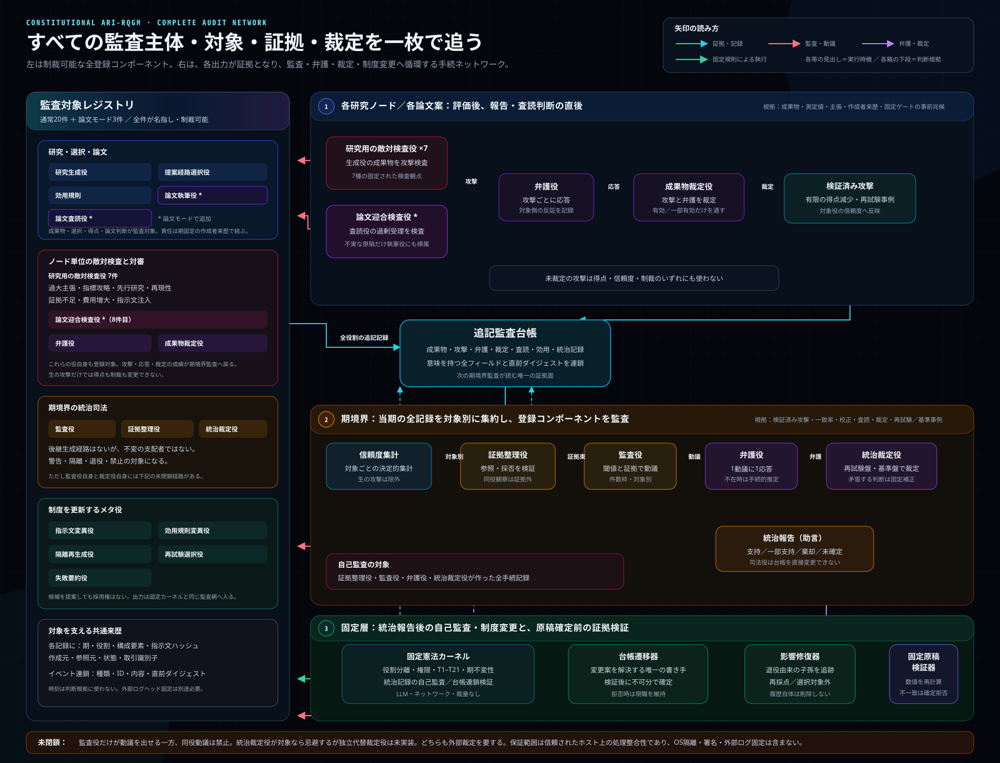
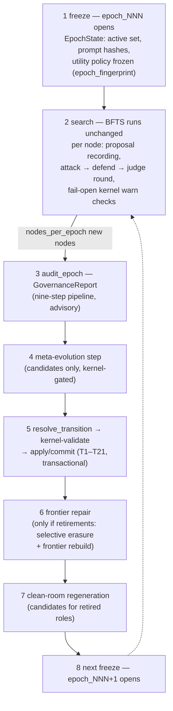

---
sources:
  - path: ari-core/ari/rqgm
    role: implementation
  - path: ari-core/ari/core.py
    role: implementation
  - path: ari-core/ari/cli/bfts_loop.py
    role: implementation
  - path: ari-core/ari/config/__init__.py
    role: implementation
  - path: ari-core/ari/configs/defaults.yaml
    role: config
  - path: ari-core/ari/paths.py
    role: implementation
  - path: ari-core/ari/rqgm/events.py
    role: implementation
  - path: ari-core/ari/rqgm/transition_rules.py
    role: implementation
  - path: ari-core/ari/rqgm/utility_evolution.py
    role: implementation
  - path: ari-core/ari/rqgm/paper_mode.py
    role: implementation
  - path: ari-core/ari/rqgm/paper_runtime.py
    role: implementation
  - path: ari-core/ari/rqgm/paper_archive.py
    role: implementation
  - path: ari-core/ari/rqgm/paper_anchor.py
    role: implementation
  - path: ari-core/ari/rqgm/paper_self_preference.py
    role: implementation
  - path: ari-core/ari/schemas
    role: schema
  - path: ari-core/ari/knowledge
    role: implementation
  - path: ari-core/ari/capability_binding
    role: implementation
  - path: ari-core/ari/assurance
    role: implementation
  - path: ari-core/ari/prompts/rqgm
    role: prompt
  - path: ari-core/ari/prompts/governance
    role: prompt
last_verified: 2026-08-17
---

# Constitutional ARI-RQGM アーキテクチャ

Constitutional ARI-RQGM は ARI のオプトイン `ari_rqgm` 実行モードです:
変更されていない BFTS ループを包む、エポックベースのガバナンスと共進化の
レイヤです。`simple_bfts` がデフォルトのままであり、`ari:`/`rqgm:` 設定
ブロックが無ければ `ari.rqgm` モジュールはインポートすらされず、
チェックポイントは RQGM 以前の ARI とバイト単位で同一に保たれます。
有効化、モードインターロック、モード切替ポリシーは
[実行モード](../guides/execution_modes.md)にあります; このページは
アーキテクチャそのもの — なぜこのモードが存在するのか、そのレイヤは何か、
エポックはどう進むのか、どの不変条件が成り立つのか — を扱います。

> **ランタイムウォークスルーは
> [RQGM ランタイムウォークスルー](rqgm_runtime_walkthrough.md)を参照** —
> 実際の `ari_rqgm` ラン 1 回をステップごとにトレースします
> （起動 → 設立登録 → ノード単位フック → 境界 → ディスクに何が着地
> するか）。イベントログの抜粋と観察用チートシート付きです。

---

## 完全な監査ネットワーク

[](../../assets/images/rqgm/rqgm_audit_flow_ja.svg)

左側は制裁可能な対象全体です。研究・選択・効用・任意の論文役、8件の
敵対検査役と弁護役・成果物裁定役、3件の統治司法役、5件のメタ役を列挙
しています。右側は、これらが孤立した六つの検査ではなく、どのように一つの
ネットワークを作るかを示します。各役の出力は追記監査台帳へ入り、ノード
単位の攻撃は弁護と成果物裁定を通過したものだけが証拠になります。期境界
では、決定的な信頼度集計と証拠整理役が、監査役だけが提出できる動議、
動議ごとの弁護、基準盤に制約された統治裁定へ証拠を渡します。この司法が
作った記録も台帳へ戻り、固定カーネルが自己監査します。

最下段では助言と執行を分けています。統治報告を唯一の台帳遷移器が解決し、
固定カーネルが T1–T21 を検証した後だけ不可分に確定します。退役時には
影響修復が走り、固定原稿検証器はこれと独立に確定前の原稿を検証します。
未閉鎖経路も明示しています。唯一の監査役は同役である自分自身へ動議を
出せず、統治裁定役が対象なら忌避しますが独立した代替裁定役がありません。
どちらも外部裁定を要します。図を選択すると原寸で開きます。

---

## 動機

ARI の制度的コンポーネント — 研究の方向を提案し、ノードをレビューし、品質を
判定する LLM ロール — は、それ自体がプロンプトで定義された成果物です。
それらを進化させれば改善が解放されますが、制約のない自己改変はまさに
Gödel マシン系の文献が警告するものです: 自身の評価器を書き換えられる
コンポーネントは、いずれ自分自身に報酬を与えます。Red Queen Gödel Machine
の研究系譜（[arXiv:2606.26294](https://arxiv.org/abs/2606.26294)）は
Red-Queen ダイナミクス — 敵対者が共進化してくる*からこそ*コンポーネントが
改善する — を加えますが、共進化だけでは失敗モード（スコアインフレ、
メトリクスゲーミング、証拠の捏造、ロール間の共謀）を抑え込めません。

Constitutional ARI-RQGM は共進化ループを、**決して進化しない固定の憲法層**の
下に置きます。プロンプトとコンポーネントは競争し、攻撃し、防御し、採用または
退役させられます — しかしすべての状態変更は、コードに凍結された規則テーブルに
対して、決定論的かつ非 LLM のカーネルによって検証されます。執行スタンスは
「制度をブロックし、研究はブロックしない」です: ガバナンスは自分*自身*の
状態変更（採用、退役、レジストリ書き込み）を拒否できますが、ノードの実行を
拒否することは決してありません。

---

## 4 つの柱

Constitutional ARI-RQGM は 4 つの定義的なコミットメントの上に立ちます。
このページのすべての機構はそのいずれかに奉仕しており、それぞれについて
現行実装がどこまで到達しているかを正直に述べます:

1. **スコアそのものが境界ごとに書き換わる木探索。** BFTS は best-first の
   *木*であり、そのフロンティアをランク付けする utility policy はラン定数
   ではありません — プロンプトを進化させるのと同じライフサイクルを通じて、
   エポックごとに凍結され境界で書き換えられる統治対象オブジェクトです
   （[統治された utility 進化](#統治された-utility-進化)を参照）。*帰結*の
   半分は実装済みです: 書き換えは旧ポリシーを退役させ、
   `frontier_repair` が保存済み raw axis から比較可能な全ノードを新基準で
   再スコアし、安全に再スコアできないノードだけを無効化します。*原因*側は、
   後継を提案する統治対象の `policy_mutator` です。
2. **敵対者は成果物*と*評価の両方を攻撃し、共謀は禁止。** 7 種の探索
   adversary はノードの*成果物*を攻撃します; 8 番目の
   `paper_self_preference` は*reviewer の判定*（reviewer が過剰に受理した
   AI ドラフト）を攻撃します。スコアポリシーがフロンティア自身のスコアから
   提案されることは決してありません — 自分が既に生成したノードにおもねる
   ように調律されたポリシーは、まさに決定論 / 無共謀の原則が禁じる自己
   参照ループです（`PolicyMutator` が見るのは境界の既に抽象化された証拠
   だけ、`utility_evolution.py`）。
3. **敵対者自身が監査ネットワークの中にいる — 絶対的な支配者は不在。**
   攻撃する、スコアを提案する、司法を担う各コンポーネントは登録済みで
   制裁可能です。`policy_mutator_v1` のような進化可能ロールには後継が
   生まれます。Auditor、Evidence Clerk、Governance Judge にはプロンプト
   変異による後継経路はありませんが、warning、retired、banned の対象です。
   Governance Judge 自身が motion の対象なら忌避します。遷移テーブルの
   外に居るものは何もありません。
4. **すべては憲法に拘束され、弾劾は憲法に従う。** すべての状態変更は
   `constitution_hash` でピン留めされた凍結規則テーブルに対して非進化的な
   カーネルが検証します; 健全な behavioral コンポーネントがその席を失う
   唯一の道は、Auditor が提出し境界で裁定される `ImpeachmentMotion` です。
   2 つの supersession エッジ（T20/T21）はサンクション限定の置換モデルの
   *唯一*の例外であり、各々が 1 つのロールファミリにカーネルでガードされて
   います。

---

## 3 つのレイヤ

ロールとティアの語彙は `ari/rqgm/events.py` の閉じた集合です
（`EVOLVABLE_ROLES`、`GOVERNANCE_ACTOR_ROLES`、`FIXED_ROLES`、
`TIERS`）; コンポーネント id は `{role}_v{N}`、プロンプト id は
`{role}_prompt_v{N}` です。

| レイヤ | ティア | ロール | 進化する? |
|---|---|---|---|
| **0 — 憲法（固定）** | `fixed` | `constitutional_kernel`、`knowledge_binder`、`capability_binder`、`harness_resolver`、`fixed_verifier`、`audit_log` | **決してしない。** プロンプトを持たず決定論的で、来歴のためだけに登録される — そもそも登録されるのは Knowledge/Capability/Assurance のいずれかのレイヤが有効なときだけ: この 6 行は `KCA_FIXED_COMPONENT_TABLE`（`prompt_spec.py`）であり、設立時のトランザクションではなく専用の `transition_kca_fixed_admission` トランザクションでコミットされる。規則テーブルはコードに存在し（`kernel_rules.py`、`transition_rules.py`、`clean_room_rules.py`、`meta_rules.py`）、`constitution_hash` でピン留めされる。規則を編集するには `tests/test_rqgm_kernel.py` で明示的に再ピン留めが必要 |
| **1 — 制度** | `institutional` | `generator`、`reviewer`、`adversary`、`defender`、`judge`、`router`; 統治された評価基準 `utility_policy`; そして（paper モードのみ）`paper_writer`、`paper_reviewer` | する — プロンプト進化ライフサイクルを通じて、エポック境界でのみ。`utility_policy` はプロンプト定義ではなく（現職はポリシー*文書*）が、まったく同じ意味で進化可能: 1 つの現職が、境界で遷移エンジンを通じてのみ置き換えられる |
| **1 — ガバナンス司法** | `institutional` | `auditor`、`evidence_clerk`、`governance_judge` | 後継生成経路はないが不変ではない。3 者とも設立時に登録され、レジストリから名指しでき、制裁可能。judge 自身が motion の対象なら忌避する |
| **2 — メタ** | `meta` | `prompt_mutator`、`clean_room_generator`、`replay_selector`、`failure_summary_compressor`、`policy_mutator` | する — Layer 1 を進化させるエージェント自身も統治され、権限は厳密に狭い（不変条件を参照）。`policy_mutator` は後継 utility policy を提案する |

ロールとティアの語彙は当初から閉じた集合でした; Task 14 と paper フェーズが
`policy_mutator` と `utility_policy` を un-freeze し（両者ともライブコードに
名指しされながら `ROLES` のどちらの半分でも登録できなかった）、
`paper_writer` / `paper_reviewer` を paper モードゲート付きの設立行として
追加したため、探索 `ari_rqgm` 起動は以前とバイト単位で同一に登録されます
（`EVOLVABLE_ROLES`、`ari/rqgm/events.py`）。

各 `ari_rqgm` チェックポイントへコピーされる同梱の `constitution.yaml` は
人間可読の声明にすぎません — 編集しても何も変わらず、コードのテーブルが
権威です。

---

## Knowledge、Capability、Assurance の分離

RQGM は、コンポーネントではない 3 つの registry を、それぞれの identity を
混ぜずに統治します:

```text
Research Contract
  -> Epoch Knowledge Skill Lock
  -> Capability Binding Lock
  -> Verification Contract
  -> baseline/active Harness Lock
  -> bind された Provider の実行
  -> artifact に束縛された Harness Attestation
  -> 科学フロンティアゲート
  -> Evidence Clerk と敵対 / 統治レビュー
  -> certification に束縛された公表
```

Knowledge Skill は不変の手続き知識テキストであり、プロセスを起動することも
権限を与えることもできません。Capability Provider は MCP、ローカルプロセス、
その他の admit された transport を通じて発見される実行主体で、Provider lock と
Capability Binding Lock に載っている tool だけが可視です。Harness は
`harness_resolver_v1` が選ぶ独立した検証器であり、Generator や Evaluator が
選ぶことはありません。個々の Skill、Provider、Harness はカタログのエントリで
あって、`ComponentRegistry` のアクタではありません。

3 つのレイヤはいずれもオプトインで、出荷時のデフォルトでは不活性です
（`ari-core/ari/configs/defaults.yaml` の `knowledge.mode: off`、
`capability_binding.mode: legacy`、`assurance.mode: off`）。3 つともその値で
あれば `RQGMRuntime` は `kca_feature_enabled: false` を報告します: `ari_rqgm`
ランは `fixed` ティアのコンポーネントを登録せず、baseline バンドルを admit せず、
従来の MCP discovery/visibility を保ちます。3 つのうちどれか 1 つでも別の値に
なると機能が有効になり、ランループの admission 呼び出しはベストエフォートでは
なく意図的に fail-closed になります。

信頼されたコーディネータは、最初の実行エポックより前に、baseline のカタログ
スナップショット、契約、lock をすべて凍結します。resume は現在のカタログを
参照せず、永続化されたそのビューを再構成します。固定チェック `CK-KNW-*`、
`CK-CAP-*`、`CK-HAR-*` は権限、binding、digest、単調性、attestation の scope を
検証します; カーネルが科学的真理を再計算することはありません。
[K/C/A の規範リファレンス](../reference/knowledge_capability_assurance.md)を参照。

---

## 4 つのファサード

`ari.core.build_runtime` は `ari.mode: ari_rqgm` と `rqgm.enabled: true` が
一致するときにのみ単一の `RQGMRuntime`（`ari/rqgm/runtime.py`）を構築し、
BFTS 戦略を純粋委譲の `GovernedSearchStrategy` で包みます。ランループは
ダックタイプの読み取り 1 回 — `getattr(bfts, "rqgm", None)` — で RQGM を
発見するため、`simple_bfts` が支払うのは失敗する属性参照 1 回だけです。
ランタイムの内部では、4 つのファサードがガバナンス機構を所有します
（すべて遅延構築、すべて fail-open）:

| ファサード | モジュール | 所有するもの |
|---|---|---|
| `ConstitutionalKernel` | `ari/rqgm/kernel.py` | Layer 0。16 個の閉じた `validate_*` エントリポイント: 当初の 12 個（レコードスキーマ、ハッシュ、capability、エポック不変性、遷移、ロール分離、選択的消去、監査ログ完全性、クリーンルームバンドル、汚染、権限非拡大、コンテキストスコープ）、Task 14 の `validate_utility_policy`、そして Knowledge 完全性、Capability Binding 完全性、Harness 完全性。加えて執行アダプタ（`should_block`、fail-open な `per_node_warn_check`、事前チェックの `CapabilityGatedMCPClient`）。検査するのは手続き、権限、identity、単調性であって、科学的正しさではない。決定論的かつ非進化的: LLM 呼び出しゼロ、ネットワークゼロ、壁時計判定ゼロ。`rqgm.kernel.enforcement: audit_only` はすべてのコンテキストを warn-and-log へ格下げ |
| `GovernanceOrchestrator` | `ari/rqgm/governance/` | エポック境界の監査: `audit_epoch(...) -> GovernanceReport`。9 ステップのパイプライン（observe → assess reliability → assemble evidence → prosecute → defend → adjudicate → replay-pool update → self-audit → report）。すべての LLM 判定（Auditor / Defender / GovernanceJudge、プロンプトは `ari/prompts/governance/` 以下）には完全な決定論的フォールバックがあり、`llm=None` でも完全な監査が得られる。レポートは遷移エンジンへの*助言的入力*であり、オーケストレータがレジストリを変更することは決してない。構築時点でこの権限関係が必須化される: `kernel` が無ければ `__init__` が `ValueError` を送出する。役割分離の権限を持つのはオーケストレータ自身のレコード構築処理ではなくカーネルであり、監査が生成したレコード（evidence bundle、motion、defense、outcome）をステップ 8 で `validate_record_schema` と `validate_role_separation` により再検証するのもカーネルだからである。残り 2 つの seam は設計上オプショナル: `llm=None` は保証された劣化動作であり、CI 向けの決定論的な下限である。`audit_writer=None` はレコードを書き出さず `self.written` 上のメモリに収集し、テストはこれを通じて監査を観測する。レコードの追記が例外を送出することはない — writer の失敗はログに記録され、監査は続行する |
| `RegistryTransitionEngine` | `ari/rqgm/transition_engine.py` | レジストリステータスの**唯一の**書き込み手。固定の T1–T21 テーブルに対する純粋な `resolve_transition(...)` と、その後の 5 ステップ境界プロトコル: freeze → resolve → kernel-validate → prepare → apply/commit をエポックトランザクション上で実行。T16 の `emergency_quarantine` は現期を強制終了し、同じ取引で新しい指紋値を持つ期を開始する |
| `FrontierRepairEngine` | `ari/rqgm/frontier_repair.py` | 退役を伴う遷移のコミット後: 純粋な `trace_dependents` による staleness 閉包と `rebuild_frontier`。`SelectiveErasureEvent` / `FrontierRebuildEvent` レコードを発行。失敗のはしご: カーネル検証失敗 → 保守的再修復（フラグ付きノードを除外）→ drain-only 縮退（`expansion_halted`: ランは残作業を完了するがそれ以上展開しない）。クラッシュは決して起こさない |

同じランタイムには支援コンポーネントもぶら下がります: `ProposalRouter` +
ジェネレータ群（`ari/rqgm/proposals/`。オプションの MCP-only
`VirSciAdapter` を含む）、ノード単位の `AdversarialRound` と
`AdversarialReplayPool`（`ari/rqgm/adversarial/`）、プロンプト進化
パイプラインと `GovernedPromptLoader`（`ari/rqgm/prompt_evolution.py`、
`prompt_loader.py`）、`CleanRoomCoordinator`（`clean_room.py`）、
`MetaEvolutionCoordinator`（`meta_evolution.py`）、
`GovernanceBudgetManager`（`budget.py`）。

---

## エポックサイクル

ガバナンスはエポックベースです。エポックは制度を凍結し、境界だけが制度が
変わりうる唯一の窓です。v1 の境界トリガはノード数
（`rqgm.epoch.boundary: node_count`、`rqgm.epoch.nodes_per_epoch: 10`）で、
ランループの `ensure_epoch` tick がループ開始時と各外側ループの先頭で
チェックします — メインスレッド上で、実行中のノードが無い状態です。
同じ tick はラン終了時にもう一度実行されるため、N 番目のノードが最終
ループイテレーションで作られた場合でも境界は発火します（トリガ未達の
末尾エポックは open のままです）。



1. **Freeze。** `freeze_epoch`（`ari/rqgm/state.py`）がアクティブ
   コンポーネント集合、プロンプトハッシュ、utility policy を不変の
   `EpochState` に固定します。`policy_fingerprint` は稼働集合と解決済み
   統治設定を、`execution_fingerprint` は宣言済みのモデル、復号、道具、
   環境、データ標本を結び、外部版が不明なら `unresolved` と記録します。
   `epoch_fingerprint` は両方を合成します。
   凍結されるポリシーは**採用済み**のものです —
   `capture_utility_policy(cfg, registries=)` がアクティブな
   `utility_policy` エントリを読み、エポック 0 またはポリシー未採用時に
   のみ解決済みの `cfg` にフォールバックします（Task 14 以前の関数と
   バイト単位で同一）。エポック id は `epoch_000`、`epoch_001`、… です。
   新規チェックポイント
   では、`epoch_000` が開くよりも前の起動時に**設立登録**が実行されます:
   1 つのトランザクションが凍結された設立テーブル
   （`ari/rqgm/prompt_spec.py` — 探索起動では指示文・効用規則 32 件、
   コンポーネント 20 件。うち 31 プロンプト行と全 20 コンポーネント行は
   凍結されたコード定数で、`utility_policy_prompt_v1` は解決済み cfg 由来）を
   `rqgm_transitions.jsonl` 上に登録するため、最初の freeze は空でない
   アクティブ集合を伴います。write-once です: resume はそれをリプレイし、
   決して再登録しません。paper archive 起動は gated な
   `paper_writer`、`paper_reviewer`、`paper_self_preference` の
   プロンプト／コンポーネントを 3 件ずつ加え、合計 35／23 件になります。
2. **Search。** BFTS は `simple_bfts` とまったく同じように探索します。
   ノードごとにベストエフォートのフックが 3 つ走ります: 展開方向は
   `ProposalRecord` として記録され、評価済みノードには敵対ラウンドが付き
   （7 種の探索 adversary のひとつがノードの*成果物*を攻撃し、paper 専用の
   8 番目は reviewer の判定を攻撃します。defender が応答し、
   `ArtifactJudge` が裁定し、ジャッジに検証された攻撃だけが有界の
   スコアペナルティを適用します）、ノード単位のカーネルチェックが
   warn-and-flag します。
3. **Audit。** 境界では閉じようとしているエポックが*先に*監査されるため、
   `GovernanceReport` が遷移エンジンに利用可能になります。
4. **Meta ステップ。** メタティア（prompt mutator、clean-room generator、…）
   はサンドボックスで走り、出力を発行できます — そのすべてが
   `status: candidate` でライフサイクルに入り、決して即時有効化されません。
5. **Transition。** `resolve_transition` は（エポック状態、ガバナンス
   レポート、候補評価、レジストリ、ステータス履歴、設定）の純粋関数です —
   再実行してもバイト単位で同一。カーネルが解決済み遷移を検証します;
   ブロックされた遷移は fail-closed で中止され、現職のアクティブ集合が
   引き続き役目を果たします（governance-suspended carry-over — ランは
   決して中断しません）。コミットはトランザクショナルです: 同じ
   `transition_id` の二重コミットはガードされた no-op であり、中断された
   トランザクションは resume 時に破棄され決定論的に再実行されます。
6. **Frontier repair。** コミットされた遷移がコンポーネントやプロンプトを
   退役させた場合、退役した `prompt_hash` に実質的に依存するすべての
   レコードが論理的に消去され — フロンティアスコアリング、展開、
   ベストノード選択から除外され — フロンティアが再構築されます
   （不変条件 6 を参照）。
7. **Clean room。** 保留中のクリーンルーム要求は境界の窓の中で実行されます;
   許容可能な出力は*次の*サイクルの候補としてライフサイクルに入ります。
   退役したロールのスロットはその間ベースラインフォールバックが担うため、
   統治対象ロールが空席になることはありません。
8. **次の freeze。**（変わったかもしれない）アクティブ集合を再び凍結して
   新しいエポックが開きます。

コンポーネントは 10 個のステータス（`candidate`、`validated`、`shadow`、
`probationary_active`、`active`、`warning`、`probation`、`quarantine`、
`retired`、`banned`）を、`ari/rqgm/transition_rules.py` の固定 T1–T21
テーブルに沿って移動します。設定可能なのは `rqgm.transition.*` の数値
しきい値だけです; テーブルのトポロジは憲法改正面（コード + テスト変更）で
あり、決して設定ではありません。末尾の 2 行は **supersession エッジ**で、
各々が 1 つのロールファミリにカーネルでガードされ、いずれも同一ロールの
T6 採用の*内側*でのみ発火します（採用された後継なしに置換が起こることは
決してありません）:

* **T20**（`active → retired`、`superseded_by_adopted_successor`）は
  `utility_policy` エッジ（Task 14）: 検証済み・shadow 合格の後継
  ポリシーが少なくとも同等にスコアすれば*健全な*現職を置き換え、**旧**
  `utility_policy_hash` とともに退役させます。これが唯一の
  `active → retired` エッジです; behavioral ロールに対してはカーネルが
  これを拒否します（退役は依然として quarantine を経由）。
* **T21**（`active → shadow`、`reinstatable_standby`）は paper ロール
  エッジ（`paper_writer` / `paper_reviewer`）: shadow 合格の後継プロンプト
  が採用されると、格下げされた現職が復帰可能な `shadow` スタンバイへ移り、
  paper ロールごとにアクティブエントリがちょうど 1 つ残ります。T20 と
  異なり退役ではありません — 後の境界がスタンバイを再び登らせることが
  できます。

境界監査はループ内で統治される唯一の判断ではなく、もう一方を包含も
しません。**lineage decision フック**（`ari-core/config/workflow.yaml` の
`lineage_decision:`、ループ開始時に一度読まれます）は `mode` が `off` で
ない限りノード単位で*研究の方向*を統治します: ノード保存後に、探索の継続、
次点アイデアへの切り替え、子ランへの fanout、系統の終了のいずれかを選び、
自身の `rate_limit_per_run`（ランの `continue` 以外のアクション数を
数えます）で上限が掛かり、`lineage_decisions.jsonl` に追記されます。
`audit_epoch` はエポック単位で*コンポーネントの信頼性*を統治します:
上記の `ensure_epoch` チックの内側で境界ごとに 1 回走り
（閉じるエポックがトランザクションより先に監査されます）、
`rqgm.governance.max_llm_calls_per_audit` で上限が掛かり、
`rqgm_audit.jsonl` に追記されます。v1 ではこの 2 つは 1 つのループを
共有する別々の機構であり — 設定も上限もレコードストリームも別 —
どちらも他方を gate しません: 境界監査が lineage decision を待つことは
なく、lineage decision が `GovernanceReport` を読むこともありません。
（唯一の接点は再アイデア化です: stagnation や pivot の判断は
`ProposalRouter` も突つき、ルータは同じ `lineage_decisions.jsonl` に
`trigger: "proposal_router"` で追記します — ガバナンス監査はその経路上に
ありません。）両者の統合は v1 より後に先送りされています: 設計上それを
妨げるものはありませんが、レート制限どうしの相互作用が未設計なので、
たまたまループを共有する独立した機構として読んでください。

---

## 統治された utility 進化

定義的な主張は、探索が木構造であること**と、各エポック境界で
スコア全体 — utility 関数そのもの — が書き換えられること**です。*帰結*の
半分は以前から生きていました: `frontier_repair` は退役した utility policy が
生成したすべてのスコアを破壊できます。Task 14 は*原因*の半分 — 後継
ポリシーを提案する何か — を供給し、スコアの変更を禁じていた唯一の不変
条件（I-11）を撤廃します。

**utility policy は統治対象オブジェクトです。** ポリシー本体
（`composite`、`axis_weights`、`frontier_score`、`depth_penalty_lambda`、
`ucb_c`）はエポックごとに凍結され境界で書き換えられます。
`capture_utility_policy(cfg, registries=)`（`ari/rqgm/state.py`）は
レジストリから**採用済み**ポリシーを読み、エポック 0、`simple_bfts`、
または任意の読み取り / 検証失敗時に解決済みの `cfg` へ縮退します
（常に現職レジーム、決して raise しません）。Task 14 以前はこの関数が
静的な cfg しか読まなかったため、`utility_policy_hash` はラン定数であり、
`frontier_repair` が待つ退役は決して発火できませんでした。

**提案者。** `PolicyMutator`（`ari/rqgm/utility_evolution.py`）は
`PromptMutator` のアナログです: `UtilityPolicyCandidate` レコードを**のみ**
発行し、レジストリ / ストア書き込み面を一切公開しません。4 つのデフォルト
変異種別（`axis_reweighting`、`composite_swap`、`frontier_score_swap`、
`exploration_tuning`）は境界の既に抽象化された証拠に対する純粋な算術 —
LLM なし、クロックなし、乱数なし — なので、デフォルトの書き換えは完全に
再現可能です; opt-in の `freeform_policy_proposal` だけが LLM を参照します
（未設定時は `None` を返します）。候補は `CK-UTL-001…008` の合法性規則
（許容 `composite` / `frontier_score` 集合、軸ごとの重み範囲、重み和
制約、範囲チェック、body-hash が id と一致するかのチェック）に対して
カーネル検証されます。これは設立**メタ**コンポーネント
（`policy_mutator_v1`）であり、その自身のテンプレートは他と同様に進化し、
ガバナンス勧告がそれを制裁できます — 絶対的な支配者は不在です。

**書き換えは過去を無効化します。** `_utility_policy_hash` センチネル
（`UtilityPolicyStamp`）がすべてのノードの `metrics` にスタンプされるため、
書き換えは**すべての**旧ポリシーでスコアされたノードを無効化できます —
`UtilityRecord` を持つ「攻撃されペナルティを受けた」部分集合だけでは
ありません。T20 が旧ハッシュとともに現職を退役させると、
`frontier_repair` はそれらのノードを `utility_invalidated` としてマークし、
新ポリシーの凍結された重みの下でフロンティアを再構築します
（あるいは frontier-invalid として落とします — erase, don't re-scale）。

**I-11 撤廃。** utility policy は今や*エポック*ごとに凍結され境界で
書き換えられ、ラン全体で一定に保たれることはありません。エポック内では
依然として不変です（不変条件 1 は無傷）; 撤廃はエポック横断軸についてのみ
です。

**正直な限界 — 「少なくとも同等」ゲートは空虚になりうる。** デフォルト
設定（`axis_mode: dynamic`、空の静的 `axis_weights`）では 2 つのポリシーを
比較する固定の軸ごとの基底が存在しないため、T3 の「少なくとも同等に
スコアする」品質ゲートには評価すべき順序がありません: supersession は
合法性と非退化性に還元され、基準は証明可能に改善するのではなく合法な
シンプレックスの*中*を転がります。これは正直な Red-Queen の姿勢であり
（グラウンドトゥルースが無ければ、厳密に良い相手が無い）、バグでは
ありません。真に厳密に良いゲートにはアンカーされた軸ごとの基底が必要で、
それはまさに paper フェーズの accept/reject アンカー（Task 04、下記）が
`paper_reviewer` 基準に供給するものです。

---

## paper-archive レイヤ

paper フェーズは 4 つの柱の方法を*論文執筆*に適用したものです。これは
**独自の**実行軸 `paper.mode: linear | rqgm_archive` によってゲートされ、
冗長な `rqgm.paper.enabled` インターロックを伴います（`ari/rqgm/paper_mode.py`、
`PaperMode`、`resolve_paper_mode`）。この軸は `ari.mode` と**直交**しており
— 4 つの組み合わせすべてが有効です — `linear`（デフォルト）は今日の
論文パイプラインとバイト単位で同一です: `rqgm_archive` が実効でない限り、
論文パスで `ari.rqgm` モジュールはインポートされません。

**ドラフト空間の本物の木。** `PaperArchiveRuntime.run_archive`
（`ari/rqgm/paper_runtime.py`）は `PaperArchiveStrategy`
（`ari/rqgm/paper_archive.py`）を介して*ドラフト*空間上の本物の浅い
best-first 木を走らせます: 1 つの `paper_root`、深さ 1 に最大
`archive.width`（K、デフォルト 4）のシードドラフト、各ドラフトは
`archive.depth`（デフォルト 3）まで最大 `archive.refine_rounds` の refine
子へ展開できます。BFTS の prune/count ロジックと、本物の
`select_best_to_expand` フロンティア選択・本物の `diversity_bonus` を
再利用します; `paper_refine` パスは**子ノード**（木の深さ）であり、
in-place 編集ではありません。`PaperDraftExecutor` は `ari-skill-paper` を
無思考の「手」として包みます — シードは `write_paper_iterative`、refine 子は
`paper_refine` — そしてスキルは `ari.rqgm` を一切インポートせず、
**プロセス横断で統治されることは決してありません**。

**統治ロールと 8 番目の敵対者。** `paper_writer` と `paper_reviewer` は
実効 `rqgm_archive` モードの下でのみ登録される進化可能な制度ロールです
（探索起動はバイト単位で同一のまま）; 統治された ari-core プロンプトが
スキルを*駆動*します。新しい 8 番目の adversary タイプ
`paper_self_preference` は reviewer の**過剰受理** — 現職 reviewer が高く
スコアしたがアンカーなら reject する AI ドラフト — を攻撃します（柱 2:
成果物ではなく*評価*を攻撃）。そして claim gate が同じドラフトを不忠実と
判定したときは、それを産出した **writer** も攻撃します。paper ロールの
採用時、T21 が格下げされた現職を shadow スタンバイへ移します。

**2 つのアンカー。** *reviewer* は APReS 等価の accept/reject コーパス
（`ari/rqgm/paper_anchor.py`、`paper_anchor_corpus.jsonl`）にアンカー
されます: reviewer は保留された人間ラベル付きのグラウンドトゥルースと
*一致する*ことで信頼を得ます。各ケースは `label_source` を宣言し、
`max_bootstrap_label_fraction` キャップがコーパスと保留サブセットに対して
機械的に強制されます — 違反はコーパスを**拒否**します（`None` に縮退、
決して raise しません）。アンカーはデフォルト `enabled: false` — 縮退した
on-ramp です; 完全な共進化には `anchor.enabled: true` **と**キュレート
されたコーパスが必要です。

*writer* もまたアンカーされます — RQGM 論文の writer が決して持たなかった
グラウンドトゥルースに対して。ARI は実際に**実行された**実験について書くので、
Layer-0 の claim-evidence hard gate がドラフトの忠実性を**決定論的に**
スコアします: `writer_faithfulness_score` がゲートの
`execution_grounded_claim_rate`、`numeric_claim_reproducible_rate`、
`numeric_coverage_rate` を [0,1] のスコアへ畳み込み（LLM なし、実時計なし）、
`WRITER_ANCHOR_DESCRIPTOR` — メトリック id `claim_evidence_faithfulness_v1`、
その Layer-0 ソース、3 つの構成要素、しきい値 — が `paper_utility_policy` へ
凍結されるので、paper エポックのフィンガープリントが writer が*何に*
アンカーされているかを記録します。これにより ARI の paper writer は RQGM 論文の
**コーディング**ドメインの形（決定論的な検証器 *+* 共進化する reviewer）に
なり、論文のアンカー無き paper-writing ドメインではなくなります。ゲート自体は
Layer 0 のままです: RQGM はその所見を**読む**だけです
（`run_hard_gate(write=False)`、永続化せず、包まず、進化させません）。

**8 番目の敵対者が発火する条件。** その事前シグナル
`_pre_paper_self_preference`（`ari/rqgm/adversarial/engine.py`）は決定論的で
LLM フリーです。`AdversaryEngine.attack` は事前シグナルが証拠を返さない
タイプをスキップするので、沈黙したシグナルは adversary の LLM 呼び出しを
1 回も消費しません。ノードが paper 候補で**かつ** reviewer の受理スコアが
受理しきい値（`rqgm.paper.self_preference.accept_threshold`、デフォルト
`0.6`。解決済みしきい値は paper ランタイムが予約メトリクスとしてノードに
刻み、事前シグナルはそこから読みます）以上でない限り、何も返しません。
その受理ゲートを越えると、**3 つの独立した過剰受理シグナル**を収集し、
*いずれか*が証拠を生んだ時点で発火します:

1. Layer-0 の claim gate が既にドラフトをフラグしている — 種別
   `numeric_mismatch`、`missing_evidence`、`uncovered_numeric`、
   `invariant_violation` の所見を、各所見自身のパスで引用;
2. 著者性コーパスの**母集団**マージンが `rqgm.paper.self_preference.margin`
   （デフォルト `0.1`）に達している — `rqgm/paper_self_preference_stat.json`
   を引用;
3. **ドラフト単位**のアンカー過剰受理 — 人間のグラウンドトゥルースが
   `reject` であるこの特定のアンカーケースを現職が受理した — ケース id を
   ref の pointer に置いて `paper_anchor_corpus.jsonl` を引用。

通常のコーパスで機構を担うのはシグナル 3 です: AI 対人間の著者性分割を
必要としないので、全て人間のコーパス（母集団マージンが `0.0` でシグナル 2 が
正しく沈黙する場合）でも、実在する証拠 — ケースそのもの — の上で過剰受理を
訴追できます。各シグナルは意図的に*それ自身の*主題の成果物を引用します:
ドラフト単位の所見が母集団統計を引用していたことこそが、かつて Defender と
Judge に `{"margin": 0.0}` と読めるファイルを「その攻撃自身のトリガの証拠」
として手渡していた原因でした。バンドルの各フィールドはフェイルセーフな
既定値付きの `getattr` で読まれるので、paper フィールドを持たないダック
タイピングの探索バンドルは「paper フェーズ外」と読まれ、raise ではなく
「証拠なし」を返します。

**弾劾チェーン（Task 15）。** 敵対者の事前シグナル（どの過剰受理ドラフトを
攻撃するか）が*本物の* adversary → Defender → ArtifactJudge ラウンドを
駆動します。結果の `ValidatedAttackRecord` は今やオプションの
`target_component_id` を持ち、構築時に該当ロールからエポック凍結の
`paper_reviewer_v1` / `paper_writer_v1` へ解決されます
（`ari/rqgm/adversarial/round.py`）。これは、すべての adversary について
上流で死んでいた
`validated_attack → validated_attack_involvement → classify_target →`
弾劾チェーンを閉じます。研究 `generator` は現在、設立時の登録
コンポーネントです。統治対象ノードには、保存または攻撃より前に、生成
コンポーネント、プロンプトハッシュ、エポックを一度だけ付与します。
7 種の探索攻撃は、その来歴がエポック凍結済み generator と一致する場合
だけ責任を結び、古い記録、欠落、不一致は対象なしとします。
`paper_self_preference` も登録済み論文役へ同様に解決します。

**2 つの有責コンポーネント、1 つのラウンド。** claim gate が*さらに*不忠実と
判定した過剰受理ドラフトには、**2 つ**の有責コンポーネントがあります: それを
受理した reviewer と、それを産出した writer です。したがって
`_AFFECTED_ROLES_BY_TYPE["paper_self_preference"]` は両ロールを名指しし、
ラウンドは**解決可能なロールごとに 1 件の validated attack** を発行します
（`round.py:_resolve_bindings`）。各レコードはターゲットとする単一のロールを
名指しします。writer のバインドはそのドラフトの Layer-0 忠実性でノード単位に
ゲートされます: 過剰受理でも**忠実な**ドラフトは reviewer のみをバインドします。
`paper_writer` は paper フェーズ外では `""` へ解決されるので、探索のレコードは
バイト単位で同一のままです。

**ケース型付けされたリプレイ期待。** validated attack は `expected_behavior`
マップ — 正しいコンポーネントなら何をしたはずかについての、リプレイプールの
表明 — を持ちます。7 種の探索タイプに対しては汎用
（`reviewer` / `generator` / `judge`。`ari/rqgm/adversarial/round.py` の
モジュールレベル `_EXPECTED_BEHAVIOR`）で、ケース型ごとに
`_EXPECTED_BEHAVIOR_BY_TYPE` が上書きします。現在その行は 1 つだけで、
`paper_self_preference` が `paper_reviewer`（「受理された品質が人間アンカーの
支持する水準を超える AI 執筆ドラフトを reject する」）と `paper_writer`
（「主張がアンカーに支持されるドラフトを産出する」）を与えます。ルック
アップは他のケース型では汎用マップへフォールバックするので、探索のレコードは
バイト単位で同一のままです。これらのキーは下流で効いています: 決定論的な
`build_failure_summary` は failure summary の `affected_roles` をソート済みの
`expected_behavior` キーから導出し、攻撃文・防御文を一切読みません。これが
抽象クリーンルームビューを構成上汚染安全にしています（不変条件 7）。

**候補予算を使うのは paper ロールだけ。** paper フェーズの境界では、
プロンプト候補ループ（`RQGMRuntime._active_evolvable_incumbents`、
`ari/rqgm/runtime.py`）はアクティブ状態のレジストリエントリ全体から始め、
`PromptMutator` 自身のロールを外し（同一ロール生成は憲法違反）、その上で
— paper フェーズのときだけ — ロール名が `paper_` で始まるエントリだけを
残します。paper チェックポイントは依然として**完全な**設立集合を登録するので、
統治とカーネルの機構は完全なままです; このフィルタが決めるのは「どのロールが
エポックごとの候補予算を使うか」であって「どのロールが登録されるか」では
ありません。そしてこのフェーズが走らせない探索ロールに予算を使うことは
決してありません。探索起動はこの分岐に到達しません。設定された P0–P4 の
評価姿勢（`rqgm.eval.enabled` と `rqgm.eval.paper_ablation.condition_id`、
`ari/rqgm/paper_ablation.py`）は `role_evolution_enabled` を通じて
2 段目のフィルタを適用し、`paper_writer` または `paper_reviewer` を個別に
オフにできます（他のロールはそのまま通過）; 評価ラン以外では姿勢は存在せず、
2 段目のフィルタもありません。この候補チャネル全体の ON/OFF スイッチは
`rqgm.paper.prompt_evolution.enabled` — 探索側の
`rqgm.prompt_evolution.enabled` とは**別の**キーで、paper フェーズでのみ
読まれます — であり、`false` のときは 2 つの候補チャネルがこのフィルタに
到達する前に降りてしまいます（prompt-evolution チャネルは
`prompt_evolution_skipped` の監査行を追記し、何も生成しません）: paper ロールは
登録されたまま（スコアリングは動く）ですが、決して共進化しません。

**最良ドラフトは無変更のゲートへ流れます。** アーカイブの最良ドラフトは
純粋・LLM フリーの `materialize_winner` によって `{ckpt}/full_paper.tex` へ
**一度だけ**コピーされ、**既存**のコンパイル + claim-evidence hard gate
（Layer 0、無変更、決してカーネルで包まれない）が linear ランと同じ契約で
それに走ります — `write_paper` の `skip_if_exists` が拾います。コストは
有界です: `node_budget = min(width·(1+refine_rounds), max_expansions)` が
**どの深さでも** BFTS の `max_total_nodes` になり（深い木は同じ M ノードを
再分配するだけで、決して増やしません）、フェーズ全体が Task 12 の
ガバナンス予算をそのまま継承します。

**正直な限界（paper フェーズ）。**

* **両方のプロンプトが共進化する — ただし writer は退行したときだけ。**
  `paper_writer` *プロンプト*は通常の統治パス（sanction → ロール開放 →
  既存の T6; 新しい遷移エッジは**不要**）を通じて共進化し、実行証明が採用を
  跨いでアクティブ writer の `prompt_hash` が変わることを観測しています。
  一方で、挑戦者が優れて見えるという理由**だけ**では採用されません: writer の
  後継は `shadow` まで climb して、現職が claim-gate 忠実性の*退行*で
  制裁されるまで**そこで待ちます**。これが保守的な行動ロールモデルであり、
  偶然ではなく因果的です — 忠実なドラフトでは同じドライバが writer 攻撃 0 件・
  writer 動議 0 件・writer ハッシュ不変を生む一方、reviewer は依然として
  攻撃され弾劾されます。なお writer の*ドラフト*勝者は引き続き
  **エポックローカル**です（エポック内で凍結された reviewer が順位付けするので、
  異なる reviewer バージョンがスコアしたドラフト同士は決して比較されません）。
* **writer への制裁は reviewer のラウンドに相乗りする。** writer をターゲットと
  する攻撃は `paper_self_preference` ラウンドが発行し、そのラウンドは
  **過剰受理**のアンカーケースがあるときにのみ発火します。したがって reviewer が
  何も過剰受理していない状況で writer のドラフトだけが不忠実な場合、今日の
  writer は制裁されません; 専用の writer adversary タイプは別の判断です。
* **デフォルトのラウンド数では採用が完了しない。** デフォルトの
  `rqgm.paper.epoch.rounds: 2` では境界と弾劾動議は*発火*しますが、
  `validated → shadow → probationary_active` の climb（約 5 境界）は
  採用を完了しません; 完全な採用にはより多くのラウンドが必要です
  （実行証明は 8 を回します）。
* **アンカー OFF ⇒ *両ロール*とも best-of-N。** アンカーがデフォルトの
  `false` の場合、`rqgm_archive` モードはユーザがコーパスを供給するまで
  共進化なしのレビュー済み best-of-N ドラフトです;
  `rqgm.paper.prompt_evolution.enabled: false` はほぼ今日のコストで同じ姿勢です。
  これは **writer** にも効きます: writer の忠実性ケースはアンカープールへ
  landed されるので、プールが無ければ writer のボードスコアも writer への制裁も
  ありません — writer 自身のアンカー（claim gate）は独自のキュレートデータを
  一切必要としないにもかかわらず、です。
* **in-phase ペナルティは合成。** self-preference ラウンドは現在、実際の
  過剰受理アーカイブドラフトではなく*合成*のアカウンタビリティノードを
  格下げします（その in-phase 格下げは先送り）。実際に発火するのは、
  本物の validated-attack レコードを通じた reviewer のアカウンタビリティ /
  共進化チャネルです。
* **退役した paper プロンプトは、それがスコアしたドラフトを stale に
  しません。** 選択的消去（不変条件 6）が配線されているのは探索木だけです。
  `FrontierRepairEngine` を駆動するのは 1 箇所 — `RQGMRuntime` の
  エポック境界フック — だけで、そのフックは呼び出し側がライブの search state
  （`frontier` / `pending` / `all_nodes`）を渡さない限り即座に return します;
  渡すのは BFTS のランループであり、アーカイブのラウンド先頭は
  `ensure_epoch` をそれ無しで呼びます。残りの配線も同じ方向に欠けています:
  `INVALIDATE_ROLES`、`RECOMPUTE_ROLES`、`_ROLE_STALE_REASONS`
  （`ari/rqgm/frontier_repair.py`）は探索ロールしか名指ししません;
  ロール `paper_writer` を持つレコードはどこにも書かれず、このフェーズが出す
  唯一のロール付き監査レコードは reviewer の `review_record` です; そして
  トレースが走るレコード集合を組み立てる `load_rqgm_records` は、proposal・
  adversarial-case・audit の各ログを読みますが
  `paper_draft_archive.jsonl` は決して読みません。したがってラウンド境界で
  paper プロンプトを退役させても、アーカイブされたどのドラフトも `_stale` に
  マークされず、フロンティアから落とされず、後継の下で再スコアされません。

  これでランキングが壊れないのは、アーカイブがすでにエポックローカルだから
  です: 各ラウンドは新しい `PaperArchiveStrategy` を組み立て、自分のエポックの
  ドラフトだけを復元するので、退役したプロンプトがスコアしたドラフトが後の
  ラウンドの選択で競うことはありません — そして
  `PaperArchiveStrategy.should_prune` は `_valid_for_frontier` センチネルを
  実際に読むので、誰かが書きさえすれば読み手側は機能します。欠けているのは
  明示的なマークと、戻り道です。各ドラフトレコードは、それがスコアされた
  ときの `reviewer_prompt_hash` と `epoch_id` を持っているので、退役は
  アーカイブを `rqgm_audit.jsonl` の `retirement_event` 行に join すれば
  *復元可能*です（遷移ログ側の `prompt_status_change` イベントが持つのは
  ハッシュではなく `prompt_id` です） — ただし
  レコード自身は何も告げないので、その join をせずにラウンドを跨いで
  `paper_draft_archive.jsonl` を読む者は、すでに退役した reviewer がスコアした
  ドラフトを現行のものとして読みます。もう一方の向き — 過去のドラフトを、
  着任した reviewer の下で再スコアして後のランキングへ正当に再参入させること —
  はそもそも存在しません。どちらの配線も 1 行のロール追加では済みません
  （`_ROLE_STALE_REASONS` に対応するエントリが無いまま
  `INVALIDATE_ROLES` にロールを置くと closure の内側で例外になり、境界は
  その失敗を警告として飲み込むので、修復パス全体が黙って何もしません）。
  そしてこの判断はまだ下されていません。

---

## 主要な不変条件

1. **エポック凍結されたアクティブ集合。** アクティブコンポーネント
   （`active`、`probationary_active`）、プロンプトハッシュ、utility policy
   はエポック途中に変更できません。`validate_epoch_invariance` がこれを
   イベントログから再導出します。（utility policy は*境界では*変わりうる
   — かつての I-11「一定のスコア」不変条件の撤廃、[上記](#統治された-utility-進化)
   — が、エポック内では決して変わりません。）
2. **すべての遷移は境界で確定。** すべてのステータス変更はエポック境界
   トランザクションの中でコミットされます。`emergency_quarantine`
   （規則 T16: `probationary_active` / `active` / `warning` /
   `probation` → `quarantine`）はカーネル重大違反に限られ、現期の終了、
   隔離、新しい指紋値を持つ次期の開始を一つの緊急境界として確定します。
3. **単一のレジストリ書き込み手。** コンポーネント/プロンプトのステータスを
   書けるのは `RegistryTransitionEngine` だけです（グローバル不変条件 10）—
   ストレージ層で構造的に強制され（`ari/rqgm/store.py`、イベント再生のみに
   よるレジストリ変更）、カーネルで検証されます。`candidate → active` の
   エッジは存在せず（即時有効化なし）、`retired` からの復活はなく、
   `banned` は吸収状態です。
4. **生の攻撃はスコアに決して触れない。** adversary の `RawAttackRecord` は
   スコアリング効果を持ちません; ジャッジに検証された攻撃だけが有界の
   utility ペナルティ（エポック凍結ポリシー:
   `rqgm.adversarial.penalty.cap`、severity 別重み）に入り、ペナルティ前
   スコアは追加的なメトリクスキーに保存されます。ジャッジの失敗は
   `invalid` にフォールバックします — ペナルティなし。adversary が攻撃する
   のは*成果物*であり、コンポーネントでは決してありません: raw-attack
   スキーマに component target はありません。裁定後に judge が著す
   `ValidatedAttackRecord` だけが任意の `target_component_id` を追加でき、
   攻撃対象を変えずに責任主体を束縛します。
5. **同一ロールの告発は禁止。** 同一ロールの出力は観察にとどまります。
   ガバナンスレコードビルダで構成的に強制され、カーネルの
   `validate_role_separation` が権威的に強制します; 不許容な証拠は証拠
   収集の段階で除外されます。
   作成者識別子はモデル出力から採用せず、信頼された実行時の型付き
   ビルダが現在の構成要素から付与します。ただしこれは同一プロセス内の
   アプリケーション境界であり、電子署名、別 OS 利用者、独立プロセス、
   IPC サンドボックスによる分離ではありません。実行時、保存点、道具の
   呼出し境界は現版の信頼基盤です。
   同じ留保が capability の強制にも当てはまります。事前チェックの門
   （`CapabilityGatedMCPClient`）が覆うのは MCP の道具呼出しだけです:
   道具*名*の部分文字列一致で `(actor, action, resource)` の三つ組へ写像し
   （`ari/rqgm/tool_policy.py`）、認識できない道具には `None` を返して
   そのまま素通しするため、写像されない道具は行列と照合されません。
   `validate_capability` はほかに 2 つのプロセス内接合点でも呼ばれますが
   （`ari/rqgm/meta_evolution.py` の meta 出力受理、
   `ari/rqgm/clean_room.py` の退役プロンプト本文読取り）、いずれも
   ファイルシステム境界ではありません: 保存点ディレクトリは
   `checkpoint.dir` / `ARI_CHECKPOINT_DIR` から解決される通常のパスに
   すぎず、それ自体にアクセス制御はなく、直接読んだ構成要素はカーネルが
   検査できる呼出し記録を何も残しません。meta ロールアウトの
   `sandbox` / `allow_paths` 検査は、道具*引数*に現れる scratch ディレクトリ
   外の絶対パスを見るだけで、`ari/agent/react_driver.py` 自身がこれを
   多層防御の検査と呼んでいます。OS レベルの隔離ではありません。
   したがって `CK-ACC-*` は、協力的な構成要素が呼出し境界を通して何に
   手を伸ばせるかを制約するものであり、封じ込めの境界ではありません。
6. **選択的消去は論理のみ。** 物理的には何も削除されません。staleness は
   監査ログイベント、導出された `rqgm_erasure_state.json` ロールアップ、
   および `tree.json` を通じて永続化される追加的な `Node.metrics`
   センチネル（`_stale`、`_valid_for_frontier`、`_stale_reason`、
   `_erasure_event_id`）に存在します。消去はスロットスコープです
   （退役した reviewer はその reviewer のレコードとその下流の utility への
   影響だけを stale にし、無関係な仕事は決して stale にしません）。
   スコア済み証拠が stale になった utility は、*元の*エポックの凍結重みで
   生存入力から再計算されます。utility policy の退役だけは意図的な例外で、
   退役ポリシーを刻印された全ノードを、保存済みの policy-independent な
   `_axis_scores` から新たに凍結された基準で再スコアします。raw axis が
   欠落／不正なら fail-closed で無効化され、古い composite の変換や残存は
   許されません。
   消去が論理的である以上、ノードを*昇格*させるすべてのコンシューマは
   センチネル自身を読まなければなりません。展開は読みます
   （`BFTS.should_prune`、`PaperArchiveStrategy.should_prune`）し、選択も
   読みます: `verified_context.select_best_node` — paper プリフライトで
   エスカレーションされる paper 候補、アーカイブのシードノード、
   アーカイブの best-belief 勝者とクロスラウンド勝者、そして論文の
   クレームを接地する `verified_context.json` の系譜 — に加えて、paper
   コンテキストビルダ（`build_best_nodes_context`）とスキル側の勝者
   リゾルバ（ari-skill-transform の science-data/EAR 選択、ari-skill-paper
   の implementation-details ブロック）です。すべての候補が消去されている
   場合、選択は汚染された証拠へフォールバックするのではなく勝者なしを
   返します（消去されたレコードはもはや存在しないため選択されえない、
   という RQGM 論文の物理削除セマンティクスに一致します）。また、以前に
   書かれた `verified_context.json` が消去済みの勝者を名指ししている
   場合、そのファイルは論文を接地するまま放置されず削除されます。これは
   plan 10 §3 が先送りした問い — `get_verified_context` のコンシューマは
   stale 集合でフィルタするのか — を決着させます: `select_best_node` で、
   無条件にフィルタします（このキーを書くのは RQGM の機構 — `ari_rqgm`
   の探索エンジンまたは `rqgm_archive` の paper ランタイム — だけなので、
   この節はデフォルトパスでは不活性です）。消去は子孫へ自動伝播しない
   ため、有効な勝者が消去済み祖先を持ち得ます: メモリ層へ渡される系譜は
   既知の消去済み祖先を除外し、ノード単位の working-context 注入も
   あらゆるメモリ読み出しの前に消去済み祖先 id を除外します
   （`rqgm_erasure_state.json` ロールアップ経由）。メモリ層自身も同じ
   ロールアップを読み、2 つの場合を分けます。消去済みノードのエントリ読み
   出しは**ラベル付き**で返り（`erased` / `erasure_event_id` /
   `erasure_note` を最上位と `metadata` の両方に付与し、再射影で剥がれない
   ようにします）、空にはなりません — 消去が撤回するのは判断の資格で
   あって、実験が記録した測定値ではないからです。一方、メモリを決定へ
   *押し込む*経路は hard-exclude します: 論文クレームの接地
   （`claims` / `usable_for_claims`。`build_verified_context` の内部で
   除外するので in-process 呼び出し元も同じ扱いになります）、
   「確立された結論」の注入、ベストノード選択。`limitations` は意図的に
   消去済みエントリをラベル付きで残します — 後に無効化された方向の
   正直な記録こそ limitations の役目だからです。これが plan 10 §3 の
   先送り問題の決着形です。

   この保証は*来歴*についてのものであり、書き直されたテキストには及び
   ません: 生存ノードがラベル付きエントリを読んで自分の要約に言い換えれば、
   清浄な系譜の上に無印のレコードが生まれます。再著述を通じてマーカーを
   伝播させる機構は無く、消去機構もそれを主張しません。
7. **クリーンルーム汚染規則。** 退役ロールの置換プロンプトは、固定ティアが
   組み立てる、閉じた、カーネルでスクリーニングされた入力バンドル
   （コミット済みカタログ + 抽象化された失敗サマリ）から生成されます —
   レジストリのプロンプトテキストからは決して生成されません。退役
   プロンプトのテキストはあらゆる場所で読めません: レジストリビューは
   それをスタブアウトし、`RetiredPromptAccessGuard` が capability ゲートで
   アクセスを拒否します。カーネルの word-shingle 汚染スクリーン
   （`rqgm.clean_room.contamination_screen`）は汚染された候補を受け入れ
   時点でブロックします; 生成は one-shot です（退役テキストを読みうる
   ツール付きループは存在しません）。
8. **メタティアの権限制限。** メタエージェントは読み取り専用サンドボックス
   （`MetaSandboxMCPProxy` の allowlist + 合成された submit ツール）で走り、
   capability フラグは deny-by-default で hard-denied フラグは const-false
   （`ari/rqgm/meta_rules.py`）、カーネルは各 adoption 候補が宣言する能力を
   同一ロールの serving incumbent と比較して権限非拡大を検証します
   （incumbent が無いときは固定 capability matrix が上限）。すべての
   メタ出力は `status: candidate` でライフサイクルに入ります —
   メタティアは提案できても、任命は決してできません。
9. **固定層は決して進化しない。** カーネル、Knowledge Binder、Capability
   Binder、Harness Resolver、固定検証器、監査ログ、遷移 /
   severity / capability テーブル、選択的消去規則、claim-evidence hard
   gate は進化対象ではありません; `constitution_hash` がテーブルを
   ピン留めします。
10. **制度変更は閉じる。** ハードブロック集合が拒否するのは RQGM の
    状態変更（遷移コミット、レジストリ書き込み、フロンティア再構築
    コミット、候補昇格）です。研究実行の継続が安全なのは、外部副作用の
    ない候補生成と局所計算に限る運用条件です。外部 API、装置、実データ
    への不可逆操作には、統治故障時に閉じる別の固定ゲートが必要であり、
    現カーネルはこの環境分離を強制しません。
11. **決定論 (P2)。** カーネル判定、遷移解決、フロンティア修復、予算
    レベル、shadow サンプリング（ハッシュベース）、評価メトリクスは純粋
    関数です — 乱数なし、壁時計判定なし、リプレイでバイト単位に同一。
12. **各アクタが受け取るのは上限付きのロールビューであり、アーカイブでは
    ない。** `ari/rqgm/context_views.py` はアクタ行ごとに 1 つの決定論的な
    射影を持ちます — LLM フリー、I/O フリー、ロールごとに 1 ビルダ。BFTS の
    行が要であり、3 通りで強制されます: `build_bfts_summary_context` は
    `ProposalSummaryView` データクラスのみを受け取り、完全な
    `ProposalRecord` には `TypeError` を投げるので、フルレコード漏洩は
    構築時の失敗になります; `ConstitutionalKernel.validate_context_scope` は
    描画されたキー集合をロールのホワイトリストと突き合わせます（実運用の
    expand パスは違反時に `kernel_report` 監査行も追記します。
    `RQGMRuntime._flag_bfts_view_scope`）; そしてリーク回帰テストが、描画済み
    expand コンテキストに `ARCHIVE_ONLY_FIELDS` の名前（`transcript`、
    `discussion_log`、`raw_proposals`、`raw_output`、`agent_messages`、
    `attack_texts`、`defense_texts`、`evidence_bundles`）が決して現れないことを
    表明します。ホワイトリストは `kernel_rules.CONTEXT_VIEW_WHITELISTS` から
    *別名参照*されているので、カーネル検査とリークテストは 1 つのソースを
    読み、乖離しえません。そしてその表は `constitution_hash` の内側に乗ります
    — ホワイトリストの編集は設定変更ではなく憲法改正です。残りの行は
    ホワイトリストではなく構成による排除です: Judge ビューはフロンティア /
    utility シグナル（`frontier_scores`、`frontier_rank`、`scientific_score`、
    `_scientific_score`、`utility`、`utility_score`）をすべてスクラブするので
    スコアで偏らされません; 統治（監査）ビューはプロンプト本文（`prompt_text`、
    `prompt_body`、`template`、`template_text`、`body` — 不変条件 7 の退役
    テキスト規則）をスクラブします; 同一ロール分離は構造的で、reviewer と
    paper-reviewer のビルダには他の reviewer の出力を渡す引数がそもそも
    ありません。dict ビュー内の文字列はすべて 4000 文字で切り詰められます。

    **正直な限界。** チェック時の半分は設計として**警告のみ**です:
    `_enforce_scope` は違反をログするだけで例外も飲み込みます。そして
    `CK-CTX-001` はカーネルの表で severity `warn` です（
    [憲法違反コード](../reference/rqgm_schemas.md#憲法違反コード)
    参照）。カーネルはホワイトリスト違反を*記録*しますが、ノードを止めません。
    ホワイトリストを持つロールは今日 3 つだけ — `generator`（BFTS が乗る）、
    `paper_writer`、`paper_reviewer` — で、`validate_context_scope` は
    ホワイトリストを持たないロールを未検査のまま通します。カバレッジは
    さらに狭く、7 つのビルダのうち実運用パスに乗っているのは
    `build_bfts_summary_context` だけです。paper-reviewer のホワイトリストは
    別の関数（`paper_judge._paper_reviewer_string_view`。アーカイブの生の
    文字列を同じホワイトリストキーの下に載せ、キー集合を assert します）を
    通じて、オプトインの agent-as-judge パスで実運用に届きます。reviewer、
    adversary、judge、governance、paper-writer のビルダはテストからのみ
    行使されます — この行列は「宣言された契約 + 実配線 2 行」として読むべきで、
    「強制された 7 行」ではありません。同様に `CHARTER_BLOCK_CAP = 1200` は
    自身のテストだけが読む宣言定数です。ここでの凍結された経緯は
    `_enforce_scope` 自身の docstring が記録しています: 検査がビルダの内側へ
    移されるまで、ホワイトリストは宣言されているだけで実運用の呼び出し元が
    1 つもありませんでした。

---

## チェックポイント上のレコード

すべての RQGM 状態はチェックポイントスコープかつ追加的です:
**`rqgm_state.json` の不在は純粋な `simple_bfts` ランを意味します。**
ストレージパターンは「真実としての append-only JSONL + 高速読み取りの
ための導出 JSON スナップショット」です; resume はイベントログを再生します
（そして監査ログの完全性を再検証します — 失敗は governance-suspended
carry-over へ縮退し、resume の拒否には決してなりません）。これらの
ファイルはすべて `PathManager.META_FILES`（`ari/paths.py`）にあり、
ノード作業ディレクトリへコピーされることはありません。

| ファイル | 書き込み手 | 保持するもの |
|---|---|---|
| `rqgm_state.json`、`constitution.yaml` | ラン開始時（`ari/rqgm/state.py`） | モード来歴（`mode_source` ∈ `config\|env\|resume`、switch journal）; copy-once の人間可読な憲法 |
| `rqgm_transitions.jsonl` → `epoch_state.json`、`rqgm_registry.json` | `RqgmStateStore` / 遷移エンジン | エポック + レジストリのイベントログ真実; 凍結エポックとレジストリのスナップショット |
| `rqgm_audit.jsonl` | `ImmutableAuditLog`（全ファサード） | ハッシュ連鎖・append-only の監査ログ: カーネルレポート、ガバナンスレコード、budget/level 行、消去 + 再構築イベント |
| `proposals/`（`proposal_records.jsonl`、`proposal_index.json`）+ `idea.json` プロジェクション | `ProposalStore` / `ProposalRouter` | 完全な提案レコード（「すべて保存」）; BFTS が見るのは上限付きの `ProposalSummaryView` のみ |
| `rqgm_adversarial_cases.jsonl` → `rqgm/adversarial_replay_pool.json` | 敵対ループ | raw/defense/judgment/validated-attack/utility レコード; リプレイプールのスナップショット（境界でのみ更新） |
| `prompt_evolution.jsonl` → `prompt_specs.json`; 本文は `rqgm_prompts/` 以下 | プロンプト進化パイプライン / `GovernedPromptLoader` | 候補 / 検証 / shadow レコード; PromptSpec ロールアップ; write-once の進化済みプロンプト本文（ハッシュ検証、in-place 変更なし） |
| `rqgm_cleanroom.jsonl` | `CleanRoomCoordinator` | 要求 / スクリーン / フォールバックのイベントログ |
| `rqgm_erasure_state.json` | `FrontierRepairEngine` | 導出された stale/invalid ロールアップ（監査ログの消去 / 再構築イベント上の純粋な fold; 不在 == 何も stale でない） |
| `rqgm_meta_outputs.jsonl` | `MetaEvolutionCoordinator` | メタエージェント出力（コンテンツ由来 id; 読み取り時にリトライ dedup） |
| `rqgm_governance_cache.jsonl` | `GovernanceCache` | artifact/prompt/role/epoch/context のハッシュをキーとした決定論的リプレイ / 結果キャッシュ |
| `rqgm_eval_metrics.json`、`rqgm_injection_provenance.json` | 評価ハーネスのみ | ランごとのメトリクスレポート; 注入（合成）ランの永続マーカー |
| `paper_archive_state.json`、`paper_draft_archive.jsonl` | `PaperArchiveRuntime` / paper アーカイブ（paper モードのみ） | paper フェーズのモード来歴（write-once）; スコア付きドラフト集団（ドラフトごとに 1 レコード、`is_best_belief` / `compiled` フラグ） |
| `paper_anchor_corpus.jsonl`、`rqgm/paper_self_preference_stat.json` | アンカーローダ / self-preference 統計（paper モードのみ） | accept/reject のグラウンドトゥルースコーパス（各ケースの `label_source`）; 敵対者の事前シグナルが引用する決定論的な AI 対 human の self-preference マージン |

4 つの `paper_*` ファイルは実効 `rqgm_archive` paper モードの下でのみ
存在します — その不在は、`rqgm_state.json` の不在と同様に、linear な論文
ランを表します。

**「チェックポイントスコープ」は文字通りの意味であり、lineage を跨いでも
そうです。** `RqgmStateStore` はすべての呼び出しで `checkpoint_dir` を
受け取り（`replay`、`append_events`、`save_snapshots`、`begin_transaction`、
`apply_transition`）、`ari/rqgm/` 配下のどこも `parent_run_id` や
`ARI_PARENT_RUN_ID` を読みません。ポインタ自体は存在していて、単に参照されて
いないだけです: lineage の子は環境に `ARI_PARENT_RUN_ID` を持ち、`meta.json`
には `parent_run_id`、`recursion_depth`、`inherit_idea_index` が記録されて
います。したがって統治された親から起動されたサブ実験は、その親の統治を
何も継承しません — `bootstrap_foundation` を通じて
`FOUNDING_COMPONENT_TABLE` から bootstrap し、その `constitution.yaml` は
自分自身のラン開始が書いた copy-once のファイルです。`meta.json` に届く唯一の
RQGM フィールドは `constitution_hash` で、子自身のラン開始が追加的に記録し
（`record_constitution_hash`）、それが指すのは凍結されたコードテーブル —
同一リビジョンのすべてのランが共有する定数であって、進化した状態では
ありません。エポックも、レジストリバージョンも、信頼性スコアも、進化済み
プロンプトも、親から子へは渡りません; そのための `meta.json` 経由チャネルは
構想されましたが実装されませんでした。

この単一チェックポイントスコープは、作りかけの機能ではなく意図的な境界で
あり、かつクロスラン用のチャネルも設計されていないので、これを変える予定は
何も控えていません。結果は正しさではなく比較可能性の話です。というのも
id はすべてチェックポイントごとに採番されるからです: `epoch_000` はどのランでも
0 から数え直され、後継のバージョンは*この*チェックポイントのレジストリと
候補ログにおけるそのロールの最大値 `+ 1` です
（`CleanRoomCoordinator._next_version`）。したがって親の
`reviewer_prompt_v3` と子の `reviewer_prompt_v3` は名前を共有するだけの
無関係な成果物であり、`epoch_002` は 2 つの異なる制度を指します。親とその
lineage の子は、研究の筋を共有するだけの独立した統治史として読んでください;
それらのエポック・id・信頼性スコアをプールするダッシュボードや解析は、
同じラベルを再利用した別々の憲法を比較しています。

**相互排除はプロセス内限定です。** すべての append は —
`rqgm_transitions.jsonl` も `rqgm_audit.jsonl` も同様に —
`ari/rqgm/store.py` のモジュールレベルの `threading.Lock` 1 つを通り、
そこで各チェーンの末尾が読まれて延長されます; ストアのどこにもファイル
ロックはありません。これはロックが文書化している目的（単一書き手のループと
best-effort 呼び出し側との直列化）と一致していて、クラッシュ復旧フィルタも
kill されたプロセスが残した破損したトランザクションを resume 時に破棄します。
カバーされていないのは、同じチェックポイントへ 2 つの生きた OS プロセスが
append する場合です: 双方が同じチェーン末尾を読んで延長し、重複した
シーケンス番号を生んで、resume が再検証するハッシュ連鎖を壊します。
「1 チェックポイントにつき書き込みプロセスは 1 つ」はここでの前提であって、
ストアが強制しているものではありません。

正確なオンディスク形式:
[ファイルフォーマットリファレンス](../reference/file_formats.md);
JSON Schema（`ari-core/ari/schemas/` 内。例: `epoch_state`、
`rqgm_registry`、`rqgm_transition_event`、`governance_report`、
`proposal_record`、`selective_erasure_event`、`frontier_rebuild_event`、
`erasure_state`）: [RQGM スキーマリファレンス](../reference/rqgm_schemas.md)。

---

## 設定面

`ari.mode` + `rqgm.enabled` インターロックがモードを有効化します
（両者は一致していなければなりません —
[実行モード](../guides/execution_modes.md)を参照）。チューニング可能な面は
意図的にスイッチ・予算・数値しきい値に限定されています: `rqgm.epoch`、
`rqgm.kernel`、`rqgm.governance`、`rqgm.replay`、
`rqgm.utility_evolution`、`rqgm.transition`、
`rqgm.adversarial`、`rqgm.shadow`、`rqgm.prompt_evolution`、
`rqgm.clean_room`、`rqgm.frontier_repair`、`rqgm.meta_evolution`、
`rqgm.budgets`、`rqgm.eval`、および `proposal_router.*` ブロック
（デフォルトは `ari-core/ari/configs/defaults.yaml`、型付きモデルは
`ari-core/ari/config/__init__.py`）。規則テーブルは決して設定になりません。
VirSci はオプションかつ直交です: `proposal_router.generators.virsci.enabled`
は両モードでデフォルト `false` です —
[VirSci 統合](../guides/virsci_integration.md)を参照。

paper フェーズは**第 2 の、直交する**軸です: `paper.mode`
（`linear | rqgm_archive`）+ `rqgm.paper.enabled` インターロックで、独自の
`rqgm.paper.*` ブロック（`archive` — `width` / `depth` / `refine_rounds` /
`max_expansions`; `epoch.rounds`; `anchor`; `self_preference`;
`prompt_evolution`; `reviewer.agent_as_judge` — `enabled`（デフォルト
`false`、環境変数オーバーライド `ARI_PAPER_AGENT_AS_JUDGE`）/ `max_tokens`。
決定論的リーダーには読めないルーブリック軸を読めるオプトインの
`LLMClient` バックのドラフト採点器で、失敗時は決定論的な venue ルーブリック
へフォールバックします）を持ちます。`ari.mode` × `paper.mode` の 4 つの
組み合わせすべてが有効です; 両者ともデフォルトは linear/`simple_bfts` 値な
ので、ランは各軸に独立してオプトインします —
[paper-archive レイヤ](#paper-archive-レイヤ)を参照。

コスト制御は組み込みです: `GovernanceBudgetManager` がすべてのガバナンス
決定ポイントを、エポックごと・ロールごとの呼び出しキャップと
`rqgm.budgets` の支出キャップに対してゲートし（`allow | degrade | skip`）、
各ノードにガバナンスレベル（L0 fixed … L3 adjudicated）を割り当てます。
枯渇が劣化させるのはガバナンスであって、ノード実行ではありません;
Layer-0 の固定チェックは構造上その対象外です。

---

## 関連

[RQGM ランタイムウォークスルー](rqgm_runtime_walkthrough.md) ·
[実行モード](../guides/execution_modes.md) ·
[BFTS アルゴリズム → RQGM ラッピング](bfts.md#ari-rqgm-オプトイン-下の統治された-bfts) ·
[RQGM 評価とアブレーション](../guides/rqgm_evaluation.md) ·
[RQGM スキーマリファレンス](../reference/rqgm_schemas.md) ·
[VirSci 統合](../guides/virsci_integration.md) ·
[RQGM 移行](../guides/rqgm_migration.md) ·
[ファイルフォーマットリファレンス](../reference/file_formats.md) ·
[ARI アーキテクチャ](architecture.md)
