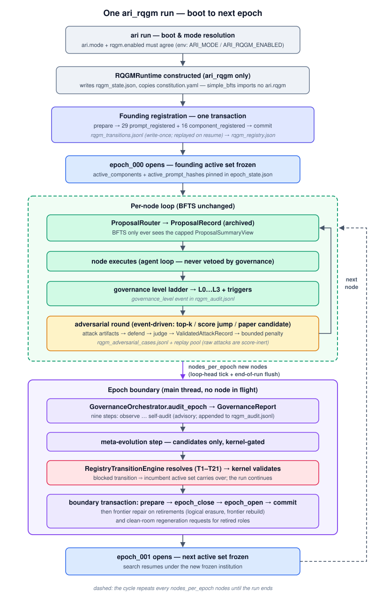

---
sources:
  - path: ari-core/ari/rqgm
    role: implementation
  - path: ari-core/ari/rqgm/runtime.py
    role: implementation
  - path: ari-core/ari/rqgm/prompt_spec.py
    role: implementation
  - path: ari-core/ari/rqgm/prompt_evolution.py
    role: implementation
  - path: ari-core/ari/rqgm/transition_rules.py
    role: implementation
  - path: ari-core/ari/rqgm/utility_evolution.py
    role: implementation
  - path: ari-core/ari/rqgm/paper_runtime.py
    role: implementation
  - path: ari-core/ari/rqgm/paper_anchor.py
    role: implementation
  - path: ari-core/ari/rqgm/paper_self_preference.py
    role: implementation
  - path: ari-core/ari/cli/bfts_loop.py
    role: implementation
  - path: ari-core/ari/configs/defaults.yaml
    role: config
  - path: ari-core/tests/test_rqgm_kernel.py
    role: test
last_verified: 2026-07-28
---

# RQGM ランタイムウォークスルー

[RQGM アーキテクチャ](rqgm_architecture.md)は Constitutional ARI-RQGM が
*なぜ*存在し、どの不変条件を保持するのかを説明します。このページは、この
マシンが**動いているところ**を見せます: 1 回の `ari_rqgm` ランを端から端
までトレースします — 起動時に何が起こるのか、ノードごとに何が起こるのか、
各エポック境界で何が起こるのか、そしてどのバイトがどのチェックポイント
ファイルに着地するのか。以下のイベントログ抜粋はすべて実際のランから
取られています（行は切り詰め、ラン固有の値は `…` で省略しています）。



同じフローを圧縮すると:

```text
boot ──▶ mode resolution ──▶ RQGMRuntime ──▶ founding registration ──▶ epoch_000 open
                                              (1 txn: 32 prompts,        (active set
                                               20 components)             frozen)
                                                                             │
        ┌────────────────────────────────────────────────────────────────────┘
        ▼
  ┌─ per node ────────────────────────────────────────────────┐
  │ proposal → summary-only view → node executes →            │◀─┐
  │ governance level → (maybe) adversarial round              │──┘ next node
  └───────────────┬───────────────────────────────────────────┘
                  │ every nodes_per_epoch new nodes (loop-head tick + end-of-run flush)
                  ▼
  ┌─ epoch boundary ──────────────────────────────────────────┐
  │ audit_epoch → GovernanceReport → resolve (T1–T21) →       │
  │ kernel validate → prepare/close/open/commit →             │
  │ frontier repair → clean room                              │
  └───────────────┬───────────────────────────────────────────┘
                  ▼
            epoch_001 open (repeat)
```

---

## ステップバイステップ: 1 回のラン

### 1. 起動 — モード解決

`ari run` は他の何よりも先に、実効モードを一度だけ解決します:
`ari.mode: ari_rqgm` と `rqgm.enabled: true` の両方が一致していなければ
ならず（`ari.rqgm.mode.resolve_effective_mode`）、`ARI_MODE` /
`ARI_RQGM_ENABLED` の env オーバーライドが最後に適用されます。不一致が
あれば警告とともに `simple_bfts` へ縮退します。デフォルトの `simple_bfts`
の下では、**`ari.rqgm` モジュールは一切インポートされません** — 以下の
すべては `ari_rqgm` でのみ起こります。詳細と切替タイミングポリシー:
[実行モード](../guides/execution_modes.md)。

続いて `build_runtime` が単一の `RQGMRuntime`（`ari/rqgm/runtime.py`）を
構築し、BFTS 戦略を純粋委譲の `GovernedSearchStrategy` で包み、
`rqgm_state.json`（モード来歴: `mode_source` ∈ `config|env|resume`）を
書き込み、人間可読の `constitution.yaml` をチェックポイントへコピーします。
ランループはダックタイプの読み取り 1 回 — `getattr(bfts, "rqgm", None)` —
で RQGM を発見します。

### 2. 設立登録 — 1 つのトランザクションに制度全体

最初の `ensure_epoch` tick（ループ開始時、メインスレッド）で、新規の RQGM
チェックポイントは**設立登録**（`RQGMRuntime._register_founding`）を実行
します: `ari/rqgm/prompt_spec.py` の凍結された設立テーブルにあるすべての
プロンプトとコンポーネントが、`rqgm_transitions.jsonl` 上の単一の
prepare → … → commit トランザクションを通じて登録されます — 1 つの
`epoch_transaction_prepare` と 1 つの `epoch_transaction_commit`
（`transition_id: transition_founding`）の間に
**32 個の `prompt_registered` + 20 個の `component_registered` イベント**
です:

```jsonc
{"event_id": "evt_000000", "event_type": "epoch_transaction_prepare",
 "payload": {"transition_id": "transition_founding"}, "prev_event_hash": ""}
{"event_id": "evt_000001", "event_type": "prompt_registered",
 "payload": {"prompt_id": "agent_system_prompt_v1", "role": "generator",
             "status": "active", "prompt_hash": "a50abe13d568",
             "source": {"kind": "committed_template", "key": "agent/system"}, …}}
// … 31 more prompt_registered, then 20 component_registered …
{"event_id": "evt_000053", "event_type": "epoch_transaction_commit",
 "payload": {"transition_id": "transition_founding"}}
```

設立コンポーネント 20 個の内訳は、`generator_v1` と、7 種の探索 adversary タイプ（それぞれ
`adversary_{type}_v1`、攻撃ファミリごとに 1 つ: コスト爆発、証拠ギャップ、
メトリクスゲーミング、過大主張、先行研究、プロンプトインジェクション、
再現性）、`defender_v1`、`artifact_judge_v1`、`proposal_router_v1`、
`prompt_mutator_v1`、`clean_room_generator_v1`、`policy_mutator_v1`、
`utility_policy_v1`、ライブなメタアクター `replay_selector_v1` と
`failure_summary_compressor_v1`、レジストリから名指し可能な司法
`auditor_v1`、`evidence_clerk_v1`、`governance_judge_v1` です。
32 個のプロンプトはプロンプトを使うこれらのロール、提案生成器、BFTS
オーケストレーションをカバーします。決定論的な Evidence Clerk は
プロンプトを持ちません。paper archive は gated な 3 組を加え、
合計 35／23 件になります。
ログをリプレイすると `rqgm_registry.json` がバイト単位で同一に再構築され
ます; 登録は **write-once** です — ログにエポックまたはコミット済み登録を
見つけた resume は決して再登録せず、クラッシュした設立トランザクション
（commit のない prepare）はリプレイからは見えず、安全に再実行されます。

### 3. `epoch_000` のオープン — 制度の凍結

設立コミットの直後に `epoch_000` が開き、設立アクティブ集合が
`epoch_state.json` に凍結されます: `active_components`（ロールごとに
1 つのロールアップ勝者）と `active_prompt_hashes`（ロールごとに 1 つの
12 桁 hex ハッシュ）、加えて utility policy が、タイムスタンプを除外した
政策を表す `policy_fingerprint`、宣言済み実行基盤を表す
`execution_fingerprint`、両者を合成した `epoch_fingerprint` の下に
固定します。提供者や環境の版が不明なら `unresolved` と記録します。この集合の
中身は次の境界まで一切変更できません。

```jsonc
{"event_id": "evt_000054", "event_type": "epoch_open",
 "payload": {"epoch_state": {"epoch_id": "epoch_000", "epoch_seq": 0,
   "node_count_at_open": 1,
   "active_components": {"adversary": "adversary_reproducibility_v1",
                         "judge": "artifact_judge_v1", "defender": "defender_v1", …},
   "active_prompt_hashes": {"generator": "af0aba2d5805", "router": "38b1ea409ff5", …}}}}
```

### 4. ノードごと — 提案、実行、ガバナンスレベル

すべてのノードについて、変更されていない BFTS ライフサイクルの周囲で
ベストエフォートのフックが 3 つ走ります:

1. **提案ルーティング。** `ProposalRouter` は各ルートアイデア / 展開方向を
   完全な `ProposalRecord` として `proposals/proposal_records.jsonl` に
   記録します（「すべて保存」）。BFTS 自身が受け取るのは常に上限付きの
   **`ProposalSummaryView`**（タイトル、短い説明、仮説、計画、成功
   メトリクス、リスク、期待される成果物、異論サマリ、スコア）だけです —
   提案の全文を探索コンテキストの外に保つ、サマリ限定チャネルです。
2. **ノード実行。** エージェントループは `simple_bfts` とまったく同じ
   ように走ります。ガバナンスがノード実行を拒否することは決してありません
   — すべてのフックは fail-open です。
3. **ガバナンスレベル。** 評価の後、予算のはしごが決定論的トリガ
   （`top_k`、`score_jump`、`paper_candidate`、`novelty_claim`、
   `low_confidence`）からノードにレベル L0（固定チェックのみ）… L3
   （完全裁定）を割り当て、監査ログに記録します:

```jsonc
{"event_type": "governance_level",
 "payload": {"epoch_id": "epoch_000", "node_id": "node_a37b4c06",
             "level": 3, "triggers": ["top_k"]},
 "event_hash": "ae8eeb7521f1", "prev_event_hash": "23567870882b"}
```

`event_hash` / `prev_event_hash` のペアに注目してください —
`rqgm_audit.jsonl` のすべての行はハッシュ連鎖しており、resume が連鎖を
再検証します。

### 5. ノードごと — 敵対ラウンド（イベント駆動）

敵対ラウンドはトリガの論理和が発火したときにのみ走ります（ノードが
フロンティアの top-K に入った、親に対するスコアジャンプがしきい値を
超えた、paper candidate、novelty claim、タイプ別の安価な事前シグナル、
または決定論的なハッシュベースサンプル）。発火すると:

1. トリガされた adversary タイプがノードの**成果物**を攻撃し（攻撃
   スキーマにコンポーネントフィールドはありません）→ `raw_attack`
   レコードになります。生の攻撃は**スコアに不活性**です: この時点では
   何も変わりません。
2. defender が応答します → `defender_response`。
3. `ArtifactJudge` が裁定します → `judgment_record`。ジャッジに検証された
   攻撃だけが `validated_attack` となり、有界の utility ペナルティを適用
   します（エポック凍結の重みとキャップ; ペナルティ前スコアは追加的な
   メトリクスキーに保存されます）。ジャッジの失敗は `invalid` に
   フォールバックします — ペナルティなし。
4. 検証済み攻撃は `AdversarialReplayPool`（スナップショットは境界でのみ
   更新）に供給され、後にプロンプト候補の回帰テストに使われます。

すべては `rqgm_adversarial_cases.jsonl` にジャーナルされます。冪等性の
ための**ラウンドマーカー**（`rqgm_adversarial_round`、キーは
`node_id` + `epoch_id`）も含まれるため、resume されたランが同じノードを
再攻撃することはありません。

### 6. エポック境界 — 監査、遷移、修復

v1 の境界トリガはノード数（`rqgm.epoch.nodes_per_epoch`、デフォルト 10）
で、外側ループの先頭で `ensure_epoch` がチェックします — メインスレッド
上で、実行中のノードが無い状態です。同じ tick は**ラン終了時にもう一度**
実行されるため、最終ループイテレーションで満たされたトリガも発火します
（トリガ未達の末尾エポックは open のままです）。境界の窓の中では:


1. **監査。** `GovernanceOrchestrator.audit_epoch` が 9 ステップの
   パイプラインを実行します: 観察の収集 → 信頼性評価 → 証拠収集
   （**EvidenceClerk** が唯一の証拠収集者です; 不許容な同一ロール素材は
   ここで落とされます）→ 訴追判断（`ImpeachmentMotion` を提出できるのは
   **Auditor** だけで、一期ごとの動議枠を一単位使います。旧会計名は
   残りますが価値は移転しません）→ 弁護の生成 → 裁定パネル
   （動議 + プロンプト候補評価）→
   リプレイプール更新 → **ガバナンス自己監査**（パイプラインが自身の
   4 アクター: auditor、evidence clerk、defender、governance judge を
   監査します）→ `GovernanceReport`。レポートは助言的です —
   オーケストレータがレジストリを書くことは決してありません。実際の
   最初の境界のレポート: `record_id: govreport_epoch_000`、
   `self_audit.checked_components: ["auditor_v1", "defender_v1",
   "evidence_clerk_v1", "governance_judge_v1"]`、
   `bond_accounting: {posted: 0, …}`。4 者ともレジストリから名指しでき、
   制裁可能です。Governance Judge 自身が motion の対象なら、自分の事件を
   裁定せず忌避します。
2. **メタステップ。** メタティアは読み取り専用サンドボックスで prompt
   mutator、policy mutator、replay selector、failure-summary compressor、
   および pending clean-room generation を実行します。すべての出力は
   `candidate` または監査専用 recommendation であり、即時有効化では
   ありません。候補生成は
   失敗を契機とするものではありません: **すべての**境界で — 平穏な
   エポックも含めて — `PromptMutator` がアクティブな現職を持つ
   進化可能なロールごとに 1 候補を提案します。これは
   `rqgm.prompt_evolution` の上限と候補ごとの予算ゲートの範囲内で
   行われ、LLM が利用できない（または予算縮退の）場合は決定論的な
   LLM 不要種別（`threshold_tuning`、`schema_tightening`）に
   フォールバックし、中断された境界の再実行が候補を重複させることは
   ありません（決定論的な candidate id が dedup キーです）。この
   ステップは常に監査可視です: 有効な境界は `meta_evolution` サマリ行
   （outcome `proposed`/`no_op`、件数、未登録 invoker を含むスキップ
   理由）を残し、`rqgm.prompt_evolution.enabled: false` は生成の
   代わりに `prompt_evolution_skipped` を発行します。
3. **遷移。** レジストリステータスの唯一の書き込み手である
   `RegistryTransitionEngine` が、レポートの勧告と候補評価から採用・
   制裁・退役を、固定の T1–T21 テーブル（T1–T19 のベースに、ロール限定の
   supersession 行 T20/T21 を加えたもの）だけに対して純粋に解決します。
   `ConstitutionalKernel` が解決済み遷移を検証します: 不正なエッジは
   ブロックされ（`CK-REG-001` テーブル違反、`CK-REG-002` 境界限定
   エッジのエポック途中でのスタンプ）、エンジン以外のレジストリ書き込み
   手はブロックされます（`CK-ROL-901` — ジャッジは決してレジストリを書け
   ません）。`emergency_quarantine`（T16）は現期を強制終了し、隔離と
   新しい指紋値を持つ次期の開始を同じ境界取引で確定します。
   ブロックされた遷移では、現職の稼働集合を引き継ぎます。候補生成を
   続けて安全なのは外部副作用のない隔離環境に限り、不可逆な外部操作には
   別の固定された閉鎖側ゲートが必要です。
4. **コミット。** 境界は `rqgm_transitions.jsonl` 上の 4 イベント
   トランザクションとして着地します:

```jsonc
{"event_type": "epoch_transaction_prepare", "payload": {"transition_id": "transition_000_to_001"}}
{"event_type": "epoch_close",  "payload": {"epoch_id": "epoch_000",
                                           "transition_id": "transition_000_to_001", "node_count_at_close": 2}}
{"event_type": "epoch_open",   "payload": {"transition_id": "transition_000_to_001",
                                           "epoch_state": {"epoch_id": "epoch_001", "previous_epoch_id": "epoch_000", …}}}
{"event_type": "epoch_transaction_commit", "payload": {"transition_id": "transition_000_to_001"}}
```

   コミットされた `epoch_transition` レコード（inputs にガバナンス
   レポートの SHA-256 を含む）が同時に `rqgm_audit.jsonl` へ追記され
   ます。同じ `transition_id` の二重コミットはガードされた no-op です;
   中断されたトランザクションは resume 時に破棄され、決定論的に再実行
   されます。
5. **フロンティア修復**（コミットされた遷移が何かを退役させたときのみ）。
   `FrontierRepairEngine` が退役した各 `prompt_hash` から依存閉包を
   トレースし、依存レコードを stale にマークし（`_stale`、
   `_valid_for_frontier` センチネルが `tree.json` を通じて永続化され
   ます）、フロンティアを再構築します。消去は**論理のみ** — 物理的には
   何も削除されません — かつロール固有です。スコア済み証拠が stale に
   なった utility は元のエポックの凍結重みで生存入力から再計算します。
   utility policy 自体が退役した場合は、保存済みで policy-independent な
   `_axis_scores` から新基準で再スコアし、raw axis が使えないノードは
   fail-closed で無効化します。
6. **クリーンルーム。** 退役ロールに対する保留中の再生成要求が窓の中で
   実行されます; 許容可能な出力は候補として次のサイクルに入ります。
   その後、次のエポックのアクティブ集合が凍結され、探索が再開します。

### 7. プロンプト進化 — 候補は這い上がり、RTE が採用する

アブレーション段 B7 以上では、`PromptMutator` は**候補のみ**を発行します
— レジストリを書くことは決してできません。すべての候補は、採用資格を
得る前にまず 6 段階の検証ライフサイクルを這い上がります:


`static_validation` → `constitutional_validation`（どちらも決定論的かつ
無料）→ `schema_dry_run`（注入された LLM 呼び出し 1 回; **失敗は終了**）
→ `replay_evaluation`（ステップ 5 で蓄積された `AdversarialReplayPool`
に対して）→ `anchor_evaluation`（固定アンカー集合; 同点は現職有利）→
`shadow`（サンプリングされた並走、観察のみ）。段階のスキップは憲法違反
です。採用は境界における RTE を通じて**のみ**起こり
（`shadow → probationary_active`、規則 T6）、境界ごと・ロールごとに
1 採用で、`candidate → active` のショートカットは存在しません。

プロンプトが退役すると、その置換は**クリーンルーム生成**されます: 固定
ティアが閉じた、カーネルでスクリーニングされた入力バンドル — コミット
済みカタログ + 抽象化された失敗サマリ — を組み立て、退役プロンプトの
テキスト自体は禁止された入力です（汚染規則 `CK-CLN-001/002`。
word-shingle スクリーンと `RetiredPromptAccessGuard` によって強制され
ます）。メタティアは提案できても、任命は決してできません
（deny-by-default の capability フラグ、部分集合演算としてチェックされる
権限非拡大）。

監査ログにおける検出の様子（スクリプト化された不正コンポーネントを
仕込む B8 injection smoke ハーネスより）:

```jsonc
{"event_type": "validated_attack", "payload": {"case_type": "overclaim",
   "attack_summary": "scripted always_attack double: unconditional attack", …}}
{"event_type": "constitutional_violation", "payload": {"check": "validate_record_schema",
   "injection_id": "eval_inj_006_bad_generator", "codes": ["CK-SCH-N01"]}}
{"event_type": "prompt_candidate_rejected", "payload": {"candidate_id": "eval_cand_degenerate",
   "stage": "schema_dry_run", "failure_count": 4}}
```

仕込まれた always-validate ジャッジは信頼性評価がフラグする validated
attack を生み、不正な generator の替え玉はスキーマチェックに引っかかり、
退化した mutator 候補は `schema_dry_run` で死にます — いずれも 1 つの
ノードも中断させることなく。

### 8. ラン終了

ラン終了時の `ensure_epoch` フラッシュ（ステップ 6）は、ノード数トリガが
満たされていれば最後の境界を発火させます; そうでなければ末尾のエポックは
単に `open` のままで、クラッシュリカバリのセマンティクスと一致します —
`ari resume` はイベントログをリプレイし、監査ログのハッシュ連鎖を再検証
して継続します（ブロッキングな完全性検出は governance-suspended
carry-over へ縮退し、resume の拒否には決してなりません）。

続く論文フェーズは **paper-candidate プリフライト**を走らせます: 永続化された
utility ペナルティをロード済みノードへリプレイし、ベストノードを 1 回の L3
paper-candidate 敵対ラウンドでエスカレーションし、勝者が安定するまで選択を
繰り返します — 他ノードの降格によって新たに勝者となったノードも、自分の
ラウンドを必ず受けます。3 つの入口（`ari run` / `ari resume` / `ari paper`）は
いずれも共有の論文ディスパッチ経由でここに到達します。このラウンドは論文自身の
アーティファクトを攻撃するため、その存在を条件にゲートされます: まだ論文を
生成していないチェックポイントでは、パイプラインがそれらを書き出すまで実行を
延期します。一度きりのマーカーを空のバンドルに費やすと、そのノードの
アーティファクト接地ラウンドが恒久的に抑止されてしまうからです。

---

## 境界での utility 書き換え（Task 14）

上記の境界は*プロンプト*を採用します。それは**スコアそのもの**も
書き換えられます。各エポックの凍結された `utility_policy_hash` は採用済み
ポリシーのシールです（`capture_utility_policy` がアクティブな
`utility_policy` エントリを読み、エポック 0 では解決済みの `cfg` に
フォールバックします）。`policy_mutator` 候補がライフサイクルを這い上がり
採用されると、ハッシュは**境界をまたいで変化**します — 実際のマルチ
エポックランでは、例えば `fed4460f44f6 → 8a9da4fb9dc3 → 8ea0dac3cd1b` と
歩き、`epoch_fingerprint` も一緒に動きます。

behavioral ロールと異なり、utility policy は基準なので、**supersession**
（エッジ T20）で採用されます: 後継の同一境界 T6 採用が `active → retired`
ステータス変更を発行し、*健全な*現職を**旧**ハッシュとともに退役させます。
`frontier_repair` はその後、旧ハッシュを退役した依存として扱い、
`_utility_policy_hash: <旧>` とスタンプされたすべてのノードを、保存済み
`_axis_scores` から新しく凍結された composite／weights で再スコアします。
raw axis が使えないノードだけを `utility_invalidated` にし、古い基準の
スコアを残しません。この継ぎ目を明らかにした実ランの境界では、5 ノードを
再スコアし、無効化は 0 件でした:

```jsonc
{"event_type": "component_status_change", "payload": {"role": "utility_policy",
   "component_id": "utility_policy_v1", "from_status": "active",
   "to_status": "retired", "rule_id": "T20", …}}
{"event_type": "selective_erasure", "payload":
   {"retired_prompt_hashes": ["fed4460f44f6"],
    "policy_rescored_node_ids": ["node_…"], "invalidated_node_ids": [], …}}
```

**正直な限界。** デフォルト設定（`axis_mode: dynamic`、空の静的
`axis_weights`）では固定の軸ごとの基底が無いため、T3 の「少なくとも同等に
スコアする」ゲートには順序付けるものが無く、supersession は合法性と
非退化性に還元されます — 基準は証明可能に改善するのではなく合法な
シンプレックスの中を転がります。これは正直な Red-Queen の姿勢であり
（グラウンドトゥルースが無ければ、厳密に良い相手が無い）、まさに paper
フェーズのアンカーが reviewer 基準について閉じるギャップです。

---

## paper-archive ラン（paper.mode: rqgm_archive）

paper フェーズは**独立した直交する**モードです: `paper.mode:
rqgm_archive` + `rqgm.paper.enabled: true`
（[paper-archive レイヤ](rqgm_architecture.md#paper-archive-レイヤ)を参照）。
1 つの `PaperArchiveRuntime` エポックは 1 アーカイブラウンドです; 共進化
ランは `rqgm.paper.epoch.rounds` 回それを行います。

1. **シード → refine 木。** `run_archive` はドラフト空間上に best-first 木を
   構築します: `paper_root` が K = `archive.width` のシードドラフト（各々
   `write_paper_iterative` スキル呼び出し）に分岐し、各ドラフトが
   `archive.depth` まで最大 `archive.refine_rounds` の `paper_refine`
   **子**ノードに分岐します。`select_best_to_expand` は統治された
   `paper_reviewer` composite に本物の `diversity_bonus` を加えて
   フロンティアをランク付けします; 集団はどの深さでも
   `min(width·(1+refine_rounds), max_expansions)` に上限されます。すべての
   ドラフトは `paper_draft_archive.jsonl` にジャーナルされます。
2. **アンカー → 敵対者 → 弾劾。** 各ラウンド先頭で、アクティブな
   `paper_reviewer` が保留アンカーコーパスでスコアされます。過剰受理する
   reviewer（グラウンドトゥルースが `reject` のドラフトを受理する）は
   信頼性フロア以下かつアンカーボード低であり — **かつ**アンカーの
   過剰受理シグナルが本物の `paper_self_preference` ラウンド
   （adversary → Defender → ArtifactJudge）を駆動します。その
   `ValidatedAttackRecord` は `target_component_id: paper_reviewer_v1`
   （Task 15 のバインディング）を持つため、
   `validated_attack_involvement → classify_target` が reviewer に対する
   `ImpeachmentMotion` を開きます — ロール開放へのサンクション経路です。

   ```jsonc
   {"event_type": "validated_attack", "payload": {"case_type": "paper_self_preference",
      "target_component_id": "paper_reviewer_v1", …}}
   ```

   **writer** は同じラウンドで、自身のアンカーを通じて制裁されます。
   アクティブ writer の最良ドラフトが Layer-0 の claim-evidence ゲート
   （`run_hard_gate(write=False)` — 読み取り専用・決定論的）でスコアされ、
   そのスコアが writer の `prompt_hash` *のみ*をキーにアンカーボードへ
   landed され、過剰受理ドラフトが**さらに**不忠実であれば 2 件目の
   レコードがバインドされます:

   ```jsonc
   {"event_type": "validated_attack", "payload": {"case_type": "paper_self_preference",
      "target_component_id": "paper_writer_v1", "affected_components": ["paper_writer"], …}}
   ```

   ハッシュキーであることが重要です: 1 つのコンポーネント id は連続する
   プロンプトバージョンを跨ぐので、コンポーネントキーのスコアは現職の忠実性を
   後継へ漏らし、新しい writer を即座に弾劾可能にしてしまいます。
3. **採用（共進化の証人）。** ロールが開かれると、共進化した後継
   プロンプトが `validated → shadow → probationary_active` を登り採用され
   えます; T21 がその後、格下げされた現職を復帰可能な `shadow` スタンバイへ
   移します。証人は各ラウンド先頭で観察されるアクティブな `prompt_hash`
   です。実際の 8 ラウンド証明では reviewer が `04b3c49d070d →
   c0dfd764abab`、writer が `f38a15f0f140 → b2c36f9a8232` と動きます
   （4 ラウンド平坦、その後採用）。アンカーを取り除くと攻撃も採用も無く、
   シーケンスは平坦なままです — **忠実な**ドラフトでは、同じドライバが
   writer 攻撃 0 件・writer 動議 0 件・writer ハッシュ不変を生む一方、
   reviewer は依然として攻撃され弾劾されます。writer の後継は優れているから
   採用されるのではなく、現職が退行したから採用されるのです。
4. **最良ドラフト → 無変更の claim ゲート。** ラウンドの後、
   `materialize_winner` が最良ドラフトの `.tex` を `{ckpt}/full_paper.tex`
   へ**一度だけ**コピーします（純粋な select-and-copy、gate/kernel/LLM
   呼び出しなし）。**既存**のコンパイル + `claim_evidence_hard_gate_final`
   + finalize テール（Layer 0、無変更）が、linear ランと同じくバイト単位で
   それに走ります — `write_paper` の `skip_if_exists` が拾います。

**正直な限界。** 両方のプロンプトが共進化しますが、writer は**退行**した
ときだけです: writer の後継は、現職が claim-gate 忠実性の退行で制裁される
まで `shadow` で待ちます — 単に優れているだけの挑戦者が忠実な現職を
置き換えることは決してありません。writer の*ドラフト*勝者は依然として
エポックローカルです（エポック内で凍結された reviewer が順位付け）。
writer をターゲットとする攻撃は `paper_self_preference` ラウンドに相乗り
しており、そのラウンドは**過剰受理**のアンカーケースがあるときにのみ発火
するので、何も過剰受理しない reviewer の下にいる不忠実な writer は今日は
制裁されません。デフォルトの `rqgm.paper.epoch.rounds: 2` では境界と弾劾は
発火しますが、約 5 境界の climb は採用を*完了*しません（証明は 8 を回します）。
アンカーがデフォルトの `false` の場合、`rqgm_archive` はコーパスが供給される
まで レビュー済み best-of-N です — そして writer の忠実性ケースは同じプールへ
landed されるので、プールが無ければ writer への制裁もありません。そして
self-preference ラウンドは現在、実際の過剰受理アーカイブドラフトではなく
*合成*のアカウンタビリティノードを格下げします（その in-phase 格下げは
先送り） — 発火するのはアカウンタビリティ / 共進化チャネルです。

---

## ディスク上に見えるもの

たった 2 ノードの `ari_rqgm` ランの後でも、チェックポイントには以下が
含まれます（RQGM ファイルのみ; 書き込み手つきの完全な一覧は
[RQGM アーキテクチャ](rqgm_architecture.md#records-on-the-checkpoint)、
正確なオンディスク形式は
[ファイルフォーマットリファレンス](../reference/file_formats.md)に
あります）:

```text
{checkpoint}/
├── rqgm_state.json               # mode provenance (written at boot, before node 1)
├── constitution.yaml             # human-readable copy; hash pinned in meta.json
├── rqgm_transitions.jsonl        # event-log truth: founding + boundary transactions
├── epoch_state.json              # frozen open-epoch snapshot (fingerprint excludes timestamps)
├── rqgm_registry.json            # registry snapshot replayed from the transitions log
├── rqgm_audit.jsonl              # hash-chained audit log (all facades append here)
├── rqgm_adversarial_cases.jsonl  # raw/defense/judgment/validated records + round markers
├── rqgm/adversarial_replay_pool.json
├── proposals/                    # proposal_records.jsonl + proposal_index.json
├── rqgm_prompts/                 # write-once evolved prompt bodies (B7+; hash-verified)
└── prompt_trace.jsonl            # every rendered prompt, stamped with prompt_version
```

`meta.json` はさらに `constitution_hash`（現在 `2edf93776904`）を記録
します — すべてのカーネル規則テーブルにわたるピンです。憲法改正は意図的な
手作業の再ピン留めです: 規則テーブルの編集は、期待ハッシュが日付つき
コメントとともに再ピン留めされるまで `tests/test_rqgm_kernel.py` を失敗
させます。直近の連鎖は改正を歩きます:
`… → 951a294dc3c4`（T20、`utility_policy` supersession エッジと
`CK-UTL-*` 規則）`→ 564a204dc694`（paper 設立ロール）`→ 6643c12a510e`
（T21、paper ロールの shadow-standby エッジ）`→ 2edf93776904`（#78b、
`governance_judge` を役割語彙に追加し、弾劾裁定者自身を統治対象・制裁可能な
アクターにする）。

## ランの観察方法

`tail -f` する価値のある 2 つのファイルは `rqgm_audit.jsonl`（ガバナンスが
何を決定しているか）と `rqgm_transitions.jsonl`（制度がいつ変わるか）です:

```bash
tail -f {checkpoint}/rqgm_audit.jsonl | python3 -c \
  'import json,sys; [print(json.loads(l)["event_type"], json.loads(l)["payload"].get("node_id","")) for l in sys.stdin]'
```

`rqgm_transitions.jsonl` は**閉じた**イベント語彙（`ari/rqgm/events.py`）
を使います; `rqgm_audit.jsonl` は開いていますが、実際に目にするタイプは
以下です:

| ファイル | `event_type` | 意味 | 発行元 |
|---|---|---|---|
| transitions | `epoch_transaction_prepare` / `epoch_transaction_commit` | トランザクションの括り; その間にあるものはリプレイ上アトミック | `RqgmStateStore`（設立: `RQGMRuntime`; 境界: `RegistryTransitionEngine`） |
| transitions | `prompt_registered` / `component_registered` | 設立登録のペイロード | `RQGMRuntime._register_founding` |
| transitions | `prompt_status_change` / `component_status_change` | 解決された T1–T21 エッジ（採用、制裁、退役） | `RegistryTransitionEngine` |
| transitions | `epoch_close` / `epoch_open` | 境界: 旧エポックが閉じ、新しい凍結エポックが開く | `RegistryTransitionEngine` / `RqgmStateStore` |
| transitions | `emergency_quarantine` | 強制された緊急境界内の T16 隔離 | `RegistryTransitionEngine` |
| audit | `governance_level` | ノードごとのはしごレベル（L0–L3）+ トリガ | `GovernanceBudgetManager` |
| audit | `budget_consumed` | あるガバナンス決定ポイントが予算を消費した | `GovernanceBudgetManager` |
| audit | `raw_attack` / `defender_response` / `judgment_record` / `validated_attack` / `utility_record` | 1 回の敵対ラウンド、レコードごと | 敵対ループ |
| audit | `governance_report`（+ レコード単位の motion/defense/adjudication 行） | エポック監査とその結果 | `GovernanceOrchestrator` |
| audit | `epoch_transition` | コミットされた遷移。`inputs` にレポートハッシュを含む | `RegistryTransitionEngine` |
| audit | `kernel_report` / `constitutional_violation` | warn-and-flag の検出 / 規則違反（`CK-*` コード） | `ConstitutionalKernel` アダプタ |
| audit | `selective_erasure` / `frontier_rebuild` | 退役後の論理消去 + 再構築 | `FrontierRepairEngine` |
| audit | `prompt_candidate_rejected` | 候補がライフサイクル段階で失敗した | プロンプト進化パイプライン |
| audit | `prompt_evolution_skipped` | 境界の候補生成が無効（`rqgm.prompt_evolution.enabled: false`） | `RQGMRuntime` の境界プロンプト進化 |
| audit | `clean_room_violation` | 汚染されたクリーンルームバンドルがブロックされた | `CleanRoomCoordinator` |
| audit | `meta_evolution` | 境界メタステップのサマリ: outcome `proposed`/`no_op`（またはスキップ/失敗理由）、件数、スキップされた invoker | `MetaEvolutionCoordinator`（スキップ/失敗行: `RQGMRuntime`） |
| audit | `meta_evolution_skipped` / メタ出力行 | 無効パスのスキップ / 出力ごとのレコード | `MetaEvolutionCoordinator` |

任意のチェックポイントに対する 3 つの簡単なヘルスチェック:

- `python3 -c "import json;print(json.load(open('rqgm_registry.json'))['registry_version'])"` —
  レジストリスナップショットが存在し、クリーンにリプレイされた。
- `grep -c epoch_open rqgm_transitions.jsonl` — いくつのエポックが
  開いたか。
- `rqgm_audit.jsonl` の最終行の `prev_event_hash` がひとつ前の行の
  `event_hash` と等しい — 連鎖は無傷です（resume は連鎖全体を自動的に
  検証します）。

---

## 関連

[RQGM アーキテクチャ](rqgm_architecture.md) ·
[実行モード](../guides/execution_modes.md) ·
[RQGM 評価とアブレーション](../guides/rqgm_evaluation.md) ·
[RQGM スキーマリファレンス](../reference/rqgm_schemas.md) ·
[ファイルフォーマットリファレンス](../reference/file_formats.md) ·
[BFTS アルゴリズム](bfts.md)
