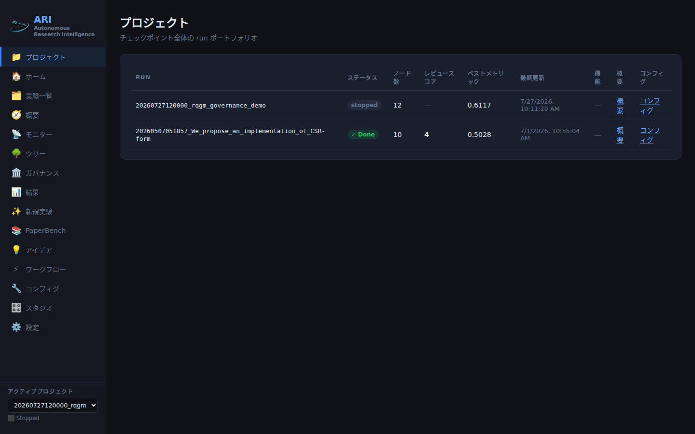
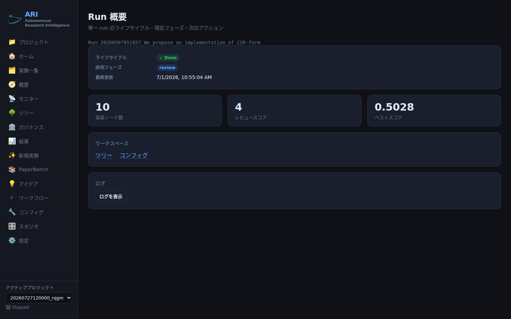
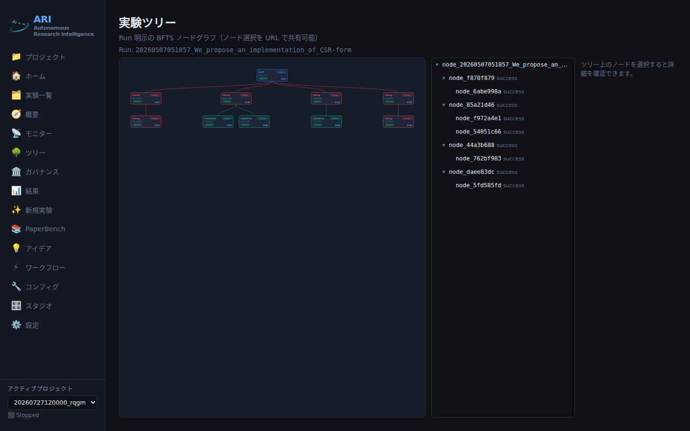
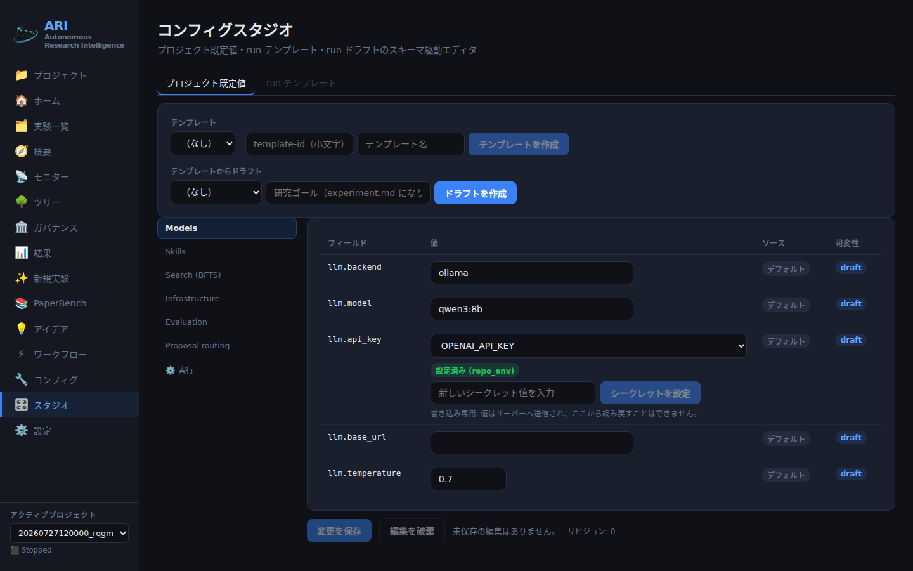

---
sources:
  - path: ari-core/ari/cli/commands.py
    role: implementation
  - path: ari-core/ari/viz/server.py
    role: implementation
  - path: ari-core/ari/viz/checkpoint_finder.py
    role: implementation
  - path: ari-core/ari/viz/checkpoint_lifecycle.py
    role: implementation
  - path: ari-core/ari/viz/api_capabilities.py
    role: implementation
  - path: ari-core/ari/viz/frontend/src/App.tsx
    role: implementation
  - path: ari-core/ari/viz/frontend/src/app/routeRegistry.ts
    role: implementation
  - path: ari-core/ari/viz/frontend/src/components/Layout/Sidebar.tsx
    role: implementation
  - path: ari-core/ari/viz/frontend/src/components/Overview/OverviewPage.tsx
    role: implementation
  - path: ari-core/ari/viz/frontend/src/components/Overview/LogsPanel.tsx
    role: implementation
  - path: ari-core/ari/viz/frontend/src/components/TreeV2/TreeV2Page.tsx
    role: implementation
  - path: ari-core/ari/viz/frontend/src/components/TreeV2/TreeTablePanel.tsx
    role: implementation
  - path: ari-core/ari/viz/frontend/src/shared/realtime/eventStream.ts
    role: implementation
  - path: ari-core/ari/viz/frontend/src/hooks/useRunEvents.ts
    role: implementation
  - path: ari-core/ari/viz/v1/logs.py
    role: implementation
  - path: ari-core/ari/viz/v1/router.py
    role: implementation
  - path: ari-core/ari/viz/frontend/src/__tests__/routeNavParity.test.tsx
    role: test
  - path: ari-core/tests/test_launch_config.py
    role: test
  - path: ari-core/ari/viz/frontend/scripts/capture_screenshots.mjs
    role: doc
  - path: scripts/setup/setup_env.sh
    role: config
last_verified: 2026-08-07
---

# ダッシュボードガイド

現在同梱されている ARI ダッシュボードのウォークスルーです: サーバーの起動方法、
各ワークスペースが答えること、今見ているものへのリンクを共有する方法、そして
鮮度バナーの意味。

ダッシュボードは 2 つのシェルを並走させます。**v2 ワークスペース**（Projects、
Overview、Tree、Ideas、Results、Governance、Config、Studio）は 1 つのサーバー
capability フラグでゲートされ、**レガシー画面**はどちらのモードでも元の URL に
登録され到達可能なままです。何も削除されていません。

## サーバーを起動する

エントリポイントは 2 つ、サーバーは同一です:

```bash
# 1. CLI — a checkpoint directory is a REQUIRED argument
ari viz path/to/checkpoints/20260727120000_my_run --port 8765

# 2. Module — checkpoint optional; pick one in the GUI afterwards
python -m ari.viz.server --port 8765
```

`start.sh` は形式 2（`ARI_GUI_PORT`、既定 `8765`）を使うので、ランを選ぶ前に
ダッシュボードが立ち上がります。起動時の出力:

```text
  ⚗️  ARI Viz running at http://localhost:8765/
  📁  Checkpoint: /…/checkpoints/20260727120000_my_run
  🔌  WebSocket:  ws://localhost:8766/ws
  Ctrl+C to stop
```

WebSocket は常に **HTTP ポート + 1** で待ち受けます。そのポートに到達できない
場合（1 ポートしか転送しないトンネル、リマップしないプロキシなど）、ツリーの
ストリームはポーリングへ縮退します — ダッシュボードは動き続けます。

既定では両サーバーとも**ループバックのみ**（`127.0.0.1`、利用可能なら `::1`）に
バインドします。`localhost` を超える公開は明示的なオプトインです —
[リモートアクセス](remote_access.md)を参照してください。

React バンドルは `ari-core/ari/viz/static/dist/` から配信されます。このディレクトリ
が無い / 古い場合は、`ari-core/ari/viz/frontend/` で `npm ci && npm run build` に
より再ビルドしてください（Vite は `../static/dist` へ直接書き込みます）。

## サーバーがどのチェックポイントで起動するか

2 つのエントリポイントの違いは使い勝手だけではありません。`ari viz <dir>` は
チェックポイントディレクトリを**必須**引数として取るため、アクティブな
チェックポイントは指定したものそのものです。`python -m ari.viz.server` では
省略可能で、省略して起動した場合サーバーは空のままには**なりません**。

その場合サーバーは、チェックポイント一覧が使うのと同じ検索ルート配下の
すべてのチェックポイントを列挙し、ディレクトリの mtime が最も新しいものを
プロセスグローバルなアクティブチェックポイントとして採用し、launch config
の状態（モデル、プロバイダ、プロファイル）をそのチェックポイントの
`launch_config.json` から復元します（無ければ親ディレクトリの
`launch_config.json` へフォールバックします）。

候補になるのは run id の形（数字 8〜14 桁の後にアンダースコア、例
`20260727120000_my_run`）に一致する名前のディレクトリだけで、`experiments`、
`__pycache__`、`.git` はスキップされます。一致するものが無ければ何も選択されず、
チェックポイントを必要とするエンドポイントは *"No active project"* エラーで
拒否します。

この自動採用について、表示を信用する前に知っておくべき性質が 2 つあります:

- **通知されない。** 起動バナーが表示するのは渡した引数であり、何も渡さな
  ければ文字どおり `Checkpoint: None` と出ます。その後チェックポイントが
  採用されてもバナーは書き換わりません。
- **タブ単位ではない。** 選択はサーバープロセスに 1 つだけです。このサーバー
  に接続しているすべてのブラウザタブがそれを共有し、あるタブでサイドバーの
  プロジェクトピッカーを使うと全タブでそれが移動します。

起動後にグローバル選択を動かすもの:

| 操作 | グローバル選択への影響 |
|---|---|
| サイドバーのプロジェクトピッカー（`POST /api/switch-checkpoint`） | 選んだチェックポイントへ設定する |
| レガシーの `POST /api/launch` | その起動が事前作成したランのディレクトリを指す |
| アクティブなチェックポイントの削除 | クリアする — 以後は何も選択されていない |
| 何も選択されていない状態でのウィザードのファイルアップロード | ステージングディレクトリを作成し、*それ*を選択にする |
| Studio からの起動（`POST /api/v1/runs`） | **無し** — 意図的です。[Configuration Studio](configuration_studio.md) を参照 |

したがって、素の再起動後にレガシー画面が説明するランは「最後に触られた
チェックポイント」であり、あなたが見たいランとは限りません。サーバー自身の
HTTP アクセスログも同じ選択に従います: `{アクティブなチェックポイント}/viz_access.jsonl`
へ追記されるため、チェックポイント引数を渡していなければそれらのリクエスト行は
自動採用されたランへ落ちます。

v2 ワークスペースは影響を受けません。単一のランに関わる `/api/v1` の読み取りは
グローバル選択ではなくリクエスト自身の `run_id` からチェックポイントを解決する
ので、`?run=` のディープリンクはその選択が何であっても同じものを描画します。
決定的に振る舞わせたいときは明示的なチェックポイントパスを渡すか、v2 の
ディープリンクを使ってください。

## capability フラグ

フロントエンドはマウント時に一度 `GET /api/capabilities` を問い合わせます:

```json
{"gui_v2": true, "server_version": "wave1"}
```

サーバー環境が `ARI_GUI_V2=0` または `ARI_GUI_V2=false` を設定していない限り、
`gui_v2` は `true` です。意図的な挙動が 2 つあります:

- **フェイルオープン。** capability の取得自体が失敗した場合、フロントエンドは
  v2 シェルを有効なまま保ちます。API の一時的な不調がローカルユーザーを
  フォールバックシェルへ落としてはなりません。
- **再ビルド無しのロールバック。** `ARI_GUI_V2=0` をエクスポートし、サーバーを
  再起動し、ページをリロードすれば、v2 専用ルートは未知のハッシュとまったく同じ
  ように Home へ解決され、サイドバーのエントリは消え、レガシーエントリが戻ります。
  再デプロイもバンドル変更も不要です。

`ARI_GUI_V2` は他の GUI スイッチと並んで `scripts/setup/setup_env.sh` に文書化
されています。

## ワークスペースの地図

ナビの各エントリ（ラベル・アイコン・クリックで書き込まれるハッシュ）はすべて
単一のルートレジストリ由来なので、サイドバーがルータから乖離することはありません
（`src/__tests__/routeNavParity.test.tsx` がピン留め）。サイドバーはそれらを
1 つの主アクションと 4 つの固定グループとして配置します。`gui_v2` がオンのとき、
内容は次のとおりです:

| グループ | スロット | 書き込まれるハッシュ | 種別 |
|---|---|---|---|
| *(主アクション)* | ✨ 新規実験 | `#/new` | レガシー（`#/wizard` のエイリアス） |
| ワークスペース | 📁 プロジェクト | `#/projects` | v2 のみ |
| ワークスペース | 🏠 ダッシュボード | `#/home` | レガシー |
| ワークスペース | 🗂️ 実験アーカイブ | `#/experiments` | レガシー |
| 現在の実験 | 🧭 概要 | `#/overview?run=` | v2 のみ |
| 現在の実験 | 💡 アイデア | `#/ideas2?run=` | v2 がレガシー Idea スロットを**引き継ぐ** |
| 現在の実験 | 🌳 探索ツリー | `#/tree2?run=` | v2 がレガシー Tree スロットを**引き継ぐ** |
| 現在の実験 | 📡 実行モニター | `#/monitor` | レガシー |
| 現在の実験 | 📊 論文・成果 | `#/results2?run=` | v2 がレガシー Results スロットを**引き継ぐ** |
| 評価・統治 | 🏛️ ガバナンス | `#/governance?run=` | v2 のみ |
| 評価・統治 | 📚 PaperBench | `#/paperbench` | レガシー |
| システム | ⚡ ワークフロー | `#/workflow` | レガシー |
| システム | 🔧 実行設定 | `#/config?run=` | v2 のみ |
| システム | 🎛️ 設定スタジオ | `#/studio` | v2 のみ |
| システム | ⚙️ 設定 | `#/settings` | レガシー |

グループ見出しはラベルにすぎず状態を持ちません。サイドバーをアイコン表示まで
狭めると見出しは消えます。アクティブなランの選択欄はナビ全体の上にあるので、
ワークスペースを選ぶ前に「何を操作しているか」を確認できます。

「引き継ぐ」とは、クリックが書き込むハッシュだけが変わるという意味です — スロット
はレガシーのラベル・アイコン・位置を保ち、`#/tree`、`#/results`、`#/idea` を直接
入力したりブックマークしたりすれば今もレガシーページへ解決されます。

v2 ワークスペースの想定導線:

```text
Projects ──► Overview ──┬──► Tree      (#/tree2?run=&node=)
  (portfolio) (one run) ├──► Ideas     (#/ideas2?run=)
                        ├──► Results   (#/results2?run=)
                        ├──► Governance(#/governance?run=)  RQGM runs only
                        └──► Config    (#/config?run=)

Studio (#/studio) ──► project defaults / run template / run draft ──► launch
```

**Projects**（`#/projects`）は、チェックポイント探索ルート配下で見つかったすべての
ランを 1 つの仮想 `default` プロジェクトとして列挙し、その上に 4 つの集計タイル
（すべての実験 / 実行中 / 完了 / 要確認）を置きます。各行の「開く」列はそのランの
Overview、論文・成果ページ、実行設定へリンクします; 行そのもののクリックは run を
明示した `#/results?run=<run_id>` へ入ります（旧来の `sessionStorage` 受け渡しは
古い呼び出し元のための互換フォールバックとして併記されるだけです）。RQGM と論文の
capability は専用の列ではなく run id の隣のバッジになりました。



**Overview**（`#/overview?run=`）はラン単位のランディングページです: ライフサイクル
バッジ、現在の*研究*フェーズ（`idle`/`starting`/`bfts`/`paper`/`review`）、最終更新
時刻、ノード数 / レビュースコア / ベストメトリクス、ワークスペースリンク、
ブロッカーパネル、折りたたみ可能なログエクスプローラ。RQGM ランでは*ガバナンス
段階*が独立した行として描画されます — 研究フェーズとガバナンス段階が 1 つの
ラベルに統合されることは決してなく、どちらも他方を含意しません。



**Tree**（`#/tree2?run=&node=`）は run を明示するノードグラフとインスペクタです。
**Ideas**（`#/ideas2?run=`）は `idea.json`（ギャップ分析、主要メトリクス、生成された
仮説）とランツリー由来の BFTS 仮説一覧を表示します。**Results**（`#/results2?run=`、
画面名は*論文・成果*）は読み取り専用の要約です: レビュースコア、ORS 再現性チェーン、
バッジ連鎖としての EAR 公開系譜。論文があるランでは「論文を表示・編集」（レガシー
ワークスペース `#/results?run=`）と「元のPDFを開く」の 2 つのリンクも出ますが、
この画面自体は何も編集しません。



ノードカードの色は BFTS の **label**（`draft` 青、`improve` 紫、`ablation` 橙、
`debug` 赤、`validation` 緑）で決まります; 実行の status はカード内の別バッジと
テーブル各行の文字列です。どちらの事実も色だけで伝えることはありません。

**Governance**（`#/governance?run=`）は RQGM ワークスペースです —
[RQGM ガバナンスワークスペース](rqgm_gui.md)を参照。**Config**（`#/config?run=`）と
**Studio**（`#/studio`）は[Configuration Studio](configuration_studio.md)で扱います。




Studio は**新規**ランの実行モード（`simple_bfts` / `ari_rqgm`）と論文モード
（`linear` / `rqgm_archive`）を選ぶ場所でもあります; RQGM のガバナンス /
チューニングパラメータ自体は今も設定ファイル専用であり、既に存在するランの
モードを変更できる画面はありません。

**Operations** は現在 1 つのルートではありません。プロセス制御、リソースと GPU の
監視はレガシーの `#/monitor` ページにあり、シークレット・env キー・SLURM /
container / SSH の設定は `#/settings` にあり、運用者向けのプローブは画面ではなく HTTP エンドポイント
（`/health/live`、`/health/ready`、`/api/v1/diagnostics`）です —
[リモートアクセス](remote_access.md)を参照してください。

## run を明示する URL とディープリンク

すべての v2 ワークスペースは、隠れたセッション変数ではなく**ハッシュのクエリ
文字列**からランを読みます:

```text
#/overview?run=20260727120000_my_run
#/tree2?run=20260727120000_my_run&node=node_17
#/ideas2?run=20260727120000_my_run
#/results2?run=20260727120000_my_run
#/governance?run=20260727120000_my_run
#/config?run=20260727120000_my_run
#/studio?template=hpc-baseline
#/studio?draft=draft-0a1b2c3d4e5f
```

知っておく価値のある帰結:

- **URL が状態です。** Tree ワークスペースでのノード選択 — キャンバスのクリック、
  テーブルのクリック、テーブル上の <kbd>Enter</kbd> — は `?node=` をハッシュへ
  書き戻します。アドレスバーをコピーすれば、見ていたノードをそのまま共有した
  ことになります; キャンバスもサイドテーブルもその 1 つの URL から再描画されます。
- **2 つのランが混ざることはありません。** クエリキャッシュとリアルタイム購読は
  run id をキーにしているので、ラン B のイベントがラン A のビューを更新すること
  はありません。2 つのブラウザタブで異なる `?run=` を開いても安全です。
- **`?run=` 無しでページを開く**と、エラーでも他人のランでもなく、明示的な案内
  （「ランが選択されていません — `#/tree2?run=<run_id>` として開いてください」）が
  出ます。
- Tree インスペクタからの Governance ディープリンクは意図的に `?run=` だけを
  運びます — Governance ページは自身のノード選択をコンポーネント状態として所有
  するので、UI は事前選択したふりをせずそう明記します。

## ライブ更新、陳腐化、再接続

v2 ワークスペースは `GET /api/v1/events/stream`（Server-Sent Events）を、サーバー
側の `run_id` および `topics` フィルタ（`run`、`tree`）付きで購読します。

契約は意図的です: **イベントは無効化であって、データではありません。** イベントは
ページに「このリソースが変わった」と伝え、ページは型付きの `/api/v1` スナップ
ショットを取り直します。したがって重複や順序入れ替えは無害であり、表示されている
ものが部分的なイベントから組み立てられることはありません。

クライアントは 3 つの接続状態を追跡します:

| 状態 | 意味 | 起きること |
|---|---|---|
| `live` | ストリーム接続中 | 通常。バナーなし |
| `reconnecting` | ストリームがエラーで再試行中 | 最後のスナップショットが鮮度バナー付きで画面に残る; バックオフは 1s → 2s → 4s …（上限 30s）で、イベントを飛ばさないよう `last_event_id` を伴う |
| `offline` | エラーが 60 秒超継続 | 再接続は走り続け、**さらに**有界な 10 秒ポーリングが購読自身のスコープを更新し始める |

状態が `live` でないとき（またはスナップショット表示中にバックグラウンド再取得が
失敗したとき）、ページは共通の鮮度バナーを表示します:

> Showing last known data.  Last updated: *&lt;timestamp&gt;*   [Refresh]

文字どおりに読んでください。「このビューは遅れている可能性がある」であって、
**「ランが停止した」ではありません**。ストリームの停滞とランの停止は別の事実で
あり、ダッシュボードが一方を他方へ変換することはありません。Refresh ボタンは
スナップショットの再取得を即座に強制します。

レガシーツリーの WebSocket（HTTP ポート + 1）は独自の指数バックオフ再接続を持つ
別チャネルです; 接続できないとき、レガシーページは 5 秒周期の `/state` ポーリング
へフォールバックします。

## ツリーのキーボード操作

`#/tree2` は同じ可視ノード集合を 2 度描画します: D3 キャンバスと、ウィンドウ化
されたサイドテーブルです。テーブルは本物の ARIA ツリー（`role="tree"` /
`role="treeitem"`、`aria-level`、`aria-expanded`、`aria-selected`）で roving
tabindex を備えるため、キャンバスとキーボード上で等価です:

| キー | 動作 |
|---|---|
| <kbd>↓</kbd> / <kbd>↑</kbd> | フォーカス行を移動 |
| <kbd>→</kbd> | フォーカス中のサブツリーを展開 |
| <kbd>←</kbd> | フォーカス中のサブツリーを折りたたむ |
| <kbd>Enter</kbd> | ノードを選択 → `?node=` を書き込みインスペクタを開く |

フォーカスはノード id で追跡されるので、展開 / 折りたたみが黙って別ノードへ
フォーカスを飛ばすことはありません。DOM に存在するのはビューポート内の行（と
わずかなオーバースキャン）だけなので、10 000 ノードのツリーでも描画されるのは
約 40 行です。

**大きなツリーは縮約されますが、黙ってではありません。** LOD 閾値を超えると、
ビューは浅い構造深さ + 選択ノードの祖先パスとその子へ折りたたまれ、何をしたかを
正確に述べます:

> Showing 312 of 10420 nodes (depth-limited)   [Expand all]

過大なツリーを展開するとバナーは「Showing all 10420 nodes」に変わり、深さ制限へ
戻る手段が付きます。件数は常に可視であり、ダッシュボードが刈り込んだツリーを
全体であるかのように見せることはありません。

## ログエクスプローラ

Overview ページには、ランの追記専用ファイル `{checkpoint}/ari.log` に対する
折りたたみ可能なログエクスプローラが埋め込まれています。既定では折りたたまれて
おり、開くまで何も取得しません。

- **カーソル = 生のバイトオフセット。** [Load more] は次の有界ページを、欠落なし・
  重複なしで追記します。
- **ページングを壊さないフィルタ。** 大文字小文字を無視する部分文字列フィルタは、
  走査済み行のうち*返す*ものを選ぶだけで、*消費する*バイトを選ぶことはありません。
  したがって連鎖の途中でフィルタを変えてもカーソルは壊れません。
- **コミット済み行のみ。** 改行を伴わない末尾行は出力されません; カーソルはその
  先頭バイトに留まり、改行が到着してから 1 度だけ配信します。ログ行の半分を見る
  ことはありません。
- **有界な読み取り。** 各リクエストはカーソルから最大 1 MiB しか走査しません —
  エクスプローラが 5 MB のファイルを丸ごと読むことはありません。ページ上限に
  達する前に窓が尽きた場合は、見つかった分と進んだカーソルが返ります。
- **末尾追従**はタイマーではなくイベント駆動です: 配信されたラン イベントごとに
  `next_cursor` から 1 回だけ取得します。ストリームが落ちた状態で追従している間、
  パネルは自身の鮮度バナーを表示します — ここでも「ログビューが遅れている
  可能性がある」であって「ランが停止した」ではありません。
- まだ `ari.log` の無いランは、空だが健全なログを見せるのではなく正直に
  「No log file yet」と答えます。

PaperBench のジョブログと、レガシーのファイル全体を流す `/api/logs` ストリームに
ついては、以下のレガシー画面を使ってください。

## レガシー画面と、その使いどころ

すべてのレガシールートは、どちらのフラグ状態でも今も存在し動作します。v2 ワーク
スペースが意図的に読み取り専用である場面では、こちらを使ってください:

| レガシールート | 今もここだけにあるもの |
|---|---|
| `#/home` | 従来のシングルチェックポイントのランディングページ |
| `#/experiments` | 系譜列付きのチェックポイント一覧 |
| `#/monitor` | ステージの開始 / 停止、プロセス制御、リソース + GPU 監視 |
| `#/tree` | 元のツリーページ（v2 ワークスペースはその D3 コンポーネントを再利用） |
| `#/results` | 完全な論文 / PDF エディタと**すべての EAR 変更操作** — curate、`publish.yaml` 編集、publish、promote |
| `#/new`（`#/wizard`） | 元のガイド付き起動ウィザード |
| `#/idea` | アクティブチェックポイントの `/state` 由来アイデアカード |
| `#/workflow` | React Flow のワークフローエディタ、スキルフェーズ、無効化ツール |
| `#/settings` | `/api/settings` の env キー全面と Developer Mode トグル（allowlist された 8 個の secret — 6 個の API キーと `ZENODO_TOKEN` / `ARI_REGISTRY_TOKEN` — は Config Studio の secret field からも書けます） |
| `#/paperbench`、`#/paperbench/import`、`#/paperbench/run`、`#/paperbench/results` | PaperBench の全面（[PaperBench GUI ガイド](paperbench/paperbench_gui.md)を参照） |

v2 の Results ワークスペースがまさにこの理由で `#/results` へリンクし、ページ上でも
そう述べています: *「この概要画面は読み取り専用です。成果物の整理、publish.yaml の
編集、公開、公開範囲の変更は論文画面で行えます。」*

安全性のために変更されたレガシー挙動が 2 つあり、クリック前に知っておく価値が
あります:

- **ワークフローの書き込みにはアクティブなプロジェクトが必要です。** チェック
  ポイント未選択のとき、ワークフロー書き込みエンドポイントは同梱の
  `workflow.yaml` を黙って書き換えるのではなく 400 で拒否します。
- **破壊的操作は 2 段階です。** チェックポイントの削除、全プロセスの停止、GPU
  モニタの停止は、サーバー発行の単回使用確認チャレンジを要求するようになりました;
  ダイアログはサーバーがエコーバックした正確な対象を表示します。
  [リモートアクセス](remote_access.md)を参照してください。

**開発者モード**はクライアント専用のトグル（`localStorage['ari_dev_mode']`）で、
生の JSON タブ、生の YAML エディタ、完全なスタックトレースを表示します。変えるのは
表示密度だけであり、認可境界ではありません。

## スクリーンショットの再生成

このページ（および[クイックスタート](../getting-started/quickstart.md)、
[Configuration Studio](configuration_studio.md)、
[RQGM ガバナンスワークスペース](rqgm_gui.md)）のスクリーンショットは、実際に
動いているサーバーから `npm run capture:screenshots` で撮影したものです
（15 ルート × 3 ロケール）。シェルに変更が入ると 45 枚が一度に陳腐化するため、
常にまとめて再生成します — 中途半端に更新された集合は、一様に古い集合より
悪いのです。どのページが最新なのか読者に判別できなくなるからです。

コマンド、Governance の撮影に必要な RQGM フィクスチャチェックポイント、
ヘッドレス Chromium のフォントとライブラリの前提条件は、スクリプトの隣に
一度だけ記述してあります:
[`ari-core/ari/viz/frontend/scripts/README.md`](../../../ari-core/ari/viz/frontend/scripts/README.md)。
撮影前に必ず読んでください — フォントが揃っていなくても撮影は終了コード 0 で
成功し、豆腐（tofu）だけを黙って書き出します。最後の手順は常に、画像を開いて
自分の目で確認することです。

## 関連

- [Configuration Studio](configuration_studio.md) — 設定の確認・編集・起動。
- [RQGM ガバナンスワークスペース](rqgm_gui.md) — Governance タブ。
- [リモートアクセス](remote_access.md) — localhost を超えるバインド、トークン、
  ヘルスプローブ。
- [実行モード](execution_modes.md) — 設定・env・Studio のいずれからランが RQGM
  ランになる仕組み。
- [GUI カットオーバーランブック](gui_cutover_runbook.md) — フラグの展開と
  ロールバックのレバー。
- [REST API リファレンス](../reference/rest_api.md) — レガシー JSON API。
- [環境変数](../reference/environment_variables.md)。
