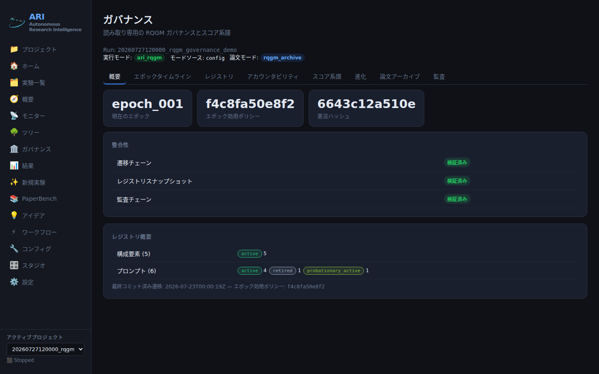

---
sources:
  - path: ari-core/ari/viz/v1/rqgm.py
    role: implementation
  - path: ari-core/ari/viz/v1/dto.py
    role: implementation
  - path: ari-core/ari/viz/v1/router.py
    role: implementation
  - path: ari-core/ari/viz/frontend/src/components/Governance/GovernancePage.tsx
    role: implementation
  - path: ari-core/ari/viz/frontend/src/components/Governance/OverviewTab.tsx
    role: implementation
  - path: ari-core/ari/viz/frontend/src/components/Governance/RegistryTab.tsx
    role: implementation
  - path: ari-core/ari/viz/frontend/src/components/Governance/AccountabilityTab.tsx
    role: implementation
  - path: ari-core/ari/viz/frontend/src/components/Governance/ScoreLineageTab.tsx
    role: implementation
  - path: ari-core/ari/viz/frontend/src/components/Governance/EpochTimelineTab.tsx
    role: implementation
  - path: ari-core/ari/viz/frontend/src/components/Governance/EvolutionTab.tsx
    role: implementation
  - path: ari-core/ari/viz/frontend/src/components/Governance/PaperArchiveTab.tsx
    role: implementation
  - path: ari-core/ari/viz/frontend/src/components/Governance/AuditTab.tsx
    role: implementation
  - path: ari-core/ari/viz/frontend/src/components/Governance/shared.tsx
    role: implementation
  - path: ari-core/tests/test_gui_v1_rqgm.py
    role: test
  - path: ari-core/ari/viz/frontend/src/components/Governance/__tests__/GovernancePage.test.tsx
    role: test
last_verified: 2026-07-27
---

# RQGM ガバナンスワークスペースガイド

`#/governance?run=<run_id>` は、1 つのランの RQGM ガバナンス記録への読み取り専用の
窓です: どんな制度が存在し、互いに何をし、それがスコアをどう変えたか。

**ガバナンスに関して GUI は読み取り専用です。** `/api/v1` の RQGM 面には変更用
エンドポイントが一切存在せず、`/api/v1/runs/{run_id}/rqgm/*` 以下のルートはすべて
GET です。このワークスペースでクリックできるものが、構成要素を登録したり、
ポリシーを採用したり、エポックを開いたり、スコアを書き換えたりすることはありません。
ガバナンスの変更はラン自身から生じます。（Studio は**新規**ランに対して
`ari_rqgm` を選べますが、それが決めるのはランがどのアルゴリズムを実行するかで
あって、制度が何をするかではありません。後述を参照。）

このワークスペースがガバナンスの判断を再実行することもありません。読み取りモデルは
コミット済みのチェックポイント成果物（`rqgm_state.json`、
`rqgm_transitions.jsonl`、`rqgm_audit.jsonl`、`rqgm_adversarial_cases.jsonl`、
`rqgm_registry.json`、`prompt_evolution.jsonl`、`rqgm_meta_outputs.jsonl`、
`paper_archive_state.json`、ノードメトリクスのセンチネル）を直接パースし、カーネル
コードをインポートしません。見えているのは replay であって再実行ではありません。

## たどり着き方と capability の状態

ランの Overview からタブを開くか、URL を直接入力します。ランに `rqgm_state.json` が
無い場合、エラーには**なりません** — capability 画面が出ます:

> **Governance is not active for this run**
> This is a capability state, not an error.
> This run executed in the `simple_bfts` execution mode, so no RQGM
> governance artifacts exist for it.
> To govern a run, launch it with execution mode `ari_rqgm`
> (`ari.mode: ari_rqgm`). Existing runs are never modified retroactively.

その下には常に 3 つのチップが一緒に描画されます — **Execution mode**、
**Mode source**、**Paper mode** — 実行モード（`ari.mode`）と論文モード
（`paper.mode`）が独立した軸であり、「mode」という語を単独でラベルに使うことは
決してないからです。

成果物の存在*こそ*が capability のシグナルです: `rqgm/capabilities` はどのランにも
応答し、他の RQGM ルートは `simple_bfts` ランに対して型付き 404 を返します。
ガバナンス下のランを得るには、ランの**開始時**に `ari_rqgm` を選びます —
`workflow.yaml` で、環境変数で、あるいは Configuration Studio の Execution
コントロールから（新規ラン専用。[実行モード](execution_modes.md)と
[Configuration Studio](configuration_studio.md)を参照）。そこでモードを選ぶことは
起動時の決定であってガバナンスの変更ではありません: 構成要素を登録せず、ポリシーを
採用せず、スコアも書き換えないため、このワークスペースはどちらにせよ読み取り専用の
ままです。96 個の `rqgm.*` ガバナンス / チューニングパラメータは今も設定ファイル
専用です。

タブストリップは `aria-selected` / `aria-controls` を配線した本物の
`role="tablist"` コンポジットなので、キーボードで完全に操作できます。

## タブごとの解説

タブストリップ自体は **Overview · Epoch Timeline · Registry · Accountability ·
Score Lineage · Evolution · Paper Archive · Audit** と並びます。以下の節は代わりに
読む順序に従います: まず現在状態、次にノードスコープの 2 タブ（Accountability と
Score Lineage は 1 つのノードセレクタを共有）、続いてラン全体のタイムライン、
最後に生ログです。

### Overview — 「現在のガバナンス状態は？」

現在エポック、そのエポックの utility ポリシーハッシュ、憲法ハッシュ、最後にコミット
された遷移のタイムスタンプ、status 別のレジストリ件数、そして 3 つの**三値**
整合性フラグ。



*このスクリーンショットは**フィクスチャ**チェックポイント
（`20260727120000_rqgm_governance_demo`）です。このワークスペースを撮影する
ためだけに生成されたもので、写っているハッシュ・エポック番号・件数はすべて
その撮影用の小道具に属します。あなたの値とは異なりますし、突き合わせる対象
でもありません。*

三値は文字どおりに読んでください:

| バッジ | 値 | 意味 |
|---|---|---|
| `verified` | `true` | チェーン / スナップショットの検証が通った |
| `broken` | `false` | 通らなかった |
| `source missing` | `null` | 検証すべきものが存在しなかった |

存在しないソースがクリーンとして表示されることは**決してありません**。この区別が
すべてです: 「悪いことが起きていないと検証した」と「記録が無い」は別の主張です。

現在状態は**コミット済み**遷移の replay です。途切れた末尾の JSONL 行（書き込み
途中で中断された追記）は無視され、対応する commit を持たない
`epoch_transaction_prepare` 以降のイベントは決して採用されません。

### Registry — 「どの制度が、どんな立場で存在するのか？」

コミット済み replay に対する 2 つのテーブル — 構成要素とプロンプト。立場は閉じた
10 値のライフサイクル語彙をそのまま描画します:

`candidate` · `validated` · `shadow` · `probationary_active` · `active` ·
`warning` · `probation` · `quarantine` · `retired` · `banned`

アクティブ集合（`active` + `probationary_active`）への所属は独自の明示マーカーを
持つので、「登録済み」が「有効」と取り違えられることはありません。

`rqgm_registry.json` は**検証専用の rollup スナップショット**です — その
`as_of_event_hash` が replay の末尾と比較され、`snapshot verified` /
`snapshot mismatch` / `snapshot missing` として報告されます。rollup が現在状態に
なることは決してありません。

ノードのスコア状態（`computed`、`recomputed`、`stale`、`invalidated`、`removed`）は
**別の状態機械**であり、別の色系統を使います。2 つの語彙は構造的に隔てられており、
一方が他方の意味を借りることはできません。

### Accountability — 「誰がこのノードを攻撃し、それは通ったのか？」

セレクタからノードを選ぶと、はっきり分かれた 2 つのテーブルが得られます。

**生攻撃**は `atk_*` の主張です。このテーブルの背後にある DTO はスコア・ペナルティ・
確信度のフィールドを一切持たず、テーブルは固定の `no penalty (unadjudicated)` セルを
描画します。生の行はペナルティの数値を*構造的に*表示できません。列名が
**Claimed severity** なのは、まさにそれが攻撃者の主張だからです。

**検証済み攻撃**は裁定済みの `vat_*` レコード — ペナルティを駆動しうる唯一の種別 —
であり、チェーン参照（生の `atk_*` id → 判定の `jdg_*` id → 評決、深刻度）と、
存在する場合は弾劾に関わるフィールド（`target_component_id`、
`affected_components`）とともに表示されます。

**生と検証済みを読み分けることが、ここで最も重要な習慣です。** 生攻撃の長い一覧は
そのノードが悪い証拠ではありません; 検証済み攻撃テーブルが空であることは無罪の
証明ではありません。主張を帰結へ変換するのは裁定チェーンだけです。

### 「攻撃 0 件」が意味すること・しないこと

記録された攻撃が 0 件であることは**データ点であって、健全性の証拠ではありません**。
UI は空の敵対テーブルの隣に必ずこれを述べます。

ワークスペースが明示的に指摘する、より強い場合があります。ランのレジストリが探索側の
敵対者ロールしか含まない（`paper_*` ロールが無い）とき、弾劾チェーンはそもそも発火
できません — 敵対者はガバナンス外のジェネレータロールを標的にするため、どれだけ
敵対的活動があっても制裁は生じ得ません。その構成では次が表示されます:

> **Impeachment chain structurally inert** — This run registers only
> exploration adversary roles, which target the ungoverned generator
> role — the impeachment chain cannot fire by design. Zero attacks here
> is a capability state, not evidence of health.

3 つの異なる状況、3 つの異なる読み:

1. **攻撃記録なし、チェーンは生きている** — 敵対者は走ったが提出に値するものを
   見つけなかった。弱い肯定的証拠。
2. **攻撃記録なし、チェーンは不活性** — そもそも何も提出され得なかった。証拠は皆無。
3. **攻撃は記録されたが検証済みゼロ** — 主張は提出され、裁定がそれを退けた。それは
   ガバナンスの帰結であり、検証済みテーブルの評決に見えています。

### Score Lineage — 「なぜこのノードのスコアはこの値なのか？」

1 ノードに対する 2 チャネル。決して統合されません:

**チャネル 1 — 敵対的ペナルティ（エポック内）。** ウォーターフォールのテーブル:
ベーススコア → 検証済みペナルティ → 最終スコア。`UtilityRecord` の観測と、ノードの
メトリクスセンチネル（`_pre_penalty_score`、`_validated_attack_penalty`、
`_scientific_score`、`_utility_policy_hash`、`_stale`）から構成されます。Evidence 列は
そのレコードが引用する裁定済み `vat_*` id を列挙します。**すべての行が自身のポリシー
ハッシュを挙げます** — スコアがポリシー同一性なしに表示されることはありません。

**チャネル 2 — エポックの utility ポリシー履歴（ラン全体）。** 観測はポリシー
ハッシュで**ファセット化**されます: ハッシュごとに枠付きの 1 ファセットが並び、
常設の注記が付きます:

> Scores under different policy hashes are not comparable; each policy
> hash is shown as its own facet, never one continuous series.

**ファセットが重要な理由。** utility ポリシーはスコアが*何を意味するか*を定義します。
エポック境界がポリシーを supersede すると、その前後の数値は別々の計測器による測定に
なります。1 本の線として描くことは、存在しないトレンドを製造することです。ハッシュを
持たない観測は `unknown` の下にファセット化され、ハッシュ付きファセットへ畳み込まれる
ことはありません。

チャネルの下にはラン全体の文脈が続きます: **Epoch utility policies** テーブル
（ハッシュ、ライフサイクル status、使用エポック、採用元の遷移、そして write-once の
本体 — 保存バイト列が登録ハッシュと照合できたときのみ表示され、そうでなければ
`body withheld (hash mismatch)` であり、推測は決してしません）、および
**Score rewrites (policy supersessions)** テーブル（各 utility ポリシー supersession を
その帰結と join: from-policy → to-policy、無効化ノード、再計算、フロンティアからの
除去と復帰）。これらのノード集合は実イベントのフィールド由来であり、GUI が再計算した
ものではありません。

欠けている数値は `0` ではなく `unknown` として描画されます。

### Epoch Timeline — 「各境界で何が起きたのか？」

遷移 replay から得たコミット済みエポックを、それぞれ自身のファセットとして表示します。

**エポック横断のスコア比較 UI は意図的に存在せず**、タブもそう述べます:

> No cross-epoch score comparison is offered: epochs with different
> utility policy hashes are not directly comparable, so each epoch renders
> as its own facet.

不在は不在のままです:

- まだ開いているエポックにはコミット済みの境界トランザクションが無いので、ゼロの
  並んだ行ではなく
  *"No committed boundary transaction yet — transition counts do not exist
  (this is absence, not zero activity)"* が表示されます;
- 実際の `epoch_transition` 監査レコードが配列を供給しない限り、`fallbacks` は
  *"fallbacks: unknown (no audit source)"* として描画されます。

エポックを選ぶとコミット済みの詳細が読み込まれます: シーケンス、status、open 時の
ノード数、前エポック、レジストリバージョン、エポックフィンガープリント; ガバナンス
下の 5 キー（`composite`、`axis_weights`、`frontier_score`、
`depth_penalty_lambda`、`ucb_c`）による write-once の **utility ポリシー本体**;
開始と終了の境界トランザクション（それぞれ生ソース `rqgm_transitions.jsonl@<byte
offset>` 付き）; そしてガバナンスレポートの有無。

### Evolution — 「何が提案され、実際に何が採用されたのか？」

種別ごとにグルーピングされます: プロンプト進化、utility ポリシー進化、メタ出力。
分離は構造的です:

- すべての行は**生の候補レコード**であり、独自の候補 status 語彙を持ち、既定では
  `candidate (not adopted)` とラベル付けされます;
- 検証実行は別に数えられます — 検証の証拠であって採用の証拠ではありません;
- `adopted` は提案ハッシュをコミット済みレジストリ replay と join することで**のみ**
  導出されます。採用された行は採用した遷移（`Adopted via`）を引用します。提案レコード
  が自分を昇格させることは決してできません;
- メタ出力は `adopted = null` であり `inert provenance (not adoptable)` として
  描画されます — 観測であって、失敗した候補ではありません。

ログが無い場合は、空だが健全なテーブルではなく
*"`prompt_evolution.jsonl` not present for this run"* と描画されます。すべての行が
生ソースを `file@offset` として挙げます。

### Paper Archive — 「論文はどう選ばれたのか？」

有界なスカラ値と、UI で強制される 2 つの独立性規則:

- **実行モードと論文モードは独立した軸です。** 両方のチップが常に並べて描画され、
  明示的な注記が付きます; 「mode」という語を単独で使うことはありません。
- **best-belief ドラフトはレビューによる選択です** — ガバナンスの勝者や研究結果と
  同一視されることは決してありません。

ここでも不在は不在のままです: `paper_archive_state.json` が無いとき、`linear`
チップは「不在から導出された」注記**付きで**描画されます（`state_present = false` が
提示されるため、導出は捏造ではなく透明です）; ドラフトアーカイブが無いときは
`draft_count` を 0 とするのではなく "not present" と表示されます; そして
`anchor.enabled = null` は「凍結された論文 utility ポリシーが無い」を意味します —
無効ではなく不明です。

`anchor.enabled` が `false` のとき、タブはその帰結を逐語で伝えます: アーカイブは
reviewed best-of-N であり、writer への制裁は発火できません。

### Audit — 「生ログを見せてほしい」

`rqgm_audit.jsonl` に対するカーソルページングのテーブルで、**Record type** と
**Epoch** のフィルタと [Load more] の追記ボタンを備えます。カーソルはバックエンドの
安定したバイトオフセットなので、追記されたページが追記専用ログの行を重複させること
はありません。フィルタを変えると新しいページ連鎖が始まります — フィルタ済みビューが
別のフィルタのビューから行を継承することはありません。

すべての行が生ソースを挙げます: `rqgm_audit.jsonl@<byte offset>` とイベントハッシュ。
テーブルは明示的な *"End of committed log"* で終わります。

## 集約から生の成果物へドリルダウンする

このワークスペースのトレーサビリティ規則は、あらゆる集約ビューが生イベントまたは
生成果物へ遡れなければならない、というものです。実際には:

| 見ているもの | 行にあるドリルダウンの取っ手 |
|---|---|
| 監査イベント | `rqgm_audit.jsonl@<byte offset>` + イベントハッシュ |
| エポック境界トランザクション | `rqgm_transitions.jsonl@<byte offset>` |
| 進化の候補 | `prompt_evolution.jsonl@<offset>` / `rqgm_meta_outputs.jsonl@<offset>` |
| スコア観測 | レコード id と、それが引用する `vat_*` id |
| レジストリエントリ | 現在の立場を生んだ `source_event_ids` |
| スコア書き換え | その遷移 id と `source_event_ids` |

集約からバイト列へ辿るには、オフセットを取ってチェックポイント内のファイルを直接
読みます。例:

```bash
# the exact line an audit row came from
tail -c +$((OFFSET + 1)) "$CKPT/rqgm_audit.jsonl" | head -1 | python -m json.tool
```

オフセットは行頭の 0 始まりバイト位置であり、だからこそ追記専用ログに対して安定です。
イベントハッシュの契約は `sha256(canonical_json(payload))[:12]` です。

## 縮退したチェーン、壊れたチェーン

成果物が壊れている場合、500 でも空白画面でもなく、正直な **HTTP 200 + フラグ**が
返ります。可視の層は 2 つです:

1. Overview タブの**整合性フラグ**が `broken`（または `source missing`）へ反転し、
   読み取りモデルは何が失敗したかを述べる `degraded_reasons` を添付します — ハッシュ
   チェーンが切れたバイトオフセットも含みます。
2. **縮退パネル**が該当ビューを置き換える、または併記されます:

   > **Governance record degraded** — Parts of the governance record are
   > missing or inconsistent. This describes the governance artifacts
   > only — it does not mean the research run failed.

最後の一文はワークスペース全体の意図的な不変条件です:
**ガバナンスのブロック ≠ 研究の失敗。** ランの Overview がガバナンスブロッカーを
提示するときにも同じことを繰り返します。

チェーンが壊れていても行は描画されます — 隠されるのではなく、正直にフラグが立ちます。
監査チェーンの破損が監査テーブルを消すことはありません; それが伝えるのは、テーブルを
改竄検出可能なものとしてはもう信頼できないということであり、生オフセットを自分で
辿ることは今もできます。

## 関連

- [実行モード](execution_modes.md) — `ari_rqgm` と論文モードを有効にする。
- [RQGM アーキテクチャ](../concepts/rqgm_architecture.md) — 制度とは何か。
- [RQGM 評価ガイド](rqgm_evaluation.md) — ガバナンス下の実験を実行し測定する。
- [RQGM 成果物スキーマ](../reference/rqgm_schemas.md) — ディスク上のレコードの形。
- [ダッシュボードガイド](dashboard.md) — ナビゲーション、ディープリンク、鮮度。
- [Configuration Studio](configuration_studio.md) — 新規ランの実行モード / 論文
  モードの選択と、ガバナンスのチューニングフィールドが読み取り専用のままである理由。
