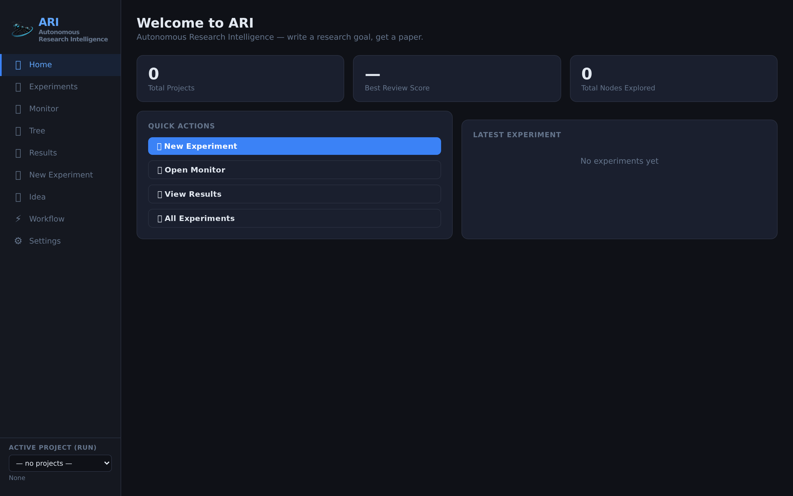
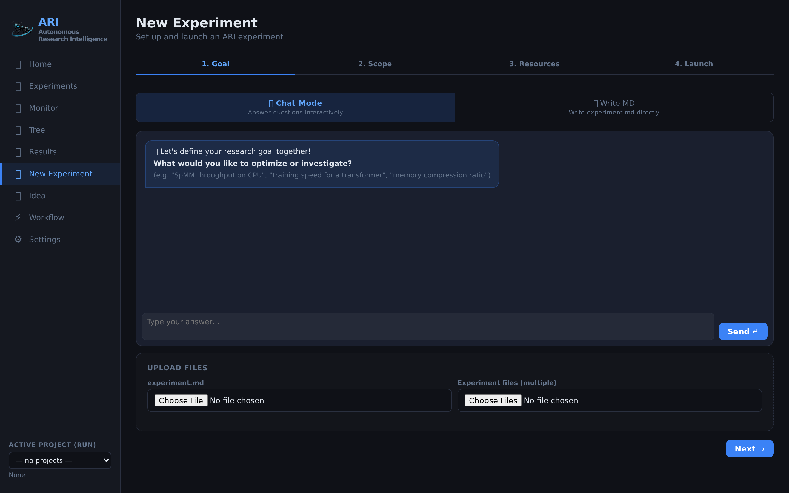
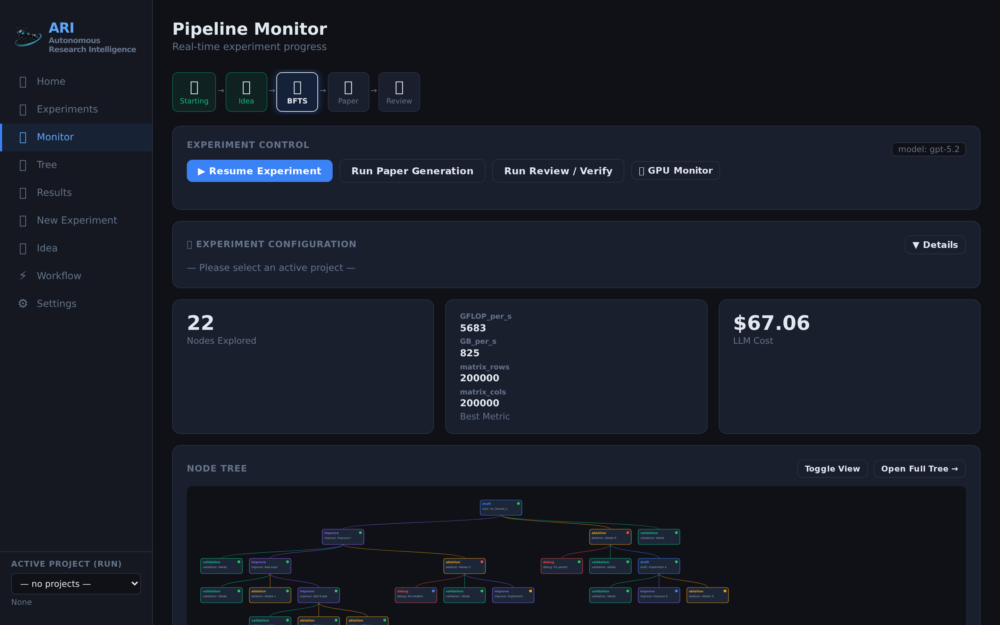
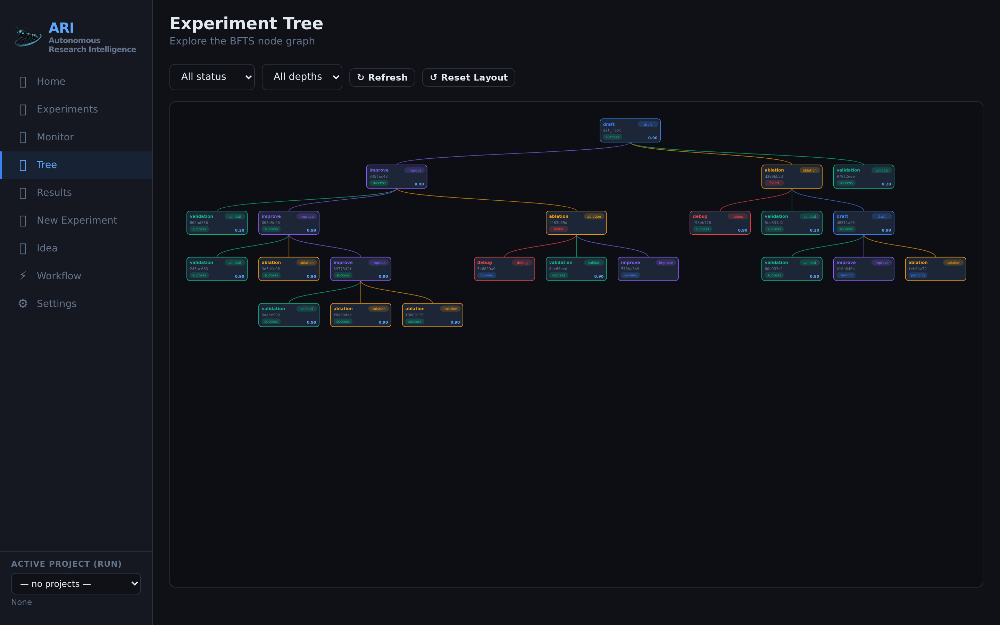
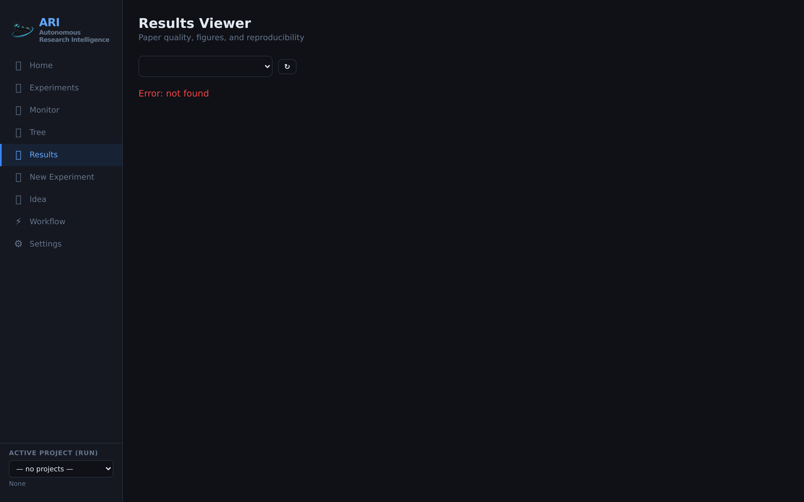
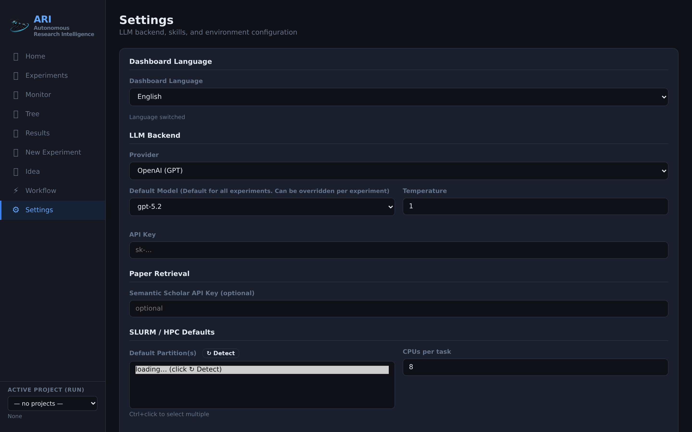
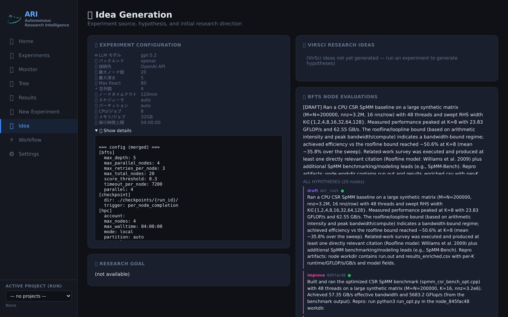
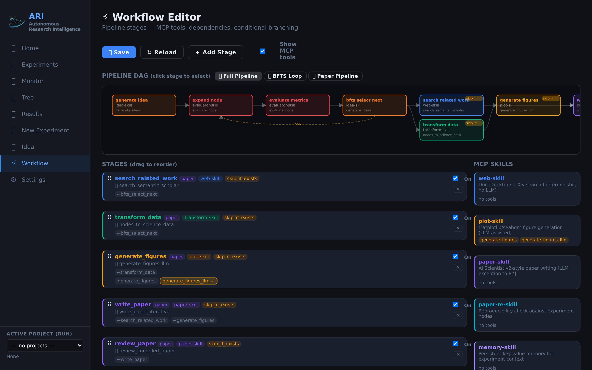

# ARI QuickStart Guide

This guide walks you through installing ARI, choosing an AI model, and running your first experiment using the **web dashboard**. No programming experience is required.

For CLI (command-line) usage, see [CLI Reference](cli_reference.md).

> **Preview before you install**
>
> - 🎬 **Dashboard demo video** — [`movie/en/ari_dashboard_demo.mp4`](movie/en/ari_dashboard_demo.mp4) shows the full web UI in action.
> - 📄 **Sample output paper** — [`sample_paper.pdf`](sample_paper.pdf) is a real paper generated by ARI, including figures, citations, and the reproducibility verification report.

---

## What You Will Need

| Requirement | Details |
|-------------|---------|
| **Operating System** | Linux or macOS (Windows: use WSL2) |
| **Python** | 3.10 or later |
| **Git** | To clone the repository |
| **Web browser** | Chrome, Firefox, Safari, or Edge |

Optional (but recommended):

| Tool | Why |
|------|-----|
| **conda / miniconda** | Easier LaTeX and PDF tool installation (no sudo needed) |
| **Ollama** | Run AI models locally for free — no API key, no cost |
| **LaTeX** | Required only if you want ARI to generate PDF papers |

---

## Step 1: Install ARI

Open a terminal and run:

```bash
git clone https://github.com/kotama7/ARI.git
cd ARI
bash setup.sh
```

The setup script automatically detects your OS and installs everything needed. It works on Linux, macOS, and WSL2 — with or without conda and sudo.

In v0.6.0 the setup script also bootstraps **[Letta](https://docs.letta.com)** (the memory backend used by `ari-skill-memory`). It auto-detects the best deployment path: Docker → Singularity/Apptainer → pip. To skip the Letta bootstrap (for example in CI or container builds) export `SKIP_LETTA_SETUP=1` before running `bash setup.sh`. To run setup non-interactively, export `ARI_NONINTERACTIVE=1`.

When setup finishes, you will see **"Setup Complete"** and next-step instructions. You can verify Letta later with `ari memory health`.

---

## Step 2: Choose Your AI Model

ARI needs an AI model (LLM) to think, plan, and run experiments. Choose one of the following:

### Option A: Ollama — Free, runs on your computer (recommended)

No account needed. No API key. No cost. Everything runs locally.

```bash
# Install Ollama
curl -fsSL https://ollama.com/install.sh | sh     # Linux
# brew install ollama                              # macOS

# Download a model
ollama pull qwen3:8b

# Start the server (keep this terminal open)
ollama serve
```

Set environment variables (open a new terminal):

```bash
export ARI_BACKEND=ollama
export ARI_MODEL=qwen3:8b
```

> **Which model size?**
>
> | Model | RAM needed | Quality |
> |-------|-----------|---------|
> | `qwen3:8b` | 16 GB | Good — great for getting started |
> | `qwen3:14b` | 32 GB | Better |
> | `qwen3:32b` | 64 GB | Best |

### Option B: OpenAI API (cloud, paid)

```bash
export ARI_BACKEND=openai
export ARI_MODEL=openai/gpt-4o
export OPENAI_API_KEY=sk-...     # Get from https://platform.openai.com/api-keys
```

### Option C: Anthropic API (cloud, paid)

```bash
export ARI_BACKEND=claude
export ARI_MODEL=anthropic/claude-sonnet-4-5
export ANTHROPIC_API_KEY=sk-ant-...  # Get from https://console.anthropic.com/
```

> **Tip:** Add `export` lines to your `~/.bashrc` or `~/.zshrc` to make them permanent.

---

## Step 3: Launch the Dashboard

Start the ARI web dashboard:

```bash
ari viz ./checkpoints/ --port 8765
```

Open your browser and go to: **http://localhost:8765**

You will see the ARI home screen:



The left sidebar provides navigation to all dashboard pages:

| Page | Description |
|------|-------------|
| **Home** | Overview with quick actions and recent experiments |
| **Experiments** | List of all past experiment runs |
| **Monitor** | Real-time pipeline progress with D3 tree visualization |
| **Tree** | Full BFTS experiment tree — click nodes to inspect details |
| **Results** | Overleaf-like LaTeX editor, paper PDF viewer, review report, EAR browser |
| **New Experiment** | Wizard to create and launch a new experiment |
| **Ideas** | VirSci-generated research hypotheses |
| **Workflow** | React Flow visual DAG editor for pipeline stages |
| **Settings** | Configure LLM, API keys, SLURM, container, VLM, retrieval backend |
| **Sub-Experiments** | Recursive sub-experiment tree (via orchestrator skill) |

---

## Step 4: Create Your First Experiment (Wizard)

Click **"New Experiment"** in the sidebar (or the blue **"New Experiment"** button on the home page).



The wizard guides you through 4 steps:

### Step 1 of 4 — Choose Mode

| Mode | Best for |
|------|----------|
| **Chat** | Beginners. Describe what you want in natural language. The AI helps you refine it into a proper experiment. |
| **Write MD** | Write or paste your experiment description in Markdown directly. |
| **Upload** | Upload an existing `experiment.md` file from your computer. |

**Recommended for beginners: Chat mode.** Just type what you want to optimize or investigate, for example:

> "I want to find the best configuration for my experiment on this machine"

The AI will ask clarifying questions and generate the experiment file automatically.

### Step 2 of 4 — Scope

Configure how large the experiment should be:

| Setting | What it controls | Recommended for first run |
|---------|-----------------|--------------------------|
| **Max Depth** | How deep the search tree goes | 3 |
| **Max Nodes** | Total number of experiments to run | 5–10 |
| **Max ReAct Steps** | Reasoning steps per experiment | 80 (default) |
| **Timeout** | Seconds per experiment | 7200 (default) |
| **Parallel Workers** | Simultaneous experiments | 2–4 |

> **Tip:** Start small (5–10 nodes, depth 3) for your first run. You can always increase later.

### Step 3 of 4 — Resources

Select your LLM provider and model:

- **OpenAI / Anthropic / Ollama / Custom** — choose from the dropdown
- For Ollama, you can type any model name (e.g., `qwen3:8b`)
- Configure SLURM/HPC settings if running on a cluster

**Paper Review (v0.6.0+)** — choose how the generated paper is reviewed:

- **Rubric** — pick one of 16 bundled venues (`neurips` default and v2-compatible, plus `iclr`, `icml`, `cvpr`, `acl`, `sc`, `osdi`, `usenix_security`, `stoc`, `siggraph`, `chi`, `icra`, `nature`, `journal_generic`, `workshop`, `generic_conference`). Drop your own YAML into `ari-core/config/reviewer_rubrics/` to add a custom venue.
- **Few-shot mode** — `static` (use the bundled examples) or `dynamic` (Phase 2 OpenReview retrieval; falls back to static for closed-review venues).
- **Reviewer ensemble (N)** — number of independent reviewer agents. N>1 also runs an Area Chair meta-review.
- **Reflection rounds** — self-reflection iterations per reviewer (Nature Ablation default: 5).
- **Few-shot examples** — auto-sync from the manifest, upload your own JSON+PDF samples, or delete unwanted ones — directly from the wizard.

### Step 4 of 4 — Launch

Review your settings and click **Launch**. ARI will:

1. Search related academic papers
2. Generate research hypotheses (VirSci multi-agent deliberation)
3. Run experiments using Best-First Tree Search
4. Evaluate results with LLM peer review
5. Write a LaTeX paper with figures and citations
6. Verify reproducibility independently

---

## Step 5: Monitor the Experiment

Once launched, the **Monitor** page shows real-time progress:



- **Pipeline stages** are shown at the top (Idea → BFTS → Paper → Review)
- **Node tree** shows experiment progress with color-coded status
- **Logs** stream in real time

### Experiment Tree

Click **Tree** in the sidebar for the full interactive experiment tree:



- **Green** nodes = success
- **Red** nodes = failed
- **Blue** nodes = running
- **Grey** nodes = pending

Click any node to inspect:

| Tab | What it shows |
|-----|---------------|
| **Overview** | Status, metrics, execution time, evaluation summary |
| **Trace** | Every tool call the AI agent made (step by step) |
| **Code** | Generated source code for this experiment |
| **Output** | Job stdout, benchmark results |

---

## Step 6: View Results

After the experiment completes, go to the **Results** page:



Here you can:

- **Edit the paper** with the built-in Overleaf-like LaTeX editor (edit `.tex`/`.bib` files, compile, and preview PDF inline)
- View the automated peer review score and feedback
- Browse the Experiment Artifact Repository (EAR) with code, data, and reproducibility metadata
- Check the reproducibility verification report
- Download all artifacts

Output files are saved in `./checkpoints/<run_id>/`:

| File | Description |
|------|-------------|
| `full_paper.tex / .pdf` | Complete generated paper |
| `review_report.json` | Peer review score and feedback (incl. ensemble reviews + meta-review when N>1) |
| `reproducibility_report.json` | Independent reproducibility verification |
| `tree.json` | Full experiment tree with all metrics |
| `science_data.json` | Cleaned data (no internal terms) |
| `figures_manifest.json` | Generated figures |
| `ear/` | Experiment Artifact Repository (code, data, logs, reproducibility metadata) |
| `experiments/` | Per-node source code and output |

---

## Step 7: Configure Settings

Open the **Settings** page to customize ARI:



### Dashboard Language

Change the dashboard language (English, Japanese, Chinese) from the language dropdown at the top.

### LLM Backend

- Choose your provider (OpenAI, Anthropic, Ollama, Custom)
- Set the default model and temperature
- Enter your API key (stored locally, masked in the UI)

### Paper Search

- Optionally set a Semantic Scholar API key for higher rate limits

### SLURM / HPC

- Set default partition, CPU count, and memory for cluster jobs
- Click **Detect** to auto-detect your cluster's available partitions

### Container Runtime

- Choose container mode: auto, Docker, Singularity, Apptainer, or none
- Set container image and pull policy (always / on_start / never)
- Click **Detect Runtime** to auto-detect available container runtimes

### VLM Figure Review

- Set the VLM model for figure quality review (default: `openai/gpt-4o`)
- Configure review threshold and max iterations

### Retrieval Backend

- Choose paper search backend: Semantic Scholar (default), AlphaXiv, or both (parallel)

### Per-Phase Model Overrides

Use different models for different pipeline phases (e.g., a cheaper model for idea generation, a better model for paper writing).

---

## Additional Dashboard Pages

### Ideas Page



View VirSci-generated research hypotheses with novelty and feasibility scores. See the experiment configuration, research goal, and BFTS node evaluations.

### Workflow Editor



A React Flow visual DAG editor for the post-BFTS pipeline. Drag nodes, draw edges, enable/disable stages, and assign skills. Swim-lane layout separates BFTS and Paper phases. Changes are saved as `workflow.yaml`.

---

## Dashboard Architecture & API

The dashboard is a React/TypeScript SPA (built with Vite) served by a Python asyncio HTTP server. It consists of two components:

- **HTTP server** (`ari/viz/server.py`): REST API + SSE log streaming on the main port
- **WebSocket server**: Real-time tree updates on port+1 (e.g., 8766 if dashboard is on 8765)

### API Endpoints

All endpoints are accessible at `http://localhost:<port>/`.

#### State & Monitoring

| Endpoint | Method | Description |
|----------|--------|-------------|
| `/state` | GET | Full application state: current phase (idle/idea/bfts/paper/review), node counts, experiment config, cost data, LLM model info |
| `/api/logs` | GET (SSE) | Server-Sent Events stream of real-time logs from `ari.log` and `cost_trace.jsonl` |
| `/memory/<node_id>` | GET | Memory store entries for a node (tool-call trace, metrics, parent chain) |
| `/codefile?path=<path>` | GET | Read a file from the checkpoint directory (restricted to checkpoint bounds, max 2MB) |

#### Experiment Management

| Endpoint | Method | Description |
|----------|--------|-------------|
| `/api/launch` | POST | Launch new experiment. Body: `{experiment_md, profile, model, provider, max_nodes, max_depth, max_react, timeout_min, workers, partition, ...}`. Returns `{ok, pid, checkpoint_path}` |
| `/api/run-stage` | POST | Run a specific stage: `{stage: "resume"/"paper"/"review"}` |
| `/api/stop` | POST | Gracefully stop running experiment (SIGTERM → SIGKILL fallback) |
| `/api/checkpoints` | GET | List all checkpoint directories with status, node count, review score |
| `/api/checkpoint/<id>/summary` | GET | Detailed summary: tree data, review, science data, paper text |
| `/api/checkpoint/<id>/paper.pdf` | GET | Download generated PDF |
| `/api/checkpoint/<id>/paper.tex` | GET | Download generated LaTeX |
| `/api/active-checkpoint` | GET | Current active checkpoint path |
| `/api/switch-checkpoint` | POST | Switch active checkpoint: `{path}` |
| `/api/delete-checkpoint` | POST | Delete checkpoint and associated logs: `{path}` |
| `/api/upload` | POST | Upload file to active checkpoint (binary body, `X-Filename` header) |

#### Configuration

| Endpoint | Method | Description |
|----------|--------|-------------|
| `/api/settings` | GET | Current settings: LLM provider/model, Ollama host, SLURM config, MCP skills |
| `/api/settings` | POST | Save settings to `{checkpoint}/settings.json` and `.env` (requires an active project). Body: `{llm_model, llm_provider, ollama_host, slurm_partition, ...}` |
| `/api/env-keys` | GET | All API keys from `.env` files with source info |
| `/api/env-keys` | POST | Save a single API key: `{key, value}` |
| `/api/profiles` | GET | Available environment profiles (laptop, hpc, cloud) |
| `/api/models` | GET | Available LLM providers and models |
| `/api/workflow` | GET | Full workflow.yaml with pipeline stages and skill metadata |
| `/api/workflow` | POST | Save modified workflow.yaml: `{path, pipeline}` |
| `/api/skills` | GET | List available MCP skills with descriptions |
| `/api/skill/<name>` | GET | Skill details: README, SKILL.md, server.py source |

#### Wizard & Tools

| Endpoint | Method | Description |
|----------|--------|-------------|
| `/api/chat-goal` | POST | Multi-turn LLM chat for experiment goal refinement: `{messages, context_md}` |
| `/api/config/generate` | POST | Generate experiment.md from natural language goal: `{goal}` |
| `/api/ssh/test` | POST | Test SSH connectivity: `{ssh_host, ssh_port, ssh_user, ssh_key, ssh_path}` |
| `/api/scheduler/detect` | GET | Auto-detect compute environment (SLURM, PBS, LSF, Kubernetes) |
| `/api/slurm/partitions` | GET | Available SLURM partitions |
| `/api/ollama-resources` | GET | GPU info (nvidia-smi), available Ollama models |
| `/api/gpu-monitor` | GET/POST | Start/stop GPU monitor daemon |

#### WebSocket

| Endpoint | Description |
|----------|-------------|
| `ws://localhost:<port+1>/ws` | Subscribe to real-time tree updates. Messages: `{type: "update", data: tree.json, timestamp}` |

### Security

- API keys are stored in `.env` files only, never in `settings.json`
- File access (`/codefile`) is restricted to the checkpoint directory
- Each experiment runs in its own process group for isolation

---

## CLI Alternative

All dashboard operations can also be performed from the command line:

### Running Experiments

```bash
# Basic run (auto-detects config)
ari run experiment.md

# With environment profile
ari run experiment.md --profile hpc

# With custom config
ari run experiment.md --config ari-core/config/workflow.yaml

# Resume interrupted run
ari resume ./checkpoints/20260328_matrix_opt/

# Run paper pipeline only (experiments already done)
ari paper ./checkpoints/20260328_matrix_opt/
```

### Monitoring & Results

```bash
# Show node tree and status
ari status ./checkpoints/20260328_matrix_opt/

# List all projects
ari projects

# Show detailed results (tree + review)
ari show 20260328_matrix_opt

# List available tools
ari skills-list
```

### Configuration

```bash
# View current settings
ari settings

# Change model
ari settings --model openai/gpt-4o

# Set SLURM options
ari settings --partition gpu --cpus 64 --mem 128
```

### Environment Variables

| Variable | Description | Default |
|----------|-------------|---------|
| `ARI_BACKEND` | LLM backend: `ollama` / `openai` / `anthropic` | `ollama` |
| `ARI_MODEL` | Model name (e.g., `qwen3:8b`, `openai/gpt-4o`) | `qwen3:8b` |
| `OPENAI_API_KEY` | OpenAI API key | — |
| `ANTHROPIC_API_KEY` | Anthropic API key | — |
| `OLLAMA_HOST` | Ollama server URL | `http://localhost:11434` |
| `ARI_MAX_NODES` | Maximum total experiments | `50` |
| `ARI_PARALLEL` | Concurrent experiments | `4` |
| `ARI_MAX_REACT` | Max ReAct steps per node | `80` |
| `ARI_TIMEOUT_NODE` | Timeout per node (seconds) | `7200` |

---

## Troubleshooting

### Installation

| Problem | Solution |
|---------|----------|
| `ari: command not found` | Add `~/.local/bin` to your PATH: `export PATH="$HOME/.local/bin:$PATH"` |
| Setup script fails | Check Python version: `python3 --version` (must be 3.10+) |
| Permission denied | Don't use `sudo`. Run as your normal user. |

### AI Model

| Problem | Solution |
|---------|----------|
| Ollama connection refused | Make sure `ollama serve` is running in another terminal |
| `LLM Provider NOT provided` | Use provider prefix: `openai/gpt-4o`, not just `gpt-4o` |
| Slow or timeout | Use a smaller model (`qwen3:8b`) or increase timeout in Settings |

### Experiment

| Problem | Solution |
|---------|----------|
| All nodes failed | Open Tree view, click a failed node, check the Trace tab |
| No results | Check Monitor page — the experiment may still be running |
| Interrupted run | Go to Experiments page, find the run, click Resume |

### Paper Generation

| Problem | Solution |
|---------|----------|
| No PDF generated | Install LaTeX: `conda install -c conda-forge texlive-core` |
| `No paper text available` | Install: `pip install pymupdf pdfminer.six` |

---

## Quick Start Recipe

```bash
# 1. Install
git clone https://github.com/kotama7/ARI.git && cd ARI && bash setup.sh

# 2. Set up AI (free, local)
ollama pull qwen3:8b && ollama serve &
export ARI_BACKEND=ollama ARI_MODEL=qwen3:8b

# 3. Launch the dashboard
ari viz ./checkpoints/ --port 8765
# Open http://localhost:8765 and use the wizard to create your experiment!
```

---

## Next Steps

- **CLI usage:** See [CLI Reference](cli_reference.md) for command-line operations
- **Experiment files:** See [Writing Experiment Files](experiment_file.md) for advanced syntax
- **HPC clusters:** See [HPC Setup Guide](hpc_setup.md) for SLURM configuration
- **Extending ARI:** See [Extension Guide](extension_guide.md) for adding new skills
