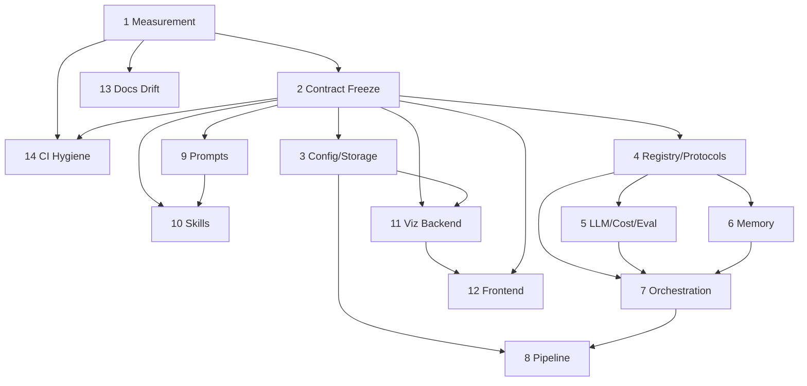

# ARI Refactoring Master Plan

> Planning document — no runtime code, prompt, config, workflow, frontend, or directory-name changes are made by this file.
> Repo root: `/home/t-kotama/workplace/ARI` · `ari-core` version `0.9.0` · branch `main` · planning date `2026-07-01`.

## 1. Purpose

The purpose of this master plan is not to modify ARI directly, but to produce a set of subtask planning documents that let ARI be improved incrementally and safely.

This document is the index and governing policy for a family of **14 sibling planning documents** (`001`–`014`) that live beside it in `docs/refactoring/`. Those sibling documents do not exist yet — the current tree contains only `docs/refactoring/000_master_refactoring_plan.md` (this file) plus two empty workspace directories, `docs/refactoring/subtasks/` and `docs/refactoring/reports/`. Producing `001`–`014` is a later planning step; this master plan defines their number, boundaries, ordering, and the acceptance rules every one of them must satisfy.

The refactoring is decomposed into **14 phases** and **73 subtasks**. Each phase maps 1:1 to one sibling planning document:

| Doc | Phase | Title | Subtasks |
|-----|-------|-------|----------|
| `001` | Phase 1 | Measurement & Quality-Gate Foundation | 5 |
| `002` | Phase 2 | Contract Surface Freeze | 6 |
| `003` | Phase 3 | Config & Path/Storage Consolidation | 6 |
| `004` | Phase 4 | Registry, Protocols & Dependency Seams | 4 |
| `005` | Phase 5 | LLM, Cost & Evaluator Backend Hardening | 5 |
| `006` | Phase 6 | Memory Subsystem Unification | 4 |
| `007` | Phase 7 | Orchestration Core Decomposition | 7 |
| `008` | Phase 8 | Pipeline / Workflow Driver Extraction | 6 |
| `009` | Phase 9 | Prompt Externalization & Loader Unification | 5 |
| `010` | Phase 10 | Skill Package Consistency | 6 |
| `011` | Phase 11 | Dashboard Backend Layering | 5 |
| `012` | Phase 12 | Frontend Decomposition & UX Safety | 6 |
| `013` | Phase 13 | Docs / Report Coupling & Drift Repair | 4 |
| `014` | Phase 14 | Repository & CI Hygiene | 4 |
| — | — | **Total** | **73** |

Every phase is designed so that its subtasks are individually small, independently reviewable, and — with the exception of the two hygiene phases — behaviour-preserving behind the contracts frozen in Phase 2. The plan front-loads *measurement* (Phase 1) and *contract snapshotting* (Phase 2) precisely so that all later structural work has an automated safety net before any internal code moves.

## 2. Scope

In scope for the planning effort documented here and in `001`–`014`:

- The Python core framework `ari-core/ari/` (**30,277 LOC** of production Python across 20+ subpackages; `viz/` alone is 8,131 LOC ≈ 27%).
- The **14** `ari-skill-*` MCP servers (≈ 25.5k LOC of `src/`), their manifests (`pyproject.toml` / `mcp.json` / `skill.yaml`), and their `ari-core` touchpoints.
- The dashboard backend (`ari-core/ari/viz/`, stdlib `http.server`) and the React + TypeScript frontend (`ari-core/ari/viz/frontend/`).
- Configuration and storage layout: the `config/`/`configs/`/top-level `config/` trio, `PathManager`, checkpoint format, and the `checkpoints/` vs `workspace/` split.
- Prompt assets (`ari-core/ari/prompts/` + skill-local prompts + still-inline prompts).
- Quality tooling under `scripts/` and the 5 workflows under `.github/workflows/`.
- Docs/report coupling (`docs/`, `report/`) only where it intersects source-drift gates.

Out of scope conceptually but referenced for guard design: the LaTeX/HTML `report/` build tree and the VitePress `docs/` site are treated as *contracts to preserve*, not refactor targets.

## 3. Non-Goals

- **No runtime behaviour change** in Phases 2–13. The only phases that intentionally add new files to the repository outside `docs/refactoring/` are the tooling/hygiene phases (1 and 14), and even there the deliverables are *plans* until a separate implementation pass is authorized.
- **No `deprecated`-marking of internal code.** The word "deprecated" is reserved in this plan for external contracts only (see §4).
- **No rewrite of the 5 existing workflows.** New CI is additive.
- **No dependency-version bumps, no `requirements.lock` regeneration** as part of structural refactoring.
- **No `sonfigs/` work.** There is **no `sonfigs/` directory anywhere in the repository** (`find -iname '*sonfig*'` returns nothing); the "config/configs/sonfigs" phrasing from earlier prompts is a hypothesized typo and is called out as such wherever the config trio is discussed. The real trio is `ari-core/ari/config/` (Python code) vs `ari-core/ari/configs/` (packaged data) vs `ari-core/config/` (rubric/profile/workflow data).
- **No migration of git-tracked runtime storage.** `checkpoints/`, `experiments/`, `workspace/` are all git-ignored (`.gitignore` lines 26, 31, 70, 83, 84); a storage-layout consolidation therefore has zero git-tracking migration cost.

## 4. Contract Preservation Policy

The following surfaces are **contracts**. No sibling document may propose breaking them without an explicit **compatibility-adapter note** describing how existing callers continue to work unchanged. The word *deprecated* may be used only for items in this list.

1. **CLI** — single console script `ari = ari.cli:app` (`ari-core/pyproject.toml`). All top-level command names and their option flags/env-var side effects are frozen: `clone`, `run`, `resume`, `paper`, `status`, `skills-list`, `viz`, `projects`, `show`, `delete`, `settings`, plus the `memory` / `ear` / `registry` / `migrate` sub-typers. Note the command order is pinned by `_reorder_commands_for_compat()` (`ari/cli/__init__.py:148-170`).
2. **Public Python API** — `ari.public.*`: `claim_gate`, `config_schema`, `container`, `cost_tracker`, `llm`, `paths`, `run_env`, `verified_context` (8 modules, 148 LOC total). Every re-exported symbol is frozen even though `ari/public/__init__.py` is docstring-only and re-exports nothing at package level.
3. **MCP tool contracts** — the tool `name`, `inputSchema`, the `{"result": ...}` / `{"error": ...}` return envelope from `MCPClient.call_tool()`, and the `mcp__<skill>__<tool>` fully-qualified naming (`ari/mcp/client.py`). The flat single-namespace tool naming (with its silent cross-skill collision, last-skill-wins) is preserved as observed behaviour unless a subtask explicitly adapts it.
4. **Dashboard API** — every endpoint path + method served by `ari/viz/routes.py` and the `api_*.py` handlers, and the WebSocket `{"type":"update",...}` message on `port+1`, as consumed by `frontend/src/services/api.ts` (863 LOC, ~90 wrappers).
5. **Checkpoint / output / config file formats** — the flat checkpoint directory and its `META_FILES` set (`ari/paths.py:51-76`), `tree.json`/`nodes_tree.json` precedence (`ari/checkpoint.py:86-137`), and all YAML/JSON under `ari-core/config/` and `ari-core/ari/configs/`.
6. **`ari-skill-*` → `ari-core` stable interface** — the lazy, optional, `try/except ImportError` consumption of `ari.public.*` (universally `cost_tracker`; also `claim_gate`, `container`, `run_env`, `verified_context`) and the intentional core→`ari_skill_memory` edge (`ari-core/pyproject.toml` comment lines 27–31; editable-installed by `setup.sh`).
7. **README / docs usage** — CLI table and REST endpoint table in `README.md` (and `.ja`/`.zh` mirrors), plus documented port `8765`, guarded by `check_readme_parity.py` and `check_doc_sources.py`.
8. **Scripts called by `.github/workflows/`** — the `scripts/docs/*` checkers, `scripts/readme_sync.py`, and `sync_report_pdf.sh`/`assemble_site.sh` invoked by the 5 workflows.

**Classification vocabulary.** Every subtask target is tagged with one of: `KEEP` (leave as-is; may only gain tests/guards), `ADAPT` (change internals behind a preserved contract), `MERGE` (fold duplicate implementations together), `MOVE_TO_LEGACY` (relocate to an explicitly legacy location with a shim), `DELETE_CANDIDATE` (proposed for removal pending confirmation of no live callers), `REVIEW_REQUIRED` (decision needs a human/architect ruling before any move).

## 5. Current Risk Areas

Grounded, repository-specific hotspots that motivate the phase structure. Every item was verified by inline inspection on the planning date.

1. **The config trio is confusable, not corrupt.** Three real directories with near-identical names and unrelated content coexist: `ari-core/ari/config/` (Python: `finder.py` 146 LOC + `__init__.py` 628 LOC of Pydantic models + env glue), `ari-core/ari/configs/` (packaged data: `defaults.yaml`, `model_prices.yaml`, `_loader.py`), and `ari-core/config/` (rubric/profile/workflow data: `default.yaml`, `workflow.yaml`, `profiles/`, `paperbench_rubrics/`, 23 `reviewer_rubrics/*.yaml`). Two different "defaults" files (`configs/defaults.yaml` vs `config/default.yaml`) carry unrelated content. **`sonfigs/` does not exist.** (Phase 3.)
2. **Root `checkpoints/` vs `workspace/` split.** An empty root-level `checkpoints/` dir (legacy) coexists with populated `workspace/checkpoints/<ts_slug>/`, `workspace/experiments/`, `workspace/staging/`. The workspace root disagrees between code and data: `ari/config/__init__.py:588-592` defaults to `{repo_root}/workspace/checkpoints/...` while `ari-core/config/default.yaml:14,39` still say `./checkpoints/{run_id}/`. Checkpoints are flat directories of ~45 sibling files with no `artifacts/`/`traces/`/`reports/` subdivision. (Phase 3.)
3. **2,956-LOC skill server.** `ari-skill-paper/src/server.py` is the largest Python file in the repo (14 `@mcp.tool` decorators, 5 inline "You are…" prompts). Runner-up skill servers: `ari-skill-transform/src/server.py` (2,465) and the vendored bridge `ari-skill-paper-re/src/_paperbench_bridge.py` (2,376). (Phases 9, 10.)
4. **1,630-LOC agent loop.** `ari-core/ari/agent/loop.py` — `AgentLoop.run` is a single ~1,170-line method mixing prompt assembly, window management, file I/O, evaluation (3 duplicated `evaluate_sync` blocks), memory writes (5 near-identical "RESULT SUMMARY" blocks), and a giant domain-specific tool-dispatch router (L950-1318). A second, cleaner generic ReAct loop already exists in `ari/agent/react_driver.py` (442 LOC) — evidence of duplication. (Phase 7.)
5. **1,197-LOC viz routes.** `ari-core/ari/viz/routes.py` dispatches ~86 GET + ~51 POST branches via a hand-rolled `if/elif` chain on `self.path`, with a ~450-line inline `/state` builder (L219-666) doing filesystem I/O, YAML merging, and reaching into module globals. No routing table, no auth, no DTOs. An abandoned declarative `WIZARD_ROUTES` dict (`api_wizard.py:30`) shows prior intent. (Phase 11.)
6. **1,590-LOC frontend god-file.** `frontend/src/components/Results/resultSections.tsx` (6 exported render-fns, incl. a 460-line `renderReviewScores`). Adjacent offenders: `Wizard/StepResources.tsx` (1,160), `Settings/SettingsPage.tsx` (1,049, single component), `Workflow/WorkflowPage.tsx` (964), `services/api.ts` (863). (Phase 12.)
7. **"Committed `node_modules`" — CORRECTION.** This commonly-cited risk item is **false in the current tree.** `git ls-files ari-core/ari/viz/frontend/node_modules` returns **0**; `.gitignore` ignores it at lines 112/113 (and `docs/node_modules/` at 135). `node_modules/` exists only as a normal on-disk install (112 MB). Likewise no `__pycache__`/`.venv` is tracked anywhere. The real, confirmed hygiene nits are minor: **i18n key drift** (`frontend/src/i18n/en.ts` 444 lines vs `ja.ts`/`zh.ts` 441 each) and broken `docs/_archive/` references (see item 9). (Phases 12, 14.)
8. **Inline prompts remain despite partial externalization.** `ari-core/ari/prompts/` holds 11 externalized `.md` templates loaded via `FilesystemPromptLoader`, but substantial system prompts stay hardcoded in Python: `ari-skill-paper/src/server.py` (5), `ari-skill-plot/src/server.py` (3), `ari-skill-evaluator/src/server.py` (2), plus vlm/web/transform (2 each). Skills load their own prompts via ad-hoc `Path.read_text()`, bypassing the versioned loader. (Phase 9.)
9. **No PR/issue templates and minimal repo governance.** `.github/` contains **only** `workflows/` (5 files). Confirmed absent: `ISSUE_TEMPLATE/`, `PULL_REQUEST_TEMPLATE.md`, `dependabot.yml`, `CODEOWNERS`, `.github/actions/`. All CI gating today is documentation/i18n-oriented; only `refactor-guards.yml` touches Python (a `~/.ari` write/diff guard). No workflow runs ruff, complexity, import-boundary, public-API, or viz-schema checks. Separately, `docs/README.md` (lines 86, 135) still links a removed `docs/_archive/refactor_audit.md`, and `reference/environment_variables.md:211` documents an `~/.ari/agent.env` fallback that contradicts the v0.5.0 checkpoint-scoping stated elsewhere in the same file. (Phases 13, 14.)

Cross-cutting measurement facts driving thresholds: **radon is NOT installed**; **ruff 0.15.2 IS available** and reports **661 findings** on `ari-core` (341 `F401`, 135 `E402`, …), of which 358 are auto-fixable; **no cyclomatic-complexity data exists** (ruff `C901` not selected, radon absent); node + npm available (no pnpm).

## 6. Refactoring Principles

- **P1 — Contracts before code.** No structural move lands before its surface is snapshotted by a Phase-2 guard. Guards are diff-vs-`base.sha` where possible (see §11), not `origin/<base_ref>` (which `docs-change-coupling.yml` lines 42-47 explicitly critique as movable mid-run).
- **P2 — Determinism is a hard constraint.** ARI design principle P2 (determinism) governs: no subtask may introduce nondeterminism into components that declare "no LLM calls" (e.g. `ari-skill-memory`, `claim_evidence_hard_gate`). Prompt externalization must preserve `load_versioned()` sha-pinning.
- **P3 — Seams over rewrites.** Prefer extracting a Protocol/adapter at an existing seam (`ari/protocols/` already names `LLMClient, MCPClient, MemoryClient, NodeStore, StageRunner` as a roadmap) over rewriting a subsystem. Reuse the one real dict-registry pattern already in code (`_COMPOSITES`, `llm_evaluator.py:165`).
- **P4 — Behaviour-preserving by default.** Every ADAPT/MERGE subtask is paired with a characterization test or a golden-file snapshot proving byte- or behaviour-equivalence.
- **P5 — Additive extensibility.** New capabilities (version export, retry, registry) are added without removing or renaming existing symbols; removals are `DELETE_CANDIDATE` items requiring a separate confirmation pass.
- **P6 — One concern per subtask.** Subtasks are sized to touch a single file cluster and land as a single reviewable PR.
- **P7 — Ground every claim.** Sibling docs cite real paths + line numbers; anything unverified is marked "unconfirmed"; anything absent is written "does not exist".

## 7. Phase Overview

| # | Phase | Primary targets | Dominant tags | Depends on |
|---|-------|-----------------|---------------|------------|
| 1 | Measurement & Quality-Gate Foundation | `scripts/`, ruff baseline, complexity tool | ADAPT, KEEP | — |
| 2 | Contract Surface Freeze | `ari.public.*`, CLI tree, MCP tools, viz↔`api.ts` | KEEP, ADAPT | 1 |
| 3 | Config & Path/Storage Consolidation | config trio, `PathManager`, `checkpoints/` | ADAPT, MOVE_TO_LEGACY, REVIEW_REQUIRED | 2 |
| 4 | Registry, Protocols & Dependency Seams | `ari/protocols/`, 3 string dispatchers | ADAPT, MERGE | 2 |
| 5 | LLM, Cost & Evaluator Backend Hardening | `ari/llm/`, `cost_tracker.py`, `ari/evaluator/` | ADAPT | 4 |
| 6 | Memory Subsystem Unification | `ari/memory/`, `ari_skill_memory` edge | MERGE, ADAPT, REVIEW_REQUIRED | 4 |
| 7 | Orchestration Core Decomposition | `agent/loop.py`, `orchestrator/bfts.py`, `cli/bfts_loop.py` | ADAPT, MERGE | 4, 5, 6 |
| 8 | Pipeline / Workflow Driver Extraction | `pipeline/orchestrator.py`, `viz/api_paperbench_worker.py` | ADAPT, MERGE, MOVE_TO_LEGACY | 3, 7 |
| 9 | Prompt Externalization & Loader Unification | inline prompts, `ari/prompts/`, skill prompts | ADAPT, MERGE, KEEP, REVIEW_REQUIRED | 2 |
| 10 | Skill Package Consistency | 14 `ari-skill-*` manifests/servers | ADAPT, MERGE, REVIEW_REQUIRED | 2, 4, 9 |
| 11 | Dashboard Backend Layering | `viz/routes.py`, `api_*.py` | ADAPT | 2, 3 |
| 12 | Frontend Decomposition & UX Safety | `resultSections.tsx`, `StepResources.tsx`, `api.ts` | ADAPT, REVIEW_REQUIRED | 2, 11 |
| 13 | Docs / Report Coupling & Drift Repair | `docs/`, `report/` drift gates | ADAPT, DELETE_CANDIDATE | 1 |
| 14 | Repository & CI Hygiene | `.github/`, templates, aggregated report | KEEP (additive) | 1, 2 |

## 8. Subtask Groups

Subtask IDs follow `ST-<phase>-<n>`. Each carries a classification tag and grounding.

### Phase 1 — Measurement & Quality-Gate Foundation (`001`, 5 subtasks)

- **ST-1-1** `REVIEW_REQUIRED` — Select the complexity engine. radon is not installed; ruff 0.15.2 is. Decide between installing radon vs enabling ruff `C901`. Neither exists today, so cyclomatic complexity is currently an unmeasured baseline of zero.
- **ST-1-2** `ADAPT` (design only) — Plan `scripts/check_complexity.py` with data-derived LOC gates **>500 warn / >800 review / >1200 split-required** (yields ~15 prod-Python offenders >800, 5 >1200; 5 frontend >800, 1 >1200). Confirmed MISSING (not present anywhere).
- **ST-1-3** `KEEP` — Freeze the ruff baseline: **661 findings, 341 `F401`**. Define a ratchet policy (no new findings) without running `ruff --fix` yet; the one-shot fix (clears 358) is deferred to a supervised implementation pass, not this planning phase.
- **ST-1-4** `ADAPT` (design only) — Plan `scripts/generate_quality_report.py` aggregating the existing `--json`-emitting checkers (every `scripts/docs/*` checker already supports `--json`). MISSING today; nothing aggregates.
- **ST-1-5** `REVIEW_REQUIRED` — Decide the test-vs-prod inclusion policy for all thresholds. Test files dominate (`tests/test_server.py` 1844, `test_gui_errors.py` 1650, `test_workflow_contract.py` 1606) and would swamp any global LOC gate.

### Phase 2 — Contract Surface Freeze (`002`, 6 subtasks)

- **ST-2-1** `KEEP` — Snapshot the `ari.public.*` symbol set (8 modules, §4.2) into `scripts/check_public_api_contracts.py`. MISSING today.
- **ST-2-2** `KEEP` — Snapshot the CLI command tree, option flags, and env-var side effects (`ARI_IDEA_VIRSCI_*`, `ARI_RUBRIC`, `ARI_FEWSHOT_MODE`, …), including sub-typers hidden behind `try/except Exception` import guards (`cli/__init__.py:82-100`) that can silently drop whole command groups.
- **ST-2-3** `KEEP` — Snapshot MCP tool `name`+`inputSchema`+return envelope. Flag (do not yet fix) the flat single-namespace collision in `MCPClient._tool_registry` (last-skill-wins).
- **ST-2-4** `ADAPT` (design only) — Plan `scripts/check_viz_api_schema.py` coupling `viz/routes.py`+`api_*.py` endpoints to `frontend/src/services/api.ts`. MISSING; no gate ties them today.
- **ST-2-5** `ADAPT` (design only) — Plan `scripts/check_import_boundaries.py` enforcing the core↔skill and `ari.public` boundary, flagging the 4 confirmed violations (idea→`ari.lineage`, paper-re→`ari.clone`, transform→`ari.orchestrator`+`ari.publish`). Reuse `refactor-guards.yml`'s merge-base diff idiom and path allow-list convention.
- **ST-2-6** `ADAPT` — Populate `ari/__init__.py` with `__version__` (currently 0 bytes; version lives only in the manifest) and decide whether `ari.public.__init__` should re-export submodule symbols (README says "import from `ari.public.*`" but the package re-exports nothing). Purely additive.

### Phase 3 — Config & Path/Storage Consolidation (`003`, 6 subtasks)

- **ST-3-1** `ADAPT` (design only) — Plan `scripts/check_directory_policy.py` for placement/naming policy over the `config/`/`configs/`/`config/` trio (the MISSING placement half that `readme_sync.py` does not cover). State explicitly that `sonfigs/` does not exist.
- **ST-3-2** `REVIEW_REQUIRED` — Reconcile the workspace-root disagreement: `config/__init__.py:588-592` (`workspace/checkpoints/`) vs `config/default.yaml:14,39` (`./checkpoints/`).
- **ST-3-3** `MOVE_TO_LEGACY` / `DELETE_CANDIDATE` — Root `checkpoints/` is empty and appears purely legacy; whether any code writes to it is unconfirmed. Propose a shim + removal pending confirmation.
- **ST-3-4** `ADAPT` — Design the `runs/<id>/{workspace,checkpoints,artifacts,traces,reports}` consolidation behind `PathManager`, preserving `META_FILES` and `tree.json`/`nodes_tree.json` precedence (checkpoint-format contract, §4.5). Zero git-tracking migration cost (all runtime dirs are git-ignored).
- **ST-3-5** `MERGE` — Collapse the 3+ duplicated `config/workflow.yaml` discovery sites (`core.py:252-259`, `orchestrator.py:328-336`, `cli/lineage.py:57-60`) into one `WorkflowLocator`.
- **ST-3-6** `REVIEW_REQUIRED` — Resolve the two unrelated "defaults" files (`ari/configs/defaults.yaml` vs `config/default.yaml`) and the four-tier `finder.find_workflow_yaml` fallback order (`finder.py:60-100`).

### Phase 4 — Registry, Protocols & Dependency Seams (`004`, 4 subtasks)

- **ST-4-1** `REVIEW_REQUIRED` — Disambiguate naming: `ari/registry/` is an **HTTP artifact registry** (FastAPI, curated EAR bundles), NOT a DI/component registry. Any "BaseRegistry" target must avoid this collision.
- **ST-4-2** `ADAPT` — Extend `ari/protocols/` per its own documented roadmap (`__init__.py` docstring names `LLMClient, MCPClient, MemoryClient, NodeStore, StageRunner` as "subsequent phases").
- **ST-4-3** `MERGE` — Unify the 3 ad-hoc string-keyed dispatchers under one registry pattern: `publish/_load_backend` if/elif (`publish/__init__.py:198`), `_COMPOSITES` dict (`llm_evaluator.py:165`), `resolve_litellm_model` (`llm/routing.py:37`). Treat the 4 string-referenced `publish/backends/*.py` as live (not dead) code.
- **ST-4-4** `REVIEW_REQUIRED` — Unify Protocol-vs-ABC convention: `MemoryClient` is an ABC (`memory/client.py:8`) yet `memory/__init__.py` calls it a "protocol"; `Evaluator`/`ConfigLoader`/`PromptLoader` are `Protocol`s.

### Phase 5 — LLM, Cost & Evaluator Backend Hardening (`005`, 5 subtasks)

- **ST-5-1** `ADAPT` — Route `LLMEvaluator.evaluate` through `LLMClient` instead of calling `litellm.acompletion` directly (`llm_evaluator.py:585`), so provider routing uses `resolve_litellm_model`, not the global monkeypatch.
- **ST-5-2** `ADAPT` — Add retry/backoff and configurable timeouts. None exist today; timeouts are hardcoded (`client.py:180` 1800, `llm_evaluator.py:535` 120, shim `cli_server.py:74` 1800).
- **ST-5-3** `ADAPT` — Fix two cost-tracking data losses: `CallRecord.latency_ms` never populated despite available `start/end_time` (`cost_tracker.py:406`), and `_reload_existing` dropping additive fields on restore (`cost_tracker.py:91`).
- **ST-5-4** `ADAPT` — Introduce `BaseCostTracker` / `BaseModelBackend` / `BaseEvaluator` behind `ari/protocols/`; none exist today (`CostTracker`, `LLMClient`, `LLMEvaluator` are all concrete).
- **ST-5-5** `REVIEW_REQUIRED` — Isolate/contain the process-wide `litellm.completion/acompletion` monkeypatch installed at `init()` (`cost_tracker.py:288,312-326`); preserve capture behaviour.

### Phase 6 — Memory Subsystem Unification (`006`, 4 subtasks)

- **ST-6-1** `MERGE` / `REVIEW_REQUIRED` — Reconcile the two parallel abstractions: core `MemoryClient` ABC (`memory/client.py:8`, `add/search/get_all`) vs skill `MemoryBackend` ABC (`ari_skill_memory/backends/base.py:8`, much richer, `react_*`/`bulk_import`). Divergence may be intentional (unconfirmed).
- **ST-6-2** `ADAPT` — Resolve the `FileMemoryClient` JSON-vs-JSONL mismatch: `_load` parses one JSON array (`file_client.py:44`) while the canonical store is `memory_store.jsonl` (line-wise). Runtime impact unconfirmed.
- **ST-6-3** `ADAPT` — Consolidate the ~13 core→`ari_skill_memory.backends.get_backend` import sites behind a single adapter, preserving the intentional core→skill edge (§4.6).
- **ST-6-4** `KEEP` — Document/formalize the bidirectional edge (`letta_backend.py:157` lazily imports `ari.public.cost_tracker`) without breaking it.

### Phase 7 — Orchestration Core Decomposition (`007`, 7 subtasks)

- **ST-7-1** `ADAPT` — Extract `BFTSPromptBuilder` from `bfts.py` `expand` context serialization (L604-760) + candidate descriptions (L451-470, L537-550); leave `BFTS` as pure ranking/selection.
- **ST-7-2** `ADAPT` — Introduce a NodeReport repository behind an injected store, removing BFTS↔filesystem/`ari.paths` coupling (`_resolve_pm_and_run_id`/`_get_node_report`/`_load_sibling_node_reports`, L43-416).
- **ST-7-3** `ADAPT` — Decompose the ~1,170-line `AgentLoop.run` into `PromptAssembler` (L489-621), `MessageWindow` (partial today: `_build_safe_window`/`repair_tool_message_order`), and a `ToolResultRouter` for the domain dispatch router (L950-1318).
- **ST-7-4** `MERGE` — Dedup the 3 `evaluate_sync` blocks (L1454/1532/1600) and 5 "RESULT SUMMARY" `add_memory` blocks into a `NodeEvaluationPersister`.
- **ST-7-5** `MERGE` — Unify the two ReAct implementations: `agent/loop.py` (1630) vs `agent/react_driver.py` (442, used by `pipeline/stage_runner.py:143`).
- **ST-7-6** `ADAPT` — Pull workspace/persistence out of `cli/bfts_loop.py::_run_loop` (file-copy L398-517, sterile detection L631-661, node_report/checkpoint writes, lineage hooks) so `_run_loop` is pure scheduling.
- **ST-7-7** `ADAPT` — Slim `core.py::build_runtime` (composition root) by extracting rubric YAML loading (`_load_rubric_dict_for_axes` L23-55) and `generate_paper_section` dispatch (L235-283).

### Phase 8 — Pipeline / Workflow Driver Extraction (`008`, 6 subtasks)

- **ST-8-1** `ADAPT` — Introduce `BasePipelineStage` (`resolve_inputs/should_skip/run/persist_outputs/evaluate_loopback`) with `SubprocessMCPStage`/`ReActStage` subclasses replacing the `if stage_cfg.get("react")` fork (`orchestrator.py:691`). No stage classes exist today — a "stage" is a plain dict from `workflow.yaml`.
- **ST-8-2** `ADAPT` — Extract `BaseWorkflowDriver` owning the `_stage_idx` loop, `tpl_vars`/`stage_outputs` state, loop-back cursor, and the BFTS sanity gate (`orchestrator.py:505-537`), replacing the 913-LOC `run_pipeline` god function.
- **ST-8-3** `MERGE` — Fold the duplicate pipeline `viz/api_paperbench_worker.py:168 _run_pipeline` into the single driver from ST-8-2.
- **ST-8-4** `ADAPT` — Add a `StageContext` value object to kill manual dict threading; move the type-sniffing output writer (`.tex`/`.pdf` side effects, `orchestrator.py:757-826`) into a `persist()`/`OutputSink`.
- **ST-8-5** `ADAPT` — Introduce a path registry for the hardwired filenames (`nodes_tree.json`, `science_data.json`, `full_paper.tex`, `publish_record.json`, `manifest.lock`, …).
- **ST-8-6** `MOVE_TO_LEGACY` / `REVIEW_REQUIRED` — The ReAct stage path is dormant in the default config (`grep -c 'react:' config/workflow.yaml == 0`; exercised only by tests/per-checkpoint YAML, unconfirmed which). Also flag the core→viz dependency `cli/lineage.py:151 → viz.api_orchestrator._api_launch_sub_experiment` for inversion.

### Phase 9 — Prompt Externalization & Loader Unification (`009`, 5 subtasks)

- **ST-9-1** `ADAPT` (design only) — Plan `scripts/check_prompts.py` inline-prompt inventory scan (the externalization slice is NEW; the snapshot slice OVERLAPS `report/scripts/check_prompt_snapshots.py` Gate 10 — note this to avoid duplication).
- **ST-9-2** `ADAPT` — Extract high-value inline prompts to `.md` templates: `ari-skill-paper/src/server.py` (5, incl. `_GLOBAL_COHERENCE` at :2544), `ari-skill-evaluator/src/server.py` (`_SEMANTIC_SYSTEM_PROMPT` :790, `_METRIC_EXTRACT_SYS` :191), plot (3), vlm (2), web (2), transform (2).
- **ST-9-3** `MERGE` — Unify skill prompt loading: skills use ad-hoc `Path.read_text()` (paper-re, replicate), bypassing `FilesystemPromptLoader`'s `load_versioned()` sha-pinning (P2 reproducibility).
- **ST-9-4** `REVIEW_REQUIRED` — Consolidate overlapping "peer reviewer" prompts: `review_engine.py:79/443` vs core `evaluator/peer_review.md`; `_METRIC_EXTRACT_SYS` vs `evaluator/extract_metrics.md` (related but distinct scope).
- **ST-9-5** `KEEP` — Confirm KEEP_INLINE decisions: VirSci fallback prompts (`ari-skill-idea/src/server.py:252-266`, primary path execs vendored `utils/prompt.py`) and the vendored PaperBench templates in `_paperbench_bridge.py` (upstream parity).

### Phase 10 — Skill Package Consistency (`010`, 6 subtasks)

- **ST-10-1** `ADAPT` — Fix manifest triplication/version skew (paper-re 0.8.0/0.4.0/0.5.0 across pyproject/mcp.json/skill.yaml; evaluator 1.0.0 vs 0.4.1; replicate 0.2.0 vs 0.1.0). Adopt shared skill versioning.
- **ST-10-2** `ADAPT` — Sync stale `mcp.json` tool lists (memory advertises 4 vs 15 decorators; web 5 vs 9; paper 12 vs 14; coding/hpc/vlm/orchestrator list `[]`; transform has **no `mcp.json` at all**).
- **ST-10-3** `MERGE` / `REVIEW_REQUIRED` — Reconcile the two divergent MCP idioms (10 FastMCP `@mcp.tool` returning strings vs 4 low-level `mcp.server.Server` returning `list[TextContent]`) — a real refactor hazard with different return shapes. Preserve the `{result|error}` envelope contract.
- **ST-10-4** `ADAPT` — Fix the 4 boundary violations (idea→`ari.lineage`, paper-re→`ari.clone`, transform→`ari.orchestrator`+`ari.publish`) plus private fallbacks (coding→`ari.container`/`ari.agent.run_env`, hpc→`ari.agent.run_env`). Enforced by the ST-2-5 guard.
- **ST-10-5** `REVIEW_REQUIRED` — Reconcile `requires-python` fragmentation (3.10 / 3.11 / 3.13 across skills; core is `>=3.9`).
- **ST-10-6** `ADAPT` — Add the missing `ari-skill-orchestrator/pyproject.toml` (only `src/requirements.txt` today); remove/normalize the 2 unused/inconsistent `server:main` console scripts (replicate, paper-re); note transform's redundant `fastmcp` dep.

### Phase 11 — Dashboard Backend Layering (`011`, 5 subtasks)

- **ST-11-1** `ADAPT` — Replace the `if/elif` `do_GET`/`do_POST` dispatch (~137 branches) with a route registry, reviving the abandoned `WIZARD_ROUTES` intent (`api_wizard.py:30`). Preserve every endpoint path/method (§4.4).
- **ST-11-2** `ADAPT` — Extract the ~450-line inline `/state` builder (`routes.py:219-666`) into a `StateService` (removes in-route glob scans, YAML merging, `cost_trace.jsonl` tailing, `pidfile` access).
- **ST-11-3** `ADAPT` — Move subprocess/env orchestration into a launch service: `_api_run_stage` (Popen + 15+ `ARI_*` env mapping, `api_experiment.py:44-136`), `_api_launch`, `_api_launch_sub_experiment`.
- **ST-11-4** `ADAPT` — Introduce request DTOs + a unified `_json` response wrapper to reconcile the `{"ok":...}` vs `{"error":...}` split and the `_status` smuggling (`routes.py:1047-1057`). Wire-compatible.
- **ST-11-5** `ADAPT` — Wrap the in-handler internal imports (`ari.paths`, `ari.checkpoint`, `ari.config.auto_config`, `ari.llm.client`, `ari.clone`, `ari.container`, `ari_skill_memory.backends`) behind adapters so routes depend only on `ari.public.*`.

> Security posture (no auth/authz anywhere; `Access-Control-Allow-Origin: *`; hand-rolled per-handler path-traversal guards) is noted but is a **`REVIEW_REQUIRED` policy decision**, not a mechanical refactor; do not silently add auth.

### Phase 12 — Frontend Decomposition & UX Safety (`012`, 6 subtasks)

- **ST-12-1** `ADAPT` — Split `Results/resultSections.tsx` (1590; 6 render-fns incl. 460-line `renderReviewScores`).
- **ST-12-2** `ADAPT` — Split `Wizard/StepResources.tsx` (1160), `Settings/SettingsPage.tsx` (1049, one god-component with ~30 `useState`), `Workflow/WorkflowPage.tsx` (964).
- **ST-12-3** `ADAPT` — Split `services/api.ts` (863) by endpoint family and reconcile the two error regimes: `get/post` throw on non-2xx vs `pbGet/pbPost` return `{error}` bodies. Preserve wire behaviour (§4.4).
- **ST-12-4** `REVIEW_REQUIRED` — Settings/UX split: the `Settings` type declares `model_idea/bfts/coding/eval/paper/review` + `vlm_review_*` fields with **no UI** in SettingsPage (per-phase models live in `StepResources`); provider/model lists are hardcoded and stale (`settingsConstants.ts`, e.g. `gpt-5.2`, `claude-opus-4-5`).
- **ST-12-5** `REVIEW_REQUIRED` — Contain dangerous/raw-debug UI: DetailPanel "Raw" JSON tab, `/api/env-keys` returning real secret values to the browser, SLURM auto-resubmit (`gpuMonitorAction` always sends `confirmed:true`), `dangerouslySetInnerHTML` (`StepScope.tsx:137`, `main.tsx:38`). Policy decisions, not silent removals.
- **ST-12-6** `ADAPT` (design only) — Plan `scripts/check_dashboard_ux.py` covering React `i18n/{en,ja,zh}.ts` (only landing-JS `check_i18n_js.py` exists) and fix the i18n key drift (en 444 vs ja/zh 441).

### Phase 13 — Docs / Report Coupling & Drift Repair (`013`, 4 subtasks)

- **ST-13-1** `DELETE_CANDIDATE` — Repair the broken `docs/_archive/refactor_audit.md` links in `docs/README.md` (lines 86, 135). The dir was removed; VitePress `srcExclude` + `check_doc_sources` exempt `_archive`, so hard gates stay green and the broken markdown links drift silently (only advisory `check_doc_links` markdown mode catches them).
- **ST-13-2** `REVIEW_REQUIRED` — Resolve the `ARI_AGENT_ENV_PATH` → `~/.ari/agent.env` fallback (`reference/environment_variables.md:211`) contradicting the v0.5.0 checkpoint-scoping stated in the same file (:19), `guides/migration.md`, and `architecture.md:541`. Whether code still falls back is unconfirmed — verify against `config/__init__.py`/`paths.py` before editing.
- **ST-13-3** `REVIEW_REQUIRED` — Decide whether `docs/refactoring/` (this planning workspace) is in-scope for `check_doc_sources.py --require-all` coverage (unconfirmed interaction).
- **ST-13-4** `ADAPT` — Evaluate promoting the advisory markdown-link check to a hard gate (today only `check_doc_links.py --html-only` is hard) so drift like ST-13-1 is caught.

### Phase 14 — Repository & CI Hygiene (`014`, 4 subtasks)

- **ST-14-1** `KEEP` (additive) — Add `.github/PULL_REQUEST_TEMPLATE.md` and `.github/ISSUE_TEMPLATE/` (both confirmed absent). PR bodies/issues in English per repo convention.
- **ST-14-2** `KEEP` (additive) — Add `.github/dependabot.yml` and `CODEOWNERS` (both confirmed absent).
- **ST-14-3** `KEEP` — Record the node_modules correction (NOT tracked; `.gitignore` 112/113) and address the real hygiene nits: i18n key drift and the `docs/_archive` link rot (dovetails ST-12-6, ST-13-1).
- **ST-14-4** `KEEP` (additive) — Design one new additive source-hygiene workflow wiring the Phase-1/2 checkers (`check_complexity`, `check_import_boundaries`, `check_public_api_contracts`, `check_viz_api_schema`), using `github.event.pull_request.base.sha` (not `origin/<base_ref>`) and reusing `refactor-guards.yml`'s allow-list pattern. Do not rewrite the 5 existing workflows.

## 9. Dependency Graph

Phase-level dependencies (a phase must not start until its predecessors' guards/decisions are in place):

Critical-path observations:
- **Phase 2 is the universal gate** for all structural work (7 phases depend on it directly). Nothing in Phases 3–12 may begin until the contract snapshots exist.
- **Phase 7 has the deepest fan-in** (needs 4, 5, 6): the orchestration core touches LLM, cost, evaluator, and memory seams simultaneously.
- **Phases 1, 13, 14** form a mostly-independent "governance lane" that can proceed in parallel with the structural lane, sharing only the Phase-1 tooling foundation.
- **Phases 11 → 12** are the only backend→frontend ordering constraint (viz-schema guard must exist before frontend `api.ts` is split).

## 10. Execution Order

Recommended sequencing (waves may overlap where the graph permits):

1. **Wave A — Foundation:** Phase 1, then Phase 2. (Nothing structural before both land.)
2. **Wave B — Substrate:** Phase 3 (config/storage) and Phase 4 (registry/protocols) in parallel; Phase 9 (prompts, design + extraction) can begin here since it only needs Phase 2.
3. **Wave C — Backends:** Phase 5 then Phase 6 (both need Phase 4). Phase 13 (docs drift) runs opportunistically alongside.
4. **Wave D — Core:** Phase 7 (needs 4, 5, 6), then Phase 8 (needs 3, 7).
5. **Wave E — Skills & Surfaces:** Phase 10 (needs 2, 4, 9) parallel with Phase 11 (needs 2, 3).
6. **Wave F — Frontend & Governance:** Phase 12 (needs 2, 11), Phase 14 (needs 1, 2). Phase 14 CI is wired last so it can gate the accumulated tree.

Within each phase, execute subtasks in listed order; `REVIEW_REQUIRED` subtasks must receive an architect ruling before their dependent ADAPT/MERGE subtasks proceed.

## 11. Quality Gates

Every subtask PR must pass, in addition to the 5 existing workflows (`docs-change-coupling`, `docs-sync`, `pages`, `readme-sync`, `refactor-guards`):

1. **Existing green baseline** — `refactor-guards.yml`'s `no-home-ari-writes` (pytest under sandboxed `HOME`, no `~/.ari` creation) and `no-new-home-ari-refs` diff-grep must stay green.
2. **Contract snapshots unchanged** — the Phase-2 guards (`check_public_api_contracts`, CLI-tree snapshot, MCP-tool snapshot, `check_viz_api_schema`) must report no diff, unless the PR is an explicitly-flagged ADAPT with a compatibility-adapter note.
3. **Import boundaries** — `check_import_boundaries.py` must not report new violations (the 4 known ones are burned down only in Phase 10).
4. **Complexity ratchet** — no file crosses a higher tier from ST-1-2's gates (>500/>800/>1200); the ruff `F401`-heavy baseline (661) may only decrease.
5. **Behaviour preservation (P4)** — each ADAPT/MERGE ships a characterization test or golden snapshot; prompt extraction (Phase 9) must preserve `load_versioned()` sha output.
6. **Determinism (P2)** — subtasks touching `ari-skill-memory` or the hard gate must not introduce LLM calls.
7. **Docs co-change** — `check_doc_sources.py` / `check_readme_parity.py` / `check_report_cochange.py` stay green; any moved source that a doc's `sources:` cites must bump `last_verified` (advisory `check_ref_coupling.py`).
8. **Build gates** — `docs:build` (VitePress) and the frontend `npm run typecheck` + `test` (Vitest) succeed where touched.

New CI is **additive** and diff-scoped to `github.event.pull_request.base.sha`.

## 12. Rollback Strategy

- **Per-subtask isolation (P6):** each subtask is a single squash-mergeable PR on a `refactoring`-family branch (the only workflow targeting `refactoring` branches is `refactor-guards.yml`), so rollback is a single `git revert` with no cross-PR entanglement.
- **Contract-first tripwire:** because Phase 2 snapshots land before any structural change, an unintended contract break surfaces as a red guard on the offending PR — revert that PR, not a subsystem.
- **Adapter retention:** every ADAPT keeps the old symbol/path callable via a shim until a later `DELETE_CANDIDATE` confirmation pass; reverting the shim-removal PR restores the old surface without touching the new internals.
- **Storage safety:** the Phase-3 `runs/<id>/...` consolidation is git-ignored runtime state with a compatibility resolver in `PathManager`; rollback is code-only (no tracked-data migration to unwind).
- **Legacy staging:** `MOVE_TO_LEGACY` items relocate rather than delete, so restoration is a path move; `DELETE_CANDIDATE` items are never removed in the same PR that stops using them.
- **Golden baselines:** the characterization tests/snapshots from §11.5 double as the rollback oracle — if a revert is needed, the pre-refactor golden confirms restoration.

## 13. Definition of Done

The master-plan effort (this file + producing `001`–`014`) is done when:

- [ ] All **14 sibling planning documents** (`001`–`014`) exist in `docs/refactoring/`, one per phase, each enumerating its subtasks from §8 with per-subtask acceptance criteria, affected file paths + line counts, and a classification tag.
- [ ] The **73 subtasks** are fully allocated (5+6+6+4+5+4+7+6+5+6+5+6+4+4) with no orphan or duplicate IDs.
- [ ] Every contract in §4 is covered by at least one Phase-2 snapshot/guard plan, and every proposed contract-adjacent change carries a compatibility-adapter note.
- [ ] Each of the 9 Current Risk Areas (§5) maps to at least one subtask, including the explicit **node_modules correction** and the **no-`sonfigs/`** statement.
- [ ] Every `REVIEW_REQUIRED` item names the decision owner and the artifact to inspect before proceeding.
- [ ] No planning document proposes runtime code, prompt, config, workflow, frontend, or directory-name changes as part of *this* phase; all such work is deferred to a separately-authorized implementation pass.
- [ ] The plan is internally consistent with the grounded facts (all cited paths/line counts verified or marked "unconfirmed"; absent paths written as "does not exist").

An individual **subtask** is done when its PR satisfies all §11 quality gates, ships its §11.5 behaviour-preservation artifact, updates the relevant per-directory `README.md` (`readme_sync.py --check`), and preserves every §4 contract (or documents the adapter that does).

## Retirement Condition

This is a **program-level planning document**, not a per-subtask artifact. It
stays live for the duration of the refactoring program and may be archived or
deleted (`git rm`) only after **all** of the following are verified against
primary sources — never on assumption:

1. Every subtask this document governs is marked **DONE** in
   `docs/refactoring/007_subtask_index.md`, **or** this document has been
   explicitly **superseded** by a named replacement (the superseding document
   must reference this file by name).
2. Any conclusions worth keeping have been folded into the permanent
   documentation / architecture.

Before any `git rm`, re-read this document's own conditions and check each one
against the current repository. See the canonical policy in
`docs/refactoring/007_subtask_index.md` ("Document Retirement Policy").
