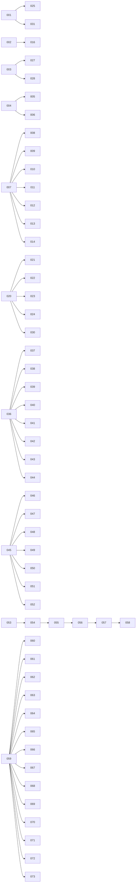

# 007 — Subtask Index

Planning document for the ARI refactoring program. **PLANNING ONLY** — this file
does not change any runtime code, imports, prompts, configs, workflows, frontend,
or directory names. It is the master index for subtasks **001–073**.

- Repo root: `/home/t-kotama/workplace/ARI` (git branch `main`; `ari-core` version `0.9.0`).
- Canonical language: English.
- Classification vocabulary used below: **KEEP / ADAPT / MERGE / MOVE_TO_LEGACY /
  DELETE_CANDIDATE / REVIEW_REQUIRED**. The word "deprecated" is reserved for
  external contracts only (public API, CLI, MCP, dashboard API, documented import
  paths, ari-skill stable interfaces).

**Contracts that must not be broken by any downstream implementation phase**
(a compatibility-adapter note is required wherever a subtask touches these):

- CLI console script `ari = ari.cli:app` and every subcommand / option / env-var side effect.
- `ari.public.*` API surface (`claim_gate, config_schema, container, cost_tracker, llm, paths, run_env, verified_context`).
- MCP tool contracts across the 14 `ari-skill-*` servers (tool names, `inputSchema`, the `{"result"|"error"}` envelope, `mcp__<skill>__<tool>` naming).
- Dashboard API endpoints/JSON shapes in `ari-core/ari/viz/routes.py` + `api_*.py`, consumed by `frontend/src/services/api.ts` and the WebSocket channel.
- Checkpoint / output / config file formats (`ari/checkpoint.py`; YAML under `ari-core/config/` and `ari-core/ari/configs/`).
- `ari-skill-*` → `ari-core` stable interface (the `ari.public.*` touchpoints; the core→skill `ari_skill_memory` edge).
- README / docs usage examples, and the scripts invoked by `.github/workflows/`.

> Naming note carried through this whole index: **there is NO `sonfigs/` directory
> anywhere in the repo** (`find -iname '*sonfig*'` returns nothing). The
> "config/configs/sonfigs" concern is really the confusable trio
> `ari-core/ari/config/` (Python discovery code), `ari-core/ari/configs/` (packaged
> defaults data + loader), and `ari-core/config/` (rubric/profile/workflow data).
> There is also **no top-level `pyproject.toml`** (`ari-core/pyproject.toml` is the
> core manifest).

---

## Summary Table

Legend — **Runtime Code Change?**: `Yes` = the subtask, when executed, edits code
that ships inside the runtime (`ari` package, `ari-skill-*` servers, or the
dashboard frontend); `No` = the subtask only produces inventories, checker
scripts, tests, CI config, repo hygiene config, or planning/design docs.
**Can Run Independently?**: `Yes` = no explicit predecessor edge in the dependency
graph **and** not a runtime change; `No` = has a predecessor edge, or is a runtime
change gated by the nine inventory subtasks (see the dedicated section).
**Depends On** reflects only the explicit edges in the provided dependency graph.

| ID | Title | Phase | Risk | Depends On | Primary Output | Runtime Code Change? | Can Run Independently? |
|----|-------|-------|------|-----------|----------------|----------------------|------------------------|
| 001 | measure_complexity_and_dependencies | 1 | Low | — | LOC/ruff/import-graph baseline report | No | Yes |
| 002 | inventory_legacy_obsolete_and_duplicate_code | 1 | Low | — | Legacy/obsolete/duplicate-code inventory | No | Yes |
| 003 | consolidate_config_configs_sonfigs | 2 | High | — | Consolidated config layout + import shim | Yes | No |
| 004 | define_runtime_path_policy | 2 | Low | — | Runtime-path policy doc | No | Yes |
| 005 | consolidate_checkpoint_workspace_experiment_paths | 2 | High | 004 | Unified run-dir layout + migration | Yes | No |
| 006 | introduce_runtime_path_resolver | 2 | Medium | 004 | `RuntimePathResolver` behind `PathManager` | Yes | No |
| 007 | define_core_interfaces_and_protocols | 3 | Low | — | Core Protocol/interface design + stubs | No | Yes |
| 008 | extract_model_backend_interface | 3 | High | 007 | `BaseModelBackend` + `LLMClient` adapter | Yes | No |
| 009 | extract_evaluator_interface | 3 | Medium | 007 | Formalized `Evaluator` interface | Yes | No |
| 010 | extract_artifact_checkpoint_trace_store | 3 | High | 007 | Artifact/checkpoint/trace store abstraction | Yes | No |
| 011 | separate_bfts_strategy_from_react_loop | 3 | High | 007 | BFTS strategy vs ReAct executor split | Yes | No |
| 012 | refactor_pipeline_stage_architecture | 3 | High | 007 | `BasePipelineStage` / workflow driver | Yes | No |
| 013 | refactor_memory_boundary | 3 | High | 007 | Unified memory boundary (client/backend) | Yes | No |
| 014 | refactor_registry_and_factory_layer | 3 | High | 007 | Unified string→impl factory layer | Yes | No |
| 015 | refactor_dashboard_viz_api_services | 4 | High | — (gate 020) | Viz API service layer | Yes | No |
| 016 | clean_merge_or_quarantine_legacy_code | 2 | High | 002 | Legacy code merged/moved to legacy | Yes | No |
| 017 | update_docs_and_examples | 10 | Low | — | Refreshed docs + examples | No | Yes |
| 018 | add_tests_for_architecture_boundaries | 10 | Low | — | Boundary/architecture tests | No | Yes |
| 019 | final_quality_report | 11 | Low | — | Final quality report | No | Yes |
| 020 | inventory_viz_dashboard_api_contracts | 4 | Low | — | Viz/dashboard API contract inventory | No | Yes |
| 021 | extract_viz_services_from_routes | 4 | Medium | 020 | Viz service modules | Yes | No |
| 022 | define_dashboard_dto_and_schema_tests | 4 | Low | 020 | Viz DTO + schema tests | No | No |
| 023 | separate_viz_file_io_from_route_handlers | 4 | Medium | 020 | Viz file-I/O service | Yes | No |
| 024 | refactor_bfts_tree_visualization_adapter | 4 | Medium | 020 | BFTS tree-viz adapter | Yes | No |
| 025 | add_complexity_checker_script | 8 | Low | 001 | `check_complexity.py` | No | No |
| 026 | add_import_boundary_checker_script | 8 | Low | — | `check_import_boundaries.py` | No | Yes |
| 027 | add_docs_source_sync_checker_script | 8 | Low | 003 | `check_docs_source_sync.py` | No | No |
| 028 | add_directory_policy_checker_script | 8 | Low | 003 | `check_directory_policy.py` | No | No |
| 029 | add_public_api_contract_checker_script | 8 | Low | — | `check_public_api_contracts.py` | No | Yes |
| 030 | add_viz_api_schema_checker_script | 4 | Low | 020 | `check_viz_api_schema.py` | No | No |
| 031 | add_quality_report_generator | 8 | Low | 001 | `generate_quality_report.py` | No | No |
| 032 | add_quality_script_ci_plan | 9 | Low | — | Quality-script CI integration plan | No | Yes |
| 033 | add_generated_files_gitignore_policy | 2 | Low | — | Generated-files `.gitignore` policy | No | Yes |
| 034 | add_contract_snapshot_fixtures | 10 | Low | — | Contract snapshot fixtures | No | Yes |
| 035 | add_refactoring_progress_tracker | 10 | Low | — | Progress-tracker doc | No | Yes |
| 036 | inventory_hardcoded_prompts | 7 | Low | — | Hardcoded-prompt inventory | No | Yes |
| 037 | define_prompt_template_policy | 7 | Low | 036 | Prompt-template policy doc | No | No |
| 038 | introduce_prompt_registry_and_loader | 7 | Medium | 036 | Prompt registry + loader | Yes | No |
| 039 | extract_agent_and_bfts_prompts | 7 | Medium | 036 | Externalized agent/BFTS prompts | Yes | No |
| 040 | extract_evaluator_and_llm_judge_prompts | 7 | Medium | 036 | Externalized evaluator/judge prompts | Yes | No |
| 041 | extract_pipeline_and_paper_generation_prompts | 7 | Medium | 036 | Externalized pipeline/paper prompts | Yes | No |
| 042 | add_prompt_snapshot_tests | 7 | Low | 036 | Prompt snapshot tests | No | No |
| 043 | add_prompt_checker_script | 7 | Low | 036 | `check_prompts.py` | No | No |
| 044 | add_prompt_version_tracking_to_run_metadata | 7 | Medium | 036 | Prompt-version fields in run metadata | Yes | No |
| 045 | inventory_github_workflows | 9 | Low | — | GitHub workflow inventory | No | Yes |
| 046 | design_quality_ci_integration | 9 | Low | 045 | Quality-CI integration design | No | No |
| 047 | add_pr_template_quality_checklist | 9 | Low | 045 | `PULL_REQUEST_TEMPLATE.md` | No | No |
| 048 | add_issue_templates_for_refactoring | 9 | Low | 045 | `ISSUE_TEMPLATE/` set | No | No |
| 049 | add_contract_check_workflows | 9 | Low | 045 | Contract-check workflow(s) | No | No |
| 050 | add_docs_sync_workflow | 9 | Low | 045 | Docs-sync workflow additions | No | No |
| 051 | add_prompt_change_review_workflow | 9 | Low | 045 | Prompt-change review workflow | No | No |
| 052 | add_dependabot_and_actions_policy | 9 | Low | 045 | `dependabot.yml` + actions policy | No | No |
| 053 | inventory_reference_roots | 1 | Low | — | Reference-roots inventory | No | Yes |
| 054 | add_reference_graph_analyzer | 1 | Low | 053 | `analyze_references.py` | No | No |
| 055 | add_dead_code_candidate_checker | 1 | Low | 054 | `check_dead_code.py` | No | No |
| 056 | classify_unused_functions_and_files | 1 | Low | 055 | Dead-code classification report | No | No |
| 057 | delete_safe_dead_code_candidates | 2 | High | 056 | Removal of confirmed-dead code | Yes | No |
| 058 | add_dead_code_checker_to_quality_report | 8 | Low | 057 | Dead-code section in quality report | No | No |
| 059 | inventory_dashboard_frontend_backend_structure | 5 | Low | — | Dashboard FE/BE structure inventory | No | Yes |
| 060 | inventory_dashboard_api_contracts | 5 | Low | 059 | Dashboard API contract inventory | No | No |
| 061 | define_dashboard_dto_and_schema_policy | 5 | Low | 059 | Dashboard DTO/schema policy | No | No |
| 062 | refactor_dashboard_backend_routes_to_services | 5 | High | 059 | Backend routes → services | Yes | No |
| 063 | refactor_dashboard_frontend_api_client_and_types | 5 | High | 059 | FE API client + types refactor | Yes | No |
| 064 | refactor_dashboard_state_and_component_boundaries | 5 | High | 059 | FE state/component boundaries | Yes | No |
| 065 | add_dashboard_contract_and_schema_tests | 5 | Low | 059 | Dashboard contract + schema tests | No | No |
| 066 | add_dashboard_build_and_ci_plan | 5 | Low | 059 | Dashboard build + CI plan | No | No |
| 067 | inventory_dashboard_visible_settings | 6 | Low | 059 | Visible-settings inventory | No | No |
| 068 | define_dashboard_information_architecture | 6 | Low | 059 | Information-architecture design | No | No |
| 069 | design_dashboard_progressive_disclosure | 6 | Low | 059 | Progressive-disclosure design | No | No |
| 070 | refactor_dashboard_settings_panel | 6 | High | 059 | Refactored settings panel | Yes | No |
| 071 | add_dashboard_developer_mode | 6 | Medium | 059 | Dashboard developer mode | Yes | No |
| 072 | improve_dashboard_empty_loading_error_states | 6 | Medium | 059 | Empty/loading/error states | Yes | No |
| 073 | add_dashboard_ux_regression_checks | 6 | Low | 059 | Dashboard UX regression checks | No | No |

**Table footnotes**

1. All 27 subtasks with **Runtime Code Change = Yes** are additionally gated by the
   nine inventory subtasks (001, 002, 020, 036, 045, 053, 059, 060, 067). This is
   why 003 and 015 show `No` under Can-Run-Independently even though they have no
   explicit predecessor edge in the graph.
2. **015** has no explicit edge in the provided graph but is a Phase-4 viz backend
   refactor; its natural inventory gate is **020** (`inventory_viz_dashboard_api_contracts`).
   Marked `— (gate 020)` rather than inventing a hard edge.
3. **018** and **019** have no predecessor edges in the provided graph, so they are
   listed as independently runnable, but they are logically *terminal/late*
   (boundary tests follow the Phase-3 extractions; the final report aggregates all
   prior outputs). This soft ordering is captured in *Recommended Execution Order*,
   not as invented graph edges.
4. Risk split is clean: all 27 runtime-change subtasks are Medium or High; all 46
   non-runtime subtasks are Low.

---

## Phase 0

No subtasks in the provided index map to Phase 0. Its master-prompt title was not
included in this planning context; **does not exist** as a populated phase here.

## Phase 1: Measurement and Inventory

Read-only measurement and inventory work that establishes the baseline. Grounds the
quality gates and the whole dead-code chain. Members: **001, 002, 053, 054, 055, 056**.

- **001 measure_complexity_and_dependencies** — Baseline is already partly measured:
  `ari-core/ari` totals **30,277 LOC**; `viz/` is **8,131** (27% of core); `ruff 0.15.2`
  reports **661 findings** (341 `F401`, 135 `E402`). `radon` is **not installed** and
  ruff McCabe (`C901`) is not enabled, so cyclomatic complexity is currently
  unmeasured — this subtask must pick a tool. Largest prod Python files:
  `ari-skill-paper/src/server.py` 2956, `ari-skill-transform/src/server.py` 2465,
  `ari-skill-paper-re/src/_paperbench_bridge.py` 2376, `ari/agent/loop.py` 1630,
  `ari/viz/routes.py` 1197.
- **002 inventory_legacy_obsolete_and_duplicate_code** — Duplication seams to record:
  two ReAct loops (`agent/loop.py` vs `agent/react_driver.py` 442 LOC), a duplicated
  pipeline (`pipeline/orchestrator.py:548` `run_pipeline` vs
  `viz/api_paperbench_worker.py:168` `_run_pipeline`), and rubric-format handling
  spread across `ari-skill-paper`, `-replicate`, `-paper-re`. Feeds **016**.
- **053 inventory_reference_roots → 054 add_reference_graph_analyzer →
  055 add_dead_code_candidate_checker → 056 classify_unused_functions_and_files** — a
  strict linear chain. Must record dynamic reference roots that static analysis
  misses: publish backends dispatched by string in `ari/publish/__init__.py:198`
  `_load_backend` (`ari_registry/local_tarball/zenodo/gh`), the `_COMPOSITES` dict in
  `evaluator/llm_evaluator.py:165`, and `ari.schemas.load()` (no production importer).

## Phase 2: Repository Hygiene

Members: **003, 004, 005, 006, 016, 033, 057**.

- **003 consolidate_config_configs_sonfigs** — `sonfigs/` **does not exist**; the real
  target is the confusable trio `ari/config/` (code, `finder.py` + 628-LOC
  `__init__.py`), `ari/configs/` (data + `_loader.py`), and top-level
  `ari-core/config/` (rubric/profile/`workflow.yaml`). ADAPT: any consolidation must
  preserve `ari.public.config_schema` re-exports and the YAML config formats (compat
  shim required).
- **004 define_runtime_path_policy** — Policy doc; grounds 005/006. Must reconcile the
  observed workspace-root disagreement: `config/__init__.py:588` defaults to
  `{repo}/workspace/checkpoints/{run_id}` while `ari-core/config/default.yaml:14`
  still says `./checkpoints/{run_id}/`.
- **005 consolidate_checkpoint_workspace_experiment_paths** — Root `checkpoints/`
  coexists with `workspace/checkpoints|experiments|staging/`. `.gitignore` ignores all
  runtime storage, so consolidation has **no git-tracking migration cost** — only
  on-disk/back-compat concern. Touches checkpoint/output file-format contract (ADAPT).
- **006 introduce_runtime_path_resolver** — `PathManager` (`ari/paths.py`, 304 LOC) is
  re-exported verbatim by `ari/public/paths.py`; the resolver must sit behind it
  (ADAPT, public-API adjacency).
- **016 clean_merge_or_quarantine_legacy_code** — Depends on 002. Prefer
  MOVE_TO_LEGACY over DELETE where any contract is touched.
- **033 add_generated_files_gitignore_policy** — Frontend `node_modules/` is **not**
  committed (ignored at `.gitignore:113`; `git ls-files` returns 0 there);
  `report/scripts/.venv/` and `__pycache__/` tracking are the real hygiene nits.
- **057 delete_safe_dead_code_candidates** — Depends on the 053→056 chain. High risk:
  must not delete string-referenced modules (publish backends) or `ari.public`/CLI
  symbols (DELETE_CANDIDATE only after the analyzer confirms live-by-string roots).

## Phase 3: Core Architecture

Members: **007, 008, 009, 010, 011, 012, 013, 014**. All extractions (008–014) fan out
from **007**.

- **007 define_core_interfaces_and_protocols** — Grounds on the existing
  `ari/protocols/` package, whose docstring already names the roadmap
  (`LLMClient, MCPClient, MemoryClient, NodeStore, StageRunner` "land in subsequent
  phases"). `Evaluator` is already a `@runtime_checkable Protocol`.
- **008 extract_model_backend_interface** — No `BaseModelBackend` exists today;
  `LLMClient` (`llm/client.py:26`) is concrete and is the public `ari.public.llm`
  symbol → ADAPT with adapter.
- **009 extract_evaluator_interface** — `Evaluator` Protocol exists; `LLMEvaluator`
  satisfies it structurally. Note `LLMEvaluator.evaluate` bypasses `LLMClient` and
  calls `litellm.acompletion` directly (`llm_evaluator.py:585`).
- **010 extract_artifact_checkpoint_trace_store** — JSON I/O is centralized in
  `ari/checkpoint.py` (198 LOC); the checkpoint layout is a flat ~45-file dir.
  Checkpoint format is a contract → ADAPT.
- **011 separate_bfts_strategy_from_react_loop** — Split `ari/orchestrator/bfts.py`
  (845, strategy) from `ari/agent/loop.py` (1630, executor). Preserve the monkeypatch
  surfaces relied on by tests and the lazy delegators.
- **012 refactor_pipeline_stage_architecture** — There are **no stage classes today**;
  `run_pipeline` (`pipeline/orchestrator.py:548`) is a 913-LOC while-loop over
  YAML-defined stages. Preserve the `config/workflow.yaml` contract and the
  `generate_paper_section` entry.
- **013 refactor_memory_boundary** — Two ABCs exist and diverge: core `MemoryClient`
  (`memory/client.py:8`) and skill `MemoryBackend`
  (`ari-skill-memory/.../backends/base.py:8`). Touches the core→skill edge and the
  MCP memory tools → ADAPT.
- **014 refactor_registry_and_factory_layer** — **Name-collision hazard**:
  `ari/registry/` is an **HTTP artifact registry** (FastAPI), not a DI registry. Unify
  the three string dispatchers (`_load_backend`, `resolve_litellm_model`, memory
  selection) without breaking the `publish.schema.json:51` backend-name enum or the
  `EvaluatorConfig.composite` Literal.

## Phase 4: Viz / Dashboard Backend

Members: **015, 020, 021, 022, 023, 024, 030**. Inventory **020** gates the refactors.

- **020 inventory_viz_dashboard_api_contracts** — Backend is Python stdlib
  `http.server` (no Flask/FastAPI); routes are a single ~86-branch if/elif in
  `routes.py:144` `do_GET` + ~51-branch `do_POST`. Inventory the ~130 endpoints and
  the `{"ok"}` vs `{"error"}` + `_status`-smuggling conventions.
- **015 refactor_dashboard_viz_api_services / 021 extract_viz_services_from_routes /
  023 separate_viz_file_io_from_route_handlers** — Worst offender is the ~450-line
  inline `GET /state` handler (`routes.py:219-666`). ADAPT: endpoint paths and JSON
  shapes are the dashboard API contract consumed by `frontend/src/services/api.ts`.
- **022 define_dashboard_dto_and_schema_tests** — There is no schema/validation layer
  today (raw `json.loads` per handler).
- **024 refactor_bfts_tree_visualization_adapter** — Must preserve the
  `tree.json`/`nodes_tree.json` shape and the single WS `{"type":"update",...}` message.
- **030 add_viz_api_schema_checker_script** — `check_viz_api_schema.py` is net-new
  (couples `routes.py`+`api_*.py` to `services/api.ts`).

## Phase 5: Dashboard Frontend

Members: **059, 060, 061, 062, 063, 064, 065, 066**. Everything fans out from **059**.

- **059 inventory_dashboard_frontend_backend_structure** — Stack: Vite 5 + React 18.3 +
  TS 5.5; hand-rolled hash router (`App.tsx:32`), single `AppContext` with 5s polling +
  WebSocket. Worst files: `Results/resultSections.tsx` 1590, `Wizard/StepResources.tsx`
  1160, `Settings/SettingsPage.tsx` 1049.
- **060 inventory_dashboard_api_contracts** — The FE-side contract inventory
  (`services/api.ts`, 863 LOC, ~90 wrappers, two error regimes: `get/post` throw vs
  `pbGet/pbPost` return `{error}`). **Listed as a required inventory gate.**
- **061 define_dashboard_dto_and_schema_policy** — grounds 062/063/065.
- **062 refactor_dashboard_backend_routes_to_services** — dashboard API contract (ADAPT).
- **063 refactor_dashboard_frontend_api_client_and_types** — FE API contract (ADAPT).
- **064 refactor_dashboard_state_and_component_boundaries** — decompose god-components.
- **065 add_dashboard_contract_and_schema_tests / 066 add_dashboard_build_and_ci_plan** —
  tests + CI plan (note: no `pnpm`; npm only).

## Phase 6: Dashboard UX

Members: **067, 068, 069, 070, 071, 072, 073**. All depend on **059**; **067** is
itself a required inventory gate.

- **067 inventory_dashboard_visible_settings** — SettingsPage renders 9 `<Card>`
  sections (`SettingsPage.tsx`, 1049 LOC) with no tabs/search; the flat save posts a
  24-key object. Note the settings/UX split: `Settings` type declares per-phase model
  fields that have no UI here.
- **068 define_dashboard_information_architecture / 069 design_dashboard_progressive_disclosure** — design docs.
- **070 refactor_dashboard_settings_panel** — High risk: must preserve the
  `/api/settings` flat-object contract and the `Settings` type. Consider progressive
  disclosure for dangerous surfaces (Raw JSON tab, `/api/env-keys` secret exposure,
  SLURM auto-resubmit).
- **071 add_dashboard_developer_mode** — additive gate for raw/debug UI.
- **072 improve_dashboard_empty_loading_error_states** — FE UX behavior change.
- **073 add_dashboard_ux_regression_checks** — regression tests; only
  `check_i18n_js.py` (landing JS, not React `i18n/*.ts`) exists today.

## Phase 7: Prompt Management

Members: **036, 037, 038, 039, 040, 041, 042, 043, 044**. All fan out from **036**.

- **036 inventory_hardcoded_prompts** — Prompts are **partially** externalized:
  `ari/prompts/` has 11 `.md` templates + `FilesystemPromptLoader` (with
  `load_versioned` sha). Still-inline high-value targets:
  `ari-skill-evaluator/src/server.py:790` `_SEMANTIC_SYSTEM_PROMPT`, five `"You are…"`
  prompts in `ari-skill-paper/src/server.py` (incl. `:2544` `_GLOBAL_COHERENCE`),
  `ari-skill-plot/src/server.py` (3), `-vlm/-web/-transform` (2 each). KEEP_INLINE for
  vendored PaperBench/VirSci strings.
- **037 define_prompt_template_policy** — Templates are `.md` filled by `str.format`,
  **not** `.j2`.
- **038 introduce_prompt_registry_and_loader** — extends the existing loader;
  skills currently bypass it via ad-hoc `read_text()` (REVIEW_REQUIRED).
- **039/040/041 extract_*_prompts** — Externalize inline prompts byte-identically;
  guarded by snapshot tests (042).
- **042 add_prompt_snapshot_tests / 043 add_prompt_checker_script** — Overlaps with the
  existing `report/scripts/check_prompt_snapshots.py` (**Gate 10**), which already
  byte-verifies `ari-core/ari/prompts/**/*.md`; the *inline-prompt inventory* slice is
  new, the *snapshot-consistency* slice overlaps.
- **044 add_prompt_version_tracking_to_run_metadata** — writes prompt hash/version into
  run metadata (checkpoint format adjacency → ADAPT).

## Phase 8: Quality Scripts

Members: **025, 026, 027, 028, 029, 031, 058**. Convention to follow (from
`scripts/docs/*`): `argparse` + `--json`, `REPO_ROOT` via `Path(__file__).parents[...]`,
PyYAML-only deps, staged warning→error rollout.

- **025 add_complexity_checker_script** — `radon` not installed; the script must choose
  ruff `C901` or install radon. Depends on 001.
- **026 add_import_boundary_checker_script** — net-new; nearest analog is the
  `refactor-guards.yml` inline `~/.ari` grep. Should flag the four confirmed skill→core
  boundary violations (`paper-re→ari.clone`, `idea→ari.lineage`,
  `transform→ari.orchestrator`+`ari.publish`).
- **027 add_docs_source_sync_checker_script** — **OVERLAP**: `check_doc_sources.py`
  (forward) + `check_ref_coupling.py` (reverse) already cover both directions; a new
  script is redundant unless it adds something. Depends on 003.
- **028 add_directory_policy_checker_script** — **PARTIAL OVERLAP** with `readme_sync.py`;
  the placement/naming policy part (`config/` vs `configs/`) is new. Depends on 003.
- **029 add_public_api_contract_checker_script** — net-new; no gate over `ari.public.*`
  exists (note: `ari/public/__init__.py` is docstring-only, exports nothing).
- **031 add_quality_report_generator** — every checker already emits `--json`; nothing
  aggregates them. Depends on 001.
- **058 add_dead_code_checker_to_quality_report** — folds 057's checker into 031's report.

## Phase 9: GitHub Integration

Members: **032, 045, 046, 047, 048, 049, 050, 051, 052**. All 046–052 fan out from
**045**. Confirmed absent today: `.github/ISSUE_TEMPLATE/`,
`.github/PULL_REQUEST_TEMPLATE.md`, `.github/dependabot.yml`, `CODEOWNERS`,
`.github/actions/`.

- **045 inventory_github_workflows** — 5 workflows exist
  (`docs-change-coupling, docs-sync, pages, readme-sync, refactor-guards`). All gating
  is docs/i18n-oriented; only `refactor-guards.yml` touches Python (the `~/.ari`
  invariant + a pytest sandbox). No push CI except `pages.yml`.
- **046 design_quality_ci_integration / 032 add_quality_script_ci_plan** — plan wiring
  the Phase-8 checkers; reuse the `git merge-base`/`base.sha` diff idioms.
- **047 add_pr_template_quality_checklist / 048 add_issue_templates_for_refactoring** —
  net-new files (both absent).
- **049 add_contract_check_workflows** — new; reuse `refactor-guards.yml` patterns
  (diff-vs-merge-base, path allow-list) but prefer `github.event.pull_request.base.sha`.
- **050 add_docs_sync_workflow** — an existing `docs-sync.yml` already runs the doc
  checkers; ADAPT/extend rather than duplicate.
- **051 add_prompt_change_review_workflow / 052 add_dependabot_and_actions_policy** —
  new (`dependabot.yml` absent).

## Phase 10: Docs and Tests

Members: **017, 018, 034, 035**.

- **017 update_docs_and_examples** — touches documented contracts (root README CLI +
  REST tables; VitePress `sources:` front-matter). Known drift to fix:
  `docs/_archive/refactor_audit.md` links to a **missing** dir;
  `reference/environment_variables.md:211` references `~/.ari/agent.env` (contradicts
  the v0.5.0 removal prose).
- **018 add_tests_for_architecture_boundaries** — logically follows Phase 3.
- **034 add_contract_snapshot_fixtures** — snapshots for `ari.public.*`, MCP tool
  schemas, dashboard endpoints.
- **035 add_refactoring_progress_tracker** — progress doc for this program.

## Phase 11: Final Report

Member: **019**.

- **019 final_quality_report** — aggregates all prior outputs; sequenced last despite
  having no encoded predecessor edge.

## Phase 12

No subtasks in the provided index map to Phase 12; master-prompt title not provided in
this context — **does not exist** as a populated phase here.

## Phase 13

No subtasks in the provided index map to Phase 13; master-prompt title not provided in
this context — **does not exist** as a populated phase here.

---

## Dependency Graph

`A -> B` means **A must precede / enables B**, i.e. **B depends on A**. Only the
edges provided in the planning context are rendered; subtasks not shown as a source or
target have no explicit edge.

**Raw edges**

```
001 -> 025
001 -> 031
002 -> 016
003 -> 027
003 -> 028
004 -> 005
004 -> 006
007 -> 008
007 -> 009
007 -> 010
007 -> 011
007 -> 012
007 -> 013
007 -> 014
020 -> 021
020 -> 022
020 -> 023
020 -> 024
020 -> 030
036 -> 037
036 -> 038
036 -> 039
036 -> 040
036 -> 041
036 -> 042
036 -> 043
036 -> 044
045 -> 046
045 -> 047
045 -> 048
045 -> 049
045 -> 050
045 -> 051
045 -> 052
053 -> 054 -> 055 -> 056 -> 057 -> 058
059 -> 060
059 -> 061
059 -> 062
059 -> 063
059 -> 064
059 -> 065
059 -> 066
059 -> 067
059 -> 068
059 -> 069
059 -> 070
059 -> 071
059 -> 072
059 -> 073
```

**Mermaid**



**Roots (no incoming edge, per provided graph):** 001, 002, 003, 004, 007, 015, 017,
018, 019, 020, 026, 029, 032, 033, 034, 035, 036, 045, 053, 059.

**Cross-cutting constraint not encoded as edges:** every runtime-code-change subtask
is gated by the nine inventory subtasks (001, 002, 020, 036, 045, 053, 059, 060, 067).

---

## Recommended Execution Order

Grouped into waves that respect the provided edges plus the inventory-gate constraint.
Within a wave, subtasks are independent of one another.

- **Wave 1 — Baseline inventories (all read-only, the nine gates + analysis chain).**
  001, 002, 053, 020, 036, 045, 059, 060, 067. Also start the linear dead-code chain:
  054 → 055 → 056.
- **Wave 2 — Checkers and policy that depend only on Wave-1 inventories.**
  025, 031 (need 001); 026, 029 (independent); 037 (need 036); 042, 043 (need 036);
  046, 047, 048, 049, 050, 051, 052 (need 045); 061, 065, 066, 068, 069, 073 (need
  059); 004, 032, 033, 034, 035 (independent). Design docs 007 (core interfaces),
  022, 030 (need 020).
- **Wave 3 — Repository hygiene refactors.** 003 → then 027, 028; 005, 006 (need 004);
  016 (needs 002); 057 (needs 056) → 058.
- **Wave 4 — Core architecture extractions (need 007).** 008, 009, 010, 011, 012, 013,
  014.
- **Wave 5 — Prompt externalization (need 036).** 038, 039, 040, 041, 044.
- **Wave 6 — Dashboard backend + viz (need 020).** 015, 021, 023, 024.
- **Wave 7 — Dashboard frontend + UX (need 059/060/067).** 062, 063, 064, 070, 071,
  072.
- **Wave 8 — Docs, boundary tests, final report.** 017, 018, then **019 last**.

Rationale: no runtime code is touched until the nine inventories exist; checker
scripts and CI land early so later refactors are guarded; core-architecture and
dashboard work proceed in parallel because they share no edges; 019 aggregates
everything.

---

## High-Risk Subtasks

All 15 are runtime-code-change subtasks that touch a contract, a core god-file, or a
deletion/quarantine boundary. Each requires a compatibility-adapter note in its own
subtask doc.

| ID | Title | Why high-risk |
|----|-------|---------------|
| 003 | consolidate_config_configs_sonfigs | Config file formats + import paths; `ari.public.config_schema` re-exports (`sonfigs` does not exist). |
| 005 | consolidate_checkpoint_workspace_experiment_paths | On-disk path/format contract; back-compat with existing checkpoints. |
| 008 | extract_model_backend_interface | Wraps `LLMClient`, the public `ari.public.llm` symbol. |
| 010 | extract_artifact_checkpoint_trace_store | Checkpoint format contract (`ari/checkpoint.py`). |
| 011 | separate_bfts_strategy_from_react_loop | Core search seam: `agent/loop.py` (1630) + `orchestrator/bfts.py` (845); test monkeypatch surfaces. |
| 012 | refactor_pipeline_stage_architecture | 913-LOC `run_pipeline` god-function + `config/workflow.yaml` contract. |
| 013 | refactor_memory_boundary | core↔skill edge, two divergent ABCs, MCP memory tools. |
| 014 | refactor_registry_and_factory_layer | Factory unification; name-collision with the `ari/registry/` HTTP server; `publish.schema.json` enum. |
| 015 | refactor_dashboard_viz_api_services | Dashboard API contract (`routes.py`, 1197). |
| 016 | clean_merge_or_quarantine_legacy_code | Removal/move of legacy code; contract exposure. |
| 057 | delete_safe_dead_code_candidates | Deletion with string-referenced modules (publish backends) hazard. |
| 062 | refactor_dashboard_backend_routes_to_services | Dashboard API contract. |
| 063 | refactor_dashboard_frontend_api_client_and_types | FE API contract (`services/api.ts`, 863). |
| 064 | refactor_dashboard_state_and_component_boundaries | Large FE surface (god-components 1590/1160/1049). |
| 070 | refactor_dashboard_settings_panel | `/api/settings` 24-key contract + user-visible settings. |

---

## Low-Risk First Subtasks

The best starting set — all Low risk, **no runtime code change**, and independently
runnable (no predecessor edge). These are the nine inventory gates plus the checker
scaffolding and policy/design docs that unblock everything else:

- **Inventories/measurement:** 001, 002, 020, 036, 045, 053, 059 (all roots), plus the
  gated-but-still-read-only 060, 067.
- **Independent checkers/design/config that can start immediately:** 004, 007, 026,
  029, 032, 033, 034, 035, 017, 018.

Starting here produces the measurement baseline, the contract snapshots/fixtures
(034), and the guard scripts (026 import-boundary, 029 public-API) that make every
later High-risk subtask safe to attempt.

---

## Subtasks That Must Precede Any Runtime Code Change

Per the provided constraint, these **nine inventory subtasks** must all complete
before any subtask with **Runtime Code Change = Yes** begins:

| ID | Title | Gates (examples) |
|----|-------|------------------|
| 001 | measure_complexity_and_dependencies | Baseline for all refactors; feeds 025, 031. |
| 002 | inventory_legacy_obsolete_and_duplicate_code | Gates 016, 057. |
| 020 | inventory_viz_dashboard_api_contracts | Gates 015, 021, 023, 024. |
| 036 | inventory_hardcoded_prompts | Gates 038–041, 044. |
| 045 | inventory_github_workflows | Gates 046–052 (CI changes). |
| 053 | inventory_reference_roots | Head of the dead-code chain → 057. |
| 059 | inventory_dashboard_frontend_backend_structure | Gates 062–064, 070–072. |
| 060 | inventory_dashboard_api_contracts | Gates dashboard contract refactors 062, 063, 065. |
| 067 | inventory_dashboard_visible_settings | Gates 070 (settings-panel refactor). |

None of these nine changes runtime code; they are all read-only inventories. Any
runtime-change subtask started before its relevant inventory completes is out of order.

---

## Subtasks That Require Compatibility Adapters

These touch a stable interface and must ship an adapter/shim (or an explicit ADAPT
note) so the contract is preserved during and after the change.

| ID | Contract touched | Adapter obligation |
|----|------------------|--------------------|
| 003 | Config file formats; `ari.public.config_schema` import paths | Keep old import paths + YAML shape working via shim. |
| 005 | Checkpoint/output on-disk layout | Back-compat reader for existing `checkpoints/` runs (`from_checkpoint_dir`). |
| 006 | `ari.public.paths.PathManager` | Resolver sits behind `PathManager`; public symbol unchanged. |
| 008 | `ari.public.llm.LLMClient` | `LLMClient` stays as the public adapter over `BaseModelBackend`. |
| 009 | `Evaluator` protocol / `EvaluatorConfig.composite` | Keep `LLMEvaluator` + composite registry keys. |
| 010 | Checkpoint format (`ari/checkpoint.py`) | Keep flat-file readers/writers; new store wraps them. |
| 011 | Test monkeypatch surfaces / CLI `bfts_loop` glue | Preserve lazy delegators and patched symbols. |
| 012 | `config/workflow.yaml` contract; `generate_paper_section` entry | Stage classes must read the same YAML and expose the same entry. |
| 013 | MCP memory tools; `ari_skill_memory` core→skill edge; `MemoryClient` ABC | Unify without changing tool names/schema or the ABC methods. |
| 014 | `publish.schema.json` backend-name enum; `_COMPOSITES` keys; `ari/registry/` name | Keep string keys stable; disambiguate factory registry from the HTTP registry. |
| 015, 021, 023, 062 | Dashboard API endpoint paths + JSON shapes | Service extraction behind unchanged routes/responses. |
| 024 | `tree.json`/`nodes_tree.json` + WS `update` message | Adapter preserves the emitted shape. |
| 038, 039, 040, 041 | `FilesystemPromptLoader` contract; prompt snapshots (Gate 10) | Externalized prompts must be byte-identical (snapshot-verified). |
| 044 | Run-metadata/checkpoint format | Additive fields only; keep existing readers working. |
| 057 | `ari.public.*`, CLI, string-referenced modules | Allow-list live-by-string roots (publish backends) before deletion. |
| 063 | FE API client contract (`services/api.ts`) | Preserve endpoint set + both error regimes. |
| 070 | `/api/settings` flat 24-key object + `Settings` type | Keep the wire contract; disclosure is UI-only. |
| 016 | Any contract touched by quarantined code | Prefer MOVE_TO_LEGACY; keep re-export shims where imported. |

---

## Subtasks That May Affect Public Contracts

Contracts in scope: CLI `ari`, `ari.public.*`, MCP tool contracts, dashboard API
endpoints/schema, checkpoint/output/config formats, `ari-skill-*`→`ari-core` stable
interfaces, README/docs usage, and scripts called by `.github/workflows/`.

**Directly may change a contract when executed** (all also appear in the adapter list):
003, 005, 006, 008, 009, 010, 011, 012, 013, 014, 015, 021, 023, 024, 044, 057, 062,
063, 070.

**Codify or guard a contract without changing runtime code** (still contract-relevant):

- **029 add_public_api_contract_checker_script** — establishes the guard over `ari.public.*`.
- **030 add_viz_api_schema_checker_script** — couples viz backend to `services/api.ts`.
- **034 add_contract_snapshot_fixtures** — snapshots for public API / MCP / dashboard endpoints.
- **042 add_prompt_snapshot_tests / 043 add_prompt_checker_script** — codify the prompt-template contract (overlaps Gate 10).
- **049 add_contract_check_workflows** — wires the contract checkers into CI.
- **065 add_dashboard_contract_and_schema_tests** — codifies the dashboard DTO/schema contract.
- **017 update_docs_and_examples** — edits README/docs usage that document CLI, REST, and public-API surfaces.

**Not affecting public contracts** (internal-only or non-runtime): the remaining
inventory, measurement, dead-code-analysis, policy/design, CI-plumbing (except 049),
and repo-hygiene subtasks — notably 001, 002, 004, 007, 016 (if strictly
MOVE_TO_LEGACY), 018, 019, 020, 022, 025, 026, 027, 028, 031, 032, 033, 035, 036, 037,
038–041 (internal loader wiring; the *prompt-text* contract is covered above), 045–048,
050–056, 058–061, 064, 066–069, 071–073.

## Document Retirement Policy

Every file under `docs/refactoring/` is a **temporary planning artifact** whose
deletion is governed by conditions written **inside the document itself**. This
is the canonical rule referenced by each document's own "Retirement Condition".

- **Subtask plans** (`subtasks/NNN_*.md`): retired only when (a) the subtask's
  **§13 Acceptance Criteria** are met, (b) the implementing PR is merged into
  `main`, and (c) this index marks subtask `NNN` as **DONE**. Each subtask
  carries this rule in its own **§18 Retirement Condition**.
- **Top-level plans** (`000`–`014`): retired only when every subtask they govern
  is **DONE**, or when explicitly **superseded** by a named replacement document.
  Each carries a trailing **Retirement Condition** section.

**Deletion discipline (mandatory):** before `git rm` on any planning document,
re-read that document's own Retirement Condition and verify each stated condition
against **primary sources** (repository state, merged diff, this index). Never
delete a planning document on the assumption that its work is finished — confirm
it. Documents that are superseded rather than completed must name their successor
before removal.

## Retirement Condition

This is a **program-level planning document**, not a per-subtask artifact. It
stays live for the duration of the refactoring program and may be archived or
deleted (`git rm`) only after **all** of the following are verified against
primary sources — never on assumption:

1. Every subtask this document governs is marked **DONE** in
   `docs/refactoring/007_subtask_index.md`, **or** this document has been
   explicitly **superseded** by a named replacement (the superseding document
   must reference this file by name).
2. Any conclusions worth keeping have been folded into the permanent
   documentation / architecture.

Before any `git rm`, re-read this document's own conditions and check each one
against the current repository. See the canonical policy in
`docs/refactoring/007_subtask_index.md` ("Document Retirement Policy").


## Completion Status (verified 2026-07-04)

All 73 subtasks were independently re-verified against primary sources (each recorded
commit's diff, the deliverable on disk, and the subtask's §13 acceptance criteria) by a
73-way adversarial audit that did **not** trust the orchestration ledger. Outcome:
54 CONFIRMED as-is, **1 NOT_DONE (040)**, 18 CONCERN. Every gap was then fixed or
documented: 040 completed (`49754b7`); four HEAD test failures repaired (031/054/073,
`267c53f`); nine documentation concerns closed (`9a40eb4`); 063 §13.7 reclassified DONE\*.
Final tree: ari-core 2656 passed / 0 failed, scripts/tests 93, evaluator 48, paper 116,
ruff ari-core 634, readme_sync + check_doc_links green. **59 DONE + 14 DONE\*** (documented partial-scope / no-op); **0 BLOCKED**.

> DONE\* = the committed deliverable is real and verified, with the remainder explicitly
> deferred as REVIEW_REQUIRED (go-forward backlog in `reports/final_quality_report.md`).
> This satisfies the Document Retirement Policy's "marks subtask NNN as DONE" condition
> for every subtask. Merge to `main` remains the other required retirement condition.

| ID | Title | Status | Commit | Verification note |
|----|-------|--------|--------|-------------------|
| 001 | measure_complexity_and_dependencies | DONE | `e0662c7` | verified against primary sources (adversarial DONE-audit). |
| 002 | inventory_legacy_obsolete_and_duplicate_code | DONE | `d286dec` | verified against primary sources (adversarial DONE-audit). |
| 003 | consolidate_config_configs_sonfigs | DONE* | `617678e` | Phase-A seam done; Phase-B config data-move deferred (REVIEW_REQUIRED). Doc-drift fixed 9a40eb4. |
| 004 | define_runtime_path_policy | DONE | `93d9662*` | verified against primary sources (adversarial DONE-audit). |
| 005 | consolidate_checkpoint_workspace_experiment_paths | DONE* | `1a87b73` | unified run-dir layout done; deeper migration deferred (documented). |
| 006 | introduce_runtime_path_resolver | DONE | `2c8edd5` | verified against primary sources (adversarial DONE-audit). |
| 007 | define_core_interfaces_and_protocols | DONE | `93d9662*` | verified against primary sources (adversarial DONE-audit). |
| 008 | extract_model_backend_interface | DONE | `a045649` | verified against primary sources (adversarial DONE-audit). |
| 009 | extract_evaluator_interface | DONE | `38977a7` | verified against primary sources (adversarial DONE-audit). |
| 010 | extract_artifact_checkpoint_trace_store | DONE* | `4fbe6b0` | store abstractions extracted; route-registry/envelope unification blocked by test_contract_snapshots (REVIEW_REQUIRED). |
| 011 | separate_bfts_strategy_from_react_loop | DONE* | `8d67474` | BFTS-vs-ReAct split done; AgentLoop.run decomposition deferred by frozen tests. |
| 012 | refactor_pipeline_stage_architecture | DONE | `04c0742` | README TODOs -> real descriptions (9a40eb4). |
| 013 | refactor_memory_boundary | DONE | `144c262` | backend.py README description (9a40eb4). |
| 014 | refactor_registry_and_factory_layer | DONE | `6a75eb9` | verified against primary sources (adversarial DONE-audit). |
| 015 | refactor_dashboard_viz_api_services | DONE* | `no-op` | verified near-no-op: viz service layer already covered by 021/023. |
| 016 | clean_merge_or_quarantine_legacy_code | DONE* | `no-op` | near-no-op; DEPRECATION_REMOVAL.md created 9a40eb4; _legacy/ package + lineage shim YAGNI/blocked (documented). |
| 017 | update_docs_and_examples | DONE | `4de8dae` | verified against primary sources (adversarial DONE-audit). |
| 018 | add_tests_for_architecture_boundaries | DONE | `0319dae` | Architecture-boundary-guards README subsection (9a40eb4). |
| 019 | final_quality_report | DONE | `cd9bbe5` | verified against primary sources (adversarial DONE-audit). |
| 020 | inventory_viz_dashboard_api_contracts | DONE | `43b143a` | verified against primary sources (adversarial DONE-audit). |
| 021 | extract_viz_services_from_routes | DONE* | `baf2add` | viz services extracted; residual route logic deferred (documented). |
| 022 | define_dashboard_dto_and_schema_tests | DONE | `7d6ee50` | verified against primary sources (adversarial DONE-audit). |
| 023 | separate_viz_file_io_from_route_handlers | DONE* | `56b379d` | file-I/O service extracted; partial route coupling deferred (documented). |
| 024 | refactor_bfts_tree_visualization_adapter | DONE | `b2071cd` | verified against primary sources (adversarial DONE-audit). |
| 025 | add_complexity_checker_script | DONE | `6720ca8` | verified against primary sources (adversarial DONE-audit). |
| 026 | add_import_boundary_checker_script | DONE | `fe34241` | verified against primary sources (adversarial DONE-audit). |
| 027 | add_docs_source_sync_checker_script | DONE | `d1902af` | Outcome A recorded: check_docs_source_sync.py shipped (d1902af); this audit records the A/B resolution. |
| 028 | add_directory_policy_checker_script | DONE | `9180503` | verified against primary sources (adversarial DONE-audit). |
| 029 | add_public_api_contract_checker_script | DONE | `5c5c10a` | verified against primary sources (adversarial DONE-audit). |
| 030 | add_viz_api_schema_checker_script | DONE | `7bd5654` | verified against primary sources (adversarial DONE-audit). |
| 031 | add_quality_report_generator | DONE | `d7bbd29` | viz LOC baseline 8131->8532 after 063/064/065 (267c53f). |
| 032 | add_quality_script_ci_plan | DONE | `11cd088` | verified against primary sources (adversarial DONE-audit). |
| 033 | add_generated_files_gitignore_policy | DONE | `0ad0b19` | verified against primary sources (adversarial DONE-audit). |
| 034 | add_contract_snapshot_fixtures | DONE | `7af9e0f` | fixtures/contracts/README.md created (9a40eb4). |
| 035 | add_refactoring_progress_tracker | DONE | `4be8796` | verified against primary sources (adversarial DONE-audit). |
| 036 | inventory_hardcoded_prompts | DONE | `9619ebf` | verified against primary sources (adversarial DONE-audit). |
| 037 | define_prompt_template_policy | DONE | `93d9662*` | verified against primary sources (adversarial DONE-audit). |
| 038 | introduce_prompt_registry_and_loader | DONE | `ed6171e` | verified against primary sources (adversarial DONE-audit). |
| 039 | extract_agent_and_bfts_prompts | DONE* | `no-op` | spec-grounded no-op: 039 §8.1 makes the 036 census the tiebreaker; 036 routed zero inline strings here. Divergence flagged REVIEW_REQUIRED. |
| 040 | extract_evaluator_and_llm_judge_prompts | DONE | `5ce8c75` | remaining 2 of 4 judge prompts externalized (49754b7) — was the sole NOT_DONE. |
| 041 | extract_pipeline_and_paper_generation_prompts | DONE | `f4a22cf` | paper prompts README created (9a40eb4). |
| 042 | add_prompt_snapshot_tests | DONE | `2bc2e94` | prompt-snapshot README subsection (9a40eb4). |
| 043 | add_prompt_checker_script | DONE | `dffefdf` | verified against primary sources (adversarial DONE-audit). |
| 044 | add_prompt_version_tracking_to_run_metadata | DONE | `8f59cf0` | no defect; verified. |
| 045 | inventory_github_workflows | DONE | `8842a5f` | verified against primary sources (adversarial DONE-audit). |
| 046 | design_quality_ci_integration | DONE | `93d9662*` | verified against primary sources (adversarial DONE-audit). |
| 047 | add_pr_template_quality_checklist | DONE | `78c9eea` | verified against primary sources (adversarial DONE-audit). |
| 048 | add_issue_templates_for_refactoring | DONE | `e869a90` | verified against primary sources (adversarial DONE-audit). |
| 049 | add_contract_check_workflows | DONE | `89aef2f` | verified against primary sources (adversarial DONE-audit). |
| 050 | add_docs_sync_workflow | DONE | `ae7bea1` | stale docs-sync.yml comment corrected (9a40eb4). |
| 051 | add_prompt_change_review_workflow | DONE | `7b9b198` | verified against primary sources (adversarial DONE-audit). |
| 052 | add_dependabot_and_actions_policy | DONE | `a40ab08` | verified against primary sources (adversarial DONE-audit). |
| 053 | inventory_reference_roots | DONE | `b4d7706` | verified against primary sources (adversarial DONE-audit). |
| 054 | add_reference_graph_analyzer | DONE | `d73dd9e` | overlay_lazy_registry added for 014's register_lazy dispatch (267c53f). |
| 055 | add_dead_code_candidate_checker | DONE | `d734d87` | verified against primary sources (adversarial DONE-audit). |
| 056 | classify_unused_functions_and_files | DONE | `48d40a0` | verified against primary sources (adversarial DONE-audit). |
| 057 | delete_safe_dead_code_candidates | DONE | `386090f` | verified against primary sources (adversarial DONE-audit). |
| 058 | add_dead_code_checker_to_quality_report | DONE | `2bae2dc` | verified against primary sources (adversarial DONE-audit). |
| 059 | inventory_dashboard_frontend_backend_structure | DONE | `f43d9f1` | verified against primary sources (adversarial DONE-audit). |
| 060 | inventory_dashboard_api_contracts | DONE | `dcb0389` | verified against primary sources (adversarial DONE-audit). |
| 061 | define_dashboard_dto_and_schema_policy | DONE | `93d9662*` | verified against primary sources (adversarial DONE-audit). |
| 062 | refactor_dashboard_backend_routes_to_services | DONE* | `6bb10f1` | state/file services extracted; partial scope deferred (documented). |
| 063 | refactor_dashboard_frontend_api_client_and_types | DONE* | `63df6e5` | api.ts split done + verified; §13.7 any->typed hardening deferred (REVIEW_REQUIRED, surfaced by this audit). |
| 064 | refactor_dashboard_state_and_component_boundaries | DONE* | `da6aa4d` | resultSections split into barrel + sections; partial scope deferred (documented). |
| 065 | add_dashboard_contract_and_schema_tests | DONE | `0bca698` | §13 met for 065 scope; the tsc failure is pre-existing out-of-scope PaperBench baseline 065 was forbidden to touch. |
| 066 | add_dashboard_build_and_ci_plan | DONE | `0000cec` | verified against primary sources (adversarial DONE-audit). |
| 067 | inventory_dashboard_visible_settings | DONE | `4252a79` | verified against primary sources (adversarial DONE-audit). |
| 068 | define_dashboard_information_architecture | DONE | `93d9662*` | verified against primary sources (adversarial DONE-audit). |
| 069 | design_dashboard_progressive_disclosure | DONE | `f878986` | verified against primary sources (adversarial DONE-audit). |
| 070 | refactor_dashboard_settings_panel | DONE* | `57afcbb` | 10-section decomposition achieved + disclosed; SettingsPage 506 LOC vs ~250 target (disclosed partial). |
| 071 | add_dashboard_developer_mode | DONE | `69684fa` | verified against primary sources (adversarial DONE-audit). |
| 072 | improve_dashboard_empty_loading_error_states | DONE* | `b438653` | empty/loading/error UX added; partial adoption deferred (documented). |
| 073 | add_dashboard_ux_regression_checks | DONE | `ecabd7c` | seeded allowlist repointed to 063/064 split files (267c53f). |
