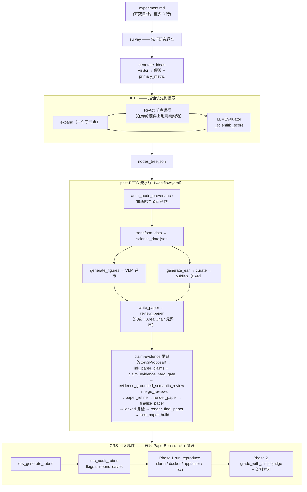

---
sources:
  - path: ari-core/ari/orchestrator
    role: implementation
  - path: ari-core/ari/agent/loop.py
    role: implementation
  - path: ari-core/ari/cli/bfts_loop.py
    role: implementation
  - path: ari-core/ari/mcp/client.py
    role: implementation
  - path: ari-core/ari/checkpoint.py
    role: implementation
  - path: ari-core/ari/pipeline
    role: implementation
  - path: ari-core/ari/evaluator/llm_evaluator.py
    role: implementation
  - path: ari-core/ari/memory/letta_client.py
    role: implementation
  - path: ari-core/ari/paths.py
    role: implementation
  - path: ari-core/ari/core.py
    role: implementation
  - path: ari-core/ari/rqgm
    role: implementation
  - path: ari-core/config/workflow.yaml
    role: config
last_verified: 2026-08-17
---

# ARI 架构

## ARI 做什么

ARI 是一个端到端的自主研究系统。给定一个纯文本研究目标，它会：

1. **调研**先前的工作（学术数据库）
2. **生成**研究假设，通过多智能体讨论（VirSci）
3. **搜索**最佳实验配置，使用最佳优先树搜索（BFTS）
4. **执行**真实实验，在您的硬件上运行（笔记本电脑、SLURM、PBS、LSF）
5. **评估**每个实验，以同行评审者的角色（LLM 分配科学质量评分）
6. **分析**完整的实验树：提取硬件上下文、方法论、消融实验发现
7. **生成**出版级质量的图表（LLM 根据数据编写 matplotlib 代码）
8. **撰写**完整的 LaTeX 论文及引用
9. **审阅**论文，LLM 充当审稿人
10. **验证**可复现性：仅根据论文文本重新运行实验

系统不包含硬编码的领域知识。同一流水线适用于 HPC 基准测试、ML 超参数调优、化学优化或任何可测量的现象。

### 配套概念页面

本页讲的是研究系统本身 —— 把一个目标变成一篇论文的那条流水线。另有两个
姊妹页面讲述*观察*与*描述*该系统的那些层，值得对照阅读：

| 页面 | 回答什么 |
|---|---|
| [仪表盘架构](gui_architecture.md) | Web 仪表盘是如何组织的：一个外壳同时承载 legacy 页面与 v2 工作区、路由注册表、按 run 建键的服务端状态缓存、把实时当作失效通知，以及从 HTTP 一路向下到检查点工件的那条接缝。 |
| [研究状态与治理状态](research_and_governance_state.md) | 一次运行同时携带的那些状态词汇表 —— 运行生命周期、研究阶段、治理阶段、节点得分状态 —— 它们为什么是分开的，以及陈旧 / 已失效 / 已移除 / 物理删除为什么是四种不同的东西。 |

---

## 流水线一览

端到端流程 —— 想法生成、BFTS 探索循环、由 `workflow.yaml` 驱动的
post-BFTS 流水线（write_paper 之后现在默认接一条 Story2Proposal 的
claim-evidence 尾链），以及与 PaperBench 兼容的 ORS 可复现性检查 ——
汇成一张枢纽图。每个分组都链接到深入讲解它的章节或文档。



| 分组 | 作用 | 进一步阅读 |
|------|------|-----------|
| survey / generate_ideas | 文献检索 + VirSci 确定假设与主指标 | [完整数据流](#完整数据流) |
| BFTS | 对实验配置进行最佳优先树搜索 | [BFTS 算法](bfts.md) |
| ReAct 节点运行 | 运行真实实验的逐节点代理循环 | [节点级提示构建](#节点级提示构建) |
| LLMEvaluator | 驱动排序的同行评审打分 | [配置 → BFTS 评估层](../reference/configuration.md#bfts-评估层-可通过配置切换) |
| 记忆 | 在节点间传递的祖先作用域知识 | [记忆架构](memory.md) |
| post-BFTS 流水线 | 数据 → 作图 → 写作 → 评审 → EAR | [出版生命周期](publication-lifecycle.md) |
| ORS 可复现性 | 从论文从零复现并打分 | [PaperBench 快速开始](../guides/paperbench/paperbench_quickstart.md) |

### 执行模式：`simple_bfts`（默认）与 `ari_rqgm`（可选启用）

本页描述的一切都属于默认执行模式 `simple_bfts`。可选启用的
`ari_rqgm` 模式（Constitutional ARI-RQGM）把同一个 BFTS 循环包裹进
基于纪元的治理与协同进化中：搜索策略被纯委托的
`GovernedSearchStrategy`（`ari/rqgm/runtime.py`）包装，MCP 客户端被宪法
能力闸门（`ari/core.py` 的 `_install_capability_gate` —— 每一次受治理的
工具调用都会留下审计记录，严重违规会升级为纪元中途的紧急隔离）包装，
已完成的节点获得一轮对抗式攻击/辩护/裁决回合，并且在每个纪元边界，一个确定性的
宪法内核会校验每一次治理状态变更（组件采纳/退役、提示词进化、前沿
修复）。仅当 `ari.mode: ari_rqgm` 与 `rqgm.enabled: true` 一致时才会
启用；在默认配置下不会导入任何 `ari.rqgm` 模块，检查点与 RQGM 之前
的 ARI 保持逐字节一致。分层、纪元算法与不变量见
[Constitutional ARI-RQGM 架构](rqgm_architecture.md)，激活方式与
模式切换策略见[执行模式](../guides/execution_modes.md)。

### `manuscript` 轴（可选启用，默认 off）

`workflow.yaml` 还带有第三个顶层开关 `manuscript.mode`
（`off` | `audit` | `enforce`，默认 `"off"`；同时还有
`profile: generic_empirical_v1`、`brief_character_budget: 24000`，以及
`policy` 默认为 `disabled` 的 `repair:` 块）。它与 `ari.mode`、`paper.mode`
都相互独立。`off` 与旧路径完全一致 —— 不做任何 manuscript 导入、产物、
gate 或修复；`audit` 记录一次影子完整性评估；`enforce` 在 authoring 要求
被解决之前阻塞撰写（`repair.policy: auto` 也要求它）。`workflow.yaml` 中
每个流水线阶段现在都声明
`segment: evidence | authoring | verification`，正是这一点让
`generate_paper_section(..., include_segments=…)` 能按段执行论文流水线：被排除
的段在一份*派生*工作流中表现为禁用阶段，因此跨段的 `depends_on` 仍由持久化输出
满足。这一选择本身不需要任何 mode；`ARI_MANUSCRIPT_RUNTIME_MODE` 不为 `off`
时新增的是 segment-execution 记录 —— 本次执行被绑定到 workflow digest 及其
逻辑输入，若已有匹配的 completed 记录则直接复用而不重跑。默认的 `include_segments=None` 会像以前一样运行每个启用的阶段。

---

## 系统概览

```
┌────────────────────────────────────────────────────────────────┐
│                         User Interface                         │
│                   experiment.md  /  CLI  /  API                │
└────────────────────────────┬───────────────────────────────────┘
                             │
┌────────────────────────────▼───────────────────────────────────┐
│                          ari-core                              │
│                                                                │
│  ┌─────────────────┐   ┌─────────────────┐                    │
│  │  BFTS           │   │  ReAct Loop     │                    │
│  │  (tree search)  │──▶│  (per node)     │                    │
│  └─────────────────┘   └────────┬────────┘                    │
│                                 │                              │
│  ┌──────────────────────────────▼──────────────────────────┐  │
│  │            MCP Client (async tool dispatcher)           │  │
│  └──────────────────────────────┬──────────────────────────┘  │
└─────────────────────────────────┼──────────────────────────────┘
                                  │ MCP protocol (stdio/HTTP)
     ┌────────────────────────────┼──────────────────────────────┐
     │                            │                              │
┌────▼──────────┐  ┌─────────────▼──────┐  ┌───────────────────▼──┐
│ari-skill-hpc  │  │ari-skill-idea      │  │ari-skill-evaluator   │
│ job_submit    │  │ survey             │  │ make_metric_spec     │
│ job_status    │  │ generate_ideas     │  │ claim_evidence_      │
│ slurm_submit  │  │ (VirSci MCP)       │  │   hard_gate          │
└───────────────┘  └────────────────────┘  └──────────────────────┘

Post-BFTS Pipeline (workflow.yaml):
┌─────────────────┐  ┌──────────────────┐  ┌──────────────────┐
│ari-skill-       │  │ari-skill-plot    │  │ari-skill-paper   │
│transform        │  │ generate_figures │  │ write_paper      │
│ nodes_to_       │  │ _llm (matplotlib │  │ review_compiled  │
│ science_data    │  │  plots + SVG     │  │  (rubric-driven, │
│ (LLM analysis)  │  │  diagrams)       │  │   ensemble+meta) │
└─────────────────┘  └──────────────────┘  └──────────────────┘
                                            ┌──────────────────┐
                                            │ari-skill-replicate│
                                            │ generate_rubric  │
                                            │ audit_rubric     │
                                            │  (PaperBench fmt)│
                                            └──────────────────┘
                                            ┌──────────────────┐
                                            │ari-skill-paper-re│
                                            │ fetch_code_bundle│
                                            │ build_reproduce_sh│
                                            │ run_reproduce    │
                                            │  (slurm/docker/  │
                                            │   apptainer/local)│
                                            │ grade_with_      │
                                            │  simplejudge     │
                                            │  (PaperBench via │
                                            │   LiteLLM judge) │
                                            └──────────────────┘
```

---

## 完整数据流

```
experiment.md
  (仅包含研究目标 — 最少 3 行)
    │
    ▼
[ari-skill-idea: survey]
  arXiv / Semantic Scholar 关键词搜索
  返回：相关论文摘要
    │
    ▼
[ari-skill-idea: generate_ideas]  ← VirSci 多智能体讨论
  多个 AI 角色就研究问题进行辩论
  输出：hypothesis、primary_metric、evaluation_criteria
    │
    ▼
BFTS 根节点创建
    │
    ▼ (对每个节点重复，最多 ARI_MAX_NODES 个，ARI_PARALLEL 个并发)
┌──────────────────────────────────────────────────────────────────┐
│  ReAct Loop (ari/agent/loop.py)                                  │
│                                                                  │
│  1. LLM 从 MCP 注册表中选择工具                                    │
│  2. 工具执行（run_bash / slurm_submit / job_status / ...）         │
│  3. 如果是 SLURM 作业：自动轮询直到 COMPLETED（无步骤预算限制）       │
│  4. LLM 读取 stdout → 生成实验代码 → 提交                          │
│  5. LLM 从输出中提取指标 → 返回 JSON                               │
│                                                                  │
│  记忆：结果摘要保存到祖先链记忆中                                    │
│  子节点：搜索祖先记忆以获取先前结果                                  │
└──────────────────────────────────────────────────────────────────┘
    │
    ▼
[LLMEvaluator] (ari/evaluator/llm_evaluator.py)
  输入：节点产物（stdout、日志、脚本）
  输出：{
    has_real_data: bool,
    metrics: {key: value, ...},       ← 提取的数值
    scientific_score: float 0.0-1.0,  ← LLM 同行评审质量分
    comparison_found: bool             ← 是否与现有方法进行了比较？
  }
  _scientific_score 存储在 metrics 中 → 驱动 BFTS 排名
  AUTHORITATIVE measurements：节点的 results.json（位于 ARI_WORK_DIR 下）是
    ground truth。其 `measurements` 被直接合并，并对 LLM 从截断产物文本
    （str(artifacts)[:2000]）中的提取拥有 PRECEDENCE（优先权）；其中存在的
    任何数值也会将 has_real_data 置为 True。这能找回截断重读会遗漏的真实数值。
  metric_contract producer obligation：当 make_metric_spec 输出了
    metric_contract 脚手架（concept-classified 指标）时，代理会在
    make_metric_spec 时刻收到一条领域中立的义务 —— 验证正确性、对任何
    ceiling 进行 MEASURE（绝不硬编码）、emit provenance、填写 contract ——
    随后由 FINAL claim-evidence hard gate 强制执行。
    │
    ▼
BFTS expand() (ari/orchestrator/bfts.py)
  - 按 _scientific_score 对节点排名
  - 将分数传递给子节点提议 LLM
  - LLM 每次扩展调用提议 1 个子方向（改进 / 消融 / 验证 / 草稿 / 调试 / 其他）
  - 无领域提示 — LLM 决定"改进"的含义
  - v0.7.0：当父节点存在 node_report.json 时，提示词中加入结构化的
    files added/modified/deleted、self_assessment.concerns 与 next_steps_hints；同辈
    去重通过 filter_nodes(for_synthesis) 过滤后，连带列出每个 sibling 的
    files_changed.added，避免提议会写相同文件的方向。

每节点自报告 (v0.7.0)
  ari-core/ari/orchestrator/node_report/ 在 mark_success / mark_failed 时
  生成 node_report.json（ari-core/ari/cli/bfts_loop.py 的 post-future 钩子），
  记录：
    - files_changed (added / modified / deleted / inherited_unchanged) —
      由父子 work_dir 的 sha256 diff 推导
    - original_direction (bfts.expand 在创建子节点时保存，evaluator 不会覆写)
    - measurement_valid 与 evaluation_cases — 评估器的客观输出；每个案例
      包含 `valid` 和由 harness 定义的标量测量字典
    - self_assessment.{headline, concerns} 与 next_steps_hints —
      智能体生成的 LLM 反思，与客观有效性判定分开保存
    - build_command / run_command — 从 work_dir 中的 run_job.sh / Makefile grep
    - artifacts[].role — 确定性的角色分类
      (data_output / log / binary / figure / unknown)
  PathManager.META_FILES 包含 node_report.json，确保父→子物理 work_dir 复制
  不会让子节点继承父节点的报告。

公共选择助手 (v0.7.0)
  ari-core/ari/orchestrator/node_selection.py:
    - filter_nodes：「该节点是否传给下游」的单一实现，3 种 criteria
      (for_synthesis / for_code / for_narrative)；always_include_node_ids 让
      best 节点必通过；丢弃成功节点 >50% 时输出 warning。
    - select_source_files_for_publication：纯元数据文件级选择（无 I/O）；
      同一 rel_path 上最深的 contributor 胜出；transform_data 与 generate_ear
      共享同一 selection（FR-SS-5 契约测试固化）。
    - load_selected_sources(size_budget)：负责文件 I/O；transform 用 16KB cap，
      generate_ear 不限。
    │
    ▼ (达到 ARI_MAX_NODES 后)
nodes_tree.json  (所有节点：指标、产物、记忆、父子关系)
    │
    ▼
[workflow.yaml Post-BFTS 流水线]

  阶段 0：audit_node_provenance  (ari-skill-memory: audit_memory)  [在阶段 1 之前]
    重新哈希 node_report 记录过 sha256 的每一个节点产物并与磁盘比对 —— 这是
    节点输出不再是实验结果、开始成为论文证据的边界。逐产物报告 verified /
    mismatch（记录哈希之后被改写）/ missing（已删除）/ unhashed（声明了但没有
    记录基线）。ARI 自己的元数据根本进不了审计：`_FILES_CHANGED_BLOCKLIST_NAMES`
    加上 `PathManager.is_meta_file(scope="node")` 在 `files_changed` 阶段就把它
    排除掉了；而节点自己的 `results.json` 与 `*.log` 是刻意 node-visible 的
    （`NODE_VISIBLE_NAMES` / `NODE_VISIBLE_EXTENSIONS`），因此它们会被哈希、也
    会拿到 verified。被报为 unhashed 的是 `files_changed` 从未覆盖的
    `artifacts[]` 条目：审计时刻意丢弃它自带的记录哈希，而不是拿它跟自己对账。
    它是信号而非闸门，transform_data 依赖（depends_on）它。
    输出：node_provenance_audit.json

  阶段 1：transform_data  (ari-skill-transform)  [在阶段 0 之后]
    对完整树进行 BFS 遍历（根 → 叶）
    LLM 读取所有节点产物（stdout、日志、生成的代码）
    LLM 提取：硬件规格、方法论、关键发现、比较结果
    输入包含 primary_metric / higher_is_better（经 tpl_vars 取自
      evaluation_criteria.json），使 summary_stats 无需在下游重新推导即可带方向。
    输出：science_data.json
      configurations[*]:
        rank, label, eval_summary
        parameters / measurements / predictions / scores  ← 类型化拆分，
                                                             只从通过校验的
                                                             results.json 采纳；
                                                             evaluator 的
                                                             _params_dict /
                                                             _measurements_dict
                                                             刻意不作为事实采纳
        metrics                                            ← 向后兼容的扁平并集
        _typed_source: "results.json" | （缺省）
      per_key_summary  （排除输入参数键与 "_…" 保留键）
      summary_stats    { count, primary_metric, direction,
                         primary_metric_best, primary_metric_n,
                         typed_split_coverage }
      experiment_context  （LLM 提取的方法论 / 硬件 / 发现）
      implementation_overview （可选）
      report_driven    （node_report.json 驱动了 LLM 输入时为 true）

  阶段 2：search_related_work  (ari-skill-web: search_papers)  [与阶段 1 并行]
    LLM 生成的关键词 → 一个被钉住的提供方（workflow.yaml 钉住
    provider: semantic-scholar、max_results: 15、mode: record）。
    record 会把响应快照下来，因此之后的 replay 不需要网络；
    record 与 live 都不会切换提供方。该阶段带有
    skip_if_exists: related_refs.json —— 已记录的检索是不可变的实验输入，
    因此 resume 会复用它而不是重新查询。
    输出：related_refs.json

  阶段 3：generate_figures  (ari-skill-plot: generate_figures_llm)  [在阶段 1 之后]
    输入：science_data.json + {{experiment_summary}} + {{vlm_feedback}}
    LLM 只充当规划者：它只能给出 metric_id / chart_type / x_mode。
    数值、单位、题注、路径与图像字节都由固定渲染器从已验证的 science 记录
    确定性地产生（execution_mode "declarative-fixed-renderer"），并按图写入
    figures/revisions/{NN}/{figure_id}/ 下的 source_data.json /
    figure_spec.json / .png / .pdf。revision > 0 必须携带绑定上一份 manifest
    摘要的 VLM 反馈；revision 0 则拒绝反馈。
    输出：figures_manifest.json  {figures, latex_snippets, figure_kinds}
      （figure_kinds 即 spec 的 chart_type）

  阶段 3b：vlm_review_figures  (ari-skill-vlm: review_figures_all)  [在阶段 3 之后]
    VLM 审阅 figures_manifest.json 中的**每一张**图；聚合分数取各图的最小值，
    因此只要有一张弱图就会触发回环。issues 与 suggestions 都以 [fig_id] 前缀，
    让重生成方知道该修哪一张。
    若得分 < 0.7：携带 VLM 反馈回环到 generate_figures（最多 2 次迭代）
    输出：vlm_review.json

  阶段 4：generate_ear  (ari-skill-transform)  [在阶段 1 之后]
    以 node_report 驱动的确定性 ear/ 构建。
      - code/ = best 链中 contributing 节点的 files_changed.added/modified 的 union（verbatim）
      - data/ = checkpoint/uploads/ 的 verbatim 镜像（仅输入；实验输出不打包）
      - figures/ = checkpoint 根下 *.{pdf,png,svg,jpg,jpeg} 置于顶层
      - README.md / reproduce.sh — 由 node_reports 确定性渲染
      - LICENSE — 由 publish.yaml::license SPDX 模板生成（MIT / Apache-2.0 / BSD-3-Clause / GPL-3.0 / CC-BY-4.0）
    EVOLUTION.md 和 _provenance.json 作为 ARI 审计日志写入 checkpoint 根目录
    （ear/ 之外），不会被打包进发布产物。
    transform_data 与 generate_ear 共享同一 select_source_files_for_publication，
    确保 LLM 看到的源字节与 ear/code/ 发布的字节完全一致。ARI 内部元数据
    （tree.json、science_data.json、raw_metrics.json 等）不会进入 ear/。
    输出：ear_manifest.json、ear/ 目录、checkpoint/EVOLUTION.md、
          checkpoint/_provenance.json

  阶段 5：write_paper  (ari-skill-paper)  [在阶段 2、3、4 之后]
    paper_context = experiment_context + best_nodes_metrics
    迭代式章节撰写：草稿 → LLM 审阅 → 修改（最多 2 轮）
    BibTeX 引用来自 Semantic Scholar 结果
    write_paper 还会读取 verified_context.json（由 ari/pipeline/verified_context.py
      构建——作用域限定到 best 节点的 root→best lineage 的 artifact-grounded
      claim），用于支撑其定量 claim。
    输出：full_paper.tex、refs.bib

  Story2Proposal claim-evidence 尾链  [现为默认，在 write_paper 之后]
    write_paper 之后接一条确定性的 claim/evidence 链（S2P）。
    默认拓扑为：
      link_paper_claims_draft       (核对 %CLAIM 锚点 → paper_claim_links.json)
        → claim_evidence_hard_gate_draft   (草稿 hard gate，非阻塞)
        → review_paper              (仅文本评审——下方阶段 6)
        → evidence_grounded_semantic_review
        → merge_reviews             (下方阶段 10；串入 gate + semantic review)
        → paper_refine              (应用 suggested_revisions，保留 %CLAIM 锚点)
        → render_paper              (重新编译 refined .tex → PDF；非阻塞)
        → link_paper_claims_final
        → evidence_grounded_semantic_review_post_refine
        → claim_evidence_hard_gate_final   (FINAL gate；strict 模式下阻塞 finalize)
        → finalize_paper            (下方阶段 8)
        → link_paper_claims_locked  (Code Availability 注入之后重新核对 claim)
        → claim_evidence_hard_gate_locked        (phase: final，针对将被编译并
                                                  锁定的那份 TeX 本身)
        → evidence_grounded_semantic_review_locked   (phase: locked，建议性)
        → render_final_paper        (直接编译注入之后的 TeX)
        → lock_paper_build          (对输入、调用、评审、gate、编译日志、TeX、
                                     BibTeX 与 PDF 做 fail-closed 的
                                     PaperBuildV1 锁定)
    由 workflow.yaml 顶层 claim_gate_policy 块控制。
      只有 FINAL 阶段可以阻塞，草稿阶段的报告永不阻塞。mode: off 从不阻塞；
      mode: warn（默认）仍会在客观完整性的 always_block_on 层
      （invariant_violation、correctness_failed、recompute_mismatch 等）上阻塞；
      mode: strict 还会阻塞配置的 block_on 发现以及 strict 小节中未被覆盖的
      数值。解析优先级最终落到
      env ARI_CLAIM_GATE_MODE (off | warn | strict) 与 ARI_COMPARISON_SCOPE。
    繁重的 gate 逻辑位于新的 ari/pipeline/claim_gate/ 包
      (contract / gate / policy / numeric / latex / invariants / resolve)，
      evaluator-skill 暴露调用它的瘦 MCP 工具
      (claim_evidence_hard_gate, evidence_grounded_semantic_review)。
      gate 的深层语义见 publication-lifecycle.md。

  阶段 6：review_paper  (ari-skill-paper)  [在阶段 5 之后]
    规范驱动审稿。运行 N 个独立审稿人代理
    (N 由 ARI_NUM_REVIEWS_ENSEMBLE / rubric 默认值控制；N=1 为单审稿人)。
    N>1 时还会运行 Area Chair 元审稿以聚合评分。
    输出：review_report.json { score, verdict, citation_ok, feedback,
          ensemble_reviews[] (N>1), meta_review{} (N>1) }

  阶段 7：ear_curate  (ari-skill-transform: curate_ear)  [在阶段 4 之后, v0.7.0]
    依据 {checkpoint}/ear/publish.yaml 的 allowlist 与内置 deny list
    (.env*, secrets/**, *.pem, *.key, id_rsa, id_ed25519) 构建
    {checkpoint}/ear_published/ + manifest.lock；bundle_sha256 是
    正规化 {path,sha256,size} JSON 的 sha256，跨机器确定。
    publish.yaml 缺失时静默跳过。

  阶段 8：finalize_paper  (ari-skill-paper: inject_code_availability)  [在阶段 5+7 之后, v0.7.0]
    从 ear_published/manifest.lock + publish_record.json 自动加载
    ref / sha / doi，将机器可读的 \codeavailability{} / \codedigest{}
    / \coderef{} 宏与人类可读的 Code Availability 章节注入
    full_paper.tex。digest 是信任锚点，读者无需信任 registry，即可用
    `ari clone <ref> --expect-sha256 <baked-digest>` 进行验证。

  阶段 9：ear_publish  (ari-skill-transform: publish_ear)  [在阶段 7 之后, 可选]
    从 ear_published/ 构建可复现 tarball，并发布到 backend
    (ari-registry / local-tarball / gh / zenodo)。首发布始终
    visibility=staged (FR-P5)。在 workflow.yaml 中默认启用
    (`enabled: true`、backend `local-tarball`、`dry_run: false`)，
    finalize_paper 依赖它。
    输出：publish_record.json

  阶段 10：review_paper / merge_reviews  (ari-skill-paper)  [在阶段 5+3b 之后]
    review_paper 仅评审论文文本 (不传入 VLM 输出与 figure manifest，
    与 AI Scientist v2 perform_review 契约一致)；merge_reviews
    将 review_report.json 与 vlm_review.json 做结构合并 (无 LLM)。
    输出：review_report.json (附 vlm_figure_review)

  阶段 11：ors_generate_rubric  (ari-skill-replicate)  [在 lock_paper_build 之后, v0.7.0]
    从最终论文自动生成 PaperBench 形式 (TaskNode 树) rubric。
    task_category 与 finegrained_task_category 锁定到 PaperBench 封闭
    词汇 (freeze 之前由确定性归一化器把 LLM 的变体映射到 allow-list 条目)；
    JSON 输出时清洗游离 LaTeX backslash escape。rubric 信封由「正规化 JSON +
    论文摘要」上的 sha256 冻结。
    输出：ors_rubric.json + ors_rubric.meta.json

  阶段 12：ors_audit_rubric  (ari-skill-replicate: audit_rubric)  [在阶段 11 之后]
    审计下游一切评分所依据的 rubric 本身。为每个叶节点标记
    vague_qualifier / no_paper_evidence / duplicate（确定性）与
    unverifiable（每叶一次 LLM 调用），就地重写 ors_rubric.json，
    并在超过 20% 叶节点被标记时返回 regen_recommended。它是信号而非
    闸门，评分照常进行。可用 ARI_MODEL_RUBRIC_AUDIT 指向与生成方不同的模型。
    输出：ors_rubric.audit.json（并把标记写入 ors_rubric.json）

  阶段 13：ors_seed_sandbox  (ari-skill-paper-re: fetch_code_bundle)  [v0.7.0]
    从策展过的 EAR bundle 确定性播种到 repro_sandbox/ (无 LLM)。
    从 publish_record.json 自动加载 ref + sha256 (本字段由 ear_publish 写入)。
    EAR 关闭时 publish_record.json 不存在，本阶段 no-op，让下一阶段的
    LLM 回退接管。
    输出：ors_seed.json

  阶段 14：ors_build_reproduce  (ari-skill-paper-re: build_reproduce_sh)  [v0.7.0]
    replicator：以沙箱为 workspace 驱动 PaperBench 式 ReAct 代理
    (BasicAgent；`iterative_agent: true` 时为 IterativeAgent，vendoring 于
    ari-skill-paper-re/vendor/paperbench)。该代理读取论文 + rubric 的
    expected_artifacts，反复调用 bash/python 工具写出 reproduce.sh 与配套
    源文件，直到 submit 或耗尽墙钟预算 (time_limit_sec，默认 12 小时)。
    这取代了 v0.6 的单次 LLM replicator。reproduce.sh 已存在则跳过
    (放在 ors_seed_sandbox 之后即可在 EAR 开启时不触发)。LiteLLM 路由，
    供应商无关 (gpt-5-mini / anthropic/claude-... / gemini/... / ollama/...)。
    输出：ors_replicator.json + repro_sandbox/{reproduce.sh, source...}

  阶段 15：ors_run_reproduce  (ari-skill-paper-re: run_reproduce)  [在阶段 14 之后, v0.7.0]
    Phase 1。在沙箱中执行 reproduce.sh：
      slurm (sbatch + ARI_SLURM_PARTITION 存在 = BFTS 同 partition)
      → docker (守护可用且非 HPC) → apptainer → singularity → local。
      可用 ARI_PHASE1_SANDBOX 覆盖。
    SLURM 路径是交接给类型化的调度器生命周期：执行请求变成
    JobRequestV1 + ResourceRequestV1，提交给 ari-skill-hpc 所用的
    同一个 SlurmScheduler 并轮询至终态 (_execute_reproduction_slurm)。
    捕获 reproduce.log，并对照 rubric 中的 expected_artifacts。
    输出：ors_phase1.json { executed, exit_code, log_path,
                             artifacts, missing, sandbox_kind,
                             [partition, cpus, walltime] }

  阶段 16：ors_grade  (ari-skill-paper-re: grade_with_simplejudge)  [在阶段 15 之后, v0.7.0]
    Phase 2。对 (repo_dir + reproduce.log + 论文) 在 rubric 叶节点上运行
    PaperBench SimpleJudge。主评分 completer 通过 LiteLLM 路由 (任意供应商；
    绕过 PaperBench 原生 CONTEXT_WINDOW_LENGTHS 约束)，两个 structured
    score-parser 也由同一个 judge_model 构建，仅在携带 response_format 上不同。
    N 次 (默认 1 —— PaperBench §4.1 的单次评分；
    用 ARI_JUDGE_N_RUNS 调高) 加权叶节点聚合。negative control
    (空仓库 + 平凡的 reproduce.sh) 用于验证 rubric 不会奖励「什么都没做」
    —— 两个对照都必须 < 5%。
    输出：ors_grade.json { ors_score, raw_score, leaf_grades,
                          judge_model, n_runs, rubric_sha256,
                          negative_control_check: {empty, boilerplate,
                                                   passed, status, error} }
```

---

## 文件结构

### 检查点目录布局

每次 ARI 运行都会在 `{workspace}/checkpoints/{run_id}/` 下生成检查点目录。
`run_id` 格式为 `YYYYMMDDHHMMSS_<slug>`。`ari/paths.py` 中的 `PathManager`
是目录构造的唯一真实来源。

```
checkpoints/{run_id}/
├── experiment.md               # 输入: 研究目标 (启动时复制)
├── launch_config.json          # 向导/CLI 启动参数
├── meta.json                   # 子实验元数据 (父/递归深度)
├── workflow.yaml               # 启动时流水线配置的快照
├── .ari_pid                    # 用于存活检测的 PID 文件
├── tree.json                   # 完整 BFTS 树 (BFTS 阶段写入)
├── nodes_tree.json             # 轻量树导出 (流水线输入)
├── results.json                # 每节点 artifact + metrics 摘要
├── idea.json                   # 生成的假设 (VirSci 输出) —— 经 inherit_idea_index 启动时还会用父运行的 ideas[N] 预先 seed (v0.7.0)
├── lineage_decisions.jsonl     # 谱系决策 LLM judge 日志 (每条触发的决策一条记录; v0.7.0)
├── evaluation_criteria.json    # 主要指标 + 方向
├── cost_trace.jsonl            # 每次 LLM 调用的成本/token 日志
├── cost_summary.json           # 成本汇总
├── ari.log                     # 结构化 JSON 日志
├── ari_run_*.log               # GUI 启动时的 stdout/stderr 日志
├── .pipeline_started           # 标记: post-BFTS 流水线已开始
├── science_data.json           # Transform-skill 输出
├── related_refs.json           # 文献搜索结果
├── figures_manifest.json       # 生成的图片元数据
├── figures/revisions/{NN}/{figure_id}/  # 每张图的渲染产物：
│                               #   source_data.json / figure_spec.json /
│                               #   {figure_id}.png / .pdf / figure_manifest.json
├── vlm_review.json             # VLM 图片审查输出
├── full_paper.tex              # 生成的 LaTeX 论文
├── refs.bib                    # BibTeX 引用
├── full_paper.pdf              # 编译后的 PDF
├── full_paper.bbl              # 参考文献输出
├── review_report.json          # LLM 同行评审输出 (N>1 时内联 ensemble_reviews[] 和 meta_review{})
├── reproducibility_report.json # 可复现性验证
├── uploads/                    # 用户上传的文件 (复制到节点 work_dir)
├── paper/                      # LaTeX 编辑工作区 (类 Overleaf)
│   ├── full_paper.tex
│   ├── full_paper.pdf
│   ├── refs.bib
│   └── figures/
├── ear/                        # 实验 Artifact Repository
│   ├── README.md
│   ├── RESULTS.md
│   └── <artifacts>
└── repro/                      # 可复现性运行工作区
    ├── run/
    ├── reproducibility_report.json
    └── repro_output.log
```

### 节点工作目录

每节点的工作目录作为 `checkpoints/` 的兄弟目录创建:

```
{workspace}/experiments/{run_id}/{node_id}/
```

中间那一段是 **`run_id`** 而不是主题 slug —— `PathManager.node_work_dir` 接收
`run_id`，由 `ari/cli/bfts_loop.py` 传入，因此实验名相同的两次运行绝不会写入同一个桶。

在节点执行时，`_run_loop` 将以下用户文件复制到每个节点的 work_dir:
- **Provided files**: `experiment.md` 中 `## Provided Files` (`## 提供ファイル` / `## 提供文件`) 下列出的路径
- **检查点根**: 检查点目录中的非 meta 文件
- **uploads 子目录**: `checkpoint/uploads/` 中的非 meta 文件

`PathManager.META_FILES` 定义了绝不能复制到节点 work_dir 的文件。它涵盖运行级
元数据 (`experiment.md`, `tree.json`, `nodes_tree.json`, `launch_config.json`,
`meta.json`, `results.json`, `idea.json`, `cost_trace.jsonl`, `cost_summary.json`,
`provenance.json`, `workflow.yaml`, `ari.log`, `evaluation_criteria.json`,
`.ari_pid`, `.pipeline_started`)、每个节点必须自己写出的节点级记录
(`node_report.json`, `full_log.json`, `_run_env.json`, `_exec_env.json`)，
以及 RQGM / 论文归档产物。节点级条目并非可有可无：`full_log.json`、
`_run_env.json` 与 `_exec_env.json` 都不在 `bfts_loop` 的 `_OUTPUT_BLACKLIST` 中，
因此正是这个集合在阻止父节点的执行日志、机器与已加载模块流入子节点。
扩展名为 `.log` 的文件也视为 meta。

### tree.json 和 nodes_tree.json

两个文件都包含 BFTS 节点树，但在生命周期的不同阶段写入:

| 文件              | 写入方                                                | 阶段             | 模式                                                  |
|-------------------|-------------------------------------------------------|------------------|-------------------------------------------------------|
| `tree.json`       | `cli/bfts_loop.py` 中的 `_save_checkpoint()`          | BFTS 阶段        | `{run_id, experiment_file, created_at, nodes}`        |
| `nodes_tree.json` | `_save_checkpoint()` + `WorkflowDriver.run()`（`ari/pipeline/driver.py`，经 `ari/pipeline/orchestrator.py` 的 `run_pipeline()`，由 `generate_paper_section()` 进入） | BFTS + post-BFTS | `{experiment_goal, nodes}` (轻量)                     |

**读取方约定**: 所有读取方必须优先使用 `tree.json` 并回退到 `nodes_tree.json`。
这可确保 BFTS 期间获得最新数据，同时保持与预期 `nodes_tree.json` 的流水线阶段的兼容性。

### 项目级状态 (每个检查点)

ARI 不再维护全局配置目录。所有设置文件和代理记忆都存储在活动检查点目录下，
因此每个实验拥有独立状态。v0.5.0 已经移除全局 `$HOME/.ari/` 目录；
仅存的几个文件系统回退会发出 `DeprecationWarning`，并在 v1.0 中彻底移除
（详见 `docs/guides/migration.md`）:

```
checkpoints/{run_id}/
├── settings.json        # GUI 设置 (LLM 模型、提供者、HPC 默认值)
├── memory_backup.v1.json.gz # Letta 快照（流水线阶段结束和退出时自动）
├── memory_access.jsonl       # 写/读遥测
└── ...                  # tree.json / launch_config.json / uploads / ari.log
```

API 密钥 **绝不** 存储在 `settings.json` 中。它们从 `.env` 文件
(搜索顺序: checkpoint → ARI root → ari-core → home) 或启动时注入的环境变量中读取。

### 工作区根目录的解析

上面路径中的 `{workspace}` 并不是一个固定目录。决定它的只有一个函数：
`RuntimePathResolver.resolve_workspace_root()`（`ari/paths.py`）。优先级为先匹配者胜：

1. **`ARI_CHECKPOINT_DIR`** —— 从被 pin 住的检查点目录 *反推* 根目录：向上走到最外层
   的 `checkpoints/` 祖先并取其父目录；若没有 `checkpoints/` 祖先，则取该检查点目录
   自身的父目录。
2. 显式传入的 `workspace_root` 参数。
3. **`ARI_ROOT`** → `{ARI_ROOT}/workspace`。
4. `{repo root}/workspace` —— 仅当 `{repo root}/ari-core` 是目录时采用，也就是从检出
   的仓库内部运行时。
5. 进程的工作目录。

第 1 步压过第 2 步是个容易踩的坑：只要 `ARI_CHECKPOINT_DIR` 被设置，显式传入
`workspace_root` **不会** 移动根目录。目前采用该策略的调用方是
`ari/config/__init__.py`（`auto_config`，默认的 `{workspace}/checkpoints/{run_id}`
模板由此拼出）、`ari/harness_registry.py`（`{workspace}/harnesses`），以及
`ari/viz/v1/` 下的 v1 GUI 文档存储与 launch 路径。

该策略是选择性启用而非隐式生效：不带参数构造的 `PathManager()` 仍然默认为进程工作
目录，完全不会走上面这条链。只有此处列出的调用点才以这种方式解析根目录。

### 分桶的 `runs/` 布局 —— 只有设计，从未落地

`RuntimePathResolver` 还认识第二种按运行分桶的布局：

```
{workspace}/runs/{run_id}/
├── workspace/     # 每节点暂存区（旧布局对应：上文的节点工作目录）
├── checkpoints/   # 运行级元数据 JSON（旧布局对应：检查点根目录）
├── artifacts/     # 图片、LaTeX、refs.bib
├── traces/        # 成本 / 提示 / 记忆访问日志
└── reports/       # node_report.json、评审与复现报告、ors_*.json
```

**没有任何东西写入这种布局，`ari/paths.py` 之外也没有任何调用方请求过它。** 请把它当作
一个设计出来却从未被采用的目标形态 —— 它既不是当前磁盘上的布局，也不是进行中的迁移。
ARI 实际产出的每条路径都是上文那种扁平布局。`ari/paths.py` 中真实存在的只是读取侧的
兼容能力，使得万一出现一个分桶的运行也能解析：

- `checkpoint_file(run_id, name)` 用 `bucket_for` 对 `name` 分类（一组固定的成本 /
  提示 / 遥测与 RQGM 日志文件名，以及 `memory_access.*.jsonl` 归 `traces`；`node_report.json` /
  `review_report.json` / `reproducibility_report.json` 与 `ors_*.json` 归 `reports`；
  `fig_` 前缀或 `.tex` / `.pdf` / `.bbl` / `.bib` / `.png` / `.svg` 扩展名归
  `artifacts`；其余一律归 `checkpoints`），先探测该桶再探测其余三个，若都不存在则返回
  扁平的 `checkpoints/{run_id}/{name}`。分类只决定扫描 *顺序* —— 无论如何四个桶都会被
  检查，所以分类错误不会产生错误的路径。
- `artifacts_dir` / `traces_dir` / `reports_dir` 仅在对应目录已存在时返回桶路径，否则
  返回扁平的检查点根目录；`workspace_dir` 仅在 `runs/{run_id}/workspace/` 存在时返回
  `runs/{run_id}/workspace/{node_id}`，否则返回上文 *节点工作目录* 的旧路径。

由于没有任何东西会创建这些桶，上述方法在结构上必然返回扁平路径。`runs_root`、
`run_dir`、`bucket_for` 以及 dual-layout 访问器（`checkpoint_file`、`artifacts_dir`、
`traces_dir`、`reports_dir`、`workspace_dir`）在 `ari/paths.py` 之外没有调用方
—— 唯一行使它们的是 `ari-core/tests/test_paths.py`（外加 `tests/test_rqgm_proposals.py`
中的一条 `bucket_for` 断言）。不要把它当作新布局工作的范例；请把它理解为读取侧的死代码
脚手架：保留成本很低，但若把它描述成 ARI 的布局就会误导读者。

---

## 模块参考

### ari-core

| 模块 | 描述 |
|------|------|
| `ari/orchestrator/bfts.py` | 最佳优先树搜索 — 节点扩展、选择、depth / sterile / total 剪枝、扩展计数跟踪；回退排名策略可通过 `BFTSConfig.frontier_score` (`scientific_plus_diversity` / `scientific_only` / `depth_penalized` / `ucb_like`) **配置** — 详见 [Configuration → BFTS 评估层](../reference/configuration.md#bfts-评估层-可通过配置切换) |
| `ari/orchestrator/node.py` | Node 数据类 — id、parent_id、depth、label、metrics、artifacts、memory |
| `ari/orchestrator/node_report/` | 每节点自报告构建器 + 旧版重建（v0.7.1 拆分为包） |
| `ari/orchestrator/lineage_decision.py` | Lineage-decision LLM 钩子（BFTS rewind / branch / continue） |
| `ari/orchestrator/root_idea_selector.py` | VirSci 池 → `ideas[0]` 再选择器 |
| `ari/rqgm/` | Constitutional ARI-RQGM 运行时（可选启用的 `ari_rqgm` 模式）：`RQGMRuntime` 门面、宪法内核、治理编排器（`governance/` 下的弹劾流水线）、注册表转换引擎、前沿修复、提案/对抗/提示词进化各层、论文归档协同进化运行时（`PaperArchiveStrategy` —— 草稿空间上的第二个最佳优先搜索），以及 Knowledge–Capability–Assurance 层（`admission.py` 发布原子的运行准入基线，`kernel_knowledge_integrity` / `kernel_capability_integrity` / `kernel_harness_integrity` 是它的纯内核检查）。在 `simple_bfts` 下绝不被导入 — 见 [Constitutional ARI-RQGM 架构](rqgm_architecture.md) |
| `ari/agent/loop.py` | ReAct 智能体循环 — 每个节点的 LLM + 工具调用；自动轮询 SLURM 作业；注入祖先记忆 |
| `ari/agent/message_utils.py` / `tool_manager.py` / `guidance.py` | 从 `agent/loop.py` 提取出的辅助模块（Phase 3D, v0.7.1） |
| `ari/agent/workflow.py` | WorkflowHints — 从实验文本自动提取（工具序列、指标关键词、分区） |
| `ari/agent/react_driver.py` | 论文流水线各阶段使用的、由流水线驱动的 ReAct 入口 |
| `ari/pipeline/` | Post-BFTS 流水线驱动器，拆分为 `experiment_md`、`yaml_loader`、`stage_control`、`context_builder`、`stage_runner`、`orchestrator`（Phase 3C, v0.7.1） |
| `ari/evaluator/llm_evaluator.py` | 指标提取 + 同行评审评分（`scientific_score`、`comparison_found`）。合成公式 (`harmonic_mean` / `arithmetic_mean` / `weighted_min` / `geometric_mean`) 与轴集 (`legacy` / `dynamic` / `custom`) 可通过 `EvaluatorConfig` **配置** — 详见 [Configuration → BFTS 评估层](../reference/configuration.md#bfts-评估层-可通过配置切换) |
| `ari/memory/letta_client.py` | `LettaMemoryClient` —— 以 `ari_react_*` Letta 集合为后端的 ReAct 轨迹持久化 |
| `ari/memory/file_client.py` | 已弃用的 v0.5.x 文件后端客户端；仅为 `ari memory migrate --react` 保留 |
| `ari/memory_cli.py` | `ari memory …` 子命令（migrate / backup / restore / start-local / …） |
| `ari/mcp/client.py` | 异步 MCP 客户端 — 线程安全，为并行执行创建新的事件循环 |
| `ari/llm/client.py` | 通过 litellm 进行 LLM 路由（Ollama、OpenAI、Anthropic、任何 OpenAI 兼容接口） |
| `ari/config/` | 配置数据类（BFTSConfig、LLMConfig、PipelineConfig）+ workflow.yaml 查找器（Phase 2） |
| `ari/configs/` | 经 `FilesystemConfigLoader` 加载的 YAML 查找表（`model_prices.yaml`、`defaults.yaml`） |
| `ari/prompts/` | 通过 `FilesystemPromptLoader` 加载的外部化 LLM 提示词。已提交的模板目录包括 `agent/`、`orchestrator/`、`pipeline/`、`evaluator/`、`viz/`、`llm/`（注入到 CLI shim 系统提示中的 MCP 工具名解析片段），以及 RQGM 时期的两个目录 —— `governance/`（弹劾流水线的 `auditor` / `defender` / `governance_judge` 角色）与 `rqgm/`（ProposalRouter 的生成器、对抗 → 防御 → 裁决循环，以及 PromptMutator 与 clean-room 元提示）。所有目录都使用同一套带版本的方案：`load_versioned("<dir>/<name>")` 返回模板正文与 `sha256(text)[:12]`，该短哈希即记录中保存的 `prompt_hash` —— 见 [RQGM 模式 → Id 与哈希纪律](../reference/rqgm_schemas.md#id-与哈希纪律)。运行时 *进化出来的* 提示词正文绝不提交在此，它们按检查点存放。钉定由 `tests/test_prompt_extraction.py`（手工维护的 sha256 列表）与 `tests/test_prompt_snapshots.py`（自动发现目录下每个 `*.md`）完成 |
| `ari/protocols/` | 跨层 Protocol —— `Evaluator`、`PromptLoader`、`ConfigLoader` |
| `ari/paths.py` | `PathManager` —— `ARI_CHECKPOINT_DIR` 读写的唯一真实来源（Phase 1） |
| `ari/checkpoint.py` | `tree.json` / `nodes_tree.json` 的共享 I/O（Phase 2） |
| `ari/_deprecation.py` | 支撑 DR1–DR4 警告的 `warn_deprecated_path / _env / _field` 助手 |
| `ari/migrations/v05_to_v07/` | 隔离的 v0.5 → v0.7 迁移垫片（计划在 v1.0 移除） |
| `ari/public/` | 允许技能导入的稳定再导出层（`container`、`cost_tracker`、`paths`、`llm`、`config_schema`，以及技能真正依赖的类型化契约模块 —— `execution`、`result`、`science_data`、`figures`、`visual_review`、`claim_gate`、`research_contract`、`manuscript` 等）；由 `tests/test_public_api_boundary.py` 在 CI 中强制 |
| `ari/core.py` | 顶层运行时构建器 —— Protocol 注入依赖的 composition root |
| `ari/cli/` | Typer CLI 拆分包：`__init__`、`run`、`projects`、`commands`、`bfts_loop`、`lineage`、`migrate`（Phase 3A, v0.7.1）+ `paper_dispatch`（`ari run` / `ari resume` / `ari paper` 共享的论文阶段执行模式分派） |
| `ari/viz/routes.py` / `websocket.py` / `ui_helpers.py` / `checkpoint_*` / `state_sync.py` | HTTP + SSE 的 GUI 后端，从旧的 `viz/server.py` 与 `viz/api_state.py` 拆分而来（Phase 3B, v0.7.1） |

### 技能（MCP 服务器）

**默认技能**（在 `workflow.yaml` 中注册）：

| 技能 | 工具 | 角色 | LLM? |
|------|------|------|------|
| `ari-skill-hpc` | `job_submit`、`container_submit`、`job_status`、`job_result`、`job_logs`、`job_cancel`、`probe_platform_capabilities`、`counter_support`、`measure_counters`、`slurm_submit` | 基于 digest 固定 request 的类型化 SLURM 作业生命周期；容器经由 `container_submit` 抵达，而非逐条 Singularity 命令；`slurm_submit` 作为批处理脚本桥接保留 | ✗ |
| `ari-skill-memory` | `add_memory`、`search_memory`、`search_research_memory`、`get_node_memory`、`get_experiment_context`、`get_verified_context`、`consolidate_node_memory`、`add_experiment_result`、`add_failure_case`、`add_procedure_memory`、`add_reflection`、`add_reproducibility_event`、`audit_memory` | 祖先作用域的节点记忆（Letta 后端）；`audit_memory` 驱动 `audit_node_provenance` 阶段 | △ |
| `ari-skill-idea` | `survey`、`generate_ideas`、`mint_contract_for_proposal` | 文献搜索（Semantic Scholar）+ VirSci 多智能体假设生成；`mint_contract_for_proposal` 为并非由本 skill 生成的 proposal 铸造 typed Research Contract | ✓ |
| `ari-skill-evaluator` | `make_metric_spec`、`propose_metric_contract`、`claim_evidence_hard_gate`、`evidence_grounded_semantic_review` | 从实验文件提取指标规格，并作为 `ari/pipeline/claim_gate/` 的瘦 MCP 表面 | △ |
| `ari-skill-transform` | `nodes_to_science_data`、`generate_ear`、`curate_ear`、`promote_ear`、`publish_ear` | BFTS 树 → 科学数据 + EAR + curate/promote/publish 生命周期 (v0.7.0) | ✓ |
| `ari-skill-web` | `web_search`、`fetch_url`、`search_papers`、`rerank_retrieval_records`、`walk_citations`、`list_uploaded_files`、`read_uploaded_file` | 网络搜索 + 每次调用一个被钉住的学术提供方（`semantic-scholar` / `arxiv` / `alphaxiv`；`both` 会被拒绝），支持 `record` / `live` / `replay` 快照模式、引用游走、上传文件访问 | △ |
| `ari-skill-plot` | `render_figure`、`generate_figures`、`generate_figures_llm` | 由固定渲染器绘制声明式 figure spec：`generate_figures` 使用确定性默认 spec，`generate_figures_llm` 只让 LLM 选择 `metric_id` / `chart_type` / `x_mode` | ✓ |
| `ari-skill-paper` | `list_venues`、`get_template`、`compile_paper`、`check_format`、`write_paper_iterative`、`review_compiled_paper`、`list_rubrics`、`link_paper_claims`、`paper_refine`、`inject_code_availability`、`merge_reviews`、`finalize_paper_build` | LaTeX 论文撰写、编译、基于评审规范的同行评审 (兼容 AI Scientist v1/v2)。v0.7.0：`inject_code_availability` 注入 `\codeavailability{}` / `\codedigest{}` / `\coderef{}` 宏；`merge_reviews` 事后合并文本评审与 VLM 评审 JSON；`finalize_paper_build` 写出 fail-closed 的 `PaperBuildV1` 锁。 | ✓ |
| `ari-skill-paper-re` | `fetch_code_bundle`、`build_reproduce_sh`、`run_reproduce`、`grade_with_simplejudge` | PaperBench 形式可复现性 (v0.7.0)：通过 `ari.clone` 预填沙箱、Phase 1 沙箱 runner、Phase 2 PaperBench SimpleJudge 评分。PaperBench 同捆于 `vendor/paperbench`。 | ✓ |
| `ari-skill-replicate` | `generate_rubric`、`audit_rubric`、`suggest_target_leaf_count` | PaperBench 形式自动 rubric 生成与审计 (v0.7.0)。驱动 ORS 可复现性流。 | ✓ |
| `ari-skill-benchmark` | `analyze_results`、`statistical_test`、`compare_runs` | CSV/JSON/NPY 分析、scipy 统计、跨运行比较（BFTS analyze 阶段使用） | ✗ |
| `ari-skill-vlm` | `review_figure`、`review_figures_all`、`review_table` | VLM 驱动的图表/表格审查（`review_figures_all` 驱动覆盖整批图的 VLM 审查循环） | ✓ |
| `ari-skill-coding` | `write_code`、`edit_code`、`run_code`、`run_bash`、`read_file`、`emit_results`、`describe_environment` | 代码生成与编辑 + 执行、分页文件读取、类型化结果输出、环境描述 | ✗ |

**附加技能**（可用，不在默认工作流中）：

| 技能 | 工具 | 角色 | LLM? |
|------|------|------|------|
| `ari-skill-orchestrator` | `run_experiment`、`get_status`、`get_result`、`stop_experiment`、`list_runs`、`list_children`、`list_artifacts`、`read_artifact`、`get_paper`、`get_ear`、`list_skills`、`get_workflow` | 将 ARI 作为 MCP 服务器暴露，递归子实验，双 stdio+HTTP 传输 | ✗ |
| `ari-skill-tool-registry` | `discover`、`describe`、`invoke`、`invoke_scheduled`、`get_status`、`get_result` | 面向大型外部 MCP 集合的供应商中立发现、准入、不可变调用与重放；`invoke_scheduled` 是同一 dispatch 为提交到调度器的 leaf 单独开出的表面 | ✗ |
| `ari-skill-knowledge` | `search_knowledge_skills`、`describe_knowledge_skill`、`list_active_knowledge_skills`、`request_knowledge_skill` | 对内容寻址的过程性知识提供只读查询与非权威请求接口 | ✗ |
| `ari-skill-harness` | `search_harnesses`、`describe_harness`、`request_auxiliary_verification`、`read_attestation`、`list_verification_requirements` | Harness 目录 / 需求 / Attestation 的只读查询与非权威的辅助请求 | ✗ |

✗ = 无 LLM、△ = 仅部分工具使用 LLM、✓ = 主要工具使用 LLM。**共 17 个技能包**（在默认 `workflow.yaml` 中注册 13 个，附加 4 个）— v0.7.0 新增 `ari-skill-replicate`。

---

## Plan / Venue 契约 (v0.7.0+)

ARI 区分两类塑造运行的文档：

- **plan.md（≒ checkpoint `experiment.md`，promote 之后）** —— 该运行的
  *评估细节*：要测量哪些指标、与哪些基线比较、运行哪些消融。运行特定。
  真实来源（source of truth）：`idea.json[0].experiment_plan`。
- **venue.md（≒ `ari-core/config/reviewer_rubrics/<id>.yaml`）** ——
  *判定标准*：对哪些维度打分以及如何打分（`score_dimensions`、
  `system_hint`、`decision`）。venue 规范性。

这一双文件契约驱动 Phase 1、Phase 3 与谱系决策（lineage decisions）：

```
generate_ideas (idea-skill)
        │
        ▼  写入
{ckpt}/idea.json   ← 机器可读的 plan source
        │
        ├─ Phase 1: pipeline.py 向 {ckpt}/experiment.md 自动追加一个
        │   可渲染块（Selected idea + Plan §标题 +
        │   Alternatives considered）
        │
        ├─ Phase 3: LLMEvaluator 构建动态轴
        │   = generic 5 + rubric.score_dimensions + plan §-tag 关键词
        │   judge LLM 针对该集合为每个 BFTS 节点打分。
        │
        └─ 谱系决策（默认 stagnation_rule）：
            在 CONFIRMED（已确认）停滞时（composite 分数保持平坦），BFTS
            hook 首先调用 deterministic_stagnation_pivot() —— 它切换
            （switch_to_idea）到最强的 UNUSED（未使用）次选想法
            （tie-break：index 较小者）并设置
            disable_generate_ideas=True。LLM judge
            decide_lineage_action（continue / switch_to_idea / fanout /
            terminate）仅是 FALLBACK（回退），仅当 pivot 返回 None 时才会
            到达：预算耗尽、达到递归上限，或没有剩余的未使用替代。switch
            与 fanout 复用 Phase 2.5 的 synthetic-seed 启动路径；子节点的
            idea.json 会预先 seed 选定的替代并将其 pin 住（`_pinned:
            True`），子节点的 generate_ideas 在 pinned 之后追加其新想法而
            不覆盖。
```

`ARI_RUBRIC`（默认 `neurips`）选择 BFTS 打分轴（Phase 3，`ari/core.py`
的 `_load_rubric_dict_for_axes`）所依据的 venue 文件。论文评审不再共享
这一选择：`review_paper` 阶段传入 `rubric_id: {{paper_rubric}}`，其值来自
`workflow.yaml` 的顶层 `paper_rubric` 键（默认 `generic_conference`）；
`resolve_rubric` 会拒绝空 id，而不是回退到环境变量。若希望同一个 venue
同时驱动打分与评审，请把 `ARI_RUBRIC` 与 `paper_rubric` 设为同一个 id。

### 子实验的继承

每个子运行沿以下通道从其父继承：

| 通道 | 方向 | 机制 |
|---|---|---|
| `venue.md`（rubric） | 继承 | `ARI_RUBRIC` env 传播 |
| `memory` | 继承 | 祖先作用域读取（既有的 `ari-skill-memory`） |
| `idea.json`（catalog） | 继承（只读） | `ari/lineage.py` 沿 `meta.json:parent_run_id` 遍历；VirSci 将祖先标题注入到代理提示中 |
| `plan.md`（directive） | 默认 NOT 继承 | 子节点自己撰写 |

关键在于，`pipeline.py` 中的 directive 路径只读取当前 checkpoint 的
`idea.json` —— 谱系遍历是 *catalog* 路径，由 VirSci 和子实验启动器显式
调用。这让子节点可以自由 pivot。

**已知缺口 —— 一条看起来存在、实则不存在的第五通道。** 当谱系钩子选择
`switch_to_idea` 时，它同时会设置 `disable_generate_ideas=True`，其意图是
"子运行逐字执行选中的 alternative，不再重新采样"；`ari/cli/lineage.py`
则通过在 launch 之前设置 `ARI_DISABLED_TOOLS_FOR_CHILD` 来承载这个意图。
但树中没有任何代码回读该变量。`disabled_tools` 是一个仅从 YAML 填充的
config 字段（外加把已禁用 `bfts_pipeline` stage 的工具自动并入的那条
路径），永远不会从环境变量填充，因此子运行会连同 `os.environ` 的其余部分
一起继承这个变量，然后忽略它。

如果你以为这个 pin 是排他的，实际发生的是这样。由任何谱系动作启动的子运行
仍然会执行 `generate_ideas` —— 该 stage 没有声明 `skip_if_exists`，所以已被
seed 的 `idea.json` 同样拦不住它。`_pinned` 标记买到的是**顺序而非抑制**：
继承来的条目留在 `ideas[0]`，子运行新生成的 idea 追加在它后面（标题与 pinned
条目重复的会被剔除；`ari_rqgm` 的 proposal router 以同样方式保留该标记）。
这些追加的条目就是 `ideas[1:]`，也正是 `build_lineage_state` 交给该子运行
**自己**的 stagnation pivot 的 alternatives 池。于是 `switch_to_idea` 在设定
子运行起点方向的同一步里，也为它备好了日后可以转投的池子。

这个缺口不是谁划下的范围边界，而是一个无人认领的决定。它曾作为 open item
提出，并被转交给本应治理 sub-run spawning 的那一层；那一层从未接手，此后
树中也没有任何组件认领它。请把上面的表当作完整的：在谱系启动路径上，父运行
可以彻底拒绝 spawn 子运行（`terminate` 会把 `parent_terminated` 写入父运行
自己的 `meta.json`，随后 `_api_launch_sub_experiment` 拒绝 launch），也可以
pin 一条 seed 条目。这两者之间没有任何东西。子运行的 `meta.json` 只记录
run id、父子关系、depth、创建时间、checkpoint dir 和 `inherit_idea_index`，
没有治理字段；`parent_terminated` 那两个字段写在**父运行**的文件里而非
子运行的。关于父运行还应当能约束子运行的哪些方面（如果有的话），至今没有
表明任何立场。

### work_dir 继承 —— 输出产物黑名单 (v0.7.0 / Phase 7)

当 BFTS 扩展一个子节点时，子节点的 `work_dir` 通过复制父节点的
`work_dir` 来 seed。若不进一步过滤，会让子节点逐字节复用父节点的
`results.csv` / `slurm-*.out` / `run.log`；在 run-`20260504120448` 的
事后复盘中，所有 9 个子节点都因结果文件已在磁盘上、代理把实验当成已完成，
而报告了来自单个 SLURM 作业的相同数值。

`ari-core/ari/cli/bfts_loop.py` 中的 `_OUTPUT_BLACKLIST` 显式列举了在父 → 子复制
期间被跳过的模式：

| 继承 | 黑名单 |
|---|---|
| 源码 / 脚本 / 配置（`*.cpp`、`*.py`、`*.sh`、`*.yaml`、`Makefile`、...） | `results.csv`、`results_*.csv`、`*_results.csv`、`metrics.csv`、`result.csv` |
| 编译后的二进制（`a.out`、无扩展名的 ELF 输出） | `*.metrics.json`、`metrics.json` |
| `data/`、`inputs/` 下的数据文件 | `run.log`、`run_*.log`、`*.run.log` |
| 嵌套源目录下的任何内容（如 `src/lib.cpp`） | `slurm-*.out`、`slurm-*.err`、`stdout.txt`、`stderr.txt`、`out.txt`、`err.txt` |
|  | `node_report.json`（每个节点重建自己的） |
|  | `results.json`、`*_results.json`、`selftest_output.txt`、`*_output.txt` —— 父节点的**数值**，绝不能走代码通道 |
|  | `heterogeneous_env.json`（工具产物且含探测到的机器信息；子节点自己重新探测） |

执行后，`compute_files_changed(parent, child)` 基于 sha256 diff 返回
`{added, modified, deleted, inherited_unchanged}`。当
`added=0 ∧ modified=0 ∧ deleted=0` 时，循环将该子节点标记为
**sterile（不育）**（`metrics["_sterile"]=True`、`_scientific_score=0.0`、
`has_real_data=False`）；随后 `BFTS.should_prune` 会把该 sterile 节点本身
退出 frontier，不再展开它。父节点在子节点 sterile 时**不会**被退役：
`_child_retires_parent`（Rule B-6 A，`ari/cli/bfts_loop.py`）对 sterile 子节点
抑制了通常的“子胜过父即退役父”规则——逐字拷贝的分数“胜出”只是 evaluator 的
时序噪声，据此退役父节点会在两个节点后清空 frontier。子代理的第一条 user
message 还会收到一条强制产生新产物的指令（“在此 work_dir 中产生 **新的**
result/log/metric 产物；不要依赖继承的文件”），因此行为良好的代理在文字与
指标两方面都有动机去真正运行实验。

---

## 流水线驱动的 ReAct (react_driver)

BFTS 自带的 ReAct 循环(`ari.agent.AgentLoop`，与 `Node` 树紧耦合)之外，还有一个轻量 ReAct 驱动 `ari.agent.react_driver.run_react`，面向无需 BFTS 上下文的 ReAct 智能体。当 stage 声明 `react:` 块时，由 `ari.pipeline._run_react_stage` 调用。

**v0.7.0**: `reproducibility_check` 不再使用 `react_driver`。PaperBench 形式流（`ors_generate_rubric` → `ors_audit_rubric` → `ors_run_reproduce` → `ors_grade`）以确定性 Phase 1 沙箱 runner + Phase 2 SimpleJudge 评分（`ari-skill-paper-re`）取代之。`react_driver` 仍保留在代码中以便将来通过 `react:` 块接入新的 stage，但默认 `workflow.yaml` 不再连接它。

```
pipeline.py ──▶ pre_tool (MCP)  → 声称的配置
             ─▶ react_driver.run_react
                   ├─ phase 过滤：MCPClient.list_tools(phase="reproduce")
                   ├─ 对每个工具调用的参数执行沙箱校验
                   └─ 智能体调用 `final_tool` 即终止
             ─▶ post_tool (MCP) → 裁决 + 解释
```

关键特性：

- **Phase 白名单**：`workflow.yaml` 中 `skills[].phase` 可以是单个字符串或数组。只有 phase 列表包含 stage `react.agent_phase` 的技能才能被智能体看到。默认 `workflow.yaml` 将 `web-skill` / `vlm-skill` / `hpc-skill` / `coding-skill` 加入 `reproduce`；`memory-skill` / `transform-skill` / `evaluator-skill` 被刻意排除，智能体无法观测 BFTS 状态(`nodes_tree.json`、祖先记忆、science data)。
- **沙箱**：`react.sandbox` 是由各阶段自己的 `react:` 块声明的目录，没有内置默认值(`stage_runner` 读取 `react_cfg.get("sandbox", "")`，缺少该键时根本不建立沙箱)；随包发布的 `workflow.yaml` 中没有任何阶段声明它，ORS 阶段是通过各自的 stage input 指向 `{{checkpoint_dir}}/repro_sandbox/` 的。工具参数会被扫描绝对路径和 `..` 穿越，沙箱外的路径(论文 `.tex` 的 allow-list 除外)会在抵达 MCP 之前被拒绝并返回 `sandbox violation`。MCP 服务器 fork 之前会将 `ARI_WORK_DIR` 设置为沙箱目录，所以 `coding-skill.run_bash` 的默认 cwd 也会在沙箱内。
- **终止条件**：智能体调用 `react.final_tool`(默认 `report_metric`)结束循环。该调用不会转发给 MCP，而是被驱动捕获，其参数成为传递给 stage `post_tool` 的 `actual_value` / `actual_unit` / `actual_notes`。

这一分离使复现 stage 的"仅读论文文本"约束能从 YAML 审计，而不是埋在技能 Python 里。

---

## 节点级提示构建

每个 BFTS 节点都通过 `ari/agent/loop.py:2067` 中的 `AgentLoop.run(node, experiment)` 这一单一入口执行。同一循环既处理根节点也处理子节点；它构建的提示会因 `node.depth` 和从祖先继承的状态而不同。本节是 *代理在节点开始时实际看到什么* 的权威来源。在此处更改需要谨慎审查。

### `AgentLoop.run` 的输入

每次调用接收两个参数：

1. **`node: Node`** — 由 `BFTS.expand`（`ari/orchestrator/bfts.py:734-745`）创建。影响提示的字段：
   - `id`、`depth`、`label`（`draft|improve|debug|ablation|validation|other`）、`raw_label`
   - `ancestor_ids` — 从根到父节点（含父节点）的严格 CoW 链，用作 `search_memory` 过滤器。
   - `eval_summary` — 对于刚扩展的子节点，此字段保存 LLM 提议的方向（一句话）。执行后该字段会被评估器摘要覆盖。
   - `memory_snapshot` — 父节点快照的副本；当前提示构建器未使用，但会持久化到 `tree.json`。
2. **`experiment: dict`** — 调度器按节点组装：
   - `goal` — 整个 `experiment.md` 文本（运行级别，所有节点相同）
   - `work_dir` — `PathManager` 创建的节点专属目录
   - `slurm_partition`、`slurm_max_cpus` — SLURM 启用时由 `env_detect` 填充

### 系统提示 — `ari/prompts/agent/system.md`

提示正文是外部化模板（键 `agent/system`，经 `_system_prompt_versioned()` 载入并在 `loop.py:2230` 做 `str.format`）；`loop.py` 只负责构建 `{tool_desc}` / `{memory_rules}` / `{extra}` 三处替换：

```
You are a research agent. You MUST use tools to execute experiments. ...

AVAILABLE TOOLS:
{tool_desc}                ← 当前阶段枚举的 MCP 工具

RULES:
- Your FIRST action must be a tool call ...
- If `make_metric_spec` is available and this is a new experiment ...
- NEVER fabricate numeric values ...
- When all experiments are done, return JSON {...}
- Do NOT call gap_analysis or generate_hypothesis
- Ensure your experiment is reproducible: ...
{memory_rules}{extra}
```

`{extra}` 块（在 L2218-2223 构建）追加：

| 子块 | 来源 | 备注 |
|------|------|------|
| `NODE ROLE: {label_hint}` | `node.label.system_hint()` | 由 BFTS 标签衍生的一句话行为提示；设置 `ARI_BFTS_NO_LABEL`（`labels_disabled()`）后所有节点改用同一个中性角色 |
| `EXPERIMENT ENVIRONMENT` | L2202-2211 | work directory（节点的 container root `/workspace`）+ 已有文件 + SLURM partition/CPUs（仅当 scheduler 工具确实可用时）+ 容器镜像（`ARI_CONTAINER_IMAGE`） |
| `RESOURCE BUDGET` | L2213-2217 | `max_react_steps`、`timeout_per_node // 60` 分钟 |
| `extra_system_prompt` | `WorkflowHints.extra_system_prompt` | 由 `from_experiment_text` / 流水线配置可选设置的逃生口 |

`{memory_rules}` 块（L2224-2226）仅在代理实际拥有 `add_memory` 工具时附加，并将活跃节点 id 内联到提示中，使 LLM 无法意外写入其他作用域：

```
- When available, save decisive intermediate findings with
  add_memory(node_id="<本节点的 id>", text=..., metadata=...)
- Use search_memory(query=..., ancestor_ids=[...], limit=5) ...
```

### 工具目录（`tool_desc`）

L2116 的 `tools = self._available_tools_openai(suppress=..., phase="bfts")` 枚举 MCP 为 `phase="bfts"` 暴露的所有工具，然后丢弃 `_suppress_tools` 中的任何工具。suppression 集合通过 `AgentLoop._suppress_tools` 属性（L1489-1495）访问，其存储是每个 worker 线程各自独立的（`_NodeLocalState(threading.local)`，L1183-1194），并随运行进展更新：

- 在 idea 被 admitted 的 `generate_ideas` 调用之后，循环设置 `self._suppress_tools = {"generate_ideas"}`（L3005-3007），后续节点不再重新生成 idea。
- `survey` 对子节点 **不被 suppress**；仅在文字中被劝阻（见下文「User message #1 — 子节点」）。忽略文字劝阻的子仍然可以调用 `survey()`。

`_PINNED_TOOLS = {"survey", "generate_ideas", "make_metric_spec"}`（L2634）标记消息窗口修剪器必须保留的工具结果；即使聊天历史被压缩，它们的内容也会在每个 ReAct 轮次存活。

### User message #1 — 根节点（`node.depth == 0`）

`loop.py:2434-2440`:

```
Experiment goal:
{goal_text(按 ARI_GOAL_MAX_CHARS 截断，默认 8000)}

Node: {node.id} depth={node.depth}

START NOW: call {first_tool}() immediately. Do NOT output any text or
plan — your first response must be a {first_tool}() tool call.

WORKFLOW ORDER: (1) generate_ideas() sets the research direction and
primary_metric; (2) make_metric_spec() derives success metrics from the
established primary_metric; (3) survey() gathers related literature for
grounded citations.
```

`WORKFLOW ORDER` 一行由 `_setup_descriptions` 按通过 suppression 的 setup 工具（`generate_ideas` → `make_metric_spec` → `survey`）拼装，因此被 suppress 的工具绝不会被点名；三者都不可用时退化为「use only the available tools shown above.」。

`first_tool` 是 `WorkflowHints.tool_sequence[0]`，现在默认为 `generate_ideas`；当对应技能存在时，`enrich_hints_from_mcp` 将 setup 工具排序为 `generate_ideas` → `make_metric_spec` → `survey` → executor（idea 的 `primary_metric` 即成功标准，因此 `make_metric_spec` 必须跟在 idea 之后派生，而不是猜测一份列表）。

### User message #1 — 子节点（`node.depth > 0`）

`loop.py:2345-2382`:

```
Experiment goal:
{goal_text(按 ARI_GOAL_MAX_CHARS 截断，默认 8000)}

Node: {node.id} depth={node.depth} task={node.label}

Task: {label-specific one-line description from _label_desc}
The parent node already completed the survey and established a research
direction. Prior results are provided below for context — but they belong
to the parent, NOT to you.

MANDATORY: You must produce NEW artifacts to count as having run an
experiment.
  • Inherited files: source code, scripts, configs, compiled binaries.
  • NOT inherited: the parent's results.json/results.csv, ...（逐条列出 _OUTPUT_BLACKLIST）
  ...（按 label 修改代码；重新构建、重跑并写出新的结果文件；
      零差异节点会被判定为 STERILE）
Implement and run your specific experiment, then return JSON with
measurements.

Workflow:
{WorkflowHints.post_survey_hint}        ← 例如：slurm_submit / run_bash 步骤
```

「Prior results are provided below」这句是有条件的：若某个子节点的 handoff arm 既不注入摘要也不注入父日志，提示会改为告诉它继承了父节点的 *代码* 但不会拿到其结果，从而不会承诺一段永远不会出现的内容。

`_label_desc`（L2311-2322）是节点级提示中标签语义出现的唯一位置：

| Label | 一行任务 |
|-------|---------|
| `improve` | Improve performance or accuracy beyond what the parent achieved. |
| `ablation` | Ablation study: remove or vary one component from the parent approach. |
| `validation` | Validate the parent result under different conditions or parameters. |
| `debug` | The parent experiment had issues. Diagnose and fix them. |
| `draft` | Try a new implementation approach for the same goal. |
| *(other / unknown)* | Extend or vary the parent experiment. |

注意 `node.eval_summary`（BFTS 扩展器 LLM 为该子节点提议的具体方向）**不会逐字写入此提示**。子节点只看到通用标签任务；提议的方向通过下方的先验知识记忆搜索间接传达给代理。

### User message #2 — 工作上下文注入（每个节点）

旧的仅子节点 `search_memory` 转储（一条 `[Prior knowledge from ancestor nodes …]` 消息，截断到聚合 800 字符）已被模块级的 `build_working_context_messages()`（`loop.py:561-789`）**取代**，并由 `AgentLoop.run` 对 **每个** 节点调用。它是只读的 —— 从不写记忆 —— 并组装至多三个带上限的层级：

- **Tier 1a —— 实验核心（每个节点）。** 调用 `get_experiment_context` 并注入一个 `[Experiment context (stable across all nodes):]` 块，携带 `primary_metric`、`higher_is_better`、`metric_rationale`、`hardware_spec`，**外加** 一个 `selected_idea` 摘要。它对根节点和每个后代都适用，因此从不重跑 `generate_ideas` 的节点也能继承设计意图（计划的机制 + 目标工作负载），而不仅仅是指标。
- **Tier 1b —— 祖先核心（仅子节点）。** 对每个祖先调用 `get_node_memory(node_id=aid)`，只保留 `metadata.type == "result_summary"` 的条目，输出一个 `[Established conclusions from ancestor nodes (N):]` 块。这是确定性的、完整的逐祖先交接：每条结论 **按条目** 截断（而非聚合裁剪），并受树深度约束因此整条注入。顺序遵循 `ancestor_ids`（根 → 父）。
- **Tier 2 —— 细节补充（仅子节点）。** 通过 `search_memory(query=…, ancestor_ids=…, limit=5)` 做一次小的语义召回，对 Tier 1b 去重，呈现为 `[Related prior findings from ancestors (N):]`。`eval_summary` 仅用作搜索查询（截断到约 200 字符）。

失败（记忆后端宕机、结果格式异常等）在 `logger.debug` 级别被吞掉，节点仍然运行。

遗留的 `search_global_memory` 注入块（`loop.py:2517-2539`）在 v0.6.0 中是死代码；全局记忆工具已被移除（`CHANGELOG.md` v0.6.0 §3），条件分支永不触发。

### 截断速查表

| 项目 | 上限 | 代码 |
|------|-----|------|
| `goal_text` | `ARI_GOAL_MAX_CHARS` 字符，默认 **8000**；`0` 表示完全关闭上限 | `loop.py:2274-2283` |
| Survey 结果记忆条目 | 前 5 篇论文，每篇 abstract 200 字符 | `loop.py:2943-2946` |
| Tier 1a —— 实验核心字段 | `_CORE_FIELD_CAP = 400` 字符／字段 | `loop.py:342` |
| Tier 1a —— `selected_idea` 摘要 | `_IDEA_FIELD_CAP = 1500` 字符 | `loop.py:343` |
| Tier 1b —— 逐祖先 `result_summary` | `_ANCESTOR_SUMMARY_CAP = 600` 字符／条目（非聚合裁剪） | `loop.py:346` |
| Tier 2 —— 补充查询 | 200 字符 | `loop.py:759` |
| Tier 2 —— 补充条目 | 按 Letta `passages.search` 嵌入排序前 5 条 | `loop.py:760-764`（见 Memory Architecture 节）|
| Tier 2 —— 逐补充条目 | `_SUPPLEMENT_CAP = 400` 字符／条目 | `loop.py:347` |

### 故意 **不注入** 的信息

以下信息可达但绝不会自动添加到提示中；如果代理需要，必须自己调用相关工具：

- **子节点的 `node.eval_summary` 方向文本的逐字注入**。持久化在 Node 对象上，BFTS 扩展/评估可见，但绝不会逐字粘贴到子代理的 user prompt 中。（如上面「User message #2」所述，它 *会* 被读作 Tier 2 补充的 `search_memory` 查询 —— 但只是作为查询，不会作为文本呈现。）
- **`memory_snapshot`**。从父节点带入子 Node，但提示构建器不消费；保留供未来使用。
- **兄弟节点 metrics**。提议子节点时 `BFTS.expand`（即 *扩展器 LLM*）可见，但该子节点的 *执行代理* 看不到。

注意 `get_experiment_context()` 载荷（`primary_metric`、`higher_is_better`、`metric_rationale`、`hardware_spec`）**已不再** 在此列表中 —— 它现在作为上述工作上下文注入的 Tier 1a 对每个节点自动注入。

### 签名 call context — 与记忆技能保持同步

不存在桥接工具，也不存在承载「当前节点」的环境变量。在该节点的工具调用开始之前，`loop.py:1601` 构建一个不可变上下文，并由该节点的所有调用共享：

```python
ToolCallContextV1.for_node(
    run_id=run_id,
    node_id=node.id,
    parent_node_id=node.parent_id,
    ancestor_node_ids=node.ancestor_ids or [],
    phase=phase,
)
```

`MCPClient` 为每条技能连接生成一个 256-bit authority key（`new_context_authority_key()`，`mcp/client.py:76-77`），并作为 `ARI_CONTEXT_AUTHORITY_KEY` 导出到技能子进程。对于 `context_requirement` 不为 `none` 的工具，分发时会把 HMAC 签名后的上下文注入调用参数（`connection.authorize_args`，`mcp/client.py:540-545`），而 `ari-skill-memory` 在触及后端之前用 `verify_tool_context(...)` 验证签名（`ari-skill-memory/src/server.py:46-51`）。

因此活跃节点是随 **每次签名调用本身** 传递的，而不是放在子进程环境里；这正是兄弟节点并发共享同一个池化子进程仍然安全的原因。

### Soft 强制 vs Hard 强制

代理看似遵守的某些「规则」在代码中被严格强制，其他则仅由提示文字控制。在调试代理意外行为时，知道哪个属于哪种很重要：

| 规则 | 强制方式 |
|-----|---------|
| 不能为其他节点写记忆 | **Hard** — 技能拒绝 `node_id` 与签名 call context 中节点不一致的写入（"node write target is not the authorized self node"） |
| 不能读取兄弟记忆 | **Hard** — `search_memory` 按 `ancestor_ids` 过滤 |
| `generate_ideas` 最多调用一次 | **Hard** — 首次后 `_suppress_tools` 排除 |
| 子节点不应调用 `survey` | **Soft** — 仅文字（"parent already completed the survey"）；工具仍在 `tool_desc` 中 |
| 子节点应实现而非计划 | **Soft** — 仅文字；依赖系统提示的 `RULES` 块 |
| 资源预算 | 提示中的 **Soft 提示** + 循环中的 **Hard** timeout / step cap |

---

## 设计不变量

ARI 的生产代码包含**零领域知识**。所有领域决策都在运行时委托给 LLM。

| 决策 | 由谁决定 |
|------|----------|
| 哪些指标重要 | LLM 评估器 |
| 与什么进行比较 | LLM 评估器（`comparison_found`） |
| 运行什么实验 | ReAct 智能体（LLM） |
| 使用了什么硬件 | Transform 技能 LLM（从产物中读取 lscpu 等信息） |
| 绘制什么图表 | Plot 技能 LLM |
| 从树中提取什么 | Transform 技能 LLM |
| 如何对节点排名 | LLM 分配的 `_scientific_score` |
| 使用什么引用关键词 | LLM 从节点摘要中生成 |
| 是否收集环境/设置信息 | ReAct 智能体 LLM（由系统提示中的可复现性原则引导） |

---

## 探索阶段的 must-not-break 登记册（BX-1 … BX-19）

下面十九项构成**探索阶段的兼容性契约**：对 BFTS 阶段的改动要算作兼容，就必须
保持它们完好。这里的一切在默认的 `simple_bfts` 模式下逐字成立；`ari_rqgm`
是增量的、由 config 门控，VirSci 的想法路径可以从 config 中移除。与
[RQGM 模式](../reference/rqgm_schemas.md)中 paper 阶段的登记册一样，本登记册
的价值在于它是**一份清单**：只对照其中四项来评审一次改动，不算部分通过。

**为什么用 `BX-` 前缀**。这份契约最初编号为 `B-1 … B-19`，但该前缀在本 repo
中已经被占用了两次。`CHANGELOG.md` 用 `B-1 … B-10` 指代无关的 v0.7.2 BFTS
重构项，而代码注释指向的是*那些*条目 ——
`ari-core/ari/cli/bfts_loop.py` 中的 `# B-6 Rule A` / `# B-6 Rule B`、
`ari-core/ari/orchestrator/bfts.py` 中的 `# B-7:` 与 `# B-6:`，以及本页
*work_dir 继承 —— 输出产物黑名单* 一节里的 “Rule B-6 A”。因此裸写 `B-3`
会随着你手里拿的是哪份文档而指向两个不同的东西。所以本登记册在此以
**`BX-`**（B，e**x**ploration）承载，编号原封不动：**`BX-n` 就是原登记册的
第 `B-n` 项**。该前缀用于把本登记册与仓库中冲突的 `B-n` 编号区分开，
它并不会让已有的裸 `B-n` 引用自动解析到这里 —— 顺着引用查找的读者
需要知道上面的对应关系。不存在 `BX-20`。

其中四项相对最初写下时作了改写，因为代码树已经变了：BX-3、BX-6、BX-11 和
BX-17 各自说明了变化。

### 循环与搜索语义

- **BX-1 每次 expand 一个子节点。** `BFTS.expand` 在 LLM 路径上恰好追加一个
  子节点，当 LLM 未返回可用方向时追加一个回退子节点，因此它绝不返回空列表。
  运行循环的槽位填充算术依赖这个下界。
- **BX-2 没有节点重试。** FAILED 节点绝不会被重新执行。它进入前沿并被扩展为
  一个 `debug` 子节点，所以恢复表现为一个新节点。
- **BX-3 退休规则、sterile 门控与输出黑名单。**
  Rule A（`_child_retires_parent`）让被子节点超越的父节点退休，但子节点为
  `_sterile` 时除外；Rule B 在节点被扩展 `max_expansions_per_node` 次后让它
  退休；`_OUTPUT_BLACKLIST` 把父节点的输出产物挡在 work_dir 复制之外。削弱三者
  中的任何一个，都会复活上面 *work_dir 继承* 一节所述的结果重复事故。
  **登记册写下之后的变化**：原始条目把 sterile 门控写成单一规则——把分数钳到
  0.0 并压过 LLM 评审。如今 sterility 在两处判定，而只有后一处会钳制。前一处
  检查（`ari-core/ari/cli/bfts_loop.py` 中的 `_flag_sterile_node`）只置
  `metrics["_sterile"] = True`，并刻意不动分数、`has_real_data` 和
  `evaluation_status` —— 其 docstring 称 sterility 是“一种搜索控制属性”，
  而非正确性或测量失败 —— 且当 harness 声明了 `score_inputs` 时，sterility 由
  精确哈希那些文件决定，而不是对整个 work_dir 做差分。后一处、发生在节点报告
  时刻的检查，在文件差分为零时仍会把 `_scientific_score` 钳到 0.0、把
  `has_real_data` 置为 False，并在唯一的变化是无法哈希的文件时明确拒绝钳制。
- **BX-4 扩展门控与工作线程上限。** 禁用 `frontier_expand` 后，循环只消耗
  pending 而绝不扩展。并发度在代码里硬性上限，而非 config：
  `max_workers = max(1, min(cfg.bfts.max_parallel_nodes, 4))`。
- **BX-5 每个 LLM 决策都有完全确定性的回退。** 选择回退到
  `BFTS._select_fallback`；扩展回退到 BX-1 的回退子节点；无法解析的 lineage
  决策降级为 `continue`（`ari-core/ari/orchestrator/lineage_decision.py` 中
  针对 `VALID_ACTIONS` 的 `_parse_decision`）；root 想法选择在输入为空、没有
  JSON、解析错误、不是对象、index 不合法、index 越界或 LLM 报错时都回退到
  index 0。任何新的 LLM 决策也承担同样的义务。
- **BX-6 钩子只降级，不杀死运行。** `_run_loop` 中的可选路径 —— sterile 检查、
  `record_run`、节点报告、lineage 决策钩子 —— 都是 try/except 加 warn。
  **登记册写下之后的变化**：原始条目说*每一条*可选路径都 fail open，并把
  fail-closed 记为一处刻意的未来偏离。该偏离现已实现。当 KCA 保证特性启用时，
  没有 `assure_node` 桥的 RQGM 运行时会抛出 `RuntimeError` 而不是径直放过，
  而前沿准入、Rule A 与 Rule B 全都推迟到保证门控运行之后。

### 契约与格式

- **BX-7 检查点三件套。** `tree.json`、`nodes_tree.json` 与 `results.json` ——
  它们的名字、键顺序，以及 `json.dumps(..., indent=2, ensure_ascii=False)`
  的排版 —— 是面向仪表盘与 paper 流水线的契约，`Node.to_dict()` 的键同样如此。
  改动只能是增量的。每个节点之后的强制增量保存是 SIGTERM-resume 的保障；
  1.0 秒节流（`_INCR_DEFAULT_MIN_INTERVAL_S`）及其锁由
  `ari-core/tests/test_checkpoint_store.py` 钉住，包括 `force` 绕过节流、
  以及不同 store 实例各自拥有独立节流状态。
- **BX-8 保留的 `metrics` 命名空间。** `Node.metrics` 内以下划线开头的键是
  保留通道，不是用户指标 —— claim gate 的不变量扫描正是为此跳过它们。最初的
  集合是 `_scientific_score`（仅当合成值大于零时写入）、`_axis_scores`、
  `_sterile`、`_comparison_found`、`_params_dict` 和 `_measurements_dict`；
  此后又增加了 `_valid_for_frontier`（RQGM 选择性擦除）、
  `_pre_penalty_score` / `_validated_attack_penalty`（对抗打分）以及
  `_utility_policy_hash`。增加键是增量的；改名或改用途不是 —— 单是
  `_scientific_score` 就被 orchestrator、evaluator、运行循环、pipeline 和
  RQGM 层读取。
- **BX-9 节点报告。** `node_report.schema.json` 把 `schema_version` 钉为
  `const: 1`，并要求 `schema_version`、`node_id`、`depth`、`status`、
  `files_changed`、`metrics` 与 `artifacts`。`build_node_report` 与
  `write_node_report` 绝不向调用方抛异常。
- **BX-10 paper 流水线。** `run_pipeline` 的签名与返回形状；`ari.pipeline`
  的 monkeypatch 面；按文件顺序执行阶段、不做拓扑排序；`depends_on` /
  `skip_if_exists` 的语义；阶段返回只含 error 的 dict 即表示阶段失败；
  claim gate 的阻断矩阵（draft 阶段的报告绝不阻断，客观完整性的
  `always_block_on` 层在任何模式下都于 final 阶段阻断，基础设施错误时
  fail open）；`% CLAIM` 锚点熬过 write → refine → final；两组镜像登记表
  保持同步（`ari/pipeline/claim_gate/numeric.py` ↔
  `ari-skill-transform/src/claims.py`，`ari/pipeline/claim_gate/latex.py` ↔
  `ari-skill-paper/src/claim_links.py`）；`science_data.json` 绝不被下游改写；
  以及文本评审（`review_compiled_paper`）保持独立于图表评审。
- **BX-11 MCP 调用面。** `MCPClient.call_tool` 仍然只返回
  `{"result": str}` 或 `{"error": str}` 之一。每次运行共享一个客户端；重试会
  重新执行工具，所以工具必须幂等；声明阶段恰为 `["none"]` 的技能绝不会被启动；
  技能子进程的 PYTHONPATH／解释器顺序是固定的。
  **登记册写下之后的变化**：那个旧的双键 dict 如今是
  `MCPClient.call_tool_envelope` 所返回的规范类型化信封的投影
  （`ari-core/ari/result.py` 中的 `ResultEnvelopeV1.to_legacy`），而登记册里的
  `_set_current_node` 桥接工具与 `_cow_lock` 都已不存在。活动节点改为以
  HMAC 签名的 `ToolCallContextV1` 随每次调用一起传递 —— 见上面的
  *签名 call context —— 与记忆技能保持同步* 一节。
- **BX-12 智能体循环的消息纪律。** OpenAI 的消息配对规则成立：带 `tool_calls`
  的 assistant 消息之后必须紧跟其连续的 tool 块，所以任何中途注入都使用延迟
  user-message 模式。`_PINNED_USER_MARKERS` 让常驻上下文熬过截断。模型只能以
  **success** 自行结束 —— `"failed"` 不是 LLM 可用的终止状态。而任何抑制
  force-finish 的 hold 都必须有有限的过期时间，好让 force-finish 兜底仍能结束
  节点：contract hold 在距 `max_react_steps` 十步时过期。

### 确定性、溯源与作用域

- **BX-13 确定性内核（P2）。** BFTS 提示构建器、轴推导、claim gate、
  `link_paper_claims`、`merge_reviews` 以及提示／config 加载器保持无 LLM 且
  确定。任何哈希都不掺入墙钟时间、git SHA 或主机身份。`hash12`
  （`sha256(text)[:12]`，`ari-core/ari/prompts/_provenance.py`）是唯一的提示
  哈希方案，原始模板哈希与渲染后哈希都用它。唯一获准的放宽记载于
  [哲学](PHILOSOPHY.md)的 *记忆（v0.6.0）：P2 为单个技能放宽，P5 收窄作用域*
  一节。
- **BX-14 时变输入需要持久标记（P5）。** 默认运行不会留下
  `bfts_web_provenance.json` —— 缺席*就是*默认。任何取值依赖墙钟或网络的东西
  都需要类似的持久标记或确定性推导。RQGM 状态层遵循同一规则 ——
  `rqgm_state.json` 的缺席意味着一次纯粹的 `simple_bfts` 运行。
- **BX-15 一切都以检查点为作用域。** `ARI_CHECKPOINT_DIR` 是唯一的运行锚点。
  任何新代码都不得写入或引用 `~/.ari` 路径：`refactor-guards.yml` 工作流在
  出现允许清单之外的新 `~/.ari` 引用时，以及在测试套件创建了 `$HOME/.ari` 时，
  都会让 PR 失败。检查点根目录下的新文件名必须登记进
  `PathManager.META_FILES` / `_TRACE_FILES`（`ari-core/ari/paths.py`）以及
  节点报告的屏蔽清单。
- **BX-16 记忆作用域与 import 漏斗。** 祖先作用域成立 —— `search_memory` 按
  `ancestor_ids` 过滤，因此没有兄弟召回 —— 且节点只能写自己的记忆。跨分支
  泄漏只限于名称。core→skill 的 import 漏斗被限制在 `ari/memory/**`，技能只从
  `ari.public.*` 导入，由 `ari-core/tests/test_public_api_boundary.py` 强制。
  登记册里的写时复制关键字 `cow_node_id` 仅作为遗留兼容参数存活于
  `ari-core/ari/protocols/mcp.py` 与 RQGM 的客户端包装器中；真正的机制是
  BX-11 的签名上下文，`ari-core/tests/test_mcp_cow_concurrency.py` 现在直接
  断言了这一点。
- **BX-17 运行内的分数可比性。** 在 `simple_bfts` 下，打分轴在运行开始时冻结。
  root 想法选择被明确写成一次性决策、不触碰轴，“以保持节点分数在一次运行内
  可比”（`ari-core/ari/orchestrator/root_idea_selector.py`）；这很重要，因为
  Rule A、停滞检测与回退排序都要跨节点比较 `_scientific_score`。
  **登记册写下之后的变化**：原始条目把按纪元重新加权记为一项绝不能悄悄发生的
  设计决策。它现在已为 `ari_rqgm` 实现，而且并不悄悄。效用策略变更是一次受治
  的登记表迁移，frontier-repair 引擎会用新的合成函数与权重，从每个受影响节点
  已存储的、与策略无关的 `_axis_scores` 重新打分，重新施加该节点既有的已验证
  攻击惩罚，并重新盖上新的 `_utility_policy_hash` —— 于是来自两套策略的分数
  绝不会并存于同一个前沿。

### 想法与 lineage 层

- **BX-18 想法契约。** `ideas[0]` 是本次运行的 directive；被 pin 的想法留在
  最前；一次性标记 `_pinned`、`_root_choice` 与 `_inherited_from` 在改写中被
  保留；改写在内容层面可见，因为 evaluator 的轴刷新以内容哈希为键；
  `idea.json` 遵守单写者纪律；每一层都降级而非阻断；被 vendor 的
  `ari-skill-idea/vendor/virsci` 树绝不被编辑；技能保持 MCP stdio 卫生、不向
  stdout 打印任何东西；`lineage_decisions.jsonl` 是共享审计日志，新增
  `trigger` 值优于新增文件；directive 与 catalog 的双路径分离成立；自主升级
  受子进程启动门控（递归深度、`parent_terminated`）、`rate_limit_per_run` 和
  `ARI_MAX_RECURSION_DEPTH` 约束。

### 测试、CI 与文档面

- **BX-19 让破坏可见的那些面。** 契约快照在四个面上“要么重新生成、要么变红”
  —— `ari.public.*` 符号表、Typer CLI 树、MCP 工具目录以及仪表盘 REST
  清单 —— 黄金文件位于 `ari-core/tests/fixtures/contracts/`，pytest 与 CLI
  检查共用同一个生成器，因此两者不可能各说各话。（登记册写下时是三个面；
  viz 的 REST 清单是第四个。）此外还有：让 `ari.cli` 查找保持后期绑定的
  可 mock 间接层；提示快照的各层 —— `ari-core/tests/test_prompt_extraction.py`
  中手工维护的哈希钉，加上 `ari-core/tests/test_prompt_snapshots.py` 自动发现
  的原始与渲染后黄金文件（新增或删除模板而未重新祝福即失败）—— 以及
  `prompt-change-review.yml` 评审门；readme-sync 的 `## Contents` 行；三语文档
  co-change 与 `sources:` front-matter 门；经由 `DEPRECATION_REMOVAL.md` 与
  `ari-core/ari/_deprecation.py` 的弃用流程；以及“把环境变量或检查点文件名写进
  `docs/reference/` 就等于按 SemVer 冻结它”这条规则。

---

## 扩展 ARI

要添加新功能，请创建一个新的 MCP 技能：

```bash
mkdir ari-skill-myskill/src
# Implement server.py with FastMCP tools
# Register in workflow.yaml skills section
```

```yaml
# workflow.yaml
skills:
  - name: myskill
    path: "{{ari_root}}/ari-skill-myskill"

pipeline:
  - stage: my_stage
    skill: myskill
    tool: my_tool
    inputs:
      data: "{{ckpt}}/science_data.json"
```

无需修改 `ari-core`。

---

## 分层架构（v0.7+ 重构）

重构后的 `ari-core/ari/` 包组织为六个层（0–5）以最小化耦合。保持分层完整
的设计纪律见 `CONTRIBUTING.md`。

| 层 | 子包 | 职责 |
|---|---|---|
| 0 — 原语 | `paths`、`checkpoint`、`_deprecation`、`cost_tracker`、`pidfile`、`lineage`、`env_detect`、`schemas`、`configs`、`prompts`、`protocols` | 路径解析、弃用警告、成本跟踪、提示词/配置加载器、结构性协议。无 ARI 内部依赖。 |
| 1 — 领域模型 | `llm`、`mcp`、`memory`、`clone`、`publish`、`evaluator`、`orchestrator/node`、`orchestrator/node_selection` | 数据模型 + 对上游库（litellm、MCP、Letta）的薄封装。 |
| 2 — 编排器 | `orchestrator/{bfts, lineage_decision, node_report, root_idea_selector}` | BFTS 探索、lineage-decision LLM 钩子、每节点报告。 |
| 3 — 智能体 | `agent/{loop, react_driver, workflow, message_utils, tool_manager, guidance, run_env, metric_contract, shims}` | ReAct 执行 + 实验特定的 WorkflowHints 注入。 |
| 4 — 流水线 | `pipeline/{__init__, experiment_md, yaml_loader, stage_control, context_builder, stage_runner, orchestrator}` | YAML 驱动的阶段运行器、论文流水线胶水。 |
| 5 — 入口点 | `cli/{__init__, __main__, run, projects, commands, bfts_loop, lineage, migrate, paper_dispatch, doctor, harness, kca, manuscript, manuscript_repair_runtime}`、`cli_ear`、`viz/*`、`registry/*`、`public/*` | Typer CLI、viz HTTP 服务器、registry FastAPI、面向技能的 public 再导出层。 |

迁移代码（`migrations/v05_to_v07/*`）位于分层之外，将在 v1.0 中
删除。技能只能从 `ari.public.*` 导入 ——
`ari-core/tests/test_public_api_boundary.py` 中的边界 CI 在每个
PR 上强制这一点。

共享的跨层 Protocol 位于 `ari/protocols/`（规范实现：
`Evaluator`、`PromptLoader`、`ConfigLoader`）。
