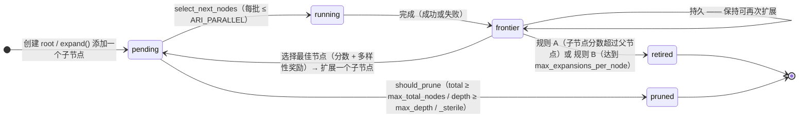

---
sources:
  - path: ari-core/ari/orchestrator/bfts.py
    role: implementation
  - path: ari-core/config/workflow.yaml
    role: config
last_verified: 2026-06-10
---

# BFTS 算法

ARI 实现了真正的最佳优先树搜索，采用双池设计：

- **`pending`**：准备运行的节点（已从父节点扩展）
- **`frontier`**：已完成但尚未扩展的节点

两个池及其之间的转移（自环表示*持久前沿* —— 已完成的节点会保留下来以供再次扩展）：



失败的节点**不会重试**：它仍会进入前沿，并被扩展为一个 `debug` 子节点
（`frontier → pending` 边）。恢复是作为新节点进行的，而非重新执行。

```python
def bfts(experiment, config):
    root = Node(experiment, depth=0)
    pending = [root]      # nodes ready to execute
    frontier = []         # completed nodes awaiting expansion
    all_nodes = [root]

    while len(all_nodes) < config.max_total_nodes:

        # --- BFTS STEP 1: expand the best frontier node ---
        # LLM reads metrics of all completed nodes and selects
        # the most promising one to expand (one child per call)
        while frontier and len(pending) < max_parallel:
            best = llm_select_best_to_expand(frontier)  # by _scientific_score + diversity_bonus
            # Frontier nodes stay available for re-expansion
            child = llm_propose_one_direction(best, existing_children=best.children)
            pending.append(child)
            all_nodes.append(child)

        # --- BFTS STEP 2: run a batch of pending nodes ---
        batch = llm_select_next_nodes(pending, max_parallel)
        record_run(batch)  # track label diversity
        results = parallel_run(batch)

        for node in results:
            memory.write(node.eval_summary)   # save to ancestor-chain memory
            frontier.append(node)             # will expand when selected

    return max(all_nodes, key=lambda n: n.metrics.get("_scientific_score", 0))
```

关键特性：
- **单子节点扩展**：`expand()` 每次调用只生成恰好一个子节点。它会提供丰富的上下文（兄弟节点分数、祖先链、树多样性指标、已有子节点）以避免重复。提示中还会呈现当前 depth/`max_depth` 与剩余节点预算，使规划器能够自行把握节奏（v0.7.2, I-4）。
- **持久前沿**：已完成的节点在扩展后仍留在前沿，并通过 `_touched_this_round` / `_failed_this_round` 跟踪以供再次扩展。当满足 (规则 A) 子节点在 `_scientific_score` 上超过父节点，或 (规则 B) 已被扩展 `max_expansions_per_node` 次时，前沿节点会被**退役 (retire)**（v0.7.2, B-6）。
- **`should_prune` 谓词**：仅硬性截断 —— `current_total >= max_total_nodes`（B-1）、`depth >= max_depth`（B-2，此前为失效配置）、`metrics._sterile is True`（B-4）。LLM 判断不掺入此处。
- **多样性奖励**：对代表性不足的标签给予 `+0.05`（跟踪最近 20 次运行），条件是 `my_count * 2 ≤ max_count`（I-2）；在两个选择器回退路径（I-3 / L-3）以及 `select_next_node` 的 LLM 提示中均会应用。
- **分数校准**：评估器将最近的分数历史注入提示，以防止分数坍塌（所有分数聚集在同一数值附近）。
- **不重试**：失败的节点通过 `expand()` 产生 `debug` 子节点，而非重新执行。不为选择目的维护 `retry_count` 字段（B-3）。
- **严格预算**：`len(all_nodes) < max_total_nodes` 防止超额。实时计数是唯一真实来源 —— 不存在单独的 `BFTS.total_nodes` 计数器（B-1）。
- **完成后的 `record_run`**：运行循环在 `future.result()` 返回后（无论成功或失败）调用 `bfts.record_run(result)`，因此多样性奖励反映的是实际执行过的节点（I-7）。
- **`generate_ideas` 仅调用一次**：在根节点之后被抑制以防止循环。

### 节点标签

| 标签 | 含义 |
|------|------|
| `draft` | 从头开始的新实现 |
| `improve` | 调优父节点的参数或算法 |
| `debug` | 修复父节点的失败 |
| `ablation` | 移除一个组件以衡量其影响 |
| `validation` | 在不同条件下重新运行父节点 |
| *(自定义)* | 未知标签会归并为 `other`，`raw_label` 保留原始字符串 |

---

## 另请参阅

[架构](architecture.md) · [记忆架构](memory.md) · [配置 → BFTS 评估层](../reference/configuration.md#bfts-evaluation-layers-configurable) · [术语表](../reference/glossary.md)
