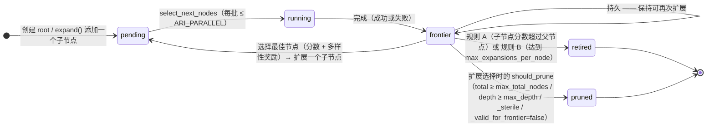

---
sources:
  - path: ari-core/ari/orchestrator/bfts.py
    role: implementation
  - path: ari-core/ari/agent/metric_contract.py
    role: implementation
  - path: ari-core/ari/rqgm/runtime.py
    role: implementation
  - path: ari-core/ari/cli/bfts_loop.py
    role: implementation
  - path: ari-core/ari/cli/run.py
    role: implementation
  - path: ari-core/ari/rqgm/store.py
    role: implementation
  - path: ari-core/config/workflow.yaml
    role: config
last_verified: 2026-08-16
---

# BFTS 算法

ARI 实现了真正的最佳优先树搜索，采用双池设计：

- **`pending`**：准备运行的节点（已从父节点扩展）
- **`frontier`**：已完成但尚未扩展的节点

两个池及其之间的转移（自环表示*持久前沿* —— 已完成的节点会保留下来以供再次扩展）：


```mermaid
stateDiagram-v2
    direction LR
    [*] --> pending: 创建 root / expand() 添加一个子节点
    pending --> running: select_next_nodes（每批 ≤ ARI_PARALLEL）
    running --> frontier: 完成（成功或失败）
    frontier --> frontier: 持久 —— 保持可再次扩展
    frontier --> pending: 选择最佳节点（分数 + 多样性奖励）→ 扩展一个子节点
    frontier --> retired: 规则 A（子节点分数超过父节点）或 规则 B（达到 max_expansions_per_node）
    frontier --> pruned: 扩展选择时的 should_prune（total ≥ max_total_nodes / depth ≥ max_depth / _sterile / _valid_for_frontier=false）
    retired --> [*]
    pruned --> [*]
```

失败的节点**不会重试**：它仍会进入前沿，并被扩展为一个 `debug` 子节点
（`frontier → pending` 边）。恢复是作为新节点进行的，而非重新执行。

```python
def bfts(experiment, config):
    root = Node(experiment, depth=0)
    pending = [root]      # nodes ready to execute
    frontier = []         # completed nodes awaiting expansion
    all_nodes = [root]

    while len(all_nodes) < config.max_total_nodes:

        # --- BFTS STEP 1: expand the best frontier node ---
        # LLM reads metrics of all completed nodes and selects
        # the most promising one to expand (one child per call)
        while frontier and len(pending) < max_parallel:
            best = llm_select_best_to_expand(frontier)  # by _scientific_score + diversity_bonus
            # Frontier nodes stay available for re-expansion
            child = llm_propose_one_direction(best, existing_children=best.children)
            pending.append(child)
            all_nodes.append(child)

        # --- BFTS STEP 2: run a batch of pending nodes ---
        batch = llm_select_next_nodes(pending, max_parallel)
        results = parallel_run(batch)

        for node in results:
            record_run(node)                  # AFTER completion: label diversity
            memory.write(node.eval_summary)   # save to ancestor-chain memory
            frontier.append(node)             # will expand when selected

    return max(all_nodes, key=lambda n: n.metrics.get("_scientific_score", 0))
```

关键特性：
- **单子节点扩展**：`expand()` 每次调用只生成恰好一个子节点。它会提供丰富的上下文（兄弟节点分数、祖先链、树多样性指标、已有子节点）以避免重复。提示中还会呈现当前 depth/`max_depth` 与剩余节点预算，使规划器能够自行把握节奏（v0.7.2, I-4）。
- **持久前沿**：已完成的节点在扩展后仍留在前沿，并通过 `_touched_this_round` / `_failed_this_round` 跟踪以供再次扩展。当满足 (规则 A) 子节点在 `_scientific_score` 上超过父节点，或 (规则 B) 已被扩展 `max_expansions_per_node` 次时，前沿节点会被**退役 (retire)**（v0.7.2, B-6）。
- **`should_prune` 谓词**：仅硬性截断 —— `current_total >= max_total_nodes`（B-1）、`depth >= max_depth`（B-2，此前为失效配置）、`metrics._sterile is True`（B-4）、`metrics._valid_for_frontier is False`（RQGM 选择性擦除；该键只由 RQGM 机构写入，故在 `simple_bfts` 下是死分支，但它被无条件读取，因此在 `ari_rqgm` 下被擦除的节点即使切回模式也仍被排除）。LLM 判断不掺入此处。
- **多样性奖励**：对代表性不足的标签给予 `+0.05`（跟踪最近 20 次运行），条件是 `my_count * 2 ≤ max_count`（I-2）；在两个选择器回退路径（I-3 / L-3）以及 `select_next_node` 的 LLM 提示中均会应用。
- **覆盖感知的扩展选择**：当运行携带含 claim 的指标契约时，传给 `select_best_to_expand` 的目标文本会额外携带一个运行级 claim 覆盖块加上 **LINEAGE** 提示（见下文*世系链接*），使「能为尚未覆盖的 claim 提供证据」可以影响*扩展哪个*节点 —— 这是仅调度器可见的信号；节点的推理上下文不受影响。
- **分数校准**：评估器将最近的分数历史注入提示，以防止分数坍塌（所有分数聚集在同一数值附近）。
- **不重试**：失败的节点通过 `expand()` 产生 `debug` 子节点，而非重新执行。不为选择目的维护 `retry_count` 字段（B-3）。
- **严格预算**：`len(all_nodes) < max_total_nodes` 防止超额。实时计数是唯一真实来源 —— 不存在单独的 `BFTS.total_nodes` 计数器（B-1）。
- **完成后的 `record_run`**：运行循环在 `future.result()` 返回后（无论成功或失败）调用 `bfts.record_run(result)`，因此多样性奖励反映的是实际执行过的节点（I-7）。
- **`generate_ideas` 仅调用一次**：在根节点之后被抑制以防止循环。

### 世系链接（Lineage Chaining）

有些已声明的 claim 无法由一次全新的探测取证：其证据是从已存在的
测量**计算**得来的（参数拟合、留出验证、基于模型的选择）。在纯分数
驱动的扩展下，这些 claim 在结构上不可达 —— 从无数据父节点扩展出的
子节点没有可供计算的输入，且在真实运行中观测到会退化为反复重跑同一
探测。使能机制是**父 → 子 `work_dir` 继承**：每个子节点从其父节点
工作目录的副本开始（代码、配置与谱系性的 `results*.json` 测量文件被继承；
输出工件 —— 日志、结果 CSV，以及 `results.json` / `*_results.json` 本身 ——
被 `_OUTPUT_BLACKLIST` 挡下，因此子节点无法把父节点的头条数字当作自己的
读回来），因此扩展正确的父节点会把
输入文件直接摆到子节点面前。两个转向信号利用了这一点
（`ari/agent/metric_contract.py`）：

- **LINEAGE 提示（选择器侧）**：追加到扩展选择目标上的运行级 claim
  覆盖块会点名到目前为止持有最多契约证据测量名称的节点（要求
  ≥ 2），并建议为尚未覆盖的计算证据型 claim 扩展*那个*节点 ——
  子节点随后读取继承的文件而不是重新测量
  （`build_expand_coverage_hint`）。
- **INHERITED DATA 注记（节点侧）**：其继承的 `work_dir` 中已含
  世系测量的节点，会在其固定的契约义务中得到一条注记，列出这些
  文件与其中出现的契约证据名称，并指示从它们计算并以「精确的」
  契约名称发出 —— 而不是重跑底层实验
  （`build_inherited_data_note`）。

两个信号都**只携带名称和文件名**：测量值和兄弟节点的结论从不流动，
因此树所依赖的分支故障隔离得到保留。每节点的归属来自
`collect_node_measurement_names`，它（一旦 `tree.json` 存在）只统计
评估器标记为 `has_real_data` 的节点 —— 转向视图与 claim gate 的
证据视图保持对齐。

### 节点标签

| 标签 | 含义 |
|------|------|
| `draft` | 从头开始的新实现 |
| `improve` | 调优父节点的参数或算法 |
| `debug` | 修复父节点的失败 |
| `ablation` | 移除一个组件以衡量其影响 |
| `validation` | 在不同条件下重新运行父节点 |
| *(自定义)* | 未知标签会归并为 `other`，`raw_label` 保留原始字符串 |

---

## `ari_rqgm` 下的受治 BFTS（可选启用）

在可选启用的 `ari_rqgm` 执行模式中，上述算法不变 —— 治理在五个接缝
处*包裹*它（前四个 fail-open；在默认 `simple_bfts` 下这些代码一概不被
导入）：

- **`GovernedSearchStrategy` 接缝**（`ari/rqgm/runtime.py`）：
  `build_runtime` 把 BFTS 策略包裹在一个纯委托包装器中，实现同样的
  七个 `SearchStrategy` 方法。运行循环用一次鸭子类型读取
  （`getattr(bfts, "rqgm", None)`）检测它；选择、剪枝和多样性逻辑
  被逐字转发。
- **仅摘要的扩展上下文**：当存在被选中的 `ProposalRecord` 时，传入
  `expand()` 的 `idea_context` 由其封顶的 `ProposalSummaryView`
  重新渲染（预算：`proposal_router.summary_budget_chars`），而不是
  原始的 `idea.json` 文本；每个被提议的子方向都会作为提案观察记录
  回去。完整记录绝不触达 BFTS。
- **纪元边界**：循环在开始处和每次外层循环头部调用
  `ensure_epoch`；每产生 `rqgm.epoch.nodes_per_epoch` 个新节点后，
  边界事务在主线程上运行（审计 → 转换 → 修复），无节点在途。
  评估之后，每个已完成节点还会在其节点报告写出之前获得一轮尽力
  而为的对抗回合。
- **前沿修复钩子**：边界心跳接收实时的
  `frontier`/`pending`/`all_nodes` 状态，使退役可以逻辑擦除过期
  记录并重建前沿；两次内核校验失败会设置 `expansion_halted`，循环
  排空挂起的工作且不再扩展。
- **由保证门控的前沿准入** —— 这是在 `ari_rqgm` *之上*的又一层可选启用，
  仅当 `knowledge.mode` / `capability_binding.mode` / `assurance.mode`
  之一离开其 legacy-inert 默认值（`off` / `legacy` / `off`）时才生效。
  此时每个已完成节点先经过 `RQGMRuntime.assure_node`，而前沿准入、
  Rule A 与 Rule B 全都推迟到保证门控、sterile 判定、对抗回合与
  类型化节点报告都完成之后。被门控归类为 `uncertified_frontier` 的节点
  不会进入前沿；Rule A 还额外要求子节点是 `scientific_frontier`，而不只是
  非 `_sterile`。与上面几个接缝不同，这一个是 fail-closed：没有
  `assure_node` 桥的 RQGM 运行时会抛出异常，而不是回落到旧的顺序。

各层、纪元算法与不变量记录在
[Constitutional ARI-RQGM 架构](rqgm_architecture.md)中。

---

## resume 重建的是树，不是搜索状态

`ari resume` 读取 `tree.json` 并为每个条目重建一个 `Node`，但它只恢复每个节点
状态的**一个子集**，并且完全不重建搜索算法自身的状态。推理一次 resume 后的
运行时，这两半都重要。

**节点状态**。`ari-core/ari/cli/run.py` 中的 resume 路径恢复 `id`、
`parent_id`、`depth`、`retry_count`、`artifacts`、`eval_summary`、
`error_log`、`children`、`created_at`、`completed_at`、`ancestor_ids`、
producer 与 RQGM 的溯源／保证字段，然后是 `status`、`label`、`metrics`、
`has_real_data` 和 `evaluation_cases`。有若干键 `Node.to_dict()` 会写出但
不会被读回 —— `trace_log`、`evaluation_status`、`raw_label`、`name`、
`original_direction` 和 `node_report_path` —— 而根本不进入 `tree.json` 的字段
（`memory_snapshot`、`full_messages`、`full_tools`、智能体自述字段、
`measurement_audit`、`evaluator_reason`）则从 dataclass 默认值开始。状态为
PENDING 或 FAILED 的节点被重置为 PENDING 并重新排队，其余一律视为已完成。

**搜索状态**。resume 的运行会通过 `build_runtime` 构造一个全新的 `BFTS`，
并从头重新进入 `_run_loop`，因此三个计数器都从空开始：

| 计数器 | 定义处 | 什么被重置 |
|---|---|---|
| `BFTS._expansion_count` | `ari/orchestrator/bfts.py` | Retire Rule B 的逐节点扩展计数；已达到 `max_expansions_per_node` 的节点重新变得可扩展 |
| `BFTS._recent_label_history` | `ari/orchestrator/bfts.py` | 多样性奖励的窗口（最近 20 个标签）；对欠代表标签的 `+0.05` 从空历史开始计算 |
| `_lineage_actions_taken` | `ari/cli/bfts_loop.py` | lineage 钩子针对 `rate_limit_per_run` 的每次运行预算被重新填满 |

三者都没有被持久化，也不可能被持久化：`tree.json` 是契约冻结、仅可增补的格式
（见[架构](architecture.md)的 *探索阶段的 must-not-break 登记册（BX-1 … BX-19）*
中的 BX-7），新的搜索状态无法搭它的便车。

**纪元状态为何要有自己的文件**。这正是受治模式不把纪元状态放进树或内存的原因。
它持久化到由 `ari/rqgm/store.py` 写入的、位于检查点根目录的专属文件：
`rqgm_transitions.jsonl` 是 resume 时重放的仅追加、哈希链式真相源，
`rqgm_audit.jsonl` 是不可变审计日志，`epoch_state.json` /
`rqgm_registry.json` 是派生快照——加载时与重放校验，不一致则重建。模式溯源
放在第五个文件 `rqgm_state.json` 中。resume 先读 `tree.json`，之后才对账模式，
但顺序不影响结果：
持久化的模式同时压过 config 与环境变量，所以一次运行的模式绝不会中途翻转，
`simple_bfts` 的检查点也绝不会在 resume 时被升级。

---

## 另请参阅

[架构](architecture.md) · [Constitutional ARI-RQGM 架构](rqgm_architecture.md) · [记忆架构](memory.md) · [配置 → BFTS 评估层](../reference/configuration.md#bfts-evaluation-layers-configurable) · [术语表](../reference/glossary.md)
