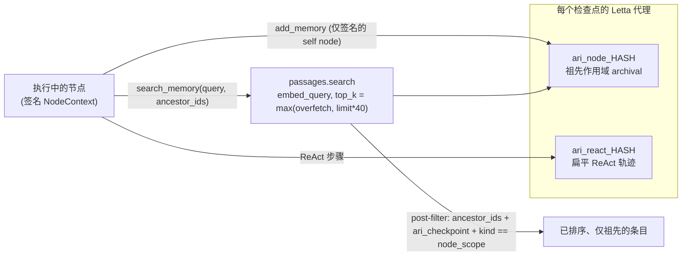

---
sources:
  - path: ari-core/ari/memory/letta_client.py
    role: implementation
  - path: ari-skill-memory
    role: implementation
  - path: ari-core/ari/memory_cli.py
    role: implementation
  - path: ari-core/ari/memory_contract.py
    role: implementation
  - path: ari-core/ari/call_context.py
    role: implementation
  - path: ari-core/ari/agent/loop.py
    role: implementation
  - path: ari-core/ari/cli/run.py
    role: implementation
last_verified: 2026-08-16
---

# 记忆架构

每个节点仅从其祖先链中读取：

```
root ──▶ memory["root"]
  ├─ node_A ──▶ memory["node_A"]
  │    ├─ node_A1  (读取：root + node_A)
  │    └─ node_A2  (读取：root + node_A，不读取 node_A1)
  └─ node_B  (仅读取 root，不读取 node_A 分支)
```

`search_memory` 的调用查询是
`query = (eval_summary or experiment_goal or "experiment result")[:200]`
—— 节点有方向性单句描述时就用它，并做截断。后端会先*请求*服务端的元数据预过滤；
Letta 适配器对此无条件拒绝（`if filter is not None: raise NotImplementedError`，
因为 ARI 的元数据是以 JSON 页脚的形式附在 passage 文本上往返的，并非可查询字段），
因此在 Letta 0.16.x 上实际总是走 over-fetch 路径：调用
`passages.search`（`GET /archival-memory/search`，`embed_query=True`），以
`top_k = max(letta_overfetch, limit*40)` 拉取，再按 `ancestor_ids` / `ari_checkpoint` / `kind == "node_scope"` 做本地 post-filter。**服务端返回的 embedding 排序得以保留**，子节点按其查询的语义相关度从高到低看到祖先条目。被刻意避开的 `passages.list(search=q)` 路由实际上是 SQL substring filter（`LOWER(text) LIKE LOWER(%q%)`），长的自然语言查询无法与 `RESULT SUMMARY metrics=[...]` 这类结构化条目子串匹配，会静默返回 0 条 —— 详见 `ari-skill-memory/src/ari_skill_memory/backends/letta_backend.py` 的 live verification。

### v0.6.0：基于 Letta

两个层级共存于每个检查点的同一个 Letta 代理中：

- `ari_node_<ckpt_hash>` — 节点作用域的 archival 集合，使用上述祖先作用域元数据过滤器。
- `ari_react_<ckpt_hash>` — 每个检查点的扁平 ReAct 轨迹（`LettaMemoryClient`，不做祖先过滤）。

经由这两个集合的读写路径（`HASH` = 检查点哈希；签名上下文验证与 post-filter 共同保证作用域）：



代理还会向核心记忆块（`persona` + `human` + `ari_context`）种入实验目标、主要指标和硬件规格 ── 时机为首个节点的 `generate_ideas` 完成时（即 `primary_metric` 被确定的时刻）。技能可通过 `get_experiment_context()` 读取，无需付出搜索成本；在 seed 执行之前调用会返回 `{}`，并且该调用会把读到的内容缓存 60 秒。

**Copy-on-Write**：每次记忆调用都携带显式的 `RunContextV1` 和
`NodeContextV1`。节点上下文将 `run_id`、self node、父节点以及从 root
到父节点的有序祖先列表绑定到 `lineage_digest`。模型生成工具参数后，
ari-core 注入按连接签名的 capability，记忆技能在任何 I/O 之前验证它。
写入仅能以 self 为目标，读取仅能指定签名 lineage（工具允许时加上 self）。
不存在可变的进程级全局节点变量，因此并行兄弟不会竞争，也无法相互授权。
Letta 自编辑仍被禁用，以保持已接受条目的字节稳定性。

**可移植性**：每个检查点携带经 digest 验证的
`memory_backup.v1.json.gz`。`ari resume` 在恢复前先做验证（大小上限、gzip/JSON
解析、`MemoryBackupV1` schema），且**仅当**目标 Letta 中既无节点条目也无 ReAct
条目时才执行恢复 —— 设置 `ARI_MEMORY_AUTO_RESTORE=false` 可跳过该步骤。
因此可安全执行 `cp -r checkpoints/foo /elsewhere/`。记录按内容寻址，不依赖 Letta
checkpoint namespace。

类型化条目采用公共 `MemoryRecordV1` 契约；语义搜索返回带 backend/server/model
版本、排序确定性、query digest、边界和 filter evidence 的 `MemoryRetrievalV1`。
记忆文本只是索引，只有已验证 artifact 才能支撑论文或图表声明。详见
[研究记忆契约](../reference/memory_contract.md)。

---

## 另请参阅

[架构](architecture.md) · [BFTS 算法](bfts.md) · [术语表](../reference/glossary.md)
