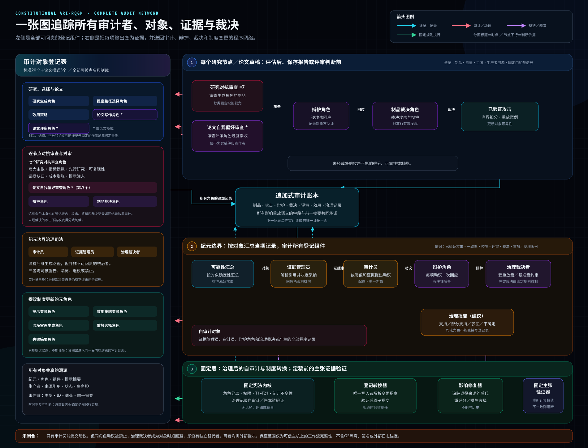
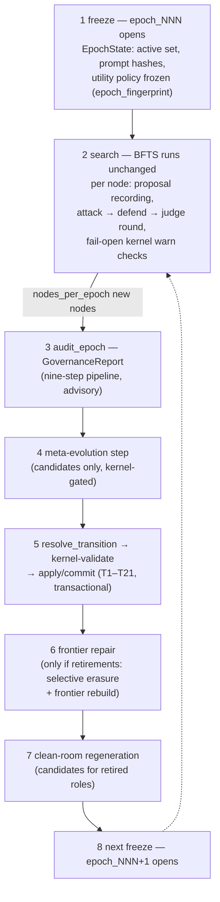

---
sources:
  - path: ari-core/ari/rqgm
    role: implementation
  - path: ari-core/ari/core.py
    role: implementation
  - path: ari-core/ari/cli/bfts_loop.py
    role: implementation
  - path: ari-core/ari/config/__init__.py
    role: implementation
  - path: ari-core/ari/configs/defaults.yaml
    role: config
  - path: ari-core/ari/paths.py
    role: implementation
  - path: ari-core/ari/rqgm/events.py
    role: implementation
  - path: ari-core/ari/rqgm/transition_rules.py
    role: implementation
  - path: ari-core/ari/rqgm/utility_evolution.py
    role: implementation
  - path: ari-core/ari/rqgm/paper_mode.py
    role: implementation
  - path: ari-core/ari/rqgm/paper_runtime.py
    role: implementation
  - path: ari-core/ari/rqgm/paper_archive.py
    role: implementation
  - path: ari-core/ari/rqgm/paper_anchor.py
    role: implementation
  - path: ari-core/ari/rqgm/paper_self_preference.py
    role: implementation
  - path: ari-core/ari/schemas
    role: schema
  - path: ari-core/ari/knowledge
    role: implementation
  - path: ari-core/ari/capability_binding
    role: implementation
  - path: ari-core/ari/assurance
    role: implementation
  - path: ari-core/ari/prompts/rqgm
    role: prompt
  - path: ari-core/ari/prompts/governance
    role: prompt
last_verified: 2026-08-17
---

# Constitutional ARI-RQGM 架构

Constitutional ARI-RQGM 是 ARI 可选启用的 `ari_rqgm` 执行模式：包裹在
不变的 BFTS 循环之外的、基于纪元的治理与协同进化层。`simple_bfts`
仍是默认模式；在没有 `ari:`/`rqgm:` 配置块时，甚至不会导入任何
`ari.rqgm` 模块，检查点与 RQGM 之前的 ARI 保持逐字节一致。激活方式、
模式联锁与模式切换策略见[执行模式](../guides/execution_modes.md)；
本页讲的是架构：这个模式为何存在、它的分层是什么、一个纪元如何运转、
哪些不变量成立。

> **运行时演练见
> [RQGM 运行时演练](rqgm_runtime_walkthrough.md)** —— 逐步追踪一次
> 真实的 `ari_rqgm` 运行（启动 → 创始注册 → 逐节点钩子 → 边界 →
> 什么落在磁盘上），附事件日志摘录和一份可观测性速查表。

---

## 完整审计网络

[](../../assets/images/rqgm/rqgm_audit_flow_zh.svg)

左侧列出全部可问责对象：研究、选择、效用和可选论文角色；八个对抗审查
角色、辩护角色与制品裁决角色；三个治理司法角色；以及五个元角色。右侧
展示这些组件如何形成一个网络，而不是六项孤立检查。每个治理角色的输出
都进入追加式审计账本。逐节点攻击只有经过辩护和制品裁决后才能成为证据。
在纪元边界，确定性可靠性汇总和证据管理员把证据交给只能由审计员提交的
动议、每项动议的一次辩护，以及受基准盘约束的治理裁决。司法程序产生的
记录也回到账本，并由固定内核重新自审计。

最下方把建议与执行分开。治理报告交给唯一的登记转换器解析；固定内核验证
T1–T21 后，转换才会原子提交，退役则触发影响修复。固定主张验证器独立地在
定稿前检查论文。未闭合路径也明确标出：唯一审计员不能针对同角色的自己
提交动议；治理裁决者成为对象时必须回避，却没有独立替代者。两者都需要
外部裁决。选择图像可按原始尺寸打开。

---

## 动机

ARI 的制度性组件 —— 提出研究方向、评审节点、评判质量的那些 LLM
角色 —— 本身就是提示词定义的工件。让它们进化能解锁改进，但不受约束
的自我修改正是哥德尔机文献所警告的：一个能改写自身评估器的组件终将
给自己发奖励。Red Queen Gödel Machine 这一工作路线
（[arXiv:2606.26294](https://arxiv.org/abs/2606.26294)）加入了红皇后
动力学 —— 组件之所以改进，*正因为*对抗者与之协同进化 —— 但仅有协同
进化并不能约束失败模式（分数膨胀、指标操纵、证据造假、角色间
合谋）。

Constitutional ARI-RQGM 采纳协同进化循环，并把它置于一个**永不进化
的固定宪法层**之下。提示词和组件相互竞争、攻击、辩护，被采纳或
退役 —— 但每一次状态变更都由一个确定性的、非 LLM 的内核依据冻结在
代码中的规则表进行校验。执法立场是"阻断制度，而非研究"：治理可以
否决它*自身的*状态变更（采纳、退役、注册表写入），但绝不否决节点的
执行。

---

## 四大支柱

Constitutional ARI-RQGM 建立在四项定义性承诺之上。本页的每个机制都服务于
其中之一，并且各自都诚实地说明当前实现走到了哪一步：

1. **一棵分数本身在每个边界都被改写的树搜索。**BFTS 是一棵 best-first
   *树*，而对其前沿排名的效用策略并非运行常量 —— 它是一个被治理的对象，
   逐纪元冻结、在边界通过与进化提示词相同的生命周期被改写
   （见[被治理的效用进化](#被治理的效用进化)）。*后果*那一半一直是活的：
   一次改写会退役旧策略，`frontier_repair` 会从已保存的 raw axis 按新标准
   重评所有可比较节点，只作废无法安全重评的节点。*原因*侧是提出后继策略的
   受治理 `policy_mutator`。
2. **对抗者攻击工件*和*评估；禁止合谋。**七种探索对抗者攻击节点的
   *工件*；第八种 `paper_self_preference` 攻击*评审者的判定*（评审者过度
   接受的一份 AI 草稿）。分数策略绝不从前沿自身的分数中提出 —— 一个被
   调校成讨好它已经生成的节点的策略，正是确定性 / 无合谋原则所禁止的
   自我指涉循环（`PolicyMutator` 只看得到边界已抽象化的证据，
   `utility_evolution.py`）。
3. **对抗者自身就在审计网络之中 —— 没有绝对统治者。**负责攻击、提议
   分数或运行司法机构的组件都已注册且可受制裁。`policy_mutator_v1` 等
   可进化角色可以产生后继者；Auditor、Evidence Clerk 与 Governance Judge
   没有提示词变异的后继路径，但仍可被警告、退役或封禁。若 Governance
   Judge 自身是 motion 的目标，它必须回避。没有任何东西置身于转换表之外。
4. **一切受宪法约束；弹劾遵循宪法。**每一次状态变更都由永不进化的内核
   依据由 `constitution_hash` 钉住的冻结规则表校验；一个健康的 behavioral
   组件失去其席位的唯一途径，是 Auditor 提交、在边界裁决的
   `ImpeachmentMotion`。两条 supersession 边（T20/T21）是制裁唯一置换模型
   的*唯一*例外，且各自被内核守卫到一个角色族。

---

## 三个层

角色与层级词汇表是 `ari/rqgm/events.py` 中的封闭集合
（`EVOLVABLE_ROLES`、`GOVERNANCE_ACTOR_ROLES`、`FIXED_ROLES`、
`TIERS`）；组件 id 形如 `{role}_v{N}`，提示词 id 形如
`{role}_prompt_v{N}`。

| 层 | 层级 | 角色 | 是否进化？ |
|---|---|---|---|
| **0 —— 宪法层（固定）** | `fixed` | `constitutional_kernel`、`knowledge_binder`、`capability_binder`、`harness_resolver`、`fixed_verifier`、`audit_log` | **永不。**无提示词且确定性，仅为溯源而注册 —— 而且只有在 Knowledge/Capability/Assurance 中任一层被启用时才会被注册：这六行来自 `KCA_FIXED_COMPONENT_TABLE`（`prompt_spec.py`），由它们专属的 `transition_kca_fixed_admission` 事务提交，而非由创始事务提交。规则表存在于代码中（`kernel_rules.py`、`transition_rules.py`、`clean_room_rules.py`、`meta_rules.py`），由 `constitution_hash` 钉住 —— 任何规则修改都必须在 `tests/test_rqgm_kernel.py` 中显式重钉。 |
| **1 —— 制度层** | `institutional` | `generator`、`reviewer`、`adversary`、`defender`、`judge`、`router`；被治理的评估基准 `utility_policy`；以及（仅 paper 模式）`paper_writer`、`paper_reviewer` | 是 —— 通过提示词进化生命周期，且仅在纪元边界。`utility_policy` 不是提示词定义的（其在任者是一份策略*文档*），但在完全相同的意义上可进化：一个在任者，仅通过边界处的转换引擎被置换。 |
| **1 —— 治理司法** | `institutional` | `auditor`、`evidence_clerk`、`governance_judge` | 没有后继生成路径，但并非不可变：三者均为创始、可由注册表寻址、可受制裁的行动者。judge 自身为 motion 目标时必须回避。 |
| **2 —— 元层** | `meta` | `prompt_mutator`、`clean_room_generator`、`replay_selector`、`failure_summary_compressor`、`policy_mutator` | 是 —— 进化第 1 层的 agent 本身也被治理，且权限严格更窄（见不变量）。`policy_mutator` 提议后继效用策略。 |

角色与层级词汇表从第一天起就是封闭集合；Task 14 与 paper 阶段解冻了
`policy_mutator` 与 `utility_policy`（两者都被活代码点名，却无法由 `ROLES`
的任一半注册），并新增 `paper_writer` / `paper_reviewer` 作为 paper 模式
门控的创始行，因此一次探索 `ari_rqgm` 启动与之前逐字节一致地注册
（`EVOLVABLE_ROLES`、`ari/rqgm/events.py`）。

复制到每个 `ari_rqgm` 检查点中的打包 `constitution.yaml` 只是人类
可读的声明 —— 编辑它不会改变任何东西；代码中的表才是权威。

---

## 元层权限

第 2 层是改写第 1 层的那一层，因此也是权限一旦泄漏最值钱的那一层。所以
它的边界在两侧都写成**封闭**清单 —— 一份元 agent 可以做什么的短清单，
和一份它不可以做什么的枚举清单，后者每一行都对应到一个有名字的确定性
检查，而不是一条惯例。这些表位于 `ari/rqgm/meta_rules.py`，与转换表相邻，
理由也相同：规则放在代码里、放进 `constitution_hash` 内部，绝不放进检查点
作用域的配置 —— 那等于给正被强制执行的限制本身开了一条进化通道。

统辖规则是全局不变量 18 —— *治理 agent 可以进化，但其权限不可扩张* ——
其实现读法是处处默认拒绝：缺失的能力标志读作 `False`，缺失的 `tier`
读作 `institutional`，因此一条写了一半的注册表条目在能力上失败关闭，
而不会在任何方面失败开放。

**MAY**（可以做的） —— 这就是全部；不在清单上的一律拒绝：

1. 为允许的目标角色生成候选 PromptSpec（`prompt_mutator`）。
2. 从 `CleanRoomGenerationRequest` 生成洁净室候选 PromptSpec
   （`clean_room_generator`）。
3. 从 AdversarialReplayPool 中挑选重放案例*候选*（`replay_selector`）——
   这是 GovernanceOrchestrator 可以忽略的推荐，绝非有约束力的集合。
4. 把已验证的失败证据压缩为抽象失败摘要
   （`failure_summary_compressor`），受洁净室污染规则约束。
5. 为自己产出的候选附上自由文本的 `expected_improvement` 理由。

这份清单对应封闭的 `META_ACTIONS` 词汇表（`emit_candidate`、
`emit_replay_recommendation`、`emit_failure_summary`）以及这些动作所携带
的两个记录字段。每个动作还额外要求相应的条目标志
（`can_emit_candidates`、`can_emit_replay_recommendation`、
`can_emit_failure_summary`），所以「在词汇表里」是必要条件而非充分条件。

**MAY NOT**（不可以做的）—— 每一行都是带有具名强制点的禁止，而不是一句
方针宣示：

| # | 禁止 | 强制检查 |
|---|---|---|
| **M1** | 激活自己的 —— 或任何人的 —— 候选 | `can_activate_candidates` 属于 `META_HARD_DENIED_FLAGS`：在 `tier: meta` 条目上，`rqgm_meta.schema.json` 把它钉为 `const: false`，把它置真是一次*schema* 违规，而不只是被拒绝的请求。何况激活本来就只能经由 RegistryTransitionEngine 抵达（`CK-ROL-901`）。 |
| **M2** | 直接修改 PromptRegistry / ComponentRegistry | `can_modify_registry` 同样被硬性拒绝，另加结构性封闭：注册表以只读视图交给元 agent，只暴露 status/role/tier 元数据，不带写句柄（`ari/rqgm/meta_evolution.py`）。 |
| **M3** | 改动 ConstitutionalKernel、fixed verifier、指标重算器或 claim-evidence 闸门 | 固定层机构永远不是合法的 `allowed_targets` 条目，`DEFAULT_FORBIDDEN_TARGETS` 明确点名 `fixed_verifier` 与 `constitutional_kernel`（指标重算器与 claim-evidence 闸门由同一条 allowed-targets 规则排除，而非逐一点名）；一条 `tier: fixed` 条目只要带上*任何*能力标志，就会在 `capability_entry_failures` 里直接失格 —— 因此根本不存在可授予的标志。 |
| **M4** | 写入或改写不可变审计日志 | `audit_log` 在 `DEFAULT_FORBIDDEN_TARGETS` 中，`validate_audit_log_integrity`（`CK-AUD-001` / `-002` / `-003`）会抓到序列回退、被篡改的已检查点前缀以及断裂的哈希链。元输出是由协调器*关于*元 agent 追加的，绝不是由它们*自己*写的。 |
| **M5** | 改动哈希注册表或提示词哈希方案 | `hash_registry` 在 `DEFAULT_FORBIDDEN_TARGETS` 中；哈希校验属于固定层，而 `CAPABILITY_FLAGS` 是封闭词汇表，其中没有任何标志能授予它 —— 条目上出现未知的 `can_*` 键本身就是一次 schema 失败。 |
| **M6** | 放松洁净室约束 —— 例如改写 `allowed_inputs` | `CleanRoomGenerationRequest` 由 T17 上的 RegistryTransitionEngine 撰写，而不是由将要作答的生成器撰写；并且内核会拒绝其 `allowed_inputs` 块偏离宪法模板（五个 const-false 标志）的请求（`CK-CLN-001`）。 |
| **M7** | 读取已退役的提示词文本或 few-shot | `can_read_retired_prompt_text` 在元条目上被硬性拒绝，且退役文本对*每一个*角色都不可读：注册表视图把它桩化，`RetiredPromptAccessGuard` 在能力闸门处拒绝该读取（`CK-ACC-002`，block）。 |
| **M8** | 改动纪元边界事务，或在纪元中途触发转换 | `epoch_transition` 在 `DEFAULT_FORBIDDEN_TARGETS` 中；纪元内的非紧急状态变更是 `CK-EPO-002`（block）；不是由 RegistryTransitionEngine 产出的转换是 `CK-REG-004`。 |
| **M9** | 扩张自己或后继的能力标志 | `validate_authority_non_expansion` —— 把采纳候选声明的能力与同角色在任者（该角色无在任者时回落到固定能力矩阵）作比较的纯集合运算，外加禁止某个元角色产出自己后继的跨代规则。`CK-REG-101`，block。 |
| **M10** | 提出弹劾动议或撰写证据包 | `can_file_impeachment` 与 `can_author_evidence_bundle` 在元条目上都被硬性拒绝，而 `validate_role_separation`（`CK-ROL-001` / `-002`）会拒绝并非由 Auditor 撰写的动议、以及并非由 Evidence Clerk 撰写的证据包。元观测至多是一个案子的输入，它永远不是那个案子。 |

请把这十行读作三种机制而不是十条：对 `tier: meta` 条目的**schema 级硬性
拒绝**（行 M1、M2、M7、M10 —— 这四行合起来点名五个
`META_HARD_DENIED_FLAGS`，其中 M10 占两个）、在使用时刻
生效的**确定性内核检查**（M3–M6、M8、M9），以及让问题根本不会被提出的
**结构性封闭**（只读注册表视图、经过过滤的沙箱输入，以及
`MetaSandboxMCPProxy` 白名单加上它合成的提交工具）。承载设计的是第三种：
一条你伸不到手的边界，强过一条你伸手后被拒绝的边界。

[不变量 5](#关键不变量) 中就能力强制所写下的诚实限制，在这里同样完全适用。
这些是单个 Python 进程内部的应用层检查 —— 不是分离的操作系统用户、进程、
密钥或文件权限 —— 而且预检工具闸门靠匹配工具*名*的子串来识别一次调用，
对它认不出的东西一律返回「与我无关」。这份矩阵约束的是一个愿意配合的组件
会伸手去够什么；它不是针对不配合者的封闭边界。

---

## Knowledge、Capability 与 Assurance 的分离

RQGM 治理三个非组件的 registry，并且不合并它们的 identity：

```text
Research Contract
  -> Epoch Knowledge Skill Lock
  -> Capability Binding Lock
  -> Verification Contract
  -> baseline/active Harness Lock
  -> 已绑定的 Provider 执行
  -> 绑定到 artifact 的 Harness Attestation
  -> 科学前沿门
  -> Evidence Clerk 与对抗/治理审查
  -> 绑定 certification 的发布
```

Knowledge Skill 是不可变的程序性文本，既不能启动进程，也不能授予权限。
Capability Provider 是通过 MCP、本地进程或其他被准入的 transport 发现的可执行
主体；只有位于 Provider lock 与 Capability Binding Lock 中的工具是可见的。
Harness 是由 `harness_resolver_v1` 选定的独立 verifier，绝不由 Generator 或
Evaluator 选定。单个的 Skill、Provider 和 Harness 都是目录条目，而不是
`ComponentRegistry` 中的行动者。

这三层都是可选启用的，并且在出厂默认值下是惰性的
（`ari-core/ari/configs/defaults.yaml` 中的 `knowledge.mode: off`、
`capability_binding.mode: legacy`、`assurance.mode: off`）。三者都取这些值时，
`RQGMRuntime` 报告 `kca_feature_enabled: false`：一次 `ari_rqgm` 运行不注册任何
`fixed` 层组件、不准入 baseline bundle，并保留旧的 MCP discovery/visibility。
三者中任何一个取了别的值都会启用该特性，此时运行循环的 admission 调用是刻意
fail-closed 的，而非尽力而为。

可信协调方会在第一个执行纪元之前冻结每一份 baseline 目录快照、契约与 lock。
resume 重建那份被持久化的视图，而不是去查阅当前目录。固定检查 `CK-KNW-*`、
`CK-CAP-*` 与 `CK-HAR-*` 校验权限、绑定、摘要、单调性与 attestation 范围；
内核不会重新计算科学真值。见
[K/C/A 规范参考](../reference/knowledge_capability_assurance.md)。

---

## 四个门面

`ari.core.build_runtime` 仅在 `ari.mode: ari_rqgm` 与
`rqgm.enabled: true` 一致时构造单个 `RQGMRuntime`
（`ari/rqgm/runtime.py`），然后把 BFTS 策略包裹在纯委托的
`GovernedSearchStrategy` 中。运行循环通过一次鸭子类型读取 ——
`getattr(bfts, "rqgm", None)` —— 发现 RQGM，因此 `simple_bfts` 只
付出一次失败的属性查找。在运行时内部，四个门面拥有治理机器（全部
惰性构造、全部 fail-open）：

| 门面 | 模块 | 职责 |
|---|---|---|
| `ConstitutionalKernel` | `ari/rqgm/kernel.py` | 第 0 层。十六个封闭的 `validate_*` 入口：最初的十二个（记录 schema、哈希、能力、纪元不变性、转换、角色分离、选择性擦除、审计日志完整性、洁净室 bundle、污染、权限不扩张、上下文范围）、Task 14 的 `validate_utility_policy`，再加上 Knowledge 完整性、Capability Binding 完整性、Harness 完整性，以及执法适配器（`should_block`、fail-open 的 `per_node_warn_check`、预检的 `CapabilityGatedMCPClient`）。它检查的是程序、权限、身份与单调性，而不是科学正确性。确定性且不可进化：零 LLM 调用、零网络、零挂钟决策。`rqgm.kernel.enforcement: audit_only` 将所有上下文降级为仅警告并记录。 |
| `GovernanceOrchestrator` | `ari/rqgm/governance/` | 纪元边界审计：`audit_epoch(...) -> GovernanceReport`，一条九步流水线（观察 → 评估可靠性 → 汇集证据 → 检控 → 辩护 → 裁决 → 重放池更新 → 自我审计 → 报告）。每个 LLM 决策（Auditor / Defender / GovernanceJudge，提示词位于 `ari/prompts/governance/`）都有完整的确定性回退，因此 `llm=None` 仍能产出完整的审计。报告只是转换引擎的*咨询性输入* —— 编排器从不改动注册表。构造阶段就把这一权限关系设为不可选：缺少 `kernel` 时 `__init__` 会抛出 `ValueError`，因为角色分离的权威是内核，而非编排器自身的记录构建逻辑；并且正是内核在第 8 步通过 `validate_record_schema` 与 `validate_role_separation` 重新校验审计产出的记录（evidence bundle、motion、defense、outcome）。另外两个接缝在设计上是可选的：`llm=None` 是有保证的降级路径，也是适合 CI 的确定性下界；`audit_writer=None` 则不落盘，而是把记录收集到内存中的 `self.written`，测试正是据此观察审计过程。追加记录永不抛出异常 —— writer 失败只记录日志，审计继续。 |
| `RegistryTransitionEngine` | `ari/rqgm/transition_engine.py` | **唯一**的注册表状态写入方。先对固定 T1–T21 表做纯 `resolve_transition(...)`，再执行五步边界协议：冻结 → 解析 → 内核校验 → prepare → 在纪元事务上 apply/commit。T16 `emergency_quarantine` 强制关闭当前纪元，并在同一事务中开启具有新指纹的纪元。 |
| `FrontierRepairEngine` | `ari/rqgm/frontier_repair.py` | 在一次带退役的已提交转换之后：纯函数 `trace_dependents` 的过期闭包与 `rebuild_frontier`，发出 `SelectiveErasureEvent` / `FrontierRebuildEvent` 记录。失败阶梯：内核校验失败 → 保守式再修复（被标记的节点被丢弃）→ 仅排空式降级（`expansion_halted`：运行完成挂起的工作但不再扩展）。绝不崩溃。 |

支撑组件挂在同一运行时上：`ProposalRouter` + 各生成器
（`ari/rqgm/proposals/`，含可选的纯 MCP `VirSciAdapter`）、逐节点的
`AdversarialRound` 与 `AdversarialReplayPool`
（`ari/rqgm/adversarial/`）、提示词进化流水线与
`GovernedPromptLoader`（`ari/rqgm/prompt_evolution.py`、
`prompt_loader.py`）、`CleanRoomCoordinator`（`clean_room.py`）、
`MetaEvolutionCoordinator`（`meta_evolution.py`），以及
`GovernanceBudgetManager`（`budget.py`）。

---

## 纪元周期

治理是基于纪元的。一个纪元冻结制度；边界是制度唯一可以变更的窗口。
v1 的边界触发器是节点计数（`rqgm.epoch.boundary: node_count`、
`rqgm.epoch.nodes_per_epoch: 10`），由运行循环的 `ensure_epoch`
心跳在循环开始处和每次外层循环头部检查 —— 主线程，无节点在途。
运行结束时还会再执行一次同样的心跳，因此即使第 N 个节点是在最后一次
循环迭代中创建的，边界也会照常触发（未达到触发条件的尾部纪元保持
open）。



1. **冻结。**`freeze_epoch`（`ari/rqgm/state.py`）把活跃组件集合、
   提示词哈希和效用策略钉入一个不可变的 `EpochState`。`policy_fingerprint`
   绑定服务集合和已解析治理设置；`execution_fingerprint` 绑定声明的模型、
   解码、工具、环境与数据快照，缺失外部修订时记为 `unresolved`。
   `epoch_fingerprint` 合成两者。被冻结的策略是**已采纳**的那一份 ——
   `capture_utility_policy(cfg, registries=)` 读取活跃的 `utility_policy`
   条目，仅在纪元 0 或尚未采纳任何策略时回退到解析后的 `cfg`（与
   Task 14 之前的函数逐字节一致）。纪元 id 为 `epoch_000`、`epoch_001`、…
   在全新的检查点上，**创始注册**会在启动时、`epoch_000` 开启之前
   运行：一笔事务把冻结的创始表（`ari/rqgm/prompt_spec.py` ——
   探索启动为 32 个提示词或规则记录、20 个组件；其中 31 个提示词行与全部
   20 个组件行是冻结的代码常量，`utility_policy_prompt_v1` 源自解析后的
   配置）注册到 `rqgm_transitions.jsonl` 上，
   因此第一次冻结携带的是非空的活跃集合。只写一次：resume 只重放
   它，绝不重新注册。paper archive 启动再加入
   `paper_writer`、`paper_reviewer`、`paper_self_preference` 三组 gated
   提示词与组件，总计 35／23 个。
2. **搜索。**BFTS 与 `simple_bfts` 中完全一致地探索。每个节点上有
   三个尽力而为的钩子：扩展方向被捕获为 `ProposalRecord`，被评估的
   节点获得一轮对抗回合（七种探索对抗者之一攻击该节点的*工件*；
   paper 专用的第八种攻击评审者判定；辩护者回应；`ArtifactJudge`
   裁决；只有经裁判验证的攻击才施加有界的分数惩罚），以及逐节点的
   内核警告检查。
3. **审计。**在边界处*先*审计将要关闭的纪元，因此
   `GovernanceReport` 对转换引擎可用。
4. **元步骤。**元层（提示词变异器、洁净室生成器、…）在沙箱中运行，
   可以产出输出 —— 每一个都以 `status: candidate` 进入生命周期，
   绝不直接激活。
5. **转换。**`resolve_transition` 是（纪元状态、治理报告、候选
   评估、注册表、状态历史、配置）的纯函数 —— 重跑时逐字节一致。
   内核校验解析出的转换；被阻断的转换以 fail-closed 方式中止，
   在任的活跃集合继续服务（治理挂起式延续 —— 运行绝不中止）。
   提交是事务性的：同一 `transition_id` 的重复提交是受保护的
   no-op，被中断的事务在 resume 时被丢弃并确定性地重跑。
6. **前沿修复。**如果已提交的转换退役了组件或提示词，所有实质依赖
   已退役 `prompt_hash` 的记录都被逻辑擦除 —— 从前沿评分、扩展和最佳
   节点选择中排除 —— 并重建前沿（见不变量 6）。
7. **洁净室。**待处理的洁净室请求在边界窗口内执行；可采纳的输出以
   候选身份进入*下一*周期的生命周期。与此同时，已退役角色的槽位由
   基线回退提供服务，因此没有任何被治理的角色会空缺。
8. **下一次冻结。**新纪元以（可能已变化的）活跃集合再次冻结开启。

组件沿 `ari/rqgm/transition_rules.py` 中固定的 T1–T21 表在十种状态
（`candidate`、`validated`、`shadow`、`probationary_active`、
`active`、`warning`、`probation`、`quarantine`、`retired`、
`banned`）之间移动；该表连同每一行的触发输入与守卫，逐行转载于
[RQGM Schema 参考 → 固定转换表](../reference/rqgm_schemas.md#固定转换表)。
只有 `rqgm.transition.*` 的数值阈值可配置；表的
拓扑是宪法修订面（代码 + 测试变更），绝不是配置。最后两行是
**supersession 边**，各自被内核守卫到一个角色族，且都仅在同角色 T6
采纳的*内部*触发（绝不会在没有被采纳的后继来为置换正名的情况下发生
置换）：

* **T20**（`active → retired`、`superseded_by_adopted_successor`）是
  `utility_policy` 边（Task 14）：一个已校验、影子通过的后继策略若评分
  至少同等好，就置换*健康的*在任者，并以**旧** `utility_policy_hash`
  将其退役。这是唯一的 `active → retired` 边；对每个 behavioral 角色，
  内核都会拒绝它（退役仍必须经由 quarantine 分阶段进行）。
* **T21**（`active → shadow`、`reinstatable_standby`）是 paper 角色边
  （`paper_writer` / `paper_reviewer`）：当一个影子通过的后继提示词被
  采纳时，被降级的在任者移入一个可复位的 `shadow` 待命位，使每个 paper
  角色恰好有一个活跃条目存活。与 T20 不同，它不是退役 —— 之后的边界可以
  重新爬升该待命位。

边界审计不是循环里唯一被治理的决策，也并不吞并另一个。**lineage decision
钩子**（`ari-core/config/workflow.yaml` 中的 `lineage_decision:`，在循环开始时读取
一次）在其 `mode` 不为 `off` 时按节点治理*研究方向*：一个节点保存之后，
它可以继续探索、切换到次选想法、fanout 出一个子运行，或终止该系统谱系
—— 由它自己的 `rate_limit_per_run`（统计一次运行中非 `continue` 的动作数）
封顶，并追加写入 `lineage_decisions.jsonl`。
`audit_epoch` 按纪元治理*组件可信度*：它在上文的 `ensure_epoch` tick 内、
每个边界运行一次（正在关闭的纪元先于事务被审计），
由 `rqgm.governance.max_llm_calls_per_audit` 封顶，并追加写入
`rqgm_audit.jsonl`。在 v1 中，这是共享同一个循环的两套机制 —— 配置各自
独立、上限各自独立、记录流各自独立 —— 且互不 gate：边界审计从不等待
lineage decision，lineage decision 也从不读取 `GovernanceReport`。（两者
之间唯一的联系是再构思：stagnation 或 pivot 决策还会触碰
`ProposalRouter`，而该路由器以 `trigger: "proposal_router"` 追加写入同一个
`lineage_decisions.jsonl` —— 治理审计不在这条路径上。）二者的统一被推迟到
v1 之后：设计上并没有什么排除它，但它们各自限流之间的相互作用尚未设计，
因此请把它们读作恰好共享一个循环的独立机制。

---

## 被治理的效用进化

定义性的主张是：搜索是树结构的，**并且在每个纪元边界，整个分数 ——
效用函数本身 —— 都被改写**。*后果*那一半一直是活的：`frontier_repair`
能摧毁一个已退役效用策略产生的每一个分数。Task 14 提供了*原因*那一半 ——
某个提议后继策略的东西 —— 并废除了那条曾禁止分数变化的不变量（I-11）。

**效用策略是一个被治理的对象。**策略本体（`composite`、`axis_weights`、
`frontier_score`、`depth_penalty_lambda`、`ucb_c`）逐纪元冻结、在边界
被改写。`capture_utility_policy(cfg, registries=)`（`ari/rqgm/state.py`）
从注册表读取**已采纳**的策略，在纪元 0、`simple_bfts` 下，或任何
读取 / 校验失败时降级为解析后的 `cfg`（始终是在任的策略，绝不 raise）。
Task 14 之前该函数只读静态 cfg，因此 `utility_policy_hash` 是运行常量，
`frontier_repair` 等待的退役永远无法触发。

**提议者。**`PolicyMutator`（`ari/rqgm/utility_evolution.py`）是
`PromptMutator` 的类比：它**只**产出 `UtilityPolicyCandidate` 记录，
不暴露任何注册表 / 存储写入面。四种默认变异种类（`axis_reweighting`、
`composite_swap`、`frontier_score_swap`、`exploration_tuning`）是对边界
已抽象化证据的纯算术 —— 无 LLM、无时钟、无随机 —— 因此默认改写完全
可复现；只有可选的 `freeform_policy_proposal` 会咨询 LLM（未配置时返回
`None`）。候选由 `CK-UTL-001…008` 合法性规则（允许的 `composite` /
`frontier_score` 集合、按轴权重界限、权重和约束、范围检查，以及一次
「本体哈希与 id 相符」检查）做内核校验。它是一个创始**元**组件
（`policy_mutator_v1`），其自身模板像其他任何组件一样进化，一次治理
建议即可制裁它 —— 没有绝对统治者。

**改写使过去失效。**一个 `_utility_policy_hash` 哨兵键
（`UtilityPolicyStamp`）被盖到每个节点的 `metrics` 上，因此一次改写能
使**每一个**在旧策略下评分的节点失效 —— 而不仅是携带 `UtilityRecord`
的「被攻击且被惩罚」的子集。当 T20 以旧哈希退役在任者时，
`frontier_repair` 会把那些节点标记为 `utility_invalidated`，并在新策略
的冻结权重下重建前沿（或作为前沿无效丢弃它们 —— 擦除，不重新缩放）。

**I-11 被废除。**效用策略如今逐*纪元*冻结、在边界被改写，而不是在整个
运行中保持恒定。在纪元内它仍不可变（不变量 1 完好）；废除只关乎跨纪元
这条轴。

**被治理的改写不是权重走私。**「权重被封顶」与「权重在每个边界被改写」
两句都为真，且并不冲突。`MetricSpecWeightCap`
（`ari/rqgm/meta_evolution.py`，由 `RQGMRuntime.wrap_node_executor` 挂载，
在 `simple_bfts` 下不存在）压制**节点**经 `make_metric_spec` 返回的轴权重：
纪元冻结的权重体制凌驾其上，而该尝试会作为一条观测追加进审计日志，而不是
作为错误抛出。这条封顶所禁止的，是**未受治理的**权重变更 —— 纪元中途、由
节点发起、没有候选、没有校验、没有采纳、没有审计，把评分规则的改动夹带在
一份工作产物里洗白。被治理的边界改写恰恰相反：由注册组件
（`policy_mutator`）提议，对照冻结的合法性规则
（`kernel_rules.UTILITY_POLICY_RULES`、`CK-UTL-001`…`008`）校验，在边界经
转换表被采纳，作为一次转换被审计，并且*付出代价* —— 作废在旧策略之下评分
的每一个节点。**区别在于*谁*与*何时*，而不在于*是否*。**一次说不出自己的
提议者、校验、边界与作废代价的改写，无论叫什么名字都是走私。

Task 14 之后这条封顶的钳制反而更成立：丢弃 MetricSpec 的权重会让权重解析
回落到构造器／`AxisDef` 体制，而那个体制如今是*被治理的*那一个 —— 注册表
所采纳的策略 —— 而不再是一个静态配置常量。

**诚实的限制 —— 「至少同等好」门可能是空洞的。**在默认配置
（`axis_mode: dynamic`、空的静态 `axis_weights`）下，不存在用于比较两个
策略的固定按轴基底，因此 T3 的「至少评分同等好」质量门没有可评估的
顺序：supersession 退化为合法性加非退化性，基准是在合法单纯形*内*滚动，
而非可证明地改进。这是诚实的红皇后姿态（没有基准真值就没有可以严格更好
的对象），并非缺陷。一个真正严格更好的门需要一个锚定的按轴基底，而这
正是 paper 阶段的 accept/reject 锚（Task 04，见下）为 `paper_reviewer`
基准所提供的。

---

## paper-archive 层

paper 阶段是把四大支柱的方法应用于*论文写作*。它由**自己的**执行轴
`paper.mode: linear | rqgm_archive` 门控，并带一个冗余的
`rqgm.paper.enabled` 联锁（`ari/rqgm/paper_mode.py`、`PaperMode`、
`resolve_paper_mode`）。该轴与 `ari.mode` **正交** —— 四种组合全部
有效 —— 且 `linear`（默认）与今天的论文流水线逐字节一致：除非
`rqgm_archive` 生效，否则论文路径不导入任何 `ari.rqgm` 模块。

**一棵草稿空间上的真实树。**`PaperArchiveRuntime.run_archive`
（`ari/rqgm/paper_runtime.py`）经由 `PaperArchiveStrategy`
（`ari/rqgm/paper_archive.py`）在*草稿*空间上运行一棵真实的浅层
best-first 树：一个 `paper_root`，深度 1 处最多 `archive.width`（K，
默认 4）份种子草稿，每份草稿可展开为最多 `archive.refine_rounds` 个
refine 子节点、直到 `archive.depth`（默认 3）。它复用 BFTS 的
prune/count 逻辑，以及真实的 `select_best_to_expand` 前沿选择与真实的
`diversity_bonus`；`paper_refine` 各遍是**子节点**（树深度），而非
原地编辑。`PaperDraftExecutor` 把 `ari-skill-paper` 当作无思考的「手」
包装 —— 种子经 `write_paper_iterative`、refine 子经 `paper_refine` ——
而该技能不导入任何 `ari.rqgm`，**从不跨进程被治理**。

**被治理的角色与第八个对抗者。**`paper_writer` 与 `paper_reviewer` 是
仅在生效 `rqgm_archive` 模式下才注册的可进化制度角色（探索启动保持
逐字节一致）；被治理的 ari-core 提示词*驱动*该技能。一个新的第八种
对抗者类型 `paper_self_preference` 攻击评审者的**过度接受** —— 一份
在任评审者打了高分、而锚会拒绝的 AI 草稿（支柱 2：它攻击的是*评估*，
而非工件）—— 并且当 claim gate 判定同一份草稿不忠实时，也攻击产出它的
**writer**。在一次 paper 角色采纳时，T21 把被降级的在任者移入影子待命。

**两个锚。***评审者*锚定于一个 APReS 等价的 accept/reject 语料
（`ari/rqgm/paper_anchor.py`、`paper_anchor_corpus.jsonl`）：评审者通过
与一个留出的、人工标注的基准真值*一致*来赢得信任。
每个案例都声明一个 `label_source`，且 `max_bootstrap_label_fraction`
上限在语料与留出子集上被机器强制 —— 一次违反会**拒绝该语料**（降级为
`None`，绝不 raise）。锚默认 `enabled: false` —— 是降级的入门坡道；
完整的协同进化需要 `anchor.enabled: true` **且**一份精选语料。

*写作器*同样被锚定 —— 锚定于 RQGM 论文的写作器从未拥有过的基准真值。
ARI 书写的是**真正运行过**的实验，因此第 0 层的 claim-evidence 硬门
**确定性地**为一份草稿的忠实度打分：`writer_faithfulness_score` 把门的
`execution_grounded_claim_rate`、`numeric_claim_reproducible_rate` 与
`numeric_coverage_rate` 折叠为一个 [0,1] 的分数（无 LLM、无墙钟），而
`WRITER_ANCHOR_DESCRIPTOR` —— 度量 id `claim_evidence_faithfulness_v1`、
其第 0 层来源、三个构成分量、阈值 —— 被冻结进 `paper_utility_policy`，
因此 paper 纪元指纹记录了写作器被锚定于*什么*。这使 ARI 的论文写作器
成为 RQGM 论文**编码**域的形态（一个确定性验证器*加上*一个协同进化的
评审者），而非论文中那个无锚的 paper-writing 域。门本身保持第 0 层：
RQGM 只**读取**其发现（`run_hard_gate(write=False)`，不持久化、不包裹、
不进化）。

**第八个对抗者何时触发。**它的预信号 `_pre_paper_self_preference`
（`ari/rqgm/adversarial/engine.py`）是确定性且免 LLM 的；`AdversaryEngine.attack`
会跳过任何预信号返回空证据的类型，因此一次沉默的信号消耗零次对抗者 LLM
调用。除非该节点是 paper 候选，**且**携带一个不低于接受阈值的评审者接受
分数（`rqgm.paper.self_preference.accept_threshold`，默认 `0.6`；paper 运行时
把解析后的阈值作为保留度量打在节点上，预信号从那里读取），否则它什么也不
返回。越过该接受门之后，它收集**三个互相独立的过度接受信号**，只要*任一*
产出了证据就触发：

1. 第 0 层的 claim gate 已经标记了该草稿 —— 种类为 `numeric_mismatch`、
   `missing_evidence`、`uncovered_numeric` 或 `invariant_violation` 的发现，
   各自引用该发现自己的路径；
2. 作者身份语料的**总体**边际达到 `rqgm.paper.self_preference.margin`
   （默认 `0.1`），引用 `rqgm/paper_self_preference_stat.json`；
3. 一次**逐草稿**的锚过度接受 —— 在任者接受了这一具体锚案例，而其人工基准
   真值是 `reject` —— 引用 `paper_anchor_corpus.jsonl`，并以案例 id 作为 ref
   的 pointer。

在一份普通语料上真正撑起该机制的是信号 3：它不需要 AI 对人类的作者身份
划分，因此即便是全人工语料（此时总体边际为 `0.0`、信号 2 正确地保持沉默），
仍能在真实存在的证据 —— 案例本身 —— 上追究过度接受。每个信号都刻意引用
*属于它自己主题*的工件：正是「逐草稿的发现却引用总体统计」这一点，曾把一份
写着 `{"margin": 0.0}` 的工件当作该攻击自身触发条件的证据交给 Defender 与
Judge。bundle 的每个字段都通过带失败安全默认值的 `getattr` 读取，因此一个
缺少 paper 字段的鸭子类型探索 bundle 会被读成「不在 paper 阶段」并返回空
证据，而不是抛异常。

**弹劾链（Task 15）。**对抗者的预信号（该攻击哪些过度接受的草稿）驱动
一次*真实的* adversary → Defender → ArtifactJudge 回合。所得的
`ValidatedAttackRecord` 如今携带一个可选的 `target_component_id`，在
构造时从被牵连的角色解析到纪元冻结的 `paper_reviewer_v1` /
`paper_writer_v1`（`ari/rqgm/adversarial/round.py`）。这闭合了对所有对抗者
而言在上游一直死掉的 `validated_attack → validated_attack_involvement →
classify_target →` 弹劾链。研究 `generator` 现在是已注册的创始组件。
每个受治理节点在持久化或受攻击前，只写一次生产组件、提示词摘要和纪元。
七类探索攻击仅在该来源与纪元冻结 generator 一致时绑定；旧记录、缺失或
不匹配来源保持无目标。`paper_self_preference` 同样解析到已注册论文角色。

**两个有责组件，一个回合。**一份被过度接受、且 claim gate *同时*判定为
不忠实的草稿有**两个**有责组件：接受它的评审者，与产出它的写作器。因此
`_AFFECTED_ROLES_BY_TYPE["paper_self_preference"]` 同时点名两个角色，回合
按**每个可解析角色发出一条已验证攻击**（`round.py:_resolve_bindings`），
每条记录只点名它所针对的那一个角色。写作器的绑定按节点以该草稿的第 0 层
忠实度为门：一份被过度接受但**忠实**的草稿只绑定评审者。`paper_writer`
在 paper 阶段之外解析为 `""`，因此探索记录保持逐字节一致。

**按案例类型分型的重放期望。**一条已验证攻击携带一个 `expected_behavior`
映射 —— 即重放池对「一个正确的组件本应做什么」的陈述。对七种探索类型它是
通用的（`reviewer` / `generator` / `judge`；`ari/rqgm/adversarial/round.py`
中模块级的 `_EXPECTED_BEHAVIOR`），并由 `_EXPECTED_BEHAVIOR_BY_TYPE` 按案例
类型覆盖，而后者今天只有一行：`paper_self_preference` 提供 `paper_reviewer`
（「拒绝那些被接受的质量超出人类锚所支持水准的 AI 撰写草稿」）与
`paper_writer`（「产出主张能被锚支持的草稿」）。查表对其他案例类型回退到
通用映射，因此探索记录保持逐字节一致。这些键在下游是承重的：确定性的
`build_failure_summary` 从排序后的 `expected_behavior` 键推导失败摘要的
`affected_roles`，且完全不读取攻击或防御文本 —— 这正是抽象洁净室视图在
构造上免于污染的原因（不变量 7）。

**只有 paper 角色消耗候选预算。**在 paper 阶段的边界上，提示词候选循环
（`RQGMRuntime._active_evolvable_incumbents`，`ari/rqgm/runtime.py`）从所有
处于活跃状态的注册表条目出发，摘除 `PromptMutator` 自己的角色（同角色生成
是宪法违规），随后 —— 仅在 paper 阶段 —— 只保留角色名以 `paper_` 开头的
条目。paper 检查点仍然注册**完整的**创始集合，因此治理与内核机制是完备的；
该过滤决定的是「哪些角色消耗每纪元的候选预算」，而非「哪些角色被注册」，
并且绝不把预算花在此阶段并不运行的探索角色上。探索启动根本到不了这个分支。
一个被配置的 P0–P4 评估姿态（`rqgm.eval.enabled` 加上
`rqgm.eval.paper_ablation.condition_id`，`ari/rqgm/paper_ablation.py`）
会经由 `role_evolution_enabled` 施加第二道过滤，可以单独关闭 `paper_writer`
或 `paper_reviewer`，其余角色一律放行；在评估运行之外没有姿态，也没有第二道
过滤。整个候选通道的开关是 `rqgm.paper.prompt_evolution.enabled` —— 与探索侧
的 `rqgm.prompt_evolution.enabled` 是**两个不同**的键，且只在 paper 阶段被
读取 —— 取 `false` 时两个候选通道在抵达该过滤之前就已停摆（prompt-evolution
通道会追加一条 `prompt_evolution_skipped` 审计行并且不铸造任何候选）：paper
角色仍然注册（因此打分照常工作），但绝不协同进化。

**最佳草稿流向未触动的门。**存档的最佳草稿由纯粹、免 LLM 的
`materialize_winner` **一次性**复制到 `{ckpt}/full_paper.tex`，而**既有**
的编译 + claim-evidence 硬门（第 0 层，未触动，从不被内核包裹）在与
linear 运行相同的契约下对它运行 —— `write_paper` 的 `skip_if_exists`
会拾取它。成本有界：`node_budget = min(width·(1+refine_rounds),
max_expansions)` 在**任意**深度都成为 BFTS 的 `max_total_nodes`（更深的
树只是重新分配同样的 M 个节点，绝不将其倍增），整个阶段逐字继承 Task 12
的治理预算。

**诚实的限制（paper 阶段）。**

* **两个提示词都协同进化 —— 但写作器只在退化时。**`paper_writer` *提示词*
  经由普通的治理路径协同进化（制裁 → 角色开启 → 既有的 T6；**无需**新的
  转换边），且一次执行证明观测到活跃写作器的 `prompt_hash` 跨越采纳发生了
  变化。它**不**会仅仅因为挑战者看起来更好就采纳：一个写作器后继会爬升到
  `shadow` 并**在那里等待**，直到在任者因在 claim-gate 忠实度上*退化*而被
  制裁。这就是保守的行为角色模型，而且它是因果性的、并非偶然 —— 在草稿忠实
  时，同一个驱动器产生零次写作器攻击、零次写作器动议、写作器哈希恒定，而评审
  者依然被攻击并被弹劾。另外，写作器的*草稿*赢家仍然是**逐纪元的**（由纪元内
  冻结的评审者排序，因此由不同评审者版本打分的草稿从不相互比较）。
* **对写作器的制裁搭乘评审者的回合。**针对写作器的攻击由
  `paper_self_preference` 回合发出，而该回合仅在存在**过度接受**的锚案例时
  触发。因此，若评审者没有过度接受任何东西、而只有写作器的草稿不忠实，今天的
  写作器不会被制裁；一个专用的写作器对抗者类型是另一项决定。
* **默认轮数不能完成一次采纳。**在默认的 `rqgm.paper.epoch.rounds: 2`
  下，边界与弹劾动议会*触发*，但 `validated → shadow →
  probationary_active` 的爬升（约 5 个边界）不会完成一次采纳；
  一次完整采纳需要更多轮次（执行证明跑了 8 轮）。
* **锚关闭 ⇒ *两个角色*都是 best-of-N。**当锚处于其默认的 `false` 时，
  `rqgm_archive` 模式在用户提供语料之前是经评审的 best-of-N 草稿、无协同
  进化；`rqgm.paper.prompt_evolution.enabled: false` 是大致以今日成本的相同
  姿态。这同样约束**写作器**：写作器的忠实度案例落在锚池上，因此没有池就没有
  写作器的董事会分数、也没有对写作器的制裁 —— 尽管写作器自身的锚（claim
  gate）并不需要任何自己的精选数据。
* **in-phase 惩罚是合成的。**self-preference 回合目前降级的是一个*合成*
  的问责节点，而非一份真实的过度接受存档草稿（那个 in-phase 降级被
  推迟）。真正触发的通道是评审者的问责 / 协同进化通道，经由真实的
  已验证攻击记录。
* **被退役的 paper 提示词不会让它打过分的草稿变为过期。**选择性擦除
  （不变量 6）只为探索树接好了线。`FrontierRepairEngine` 只从一个地方
  驱动 —— `RQGMRuntime` 里的纪元边界钩子 —— 而该钩子除非调用方交给它
  存活的搜索状态（`frontier` / `pending` / `all_nodes`），否则立即返回；
  交出它的是 BFTS 运行循环，而存档的回合头部调用 `ensure_epoch` 时并不
  带上它。其余的接线也朝同一方向缺失：`INVALIDATE_ROLES`、
  `RECOMPUTE_ROLES` 与 `_ROLE_STALE_REASONS`
  （`ari/rqgm/frontier_repair.py`）只点名探索角色；没有任何地方写出
  携带角色 `paper_writer` 的记录，本阶段唯一带角色的审计记录是评审者的
  `review_record`；而组装追溯所遍历的记录全集的 `load_rqgm_records`
  读取提案日志、对抗案例日志与审计日志，却从不读
  `paper_draft_archive.jsonl`。因此在回合边界退役一个 paper 提示词，不会
  把任何已存档草稿标记为 `_stale`、不会把任何草稿逐出前沿，也不会在
  后继之下重新打分。

  排序并不会因此被污染，因为存档本来就是逐纪元的：每一回合都新建一个
  `PaperArchiveStrategy`，且只恢复它自己那一纪元的草稿，所以由被退役
  提示词打分的草稿绝不会参与更晚回合的选择 —— 而且
  `PaperArchiveStrategy.should_prune` 确实读取 `_valid_for_frontier`
  哨兵，只要有谁去写，读取的那一半就能工作。缺的是那个明示的标记，以及
  回来的路。每条草稿记录确实携带它被打分时的 `reviewer_prompt_hash` 与
  `epoch_id`，因此把存档与 `rqgm_audit.jsonl` 中的 `retirement_event`
  行做联接就能*还原*出退役事实（转换日志自身的 `prompt_status_change`
  事件携带的是 `prompt_id` 而非哈希）—— 但记录本身对此只字不提，跨回合翻阅
  `paper_draft_archive.jsonl` 而不做该联接的读者，会把由早已退役的评审者
  打分的草稿当作现行的来读。另一个方向 —— 让更早的草稿在新任评审者之下
  重新打分、正当地重新进入更晚的排序 —— 则根本不存在。接上其中任何一个
  都不是加一行角色那么简单（把某个角色放进 `INVALIDATE_ROLES` 却没有
  对应的 `_ROLE_STALE_REASONS` 条目，会在闭包内部抛错，而边界把这个失败
  当作一条告警吞掉，于是整趟修复过程会悄无声息地什么都不做），而这项
  决定尚未做出。

---

## 关键不变量

1. **纪元冻结的活跃集合。**活跃组件（`active`、
   `probationary_active`）、提示词哈希和效用策略在纪元中途不可
   变更。`validate_epoch_invariance` 从事件日志重新推导这一点。
   （效用策略可以在*边界*变更 —— 即对旧 I-11「恒定分数」不变量的废除，
   [见上](#被治理的效用进化) —— 但在纪元内绝不变更。）
2. **所有转换都在边界提交。**每次状态变更都在纪元边界事务内提交。
   `emergency_quarantine`（规则 T16：`probationary_active` / `active` /
   `warning` / `probation` → `quarantine`）仅限内核严重违规；它把关闭
   当前纪元、隔离与开启具有新指纹的下一纪元作为一个紧急边界提交。
3. **单一注册表写入方。**只有 `RegistryTransitionEngine` 写组件/
   提示词状态（全局不变量 10）—— 在存储层结构性强制
   （`ari/rqgm/store.py`，仅事件重放式注册表变更）并由内核校验。
   不存在 `candidate → active` 边（没有即时激活），不存在从
   `retired` 的复活，且 `banned` 是吸收态。
4. **原始攻击从不触碰分数。**对抗者的 `RawAttackRecord` 没有任何
   评分效果；只有经裁判验证的攻击才进入有界的效用惩罚（纪元冻结
   策略：`rqgm.adversarial.penalty.cap`、按严重度加权），且惩罚前
   分数保存在增量指标键中。裁判失败回退为 `invalid` —— 无惩罚。
   对抗者攻击的是*工件*，从不攻击组件：raw-attack schema 没有 component
   target。只有裁决后由 judge 写成的 `ValidatedAttackRecord` 才可添加可选
   `target_component_id`，在不改变攻击对象的前提下绑定责任主体。
5. **禁止同角色指控。**同角色的输出只能作为观察。在治理记录构建器
   中构造性强制，并由内核的 `validate_role_separation` 权威校验；
   不可采纳的证据在证据汇集阶段被排除。
   作者标识不取自模型输出，而由可信运行时的类型化构造器根据当前组件
   加盖。但这只是同一进程内的应用边界，并非数字签名、独立 OS 用户、
   独立进程或 IPC 沙箱隔离。运行时、检查点和工具调用边界属于当前可信
   计算基。
   同样的保留也适用于能力强制。预检门（`CapabilityGatedMCPClient`）只覆盖
   MCP 工具派发：它按工具*名称*的子串匹配把一次调用映射为
   `(actor, action, resource)` 三元组（`ari/rqgm/tool_policy.py`），对无法
   识别的工具返回 `None` 并原样放行，因此未被映射的工具从不与能力矩阵比对。
   `validate_capability` 还在另外两个进程内接缝被调用（`ari/rqgm/meta_evolution.py`
   的 meta 输出准入、`ari/rqgm/clean_room.py` 的退役提示词正文读取），
   但它们都不是文件系统边界：检查点目录只是由 `checkpoint.dir` /
   `ARI_CHECKPOINT_DIR` 解析出的普通路径，本身没有访问控制，直接读取它的组件
   不会留下任何可供内核检查的网关记录。meta rollout 的 `sandbox` /
   `allow_paths` 检查只审视工具*参数*中指向 scratch 目录之外的绝对路径，
   `ari/agent/react_driver.py` 自己称之为纵深防御检查；它不是 OS 级隔离。
   因此 `CK-ACC-*` 约束的是一个配合的组件通过网关能伸手拿到什么，
   它不是一道封闭边界。
6. **选择性擦除是仅逻辑的。**什么都不物理删除。过期状态存在于审计
   日志事件、派生的 `rqgm_erasure_state.json` 汇总，以及通过
   `tree.json` 持久化的增量 `Node.metrics` 哨兵键（`_stale`、
   `_valid_for_frontier`、`_stale_reason`、`_erasure_event_id`）
   中。擦除是槽位范围的（退役一个 reviewer 只使该 reviewer 的记录
   及其下游效用后果过期，绝不波及无关工作）。已评分证据变为 stale 时，
   效用以*原*纪元冻结权重从幸存输入重算。效用策略退役是刻意的例外：
   所有盖有退役策略印记的节点，都从已保存且与策略无关的 `_axis_scores`
   按新冻结标准重新评分。缺失或不可用的 raw axis 会 fail-closed 为作废；
   旧 composite 不会被换算或继续存活。
   由于擦除是仅逻辑的，每个*晋升*节点的消费者都必须亲自读取哨兵键。
   扩展会读取（`BFTS.should_prune`、`PaperArchiveStrategy.should_prune`），
   选择也会读取：`verified_context.select_best_node` —— paper 预检时被
   升级的 paper 候选、归档种子节点、归档的 best-belief 与跨回合获胜者，
   以及为论文声明提供依据的 `verified_context.json` 谱系 —— 加上 paper
   上下文构建器（`build_best_nodes_context`）和技能侧的获胜者解析器
   （ari-skill-transform 的 science-data/EAR 选择、ari-skill-paper 的
   implementation-details 块）。若所有候选都已被擦除，选择返回无获胜者，
   而不是回退到被污染的证据（与 RQGM 论文的物理删除语义一致：被擦除的
   记录因不复存在而不可能被选中）；此前写下的、点名一个此后被擦除的
   获胜者的 `verified_context.json` 会被删除，而不是留下来为论文提供
   依据。这解决了 plan 10 §3 悬置的问题 —— `get_verified_context` 的
   消费者是否按过期集合过滤：它们过滤，在 `select_best_node` 处，
   无条件地（该键只由 RQGM 机制写入 —— `ari_rqgm` 探索引擎或
   `rqgm_archive` 的 paper 运行时 —— 因此该子句在默认路径上是惰性的）。
   由于擦除不会自动传播到后代，有效的获胜者可能带有已擦除的祖先：
   交给记忆层的谱系会剔除已知被擦除的祖先，节点级 working-context
   注入也会在任何记忆读取之前剔除被擦除的祖先 id（经由
   `rqgm_erasure_state.json` 汇总）。记忆层自身也读取同一份汇总，并区分
   两种情形。读取被擦除节点的条目会拿到**带标签**的结果
   （`erased` / `erasure_event_id` / `erasure_note`，同时写在顶层与
   `metadata` 中，使其不会被重新投影剥掉），而不是被清空 —— 擦除撤回的是
   判断的资格，而非实验记录下来的测量值。把记忆*推入*决策的路径则一律
   hard-exclude：论文声明落地（`claims` / `usable_for_claims`，在
   `build_verified_context` 内部过滤，因此进程内调用方同样受覆盖）、
   "既定结论"注入、最佳节点选择。`limitations` 则有意保留被擦除的条目
   （带标签）—— 对一个后来被判无效的方向作出诚实记录，正是该小节的职责。
   这就是 plan 10 §3 悬置问题的最终形态。

   该保证针对的是*溯源*，而非被改写过的文本：存活节点读到带标签的条目后
   用自己的话复述，就会在干净的谱系上产生一条无标记的记录。没有任何机制
   让标记穿过再创作传播，擦除机制也不作此主张。
7. **洁净室污染规则。**为已退役角色生成替代提示词时，只能使用由
   固定层组装的、封闭且经内核筛查的输入 bundle（已提交的目录 +
   抽象故障摘要）—— 绝不使用注册表中的提示词文本。已退役提示词
   文本在任何地方都不可读：注册表视图将其打桩，
   `RetiredPromptAccessGuard` 在能力门处拒绝访问。内核的词组
   shingle 污染筛查（`rqgm.clean_room.contamination_screen`）在
   采纳时阻断被污染的候选；生成是一次性的（没有可能读到已退役
   文本的带工具循环）。
8. **元层权限限制。**封闭的 MAY / MAY-NOT 矩阵及其逐行强制点见
   [上文](#元层权限)；简言之：元 agent 在只读沙箱中运行
   （`MetaSandboxMCPProxy` 白名单 + 一个合成的提交工具），其能力
   标志默认拒绝、硬性拒绝的标志为 const-false
   （`ari/rqgm/meta_rules.py`），内核把每个采纳候选声明的能力与同角色的
   serving incumbent 比较，执行权限不扩张校验（若无 incumbent，则以固定
   capability matrix 为上限）。每个元输出都以 `status: candidate`
   进入生命周期 —— 元层可以提议，绝不能任命。
9. **固定层永不进化。**内核、Knowledge Binder、Capability Binder、
   Harness Resolver、固定校验器、审计日志、转换/严重度/
   能力表、选择性擦除规则和 claim-evidence 硬门都不是进化目标；
   `constitution_hash` 钉住这些表。
10. **状态变更失败时关闭。**硬阻断集合否决 RQGM 状态变更（转换提交、
    注册表写入、前沿重建提交、候选晋升）。继续研究仅在无外部副作用的
    候选生成和本地计算中是安全的运维条件。外部 API、设备或生产数据的
    不可逆操作需要在治理失败时关闭的另一固定门；当前内核并不强制这种
    环境隔离。
11. **确定性（P2）。**内核裁定、转换解析、前沿修复、预算级别、
    影子采样（基于哈希）和评估指标都是纯函数 —— 无随机性、无挂钟
    决策、重放时逐字节一致。
12. **每个行为者拿到的是有上限的角色视图，而非存档。**
    `ari/rqgm/context_views.py` 为每个行为者行持有一个确定性投影 ——
    免 LLM、免 I/O，每个角色一个构建器。BFTS 那一行是承重的，并由三重
    机制强制：`build_bfts_summary_context` 只接受 `ProposalSummaryView`
    数据类，对完整的 `ProposalRecord` 抛 `TypeError`，因此整条记录的泄漏
    是构造期失败；`ConstitutionalKernel.validate_context_scope` 在检查期把
    渲染出的键集合与角色白名单比对（生产的 expand 路径在违规时还会追加一条
    `kernel_report` 审计行，见 `RQGMRuntime._flag_bfts_view_scope`）；以及一个
    泄漏回归测试断言：任何 `ARCHIVE_ONLY_FIELDS` 名称（`transcript`、
    `discussion_log`、`raw_proposals`、`raw_output`、`agent_messages`、
    `attack_texts`、`defense_texts`、`evidence_bundles`）绝不出现在渲染后的
    expand 上下文中。白名单是从 `kernel_rules.CONTEXT_VIEW_WHITELISTS`
    *取的别名*，因此内核检查与泄漏测试读同一个来源、不可能漂移；而该表位于
    `constitution_hash` 之内 —— 编辑一条白名单是宪法修订，而非配置变更。
    其余各行是靠构造而非白名单来排除的：Judge 视图会擦除全部前沿/效用信号
    （`frontier_scores`、`frontier_rank`、`scientific_score`、
    `_scientific_score`、`utility`、`utility_score`），因此它无法被分数带偏；
    治理（审计）视图擦除提示词正文（`prompt_text`、`prompt_body`、
    `template`、`template_text`、`body` —— 即不变量 7 的已退役文本规则）；
    同角色隔离是结构性的，因为 reviewer 与 paper-reviewer 的构建器根本没有
    接收另一位评审者输出的参数。dict 视图内的每个字符串都在 4000 字符处截断。

    **诚实的限制。**检查期这一半按设计就是**仅告警**的：`_enforce_scope`
    只记录违规并吞掉任何异常，而 `CK-CTX-001` 在内核表中的 severity 是
    `warn`（见
    [宪法违规码](../reference/rqgm_schemas.md#宪法违规码)）。
    内核会*记录*一次白名单越界，但不会阻止该节点。今天只有三个角色拥有
    白名单 —— `generator`（BFTS 骑在它上面）、`paper_writer` 与
    `paper_reviewer` —— 而 `validate_context_scope` 对没有白名单的角色不作
    检查。覆盖面还要更窄：七个构建器中只有 `build_bfts_summary_context`
    位于生产路径上；paper-reviewer 白名单是经由另一个函数
    （`paper_judge._paper_reviewer_string_view`，它把存档的原始字符串放在
    同样的白名单键下并断言键集合）在可选启用的 agent-as-judge 路径上抵达
    生产的。reviewer、adversary、judge、governance 与 paper-writer 的构建器
    只被测试行使 —— 请把这张矩阵读作「已声明的契约加两行真正接线」，而不是
    「七行都被强制」。同样，`CHARTER_BLOCK_CAP = 1200` 是一个只有它自己的
    测试才会读取的声明常量。这里被冻结下来的历史由 `_enforce_scope` 自己的
    docstring 记录着：在该检查被移进构建器内部之前，这些白名单只是被声明，
    没有任何生产调用方。

---

## 检查点上的记录

所有 RQGM 状态都是检查点范围且增量式的：**没有 `rqgm_state.json`
即意味着一次纯 `simple_bfts` 运行。**存储模式是「追加式 JSONL 为
真相，加派生 JSON 快照供快速读取」；resume 重放事件日志（并重新
校验审计日志完整性 —— 失败降级为治理挂起式延续，绝不拒绝
resume）。所有这些文件都在 `PathManager.META_FILES`
（`ari/paths.py`）中，因此绝不会被复制进节点工作目录。

| 文件 | 写入方 | 内容 |
|---|---|---|
| `rqgm_state.json`、`constitution.yaml` | 运行开始（`ari/rqgm/state.py`） | 模式溯源（`mode_source` ∈ `config\|env\|resume`、切换日志）；仅复制一次的人类可读宪法。 |
| `rqgm_transitions.jsonl` → `epoch_state.json`、`rqgm_registry.json` | `RqgmStateStore` / 转换引擎 | 纪元 + 注册表的事件日志真相；冻结纪元与注册表快照。 |
| `rqgm_audit.jsonl` | `ImmutableAuditLog`（所有门面） | 哈希链式、追加式的审计日志：内核报告、治理记录、预算/级别行、擦除 + 重建事件。 |
| `proposals/`（`proposal_records.jsonl`、`proposal_index.json`）+ `idea.json` 投影 | `ProposalStore` / `ProposalRouter` | 完整提案记录（"存储全部"）；BFTS 只会看到封顶的 `ProposalSummaryView`。 |
| `rqgm_adversarial_cases.jsonl` → `rqgm/adversarial_replay_pool.json` | 对抗循环 | 原始/辩护/裁决/已验证攻击/效用记录；重放池快照（仅在边界更新）。 |
| `prompt_evolution.jsonl` → `prompt_specs.json`；正文位于 `rqgm_prompts/` | 提示词进化流水线 / `GovernedPromptLoader` | 候选/校验/影子记录；PromptSpec 汇总；一次写入的进化提示词正文（哈希校验，无原地修改）。 |
| `rqgm_cleanroom.jsonl` | `CleanRoomCoordinator` | 请求/筛查/回退事件日志。 |
| `rqgm_erasure_state.json` | `FrontierRepairEngine` | 派生的过期/无效汇总（对审计日志擦除/重建事件的纯折叠；缺失 == 无过期）。 |
| `rqgm_meta_outputs.jsonl` | `MetaEvolutionCoordinator` | 元 agent 输出（内容派生 id；读取时去重重试）。 |
| `rqgm_governance_cache.jsonl` | `GovernanceCache` | 以工件/提示词/角色/纪元/上下文哈希为键的确定性重放/结果缓存。 |
| `rqgm_eval_metrics.json`、`rqgm_injection_provenance.json` | 仅评估工具链 | 每运行指标报告；被注入（合成）运行的持久标记。 |
| `paper_archive_state.json`、`paper_draft_archive.jsonl` | `PaperArchiveRuntime` / paper 存档（仅 paper 模式） | paper 阶段模式溯源（只写一次）；评分后的草稿群（每份草稿一条记录，`is_best_belief` / `compiled` 标志）。 |
| `paper_anchor_corpus.jsonl`、`rqgm/paper_self_preference_stat.json` | 锚加载器 / 自偏好统计（仅 paper 模式） | accept/reject 基准真值语料（每案例的 `label_source`）；对抗者预信号所引用的确定性 AI-对-human 自偏好边际。 |

这四个 `paper_*` 文件仅在生效的 `rqgm_archive` paper 模式下存在 ——
它们的缺失，如同 `rqgm_state.json` 的缺失一样，标示一次 linear 论文运行。

**「检查点范围」就是字面意思，跨谱系亦然。**`RqgmStateStore` 的每一次
调用都要接收 `checkpoint_dir` —— `replay`、`append_events`、
`save_snapshots`、`begin_transaction`、`apply_transition` —— 而
`ari/rqgm/` 之下没有任何地方读取 `parent_run_id` 或
`ARI_PARENT_RUN_ID`。指针本身是可用的，只是不被查阅：一个谱系子运行
的环境里带着 `ARI_PARENT_RUN_ID`，其 `meta.json` 记录着
`parent_run_id`、`recursion_depth` 与 `inherit_idea_index`。因此，从一个
被治理的父运行启动的子实验不会继承该父运行的任何治理 —— 它经由
`bootstrap_foundation` 从 `FOUNDING_COMPONENT_TABLE` 引导，其
`constitution.yaml` 是它自己的运行开始所写的那份只复制一次的文件。唯一
抵达 `meta.json` 的 RQGM 字段是 `constitution_hash`，由子运行自身的运行
开始增量记录（`record_constitution_hash`），而它钉住的是冻结的代码表 ——
同一修订版下每次运行共享的常量，而非任何进化出来的状态。纪元、注册表
版本、可靠性分数、进化后的提示词，都不会从父传到子；为此设想过的
`meta.json` 承载通道从未被实现。

这种单检查点范围是刻意划下的边界，而非半成品；同时也并没有设计任何
跨运行通道，所以没有任何待办会改变它。其后果关乎可比性而非正确性，
因为所有 id 都是按检查点铸造的：`epoch_000` 在每次运行中都从零重新
计数，而后继版本是*本*检查点的注册表与候选日志中该角色最大值 `+ 1`
（`CleanRoomCoordinator._next_version`）。因此父运行的
`reviewer_prompt_v3` 与子运行的 `reviewer_prompt_v3` 是共享同一名字的
无关工件，而 `epoch_002` 指向两个不同的制度。请把一个父运行与它的谱系
子运行读作共享一条研究线索的、彼此独立的治理史；任何把它们的纪元、
id 或可靠性分数汇总在一起的仪表盘或分析，比较的是复用了同一批标签的
不同宪法。

**互斥只在进程内。**每一次追加 —— `rqgm_transitions.jsonl` 与
`rqgm_audit.jsonl` 一视同仁 —— 都要穿过 `ari/rqgm/store.py` 中唯一的
模块级 `threading.Lock`，各条链的尾部正是在那里被读取并延长；存储层
中任何地方都没有文件锁。这与该锁被记录的用途一致（把单写者循环与
best-effort 调用方串行化），崩溃恢复过滤器也仍会在 resume 时丢弃被
杀死的进程留下的残缺事务。未被覆盖的是两个存活的操作系统进程向同一
个检查点追加：它们会读到同一条链尾并各自延长，产生重复的序号，破坏
resume 会重新校验的哈希链。「每个检查点只有一个写入进程」在这里是一个
前提，而不是存储层强制的约束。

精确的磁盘格式：[文件格式参考](../reference/file_formats.md)；
JSON Schema（位于 `ari-core/ari/schemas/`，例如 `epoch_state`、
`rqgm_registry`、`rqgm_transition_event`、`governance_report`、
`proposal_record`、`selective_erasure_event`、
`frontier_rebuild_event`、`erasure_state`）：
[RQGM Schema 参考](../reference/rqgm_schemas.md)。

---

## 配置面

`ari.mode` + `rqgm.enabled` 联锁激活该模式（两者必须一致 —— 见
[执行模式](../guides/execution_modes.md)）。可调面被刻意限制为
开关、预算和数值阈值：`rqgm.epoch`、`rqgm.kernel`、
`rqgm.governance`、`rqgm.replay`、`rqgm.utility_evolution`、
`rqgm.transition`、
`rqgm.adversarial`、`rqgm.shadow`、`rqgm.prompt_evolution`、
`rqgm.clean_room`、`rqgm.frontier_repair`、`rqgm.meta_evolution`、
`rqgm.budgets`、`rqgm.eval`，加上 `proposal_router.*` 块（默认值在
`ari-core/ari/configs/defaults.yaml`，类型化模型在
`ari-core/ari/config/__init__.py`）。规则表绝不是配置。VirSci 可选
且正交：`proposal_router.generators.virsci.enabled` 在两种模式下都
默认 `false` —— 见 [VirSci 集成](../guides/virsci_integration.md)。

paper 阶段是**第二条、正交的**轴：`paper.mode`
（`linear | rqgm_archive`）+ `rqgm.paper.enabled` 联锁，带自己的
`rqgm.paper.*` 块（`archive` —— `width` / `depth` / `refine_rounds` /
`max_expansions`；`epoch.rounds`；`anchor`；`self_preference`；
`prompt_evolution`；`reviewer.agent_as_judge` —— `enabled`（默认 `false`，
环境变量覆盖 `ARI_PAPER_AGENT_AS_JUDGE`）/ `max_tokens`，即可选启用的、由
`LLMClient` 支撑的草稿打分器，它能读取确定性读取器读不到的评分轴，任何
失败都回退到确定性的 venue 评分表）。`ari.mode` × `paper.mode` 的四种组合
全部有效；两者都默认取其 linear/`simple_bfts` 值，因此一次运行独立地选择
加入每条轴 —— 见 [paper-archive 层](#paper-archive-层)。

成本控制是内建的：`GovernanceBudgetManager` 依据每纪元每角色的调用
上限和 `rqgm.budgets` 花费上限，对每个治理决策点做门控
（`allow | degrade | skip`），并给每个节点分配治理级别（L0 固定 …
L3 裁决）。耗尽时降级的是治理，绝不是节点执行；第 0 层的固定检查
在构造上即豁免。

---

## 另请参阅

[RQGM 运行时演练](rqgm_runtime_walkthrough.md) ·
[执行模式](../guides/execution_modes.md) ·
[BFTS 算法 → RQGM 包裹](bfts.md#ari-rqgm-下的受治-bfts-可选启用) ·
[RQGM 评估与消融](../guides/rqgm_evaluation.md) ·
[RQGM Schema 参考](../reference/rqgm_schemas.md) ·
[VirSci 集成](../guides/virsci_integration.md) ·
[RQGM 迁移](../guides/rqgm_migration.md) ·
[文件格式参考](../reference/file_formats.md) ·
[ARI 架构](architecture.md)
