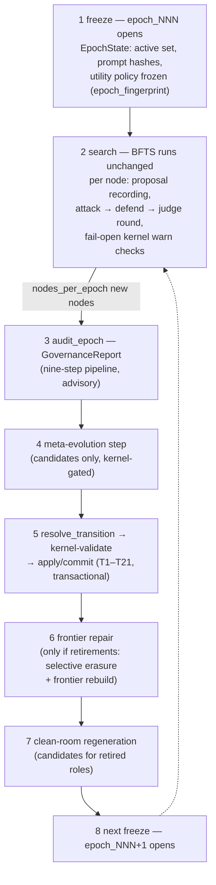

---
sources:
  - path: ari-core/ari/rqgm
    role: implementation
  - path: ari-core/ari/core.py
    role: implementation
  - path: ari-core/ari/cli/bfts_loop.py
    role: implementation
  - path: ari-core/ari/config/__init__.py
    role: implementation
  - path: ari-core/ari/configs/defaults.yaml
    role: config
  - path: ari-core/ari/paths.py
    role: implementation
  - path: ari-core/ari/rqgm/events.py
    role: implementation
  - path: ari-core/ari/rqgm/transition_rules.py
    role: implementation
  - path: ari-core/ari/rqgm/utility_evolution.py
    role: implementation
  - path: ari-core/ari/rqgm/paper_mode.py
    role: implementation
  - path: ari-core/ari/rqgm/paper_runtime.py
    role: implementation
  - path: ari-core/ari/rqgm/paper_archive.py
    role: implementation
  - path: ari-core/ari/rqgm/paper_anchor.py
    role: implementation
  - path: ari-core/ari/rqgm/paper_self_preference.py
    role: implementation
  - path: ari-core/ari/schemas
    role: schema
  - path: ari-core/ari/prompts/rqgm
    role: prompt
  - path: ari-core/ari/prompts/governance
    role: prompt
last_verified: 2026-07-16
---

# Constitutional ARI-RQGM 架构

Constitutional ARI-RQGM 是 ARI 可选启用的 `ari_rqgm` 执行模式：包裹在
不变的 BFTS 循环之外的、基于纪元的治理与协同进化层。`simple_bfts`
仍是默认模式；在没有 `ari:`/`rqgm:` 配置块时，甚至不会导入任何
`ari.rqgm` 模块，检查点与 RQGM 之前的 ARI 保持逐字节一致。激活方式、
模式联锁与模式切换策略见[执行模式](../guides/execution_modes.md)；
本页讲的是架构：这个模式为何存在、它的分层是什么、一个纪元如何运转、
哪些不变量成立。

> **运行时演练见
> [RQGM 运行时演练](rqgm_runtime_walkthrough.md)** —— 逐步追踪一次
> 真实的 `ari_rqgm` 运行（启动 → 创始注册 → 逐节点钩子 → 边界 →
> 什么落在磁盘上），附事件日志摘录和一份可观测性速查表。

---

## 动机

ARI 的制度性组件 —— 提出研究方向、评审节点、评判质量的那些 LLM
角色 —— 本身就是提示词定义的工件。让它们进化能解锁改进，但不受约束
的自我修改正是哥德尔机文献所警告的：一个能改写自身评估器的组件终将
给自己发奖励。Red Queen Gödel Machine 这一工作路线
（[arXiv:2606.26294](https://arxiv.org/abs/2606.26294)）加入了红皇后
动力学 —— 组件之所以改进，*正因为*对抗者与之协同进化 —— 但仅有协同
进化并不能约束失败模式（分数膨胀、指标操纵、证据造假、角色间
合谋）。

Constitutional ARI-RQGM 采纳协同进化循环，并把它置于一个**永不进化
的固定宪法层**之下。提示词和组件相互竞争、攻击、辩护，被采纳或
退役 —— 但每一次状态变更都由一个确定性的、非 LLM 的内核依据冻结在
代码中的规则表进行校验。执法立场是"阻断制度，而非研究"：治理可以
否决它*自身的*状态变更（采纳、退役、注册表写入），但绝不否决节点的
执行。

---

## 四大支柱

Constitutional ARI-RQGM 建立在四项定义性承诺之上。本页的每个机制都服务于
其中之一，并且各自都诚实地说明当前实现走到了哪一步：

1. **一棵分数本身在每个边界都被改写的树搜索。**BFTS 是一棵 best-first
   *树*，而对其前沿排名的效用策略并非运行常量 —— 它是一个被治理的对象，
   逐纪元冻结、在边界通过与进化提示词相同的生命周期被改写
   （见[被治理的效用进化](#被治理的效用进化)）。*后果*那一半一直是活的：
   一次改写会退役旧策略，`frontier_repair` 会使在该策略下评分的每个节点
   失效。*原因*那一半 —— 一个提议后继的 `policy_mutator` —— 是 Task 14。
2. **对抗者攻击工件*和*评估；禁止合谋。**七种探索对抗者攻击节点的
   *工件*；第八种 `paper_self_preference` 攻击*评审者的判定*（评审者过度
   接受的一份 AI 草稿）。分数策略绝不从前沿自身的分数中提出 —— 一个被
   调校成讨好它已经生成的节点的策略，正是确定性 / 无合谋原则所禁止的
   自我指涉循环（`PolicyMutator` 只看得到边界已抽象化的证据，
   `utility_evolution.py`）。
3. **对抗者自身就在审计网络之中 —— 没有绝对统治者。**攻击的组件、提议
   分数的组件、审计的组件，本身都是被注册的、可制裁的、可进化的行：
   `policy_mutator_v1` 是一个创始元组件，其自身模板像其他任何组件一样
   进化，针对它的治理建议会解析为一次普通制裁。没有任何东西置身于转换表
   之外。
4. **一切受宪法约束；弹劾遵循宪法。**每一次状态变更都由永不进化的内核
   依据由 `constitution_hash` 钉住的冻结规则表校验；一个健康的 behavioral
   组件失去其席位的唯一途径，是 Auditor 提交、在边界裁决的
   `ImpeachmentMotion`。两条 supersession 边（T20/T21）是制裁唯一置换模型
   的*唯一*例外，且各自被内核守卫到一个角色族。

---

## 三个层

角色与层级词汇表是 `ari/rqgm/events.py` 中的封闭集合
（`EVOLVABLE_ROLES`、`FIXED_ROLES`、`TIERS`）；组件 id 形如
`{role}_v{N}`，提示词 id 形如 `{role}_prompt_v{N}`。

| 层 | 层级 | 角色 | 是否进化？ |
|---|---|---|---|
| **0 —— 宪法层（固定）** | `fixed` | `constitutional_kernel`、`fixed_verifier`（确定性的 `results.json` 合并 / 指标重算路径）、`audit_log` | **永不。**仅为溯源而注册；规则表存在于代码中（`kernel_rules.py`、`transition_rules.py`、`clean_room_rules.py`、`meta_rules.py`），由 `constitution_hash` 钉住 —— 任何规则修改都必须在 `tests/test_rqgm_kernel.py` 中显式重钉。 |
| **1 —— 制度层** | `institutional` | `generator`、`reviewer`、`adversary`、`defender`、`judge`、`router`；被治理的评估基准 `utility_policy`；以及（仅 paper 模式）`paper_writer`、`paper_reviewer` | 是 —— 通过提示词进化生命周期，且仅在纪元边界。`utility_policy` 不是提示词定义的（其在任者是一份策略*文档*），但在完全相同的意义上可进化：一个在任者，仅通过边界处的转换引擎被置换。 |
| **2 —— 元层** | `meta` | `prompt_mutator`、`clean_room_generator`、`replay_selector`、`failure_summary_compressor`、`policy_mutator` | 是 —— 进化第 1 层的 agent 本身也被治理，且权限严格更窄（见不变量）。`policy_mutator` 提议后继效用策略。 |

角色与层级词汇表从第一天起就是封闭集合；Task 14 与 paper 阶段解冻了
`policy_mutator` 与 `utility_policy`（两者都被活代码点名，却无法由 `ROLES`
的任一半注册），并新增 `paper_writer` / `paper_reviewer` 作为 paper 模式
门控的创始行，因此一次探索 `ari_rqgm` 启动与之前逐字节一致地注册
（`EVOLVABLE_ROLES`、`ari/rqgm/events.py`）。

复制到每个 `ari_rqgm` 检查点中的打包 `constitution.yaml` 只是人类
可读的声明 —— 编辑它不会改变任何东西；代码中的表才是权威。

---

## 四个门面

`ari.core.build_runtime` 仅在 `ari.mode: ari_rqgm` 与
`rqgm.enabled: true` 一致时构造单个 `RQGMRuntime`
（`ari/rqgm/runtime.py`），然后把 BFTS 策略包裹在纯委托的
`GovernedSearchStrategy` 中。运行循环通过一次鸭子类型读取 ——
`getattr(bfts, "rqgm", None)` —— 发现 RQGM，因此 `simple_bfts` 只
付出一次失败的属性查找。在运行时内部，四个门面拥有治理机器（全部
惰性构造、全部 fail-open）：

| 门面 | 模块 | 职责 |
|---|---|---|
| `ConstitutionalKernel` | `ari/rqgm/kernel.py` | 第 0 层。十二个封闭的 `validate_*` 入口（记录 schema、哈希、能力、纪元不变性、转换、角色分离、选择性擦除、审计日志完整性、洁净室 bundle、污染、权限不扩张、上下文范围），加上执法适配器（`should_block`、fail-open 的 `per_node_warn_check`、预检的 `CapabilityGatedMCPClient`）。确定性且不可进化：零 LLM 调用、零网络、零挂钟决策。`rqgm.kernel.enforcement: audit_only` 将所有上下文降级为仅警告并记录。 |
| `GovernanceOrchestrator` | `ari/rqgm/governance/` | 纪元边界审计：`audit_epoch(...) -> GovernanceReport`，一条九步流水线（观察 → 评估可靠性 → 汇集证据 → 检控 → 辩护 → 裁决 → 重放池更新 → 自我审计 → 报告）。每个 LLM 决策（Auditor / Defender / GovernanceJudge，提示词位于 `ari/prompts/governance/`）都有完整的确定性回退，因此 `llm=None` 仍能产出完整的审计。报告只是转换引擎的*咨询性输入* —— 编排器从不改动注册表。 |
| `RegistryTransitionEngine` | `ari/rqgm/transition_engine.py` | **唯一**的注册表状态写入方。先对固定 T1–T21 表做纯 `resolve_transition(...)`，再执行五步边界协议：冻结 → 解析 → 内核校验 → prepare → 在纪元事务上 apply/commit。`emergency_quarantine` 是唯一的纪元中途路径。 |
| `FrontierRepairEngine` | `ari/rqgm/frontier_repair.py` | 在一次带退役的已提交转换之后：纯函数 `trace_dependents` 的过期闭包与 `rebuild_frontier`，发出 `SelectiveErasureEvent` / `FrontierRebuildEvent` 记录。失败阶梯：内核校验失败 → 保守式再修复（被标记的节点被丢弃）→ 仅排空式降级（`expansion_halted`：运行完成挂起的工作但不再扩展）。绝不崩溃。 |

支撑组件挂在同一运行时上：`ProposalRouter` + 各生成器
（`ari/rqgm/proposals/`，含可选的纯 MCP `VirSciAdapter`）、逐节点的
`AdversarialRound` 与 `AdversarialReplayPool`
（`ari/rqgm/adversarial/`）、提示词进化流水线与
`GovernedPromptLoader`（`ari/rqgm/prompt_evolution.py`、
`prompt_loader.py`）、`CleanRoomCoordinator`（`clean_room.py`）、
`MetaEvolutionCoordinator`（`meta_evolution.py`），以及
`GovernanceBudgetManager`（`budget.py`）。

---

## 纪元周期

治理是基于纪元的。一个纪元冻结制度；边界是制度唯一可以变更的窗口。
v1 的边界触发器是节点计数（`rqgm.epoch.boundary: node_count`、
`rqgm.epoch.nodes_per_epoch: 10`），由运行循环的 `ensure_epoch`
心跳在循环开始处和每次外层循环头部检查 —— 主线程，无节点在途。
运行结束时还会再执行一次同样的心跳，因此即使第 N 个节点是在最后一次
循环迭代中创建的，边界也会照常触发（未达到触发条件的尾部纪元保持
open）。

1. **冻结。**`freeze_epoch`（`ari/rqgm/state.py`）把活跃组件集合、
   提示词哈希和效用策略钉入一个不可变的 `EpochState`，带确定性的
   `epoch_fingerprint`。被冻结的策略是**已采纳**的那一份 ——
   `capture_utility_policy(cfg, registries=)` 读取活跃的 `utility_policy`
   条目，仅在纪元 0 或尚未采纳任何策略时回退到解析后的 `cfg`（与
   Task 14 之前的函数逐字节一致）。纪元 id 为 `epoch_000`、`epoch_001`、…
   在全新的检查点上，**创始注册**会在启动时、`epoch_000` 开启之前
   运行：一笔事务把冻结的创始表（`ari/rqgm/prompt_spec.py` ——
   29 个提示词、16 个组件；其中 `utility_policy_prompt_v1` 源自解析后的配置，
   其余 28 个提示词行与全部 16 个组件行是冻结的代码常量，plan 14 §5.3）注册到 `rqgm_transitions.jsonl` 上，
   因此第一次冻结携带的是非空的活跃集合。只写一次：resume 只重放
   它，绝不重新注册。
2. **搜索。**BFTS 与 `simple_bfts` 中完全一致地探索。每个节点上有
   三个尽力而为的钩子：扩展方向被捕获为 `ProposalRecord`，被评估的
   节点获得一轮对抗回合（七种对抗者类型之一攻击该节点的*工件*；
   辩护者回应；`ArtifactJudge` 裁决；只有经裁判验证的攻击才施加
   有界的分数惩罚），以及逐节点的内核警告检查。
3. **审计。**在边界处*先*审计将要关闭的纪元，因此
   `GovernanceReport` 对转换引擎可用。
4. **元步骤。**元层（提示词变异器、洁净室生成器、…）在沙箱中运行，
   可以产出输出 —— 每一个都以 `status: candidate` 进入生命周期，
   绝不直接激活。
5. **转换。**`resolve_transition` 是（纪元状态、治理报告、候选
   评估、注册表、状态历史、配置）的纯函数 —— 重跑时逐字节一致。
   内核校验解析出的转换；被阻断的转换以 fail-closed 方式中止，
   在任的活跃集合继续服务（治理挂起式延续 —— 运行绝不中止）。
   提交是事务性的：同一 `transition_id` 的重复提交是受保护的
   no-op，被中断的事务在 resume 时被丢弃并确定性地重跑。
6. **前沿修复。**如果已提交的转换退役了组件或提示词，所有实质依赖
   已退役 `prompt_hash` 的记录都被从前沿评分中逻辑擦除，前沿被重建
   （见不变量 7）。
7. **洁净室。**待处理的洁净室请求在边界窗口内执行；可采纳的输出以
   候选身份进入*下一*周期的生命周期。与此同时，已退役角色的槽位由
   基线回退提供服务，因此没有任何被治理的角色会空缺。
8. **下一次冻结。**新纪元以（可能已变化的）活跃集合再次冻结开启。

组件沿 `ari/rqgm/transition_rules.py` 中固定的 T1–T21 表在十种状态
（`candidate`、`validated`、`shadow`、`probationary_active`、
`active`、`warning`、`probation`、`quarantine`、`retired`、
`banned`）之间移动。只有 `rqgm.transition.*` 的数值阈值可配置；表的
拓扑是宪法修订面（代码 + 测试变更），绝不是配置。最后两行是
**supersession 边**，各自被内核守卫到一个角色族，且都仅在同角色 T6
采纳的*内部*触发（绝不会在没有被采纳的后继来为置换正名的情况下发生
置换）：

* **T20**（`active → retired`、`superseded_by_adopted_successor`）是
  `utility_policy` 边（Task 14）：一个已校验、影子通过的后继策略若评分
  至少同等好，就置换*健康的*在任者，并以**旧** `utility_policy_hash`
  将其退役。这是唯一的 `active → retired` 边；对每个 behavioral 角色，
  内核都会拒绝它（退役仍必须经由 quarantine 分阶段进行）。
* **T21**（`active → shadow`、`reinstatable_standby`）是 paper 角色边
  （`paper_writer` / `paper_reviewer`）：当一个影子通过的后继提示词被
  采纳时，被降级的在任者移入一个可复位的 `shadow` 待命位，使每个 paper
  角色恰好有一个活跃条目存活。与 T20 不同，它不是退役 —— 之后的边界可以
  重新爬升该待命位。

---

## 被治理的效用进化

定义性的主张是：搜索是树结构的，**并且在每个纪元边界，整个分数 ——
效用函数本身 —— 都被改写**。*后果*那一半一直是活的：`frontier_repair`
能摧毁一个已退役效用策略产生的每一个分数。Task 14 提供了*原因*那一半 ——
某个提议后继策略的东西 —— 并废除了那条曾禁止分数变化的不变量（I-11）。

**效用策略是一个被治理的对象。**策略本体（`composite`、`axis_weights`、
`frontier_score`、`depth_penalty_lambda`、`ucb_c`）逐纪元冻结、在边界
被改写。`capture_utility_policy(cfg, registries=)`（`ari/rqgm/state.py`）
从注册表读取**已采纳**的策略，在纪元 0、`simple_bfts` 下，或任何
读取 / 校验失败时降级为解析后的 `cfg`（始终是在任的策略，绝不 raise）。
Task 14 之前该函数只读静态 cfg，因此 `utility_policy_hash` 是运行常量，
`frontier_repair` 等待的退役永远无法触发。

**提议者。**`PolicyMutator`（`ari/rqgm/utility_evolution.py`）是
`PromptMutator` 的类比：它**只**产出 `UtilityPolicyCandidate` 记录，
不暴露任何注册表 / 存储写入面。四种默认变异种类（`axis_reweighting`、
`composite_swap`、`frontier_score_swap`、`exploration_tuning`）是对边界
已抽象化证据的纯算术 —— 无 LLM、无时钟、无随机 —— 因此默认改写完全
可复现；只有可选的 `freeform_policy_proposal` 会咨询 LLM（未配置时返回
`None`）。候选由 `CK-UTL-001…008` 合法性规则（允许的 `composite` /
`frontier_score` 集合、按轴权重界限、权重和约束、范围检查，以及一次
「本体哈希与 id 相符」检查）做内核校验。它是一个创始**元**组件
（`policy_mutator_v1`），其自身模板像其他任何组件一样进化，一次治理
建议即可制裁它 —— 没有绝对统治者。

**改写使过去失效。**一个 `_utility_policy_hash` 哨兵键
（`UtilityPolicyStamp`）被盖到每个节点的 `metrics` 上，因此一次改写能
使**每一个**在旧策略下评分的节点失效 —— 而不仅是携带 `UtilityRecord`
的「被攻击且被惩罚」的子集。当 T20 以旧哈希退役在任者时，
`frontier_repair` 会把那些节点标记为 `utility_invalidated`，并在新策略
的冻结权重下重建前沿（或作为前沿无效丢弃它们 —— 擦除，不重新缩放）。

**I-11 被废除。**效用策略如今逐*纪元*冻结、在边界被改写，而不是在整个
运行中保持恒定。在纪元内它仍不可变（不变量 1 完好）；废除只关乎跨纪元
这条轴。

**诚实的限制 —— 「至少同等好」门可能是空洞的。**在默认配置
（`axis_mode: dynamic`、空的静态 `axis_weights`）下，不存在用于比较两个
策略的固定按轴基底，因此 T3 的「至少评分同等好」质量门没有可评估的
顺序：supersession 退化为合法性加非退化性，基准是在合法单纯形*内*滚动，
而非可证明地改进。这是诚实的红皇后姿态（没有基准真值就没有可以严格更好
的对象），并非缺陷。一个真正严格更好的门需要一个锚定的按轴基底，而这
正是 paper 阶段的 accept/reject 锚（Task 04，见下）为 `paper_reviewer`
基准所提供的。

---

## paper-archive 层

paper 阶段是把四大支柱的方法应用于*论文写作*。它由**自己的**执行轴
`paper.mode: linear | rqgm_archive` 门控，并带一个冗余的
`rqgm.paper.enabled` 联锁（`ari/rqgm/paper_mode.py`、`PaperMode`、
`resolve_paper_mode`）。该轴与 `ari.mode` **正交** —— 四种组合全部
有效 —— 且 `linear`（默认）与今天的论文流水线逐字节一致：除非
`rqgm_archive` 生效，否则论文路径不导入任何 `ari.rqgm` 模块。

**一棵草稿空间上的真实树。**`PaperArchiveRuntime.run_archive`
（`ari/rqgm/paper_runtime.py`）经由 `PaperArchiveStrategy`
（`ari/rqgm/paper_archive.py`）在*草稿*空间上运行一棵真实的浅层
best-first 树：一个 `paper_root`，深度 1 处最多 `archive.width`（K，
默认 4）份种子草稿，每份草稿可展开为最多 `archive.refine_rounds` 个
refine 子节点、直到 `archive.depth`（默认 3）。它复用 BFTS 的
prune/count 逻辑，以及真实的 `select_best_to_expand` 前沿选择与真实的
`diversity_bonus`；`paper_refine` 各遍是**子节点**（树深度），而非
原地编辑。`PaperDraftExecutor` 把 `ari-skill-paper` 当作无思考的「手」
包装 —— 种子经 `write_paper_iterative`、refine 子经 `paper_refine` ——
而该技能不导入任何 `ari.rqgm`，**从不跨进程被治理**。

**被治理的角色与第八个对抗者。**`paper_writer` 与 `paper_reviewer` 是
仅在生效 `rqgm_archive` 模式下才注册的可进化制度角色（探索启动保持
逐字节一致）；被治理的 ari-core 提示词*驱动*该技能。一个新的第八种
对抗者类型 `paper_self_preference` 攻击评审者的**过度接受** —— 一份
在任评审者打了高分、而锚会拒绝的 AI 草稿（支柱 2：它攻击的是*评估*，
而非工件）—— 并且当 claim gate 判定同一份草稿不忠实时，也攻击产出它的
**writer**。在一次 paper 角色采纳时，T21 把被降级的在任者移入影子待命。

**两个锚。***评审者*锚定于一个 APReS 等价的 accept/reject 语料
（`ari/rqgm/paper_anchor.py`、`paper_anchor_corpus.jsonl`）：评审者通过
与一个留出的、人工标注的基准真值*一致*来赢得信任。
每个案例都声明一个 `label_source`，且 `max_bootstrap_label_fraction`
上限在语料与留出子集上被机器强制 —— 一次违反会**拒绝该语料**（降级为
`None`，绝不 raise）。锚默认 `enabled: false` —— 是降级的入门坡道；
完整的协同进化需要 `anchor.enabled: true` **且**一份精选语料。

*写作器*同样被锚定 —— 锚定于 RQGM 论文的写作器从未拥有过的基准真值。
ARI 书写的是**真正运行过**的实验，因此第 0 层的 claim-evidence 硬门
**确定性地**为一份草稿的忠实度打分：`writer_faithfulness_score` 把门的
`execution_grounded_claim_rate`、`numeric_claim_reproducible_rate` 与
`numeric_coverage_rate` 折叠为一个 [0,1] 的分数（无 LLM、无墙钟），而
`WRITER_ANCHOR_DESCRIPTOR` —— 度量 id `claim_evidence_faithfulness_v1`、
其第 0 层来源、三个构成分量、阈值 —— 被冻结进 `paper_utility_policy`，
因此 paper 纪元指纹记录了写作器被锚定于*什么*。这使 ARI 的论文写作器
成为 RQGM 论文**编码**域的形态（一个确定性验证器*加上*一个协同进化的
评审者），而非论文中那个无锚的 paper-writing 域。门本身保持第 0 层：
RQGM 只**读取**其发现（`run_hard_gate(write=False)`，不持久化、不包裹、
不进化）。

**弹劾链（Task 15）。**对抗者的预信号（该攻击哪些过度接受的草稿）驱动
一次*真实的* adversary → Defender → ArtifactJudge 回合。所得的
`ValidatedAttackRecord` 如今携带一个可选的 `target_component_id`，在
构造时从被牵连的角色解析到纪元冻结的 `paper_reviewer_v1` /
`paper_writer_v1`（`ari/rqgm/adversarial/round.py`）。这闭合了对所有对抗者
而言在上游一直死掉的 `validated_attack → validated_attack_involvement →
classify_target →` 弹劾链。*诚实的限制：*它在生产中只对
`paper_self_preference` 触发，其目标是已注册的创始组件。七种探索
对抗者攻击由 `generator` 角色所著的工件，而 `generator` **没有已注册的
组件**，因此它们的链**按设计**保持惰性（注册一个 generator 组件是另一
项决定）。

**两个有责组件，一个回合。**一份被过度接受、且 claim gate *同时*判定为
不忠实的草稿有**两个**有责组件：接受它的评审者，与产出它的写作器。因此
`_AFFECTED_ROLES_BY_TYPE["paper_self_preference"]` 同时点名两个角色，回合
按**每个可解析角色发出一条已验证攻击**（`round.py:_resolve_bindings`），
每条记录只点名它所针对的那一个角色。写作器的绑定按节点以该草稿的第 0 层
忠实度为门：一份被过度接受但**忠实**的草稿只绑定评审者。`paper_writer`
在 paper 阶段之外解析为 `""`，因此探索记录保持逐字节一致。

**最佳草稿流向未触动的门。**存档的最佳草稿由纯粹、免 LLM 的
`materialize_winner` **一次性**复制到 `{ckpt}/full_paper.tex`，而**既有**
的编译 + claim-evidence 硬门（第 0 层，未触动，从不被内核包裹）在与
linear 运行相同的契约下对它运行 —— `write_paper` 的 `skip_if_exists`
会拾取它。成本有界：`node_budget = min(width·(1+refine_rounds),
max_expansions)` 在**任意**深度都成为 BFTS 的 `max_total_nodes`（更深的
树只是重新分配同样的 M 个节点，绝不将其倍增），整个阶段逐字继承 Task 12
的治理预算。

**诚实的限制（paper 阶段）。**

* **两个提示词都协同进化 —— 但写作器只在退化时。**`paper_writer` *提示词*
  经由普通的治理路径协同进化（制裁 → 角色开启 → 既有的 T6；**无需**新的
  转换边），且一次执行证明观测到活跃写作器的 `prompt_hash` 跨越采纳发生了
  变化。它**不**会仅仅因为挑战者看起来更好就采纳：一个写作器后继会爬升到
  `shadow` 并**在那里等待**，直到在任者因在 claim-gate 忠实度上*退化*而被
  制裁。这就是保守的行为角色模型，而且它是因果性的、并非偶然 —— 在草稿忠实
  时，同一个驱动器产生零次写作器攻击、零次写作器动议、写作器哈希恒定，而评审
  者依然被攻击并被弹劾。另外，写作器的*草稿*赢家仍然是**逐纪元的**（由纪元内
  冻结的评审者排序，因此由不同评审者版本打分的草稿从不相互比较）。
* **对写作器的制裁搭乘评审者的回合。**针对写作器的攻击由
  `paper_self_preference` 回合发出，而该回合仅在存在**过度接受**的锚案例时
  触发。因此，若评审者没有过度接受任何东西、而只有写作器的草稿不忠实，今天的
  写作器不会被制裁；一个专用的写作器对抗者类型是另一项决定。
* **默认轮数不能完成一次采纳。**在默认的 `rqgm.paper.epoch.rounds: 2`
  下，边界与弹劾动议会*触发*，但 `validated → shadow →
  probationary_active` 的爬升（约 5 个边界）不会完成一次采纳；
  一次完整采纳需要更多轮次（执行证明跑了 8 轮）。
* **锚关闭 ⇒ *两个角色*都是 best-of-N。**当锚处于其默认的 `false` 时，
  `rqgm_archive` 模式在用户提供语料之前是经评审的 best-of-N 草稿、无协同
  进化；`rqgm.paper.prompt_evolution.enabled: false` 是大致以今日成本的相同
  姿态。这同样约束**写作器**：写作器的忠实度案例落在锚池上，因此没有池就没有
  写作器的董事会分数、也没有对写作器的制裁 —— 尽管写作器自身的锚（claim
  gate）并不需要任何自己的精选数据。
* **in-phase 惩罚是合成的。**self-preference 回合目前降级的是一个*合成*
  的问责节点，而非一份真实的过度接受存档草稿（那个 in-phase 降级被
  推迟）。真正触发的通道是评审者的问责 / 协同进化通道，经由真实的
  已验证攻击记录。

---

## 关键不变量

1. **纪元冻结的活跃集合。**活跃组件（`active`、
   `probationary_active`）、提示词哈希和效用策略在纪元中途不可
   变更。`validate_epoch_invariance` 从事件日志重新推导这一点。
   （效用策略可以在*边界*变更 —— 即对旧 I-11「恒定分数」不变量的废除，
   [见上](#被治理的效用进化) —— 但在纪元内绝不变更。）
2. **仅边界转换，一个例外。**每次状态变更都在纪元边界事务内提交。
   唯一的纪元中途边是 `emergency_quarantine`（规则 T16：
   `probationary_active` / `active` / `warning` / `probation` →
   `quarantine`），仅限内核级关键触发码，同样被记录并经内核校验。
3. **单一注册表写入方。**只有 `RegistryTransitionEngine` 写组件/
   提示词状态（全局不变量 10）—— 在存储层结构性强制
   （`ari/rqgm/store.py`，仅事件重放式注册表变更）并由内核校验。
   不存在 `candidate → active` 边（没有即时激活），不存在从
   `retired` 的复活，且 `banned` 是吸收态。
4. **原始攻击从不触碰分数。**对抗者的 `RawAttackRecord` 没有任何
   评分效果；只有经裁判验证的攻击才进入有界的效用惩罚（纪元冻结
   策略：`rqgm.adversarial.penalty.cap`、按严重度加权），且惩罚前
   分数保存在增量指标键中。裁判失败回退为 `invalid` —— 无惩罚。
   对抗者攻击的是*工件*，从不攻击组件：攻击 schema 没有组件字段。
5. **禁止同角色指控。**同角色的输出只能作为观察。在治理记录构建器
   中构造性强制，并由内核的 `validate_role_separation` 权威校验；
   不可采纳的证据在证据汇集阶段被排除。
6. **选择性擦除是仅逻辑的。**什么都不物理删除。过期状态存在于审计
   日志事件、派生的 `rqgm_erasure_state.json` 汇总，以及通过
   `tree.json` 持久化的增量 `Node.metrics` 哨兵键（`_stale`、
   `_valid_for_frontier`、`_stale_reason`、`_erasure_event_id`）
   中。擦除是槽位范围的（退役一个 reviewer 只使该 reviewer 的记录
   及其下游效用后果过期，绝不波及无关工作），效用在*原始*纪元的
   冻结权重下由幸存输入重算 —— 无法重算时，节点转为前沿无效
   （擦除，不重新缩放）。
7. **洁净室污染规则。**为已退役角色生成替代提示词时，只能使用由
   固定层组装的、封闭且经内核筛查的输入 bundle（已提交的目录 +
   抽象故障摘要）—— 绝不使用注册表中的提示词文本。已退役提示词
   文本在任何地方都不可读：注册表视图将其打桩，
   `RetiredPromptAccessGuard` 在能力门处拒绝访问。内核的词组
   shingle 污染筛查（`rqgm.clean_room.contamination_screen`）在
   采纳时阻断被污染的候选；生成是一次性的（没有可能读到已退役
   文本的带工具循环）。
8. **元层权限限制。**元 agent 在只读沙箱中运行
   （`MetaSandboxMCPProxy` 白名单 + 一个合成的提交工具），其能力
   标志默认拒绝、硬性拒绝的标志为 const-false
   （`ari/rqgm/meta_rules.py`），内核以子集运算检查权限不扩张
   （不变量 18），且每个元输出都以 `status: candidate` 进入生命
   周期 —— 元层可以提议，绝不能任命。
9. **固定层永不进化。**内核、固定校验器、审计日志、转换/严重度/
   能力表、选择性擦除规则和 claim-evidence 硬门都不是进化目标；
   `constitution_hash` 钉住这些表。
10. **阻断制度，绝不阻断研究。**硬阻断集合只否决 RQGM 状态变更
    （转换提交、注册表写入、前沿重建提交、候选晋升）；节点执行
    永不被否决。所有运行循环钩子都是尽力而为/fail-open 的 ——
    治理失败降级的是治理，不是实验。
11. **确定性（P2）。**内核裁定、转换解析、前沿修复、预算级别、
    影子采样（基于哈希）和评估指标都是纯函数 —— 无随机性、无挂钟
    决策、重放时逐字节一致。

---

## 检查点上的记录

所有 RQGM 状态都是检查点范围且增量式的：**没有 `rqgm_state.json`
即意味着一次纯 `simple_bfts` 运行。**存储模式是「追加式 JSONL 为
真相，加派生 JSON 快照供快速读取」；resume 重放事件日志（并重新
校验审计日志完整性 —— 失败降级为治理挂起式延续，绝不拒绝
resume）。所有这些文件都在 `PathManager.META_FILES`
（`ari/paths.py`）中，因此绝不会被复制进节点工作目录。

| 文件 | 写入方 | 内容 |
|---|---|---|
| `rqgm_state.json`、`constitution.yaml` | 运行开始（`ari/rqgm/state.py`） | 模式溯源（`mode_source` ∈ `config\|env\|resume`、切换日志）；仅复制一次的人类可读宪法。 |
| `rqgm_transitions.jsonl` → `epoch_state.json`、`rqgm_registry.json` | `RqgmStateStore` / 转换引擎 | 纪元 + 注册表的事件日志真相；冻结纪元与注册表快照。 |
| `rqgm_audit.jsonl` | `ImmutableAuditLog`（所有门面） | 哈希链式、追加式的审计日志：内核报告、治理记录、预算/级别行、擦除 + 重建事件。 |
| `proposals/`（`proposal_records.jsonl`、`proposal_index.json`）+ `idea.json` 投影 | `ProposalStore` / `ProposalRouter` | 完整提案记录（"存储全部"）；BFTS 只会看到封顶的 `ProposalSummaryView`。 |
| `rqgm_adversarial_cases.jsonl` → `rqgm/adversarial_replay_pool.json` | 对抗循环 | 原始/辩护/裁决/已验证攻击/效用记录；重放池快照（仅在边界更新）。 |
| `prompt_evolution.jsonl` → `prompt_specs.json`；正文位于 `rqgm_prompts/` | 提示词进化流水线 / `GovernedPromptLoader` | 候选/校验/影子记录；PromptSpec 汇总；一次写入的进化提示词正文（哈希校验，无原地修改）。 |
| `rqgm_cleanroom.jsonl` | `CleanRoomCoordinator` | 请求/筛查/回退事件日志。 |
| `rqgm_erasure_state.json` | `FrontierRepairEngine` | 派生的过期/无效汇总（对审计日志擦除/重建事件的纯折叠；缺失 == 无过期）。 |
| `rqgm_meta_outputs.jsonl` | `MetaEvolutionCoordinator` | 元 agent 输出（内容派生 id；读取时去重重试）。 |
| `rqgm_governance_cache.jsonl` | `GovernanceCache` | 以工件/提示词/角色/纪元/上下文哈希为键的确定性重放/结果缓存。 |
| `rqgm_eval_metrics.json`、`rqgm_injection_provenance.json` | 仅评估工具链 | 每运行指标报告；被注入（合成）运行的持久标记。 |
| `paper_archive_state.json`、`paper_draft_archive.jsonl` | `PaperArchiveRuntime` / paper 存档（仅 paper 模式） | paper 阶段模式溯源（只写一次）；评分后的草稿群（每份草稿一条记录，`is_best_belief` / `compiled` 标志）。 |
| `paper_anchor_corpus.jsonl`、`rqgm/paper_self_preference_stat.json` | 锚加载器 / 自偏好统计（仅 paper 模式） | accept/reject 基准真值语料（每案例的 `label_source`）；对抗者预信号所引用的确定性 AI-对-human 自偏好边际。 |

这四个 `paper_*` 文件仅在生效的 `rqgm_archive` paper 模式下存在 ——
它们的缺失，如同 `rqgm_state.json` 的缺失一样，标示一次 linear 论文运行。

精确的磁盘格式：[文件格式参考](../reference/file_formats.md)；
JSON Schema（位于 `ari-core/ari/schemas/`，例如 `epoch_state`、
`rqgm_registry`、`rqgm_transition_event`、`governance_report`、
`proposal_record`、`selective_erasure_event`、
`frontier_rebuild_event`、`erasure_state`）：
[RQGM Schema 参考](../reference/rqgm_schemas.md)。

---

## 配置面

`ari.mode` + `rqgm.enabled` 联锁激活该模式（两者必须一致 —— 见
[执行模式](../guides/execution_modes.md)）。可调面被刻意限制为
开关、预算和数值阈值：`rqgm.epoch`、`rqgm.kernel`、
`rqgm.governance`、`rqgm.replay`、`rqgm.transition`、
`rqgm.adversarial`、`rqgm.shadow`、`rqgm.prompt_evolution`、
`rqgm.clean_room`、`rqgm.frontier_repair`、`rqgm.meta_evolution`、
`rqgm.budgets`、`rqgm.eval`，加上 `proposal_router.*` 块（默认值在
`ari-core/ari/configs/defaults.yaml`，类型化模型在
`ari-core/ari/config/__init__.py`）。规则表绝不是配置。VirSci 可选
且正交：`proposal_router.generators.virsci.enabled` 在两种模式下都
默认 `false` —— 见 [VirSci 集成](../guides/virsci_integration.md)。

paper 阶段是**第二条、正交的**轴：`paper.mode`
（`linear | rqgm_archive`）+ `rqgm.paper.enabled` 联锁，带自己的
`rqgm.paper.*` 块（`archive` —— `width` / `depth` / `refine_rounds` /
`max_expansions`；`epoch.rounds`；`anchor`；`self_preference`；
`prompt_evolution`；`reviewer.agent_as_judge` —— `enabled`（默认 `false`，
环境变量覆盖 `ARI_PAPER_AGENT_AS_JUDGE`）/ `max_tokens`，即可选启用的、由
`LLMClient` 支撑的草稿打分器，它能读取确定性读取器读不到的评分轴，任何
失败都回退到确定性的 venue 评分表）。`ari.mode` × `paper.mode` 的四种组合
全部有效；两者都默认取其 linear/`simple_bfts` 值，因此一次运行独立地选择
加入每条轴 —— 见 [paper-archive 层](#paper-archive-层)。

成本控制是内建的：`GovernanceBudgetManager` 依据每纪元每角色的调用
上限和 `rqgm.budgets` 花费上限，对每个治理决策点做门控
（`allow | degrade | skip`），并给每个节点分配治理级别（L0 固定 …
L3 裁决）。耗尽时降级的是治理，绝不是节点执行；第 0 层的固定检查
在构造上即豁免。

---

## 另请参阅

[RQGM 运行时演练](rqgm_runtime_walkthrough.md) ·
[执行模式](../guides/execution_modes.md) ·
[BFTS 算法 → RQGM 包裹](bfts.md#governed-bfts-under-ari_rqgm-opt-in) ·
[RQGM 评估与消融](../guides/rqgm_evaluation.md) ·
[RQGM Schema 参考](../reference/rqgm_schemas.md) ·
[VirSci 集成](../guides/virsci_integration.md) ·
[RQGM 迁移](../guides/rqgm_migration.md) ·
[文件格式参考](../reference/file_formats.md) ·
[ARI 架构](architecture.md)
