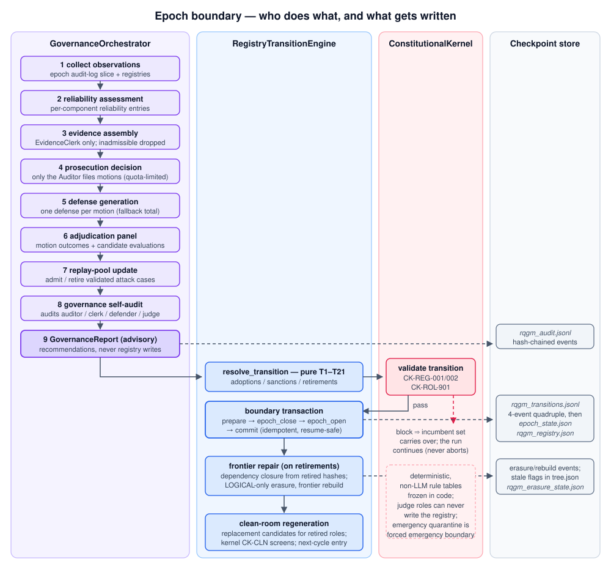
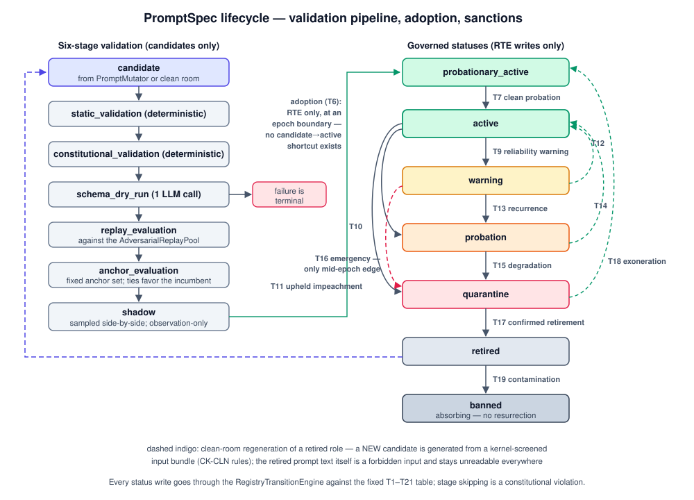

---
sources:
  - path: ari-core/ari/rqgm
    role: implementation
  - path: ari-core/ari/rqgm/runtime.py
    role: implementation
  - path: ari-core/ari/rqgm/prompt_spec.py
    role: implementation
  - path: ari-core/ari/rqgm/prompt_evolution.py
    role: implementation
  - path: ari-core/ari/rqgm/transition_rules.py
    role: implementation
  - path: ari-core/ari/rqgm/utility_evolution.py
    role: implementation
  - path: ari-core/ari/rqgm/paper_runtime.py
    role: implementation
  - path: ari-core/ari/rqgm/paper_anchor.py
    role: implementation
  - path: ari-core/ari/rqgm/paper_self_preference.py
    role: implementation
  - path: ari-core/ari/cli/bfts_loop.py
    role: implementation
  - path: ari-core/ari/configs/defaults.yaml
    role: config
  - path: ari-core/tests/test_rqgm_kernel.py
    role: test
last_verified: 2026-08-17
---

# RQGM 运行时演练

[RQGM 架构](rqgm_architecture.md)解释了 Constitutional ARI-RQGM
*为何*存在、它保持哪些不变量。本页展示这台机器**运转起来**的样子：
端到端追踪一次 `ari_rqgm` 运行 —— 启动时发生什么、每个节点上发生
什么、每个纪元边界发生什么，以及哪些字节落进哪个检查点文件。下面
每段事件日志摘录都取自真实运行（行有截断，运行特有的值以 `…`
略去）。


同一流程的压缩版：

```text
boot ──▶ mode resolution ──▶ RQGMRuntime ──▶ founding registration ──▶ epoch_000 open
                                              (1 txn: 32 prompts,        (active set
                                               20 components)             frozen)
                                                                             │
        ┌────────────────────────────────────────────────────────────────────┘
        ▼
  ┌─ per node ────────────────────────────────────────────────┐
  │ proposal → summary-only view → node executes →            │◀─┐
  │ governance level → (maybe) adversarial round              │──┘ next node
  └───────────────┬───────────────────────────────────────────┘
                  │ every nodes_per_epoch new nodes (loop-head tick + end-of-run flush)
                  ▼
  ┌─ epoch boundary ──────────────────────────────────────────┐
  │ audit_epoch → GovernanceReport → resolve (T1–T21) →       │
  │ kernel validate → prepare/close/open/commit →             │
  │ frontier repair → clean room                              │
  └───────────────┬───────────────────────────────────────────┘
                  ▼
            epoch_001 open (repeat)
```

---

## 逐步走查：一次运行

### 1. 启动 —— 模式解析

`ari run` 在一切之前只解析一次生效模式：`ari.mode: ari_rqgm` 与
`rqgm.enabled: true` 必须一致（`ari.rqgm.mode.resolve_effective_mode`），
`ARI_MODE` / `ARI_RQGM_ENABLED` 环境变量覆盖最后应用。任何不一致都会
降级为 `simple_bfts` 并给出警告。在默认的 `simple_bfts` 下，**完全
不会导入任何 `ari.rqgm` 模块** —— 下文的一切只发生在 `ari_rqgm`
中。细节与切换时机策略见[执行模式](../guides/execution_modes.md)。

随后 `build_runtime` 构造单个 `RQGMRuntime`
（`ari/rqgm/runtime.py`），把 BFTS 策略包裹进纯委托的
`GovernedSearchStrategy`，写入 `rqgm_state.json`（模式溯源：
`mode_source` ∈ `config|env|resume`），并把人类可读的
`constitution.yaml` 复制到检查点中。运行循环通过一次鸭子类型读取
发现 RQGM：`getattr(bfts, "rqgm", None)`。

### 2. 创始注册 —— 一笔事务，整个制度

在第一次 `ensure_epoch` 心跳（循环开始处，主线程）上，全新的 RQGM
检查点会执行**创始注册**（`RQGMRuntime._register_founding`）：
`ari/rqgm/prompt_spec.py` 中冻结创始表里的每个提示词和组件，都通过
`rqgm_transitions.jsonl` 上的单笔 prepare → … → commit 事务完成
注册 —— 在一个 `epoch_transaction_prepare` 与一个
`epoch_transaction_commit`（`transition_id: transition_founding`）
之间是 **32 条 `prompt_registered` + 20 条 `component_registered`
事件**：

```jsonc
{"event_id": "evt_000000", "event_type": "epoch_transaction_prepare",
 "payload": {"transition_id": "transition_founding"}, "prev_event_hash": ""}
{"event_id": "evt_000001", "event_type": "prompt_registered",
 "payload": {"prompt_id": "agent_system_prompt_v1", "role": "generator",
             "status": "active", "prompt_hash": "6eff1fb33e63",
             "source": {"kind": "committed_template", "key": "agent/system"}, …}}
// … 31 more prompt_registered, then 20 component_registered …
{"event_id": "evt_000053", "event_type": "epoch_transaction_commit",
 "payload": {"transition_id": "transition_founding"}}
```

20 个创始组件是 `generator_v1` 和七种探索对抗者类型（各为 `adversary_{type}_v1`，每种
攻击族一个：成本爆炸、证据缺口、指标操纵、过度声称、先前工作、
提示词注入、可复现性）、`defender_v1`、`artifact_judge_v1`、
`proposal_router_v1`、`prompt_mutator_v1`、`clean_room_generator_v1`、
`policy_mutator_v1`、`utility_policy_v1`，实时元参与者
`replay_selector_v1`、`failure_summary_compressor_v1`，以及可由注册表
寻址的司法组件 `auditor_v1`、`evidence_clerk_v1`、
`governance_judge_v1`。32 个提示词覆盖使用提示词的这些角色、提案生成器
和 BFTS 编排；确定性的 Evidence Clerk 不使用提示词。paper archive
再加入三组 gated 提示词／组件，总计 35／23 个。重放该日志可逐字节重建
`rqgm_registry.json`；注册是**只写
一次**的 —— 任何在日志中发现已有纪元或已提交注册的 resume 都不会
重新注册，而崩溃的创始事务（有 prepare 无 commit）对重放不可见，
可安全重跑。

### 3. `epoch_000` 开启 —— 制度被冻结

创始提交后，`epoch_000` 随即开启，创始活跃集合被冻结进
`epoch_state.json`：`active_components`（每个角色一个汇总胜者）与
`active_prompt_hashes`（每个角色一个 12 位十六进制哈希），外加效用
策略，全部钉在政策 `policy_fingerprint`、声明执行基底
`execution_fingerprint` 与二者合成的 `epoch_fingerprint` 之下，均不含
时间戳。缺少提供者或环境修订时记为 `unresolved`。在
下一个边界之前，这个集合中的任何东西都不能变。

```jsonc
{"event_id": "evt_000054", "event_type": "epoch_open",
 "payload": {"epoch_state": {"epoch_id": "epoch_000", "epoch_seq": 0,
   "node_count_at_open": 1,
   "active_components": {"adversary": "adversary_reproducibility_v1",
                         "judge": "artifact_judge_v1", "defender": "defender_v1", …},
   "active_prompt_hashes": {"generator": "af0aba2d5805", "router": "38b1ea409ff5", …}}}}
```

### 4. 每个节点 —— 提案、执行、治理级别

对每个节点，三个尽力而为的钩子围绕不变的 BFTS 生命周期运行：

1. **提案路由。**`ProposalRouter` 把每个根想法 / 扩展方向记录为
   `proposals/proposal_records.jsonl` 中完整的 `ProposalRecord`
   （"存储全部"）。BFTS 本身只会收到封顶的 **`ProposalSummaryView`**
   （标题、简述、假设、计划、成功指标、风险、预期工件、异议摘要、
   分数）—— 这条仅摘要通道把完整提案文本挡在搜索上下文之外。
2. **节点执行。**agent 循环与 `simple_bfts` 中完全一致地运行。治理
   绝不否决节点执行 —— 每个钩子都是 fail-open 的。
3. **治理级别。**评估之后，预算阶梯依据确定性触发器（`top_k`、
   `score_jump`、`paper_candidate`、`novelty_claim`、
   `low_confidence`）给节点分配 L0（仅固定检查）… L3（完整裁决）的
   级别，并写入审计日志：

```jsonc
{"event_type": "governance_level",
 "payload": {"epoch_id": "epoch_000", "node_id": "node_a37b4c06",
             "level": 3, "triggers": ["top_k"]},
 "event_hash": "ae8eeb7521f1", "prev_event_hash": "23567870882b"}
```

注意 `event_hash` / `prev_event_hash` 这对字段 ——
`rqgm_audit.jsonl` 的每一行都是哈希链式的，resume 会重新校验整条
链。

### 5. 每个节点 —— 对抗回合（事件驱动）

只有当触发条件的析取式命中时（节点位于前沿 top-K、相对父节点的
分数跃升超过阈值、论文候选、新颖性声称、廉价的按类型预信号，或
基于哈希的确定性抽样），对抗回合才会运行。届时：

1. 被触发的对抗者类型攻击该节点的**工件**（攻击 schema 没有组件
   字段）→ `raw_attack` 记录。原始攻击**不影响分数**：此刻什么都
   不变。
2. 辩护者回应 → `defender_response`。
3. `ArtifactJudge` 裁决 → `judgment_record`。只有经裁判验证的攻击
   才成为 `validated_attack` 并施加有界的效用惩罚（纪元冻结的权重
   与上限；惩罚前分数保存在增量指标键中）。裁判失败回退为
   `invalid` —— 无惩罚。
4. 已验证的攻击进入 `AdversarialReplayPool`（快照仅在边界更新），
   之后用于对提示词候选做回归测试。

所有内容都记入 `rqgm_adversarial_cases.jsonl`，包括一个幂等的
**回合标记**（`rqgm_adversarial_round`，其查询键是 `node_id` + `kind` ——
这里是 `exploration`，步骤 8 的 paper 预检回合则是 `paper_candidate`，
两者是彼此独立的幂等域），因此被 resume 的运行绝不会重复攻击同一节点。

### 6. 纪元边界 —— 审计、转换、修复

v1 的边界触发器是节点计数（`rqgm.epoch.nodes_per_epoch`，默认
10），由 `ensure_epoch` 在外层循环头部检查 —— 主线程，无节点在
途。同样的心跳会在**运行结束时再执行一次**，因此在最后一次循环
迭代中才满足的触发条件仍会触发（未达到触发条件的尾部纪元保持
open）。在边界窗口内：



1. **审计。**`GovernanceOrchestrator.audit_epoch` 执行九步流水线：
   收集观察 → 可靠性评估 → 证据汇集（**EvidenceClerk** 是唯一的
   证据汇集者；不可采纳的同角色材料在此被丢弃）→ 检控决定（只有
   **Auditor** 可以提交 `ImpeachmentMotion`，并消耗每纪元一个动议
   配额单位；旧会计名保留但不转移价值）→ 辩护生成 → 裁决合议
   （动议 + 提示词候选评估）→
   重放池更新 → **治理自我审计**（流水线审计其自身的四个参与者：
   auditor、evidence clerk、defender、governance judge）→
   `GovernanceReport`。报告是咨询性的 —— 编排器从不写注册表。一份
   真实的首个边界报告：`record_id: govreport_epoch_000`、
   `self_audit.checked_components: ["auditor_v1", "defender_v1",
   "evidence_clerk_v1", "governance_judge_v1"]`、
   `bond_accounting: {posted: 0, …}`。四者均可由注册表寻址并可受制裁；
   若 Governance Judge 自身是 motion 目标，它会回避而不裁决自己的案件。
2. **元步骤。**元层在只读沙箱中运行提示词变异器、策略变异器、重放
   选择器、失败摘要压缩器及待处理的洁净室生成。每个输出都是
   `candidate` 或仅审计 recommendation，绝不作为激活。候选生成
   并非仅由失败触发：在**每个**边界 —— 包括平静的纪元 ——
   `PromptMutator` 都会为每个拥有在任者的可进化角色提议一个候选，
   受 `rqgm.prompt_evolution` 上限与逐候选预算门控约束；没有可用
   LLM（或预算降级）时，它回退到确定性的免 LLM 种类
   （`threshold_tuning`、`schema_tightening`），且被中断边界的重跑
   绝不会产生重复候选（确定性的 candidate id 就是去重键）。该步骤
   始终审计可见：启用路径的边界留下一条 `meta_evolution` 摘要行
   （outcome 为 `proposed`/`no_op`、计数、含未注册 invoker 的跳过
   原因），而 `rqgm.prompt_evolution.enabled: false` 则发出
   `prompt_evolution_skipped` 而不生成任何候选。
3. **转换。**`RegistryTransitionEngine` —— 唯一的注册表状态写入
   方 —— 从报告的建议与候选评估中解析采纳、制裁与退役，纯粹依据
   固定的 T1–T21 表（T1–T19 基表，外加两条角色限定的 supersession
   行 T20/T21）。`ConstitutionalKernel` 校验解析出的转换：
   非法的边被阻断（`CK-REG-001` 违反转换表、`CK-REG-002` 仅限边界
   的边在纪元中途盖章），非引擎的注册表写入方被阻断
   （`CK-ROL-901` —— 裁判永远不能写注册表）。
   `emergency_quarantine`（T16）会强制关闭当前纪元，并在同一边界事务中
   提交隔离和具有新指纹的下一纪元。转换被阻断
   意味着在任的活跃集合原样延续。只有在无外部副作用的隔离条件下继续
   生成候选才安全；不可逆外部操作需要另一固定的失败关闭门。
4. **提交。**边界以一笔四事件事务落在 `rqgm_transitions.jsonl` 上：

```jsonc
{"event_type": "epoch_transaction_prepare", "payload": {"transition_id": "transition_000_to_001"}}
{"event_type": "epoch_close",  "payload": {"epoch_id": "epoch_000",
                                           "transition_id": "transition_000_to_001", "node_count_at_close": 2}}
{"event_type": "epoch_open",   "payload": {"transition_id": "transition_000_to_001",
                                           "epoch_state": {"epoch_id": "epoch_001", "previous_epoch_id": "epoch_000", …}}}
{"event_type": "epoch_transaction_commit", "payload": {"transition_id": "transition_000_to_001"}}
```

   一条已提交的 `epoch_transition` 记录（其输入中含治理报告的
   SHA-256）同时被追加到 `rqgm_audit.jsonl`。同一 `transition_id`
   的重复提交是受保护的 no-op；被中断的事务在 resume 时被丢弃并
   确定性地重跑。
5. **前沿修复**（仅当已提交的转换退役了某些东西时）。
   `FrontierRepairEngine` 从每个已退役的 `prompt_hash` 追踪依赖
   闭包，把依赖记录标记为过期（`_stale`、`_valid_for_frontier`
   哨兵键通过 `tree.json` 持久化），并重建前沿。擦除**仅是逻辑
   的** —— 什么都不物理删除 —— 且按角色定向。已评分证据过期时，
   效用按原纪元冻结权重从幸存输入重算；效用策略本身退役时，则从已保存且
   与策略无关的 `_axis_scores` 按新标准重评。raw axis 不可用的节点
   fail-closed 为作废。
6. **洁净室。**已退役角色的待处理再生请求在窗口内执行；可采纳的
   输出以候选身份进入下一周期。随后下一个纪元的活跃集合被冻结，
   搜索继续。

### 7. 提示词进化 —— 候选逐级爬升，由 RTE 采纳

从消融阶梯 B7 起，`PromptMutator` 只产出**候选** —— 它永远不能写
注册表。每个候选都要爬完六阶段校验生命周期，才有资格被采纳：



`static_validation` → `constitutional_validation`（两者都是确定性
且零成本的）→ `schema_dry_run`（一次注入的 LLM 调用；**失败即
终止**）→ `replay_evaluation`（针对第 5 步积累的
`AdversarialReplayPool`）→ `anchor_evaluation`（固定锚点集合；
平局偏向在任者）→ `shadow`（按采样并排运行，仅观察）。跳过阶段是
宪法违规。采纳**只**通过 RTE 在边界发生
（`shadow → probationary_active`，规则 T6），每边界每角色至多一次
采纳，且不存在 `candidate → active` 捷径。

当提示词被退役时，其替代品是**洁净室生成**的：固定层组装一个封闭
且经内核筛查的输入 bundle —— 已提交的目录加抽象故障摘要 —— 而被
退役的提示词文本本身是禁止输入（污染规则 `CK-CLN-001/002`，由词组
shingle 筛查和 `RetiredPromptAccessGuard` 强制执行）。元层可以
提议，绝不能任命（能力标志默认拒绝，权限不扩张以子集运算检查）。

审计日志中的检测长这样（来自 B8 注入冒烟工具链，它会植入脚本化的
失当组件）：

```jsonc
{"event_type": "validated_attack", "payload": {"case_type": "overclaim",
   "attack_summary": "scripted always_attack double: unconditional attack", …}}
{"event_type": "constitutional_violation", "payload": {"check": "validate_record_schema",
   "injection_id": "eval_inj_006_bad_generator", "codes": ["CK-SCH-N01"]}}
{"event_type": "prompt_candidate_rejected", "payload": {"candidate_id": "eval_cand_degenerate",
   "stage": "schema_dry_run", "failure_count": 4}}
```

被植入的"总是判定有效"裁判产生的已验证攻击会被可靠性评估标记；
坏 generator 替身触发 schema 检查；退化的变异器候选死在
`schema_dry_run` —— 全程没有打断任何一个节点。

**今天实际在跑的是什么。** 上面这条阶梯是候选必须遵守的契约，但端到端
驱动它的那个对象并不是生产路径所使用的。`CandidateValidationPipeline`
只在一个地方被构造 —— `RQGMRuntime.validation_pipeline` —— 而且只为
shadow 阶段而建；它那个单调的阶段执行器 `run_stage` 根本没有任何生产
调用方。各阶段改由别的代码承担：`static_validation`、
`constitutional_validation` 以及 role_instruction 的字节检查，在铸出的
候选被记录之前就以纯函数方式运行（探索路径上是
`_deterministic_candidate_failures`，论文路径上是同样这三项内联）；
`replay_evaluation` 与 `anchor_evaluation` 变成附在每份候选评估上的
确定性 replay / anchor 记分板；而 `shadow` 是逐节点的实时并排比较 ——
这一项在论文阶段结构性地不存在，报告为 `shadow_samples: 0` 并按角色
豁免，因为没有任何论文角色会被 shadow 执行。

`schema_dry_run` 是两条路径上唯一没有生产驱动方的阶段，而原因恰好
相反。论文候选评估器确实会调用它，并丢弃回复不符合该角色创始
`output_schema` 的候选 —— 但只在注入了回复接缝时才会；而
`PaperArchiveRuntime` 唯一的生产构造（`ari/cli/paper_dispatch.py`）
并不注入，于是该检查根本没发出调用就返回"没有失败"；何况
`paper_writer` 的创始 schema 是 `freeform`，即便接上接缝也会接受任何
非空回复。探索路径缺的是另一半：流水线是带着运行时的 LLM 客户端构造
的，所以回复来源存在，但没有任何东西调用 `run_stage`，因此该阶段从不
执行。真实运行中它两边都被跳过，而跳过就记为跳过 —— 绝不记为通过。

对于把"一次注入的 LLM 调用；失败即终止"照字面理解的读者，后果是：在
采纳之前，没有任何候选的**回复**被拿去对照其角色的 `output_schema`
检查过。真正为采纳把关的那些记分板，只按提示词 id 或哈希去读已存的
逐案结果，从不调用候选；实时 shadow 阶段确实会调用候选，但只记录其
输出是否与在任者逐字节相同，而不记录它是否合规。因此，回复无法解析的
提示词只能在采纳之后、于运行时被那些 fail-open 的读取方抓到 —— schema
不合法的攻击在成为记录之前就被丢弃，读不懂的裁决回退为 `invalid` 且
不施加惩罚 —— 也就是说被采纳的行动者是悄悄劣化，而不是发出警报。上面
那段 `prompt_candidate_rejected` 摘录不是反例：只有 B8 注入冒烟工具链
会发出该事件，而且它是把 `schema_dry_run` 这个阶段标签盖在一次
`static_validation` 失败上。提供一个真正的回复来源，意味着要在候选路径
上放一次带预算的、非确定性的 LLM 调用；这个决定尚未做出。

### 8. 运行结束

运行结束时的 `ensure_epoch` 冲刷（第 6 步）在节点计数触发条件满足
时触发最后一次边界；否则尾部纪元就保持 `open`，与崩溃恢复语义
一致 —— `ari resume` 重放事件日志，再对恢复出来的状态跑两趟彼此独立的
完整性检查（审计日志的 append-only 哈希链，以及针对恢复出来的记录的
selective-erasure 检查），然后继续
（任一趟给出阻断级的完整性发现都会降级为治理挂起式延续，绝不拒绝 resume）。

随后的论文阶段会运行 **paper-candidate 预检**：把已持久化的效用惩罚
重放到已加载的节点上，对最优节点执行一次 L3 paper-candidate 对抗回合，
并反复重新选择直到胜者稳定 —— 因他人被降级而新晋的胜者也必定接受
属于自己的回合。三个入口（`ari run` / `ari resume` / `ari paper`）都经由
共享的论文调度到达这里。该回合攻击的是论文自身的产物，因此以这些产物
存在为门槛：在尚未产出论文的检查点上，它会推迟到流水线写出这些产物之后
再运行 —— 因为把一次性的标记花在空 bundle 上，会永久压制该节点的
产物落地回合。

---

## 一次边界上的效用改写（Task 14）

上面的边界采纳的是*提示词*。它也能改写**分数本身**。每个纪元冻结的
`utility_policy_hash` 是被采纳策略的封印（`capture_utility_policy` 读取
活跃的 `utility_policy` 条目，在纪元 0 回退到解析后的 `cfg`）。当一个
`policy_mutator` 候选爬完生命周期并被采纳时，该哈希会**跨边界变化** ——
在一次真实的多纪元运行中，它会走过例如
`fed4460f44f6 → 8a9da4fb9dc3 → 8ea0dac3cd1b`，而 `epoch_fingerprint`
随之移动。

与 behavioral 角色不同，效用策略是一个基准，所以它通过**supersession**
（边 T20）被采纳：后继的同一边界 T6 采纳会发出一次 `active → retired`
状态变更，以其**旧**哈希退役*健康的*在任者。`frontier_repair` 随后把
旧哈希当作一个已退役的依赖，并把每个盖有
`_utility_policy_hash: <旧>` 的节点从已保存 `_axis_scores` 按新冻结的
composite／weights 重评。只有 raw axis 不可用的节点才被标为
`utility_invalidated`；旧策略分数绝不存活。在暴露该接缝的真实边界上，
五个节点被重评，作废数为零：

```jsonc
{"event_type": "component_status_change", "payload": {"role": "utility_policy",
   "component_id": "utility_policy_v1", "from_status": "active",
   "to_status": "retired", "rule_id": "T20", …}}
{"event_type": "selective_erasure", "payload":
   {"retired_prompt_hashes": ["fed4460f44f6"],
    "policy_rescored_node_ids": ["node_…"], "invalidated_node_ids": [], …}}
```

**诚实的限制。**在默认配置（`axis_mode: dynamic`、空的静态
`axis_weights`）下没有固定的按轴基底，因此 T3 的「至少评分同等好」门
无物可排序，supersession 退化为合法性加非退化性 —— 基准是在合法单纯形
内滚动，而非可证明地改进。这是诚实的红皇后姿态（没有基准真值就没有
可以严格更好的对象），也正是 paper 阶段的锚为评审者基准所闭合的缺口。

---

## 一次 paper-archive 运行（paper.mode: rqgm_archive）

paper 阶段是一个**独立、正交的**模式：`paper.mode: rqgm_archive` +
`rqgm.paper.enabled: true`
（见 [paper-archive 层](rqgm_architecture.md#paper-archive-层)）。一个
`PaperArchiveRuntime` 纪元就是一个存档回合；一次协同进化运行会做
`rqgm.paper.epoch.rounds` 个回合。

1. **种子 → refine 树。**`run_archive` 在草稿空间上构建一棵 best-first
   树：`paper_root` 分叉出 K = `archive.width` 份种子草稿（每份一次
   `write_paper_iterative` 技能调用），每份草稿再分叉出最多
   `archive.refine_rounds` 个 `paper_refine` **子**节点、直到
   `archive.depth`。`select_best_to_expand` 按被治理的 `paper_reviewer`
   综合分加上真实的 `diversity_bonus` 对前沿排名；草稿群在任意深度都被
   封顶在 `min(width·(1+refine_rounds), max_expansions)`。每份草稿都记入
   `paper_draft_archive.jsonl`。
2. **锚 → 对抗者 → 弹劾。**在每个回合头部，活跃的 `paper_reviewer` 在
   留出的锚语料上被评分。一个过度接受的评审者（接受一份基准真值为
   `reject` 的草稿）既在可靠性下限之下、又在锚榜低位 —— **并且**锚的
   过度接受信号会驱动一次真实的 `paper_self_preference` 回合
   （adversary → Defender → ArtifactJudge）。其 `ValidatedAttackRecord`
   携带 `target_component_id: paper_reviewer_v1`（Task 15 的绑定），
   因此 `validated_attack_involvement → classify_target` 会对评审者开启
   一个 `ImpeachmentMotion` —— 通往角色开放的受制裁路径。

   ```jsonc
   {"event_type": "validated_attack", "payload": {"case_type": "paper_self_preference",
      "target_component_id": "paper_reviewer_v1", …}}
   ```

   **写作器**在同一回合、通过它自己的锚被制裁。活跃写作器的最佳草稿会
   被第 0 层的 claim-evidence 门评分（`run_hard_gate(write=False)` ——
   只读、确定性），该分数以该写作器的 `prompt_hash` *为唯一键*落在锚榜上；
   一份被过度接受且**同时**不忠实的草稿会绑定第二条记录：

   ```jsonc
   {"event_type": "validated_attack", "payload": {"case_type": "paper_self_preference",
      "target_component_id": "paper_writer_v1", "affected_components": ["paper_writer"], …}}
   ```

   以哈希为键很关键：一个组件 id 会跨越接连的提示词版本，因此以组件为键的
   分数会把在任者的忠实度泄漏给它的后继，使一个全新的写作器立即可被弹劾。
3. **采纳（协同进化的见证）。**在这一切之前，候选池已经被收窄。边界的元
   步骤（步骤 6）会为每个拥有活跃在任者的 evolvable 角色铸造一个候选，
   但在 paper 边界上，`RQGMRuntime._active_evolvable_incumbents` 会先把该
   集合过滤为**名字以 `paper_` 开头**的角色 —— 只剩下 `paper_writer` 与
   `paper_reviewer`。paper 检查点仍然*注册*完整的创始集合（35 个提示词 /
   23 个组件），因此内核与治理机制保持完整；被收窄的只有铸造，这把每个纪元
   的候选预算集中到本阶段真正运行的两个角色上，也正是 paper 运行中探索角色
   看不到候选的原因。该过滤是字面上的名字前缀判断，而非一份声明式的角色
   清单，因此受 paper 模式门控的第八个对抗者也一并被滤掉：它注册在普通的
   `adversary` 角色下，仍受注册表治理、仍可被制裁，但在本阶段永远不会为它
   铸造候选。探索路径未受影响 —— 只有 `PaperArchiveRuntime` 会传入
   `paper_phase`，所以探索 `ari_rqgm` 的边界永远走不到这个分支。在 RQGM-paper
   评估姿态下（`rqgm.eval.enabled: true` 加上
   `rqgm.eval.paper_ablation.condition_id`），该姿态会把幸存者再过滤一次 ——
   `P0_hgm_h_fixed_critic` 只留下 `paper_writer`。

   角色被开启后，一个协同进化的后继
   提示词可以爬升 `validated → shadow → probationary_active` 并被采纳；
   T21 随后把被降级的在任者移入一个可复位的 `shadow` 待命位。见证是每个
   回合头部观察到的活跃 `prompt_hash`。在一次真实的 8 回合证明中，评审者
   移动 `04b3c49d070d → c0dfd764abab`，写作器移动
   `f38a15f0f140 → b2c36f9a8232`（四个回合平坦，随后被采纳）。移除锚则
   没有攻击、没有采纳，序列保持平坦 —— 在草稿**忠实**时，同一个驱动器
   产生零次写作器攻击、零次写作器动议、写作器哈希恒定，而评审者依然被攻击
   并被弹劾。写作器的后继不是因为更好而被采纳，而是因为在任者退化了。
4. **最佳草稿 → 未触动的 claim 门。**回合结束后，`materialize_winner`
   把最佳草稿的 `.tex` **一次性**复制到 `{ckpt}/full_paper.tex`（纯粹的
   select-and-copy，无门 / 内核 / LLM 调用）。**既有**的编译 +
   `claim_evidence_hard_gate_final` + finalize 尾（第 0 层，未触动）逐字节
   地对它运行，与 linear 运行一致 —— `write_paper` 的 `skip_if_exists`
   会拾取它。

**诚实的限制。**两个提示词都协同进化，但写作器只在**退化**时：写作器的
后继在 `shadow` 等待，直到在任者因在 claim-gate 忠实度上退化而被制裁 ——
一个仅仅更好的挑战者永远不会置换一个忠实的在任者。写作器的*草稿*赢家
仍然是逐纪元的（由纪元内冻结的评审者排序）。针对写作器的攻击搭乘
`paper_self_preference` 回合，而该回合仅在存在**过度接受**的锚案例时触发，
因此在一个不过度接受任何东西的评审者之下，一个不忠实的写作器今天不会被
制裁。在默认的 `rqgm.paper.epoch.rounds: 2` 下，边界与弹劾会触发，
但约 5 个边界的爬升不会*完成*一次采纳（证明跑了 8 轮）。当锚处于
其默认的 `false` 时，`rqgm_archive` 在提供语料之前是经评审的 best-of-N ——
而且由于写作器的忠实度案例落在同一个池上，没有池也就没有对写作器的制裁。
而 self-preference 回合目前降级的是一个*合成*的问责节点，而非一份真实
的过度接受存档草稿（那个 in-phase 降级被推迟）—— 触发的是问责 /
协同进化通道。

---

## 磁盘上能看到什么

即使只是一次两节点的 `ari_rqgm` 运行，检查点也会包含（仅列 RQGM
文件；含写入方的完整清单见
[RQGM 架构](rqgm_architecture.md#检查点上的记录)，精确
格式见[文件格式参考](../reference/file_formats.md)）：

```text
{checkpoint}/
├── rqgm_state.json               # mode provenance (written at boot, before node 1)
├── constitution.yaml             # human-readable copy; hash pinned in meta.json
├── rqgm_transitions.jsonl        # event-log truth: founding + boundary transactions
├── epoch_state.json              # frozen open-epoch snapshot (fingerprint excludes timestamps)
├── rqgm_registry.json            # registry snapshot replayed from the transitions log
├── rqgm_audit.jsonl              # hash-chained audit log (all facades append here)
├── rqgm_adversarial_cases.jsonl  # raw/defense/judgment/validated records + round markers
├── rqgm/adversarial_replay_pool.json
├── proposals/                    # proposal_records.jsonl + proposal_index.json
├── rqgm_prompts/                 # write-once evolved prompt bodies (B7+; hash-verified)
└── prompt_trace.jsonl            # every rendered prompt, stamped with prompt_version
```

`meta.json` 还额外记录 `constitution_hash`（当前为
`5e455c17da51`）—— 覆盖全部内核规则表的钉子。宪法修订是深思熟虑
的手工重钉：规则表的修改会让 `tests/test_rqgm_kernel.py` 失败，
直到以带日期的注释重钉预期哈希。最近的链走过多次修订：
`… → 951a294dc3c4`（T20，`utility_policy` supersession 边与
`CK-UTL-*` 规则）`→ 564a204dc694`（paper 创始角色）`→ 6643c12a510e`
（T21，paper 角色的 shadow-standby 边）`→ 2edf93776904`（#78b，将
`governance_judge` 加入角色词汇，使弹劾裁决者本身成为受治理、可制裁的行动者）
`→ 5e455c17da51`（Tasks 16–19，加入固定的 Knowledge/Capability/Harness
主体、资源矩阵和 `CK-KNW-*` / `CK-CAP-*` / `CK-HAR-*` 完整性规则）。

## 如何观察一次运行

最值得 `tail -f` 的两个文件是 `rqgm_audit.jsonl`（治理正在决定
什么）和 `rqgm_transitions.jsonl`（制度何时变更）：

```bash
tail -f {checkpoint}/rqgm_audit.jsonl | python3 -c \
  'import json,sys; [print(json.loads(l)["event_type"], json.loads(l)["payload"].get("node_id","")) for l in sys.stdin]'
```

`rqgm_transitions.jsonl` 使用**封闭**的事件词汇表
（`ari/rqgm/events.py`）；`rqgm_audit.jsonl` 是开放的，但你实际会
看到的类型如下：

| 文件 | `event_type` | 含义 | 发出方 |
|---|---|---|---|
| transitions | `epoch_transaction_prepare` / `epoch_transaction_commit` | 事务括号；重放时其间的一切都是原子的 | `RqgmStateStore`（创始：`RQGMRuntime`；边界：`RegistryTransitionEngine`） |
| transitions | `prompt_registered` / `component_registered` | 创始注册载荷 | `RQGMRuntime._register_founding` |
| transitions | `prompt_status_change` / `component_status_change` | 一条已解析的 T1–T21 边（采纳、制裁、退役） | `RegistryTransitionEngine` |
| transitions | `epoch_close` / `epoch_open` | 边界：旧纪元关闭，新的冻结纪元开启 | `RegistryTransitionEngine` / `RqgmStateStore` |
| transitions | `emergency_quarantine` | 强制紧急边界内的 T16 隔离 | `RegistryTransitionEngine` |
| audit | `governance_level` | 逐节点的阶梯级别（L0–L3）+ 触发器 | `GovernanceBudgetManager` |
| audit | `budget_consumed` | 某个治理决策点消耗了预算 | `GovernanceBudgetManager` |
| audit | `raw_attack` / `defender_response` / `judgment_record` / `validated_attack` / `utility_record` | 一轮对抗回合，逐条记录 | 对抗循环 |
| audit | `governance_report`（+ 逐记录的动议/辩护/裁决行） | 纪元审计及其结果 | `GovernanceOrchestrator` |
| audit | `epoch_transition` | 已提交的转换，`inputs` 中含报告哈希 | `RegistryTransitionEngine` |
| audit | `kernel_report` / `constitutional_violation` | 警告并标记的发现 / 规则违规（`CK-*` 码） | `ConstitutionalKernel` 适配器；`constitutional_violation` 仅由 B8 注入冒烟工装（`ari/rqgm/evaluation/smoke.py`）写出 |
| audit | `selective_erasure` / `frontier_rebuild` | 退役后的逻辑擦除 + 重建 | `FrontierRepairEngine` |
| audit | `prompt_candidate_rejected` | 候选在某个生命周期阶段失败 | 只有 B8 注入冒烟工具链（`ari/rqgm/evaluation/smoke.py`）；真实运行中边界上的丢弃改为在 `prompt_evolution` 行的 `skipped` 列表里告知 |
| audit | `prompt_evolution_skipped` | 边界候选生成被禁用（`rqgm.prompt_evolution.enabled: false`） | `RQGMRuntime` 的边界提示词进化 |
| audit | `clean_room_violation` | 被污染的洁净室 bundle 被阻断 | `CleanRoomCoordinator` |
| audit | `meta_evolution` | 边界元步骤摘要：outcome 为 `proposed`/`no_op`（或跳过/失败原因）、计数、被跳过的 invoker | `MetaEvolutionCoordinator`（跳过/失败行：`RQGMRuntime`） |
| audit | `meta_evolution_skipped` / 元输出行 | 禁用路径的跳过 / 逐输出记录 | `MetaEvolutionCoordinator` |

对任意检查点的三个快速健康检查：

- `python3 -c "import json;print(json.load(open('rqgm_registry.json'))['registry_version'])"` ——
  注册表快照存在且重放干净。
- `grep -c epoch_open rqgm_transitions.jsonl` —— 开启了多少个
  纪元。
- `rqgm_audit.jsonl` 最后一行的 `prev_event_hash` 等于上一行的
  `event_hash` —— 链完整（resume 会自动校验整条链）。

---

## 另请参阅

[RQGM 架构](rqgm_architecture.md) ·
[执行模式](../guides/execution_modes.md) ·
[RQGM 评估与消融](../guides/rqgm_evaluation.md) ·
[RQGM Schema 参考](../reference/rqgm_schemas.md) ·
[文件格式参考](../reference/file_formats.md) ·
[BFTS 算法](bfts.md)
