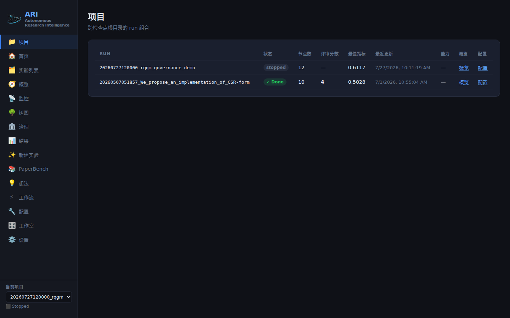
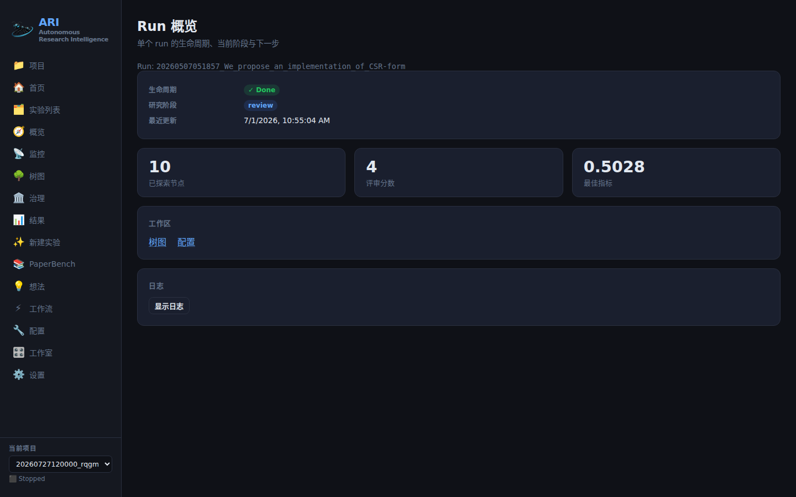
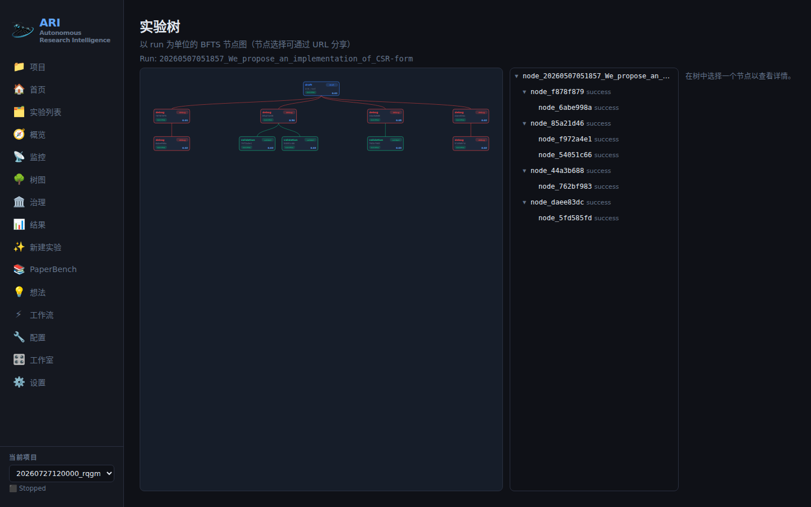
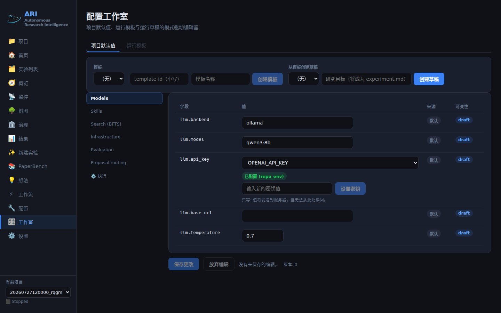

---
sources:
  - path: ari-core/ari/cli/commands.py
    role: implementation
  - path: ari-core/ari/viz/server.py
    role: implementation
  - path: ari-core/ari/viz/checkpoint_finder.py
    role: implementation
  - path: ari-core/ari/viz/checkpoint_lifecycle.py
    role: implementation
  - path: ari-core/ari/viz/api_capabilities.py
    role: implementation
  - path: ari-core/ari/viz/frontend/src/App.tsx
    role: implementation
  - path: ari-core/ari/viz/frontend/src/app/routeRegistry.ts
    role: implementation
  - path: ari-core/ari/viz/frontend/src/components/Layout/Sidebar.tsx
    role: implementation
  - path: ari-core/ari/viz/frontend/src/components/Overview/OverviewPage.tsx
    role: implementation
  - path: ari-core/ari/viz/frontend/src/components/Overview/LogsPanel.tsx
    role: implementation
  - path: ari-core/ari/viz/frontend/src/components/TreeV2/TreeV2Page.tsx
    role: implementation
  - path: ari-core/ari/viz/frontend/src/components/TreeV2/TreeTablePanel.tsx
    role: implementation
  - path: ari-core/ari/viz/frontend/src/shared/realtime/eventStream.ts
    role: implementation
  - path: ari-core/ari/viz/frontend/src/hooks/useRunEvents.ts
    role: implementation
  - path: ari-core/ari/viz/v1/logs.py
    role: implementation
  - path: ari-core/ari/viz/v1/router.py
    role: implementation
  - path: ari-core/ari/viz/frontend/src/__tests__/routeNavParity.test.tsx
    role: test
  - path: ari-core/tests/test_launch_config.py
    role: test
  - path: ari-core/ari/viz/frontend/scripts/capture_screenshots.mjs
    role: doc
  - path: scripts/setup/setup_env.sh
    role: config
last_verified: 2026-08-07
---

# 仪表盘指南

按当前发布形态走一遍 ARI 仪表盘：如何启动服务器、每个工作区回答什么问题、
如何把「你正在看的东西」原样分享出去，以及新鲜度横幅意味着什么。

仪表盘并排运行两套外壳。**v2 工作区**（Projects、Overview、Tree、Ideas、
Results、Governance、Config、Studio）由一个服务端能力标志门控；而每一个
**legacy 页面**在两种模式下都保持注册且可通过其原始 URL 访问。什么都没有
被删除。

## 启动服务器

两个入口，同一个服务器：

```bash
# 1. CLI — a checkpoint directory is a REQUIRED argument
ari viz path/to/checkpoints/20260727120000_my_run --port 8765

# 2. Module — checkpoint optional; pick one in the GUI afterwards
python -m ari.viz.server --port 8765
```

`start.sh` 使用形式 2（`ARI_GUI_PORT`，默认 `8765`），这样在你还没有选定
运行之前仪表盘就已经起来了。启动时你会看到：

```text
  ⚗️  ARI Viz running at http://localhost:8765/
  📁  Checkpoint: /…/checkpoints/20260727120000_my_run
  🔌  WebSocket:  ws://localhost:8766/ws
  Ctrl+C to stop
```

WebSocket 总是监听 **HTTP 端口 + 1**。如果该端口不可达（隧道只转发了一个
端口，或代理没有重映射它），树的实时流会降级为轮询 —— 仪表盘照常工作。

默认情况下两个服务器都**仅绑定回环**（`127.0.0.1`，以及可用时的 `::1`）。
任何超出 `localhost` 的暴露都需要显式选择加入 —— 见
[远程访问](remote_access.md)。

React 打包产物从 `ari-core/ari/viz/static/dist/` 提供。如果该目录缺失或过期，
请在 `ari-core/ari/viz/frontend/` 下用 `npm ci && npm run build` 重新构建
（Vite 会直接写入 `../static/dist`）。

## 服务器启动时选中哪个检查点

两个入口的差别不只是顺手与否。`ari viz <dir>` 把检查点目录作为**必填**参数，
因此活动检查点就是你指定的那一个。`python -m ari.viz.server` 则让它可选 ——
而在不带检查点启动时，服务器并**不会**保持为空。

这种情况下，它会枚举检查点列表所用的同一批搜索根目录下的每一个检查点，
采用目录 mtime 最新的那一个作为进程级全局活动检查点，然后从该检查点的
`launch_config.json`（若不存在则回退到其父目录中的 `launch_config.json`）
恢复 launch config 状态（模型、提供方、profile）。

只有名字符合 run id 形状的目录才是候选 —— 8 到 14 位数字后跟一个下划线，
例如 `20260727120000_my_run` —— 并且 `experiments`、`__pycache__` 和 `.git`
会被跳过。如果没有任何匹配，则什么都不会被选中，需要检查点的端点会以
*"No active project"* 错误拒绝。

在信任屏幕上的内容之前，这个自动采用有两个性质值得知道：

- **它不会被告知。** 启动横幅打印的是你传入的参数 —— 什么都没传时字面上就是
  `Checkpoint: None` —— 并且在随后采用了某个检查点时也不会被改写。
- **它不是按标签页的。** 每个服务器进程只有一个选择。连到这台服务器的所有
  浏览器标签页共享它，在一个标签页里使用侧边栏的项目选择器，会对所有标签页
  生效。

启动之后哪些操作会移动这个全局选择：

| 操作 | 对全局选择的影响 |
|---|---|
| 侧边栏的项目选择器（`POST /api/switch-checkpoint`） | 设为所选的检查点 |
| legacy 的 `POST /api/launch` | 指向该次启动刚刚预创建的运行目录 |
| 删除当前活动检查点 | 清空 —— 此后没有任何选中项 |
| 在没有选中项时通过向导上传文件 | 创建一个 staging 目录，并把*它*作为选择 |
| Studio 的启动（`POST /api/v1/runs`） | **无** —— 这是有意为之，见 [配置工作室](configuration_studio.md) |

因此，裸重启之后 legacy 页面描述的运行是「最后被触碰过的那个检查点」，
未必是你关心的那个。服务器自身的 HTTP 访问日志也遵循同一个选择：它被追加到
`{活动检查点}/viz_access.jsonl`，所以在没有传检查点参数时，那些请求行会落到
被自动采用的运行里。

v2 工作区不受影响。涉及单个运行的 `/api/v1` 读取是从请求自身的 `run_id`
解析检查点的，而不是从全局选择，因此 `?run=` 深链接无论那个选择是什么都
渲染同样的内容。当你需要确定性时，请传入显式的检查点路径，或使用 v2 深链接。

## 能力标志

前端在挂载时请求一次 `GET /api/capabilities`：

```json
{"gui_v2": true, "server_version": "wave1"}
```

除非服务器环境设置了 `ARI_GUI_V2=0` 或 `ARI_GUI_V2=false`，否则 `gui_v2`
为 `true`。这里有两个有意为之的行为：

- **失败即开放（fail-open）。** 如果能力查询本身失败，前端仍保持 v2 外壳
  开启。一次 API 抖动绝不应把本地用户丢进回退外壳。
- **无需重新构建即可回滚。** 导出 `ARI_GUI_V2=0`，重启服务器，刷新页面：
  仅 v2 的路由会像未知 hash 一样解析到 Home，它们的侧边栏条目消失，legacy
  条目回归。无需重新部署，也无需改动打包产物。

`ARI_GUI_V2` 与其他 GUI 开关一起记录在 `scripts/setup/setup_env.sh` 中。

## 工作区地图

每一个导航条目（标签、图标以及点击写入的 hash）都来自单一路由注册表，因此
侧边栏不可能与路由器彼此漂移（由 `src/__tests__/routeNavParity.test.tsx`
固定）。侧边栏再把这些条目排成一个主操作加四个固定分组。在 `gui_v2` 开启时，
它呈现为：

| 分组 | 位置 | 写入的 hash | 类别 |
|---|---|---|---|
| *（主操作）* | ✨ 新建实验 | `#/new` | legacy（`#/wizard` 的别名） |
| 工作区 | 📁 项目 | `#/projects` | 仅 v2 |
| 工作区 | 🏠 仪表盘 | `#/home` | legacy |
| 工作区 | 🗂️ 实验归档 | `#/experiments` | legacy |
| 当前实验 | 🧭 概览 | `#/overview?run=` | 仅 v2 |
| 当前实验 | 💡 想法 | `#/ideas2?run=` | v2 **接管**了 legacy Idea 位置 |
| 当前实验 | 🌳 研究树 | `#/tree2?run=` | v2 **接管**了 legacy Tree 位置 |
| 当前实验 | 📡 运行监控 | `#/monitor` | legacy |
| 当前实验 | 📊 论文与结果 | `#/results2?run=` | v2 **接管**了 legacy Results 位置 |
| 评估与治理 | 🏛️ 治理 | `#/governance?run=` | 仅 v2 |
| 评估与治理 | 📚 PaperBench | `#/paperbench` | legacy |
| 系统 | ⚡ 工作流 | `#/workflow` | legacy |
| 系统 | 🔧 运行配置 | `#/config?run=` | 仅 v2 |
| 系统 | 🎛️ 配置工作室 | `#/studio` | 仅 v2 |
| 系统 | ⚙️ 设置 | `#/settings` | legacy |

分组标题只是标签，不携带任何状态；把侧边栏拖窄到只剩图标时它们会消失。
当前运行的选择器位于整个导航之上，因此你先确认在操作什么，再选择工作区。

「接管」仅意味着点击所写入的 hash 发生了变化 —— 该位置保留 legacy 的标签、
图标与排位，而 `#/tree`、`#/results`、`#/idea` 在你手动输入或使用书签时
仍然解析到 legacy 页面。

穿过 v2 工作区的预期路径：

```text
Projects ──► Overview ──┬──► Tree      (#/tree2?run=&node=)
  (portfolio) (one run) ├──► Ideas     (#/ideas2?run=)
                        ├──► Results   (#/results2?run=)
                        ├──► Governance(#/governance?run=)  RQGM runs only
                        └──► Config    (#/config?run=)

Studio (#/studio) ──► project defaults / run template / run draft ──► launch
```

**Projects**（`#/projects`）把检查点搜索根目录下找到的每一个运行，作为一个
虚拟的 `default` project 列出，上方还有四个计数磁贴（全部实验 / 运行中 /
已完成 / 需要关注）。每一行的「打开」列链接到该运行的 Overview、论文与结果
页面以及运行配置；点击行本身会进入 run 显式的 `#/results?run=<run_id>`
（旧的 `sessionStorage` 交接仍会一并写入，仅作为老调用方的兼容回退）。
RQGM 与论文能力现在是 run id 旁边的徽章，而不再是独立的一列。



**Overview**（`#/overview?run=`）是每个运行的落地页：生命周期徽章、当前
*研究阶段*（`idle`/`starting`/`bfts`/`paper`/`review`）、最后更新时间、
节点数 / 评审分数 / 最优指标、工作区链接、阻塞项面板，以及可折叠的日志
浏览器。对于 RQGM 运行，*治理阶段*会渲染成它自己独立的一行 —— 研究阶段与
治理阶段绝不会被合并成一个标签，二者也互不蕴含。



**Tree**（`#/tree2?run=&node=`）是 run 显式的节点图加一个检查器。
**Ideas**（`#/ideas2?run=`）展示 `idea.json`（空白分析、主指标、生成的假设）
以及来自运行树的 BFTS 假设列表。**Results**（`#/results2?run=`，页面标题为
*论文与结果*）是一个只读摘要：评审分数、ORS 可重现性链条，以及以徽章链形式
呈现的 EAR 发表谱系。当运行已有论文时，它还会给出两个外链 ——「预览 / 编辑
论文」（legacy 工作区 `#/results?run=`）与「打开原始 PDF」—— 但它自身不做
任何修改。



节点卡片的颜色编码的是 BFTS 的 **label**（`draft` 蓝、`improve` 紫、
`ablation` 琥珀、`debug` 红、`validation` 绿）；运行状态是卡片内单独的徽章
以及表格每行旁的文字。这两项事实都不会只靠颜色来传达。

**Governance**（`#/governance?run=`）是 RQGM 工作区 —— 见
[RQGM 治理工作区](rqgm_gui.md)。**Config**（`#/config?run=`）与
**Studio**（`#/studio`）在[配置工作室](configuration_studio.md)中介绍。




Studio 也是为**新建**运行选择执行模式（`simple_bfts` / `ari_rqgm`）与论文模式
（`linear` / `rqgm_archive`）的地方；RQGM 治理与调优参数本身仍然仅限配置
文件，并且没有任何页面能更改一个已经存在的运行的模式。

**运维**目前并不是单独一个路由。进程控制、资源与 GPU 监控位于 legacy 的
`#/monitor` 页面；secret、环境变量键与 SLURM / container / SSH 设置位于 `#/settings`；面向运维者的
探针是 HTTP 端点（`/health/live`、`/health/ready`、`/api/v1/diagnostics`）
而不是页面 —— 见[远程访问](remote_access.md)。

## Run 显式的 URL 与深链

每个 v2 工作区都从 **hash 查询串**读取它的 run，而不是从某个隐藏的会话
变量：

```text
#/overview?run=20260727120000_my_run
#/tree2?run=20260727120000_my_run&node=node_17
#/ideas2?run=20260727120000_my_run
#/results2?run=20260727120000_my_run
#/governance?run=20260727120000_my_run
#/config?run=20260727120000_my_run
#/studio?template=hpc-baseline
#/studio?draft=draft-0a1b2c3d4e5f
```

值得知道的后果：

- **URL 就是状态。** 在 Tree 工作区中选中一个节点 —— 无论是画布点击、表格
  点击，还是在表格中按 <kbd>Enter</kbd> —— 都会把 `?node=` 写回 hash。复制
  地址栏，你就分享了你当时正在看的那个确切节点；画布与侧边表格都会从这一个
  URL 重新渲染。
- **两个运行绝不混淆。** 查询缓存与实时订阅都以 run id 为键，因此运行 B 的
  事件绝不可能刷新运行 A 的视图。在两个浏览器标签页中打开两个不同的
  `?run=` 值是安全的。
- **不带 `?run=` 打开页面**会得到一条明确提示（「No run selected —— open
  this page as `#/tree2?run=<run_id>`」），而不是一个错误，也不是别人的运行。
- 从 Tree 检查器出发的 Governance 深链有意只携带 `?run=` —— Governance 页面
  把节点选择作为自己的组件状态来拥有，UI 会如实说明这一点，而不是假装已经
  预先选中了某个节点。

## 实时更新、陈旧与重连

v2 工作区订阅 `GET /api/v1/events/stream`（Server-Sent Events），并使用
服务端的 `run_id` 与 `topics` 过滤（`run`、`tree`）。

这个契约是刻意的：**事件是失效通知，绝不是数据。** 一个事件告诉页面「这个
资源变了」；页面随后重新抓取带类型的 `/api/v1` 快照。因此重复或乱序的事件
都无害，而你看到的任何东西都不是由部分事件拼装出来的。

客户端跟踪三种连接状态：

| 状态 | 含义 | 会发生什么 |
|---|---|---|
| `live` | 流已打开 | 正常；无横幅 |
| `reconnecting` | 流出错，正在重试 | 最后一份快照保留在屏幕上并显示新鲜度横幅；退避 1s → 2s → 4s ……上限 30s，并携带 `last_event_id` 以确保不跳过任何事件 |
| `offline` | 错误持续超过 60s | 重连继续进行，**同时**启动一个有界的 10s 轮询滴答来刷新该订阅自身的范围 |

只要状态不是 `live`（或者在快照已在屏幕上时后台重新抓取失败），页面就会
显示共享的新鲜度横幅：

> Showing last known data.  Last updated: *&lt;timestamp&gt;*   [Refresh]

请照字面理解它。它的意思是「这个视图可能滞后」，**而不是**「运行停止了」。
流卡住与运行停止是两个不同的事实，仪表盘绝不会把其中一个转换成另一个。
Refresh 按钮会立即强制重新抓取快照。

legacy 的树 WebSocket（HTTP 端口 + 1）是一条独立通道，有它自己的指数退避
重连；当它连不上时，legacy 页面会回落到 5 秒一次的 `/state` 轮询。

## 树中的键盘导航

`#/tree2` 把同一组可见节点渲染两次：D3 画布与一个窗口化的侧边表格。该表格
是一棵真正的 ARIA 树（`role="tree"` / `role="treeitem"`，带 `aria-level`、
`aria-expanded`、`aria-selected`）并使用漫游 tabindex，因此它是画布在键盘上
的完备等价物：

| 按键 | 动作 |
|---|---|
| <kbd>↓</kbd> / <kbd>↑</kbd> | 移动获得焦点的行 |
| <kbd>→</kbd> | 展开获得焦点的子树 |
| <kbd>←</kbd> | 折叠获得焦点的子树 |
| <kbd>Enter</kbd> | 选中该节点 → 写入 `?node=` 并打开检查器 |

焦点按节点 id 跟踪，因此展开或折叠绝不会悄悄把焦点跳到另一个节点。只有
视口内的行（外加少量 overscan）存在于 DOM 中，因此一棵 10 000 节点的树
仍然只渲染约 40 行。

**大树会被缩减，但绝不静默。** 超过细节层级阈值后，视图会折叠为较浅的结构
深度，加上所选节点的祖先路径及其子节点，并且明确说明它做了什么：

> Showing 312 of 10420 nodes (depth-limited)   [Expand all]

展开一棵超大的树会把横幅切换为「Showing all 10420 nodes」，并提供返回深度
限制的入口。计数始终可见；仪表盘绝不会把一棵被剪枝的树当成整棵树来展示。

## 日志浏览器

Overview 页面内嵌了一个覆盖该运行追加写入的 `{checkpoint}/ari.log` 的可折叠
日志浏览器。它默认折叠，在你打开它之前不会抓取任何东西。

- **游标 = 原始字节偏移。** [Load more] 会追加下一页有界内容，无空洞、无重复。
- **过滤不会破坏分页。** 大小写不敏感的子串过滤只决定被扫描到的行中哪些被
  *返回*，绝不决定哪些字节被*消费*，因此在分页链中途更改过滤条件不可能
  破坏游标。
- **只有已提交的行。** 末尾缺少换行符的行不会被发出；游标停在它的第一个
  字节处，一旦换行符落盘就把它提供出来。你永远不会看到半行日志。
- **有界读取。** 每个请求从游标处最多扫描 1 MiB —— 浏览器绝不会整体读取一个
  5 MB 的文件。如果窗口在达到页大小上限之前就结束，你会得到已找到的内容
  加上一个前进了的游标。
- **跟随尾部**是事件驱动的，而不是定时器：每送达一个 run 事件就恰好触发一次
  从 `next_cursor` 开始的抓取。在流断开的情况下跟随时，该面板会显示它自己的
  新鲜度横幅 —— 同样地，那是「日志视图可能滞后」，而不是「运行停止了」。
- 还没有 `ari.log` 的运行会诚实作答（「No log file yet」），而不是展示一个
  空却看似健康的日志。

PaperBench 作业日志与 legacy 的整文件 `/api/logs` 流，请使用下文描述的
legacy 页面。

## legacy 页面，以及何时使用它们

每一个 legacy 路由都仍然存在、仍然可用 —— 在两种标志状态下都是如此。当 v2
工作区被刻意设计为只读时，就该找它们：

| legacy 路由 | 仍然是唯一能做这些事的地方 |
|---|---|
| `#/home` | 经典的单检查点落地页 |
| `#/experiments` | 带谱系列的检查点列表 |
| `#/monitor` | 启动/停止阶段、进程控制、资源 + GPU 监控 |
| `#/tree` | 原始的树页面（v2 工作区复用了它的 D3 组件） |
| `#/results` | 完整的论文/PDF 编辑器**以及每一个 EAR 变更操作** —— 策展、`publish.yaml` 编辑、发布、提升 |
| `#/new`（`#/wizard`） | 原始的引导式启动向导 |
| `#/idea` | 当前检查点由 `/state` 推导出的 idea 卡片 |
| `#/workflow` | React-Flow workflow 编辑器、技能阶段、被禁用的工具 |
| `#/settings` | `/api/settings` 的完整环境变量键面与 Developer Mode 开关（8 个进入 allowlist 的 secret —— 6 个 API key 加上 `ZENODO_TOKEN` 与 `ARI_REGISTRY_TOKEN` —— 也可以从 Config Studio 的 secret field 写入） |
| `#/paperbench`、`#/paperbench/import`、`#/paperbench/run`、`#/paperbench/results` | 整个 PaperBench 接口面（见 [PaperBench GUI 指南](paperbench/paperbench_gui.md)） |

v2 的 Results 工作区正是出于这个原因链接到 `#/results`，并在页面上如实说明：
*「本工作区为只读 —— 整理、publish.yaml 编辑、发布与提升仅在旧版页面执行。」*

有两个 legacy 行为为安全起见发生了变更，在你点击之前值得知道：

- **workflow 写入需要一个活动的 project。** 在没有选中检查点时，workflow
  写入端点会以 400 拒绝，而不是静默改写捆绑的 `workflow.yaml`。
- **破坏性操作是两步的。** 删除检查点、停止全部进程以及停止 GPU 监控，现在
  都需要一个服务器签发的一次性确认挑战；对话框会展示服务器回显的确切目标。
  见[远程访问](remote_access.md)。

**开发者模式**是一个纯客户端开关（`localStorage['ari_dev_mode']`），它会
展现原始 JSON 标签页、原始 YAML 编辑器与完整堆栈跟踪。它只改变展示密度 ——
它不是一条授权边界。

## 重新生成这些截图

本页（以及[快速入门](../getting-started/quickstart.md)、
[配置工作室](configuration_studio.md)、[RQGM 治理工作区](rqgm_gui.md)）中的
截图，都是用 `npm run capture:screenshots` 从一台真实运行的服务器上拍摄的，
共 15 条路由 × 3 种语言。外壳的任何改动都会一次性让这 45 张全部失效，因此
它们总是一起重新生成 —— 半更新的一套比整体陈旧的一套更糟，因为读者无法
分辨哪一页才是当前的。

命令、Governance 截图所需的 RQGM 夹具检查点，以及无头 Chromium 的字体与
库依赖，都只在脚本旁边记录一次：
[`ari-core/ari/viz/frontend/scripts/README.md`](../../../ari-core/ari/viz/frontend/scripts/README.md)。
拍摄前请先阅读 —— 字体缺失时拍摄仍会以退出码 0 「成功」，并静默写出一堆
豆腐块。所以最后一步永远是：打开图片，用眼睛看。

## 另请参阅

- [配置工作室](configuration_studio.md) —— 检视、编辑并从配置启动。
- [RQGM 治理工作区](rqgm_gui.md) —— Governance 各标签页。
- [远程访问](remote_access.md) —— 超出 localhost 的绑定、token、健康探针。
- [执行模式](execution_modes.md) —— 一次运行如何从配置、环境变量或 Studio
  成为 RQGM 运行。
- [GUI 切换运行手册](gui_cutover_runbook.md) —— 标志的推出与回滚手段。
- [REST API 参考](../reference/rest_api.md) —— legacy JSON API。
- [环境变量](../reference/environment_variables.md)。
