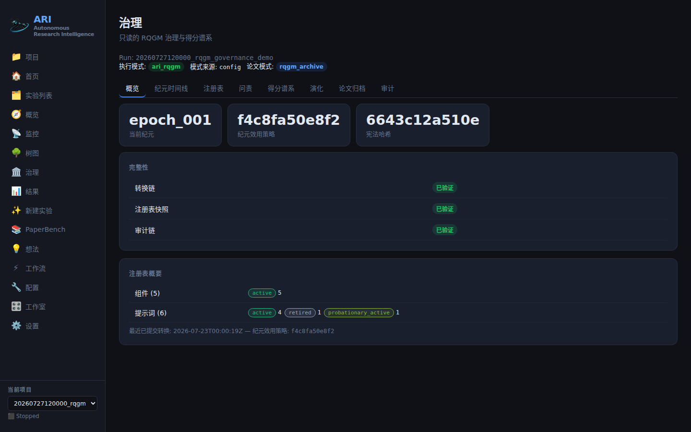

---
sources:
  - path: ari-core/ari/viz/v1/rqgm.py
    role: implementation
  - path: ari-core/ari/viz/v1/dto.py
    role: implementation
  - path: ari-core/ari/viz/v1/router.py
    role: implementation
  - path: ari-core/ari/viz/frontend/src/components/Governance/GovernancePage.tsx
    role: implementation
  - path: ari-core/ari/viz/frontend/src/components/Governance/OverviewTab.tsx
    role: implementation
  - path: ari-core/ari/viz/frontend/src/components/Governance/RegistryTab.tsx
    role: implementation
  - path: ari-core/ari/viz/frontend/src/components/Governance/AccountabilityTab.tsx
    role: implementation
  - path: ari-core/ari/viz/frontend/src/components/Governance/ScoreLineageTab.tsx
    role: implementation
  - path: ari-core/ari/viz/frontend/src/components/Governance/EpochTimelineTab.tsx
    role: implementation
  - path: ari-core/ari/viz/frontend/src/components/Governance/EvolutionTab.tsx
    role: implementation
  - path: ari-core/ari/viz/frontend/src/components/Governance/PaperArchiveTab.tsx
    role: implementation
  - path: ari-core/ari/viz/frontend/src/components/Governance/AuditTab.tsx
    role: implementation
  - path: ari-core/ari/viz/frontend/src/components/Governance/shared.tsx
    role: implementation
  - path: ari-core/tests/test_gui_v1_rqgm.py
    role: test
  - path: ari-core/ari/viz/frontend/src/components/Governance/__tests__/GovernancePage.test.tsx
    role: test
last_verified: 2026-07-30
---

# RQGM 治理工作区指南

`#/governance?run=<run_id>` 是通向单次运行 RQGM 治理记录的只读窗口：存在
哪些机构、它们彼此做了什么，以及这如何改变了得分。

**GUI 对治理是只读的。** `/api/v1` 的 RQGM 接口面上根本不存在变更端点 ——
`/api/v1/runs/{run_id}/rqgm/*` 下的每一个路由都是 GET。你在这个工作区里点击
任何东西，都不会注册组件、采纳策略、开启纪元或改写得分。治理的变更来自运行
本身。（Studio 可以为**新建**运行选择 `ari_rqgm` —— 那决定的是一次运行执行
哪种算法，而不是这些机构做什么；见下文。）

该工作区也从不重新执行治理决策。读模型直接解析已提交的检查点工件
（`rqgm_state.json`、`rqgm_transitions.jsonl`、`rqgm_audit.jsonl`、
`rqgm_adversarial_cases.jsonl`、`rqgm_registry.json`、
`prompt_evolution.jsonl`、`rqgm_meta_outputs.jsonl`、
`paper_archive_state.json`，以及节点 metric 哨兵字段），不导入任何内核代码。
你看到的是一次重放，而不是一次重跑。

## 如何进入，以及能力状态

从运行的 Overview 打开该标签页，或者直接输入 URL。如果该运行没有
`rqgm_state.json`，你**不会**得到错误 —— 你会得到一个能力状态页面：

> **Governance is not active for this run**
> This is a capability state, not an error.
> This run executed in the `simple_bfts` execution mode, so no RQGM
> governance artifacts exist for it.
> To govern a run, launch it with execution mode `ari_rqgm`
> (`ari.mode: ari_rqgm`). Existing runs are never modified retroactively.

在它下面，三个 chip 总是一起渲染 —— **执行模式**、**模式来源**与
**论文模式** —— 因为执行模式（`ari.mode`）与论文模式（`paper.mode`）是独立
的两个轴，而单独的「mode」一词绝不会被用作标签。

工件存在性*就是*能力信号：`rqgm/capabilities` 对任何运行都作答，而其余 RQGM
路由对 `simple_bfts` 运行返回类型化的 404。要得到一次受治理的运行，你需要在运行
**开始时**选择 `ari_rqgm` —— 在 `workflow.yaml` 中、在环境变量中，或者在配置
工作室的 Execution 控件中（仅限新建运行；见[执行模式](execution_modes.md)与
[配置工作室](configuration_studio.md)）。在那里选择模式是一次启动决策，而不是
治理变更：它不注册组件、不采纳策略、也不改写得分，因此无论怎样这个工作区都保持
只读。97 个 `rqgm.*` 治理与调优参数仍然仅限配置文件。

标签条是一个真正的 `role="tablist"` 复合控件，带 `aria-selected` /
`aria-controls` 接线，因此完全可用键盘导航。

## 逐个标签页

标签条本身读作 **Overview · Epoch Timeline · Registry · Accountability ·
Score Lineage · Evolution · Paper Archive · Audit**。下面各节改按阅读顺序
组织：先看当前状态，再看两个节点作用域的标签页（Accountability 与 Score
Lineage 共享一个节点选择器），然后是全运行范围的时间线，最后是原始日志。

### Overview —— 「当前受治理的状态是什么？」

当前纪元、该纪元的效用策略哈希、宪法哈希、最后一次已提交转换的时间戳、按
状态分组的注册表计数，以及三个**三态**完整性标志。



*这张截图取自一个**夹具**检查点（`20260727120000_rqgm_governance_demo`），
它纯粹是为了拍摄这个工作区而生成的。图中的每一个哈希、纪元编号与计数都属于
那个道具 —— 你自己的值会不一样，也没有什么可以拿来对照。*

请照字面理解这三态：

| 徽章 | 取值 | 含义 |
|---|---|---|
| `verified` | `true` | 链/快照校验通过 |
| `broken` | `false` | 校验未通过 |
| `source missing` | `null` | 根本没有可校验的东西 |

缺失的来源**绝不会**被展示为干净。这个区分正是要点所在：「我们已核实没有
坏事发生」与「我们没有记录」是两种不同的断言。

当前状态是**已提交**转换的重放。撕裂的 JSONL 末行（写入中途被打断的追加）
会被忽略，而位于没有对应 commit 的 `epoch_transaction_prepare` 之后的事件
永远不会被采纳。

### Registry —— 「存在哪些机构，各自处于什么身份状态？」

基于已提交重放的两张表 —— 组件与提示词。身份状态使用闭合的 10 值生命周期
词汇表，逐字呈现：

`candidate` · `validated` · `shadow` · `probationary_active` · `active` ·
`warning` · `probation` · `quarantine` · `retired` · `banned`

活跃集合（`active` + `probationary_active`）的成员身份带有它自己的显式标记，
因此「已注册」绝不会被误认为「已生效」。

`rqgm_registry.json` 是一份**仅用于校验的 rollup 快照** —— 它的
`as_of_event_hash` 会与重放尾部比较，并报告为 `snapshot verified` /
`snapshot mismatch` / `snapshot missing`。该 rollup 永远不会成为当前状态。

请注意，节点得分状态（`computed`、`recomputed`、`stale`、`invalidated`、
`removed`）是一台**不同的状态机**，使用不同的配色族。两套词汇表在结构上被
分开，因此其中一套绝不可能借用另一套的含义。

### Accountability —— 「谁攻击了这个节点，攻击成立了吗？」

从选择器中选一个节点；你会得到两张清晰分开的表。

**原始攻击**是 `atk_*` 断言。这张表背后的 DTO 根本没有得分、惩罚或置信度
字段，表格渲染一个固定的 `no penalty (unadjudicated)` 单元格。一行原始记录
在*结构上*就不可能显示惩罚数值。这一列叫做 **Claimed severity**，因为它就是
这个意思：攻击者的断言。

**已验证攻击**是经过裁决的 `vat_*` 记录 —— 唯一可以驱动惩罚的那一类 ——
展示时带上其链式引用（原始 `atk_*` id → 判定 `jdg_*` id → 裁决结论、
严重度），并在存在时带上面向弹劾的字段（`target_component_id`、
`affected_components`）。

**在这里，区分原始攻击与已验证惩罚是最重要的一个习惯。** 一长串原始攻击
并不能证明某个节点糟糕；一张空的已验证攻击表也不能证明它清白。只有裁决链
才能把一项断言转化为一个后果。

### 「零攻击」意味着什么，又不意味着什么

记录到零次攻击是一个**数据点，而不是健康的证据**。UI 会在每一张空的对抗
表格旁边写明这一点。

工作区还会明确指出一种更强的情形。当该运行的注册表只包含探索侧对抗者角色
（没有 `paper_*` 角色）时，弹劾链根本无法触发 —— 这些对抗者针对的是不受治理
的生成器角色，因此再多的对抗活动也无法产生制裁。在这种配置下你会看到：

> **Impeachment chain structurally inert** — This run registers only
> exploration adversary roles, which target the ungoverned generator
> role — the impeachment chain cannot fire by design. Zero attacks here
> is a capability state, not evidence of health.

三种不同的情形，三种不同的读法：

1. **没有记录到攻击，链条是活的** —— 对抗者跑过了，没有找到值得立案的东西。
   这是较弱的正面证据。
2. **没有记录到攻击，链条是惰性的** —— 根本立不了案。完全没有证据。
3. **记录到了攻击，但没有一条被验证** —— 断言被提交，而裁决驳回了它们。
   这是一个治理结果，并且在已验证表的裁决结论中可见。

### Score Lineage —— 「这个节点的得分为何是现在这个值？」

针对一个节点的两条通道，绝不合并：

**通道 1 —— 对抗惩罚（纪元内）。** 一张瀑布表：基础分 → 已验证惩罚 →
最终分，来自 `UtilityRecord` 观测加上该节点的 metric 哨兵字段
（`_pre_penalty_score`、`_validated_attack_penalty`、`_scientific_score`、
`_utility_policy_hash`、`_stale`）。Evidence 一列列出该记录所引用的、经过
裁决的 `vat_*` id。**每一行都写明它的策略哈希** —— 得分绝不脱离其策略身份
单独展示。

**通道 2 —— 纪元效用策略历史（全运行范围）。** 观测按策略哈希**分面**：
每个哈希一个带边框的分面，并附常驻说明：

> Scores under different policy hashes are not comparable; each policy
> hash is shown as its own facet, never one continuous series.

**分面为什么重要。** 一个效用策略定义了得分*意味着什么*。当纪元边界取代了
该策略后，前后的数字是在不同仪器上做的测量。把它们画成一条线会制造出一个
并不存在的趋势。没有哈希的观测归入 `unknown` 分面，绝不会被折进某个带哈希
的分面。

在两条通道之下是全运行范围的上下文：**Epoch utility policies** 表（哈希、
生命周期状态、使用过的纪元、经由哪次转换被采纳，以及一次性写入的正文 ——
仅当存储字节能与注册哈希校验通过时才展示，否则显示
`body withheld (hash mismatch)`，绝不猜测），以及 **Score rewrites (policy
supersessions)** 表，它把每次效用策略取代与其后果连接起来：源策略 →
目标策略、被失效的节点、需重算的节点、前沿移除与前沿恢复。这些节点集合来自
真实的事件字段 —— 它们不是由 GUI 重新计算的。

缺失的数字渲染为 `unknown`，绝不渲染为 `0`。

### Epoch Timeline —— 「每个边界上发生了什么？」

来自转换重放的已提交纪元，每个纪元自成一个分面。

这里**有意不提供跨纪元的得分比较 UI**，标签页本身也如实说明：

> No cross-epoch score comparison is offered: epochs with different
> utility policy hashes are not directly comparable, so each epoch renders
> as its own facet.

缺失就保持为缺失：

- 仍在开放中的纪元没有已提交的边界事务，因此它显示
  *「No committed boundary transaction yet — transition counts do not exist
  (this is absence, not zero activity)」*，而不是一行零；
- 除非真实的 `epoch_transition` 审计记录提供了该数组，否则 `fallbacks`
  渲染为 *「fallbacks: unknown (no audit source)」*。

选中一个纪元会加载已提交的详情：序号、状态、开启时的节点数、上一个纪元、
注册表版本、纪元指纹；一次性写入的**效用策略正文**及其 5 个受治理的键
（`composite`、`axis_weights`、`frontier_score`、`depth_penalty_lambda`、
`ucb_c`）；开启与关闭边界事务，各自带有原始来源
（`rqgm_transitions.jsonl@<byte offset>`）；以及是否存在治理报告。

### Evolution —— 「提出了什么，又实际采纳了什么？」

按种类分组：提示词进化、效用策略进化、元输出。这种分隔是结构性的：

- 每一行**都是一条原始候选记录**，带有它自己的候选状态词汇表，默认标注为
  `candidate (not adopted)`；
- 验证运行被单独计数 —— 那是验证的证据，而不是采纳的证据；
- `adopted` **只能**通过把提出的哈希与已提交注册表重放相连接而推导出来。
  被采纳的行会引用采纳它的那次转换（`Adopted via`）。提案记录永远无法自我
  提升；
- 元输出的 `adopted = null`，渲染为 `inert provenance (not adoptable)` ——
  这是一次观测，而不是一个失败的候选。

缺失的日志渲染为 *「`prompt_evolution.jsonl` not present for this run」*，
绝不渲染成一张空却看似健康的表。每一行都写明其原始来源，形式为
`file@offset`。

### Paper Archive —— 「论文是如何被选出来的？」

有界的标量，并在 UI 中强制两条独立性规则：

- **执行模式与论文模式是独立的两个轴。** 两个 chip 总是并排渲染并附显式
  说明；绝不会单独使用「mode」一词。
- **最佳信念草稿是一次经过评审的选择** —— 绝不与治理胜出者或研究结果等同。

这里缺失同样保持为缺失：当 `paper_archive_state.json` 不存在时，`linear`
chip 会**带着**「derived from absence」说明渲染（`state_present = false` 会
被呈现出来，因此这个推导是透明的而非编造的）；缺失的草稿归档显示
「not present」而不是 `draft_count` 为 0；而 `anchor.enabled = null` 意味着
「没有冻结的论文效用策略」—— 是未知，不是已禁用。

当 `anchor.enabled` 为 `false` 时，该标签页会逐字给出其后果：归档是经评审的
best-of-N，且写作者制裁无法触发。

### Audit —— 「把原始日志给我看」

一张基于 `rqgm_audit.jsonl` 的游标分页表，带 **Record type** 与 **Epoch**
过滤器以及一个 [Load more] 追加按钮。游标是后端的稳定字节偏移，因此追加的
页面绝不会重复这个追加写入日志中的行。更改过滤条件会开启一条全新的分页链
—— 一个被过滤的视图绝不可能继承另一种过滤下的行。

每一行都写明其原始来源：`rqgm_audit.jsonl@<byte offset>` 加上事件哈希。
表格以一句明确的 *「End of committed log」* 结束。

## 从聚合视图钻取到原始工件

该工作区的可追溯性规则是：每个聚合视图都必须能追溯回原始事件或工件。具体
而言：

| 你正在看的 | 该行上的钻取抓手 |
|---|---|
| 一条审计事件 | `rqgm_audit.jsonl@<byte offset>` + 事件哈希 |
| 一次纪元边界事务 | `rqgm_transitions.jsonl@<byte offset>` |
| 一个进化候选 | `prompt_evolution.jsonl@<offset>` / `rqgm_meta_outputs.jsonl@<offset>` |
| 一次得分观测 | 该记录的 id 以及它引用的 `vat_*` id |
| 一条注册表条目 | 产生其当前身份状态的 `source_event_ids` |
| 一次得分改写 | 它的转换 id 与 `source_event_ids` |

要从聚合视图追到字节，请取出偏移量并直接读取检查点内的文件，例如：

```bash
# the exact line an audit row came from
tail -c +$((OFFSET + 1)) "$CKPT/rqgm_audit.jsonl" | head -1 | python -m json.tool
```

偏移量是行首的 0 起始字节位置，这也正是它们对追加写入日志保持稳定的原因。
事件哈希契约按 schema 区分：旧的 `schema_version: 1` 记录只哈希 payload
（`sha256(canonical_json(payload))[:12]`）；而新写入的 `schema_version: 2`
记录携带全长的 `sha256(canonical_json({schema_version, event_id, event_type,
transaction_id, payload, prev_event_hash}))` —— 覆盖与重放相关的整个信封，
而不只是 payload。

## 降级与断裂的链

损坏的工件会得到诚实的 **带标志的 HTTP 200**，绝不是 500，也绝不是一片空白
的页面。有两个可见层次：

1. Overview 标签页上的**完整性标志**翻转为 `broken`（或 `source missing`），
   读模型附上 `degraded_reasons` 描述失败情况 —— 包括哈希链断裂处的字节
   偏移。
2. **降级面板**替换或伴随受影响的视图：

   > **Governance record degraded** — Parts of the governance record are
   > missing or inconsistent. This describes the governance artifacts
   > only — it does not mean the research run failed.

最后那句话是整个工作区有意坚持的不变式：**治理受阻 ≠ 研究失败。** 运行的
Overview 在呈现治理阻塞项时会重复这一点。

在链条断裂的情况下各行仍会渲染 —— 如实打上标志，而不是隐藏起来。审计链断裂
并不会抹掉审计表；它告诉你这张表不能再被当作防篡改证据来信任，而你仍然可以
自己沿着原始偏移量去核查。

## 另请参阅

- [执行模式](execution_modes.md) —— 开启 `ari_rqgm` 与论文模式。
- [RQGM 架构](../concepts/rqgm_architecture.md) —— 这些机构究竟是什么。
- [RQGM 评估指南](rqgm_evaluation.md) —— 运行并度量受治理的实验。
- [RQGM 工件 schema](../reference/rqgm_schemas.md) —— 磁盘上的记录形状。
- [仪表盘指南](dashboard.md) —— 导航、深链、新鲜度。
- [配置工作室](configuration_studio.md) —— 为新建运行选择执行模式/论文模式，
  以及为什么治理调优字段保持只读。
